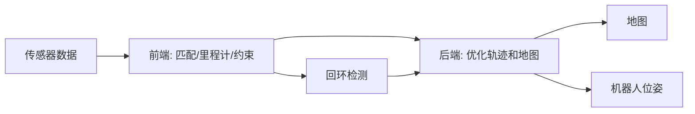

# 07. SLAM 理论

## 学习目标

学完本章，你应该能：

- 理解 SLAM、建图、定位的区别。
- 理解 SLAM 前端、后端、回环检测和地图表示。
- 区分 2D LiDAR SLAM、视觉 SLAM、视觉惯性 SLAM。
- 能分析建图失败、地图变形、定位漂移和回环错误。

## 1. SLAM 是什么

SLAM 是 Simultaneous Localization and Mapping：

```text
同时定位与建图
```

机器人在未知环境中：

- 不知道地图。
- 也不知道自己准确位置。

SLAM 要同时估计：

- 机器人轨迹。
- 环境地图。

## 2. 建图、定位、SLAM 的区别

| 概念 | 地图是否已知 | 位姿是否已知 | 目标 |
|---|---|---|---|
| 建图 | 未知 | 通常需要估计 | 生成地图 |
| 定位 | 已知 | 未知 | 求机器人在地图中的位置 |
| SLAM | 未知 | 未知 | 同时求地图和轨迹 |

AMCL 是定位，不是 SLAM。SLAM Toolbox 可以做 2D SLAM。

## 3. SLAM 基本框架



## 4. 前端

前端负责从传感器数据中提取约束。

常见任务：

- 特征提取。
- 帧间匹配。
- scan matching。
- 视觉里程计。
- LiDAR 里程计。
- 回环候选检测。

前端更偏“从数据中找到关系”。

例子：

- 当前激光扫描和上一帧扫描匹配，得到相对位姿。
- 当前图像和上一帧图像匹配，得到相机运动。

## 5. 后端

后端负责优化。

常见形式：

- EKF SLAM。
- Graph SLAM。
- Pose Graph Optimization。
- Bundle Adjustment。

图优化直觉：

- 每个机器人位姿是一个节点。
- 里程计、观测、回环是边。
- 优化目标是让所有约束误差尽量小。

## 6. 回环检测

回环指机器人回到以前到过的地方。

回环重要性：

- 纠正累计漂移。
- 让地图闭合。
- 提高全局一致性。

回环错误风险：

- 把两个相似但不同的地方误认为同一处。
- 导致地图严重变形。

## 7. 地图类型

| 地图 | 表示 | 适用 |
|---|---|---|
| 栅格地图 | 每个格子表示占用概率 | 2D 导航 |
| 点云地图 | 大量 3D 点 | 3D 感知和定位 |
| 特征地图 | 角点、线、描述子 | 视觉 SLAM |
| 位姿图 | 轨迹节点和约束 | 图优化 |
| 语义地图 | 带物体类别和区域含义 | 高级任务规划 |

## 8. 2D LiDAR SLAM

适合：

- 室内移动机器人。
- AMR/AGV。
- 清洁、配送、巡检机器人。

优点：

- 稳定。
- 工程成熟。
- 和 Nav2 结合方便。

缺点：

- 对玻璃、低矮障碍、动态人群敏感。
- 高度信息不足。

## 9. 视觉 SLAM

使用相机估计运动和地图。

类型：

- 单目 SLAM。
- 双目 SLAM。
- RGB-D SLAM。

挑战：

- 光照变化。
- 纹理不足。
- 运动模糊。
- 动态物体。
- 单目尺度不确定。

## 10. 视觉惯性 SLAM

融合相机和 IMU。

优点：

- IMU 提供高频运动信息。
- 相机提供环境约束。
- 比纯视觉更鲁棒。

难点：

- 时间同步。
- 相机-IMU 外参。
- IMU bias。
- 初始化。

## 11. 常见建图失败原因

| 现象 | 可能原因 |
|---|---|
| 地图越来越弯 | 里程计漂移、scan matching 不稳定 |
| 回到原点无法闭合 | 回环检测失败 |
| 地图突然扭曲 | 错误回环 |
| 墙体变厚 | 雷达外参或时间同步问题 |
| 长走廊定位不稳 | 环境退化，特征不足 |
| 动态人群导致地图脏 | 动态障碍未过滤 |

## 12. 学习路线

1. 先学里程计和坐标变换。
2. 学概率和状态估计。
3. 用 2D LiDAR SLAM 建图。
4. 理解 scan matching 和回环。
5. 再学图优化和视觉 SLAM。
6. 最后学习 VIO 和 3D LiDAR SLAM。

## 13. 练习

1. 用 SLAM Toolbox 建一张 2D 地图。
2. 记录 rosbag，重复回放建图。
3. 修改雷达外参，观察地图变形。
4. 在动态人多的环境建图，观察地图污染。
5. 对比建图模式和定位模式。

## References and further reading

- Probabilistic Robotics: https://probabilistic-robotics.org/
- State Estimation for Robotics: https://github.com/utiasSTARS/state-estimation-for-robotics
- SLAM Toolbox: https://github.com/SteveMacenski/slam_toolbox
- Navigation2 Documentation: https://docs.nav2.org/
- Open3D Registration Tutorial: https://www.open3d.org/docs/release/tutorial/pipelines/registration.html
