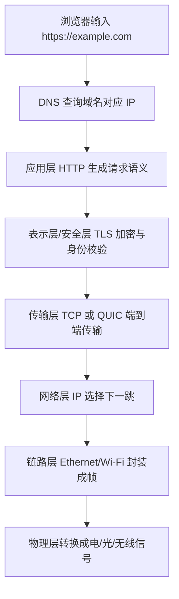

# 网络协议学习笔记总览

最后整理：2026-06-14

这个目录按 OSI 七层模型组织网络协议学习笔记。实际互联网工程主要使用 TCP/IP 分层，很多协议不会严格落在 OSI 某一层，例如 ARP 常被放在链路层和网络层之间，TLS 常被放在传输层之上、应用层之下，QUIC 又把传输、加密和多路复用合在一起。这里仍按 OSI 模型归档，是为了形成清晰的学习路径。

## 学习顺序

1. 先读 `协议学习路线与分层地图.md`，建立 OSI、TCP/IP、互联网、嵌入式、工业通信之间的整体地图。
2. 再读 `抓包与协议排查方法.md` 和 `常见协议端口与编号速查.md`，形成调试工具和编号索引。
3. 读 `01-物理层/00-物理层总览.md`，理解比特如何变成电信号、光信号或无线电波。
4. 读 `02-数据链路层/00-数据链路层总览.md`，理解同一链路内如何寻址、封装、校验、仲裁和转发。
5. 学 USB、Type-C、USB PD 时，先读 `01-物理层/USB与Type-C物理层.md`，再读 `02-数据链路层/USB总线协议.md`，分清连接器、电源协商、物理速率、枚举和端点。
6. 学嵌入式或工控串口时，读 `02-数据链路层/串口通信协议总览.md`，先分清 TTL UART、RS-232、RS-485、UART 帧、Modbus RTU、自定义协议的层次。
7. 继续读 `03-网络层/00-网络层总览.md`、`03-网络层/路由与MTU.md`、`03-网络层/NAT-网络地址转换.md`，理解跨网络寻址、路由、分片、MTU、NAT 和控制消息。
8. 再读 `04-传输层/00-传输层总览.md`，理解端到端通信、可靠性、拥塞控制和端口。
9. 读 `05-会话层/00-会话层总览.md`，理解连接会话、状态、认证上下文和调用会话。
10. 读 `06-表示层/00-表示层总览.md`，理解编码、序列化、压缩、加密和内容表示。
11. 最后读 `07-应用层/00-应用层总览.md`，把 HTTP、DNS、SMTP、DHCP、MQTT、WebSocket 等常见协议串起来。
12. 如果学习工业通信，再读 `07-应用层/工业通信协议总览.md`，并结合 `01-物理层/RS-485.md`、`07-应用层/Modbus.md`、`07-应用层/OPC-UA.md` 理解“电气层、现场总线、应用层协议、信息模型”的区别。

## 目录结构

| OSI 层 | 本目录 | 重点 |
|---|---|---|
| 第 1 层 物理层 | `01-物理层` | 信号、介质、编码、速率、双工、调制、RS-232/RS-485、USB/Type-C |
| 第 2 层 数据链路层 | `02-数据链路层` | 帧、MAC、交换、ARP、VLAN、Wi-Fi MAC、CAN、I2C/SPI、USB 枚举、串口通信分类 |
| 第 3 层 网络层 | `03-网络层` | IP 地址、路由、MTU、NAT、TTL/Hop Limit、ICMP、IPsec |
| 第 4 层 传输层 | `04-传输层` | 端口、连接、可靠传输、拥塞控制、UDP/QUIC |
| 第 5 层 会话层 | `05-会话层` | 会话建立、保持、恢复、RPC、会话控制 |
| 第 6 层 表示层 | `06-表示层` | 数据表示、字符集、ASN.1、MIME、TLS |
| 第 7 层 应用层 | `07-应用层` | 面向业务的协议：HTTP、DNS、DHCP、SMTP、FTP、MQTT、WebSocket、Modbus、OPC UA、CANopen |

## 一个请求经过网络栈的简化路径

## 推荐抓包与排查工具

| 工具 | 用途 | 示例 |
|---|---|---|
| Wireshark | 图形化抓包与协议解析 | 过滤 `tcp.port == 443` |
| tcpdump | 服务器命令行抓包 | `tcpdump -i eth0 host 8.8.8.8` |
| ping | ICMP 连通性与 RTT | `ping 8.8.8.8` |
| traceroute / tracert | 路由路径排查 | `tracert example.com` |
| nslookup / dig | DNS 查询 | `nslookup example.com` |
| curl | HTTP/TLS 调试 | `curl -v https://example.com` |
| ip / route / netstat / ss | 地址、路由、连接状态 | `ss -tanp` |
| 串口助手 | RS-232/RS-485/Modbus RTU 调试 | 发送十六进制帧 |
| 逻辑分析仪/示波器 | UART/I2C/SPI/CAN/USB 低速信号波形排查 | 检查波特率、时序、电平 |
| USBView / lsusb | USB 枚举、描述符、速率、驱动排查 | `lsusb -t` |
| USB PD 分析仪 | Type-C/PD 供电协商排查 | 抓 Source Capabilities、Request、PS_RDY |
| mosquitto_pub/sub | MQTT 发布订阅调试 | `mosquitto_sub -t 'device/#' -v` |
| wscat / 浏览器 DevTools | WebSocket 握手和消息调试 | 查看 WS Frames |
| UaExpert | OPC UA 浏览、读写和订阅 | 浏览 Address Space |

## 参考入口

- RFC Editor: <[https://www.rfc-editor.org/](https://www.rfc-editor.org/)>
- IETF Datatracker: <[https://datatracker.ietf.org/](https://datatracker.ietf.org/)>
- IEEE 802 Standards: <[https://standards.ieee.org/ieee/802/](https://standards.ieee.org/ieee/802/)>
- USB-IF Document Library: <[https://www.usb.org/documents](https://www.usb.org/documents)>
- IANA Protocol Registries: <[https://www.iana.org/protocols](https://www.iana.org/protocols)>
- Wireshark Documentation: <[https://www.wireshark.org/docs/](https://www.wireshark.org/docs/)>
- MDN Web Docs HTTP: <[https://developer.mozilla.org/en-US/docs/Web/HTTP](https://developer.mozilla.org/en-US/docs/Web/HTTP)>
- Modbus Organization Specifications: <[https://www.modbus.org/specs.php](https://www.modbus.org/specs.php)>
- CAN in Automation: <[https://www.can-cia.org/](https://www.can-cia.org/)>
- PROFIBUS & PROFINET International: <[https://www.profibus.com/](https://www.profibus.com/)>
- OPC Foundation: <[https://opcfoundation.org/](https://opcfoundation.org/)>
