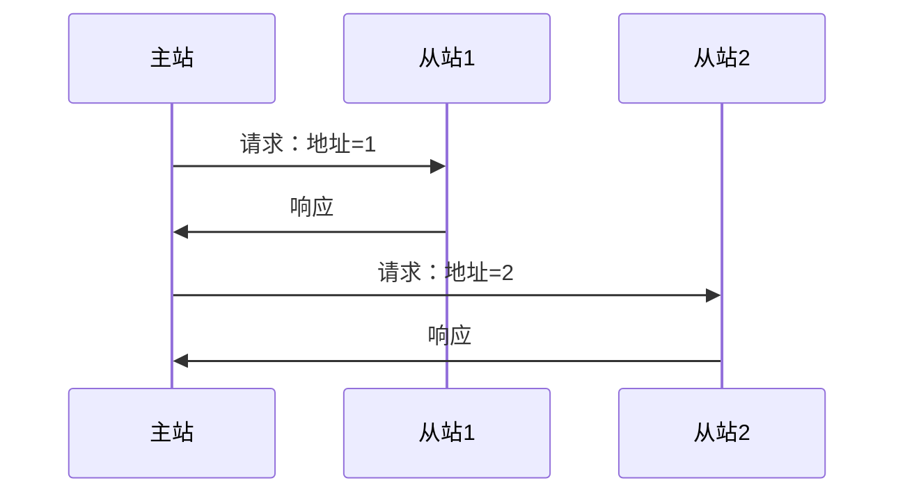
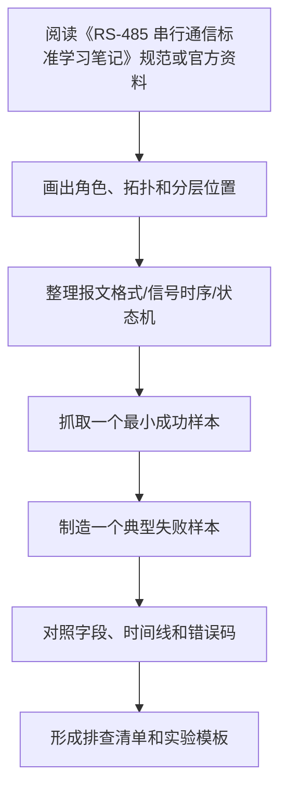

# RS-485 串行通信标准学习笔记

最后整理：2026-06-11

RS-485 是工业现场非常常见的差分串行电气标准。它适合长距离、多节点、抗干扰通信。很多人把“RS-485”和“Modbus”混在一起说，但二者不是一回事：RS-485 定义电气层，Modbus RTU 定义应用层报文。

## 协议定位

RS-485 属于物理层标准，主要定义差分信号、电气特性、多点总线能力和驱动/接收要求。它不规定寄存器地址、功能码、CRC，也不规定主从关系；这些通常由 Modbus RTU 或自定义协议定义。

## 解决的问题

- 工业现场线缆长、噪声大，RS-232 不够可靠。
- 一个主站需要连接多个从站设备。
- 需要用低成本双绞线实现稳定串行通信。

## 核心特性

| 特性 | 说明 |
|---|---|
| 信号方式 | 差分信号，常见 A/B 或 D+/D- |
| 拓扑 | 总线型，多点连接 |
| 通信方向 | 常见二线半双工，也可四线全双工 |
| 介质 | 双绞线，工业现场常用屏蔽双绞线 |
| 节点数 | 受收发器单位负载、线缆和速率影响 |
| 上层协议 | Modbus RTU、自定义协议、Profibus 物理层变体等 |

## 半双工 RS-485

二线半双工 RS-485 同一对线既发送又接收，同一时刻通常只能一个设备发送。常见通信模型是主站轮询：



## 布线原则

| 原则 | 说明 |
|---|---|
| 总线拓扑 | 尽量一条主干串接，避免星型分叉 |
| 终端电阻 | 总线两端常加匹配电阻，减少反射 |
| 偏置电阻 | 总线空闲时提供确定状态，避免悬空误触发 |
| 屏蔽接地 | 工业现场要规划屏蔽层和接地，避免地环路 |
| 支线长度 | 支线越短越好，长支线容易反射 |

## A/B 标识混乱

不同厂家对 A/B、D+/D- 的命名可能相反。排查时不要只相信字母，最好看手册对逻辑电平的定义，必要时尝试对调 A/B。

## 常见问题

- 只接 A/B 不接参考地，长线或强干扰下可能不稳定。
- 总线两端没有终端电阻，高速或长距离时误码多。
- 每个节点都加终端电阻，导致负载过重。
- 主站发送后没有及时释放驱动使能，导致从站响应被压住。
- 多个从站地址重复，响应冲突。
- 波特率、校验位、停止位不一致，表现为乱码或 CRC 错误。

## 排查建议

1. 确认上层协议和串口参数，例如 Modbus RTU `9600 8N1` 或 `9600 8E1`。
2. 确认 A/B 极性，必要时对调测试。
3. 只保留主站和一个从站做最小系统。
4. 检查终端电阻是否只在总线两端。
5. 用 USB-RS485 转换器和串口调试工具抓请求/响应。
6. 用示波器看差分波形、反射、空闲偏置。

## RS-485 与 Modbus 的关系

| 名称 | 它是什么 | 是否定义业务 |
|---|---|---|
| RS-485 | 电气物理层 | 否 |
| UART | 异步串行字符帧 | 否 |
| Modbus RTU | 应用层报文协议 | 是 |
| Modbus TCP | 运行在 TCP/IP 上的 Modbus 变体 | 是 |

## 参考资料

- [TIA/EIA-485 standard information](https://global.ihs.com/)
- [Texas Instruments RS-485 overview](https://www.ti.com/interface/rs-485/overview.html)
- [Modbus Serial Line Protocol and Implementation Guide](https://www.modbus.org/specs.php)

---

## 万字精讲扩展（2026-06-16 更新）
> Last researched: 2026-06-16。本文补充内容以协议规范、RFC、标准组织资料和抓包排查实践为主；具体设备、芯片、操作系统、网关和库实现可能存在差异，真实项目中应继续核对对应版本手册和现场抓包。

### 本章在协议学习路线中的位置

《RS-485 串行通信标准学习笔记》是协议体系中的一个观察点。学习它时不要只问“它是什么”，还要问它处在哪一层、解决什么互操作问题、依赖什么下层能力、给上层提供什么语义、正常流程如何推进、异常流程如何终止。协议学习的最终目标不是背标准号，而是在真实系统中定位问题：线缆是否可靠，帧是否完整，地址是否正确，路由是否可达，连接是否建立，握手是否成功，业务字段是否被双方一致理解。

本章学习完成后，至少应达到三个标准。第一，能画出最小拓扑和分层位置。第二，能解释关键报文字段、状态机或信号时序。第三，能设计一个抓包或测量实验，把正常样本和失败样本对比出来。只要这三个标准完成，这篇笔记就能用于工程排查，而不仅是概念复习。

### 物理层类协议的精讲重点

物理层协议关注的是信号能不能被可靠传过去。这里的核心不是应用数据，而是电平、差分、阻抗、速率、线缆、连接器、拓扑、端接、接地、隔离、抖动、衰减、反射和抗干扰。RS-232、RS-422、RS-485、USB、以太网 PHY、Wi-Fi PHY、光纤和光模块都属于“先有可靠物理链路，后面协议才有意义”的范畴。

排查物理层要用合适工具。网络协议抓包看不到电平质量，串口日志看不到边沿和反射，示波器看不到上层状态机。RS-485 现场常见问题包括 A/B 标识混乱、终端电阻错误、偏置缺失、方向控制时序不当、共模范围超限和接地干扰；USB/Type-C 常见问题包括 CC 识别、供电协商、线缆能力、差分阻抗和枚举失败；以太网 PHY 要看链路协商、MDI/MDIX、线序和磁性器件；Wi-Fi PHY 要看频段、信道、RSSI、噪声、MCS 和重传。

### 协议学习的底层方法：先分层，再看报文，再看状态机

协议学习最常见的错误，是把协议当成一串术语和端口号背诵。真正能用于工程排查的学习方式，应同时抓住四个维度：分层位置、报文格式、状态机和错误处理。分层位置回答“这个协议依赖谁、服务谁”；报文格式回答“线上实际传了哪些字段”；状态机回答“双方如何从开始到结束推进”；错误处理回答“超时、重传、乱序、丢包、校验失败、权限失败、版本不兼容时应该怎样表现”。只有这四个维度都清楚，遇到抓包、串口波形、日志或现场问题时才不会只凭感觉判断。

学习任何协议时，都建议先画一个最小通信链路。物理层协议要画电平、线缆、连接器、阻抗、端接、拓扑和速率；链路层协议要画帧边界、地址、校验、仲裁和介质访问；网络层协议要画寻址、路由、分片、MTU、错误反馈和安全封装；传输层协议要画连接、端口、可靠性、流控、拥塞、保活和关闭；应用层协议要画请求响应、会话、认证、编码、版本协商和业务语义。这个图比单纯背“它属于第几层”更有价值。

### 抓包和排查闭环


Figure: 协议排查闭环，综合 IETF RFC、USB/NXP/Modbus/OASIS/OPC/IEEE 等规范和 Wireshark/tcpdump 实践资料整理。

排查时不要只看单个包。很多协议问题只有放在时序里才成立：TCP 三次握手是否完成，TLS 握手在哪一步失败，DNS 是否有重传或返回错误码，HTTP 是否被代理或缓存影响，Modbus 是否功能码和寄存器地址不匹配，RS-485 是否方向控制或终端电阻错误，CAN 是否仲裁失败或错误帧增加，MQTT 是否 Keep Alive 超时，OPC UA 是否安全策略或证书不匹配。单包解释字段，多包解释状态机。

### 报文字段要和工程现象绑定

协议字段不是孤立名词。长度字段错误可能导致粘包拆包失败；校验字段错误可能说明线路干扰、字节序错误或帧边界错；序列号和确认号异常可能指向丢包、重传、乱序或中间设备干预；TTL/Hop Limit 异常可能说明路由环路或路径变化；MSS/MTU 不匹配可能造成黑洞；TLS Alert 可以直接提示证书、版本、密码套件或应用协议协商问题；HTTP 状态码要结合方法、缓存、代理和服务端日志解释。学习时每个字段都应该写“它异常时会看到什么”。

### 规范、实现和现场三者要分开

协议规范说明应该如何互操作，实现代码说明某个库或设备实际怎么做，现场抓包说明这一刻真实发生了什么。三者可能不完全一致：旧设备可能只支持旧版本，厂商实现可能有扩展字段，中间盒可能改写报文，NAT/防火墙/代理可能改变连接行为，串口网关可能改变时序，工业现场线缆和接地可能影响物理层。工程判断应优先以规范为语义基准，以抓包和测量为事实依据，以实现文档解释具体差异。

### 核心知识点逐条精讲

#### 1. RS-485 串行通信标准学习笔记 的协议定位

在《RS-485 串行通信标准学习笔记》中，`RS-485 串行通信标准学习笔记 的协议定位` 必须同时落到规范、报文和现场现象三层。规范层回答这个协议被设计来解决什么问题，依赖哪些下层能力，向上提供哪些语义；报文层回答字段如何编码、长度如何确定、状态如何推进、错误如何表达；现场层回答当线路、设备、软件、配置或中间网络异常时，会在日志、抓包、波形或业务行为上看到什么。只知道概念而看不懂报文，排查时会缺少证据；只会看字段而不知道状态机，也容易把正常重传、协商或错误响应误判成故障。

学习 `RS-485 串行通信标准学习笔记 的协议定位` 时建议固定写五项：第一，通信双方角色和拓扑；第二，最小成功流程；第三，关键字段或信号；第四，常见失败流程；第五，验证工具。比如网络协议要写 Wireshark display filter、tcpdump 命令、端口和状态码；串行和总线协议要写逻辑分析仪通道、波特率/时钟、采样设置、字节序和校验；工业协议要写站号、对象字典、寄存器地址、功能码、设备配置和网关映射。这样笔记会直接服务排查，而不是只能复习概念。

工程上要特别警惕“协议名相同但实现差异很大”。同一个 `RS-485 串行通信标准学习笔记` 在不同设备、系统版本、库版本、网关或厂商扩展中，可能在超时、重试、字节序、字段可选性、安全策略、错误码、最大报文长度、默认端口和兼容模式上存在差异。规范给出互操作底线，设备手册给出实现约束，抓包和测量给出现场事实。三者互相校验，才能得到可靠结论。

#### 2. 信号与介质

在《RS-485 串行通信标准学习笔记》中，`信号与介质` 必须同时落到规范、报文和现场现象三层。规范层回答这个协议被设计来解决什么问题，依赖哪些下层能力，向上提供哪些语义；报文层回答字段如何编码、长度如何确定、状态如何推进、错误如何表达；现场层回答当线路、设备、软件、配置或中间网络异常时，会在日志、抓包、波形或业务行为上看到什么。只知道概念而看不懂报文，排查时会缺少证据；只会看字段而不知道状态机，也容易把正常重传、协商或错误响应误判成故障。

学习 `信号与介质` 时建议固定写五项：第一，通信双方角色和拓扑；第二，最小成功流程；第三，关键字段或信号；第四，常见失败流程；第五，验证工具。比如网络协议要写 Wireshark display filter、tcpdump 命令、端口和状态码；串行和总线协议要写逻辑分析仪通道、波特率/时钟、采样设置、字节序和校验；工业协议要写站号、对象字典、寄存器地址、功能码、设备配置和网关映射。这样笔记会直接服务排查，而不是只能复习概念。

工程上要特别警惕“协议名相同但实现差异很大”。同一个 `RS-485 串行通信标准学习笔记` 在不同设备、系统版本、库版本、网关或厂商扩展中，可能在超时、重试、字节序、字段可选性、安全策略、错误码、最大报文长度、默认端口和兼容模式上存在差异。规范给出互操作底线，设备手册给出实现约束，抓包和测量给出现场事实。三者互相校验，才能得到可靠结论。

#### 3. 拓扑、线缆和端接

在《RS-485 串行通信标准学习笔记》中，`拓扑、线缆和端接` 必须同时落到规范、报文和现场现象三层。规范层回答这个协议被设计来解决什么问题，依赖哪些下层能力，向上提供哪些语义；报文层回答字段如何编码、长度如何确定、状态如何推进、错误如何表达；现场层回答当线路、设备、软件、配置或中间网络异常时，会在日志、抓包、波形或业务行为上看到什么。只知道概念而看不懂报文，排查时会缺少证据；只会看字段而不知道状态机，也容易把正常重传、协商或错误响应误判成故障。

学习 `拓扑、线缆和端接` 时建议固定写五项：第一，通信双方角色和拓扑；第二，最小成功流程；第三，关键字段或信号；第四，常见失败流程；第五，验证工具。比如网络协议要写 Wireshark display filter、tcpdump 命令、端口和状态码；串行和总线协议要写逻辑分析仪通道、波特率/时钟、采样设置、字节序和校验；工业协议要写站号、对象字典、寄存器地址、功能码、设备配置和网关映射。这样笔记会直接服务排查，而不是只能复习概念。

工程上要特别警惕“协议名相同但实现差异很大”。同一个 `RS-485 串行通信标准学习笔记` 在不同设备、系统版本、库版本、网关或厂商扩展中，可能在超时、重试、字节序、字段可选性、安全策略、错误码、最大报文长度、默认端口和兼容模式上存在差异。规范给出互操作底线，设备手册给出实现约束，抓包和测量给出现场事实。三者互相校验，才能得到可靠结论。

#### 4. 时序和速率

在《RS-485 串行通信标准学习笔记》中，`时序和速率` 必须同时落到规范、报文和现场现象三层。规范层回答这个协议被设计来解决什么问题，依赖哪些下层能力，向上提供哪些语义；报文层回答字段如何编码、长度如何确定、状态如何推进、错误如何表达；现场层回答当线路、设备、软件、配置或中间网络异常时，会在日志、抓包、波形或业务行为上看到什么。只知道概念而看不懂报文，排查时会缺少证据；只会看字段而不知道状态机，也容易把正常重传、协商或错误响应误判成故障。

学习 `时序和速率` 时建议固定写五项：第一，通信双方角色和拓扑；第二，最小成功流程；第三，关键字段或信号；第四，常见失败流程；第五，验证工具。比如网络协议要写 Wireshark display filter、tcpdump 命令、端口和状态码；串行和总线协议要写逻辑分析仪通道、波特率/时钟、采样设置、字节序和校验；工业协议要写站号、对象字典、寄存器地址、功能码、设备配置和网关映射。这样笔记会直接服务排查，而不是只能复习概念。

工程上要特别警惕“协议名相同但实现差异很大”。同一个 `RS-485 串行通信标准学习笔记` 在不同设备、系统版本、库版本、网关或厂商扩展中，可能在超时、重试、字节序、字段可选性、安全策略、错误码、最大报文长度、默认端口和兼容模式上存在差异。规范给出互操作底线，设备手册给出实现约束，抓包和测量给出现场事实。三者互相校验，才能得到可靠结论。

#### 5. 错误现象与测量

在《RS-485 串行通信标准学习笔记》中，`错误现象与测量` 必须同时落到规范、报文和现场现象三层。规范层回答这个协议被设计来解决什么问题，依赖哪些下层能力，向上提供哪些语义；报文层回答字段如何编码、长度如何确定、状态如何推进、错误如何表达；现场层回答当线路、设备、软件、配置或中间网络异常时，会在日志、抓包、波形或业务行为上看到什么。只知道概念而看不懂报文，排查时会缺少证据；只会看字段而不知道状态机，也容易把正常重传、协商或错误响应误判成故障。

学习 `错误现象与测量` 时建议固定写五项：第一，通信双方角色和拓扑；第二，最小成功流程；第三，关键字段或信号；第四，常见失败流程；第五，验证工具。比如网络协议要写 Wireshark display filter、tcpdump 命令、端口和状态码；串行和总线协议要写逻辑分析仪通道、波特率/时钟、采样设置、字节序和校验；工业协议要写站号、对象字典、寄存器地址、功能码、设备配置和网关映射。这样笔记会直接服务排查，而不是只能复习概念。

工程上要特别警惕“协议名相同但实现差异很大”。同一个 `RS-485 串行通信标准学习笔记` 在不同设备、系统版本、库版本、网关或厂商扩展中，可能在超时、重试、字节序、字段可选性、安全策略、错误码、最大报文长度、默认端口和兼容模式上存在差异。规范给出互操作底线，设备手册给出实现约束，抓包和测量给出现场事实。三者互相校验，才能得到可靠结论。


### 场景化学习与排错表

| 主题 | 推荐动作 | 常见风险 | 验证方式 |
| :--- | :--- | :--- | :--- |
| RS-485 串行通信标准学习笔记 的协议定位 | 先查规范和设备手册，再抓取最小成功/失败样本，最后写成排查规则 | 只背概念、不看报文；只看单包、不看状态机；忽略版本和设备差异 | Wireshark/tcpdump/串口日志/逻辑分析仪/示波器/设备日志/最小复现实验 |
| 信号与介质 | 先查规范和设备手册，再抓取最小成功/失败样本，最后写成排查规则 | 只背概念、不看报文；只看单包、不看状态机；忽略版本和设备差异 | Wireshark/tcpdump/串口日志/逻辑分析仪/示波器/设备日志/最小复现实验 |
| 拓扑、线缆和端接 | 先查规范和设备手册，再抓取最小成功/失败样本，最后写成排查规则 | 只背概念、不看报文；只看单包、不看状态机；忽略版本和设备差异 | Wireshark/tcpdump/串口日志/逻辑分析仪/示波器/设备日志/最小复现实验 |
| 时序和速率 | 先查规范和设备手册，再抓取最小成功/失败样本，最后写成排查规则 | 只背概念、不看报文；只看单包、不看状态机；忽略版本和设备差异 | Wireshark/tcpdump/串口日志/逻辑分析仪/示波器/设备日志/最小复现实验 |
| 错误现象与测量 | 先查规范和设备手册，再抓取最小成功/失败样本，最后写成排查规则 | 只背概念、不看报文；只看单包、不看状态机；忽略版本和设备差异 | Wireshark/tcpdump/串口日志/逻辑分析仪/示波器/设备日志/最小复现实验 |

这张表的重点是把协议知识变成可验证动作。协议问题通常不是一句“网络不通”或“设备不兼容”能解释的，而是需要把拓扑、配置、报文、状态机、时间线和错误码拼在一起。每次排查结束，都应把最终规则写回笔记，例如某设备的超时时间、某网关的字节序、某协议栈的版本限制或某端口在防火墙上的放行条件。

### 本章建议工作流



Figure: 《RS-485 串行通信标准学习笔记》学习工作流，综合 RFC、USB-IF、NXP、Modbus、OASIS、OPC Foundation、IEEE、Wireshark/tcpdump 等资料整理。

这个流程强调“成功样本”和“失败样本”都要保留。只保存成功样本，现场出问题时没有对照；只看失败样本，容易不知道正常状态机应该长什么样。对协议学习者来说，一组高质量抓包、串口日志或波形截图，比一段泛泛解释更能积累经验。

### 常见误区和纠正方法

- 误区：只背 OSI 层级。纠正：层级只是定位工具，必须继续看报文格式、状态机、错误码和现场证据。
- 误区：端口通就认为协议通。纠正：端口可达只说明传输层可能可达，应用层认证、版本、功能码、证书、权限和业务字段仍可能失败。
- 误区：只抓客户端或只抓服务端。纠正：复杂问题要尽量在两端或关键中间点同时取证，尤其是 NAT、代理、网关、交换机和串口转换器场景。
- 误区：忽略时间。纠正：超时、重试、保活、退避、握手和关闭都依赖时间线；协议排查要看相对时间和间隔。
- 误区：把社区文章当规范。纠正：社区经验适合发现常见坑，语义和字段定义应回到 RFC、标准组织文档、厂商手册和抓包事实。
- 误区：只保存结论，不保存样本。纠正：保留 pcap、串口日志、波形、配置和版本信息，后续才能复盘和对比。

### 与相邻协议的关系

《RS-485 串行通信标准学习笔记》通常不是单独工作的。物理层问题会让链路层帧错误增加，链路层地址或校验错误会影响网络层可达性，网络层 MTU/NAT/路由会影响传输层连接，传输层超时和重传会影响应用层表现，表示层编码和 TLS 会影响应用层解析。排查时要从现象所在层向下验证承载是否正常，再向上验证语义是否正确。不要在没有证据的情况下跨层猜测。

### 实操训练和复盘模板

1. 围绕 `RS-485 串行通信标准学习笔记 的协议定位` 做一次最小实验：记录拓扑、配置、成功样本、失败样本、字段解释和最终结论。
2. 围绕 `信号与介质` 做一次最小实验：记录拓扑、配置、成功样本、失败样本、字段解释和最终结论。
3. 围绕 `拓扑、线缆和端接` 做一次最小实验：记录拓扑、配置、成功样本、失败样本、字段解释和最终结论。
4. 围绕 `时序和速率` 做一次最小实验：记录拓扑、配置、成功样本、失败样本、字段解释和最终结论。
5. 围绕 `错误现象与测量` 做一次最小实验：记录拓扑、配置、成功样本、失败样本、字段解释和最终结论。

建议每篇协议笔记都维护下面的复盘格式：

```text
实验名称：
协议主题：RS-485 串行通信标准学习笔记
设备/软件/版本：
拓扑：客户端、服务端、网关、交换机、线缆、总线节点
关键配置：端口、地址、速率、校验、证书、账号、功能码、寄存器、topic 等
成功样本：抓包文件、串口日志、波形或设备日志位置
失败样本：如何复现，错误码或异常现象
字段解释：哪些字段证明状态机走到哪一步
根因判断：线路/配置/协议栈/版本/权限/业务数据/中间设备
修复动作：
回归验证：
以后检查规则：
```

这个模板能避免“凭经验说可能是某某问题”。协议排查必须留下证据链：现象是什么、哪一层开始异常、哪个字段证明异常、哪个实验排除了其他可能。长期积累后，这些复盘会比零散教程更有价值。

## 参考资料与延伸阅读

- [IETF / RFC] RFC 791 - Internet Protocol IPv4: https://datatracker.ietf.org/doc/html/rfc791
- [IETF / RFC] RFC 8200 - Internet Protocol Version 6 IPv6: https://www.rfc-editor.org/info/rfc8200
- [IETF / RFC] RFC 826 - Address Resolution Protocol ARP: https://datatracker.ietf.org/doc/html/rfc826
- [IETF / RFC] RFC 792 - Internet Control Message Protocol ICMP: https://datatracker.ietf.org/doc/html/rfc792
- [IETF / RFC] RFC 4443 - ICMPv6: https://datatracker.ietf.org/doc/html/rfc4443
- [IETF / RFC] RFC 768 - User Datagram Protocol UDP: https://datatracker.ietf.org/doc/html/rfc768
- [IETF / RFC] RFC 9293 - Transmission Control Protocol TCP: https://datatracker.ietf.org/doc/rfc9293/
- [IETF / RFC] RFC 9000 - QUIC: A UDP-Based Multiplexed and Secure Transport: https://datatracker.ietf.org/doc/rfc9000/
- [IETF / RFC] RFC 8446 - TLS 1.3: https://www.rfc-editor.org/info/rfc8446/
- [IETF / RFC] RFC 9110 - HTTP Semantics: https://www.rfc-editor.org/rfc/rfc9110.html
- [IETF / RFC] RFC 9111 - HTTP Caching: https://www.rfc-editor.org/rfc/rfc9111.html
- [IETF / RFC] RFC 9112 - HTTP/1.1: https://www.rfc-editor.org/rfc/rfc9112.html
- [IETF / RFC] RFC 6455 - The WebSocket Protocol: https://datatracker.ietf.org/doc/html/rfc6455
- [IETF / RFC] RFC 1034 - Domain Names Concepts and Facilities: https://www.rfc-editor.org/info/rfc1034/
- [IETF / RFC] RFC 1035 - Domain Names Implementation and Specification: https://datatracker.ietf.org/doc/html/rfc1035
- [IETF / RFC] RFC 2131 - Dynamic Host Configuration Protocol DHCP: https://datatracker.ietf.org/doc/html/rfc2131
- [IETF / RFC] RFC 5321 - Simple Mail Transfer Protocol SMTP: https://datatracker.ietf.org/doc/rfc5321/
- [IETF / RFC] RFC 959 - File Transfer Protocol FTP: https://datatracker.ietf.org/doc/html/rfc959
- [IETF / RFC] RFC 2045 - MIME Part One: https://www.ietf.org/rfc/rfc2045.txt
- [IETF / RFC] RFC 2046 - MIME Media Types: https://www.rfc-editor.org/info/rfc2046/
- [IETF / RFC] RFC 1661 - Point-to-Point Protocol PPP: https://datatracker.ietf.org/doc/rfc1661/
- [IETF / RFC] RFC 4301 - Security Architecture for IPsec: https://datatracker.ietf.org/doc/html/rfc4301
- [IETF / RFC] RFC 3022 - Traditional NAT: https://datatracker.ietf.org/doc/html/rfc3022
- [IETF / RFC] RFC 1191 - Path MTU Discovery: https://datatracker.ietf.org/doc/html/rfc1191
- [IETF / RFC] RFC 8201 - Path MTU Discovery for IPv6: https://datatracker.ietf.org/doc/html/rfc8201
- [IETF / RFC] RFC 9260 - Stream Control Transmission Protocol SCTP: https://datatracker.ietf.org/doc/html/rfc9260
- [IETF / RFC] RFC 3261 - SIP Session Initiation Protocol: https://datatracker.ietf.org/doc/html/rfc3261
- [IETF / RFC] RFC 5531 - RPC Remote Procedure Call Protocol Version 2: https://datatracker.ietf.org/doc/html/rfc5531
- [IETF / RFC] RFC 1001 / RFC 1002 - NetBIOS over TCP/IP: https://datatracker.ietf.org/doc/html/rfc1001
- [USB-IF / Spec] USB Document Library: https://www.usb.org/documents
- [USB-IF / Spec] USB 2.0 Specification: https://www.usb.org/document-library/usb-20-specification
- [USB-IF / Spec] USB Type-C Cable and Connector Specification: https://www.usb.org/document-library/usb-type-cr-cable-and-connector-specification-release-24
- [NXP / Spec] I2C-bus specification and user manual UM10204: https://www.nxp.com/documents/user_manual/UM10204.pdf
- [Modbus Organization / Spec] Modbus Specifications: https://www.modbus.org/modbus-specifications
- [OASIS / Standard] MQTT Version 5.0: https://docs.oasis-open.org/mqtt/mqtt/v5.0/mqtt-v5.0.html
- [OPC Foundation / Spec] OPC UA Online Reference: https://reference.opcfoundation.org/
- [OPC Foundation / Overview] OPC Unified Architecture: https://opcfoundation.org/about/opc-technologies/opc-ua/
- [EtherCAT Technology Group / Overview] EtherCAT Technology: https://www.ethercat.org/en/technology.html
- [CAN in Automation / Overview] CANopen: https://www.can-cia.org/can-knowledge/canopen
- [CAN in Automation / Documents] Technical documents: https://www.can-cia.org/cia-groups/technical-documents
- [IO-Link Community / Spec] IO-Link downloads and specifications: https://io-link.com/downloads
- [IO-Link Community / Overview] IO-Link standardized IO technology: https://io-link.com/
- [IEEE / Standard family] IEEE 802.3 Ethernet: https://standards.ieee.org/ieee/802.3/7071/
- [IEEE / Standard family] IEEE 802.11 Wireless LAN: https://standards.ieee.org/ieee/802.11/7028/
- [IEEE / Standard family] IEEE 802.1Q VLAN bridging: https://standards.ieee.org/ieee/802.1Q/6844/
- [IANA / Registry] Service Name and Transport Protocol Port Number Registry: https://www.iana.org/assignments/service-names-port-numbers/service-names-port-numbers.xhtml
- [Wireshark / Docs] Wireshark User's Guide: https://www.wireshark.org/docs/wsug_html_chunked/
- [tcpdump / Docs] tcpdump and libpcap: https://www.tcpdump.org/
- [Community / CSDN] 协议抓包与网络协议学习笔记检索入口: https://so.csdn.net/so/search?q=%E5%8D%8F%E8%AE%AE%20%E6%8A%93%E5%8C%85%20%E5%AD%A6%E4%B9%A0%E7%AC%94%E8%AE%B0
- [Community / 博客园] 网络协议、TCP/IP、工业协议实践检索入口: https://zzk.cnblogs.com/s/blogpost?Keywords=%E7%BD%91%E7%BB%9C%E5%8D%8F%E8%AE%AE%20TCP%20Modbus%20MQTT
- [Community / 掘金] HTTP、TCP、WebSocket、MQTT 实践检索入口: https://juejin.cn/search?query=HTTP%20TCP%20WebSocket%20MQTT%20%E5%8D%8F%E8%AE%AE&type=0
