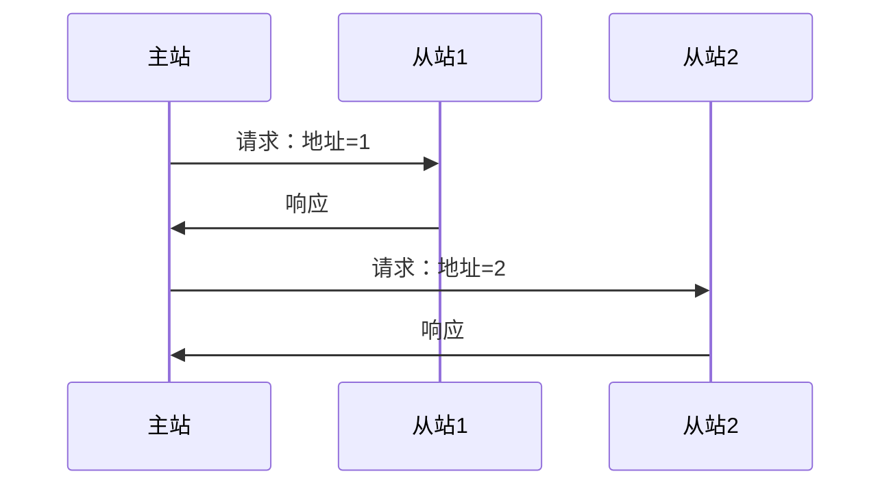

# RS-485 串行通信标准学习笔记

最后整理：2026-06-11

RS-485 是工业现场非常常见的差分串行电气标准。它适合长距离、多节点、抗干扰通信。很多人把“RS-485”和“Modbus”混在一起说，但二者不是一回事：RS-485 定义电气层，Modbus RTU 定义应用层报文。

## 协议定位

RS-485 属于物理层标准，主要定义差分信号、电气特性、多点总线能力和驱动/接收要求。它不规定寄存器地址、功能码、CRC，也不规定主从关系；这些通常由 Modbus RTU 或自定义协议定义。

## 解决的问题

- 工业现场线缆长、噪声大，RS-232 不够可靠。
- 一个主站需要连接多个从站设备。
- 需要用低成本双绞线实现稳定串行通信。

## 核心特性

| 特性 | 说明 |
|---|---|
| 信号方式 | 差分信号，常见 A/B 或 D+/D- |
| 拓扑 | 总线型，多点连接 |
| 通信方向 | 常见二线半双工，也可四线全双工 |
| 介质 | 双绞线，工业现场常用屏蔽双绞线 |
| 节点数 | 受收发器单位负载、线缆和速率影响 |
| 上层协议 | Modbus RTU、自定义协议、Profibus 物理层变体等 |

## 半双工 RS-485

二线半双工 RS-485 同一对线既发送又接收，同一时刻通常只能一个设备发送。常见通信模型是主站轮询：

## 布线原则

| 原则 | 说明 |
|---|---|
| 总线拓扑 | 尽量一条主干串接，避免星型分叉 |
| 终端电阻 | 总线两端常加匹配电阻，减少反射 |
| 偏置电阻 | 总线空闲时提供确定状态，避免悬空误触发 |
| 屏蔽接地 | 工业现场要规划屏蔽层和接地，避免地环路 |
| 支线长度 | 支线越短越好，长支线容易反射 |

## A/B 标识混乱

不同厂家对 A/B、D+/D- 的命名可能相反。排查时不要只相信字母，最好看手册对逻辑电平的定义，必要时尝试对调 A/B。

## 常见问题

- 只接 A/B 不接参考地，长线或强干扰下可能不稳定。
- 总线两端没有终端电阻，高速或长距离时误码多。
- 每个节点都加终端电阻，导致负载过重。
- 主站发送后没有及时释放驱动使能，导致从站响应被压住。
- 多个从站地址重复，响应冲突。
- 波特率、校验位、停止位不一致，表现为乱码或 CRC 错误。

## 排查建议

1. 确认上层协议和串口参数，例如 Modbus RTU `9600 8N1` 或 `9600 8E1`。
2. 确认 A/B 极性，必要时对调测试。
3. 只保留主站和一个从站做最小系统。
4. 检查终端电阻是否只在总线两端。
5. 用 USB-RS485 转换器和串口调试工具抓请求/响应。
6. 用示波器看差分波形、反射、空闲偏置。

## RS-485 与 Modbus 的关系

| 名称 | 它是什么 | 是否定义业务 |
|---|---|---|
| RS-485 | 电气物理层 | 否 |
| UART | 异步串行字符帧 | 否 |
| Modbus RTU | 应用层报文协议 | 是 |
| Modbus TCP | 运行在 TCP/IP 上的 Modbus 变体 | 是 |

## 参考资料

- TIA/EIA-485 standard information: <https://global.ihs.com/>
- Texas Instruments RS-485 overview: <https://www.ti.com/interface/rs-485/overview.html>
- Modbus Serial Line Protocol and Implementation Guide: <https://www.modbus.org/specs.php>

