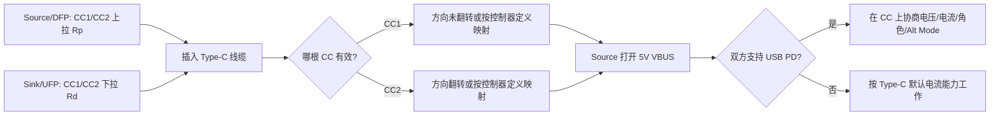
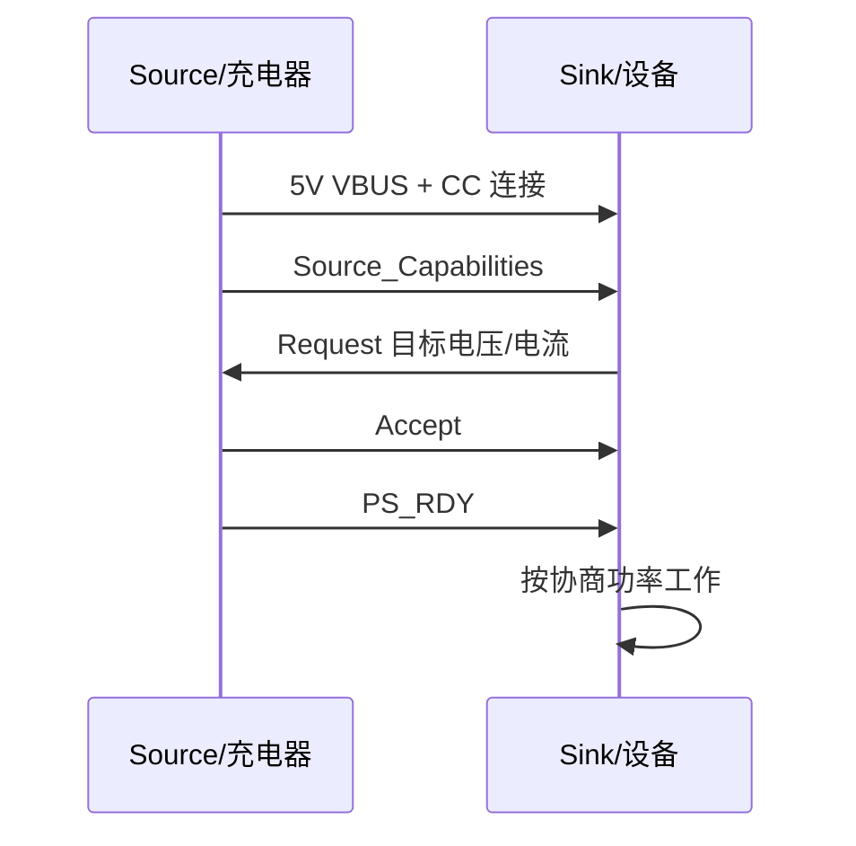
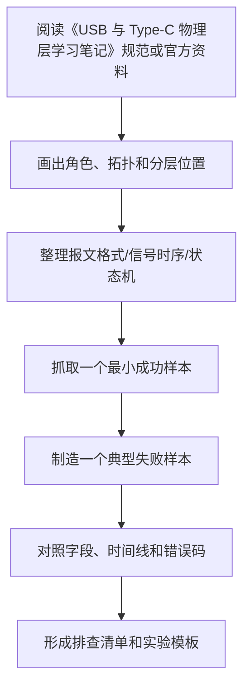

# USB 与 Type-C 物理层学习笔记

最后整理：2026-06-14

Last researched：2026-06-14

USB 容易被一句“一个接口”混淆。严格说，它至少包含三类东西：

| 名称 | 关注点 | 典型问题 |
|---|---|---|
| USB 总线协议 | 主机、设备、Hub、枚举、描述符、端点、传输类型 | 为什么插上后系统识别为串口/网卡/U 盘？ |
| USB 物理层 | D+/D-、SuperSpeed 差分对、编码、链路训练、速率、线缆损耗 | 为什么只能跑 USB 2.0？为什么高速不稳定？ |
| USB Type-C | 可正反插连接器、CC 引脚、供电角色、数据角色、VCONN、Alt Mode | 为什么 C 口不一定支持视频/快充/高速？ |
| USB Power Delivery | 在 CC 线上协商电压、电流、角色、模式 | 为什么同样 C 口有的只能 5V，有的能 20V/48V？ |

本篇重点放在“物理层和连接器层”。USB 的枚举、端点和传输类型看 `../02-数据链路层/USB总线协议.md`。

## 学习目标

- 分清 USB、USB-C、Type-C、USB PD、Thunderbolt、DisplayPort Alt Mode 的边界。
- 看懂 USB 2.0、USB 3.x、USB4 的速率命名和线缆要求。
- 理解 Type-C 的 CC1/CC2、Rp/Rd/Ra、VCONN、正反插检测和角色识别。
- 能排查“能充电但不能传数据”“只能 USB 2.0”“C 口不能视频输出”“PD 不升压”等问题。
- 设计或审查简单 USB-C 设备接口时，知道哪些引脚、阻值、ESD、走线和线缆能力必须确认。

## 一句话区分

```text
USB 是总线和协议体系；
Type-C 是一种连接器和线缆生态；
USB PD 是电源和模式协商协议；
Alt Mode 是把非 USB 协议复用到 Type-C 引脚上的机制。
```

常见误区：

- “Type-C 接口 = USB 3.x 高速”：错误。Type-C 口可以只接 USB 2.0 的 D+/D-。
- “C 口一定支持快充”：错误。没有 PD 控制器或正确 CC 配置时，通常只能按默认 5V 供电。
- “C 口一定支持视频输出”：错误。DisplayPort Alt Mode 需要主机、线缆、转接器和接口硬件全部支持。
- “线是 C to C 就能跑 40/80Gbps”：错误。速率由主机、设备、线缆、控制器、协议共同决定。
- “USB PD 就是 USB 数据协议”：错误。PD 主要在 CC 线上协商电源、角色和模式，不等于 D+/D- 或高速数据传输。

## USB 物理层版本与速率

不同 USB 版本既涉及物理层，也涉及链路层和协议层。工程上排查时先确认“实际协商速率”，不要只看接口形状。

| 常见称呼 | 理论信号速率 | 常见连接器 | 物理层特点 | 备注 |
|---|---:|---|---|---|
| USB Low Speed | 1.5 Mbps | USB-A/B、Micro、Type-C | D+/D- 差分线 | 鼠标、键盘等低速 HID |
| USB Full Speed | 12 Mbps | USB-A/B、Micro、Type-C | D+/D- 差分线 | CDC 串口、音频、调试设备常见 |
| USB High Speed | 480 Mbps | USB-A/B、Micro、Type-C | D+/D- 差分线 | 通常称 USB 2.0 High-Speed |
| USB 5Gbps | 5 Gbps | USB-A、Micro-B 3.0、Type-C | SuperSpeed 差分对 | 旧称 USB 3.0 / USB 3.1 Gen 1 / USB 3.2 Gen 1 |
| USB 10Gbps | 10 Gbps | USB-A、Type-C | SuperSpeed 差分对 | 旧称 USB 3.1 Gen 2 / USB 3.2 Gen 2 |
| USB 20Gbps | 20 Gbps | Type-C | 双通道或更高编码效率 | 常见于 USB 3.2 Gen 2x2，通常需要全功能 C 线 |
| USB 40Gbps | 40 Gbps | Type-C | USB4 双通道 | USB4 常见能力档位之一 |
| USB 80Gbps | 80 Gbps | Type-C | USB4 v2.0 / Gen4 | 需要对应主机、设备和认证线缆 |

注意：

- USB-IF 近年更推荐用 `USB 5Gbps`、`USB 10Gbps`、`USB 20Gbps`、`USB 40Gbps`、`USB 80Gbps` 这类面向用户的性能名称，少用混乱的 `USB 3.2 Gen 2x2` 对普通用户解释。
- “bps” 是信号或数据速率口径，实际文件传输速度还受编码开销、协议开销、主控、存储介质、驱动和操作系统影响。
- USB4 基于 Type-C，支持把 USB、PCIe、DisplayPort 等不同流量动态复用在同一高速链路上；是否支持某个隧道能力取决于设备实现。

## 连接器类型

| 连接器 | 是否正反插 | 常见协议能力 | 常见场景 |
|---|---|---|---|
| USB Type-A | 否 | USB 1.x/2.0/3.x | PC 主机、充电器、Hub |
| USB Type-B | 否 | USB 1.x/2.0/3.x | 打印机、仪器设备 |
| Mini/Micro USB | 否 | 多为 USB 2.0，也有 Micro-B 3.0 | 老手机、相机、移动硬盘 |
| USB Type-C | 是 | USB 2.0/3.x/USB4/PD/Alt Mode | 手机、笔记本、扩展坞、显示器 |

Type-C 解决的是连接器生态问题：更小、可翻转、可承载更高功率和更高速率、支持角色协商和可选模式。它不是单独的数据协议。

## Type-C 插座关键引脚

Type-C 插座两面镜像排布。学习时先抓住几类信号：

| 引脚类别 | 作用 | 关键点 |
|---|---|---|
| VBUS | 总线供电 | 默认通常是 5V；更高电压需要 USB PD 协商 |
| GND | 地 | 多个地脚提供回流路径和电源能力 |
| D+ / D- | USB 2.0 差分数据 | 两面各有一组，插座侧通常短接到同一 USB2 PHY |
| TX/RX 高速差分对 | USB 3.x/USB4 高速数据 | 正反插需要多路复用器或控制器处理方向 |
| CC1 / CC2 | Configuration Channel | 插入检测、方向检测、电流能力、PD 通信、VCONN |
| SBU1 / SBU2 | Sideband Use | 常用于 DisplayPort Alt Mode 的 AUX 等辅助信号 |

简化示意：

```text
Type-C 插座

VBUS/GND  : 供电与回流
D+ / D-   : USB 2.0 数据
TX/RX     : USB 3.x / USB4 高速差分对
CC1/CC2   : 方向、角色、电流、PD、VCONN
SBU1/SBU2 : Alt Mode 辅助信号
```

## CC1/CC2 是 Type-C 的核心

CC 是 Configuration Channel。Type-C 能正反插、能识别主从角色、能声明 5V 电流能力、能进入 PD 协商，核心都依赖 CC。

### DFP、UFP、DRP

| 角色 | 含义 | 常见例子 |
|---|---|---|
| DFP | Downstream Facing Port，默认数据主机方向，通常提供 VBUS | PC、充电器、Hub 上游供电口 |
| UFP | Upstream Facing Port，默认数据设备方向，通常消耗 VBUS | U 盘、手机作为设备、USB 串口模块 |
| DRP | Dual Role Port，可在 DFP/UFP 之间切换 | 手机、平板、笔记本 Type-C 口 |

数据角色和电源角色相关但不完全等价。手机可以“从充电器取电”，同时在接 U 盘时作为 USB Host；PD 还支持角色交换。

### Rp、Rd、Ra

| 电阻/标识 | 放在哪一侧 | 表达的含义 |
|---|---|---|
| Rp | Source/DFP 侧上拉 | 我是供电侧，并声明默认/1.5A/3A 电流能力 |
| Rd | Sink/UFP 侧下拉 | 我是受电侧，等待 VBUS |
| Ra | 线缆或附件相关下拉 | 表示需要 VCONN 供电的有源线缆/电子标记等 |

典型连接过程：

1. Source/DFP 在 CC1、CC2 上呈现 Rp。
2. Sink/UFP 在 CC1、CC2 上呈现 Rd。
3. 插入后，只有一根 CC 线真正连通，Source 检测到 Rp/Rd 分压。
4. 哪根 CC 有效，决定插头方向。
5. Source 确认连接后打开 VBUS。
6. 如果双方支持 PD，就在有效 CC 线上继续通信并协商更高电压、电流或模式。



Figure: Type-C 插入、方向检测和 PD 协商的简化流程，依据 USB-IF Type-C/PD 规范和常见工程资料整理。

## Type-C 默认供电与 USB PD

### 不使用 PD 时

没有 PD 协商时，Type-C 仍可通过 CC 上的 Rp 水平声明 5V 下的电流能力：

| Source 声明 | 大致含义 |
|---|---|
| Default USB Current | 按 USB 默认电流能力工作，具体与 USB 版本和枚举状态有关 |
| 1.5A @ 5V | Type-C 电流能力 1.5A |
| 3.0A @ 5V | Type-C 电流能力 3A |

这不是“快充协议”，只是 Type-C 的默认电流声明。Sink 不能只因为接口是 C 口就随意拉大电流，必须根据 CC 检测结果和设备能力限制取电。

### 使用 USB PD 时

USB PD 使用 CC 线进行双向通信。协商大致过程：

1. Source 先提供 5V VBUS。
2. Source 发送 Source Capabilities，列出可提供的电源档位。
3. Sink 根据需求选择一个 PDO，并发送 Request。
4. Source 接受后切换电压/电流限制。
5. 双方进入稳定供电状态，后续还可以角色交换、重新协商、进入 Alt Mode。

常见 PD 电压档位包括 5V、9V、15V、20V；USB PD 3.1 扩展功率范围后还可出现 28V、36V、48V 等更高电压档位。实际是否可用取决于充电器、设备、线缆 E-Marker、PD 控制器和固件策略。



Figure: USB PD 电源协商的简化时序，依据 USB-IF USB Power Delivery 规范整理。

## VCONN 与 E-Marker

VCONN 是给线缆内部电子器件供电的 5V 供电路径，通常出现在需要电子标记或有源电路的线缆中。

典型用途：

- 给 E-Marker 芯片供电，让线缆声明自身能力，例如最大电流、支持速率、线缆类型。
- 给有源线缆中的重定时、重驱动或光电转换电路供电。
- 在 Alt Mode 或高速场景中帮助主机判断线缆能否承载目标模式。

常见判断：

- 3A 以下的普通线缆不一定需要 E-Marker。
- 支持 5A 大电流的 C to C 线缆通常需要 E-Marker。
- 高速 USB4/40Gbps/80Gbps 线缆通常依赖明确的线缆能力声明。

## USB 2.0、USB 3.x、USB4 在线缆中的差异

### USB 2.0 Type-C 线

只需要 VBUS、GND、D+/D-、CC 等关键连接即可满足 USB 2.0 数据和供电。很多便宜 C 线或充电线只接 USB 2.0 数据甚至只接供电。

现象：

- 手机可以充电；
- 可以慢速传数据；
- 接移动硬盘或扩展坞只能低速；
- 不支持显示输出或 USB4。

### 全功能 Type-C 线

全功能线缆需要提供高速差分对，才能承载 USB 3.x、USB4 或 DisplayPort Alt Mode 等能力。高速线缆还要满足阻抗、插损、串扰、屏蔽、长度和认证要求。

现象：

- 可跑 USB 5/10/20/40/80Gbps 中的某些档位；
- 可支持 DP Alt Mode 或雷电/USB4 扩展坞；
- 价格、线径、长度和认证标识通常更敏感。

### Power-Only 线或接口

某些线缆、充电器或设备只设计供电，不提供数据。它们适合充电，但不适合调试、刷机、传文件或外设连接。

## Alt Mode：Type-C 不只跑 USB

Alternate Mode 允许把 Type-C 的部分高速引脚用于非 USB 协议。最常见是 DisplayPort Alt Mode。

| 模式 | 复用内容 | 常见场景 |
|---|---|---|
| DisplayPort Alt Mode | 使用高速差分对传 DP，SBU 传 AUX | 笔记本 C 口接显示器 |
| Thunderbolt / USB4 隧道 | 复用高速链路承载 PCIe、DP、USB 等 | 扩展坞、外接显卡、专业存储 |
| Audio Accessory Mode | 早期模拟音频附件 | 较少见，新设备多用 USB 数字音频 |

排查 C 口视频输出时要同时确认：

- 主机 Type-C 控制器支持 DP Alt Mode；
- 设备端或转接器支持 DP Alt Mode；
- 线缆支持对应高速通道；
- 系统固件和驱动打开该能力；
- 端口旁边的标识不能只看形状，要看厂商规格表。

## PCB 与硬件设计要点

### USB 2.0 设备口

重点：

- D+/D- 走差分，阻抗和长度尽量匹配。
- 靠近接口放 ESD 保护，选择低电容器件。
- VBUS 用于检测连接和供电输入时，要考虑浪涌、过压、反灌和限流。
- 自供电设备要避免在未连接或未允许时向 VBUS 反灌。
- Type-C UFP 设备如果只做受电设备，需要在 CC1、CC2 各放 Rd，不能只接 D+/D-。

### USB 3.x / USB4

重点：

- 高速 TX/RX 差分对要求严格阻抗控制、低损耗材料、连续参考平面。
- 减少过孔、短 stub、阻抗突变和不必要的测试点。
- 注意 AC 耦合电容位置按芯片参考设计。
- 正反插通常需要高速 MUX、Redriver、Retimer 或集成 Type-C/USB 控制器。
- ESD、共模电感、连接器封装都会影响眼图和链路稳定性。

### Type-C CC 与 PD

重点：

- 只做 USB2.0 Device 的 C 口，也必须正确处理 CC1/CC2 的 Rd。
- 只做充电输入不能简单把 VBUS 接电池，必须有充电管理、过压、过流、温升保护。
- Source 端不能在未检测到 Sink 前随意输出超出规范的 VBUS 行为。
- 需要 PD、DRP、Alt Mode 时，优先使用成熟 Type-C/PD 控制器，并按参考设计处理 CC、VCONN、VBUS 放电和保护。

## 常见工程问题

| 现象 | 可能原因 | 排查方向 |
|---|---|---|
| C 口能充电但电脑不识别设备 | 线缆只有供电；D+/D- 未接；设备枚举失败 | 换数据线，看设备管理器/`lsusb`，测 D+/D- |
| 只能 USB 2.0 速度 | 线缆不支持高速；接口只接 USB2；高速 MUX/PHY 异常 | 查看协商速率，换认证线缆，检查高速差分对 |
| C to C 不能给设备供电，A to C 可以 | 设备 C 口没有 CC 下拉 Rd | 检查 CC1/CC2 是否各有 Rd 到 GND |
| PD 不升压，只停在 5V | 充电器/设备/线缆不支持目标 PDO；PD 控制器策略不匹配 | 用 PD 抓包器看 Source Capabilities 和 Request |
| 5A 线缆不能跑满电流 | 线缆无 E-Marker 或设备不认可线缆能力 | 检查线缆认证和 E-Marker |
| 扩展坞显示器无信号 | 主机不支持 DP Alt Mode；线缆非全功能；驱动/固件问题 | 查主机规格、换线、查系统显示设备 |
| 高速连接偶发掉线 | 信号完整性差、线缆过长、ESD 电容过大、供电跌落 | 看 USB 错误日志、示波器/协议分析仪、换短线 |
| USB 转串口不稳定 | 转换芯片驱动、供电、电平或线缆问题 | 查芯片型号、串口参数、电平、供电能力 |

## 调试工具

| 工具 | 用途 |
|---|---|
| 万用表 | 测 VBUS、CC 电压、短路、线缆通断 |
| USB 电流电压表 | 看 5V/9V/20V、电流、功率变化 |
| USB PD 分析仪 | 抓 Source Capabilities、Request、Accept、PS_RDY 等 PD 消息 |
| USB 协议分析仪 | 分析枚举、端点传输、错误重试 |
| 示波器 | 看 D+/D-、高速眼图、电源跌落、复位时序 |
| `lsusb -t` | Linux 查看设备树和协商速率 |
| Windows 设备管理器 / USBView | 查看 VID/PID、描述符、端点、速度 |
| `dmesg` | Linux 查看枚举失败、掉线、供电不足等日志 |

## 和串口/USB 转串口的关系

USB 转串口模块不是“USB 电气层变成 UART 电气层”这么简单，而是一个完整 USB 设备：

```text
PC USB Host
  -> USB 枚举识别 USB-Serial 芯片
  -> 操作系统加载 CDC ACM/厂商驱动
  -> 应用层看到 COMx 或 /dev/ttyUSBx
  -> 转换芯片输出 TTL UART / RS-232 / RS-485
```

因此 USB 转串口排查要分两段：

| 段 | 排查内容 |
|---|---|
| USB 段 | 线缆、Type-C CC、枚举、驱动、VID/PID、供电 |
| 串口段 | TTL/RS-232/RS-485 电平、TX/RX、A/B、波特率、校验、协议 |

## 学习路径建议

1. 先理解本篇的 Type-C 物理连接和 CC/PD。
2. 再读 `../02-数据链路层/USB总线协议.md`，理解主机如何枚举设备。
3. 如果关心 USB 转串口，再读 `../02-数据链路层/串口通信协议总览.md`。
4. 如果关心高速硬件设计，再重点学习 USB-IF 电气测试、芯片厂商 Layout Guide、眼图和链路训练。

## 参考资料

- [Official - USB-IF Document Library](https://www.usb.org/documents)
- [Official - USB-IF USB Type-C Cable and Connector Specification](https://www.usb.org/usb-type-cr-cable-and-connector-specification)
- [Official - USB-IF USB Power Delivery / USB Charger](https://www.usb.org/usb-charger-pd)
- [Official - USB-IF USB4](https://www.usb.org/usb4)
- [Official - USB-IF USB 3.2](https://www.usb.org/usb-32)
- [Official - Microsoft USB device descriptors](https://learn.microsoft.com/en-us/windows-hardware/drivers/usbcon/usb-device-descriptors)
- [Official - Linux Kernel USB Host Side API](https://docs.kernel.org/driver-api/usb/usb.html)
- [Community - CSDN Type-C CC 检测原理](https://blog.csdn.net/myq889/article/details/117533161)
- [Community - 博客园 Type-C 协议 CC 检测原理](https://www.cnblogs.com/seanhn/p/18345816)
- [Community - CSDN Type-C CC 引脚作用与 VCONN](https://blog.csdn.net/weixin_43772512/article/details/123307773)

---

## 万字精讲扩展（2026-06-16 更新）
> Last researched: 2026-06-16。本文补充内容以协议规范、RFC、标准组织资料和抓包排查实践为主；具体设备、芯片、操作系统、网关和库实现可能存在差异，真实项目中应继续核对对应版本手册和现场抓包。

### 本章在协议学习路线中的位置

《USB 与 Type-C 物理层学习笔记》是协议体系中的一个观察点。学习它时不要只问“它是什么”，还要问它处在哪一层、解决什么互操作问题、依赖什么下层能力、给上层提供什么语义、正常流程如何推进、异常流程如何终止。协议学习的最终目标不是背标准号，而是在真实系统中定位问题：线缆是否可靠，帧是否完整，地址是否正确，路由是否可达，连接是否建立，握手是否成功，业务字段是否被双方一致理解。

本章学习完成后，至少应达到三个标准。第一，能画出最小拓扑和分层位置。第二，能解释关键报文字段、状态机或信号时序。第三，能设计一个抓包或测量实验，把正常样本和失败样本对比出来。只要这三个标准完成，这篇笔记就能用于工程排查，而不仅是概念复习。

### 物理层类协议的精讲重点

物理层协议关注的是信号能不能被可靠传过去。这里的核心不是应用数据，而是电平、差分、阻抗、速率、线缆、连接器、拓扑、端接、接地、隔离、抖动、衰减、反射和抗干扰。RS-232、RS-422、RS-485、USB、以太网 PHY、Wi-Fi PHY、光纤和光模块都属于“先有可靠物理链路，后面协议才有意义”的范畴。

排查物理层要用合适工具。网络协议抓包看不到电平质量，串口日志看不到边沿和反射，示波器看不到上层状态机。RS-485 现场常见问题包括 A/B 标识混乱、终端电阻错误、偏置缺失、方向控制时序不当、共模范围超限和接地干扰；USB/Type-C 常见问题包括 CC 识别、供电协商、线缆能力、差分阻抗和枚举失败；以太网 PHY 要看链路协商、MDI/MDIX、线序和磁性器件；Wi-Fi PHY 要看频段、信道、RSSI、噪声、MCS 和重传。

### 协议学习的底层方法：先分层，再看报文，再看状态机

协议学习最常见的错误，是把协议当成一串术语和端口号背诵。真正能用于工程排查的学习方式，应同时抓住四个维度：分层位置、报文格式、状态机和错误处理。分层位置回答“这个协议依赖谁、服务谁”；报文格式回答“线上实际传了哪些字段”；状态机回答“双方如何从开始到结束推进”；错误处理回答“超时、重传、乱序、丢包、校验失败、权限失败、版本不兼容时应该怎样表现”。只有这四个维度都清楚，遇到抓包、串口波形、日志或现场问题时才不会只凭感觉判断。

学习任何协议时，都建议先画一个最小通信链路。物理层协议要画电平、线缆、连接器、阻抗、端接、拓扑和速率；链路层协议要画帧边界、地址、校验、仲裁和介质访问；网络层协议要画寻址、路由、分片、MTU、错误反馈和安全封装；传输层协议要画连接、端口、可靠性、流控、拥塞、保活和关闭；应用层协议要画请求响应、会话、认证、编码、版本协商和业务语义。这个图比单纯背“它属于第几层”更有价值。

### 抓包和排查闭环


Figure: 协议排查闭环，综合 IETF RFC、USB/NXP/Modbus/OASIS/OPC/IEEE 等规范和 Wireshark/tcpdump 实践资料整理。

排查时不要只看单个包。很多协议问题只有放在时序里才成立：TCP 三次握手是否完成，TLS 握手在哪一步失败，DNS 是否有重传或返回错误码，HTTP 是否被代理或缓存影响，Modbus 是否功能码和寄存器地址不匹配，RS-485 是否方向控制或终端电阻错误，CAN 是否仲裁失败或错误帧增加，MQTT 是否 Keep Alive 超时，OPC UA 是否安全策略或证书不匹配。单包解释字段，多包解释状态机。

### 报文字段要和工程现象绑定

协议字段不是孤立名词。长度字段错误可能导致粘包拆包失败；校验字段错误可能说明线路干扰、字节序错误或帧边界错；序列号和确认号异常可能指向丢包、重传、乱序或中间设备干预；TTL/Hop Limit 异常可能说明路由环路或路径变化；MSS/MTU 不匹配可能造成黑洞；TLS Alert 可以直接提示证书、版本、密码套件或应用协议协商问题；HTTP 状态码要结合方法、缓存、代理和服务端日志解释。学习时每个字段都应该写“它异常时会看到什么”。

### 规范、实现和现场三者要分开

协议规范说明应该如何互操作，实现代码说明某个库或设备实际怎么做，现场抓包说明这一刻真实发生了什么。三者可能不完全一致：旧设备可能只支持旧版本，厂商实现可能有扩展字段，中间盒可能改写报文，NAT/防火墙/代理可能改变连接行为，串口网关可能改变时序，工业现场线缆和接地可能影响物理层。工程判断应优先以规范为语义基准，以抓包和测量为事实依据，以实现文档解释具体差异。

### 核心知识点逐条精讲

#### 1. USB 与 Type-C 物理层学习笔记 的协议定位

在《USB 与 Type-C 物理层学习笔记》中，`USB 与 Type-C 物理层学习笔记 的协议定位` 必须同时落到规范、报文和现场现象三层。规范层回答这个协议被设计来解决什么问题，依赖哪些下层能力，向上提供哪些语义；报文层回答字段如何编码、长度如何确定、状态如何推进、错误如何表达；现场层回答当线路、设备、软件、配置或中间网络异常时，会在日志、抓包、波形或业务行为上看到什么。只知道概念而看不懂报文，排查时会缺少证据；只会看字段而不知道状态机，也容易把正常重传、协商或错误响应误判成故障。

学习 `USB 与 Type-C 物理层学习笔记 的协议定位` 时建议固定写五项：第一，通信双方角色和拓扑；第二，最小成功流程；第三，关键字段或信号；第四，常见失败流程；第五，验证工具。比如网络协议要写 Wireshark display filter、tcpdump 命令、端口和状态码；串行和总线协议要写逻辑分析仪通道、波特率/时钟、采样设置、字节序和校验；工业协议要写站号、对象字典、寄存器地址、功能码、设备配置和网关映射。这样笔记会直接服务排查，而不是只能复习概念。

工程上要特别警惕“协议名相同但实现差异很大”。同一个 `USB 与 Type-C 物理层学习笔记` 在不同设备、系统版本、库版本、网关或厂商扩展中，可能在超时、重试、字节序、字段可选性、安全策略、错误码、最大报文长度、默认端口和兼容模式上存在差异。规范给出互操作底线，设备手册给出实现约束，抓包和测量给出现场事实。三者互相校验，才能得到可靠结论。

#### 2. 信号与介质

在《USB 与 Type-C 物理层学习笔记》中，`信号与介质` 必须同时落到规范、报文和现场现象三层。规范层回答这个协议被设计来解决什么问题，依赖哪些下层能力，向上提供哪些语义；报文层回答字段如何编码、长度如何确定、状态如何推进、错误如何表达；现场层回答当线路、设备、软件、配置或中间网络异常时，会在日志、抓包、波形或业务行为上看到什么。只知道概念而看不懂报文，排查时会缺少证据；只会看字段而不知道状态机，也容易把正常重传、协商或错误响应误判成故障。

学习 `信号与介质` 时建议固定写五项：第一，通信双方角色和拓扑；第二，最小成功流程；第三，关键字段或信号；第四，常见失败流程；第五，验证工具。比如网络协议要写 Wireshark display filter、tcpdump 命令、端口和状态码；串行和总线协议要写逻辑分析仪通道、波特率/时钟、采样设置、字节序和校验；工业协议要写站号、对象字典、寄存器地址、功能码、设备配置和网关映射。这样笔记会直接服务排查，而不是只能复习概念。

工程上要特别警惕“协议名相同但实现差异很大”。同一个 `USB 与 Type-C 物理层学习笔记` 在不同设备、系统版本、库版本、网关或厂商扩展中，可能在超时、重试、字节序、字段可选性、安全策略、错误码、最大报文长度、默认端口和兼容模式上存在差异。规范给出互操作底线，设备手册给出实现约束，抓包和测量给出现场事实。三者互相校验，才能得到可靠结论。

#### 3. 拓扑、线缆和端接

在《USB 与 Type-C 物理层学习笔记》中，`拓扑、线缆和端接` 必须同时落到规范、报文和现场现象三层。规范层回答这个协议被设计来解决什么问题，依赖哪些下层能力，向上提供哪些语义；报文层回答字段如何编码、长度如何确定、状态如何推进、错误如何表达；现场层回答当线路、设备、软件、配置或中间网络异常时，会在日志、抓包、波形或业务行为上看到什么。只知道概念而看不懂报文，排查时会缺少证据；只会看字段而不知道状态机，也容易把正常重传、协商或错误响应误判成故障。

学习 `拓扑、线缆和端接` 时建议固定写五项：第一，通信双方角色和拓扑；第二，最小成功流程；第三，关键字段或信号；第四，常见失败流程；第五，验证工具。比如网络协议要写 Wireshark display filter、tcpdump 命令、端口和状态码；串行和总线协议要写逻辑分析仪通道、波特率/时钟、采样设置、字节序和校验；工业协议要写站号、对象字典、寄存器地址、功能码、设备配置和网关映射。这样笔记会直接服务排查，而不是只能复习概念。

工程上要特别警惕“协议名相同但实现差异很大”。同一个 `USB 与 Type-C 物理层学习笔记` 在不同设备、系统版本、库版本、网关或厂商扩展中，可能在超时、重试、字节序、字段可选性、安全策略、错误码、最大报文长度、默认端口和兼容模式上存在差异。规范给出互操作底线，设备手册给出实现约束，抓包和测量给出现场事实。三者互相校验，才能得到可靠结论。

#### 4. 时序和速率

在《USB 与 Type-C 物理层学习笔记》中，`时序和速率` 必须同时落到规范、报文和现场现象三层。规范层回答这个协议被设计来解决什么问题，依赖哪些下层能力，向上提供哪些语义；报文层回答字段如何编码、长度如何确定、状态如何推进、错误如何表达；现场层回答当线路、设备、软件、配置或中间网络异常时，会在日志、抓包、波形或业务行为上看到什么。只知道概念而看不懂报文，排查时会缺少证据；只会看字段而不知道状态机，也容易把正常重传、协商或错误响应误判成故障。

学习 `时序和速率` 时建议固定写五项：第一，通信双方角色和拓扑；第二，最小成功流程；第三，关键字段或信号；第四，常见失败流程；第五，验证工具。比如网络协议要写 Wireshark display filter、tcpdump 命令、端口和状态码；串行和总线协议要写逻辑分析仪通道、波特率/时钟、采样设置、字节序和校验；工业协议要写站号、对象字典、寄存器地址、功能码、设备配置和网关映射。这样笔记会直接服务排查，而不是只能复习概念。

工程上要特别警惕“协议名相同但实现差异很大”。同一个 `USB 与 Type-C 物理层学习笔记` 在不同设备、系统版本、库版本、网关或厂商扩展中，可能在超时、重试、字节序、字段可选性、安全策略、错误码、最大报文长度、默认端口和兼容模式上存在差异。规范给出互操作底线，设备手册给出实现约束，抓包和测量给出现场事实。三者互相校验，才能得到可靠结论。

#### 5. 错误现象与测量

在《USB 与 Type-C 物理层学习笔记》中，`错误现象与测量` 必须同时落到规范、报文和现场现象三层。规范层回答这个协议被设计来解决什么问题，依赖哪些下层能力，向上提供哪些语义；报文层回答字段如何编码、长度如何确定、状态如何推进、错误如何表达；现场层回答当线路、设备、软件、配置或中间网络异常时，会在日志、抓包、波形或业务行为上看到什么。只知道概念而看不懂报文，排查时会缺少证据；只会看字段而不知道状态机，也容易把正常重传、协商或错误响应误判成故障。

学习 `错误现象与测量` 时建议固定写五项：第一，通信双方角色和拓扑；第二，最小成功流程；第三，关键字段或信号；第四，常见失败流程；第五，验证工具。比如网络协议要写 Wireshark display filter、tcpdump 命令、端口和状态码；串行和总线协议要写逻辑分析仪通道、波特率/时钟、采样设置、字节序和校验；工业协议要写站号、对象字典、寄存器地址、功能码、设备配置和网关映射。这样笔记会直接服务排查，而不是只能复习概念。

工程上要特别警惕“协议名相同但实现差异很大”。同一个 `USB 与 Type-C 物理层学习笔记` 在不同设备、系统版本、库版本、网关或厂商扩展中，可能在超时、重试、字节序、字段可选性、安全策略、错误码、最大报文长度、默认端口和兼容模式上存在差异。规范给出互操作底线，设备手册给出实现约束，抓包和测量给出现场事实。三者互相校验，才能得到可靠结论。


### 场景化学习与排错表

| 主题 | 推荐动作 | 常见风险 | 验证方式 |
| :--- | :--- | :--- | :--- |
| USB 与 Type-C 物理层学习笔记 的协议定位 | 先查规范和设备手册，再抓取最小成功/失败样本，最后写成排查规则 | 只背概念、不看报文；只看单包、不看状态机；忽略版本和设备差异 | Wireshark/tcpdump/串口日志/逻辑分析仪/示波器/设备日志/最小复现实验 |
| 信号与介质 | 先查规范和设备手册，再抓取最小成功/失败样本，最后写成排查规则 | 只背概念、不看报文；只看单包、不看状态机；忽略版本和设备差异 | Wireshark/tcpdump/串口日志/逻辑分析仪/示波器/设备日志/最小复现实验 |
| 拓扑、线缆和端接 | 先查规范和设备手册，再抓取最小成功/失败样本，最后写成排查规则 | 只背概念、不看报文；只看单包、不看状态机；忽略版本和设备差异 | Wireshark/tcpdump/串口日志/逻辑分析仪/示波器/设备日志/最小复现实验 |
| 时序和速率 | 先查规范和设备手册，再抓取最小成功/失败样本，最后写成排查规则 | 只背概念、不看报文；只看单包、不看状态机；忽略版本和设备差异 | Wireshark/tcpdump/串口日志/逻辑分析仪/示波器/设备日志/最小复现实验 |
| 错误现象与测量 | 先查规范和设备手册，再抓取最小成功/失败样本，最后写成排查规则 | 只背概念、不看报文；只看单包、不看状态机；忽略版本和设备差异 | Wireshark/tcpdump/串口日志/逻辑分析仪/示波器/设备日志/最小复现实验 |

这张表的重点是把协议知识变成可验证动作。协议问题通常不是一句“网络不通”或“设备不兼容”能解释的，而是需要把拓扑、配置、报文、状态机、时间线和错误码拼在一起。每次排查结束，都应把最终规则写回笔记，例如某设备的超时时间、某网关的字节序、某协议栈的版本限制或某端口在防火墙上的放行条件。

### 本章建议工作流



Figure: 《USB 与 Type-C 物理层学习笔记》学习工作流，综合 RFC、USB-IF、NXP、Modbus、OASIS、OPC Foundation、IEEE、Wireshark/tcpdump 等资料整理。

这个流程强调“成功样本”和“失败样本”都要保留。只保存成功样本，现场出问题时没有对照；只看失败样本，容易不知道正常状态机应该长什么样。对协议学习者来说，一组高质量抓包、串口日志或波形截图，比一段泛泛解释更能积累经验。

### 常见误区和纠正方法

- 误区：只背 OSI 层级。纠正：层级只是定位工具，必须继续看报文格式、状态机、错误码和现场证据。
- 误区：端口通就认为协议通。纠正：端口可达只说明传输层可能可达，应用层认证、版本、功能码、证书、权限和业务字段仍可能失败。
- 误区：只抓客户端或只抓服务端。纠正：复杂问题要尽量在两端或关键中间点同时取证，尤其是 NAT、代理、网关、交换机和串口转换器场景。
- 误区：忽略时间。纠正：超时、重试、保活、退避、握手和关闭都依赖时间线；协议排查要看相对时间和间隔。
- 误区：把社区文章当规范。纠正：社区经验适合发现常见坑，语义和字段定义应回到 RFC、标准组织文档、厂商手册和抓包事实。
- 误区：只保存结论，不保存样本。纠正：保留 pcap、串口日志、波形、配置和版本信息，后续才能复盘和对比。

### 与相邻协议的关系

《USB 与 Type-C 物理层学习笔记》通常不是单独工作的。物理层问题会让链路层帧错误增加，链路层地址或校验错误会影响网络层可达性，网络层 MTU/NAT/路由会影响传输层连接，传输层超时和重传会影响应用层表现，表示层编码和 TLS 会影响应用层解析。排查时要从现象所在层向下验证承载是否正常，再向上验证语义是否正确。不要在没有证据的情况下跨层猜测。

### 实操训练和复盘模板

1. 围绕 `USB 与 Type-C 物理层学习笔记 的协议定位` 做一次最小实验：记录拓扑、配置、成功样本、失败样本、字段解释和最终结论。
2. 围绕 `信号与介质` 做一次最小实验：记录拓扑、配置、成功样本、失败样本、字段解释和最终结论。
3. 围绕 `拓扑、线缆和端接` 做一次最小实验：记录拓扑、配置、成功样本、失败样本、字段解释和最终结论。
4. 围绕 `时序和速率` 做一次最小实验：记录拓扑、配置、成功样本、失败样本、字段解释和最终结论。
5. 围绕 `错误现象与测量` 做一次最小实验：记录拓扑、配置、成功样本、失败样本、字段解释和最终结论。

建议每篇协议笔记都维护下面的复盘格式：

```text
实验名称：
协议主题：USB 与 Type-C 物理层学习笔记
设备/软件/版本：
拓扑：客户端、服务端、网关、交换机、线缆、总线节点
关键配置：端口、地址、速率、校验、证书、账号、功能码、寄存器、topic 等
成功样本：抓包文件、串口日志、波形或设备日志位置
失败样本：如何复现，错误码或异常现象
字段解释：哪些字段证明状态机走到哪一步
根因判断：线路/配置/协议栈/版本/权限/业务数据/中间设备
修复动作：
回归验证：
以后检查规则：
```

这个模板能避免“凭经验说可能是某某问题”。协议排查必须留下证据链：现象是什么、哪一层开始异常、哪个字段证明异常、哪个实验排除了其他可能。长期积累后，这些复盘会比零散教程更有价值。

## 参考资料与延伸阅读

- [IETF / RFC] RFC 791 - Internet Protocol IPv4: https://datatracker.ietf.org/doc/html/rfc791
- [IETF / RFC] RFC 8200 - Internet Protocol Version 6 IPv6: https://www.rfc-editor.org/info/rfc8200
- [IETF / RFC] RFC 826 - Address Resolution Protocol ARP: https://datatracker.ietf.org/doc/html/rfc826
- [IETF / RFC] RFC 792 - Internet Control Message Protocol ICMP: https://datatracker.ietf.org/doc/html/rfc792
- [IETF / RFC] RFC 4443 - ICMPv6: https://datatracker.ietf.org/doc/html/rfc4443
- [IETF / RFC] RFC 768 - User Datagram Protocol UDP: https://datatracker.ietf.org/doc/html/rfc768
- [IETF / RFC] RFC 9293 - Transmission Control Protocol TCP: https://datatracker.ietf.org/doc/rfc9293/
- [IETF / RFC] RFC 9000 - QUIC: A UDP-Based Multiplexed and Secure Transport: https://datatracker.ietf.org/doc/rfc9000/
- [IETF / RFC] RFC 8446 - TLS 1.3: https://www.rfc-editor.org/info/rfc8446/
- [IETF / RFC] RFC 9110 - HTTP Semantics: https://www.rfc-editor.org/rfc/rfc9110.html
- [IETF / RFC] RFC 9111 - HTTP Caching: https://www.rfc-editor.org/rfc/rfc9111.html
- [IETF / RFC] RFC 9112 - HTTP/1.1: https://www.rfc-editor.org/rfc/rfc9112.html
- [IETF / RFC] RFC 6455 - The WebSocket Protocol: https://datatracker.ietf.org/doc/html/rfc6455
- [IETF / RFC] RFC 1034 - Domain Names Concepts and Facilities: https://www.rfc-editor.org/info/rfc1034/
- [IETF / RFC] RFC 1035 - Domain Names Implementation and Specification: https://datatracker.ietf.org/doc/html/rfc1035
- [IETF / RFC] RFC 2131 - Dynamic Host Configuration Protocol DHCP: https://datatracker.ietf.org/doc/html/rfc2131
- [IETF / RFC] RFC 5321 - Simple Mail Transfer Protocol SMTP: https://datatracker.ietf.org/doc/rfc5321/
- [IETF / RFC] RFC 959 - File Transfer Protocol FTP: https://datatracker.ietf.org/doc/html/rfc959
- [IETF / RFC] RFC 2045 - MIME Part One: https://www.ietf.org/rfc/rfc2045.txt
- [IETF / RFC] RFC 2046 - MIME Media Types: https://www.rfc-editor.org/info/rfc2046/
- [IETF / RFC] RFC 1661 - Point-to-Point Protocol PPP: https://datatracker.ietf.org/doc/rfc1661/
- [IETF / RFC] RFC 4301 - Security Architecture for IPsec: https://datatracker.ietf.org/doc/html/rfc4301
- [IETF / RFC] RFC 3022 - Traditional NAT: https://datatracker.ietf.org/doc/html/rfc3022
- [IETF / RFC] RFC 1191 - Path MTU Discovery: https://datatracker.ietf.org/doc/html/rfc1191
- [IETF / RFC] RFC 8201 - Path MTU Discovery for IPv6: https://datatracker.ietf.org/doc/html/rfc8201
- [IETF / RFC] RFC 9260 - Stream Control Transmission Protocol SCTP: https://datatracker.ietf.org/doc/html/rfc9260
- [IETF / RFC] RFC 3261 - SIP Session Initiation Protocol: https://datatracker.ietf.org/doc/html/rfc3261
- [IETF / RFC] RFC 5531 - RPC Remote Procedure Call Protocol Version 2: https://datatracker.ietf.org/doc/html/rfc5531
- [IETF / RFC] RFC 1001 / RFC 1002 - NetBIOS over TCP/IP: https://datatracker.ietf.org/doc/html/rfc1001
- [USB-IF / Spec] USB Document Library: https://www.usb.org/documents
- [USB-IF / Spec] USB 2.0 Specification: https://www.usb.org/document-library/usb-20-specification
- [USB-IF / Spec] USB Type-C Cable and Connector Specification: https://www.usb.org/document-library/usb-type-cr-cable-and-connector-specification-release-24
- [NXP / Spec] I2C-bus specification and user manual UM10204: https://www.nxp.com/documents/user_manual/UM10204.pdf
- [Modbus Organization / Spec] Modbus Specifications: https://www.modbus.org/modbus-specifications
- [OASIS / Standard] MQTT Version 5.0: https://docs.oasis-open.org/mqtt/mqtt/v5.0/mqtt-v5.0.html
- [OPC Foundation / Spec] OPC UA Online Reference: https://reference.opcfoundation.org/
- [OPC Foundation / Overview] OPC Unified Architecture: https://opcfoundation.org/about/opc-technologies/opc-ua/
- [EtherCAT Technology Group / Overview] EtherCAT Technology: https://www.ethercat.org/en/technology.html
- [CAN in Automation / Overview] CANopen: https://www.can-cia.org/can-knowledge/canopen
- [CAN in Automation / Documents] Technical documents: https://www.can-cia.org/cia-groups/technical-documents
- [IO-Link Community / Spec] IO-Link downloads and specifications: https://io-link.com/downloads
- [IO-Link Community / Overview] IO-Link standardized IO technology: https://io-link.com/
- [IEEE / Standard family] IEEE 802.3 Ethernet: https://standards.ieee.org/ieee/802.3/7071/
- [IEEE / Standard family] IEEE 802.11 Wireless LAN: https://standards.ieee.org/ieee/802.11/7028/
- [IEEE / Standard family] IEEE 802.1Q VLAN bridging: https://standards.ieee.org/ieee/802.1Q/6844/
- [IANA / Registry] Service Name and Transport Protocol Port Number Registry: https://www.iana.org/assignments/service-names-port-numbers/service-names-port-numbers.xhtml
- [Wireshark / Docs] Wireshark User's Guide: https://www.wireshark.org/docs/wsug_html_chunked/
- [tcpdump / Docs] tcpdump and libpcap: https://www.tcpdump.org/
- [Community / CSDN] 协议抓包与网络协议学习笔记检索入口: https://so.csdn.net/so/search?q=%E5%8D%8F%E8%AE%AE%20%E6%8A%93%E5%8C%85%20%E5%AD%A6%E4%B9%A0%E7%AC%94%E8%AE%B0
- [Community / 博客园] 网络协议、TCP/IP、工业协议实践检索入口: https://zzk.cnblogs.com/s/blogpost?Keywords=%E7%BD%91%E7%BB%9C%E5%8D%8F%E8%AE%AE%20TCP%20Modbus%20MQTT
- [Community / 掘金] HTTP、TCP、WebSocket、MQTT 实践检索入口: https://juejin.cn/search?query=HTTP%20TCP%20WebSocket%20MQTT%20%E5%8D%8F%E8%AE%AE&type=0

<!-- research-notes: enhanced-v1 -->

## 研究笔记增强

> Last reviewed: 2026-06-17。此节用于把《USB 与 Type-C 物理层学习笔记》从阅读笔记推进到可复习、可实践、可验证的研究笔记；具体版本、参数和环境仍需结合官方资料、项目约束和实测结果校准。

### 知识定位

以分层定位、报文证据和状态机为核心，结论必须能回到规范、抓包、日志、波形或设备手册验证。

### 重点补充
- 区分各网络层次负责的问题。
- 关注报文格式、状态机、错误码、超时重试和兼容性。
- 记录拓扑、版本、配置、时间线和抓包位置。
- 明确适用场景、限制条件、替代方案和迁移成本。

### 实践清单
- 为本章整理一张概念关系图、流程图或最小系统图。
- 写一个最小可运行示例，并保留运行命令、输入、输出和环境版本。
- 列出常见错误、排查命令、关键日志和修复动作。
- 补充安全、性能、兼容性、可维护性和上线运维注意事项。
- 用一次真实问题或练习项目复盘验证笔记是否可用。

### 常见误区
- 只摘抄定义或命令，没有记录上下文、前提条件和边界。
- 只记录成功路径，不记录失败样本、异常现象和排查过程。
- 没有版本、环境和数据样本，导致后续无法复现。
- 把教程默认值直接用于真实项目，没有结合约束重新评估。

### 复盘问题
- 学完《USB 与 Type-C 物理层学习笔记》后，能否用自己的话说明它解决什么问题、不解决什么问题？
- 如果要在真实项目中使用，需要哪些前置条件、依赖版本、输入数据和验证手段？
- 失败时最先检查哪三类证据：日志、指标、抓包、堆栈、配置、样本还是硬件测量？
- 有没有形成可重复的最小实验、测试用例或排查命令？

### 延伸方向
- 官方文档和版本变更记录。
- 同类技术、框架或方案对比。
- 面向真实项目的最小实践。
- 故障排查清单和复盘案例库。

### 复盘记录模板

```text
主题：USB 与 Type-C 物理层学习笔记
日期：
目标：本次要验证或掌握的具体问题
环境：系统 / 语言 / 框架 / 工具 / 设备 / 版本
步骤：最小可复现流程
现象：成功输出、失败输出、日志、指标或测量数据
分析：为什么会出现该现象，和哪些概念相关
结论：可复用的规则、命令、配置或设计取舍
风险：边界条件、性能、安全、兼容性或维护成本
下一步：继续实验、补充资料或应用到项目
```

<!-- lecture-notes:start -->

## 讲义级补充：如何真正学懂《USB 与 Type-C 物理层学习笔记》

> 适用位置：协议\01-物理层\USB与Type-C物理层.md  
> 说明：本补充用于把原始提纲扩展成课堂讲义式学习材料。阅读时建议先看原文，再用本节建立知识框架、例子、实践和自测闭环。

### 1. 这一讲要解决什么问题

协议学习的核心是理解通信双方如何约定格式、时序、错误处理和兼容性。把协议想成“双方都严格遵守的对话规则”，任何一方听错、漏听或理解版本不同，通信都会出问题。

学习本讲时，可以用三个问题检查自己是否真的理解：

1. 它解决的真实问题是什么？
2. 如果没有它，系统会出现什么具体麻烦？
3. 在真实项目中，应该用什么现象或指标判断它做得好不好？

### 2. 核心知识拆解

可以把本讲拆成几块来学：

- 格式：双方传输的数据长什么样。
- 时序：谁先说、谁后说、什么时候确认或重试。
- 状态：连接、会话、缓存、认证等上下文如何维护。
- 异常：丢包、乱序、超时、版本不兼容时如何恢复。

拆解的好处是防止“整章都懂一点，但哪块都说不清”。复习时可以逐块追问：它的输入是什么、输出是什么、依赖什么、失败时有什么表现。

### 3. 通俗类比

可以把协议类比成寄快递：物理层像道路，链路层像同城派送，网络层决定跨城市路线，传输层确认包裹是否送到，应用层才是包裹里的业务内容。排查问题时不要一上来就怀疑应用代码，先确认每一层是否把自己的职责完成了。

类比不是严格定义，但能帮助初学者先建立直觉。真正使用时，还要回到术语、公式、接口、数据结构、时序图或工程规范上，把“感觉理解”变成“可验证理解”。

### 4. 具体例子

学习《USB 与 Type-C 物理层学习笔记》时，可以打开抓包工具观察一次真实通信：先看 DNS 是否解析成功，再看连接或握手是否建立，随后看请求响应内容，最后检查超时、重传或错误码。这样能把抽象协议变成可观察的证据链。

讲义级学习不能只停留在“概念解释”。至少要有一个能跑、能算、能画或能检查的例子。例子越小，越容易看清关键机制；等机制清楚后，再逐步扩展到复杂项目。

### 5. 学习路径

- 先确认协议解决的是寻址、可靠传输、数据表达、会话管理还是业务语义问题。
- 再看报文格式、握手流程、状态机、超时重试和错误码。
- 最后用抓包工具把理论和真实流量对应起来。

建议每学完一小节都做一次“复述练习”：不用看笔记，用自己的话讲清楚概念、输入、输出、关键步骤和常见错误。如果讲不清，通常说明还没有真正掌握。

### 6. 课堂讲解框架

可以按下面顺序讲解或复习本主题：

1. 背景：先讲这个知识为什么出现，它试图降低什么成本、解决什么风险或提升什么能力。
2. 基本概念：给出核心名词的准确定义，说明它们之间的关系。
3. 工作流程：按时间顺序描述一次完整过程，必要时画出流程图、状态机或数据流图。
4. 关键细节：解释最容易误解的机制，例如边界条件、异常处理、性能限制、资源生命周期或安全约束。
5. 实战例子：用一个足够小但完整的例子，把概念落到命令、代码、图纸、配置、数据或操作步骤上。
6. 反例与排错：展示错误做法会导致什么现象，再说明如何定位和修复。
7. 总结迁移：最后说明它和相邻知识点的区别、联系以及后续该学什么。

### 7. 最小实践任务

为了避免“看懂了但不会用”，建议为本讲配一个最小实践：

- 选一个可以在 30 到 90 分钟内完成的小任务。
- 明确输入、预期输出和验收标准。
- 记录遇到的第一个错误、定位过程和最终修复方法。
- 完成后写 5 行复盘：我原来以为是什么，实际是什么，下次会如何更快处理。

如果本主题偏理论，实践可以是手算一个小例子、画一张流程图、推导一个简化公式或解释一段真实日志；如果偏工程，实践应该尽量落到可运行命令、可测试代码、可检查配置或可测量硬件现象上。

### 8. 常见误区

- 只背端口号，不理解握手、状态和超时。
- 抓包时只看应用层内容，忽略 DNS、路由、MTU、TLS 和重传。
- 把 TCP 的可靠性误解为业务一定不会失败，忽略应用层幂等和重试。

遇到这些问题时，不要急着背更多资料。更有效的办法是回到一个最小例子，把输入、状态变化、输出和验证方式重新走一遍。

### 9. 自测题

1. 用一句话说明本讲主题解决的核心问题。
2. 列出本讲最重要的 3 个概念，并说明它们的关系。
3. 举一个生活类比，再指出这个类比在哪些地方不严谨。
4. 写出一个最小实践任务的验收标准。
5. 如果结果不符合预期，你会优先检查哪 3 个环节？为什么？
6. 本讲和相邻章节的知识边界是什么？哪些问题应该交给其他章节解决？

### 10. 复习口诀

先问场景，再看输入；先拆结构，再走流程；先做小例，再谈优化；先会排错，再做规模化。

<!-- lecture-notes:end -->
