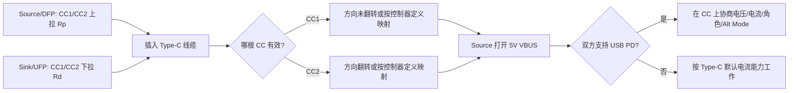
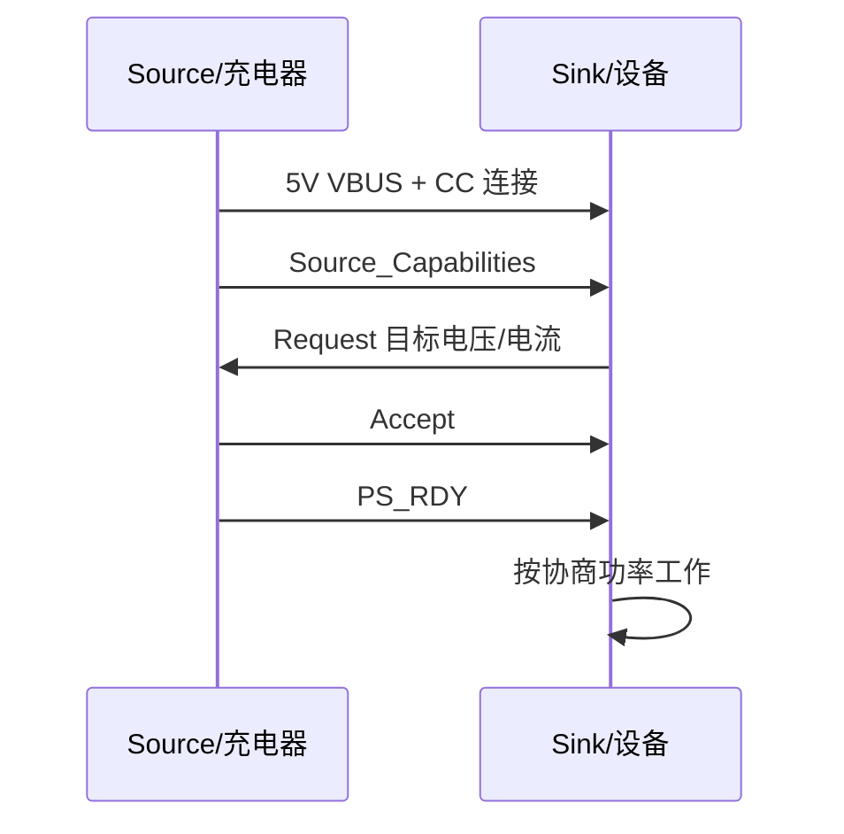

# USB 与 Type-C 物理层学习笔记

最后整理：2026-06-14

Last researched：2026-06-14

USB 容易被一句“一个接口”混淆。严格说，它至少包含三类东西：

| 名称 | 关注点 | 典型问题 |
|---|---|---|
| USB 总线协议 | 主机、设备、Hub、枚举、描述符、端点、传输类型 | 为什么插上后系统识别为串口/网卡/U 盘？ |
| USB 物理层 | D+/D-、SuperSpeed 差分对、编码、链路训练、速率、线缆损耗 | 为什么只能跑 USB 2.0？为什么高速不稳定？ |
| USB Type-C | 可正反插连接器、CC 引脚、供电角色、数据角色、VCONN、Alt Mode | 为什么 C 口不一定支持视频/快充/高速？ |
| USB Power Delivery | 在 CC 线上协商电压、电流、角色、模式 | 为什么同样 C 口有的只能 5V，有的能 20V/48V？ |

本篇重点放在“物理层和连接器层”。USB 的枚举、端点和传输类型看 `../02-数据链路层/USB总线协议.md`。

## 学习目标

- 分清 USB、USB-C、Type-C、USB PD、Thunderbolt、DisplayPort Alt Mode 的边界。
- 看懂 USB 2.0、USB 3.x、USB4 的速率命名和线缆要求。
- 理解 Type-C 的 CC1/CC2、Rp/Rd/Ra、VCONN、正反插检测和角色识别。
- 能排查“能充电但不能传数据”“只能 USB 2.0”“C 口不能视频输出”“PD 不升压”等问题。
- 设计或审查简单 USB-C 设备接口时，知道哪些引脚、阻值、ESD、走线和线缆能力必须确认。

## 一句话区分

```text
USB 是总线和协议体系；
Type-C 是一种连接器和线缆生态；
USB PD 是电源和模式协商协议；
Alt Mode 是把非 USB 协议复用到 Type-C 引脚上的机制。
```

常见误区：

- “Type-C 接口 = USB 3.x 高速”：错误。Type-C 口可以只接 USB 2.0 的 D+/D-。
- “C 口一定支持快充”：错误。没有 PD 控制器或正确 CC 配置时，通常只能按默认 5V 供电。
- “C 口一定支持视频输出”：错误。DisplayPort Alt Mode 需要主机、线缆、转接器和接口硬件全部支持。
- “线是 C to C 就能跑 40/80Gbps”：错误。速率由主机、设备、线缆、控制器、协议共同决定。
- “USB PD 就是 USB 数据协议”：错误。PD 主要在 CC 线上协商电源、角色和模式，不等于 D+/D- 或高速数据传输。

## USB 物理层版本与速率

不同 USB 版本既涉及物理层，也涉及链路层和协议层。工程上排查时先确认“实际协商速率”，不要只看接口形状。

| 常见称呼 | 理论信号速率 | 常见连接器 | 物理层特点 | 备注 |
|---|---:|---|---|---|
| USB Low Speed | 1.5 Mbps | USB-A/B、Micro、Type-C | D+/D- 差分线 | 鼠标、键盘等低速 HID |
| USB Full Speed | 12 Mbps | USB-A/B、Micro、Type-C | D+/D- 差分线 | CDC 串口、音频、调试设备常见 |
| USB High Speed | 480 Mbps | USB-A/B、Micro、Type-C | D+/D- 差分线 | 通常称 USB 2.0 High-Speed |
| USB 5Gbps | 5 Gbps | USB-A、Micro-B 3.0、Type-C | SuperSpeed 差分对 | 旧称 USB 3.0 / USB 3.1 Gen 1 / USB 3.2 Gen 1 |
| USB 10Gbps | 10 Gbps | USB-A、Type-C | SuperSpeed 差分对 | 旧称 USB 3.1 Gen 2 / USB 3.2 Gen 2 |
| USB 20Gbps | 20 Gbps | Type-C | 双通道或更高编码效率 | 常见于 USB 3.2 Gen 2x2，通常需要全功能 C 线 |
| USB 40Gbps | 40 Gbps | Type-C | USB4 双通道 | USB4 常见能力档位之一 |
| USB 80Gbps | 80 Gbps | Type-C | USB4 v2.0 / Gen4 | 需要对应主机、设备和认证线缆 |

注意：

- USB-IF 近年更推荐用 `USB 5Gbps`、`USB 10Gbps`、`USB 20Gbps`、`USB 40Gbps`、`USB 80Gbps` 这类面向用户的性能名称，少用混乱的 `USB 3.2 Gen 2x2` 对普通用户解释。
- “bps” 是信号或数据速率口径，实际文件传输速度还受编码开销、协议开销、主控、存储介质、驱动和操作系统影响。
- USB4 基于 Type-C，支持把 USB、PCIe、DisplayPort 等不同流量动态复用在同一高速链路上；是否支持某个隧道能力取决于设备实现。

## 连接器类型

| 连接器 | 是否正反插 | 常见协议能力 | 常见场景 |
|---|---|---|---|
| USB Type-A | 否 | USB 1.x/2.0/3.x | PC 主机、充电器、Hub |
| USB Type-B | 否 | USB 1.x/2.0/3.x | 打印机、仪器设备 |
| Mini/Micro USB | 否 | 多为 USB 2.0，也有 Micro-B 3.0 | 老手机、相机、移动硬盘 |
| USB Type-C | 是 | USB 2.0/3.x/USB4/PD/Alt Mode | 手机、笔记本、扩展坞、显示器 |

Type-C 解决的是连接器生态问题：更小、可翻转、可承载更高功率和更高速率、支持角色协商和可选模式。它不是单独的数据协议。

## Type-C 插座关键引脚

Type-C 插座两面镜像排布。学习时先抓住几类信号：

| 引脚类别 | 作用 | 关键点 |
|---|---|---|
| VBUS | 总线供电 | 默认通常是 5V；更高电压需要 USB PD 协商 |
| GND | 地 | 多个地脚提供回流路径和电源能力 |
| D+ / D- | USB 2.0 差分数据 | 两面各有一组，插座侧通常短接到同一 USB2 PHY |
| TX/RX 高速差分对 | USB 3.x/USB4 高速数据 | 正反插需要多路复用器或控制器处理方向 |
| CC1 / CC2 | Configuration Channel | 插入检测、方向检测、电流能力、PD 通信、VCONN |
| SBU1 / SBU2 | Sideband Use | 常用于 DisplayPort Alt Mode 的 AUX 等辅助信号 |

简化示意：

```text
Type-C 插座

VBUS/GND  : 供电与回流
D+ / D-   : USB 2.0 数据
TX/RX     : USB 3.x / USB4 高速差分对
CC1/CC2   : 方向、角色、电流、PD、VCONN
SBU1/SBU2 : Alt Mode 辅助信号
```

## CC1/CC2 是 Type-C 的核心

CC 是 Configuration Channel。Type-C 能正反插、能识别主从角色、能声明 5V 电流能力、能进入 PD 协商，核心都依赖 CC。

### DFP、UFP、DRP

| 角色 | 含义 | 常见例子 |
|---|---|---|
| DFP | Downstream Facing Port，默认数据主机方向，通常提供 VBUS | PC、充电器、Hub 上游供电口 |
| UFP | Upstream Facing Port，默认数据设备方向，通常消耗 VBUS | U 盘、手机作为设备、USB 串口模块 |
| DRP | Dual Role Port，可在 DFP/UFP 之间切换 | 手机、平板、笔记本 Type-C 口 |

数据角色和电源角色相关但不完全等价。手机可以“从充电器取电”，同时在接 U 盘时作为 USB Host；PD 还支持角色交换。

### Rp、Rd、Ra

| 电阻/标识 | 放在哪一侧 | 表达的含义 |
|---|---|---|
| Rp | Source/DFP 侧上拉 | 我是供电侧，并声明默认/1.5A/3A 电流能力 |
| Rd | Sink/UFP 侧下拉 | 我是受电侧，等待 VBUS |
| Ra | 线缆或附件相关下拉 | 表示需要 VCONN 供电的有源线缆/电子标记等 |

典型连接过程：

1. Source/DFP 在 CC1、CC2 上呈现 Rp。
2. Sink/UFP 在 CC1、CC2 上呈现 Rd。
3. 插入后，只有一根 CC 线真正连通，Source 检测到 Rp/Rd 分压。
4. 哪根 CC 有效，决定插头方向。
5. Source 确认连接后打开 VBUS。
6. 如果双方支持 PD，就在有效 CC 线上继续通信并协商更高电压、电流或模式。



Figure: Type-C 插入、方向检测和 PD 协商的简化流程，依据 USB-IF Type-C/PD 规范和常见工程资料整理。

## Type-C 默认供电与 USB PD

### 不使用 PD 时

没有 PD 协商时，Type-C 仍可通过 CC 上的 Rp 水平声明 5V 下的电流能力：

| Source 声明 | 大致含义 |
|---|---|
| Default USB Current | 按 USB 默认电流能力工作，具体与 USB 版本和枚举状态有关 |
| 1.5A @ 5V | Type-C 电流能力 1.5A |
| 3.0A @ 5V | Type-C 电流能力 3A |

这不是“快充协议”，只是 Type-C 的默认电流声明。Sink 不能只因为接口是 C 口就随意拉大电流，必须根据 CC 检测结果和设备能力限制取电。

### 使用 USB PD 时

USB PD 使用 CC 线进行双向通信。协商大致过程：

1. Source 先提供 5V VBUS。
2. Source 发送 Source Capabilities，列出可提供的电源档位。
3. Sink 根据需求选择一个 PDO，并发送 Request。
4. Source 接受后切换电压/电流限制。
5. 双方进入稳定供电状态，后续还可以角色交换、重新协商、进入 Alt Mode。

常见 PD 电压档位包括 5V、9V、15V、20V；USB PD 3.1 扩展功率范围后还可出现 28V、36V、48V 等更高电压档位。实际是否可用取决于充电器、设备、线缆 E-Marker、PD 控制器和固件策略。



Figure: USB PD 电源协商的简化时序，依据 USB-IF USB Power Delivery 规范整理。

## VCONN 与 E-Marker

VCONN 是给线缆内部电子器件供电的 5V 供电路径，通常出现在需要电子标记或有源电路的线缆中。

典型用途：

- 给 E-Marker 芯片供电，让线缆声明自身能力，例如最大电流、支持速率、线缆类型。
- 给有源线缆中的重定时、重驱动或光电转换电路供电。
- 在 Alt Mode 或高速场景中帮助主机判断线缆能否承载目标模式。

常见判断：

- 3A 以下的普通线缆不一定需要 E-Marker。
- 支持 5A 大电流的 C to C 线缆通常需要 E-Marker。
- 高速 USB4/40Gbps/80Gbps 线缆通常依赖明确的线缆能力声明。

## USB 2.0、USB 3.x、USB4 在线缆中的差异

### USB 2.0 Type-C 线

只需要 VBUS、GND、D+/D-、CC 等关键连接即可满足 USB 2.0 数据和供电。很多便宜 C 线或充电线只接 USB 2.0 数据甚至只接供电。

现象：

- 手机可以充电；
- 可以慢速传数据；
- 接移动硬盘或扩展坞只能低速；
- 不支持显示输出或 USB4。

### 全功能 Type-C 线

全功能线缆需要提供高速差分对，才能承载 USB 3.x、USB4 或 DisplayPort Alt Mode 等能力。高速线缆还要满足阻抗、插损、串扰、屏蔽、长度和认证要求。

现象：

- 可跑 USB 5/10/20/40/80Gbps 中的某些档位；
- 可支持 DP Alt Mode 或雷电/USB4 扩展坞；
- 价格、线径、长度和认证标识通常更敏感。

### Power-Only 线或接口

某些线缆、充电器或设备只设计供电，不提供数据。它们适合充电，但不适合调试、刷机、传文件或外设连接。

## Alt Mode：Type-C 不只跑 USB

Alternate Mode 允许把 Type-C 的部分高速引脚用于非 USB 协议。最常见是 DisplayPort Alt Mode。

| 模式 | 复用内容 | 常见场景 |
|---|---|---|
| DisplayPort Alt Mode | 使用高速差分对传 DP，SBU 传 AUX | 笔记本 C 口接显示器 |
| Thunderbolt / USB4 隧道 | 复用高速链路承载 PCIe、DP、USB 等 | 扩展坞、外接显卡、专业存储 |
| Audio Accessory Mode | 早期模拟音频附件 | 较少见，新设备多用 USB 数字音频 |

排查 C 口视频输出时要同时确认：

- 主机 Type-C 控制器支持 DP Alt Mode；
- 设备端或转接器支持 DP Alt Mode；
- 线缆支持对应高速通道；
- 系统固件和驱动打开该能力；
- 端口旁边的标识不能只看形状，要看厂商规格表。

## PCB 与硬件设计要点

### USB 2.0 设备口

重点：

- D+/D- 走差分，阻抗和长度尽量匹配。
- 靠近接口放 ESD 保护，选择低电容器件。
- VBUS 用于检测连接和供电输入时，要考虑浪涌、过压、反灌和限流。
- 自供电设备要避免在未连接或未允许时向 VBUS 反灌。
- Type-C UFP 设备如果只做受电设备，需要在 CC1、CC2 各放 Rd，不能只接 D+/D-。

### USB 3.x / USB4

重点：

- 高速 TX/RX 差分对要求严格阻抗控制、低损耗材料、连续参考平面。
- 减少过孔、短 stub、阻抗突变和不必要的测试点。
- 注意 AC 耦合电容位置按芯片参考设计。
- 正反插通常需要高速 MUX、Redriver、Retimer 或集成 Type-C/USB 控制器。
- ESD、共模电感、连接器封装都会影响眼图和链路稳定性。

### Type-C CC 与 PD

重点：

- 只做 USB2.0 Device 的 C 口，也必须正确处理 CC1/CC2 的 Rd。
- 只做充电输入不能简单把 VBUS 接电池，必须有充电管理、过压、过流、温升保护。
- Source 端不能在未检测到 Sink 前随意输出超出规范的 VBUS 行为。
- 需要 PD、DRP、Alt Mode 时，优先使用成熟 Type-C/PD 控制器，并按参考设计处理 CC、VCONN、VBUS 放电和保护。

## 常见工程问题

| 现象 | 可能原因 | 排查方向 |
|---|---|---|
| C 口能充电但电脑不识别设备 | 线缆只有供电；D+/D- 未接；设备枚举失败 | 换数据线，看设备管理器/`lsusb`，测 D+/D- |
| 只能 USB 2.0 速度 | 线缆不支持高速；接口只接 USB2；高速 MUX/PHY 异常 | 查看协商速率，换认证线缆，检查高速差分对 |
| C to C 不能给设备供电，A to C 可以 | 设备 C 口没有 CC 下拉 Rd | 检查 CC1/CC2 是否各有 Rd 到 GND |
| PD 不升压，只停在 5V | 充电器/设备/线缆不支持目标 PDO；PD 控制器策略不匹配 | 用 PD 抓包器看 Source Capabilities 和 Request |
| 5A 线缆不能跑满电流 | 线缆无 E-Marker 或设备不认可线缆能力 | 检查线缆认证和 E-Marker |
| 扩展坞显示器无信号 | 主机不支持 DP Alt Mode；线缆非全功能；驱动/固件问题 | 查主机规格、换线、查系统显示设备 |
| 高速连接偶发掉线 | 信号完整性差、线缆过长、ESD 电容过大、供电跌落 | 看 USB 错误日志、示波器/协议分析仪、换短线 |
| USB 转串口不稳定 | 转换芯片驱动、供电、电平或线缆问题 | 查芯片型号、串口参数、电平、供电能力 |

## 调试工具

| 工具 | 用途 |
|---|---|
| 万用表 | 测 VBUS、CC 电压、短路、线缆通断 |
| USB 电流电压表 | 看 5V/9V/20V、电流、功率变化 |
| USB PD 分析仪 | 抓 Source Capabilities、Request、Accept、PS_RDY 等 PD 消息 |
| USB 协议分析仪 | 分析枚举、端点传输、错误重试 |
| 示波器 | 看 D+/D-、高速眼图、电源跌落、复位时序 |
| `lsusb -t` | Linux 查看设备树和协商速率 |
| Windows 设备管理器 / USBView | 查看 VID/PID、描述符、端点、速度 |
| `dmesg` | Linux 查看枚举失败、掉线、供电不足等日志 |

## 和串口/USB 转串口的关系

USB 转串口模块不是“USB 电气层变成 UART 电气层”这么简单，而是一个完整 USB 设备：

```text
PC USB Host
  -> USB 枚举识别 USB-Serial 芯片
  -> 操作系统加载 CDC ACM/厂商驱动
  -> 应用层看到 COMx 或 /dev/ttyUSBx
  -> 转换芯片输出 TTL UART / RS-232 / RS-485
```

因此 USB 转串口排查要分两段：

| 段 | 排查内容 |
|---|---|
| USB 段 | 线缆、Type-C CC、枚举、驱动、VID/PID、供电 |
| 串口段 | TTL/RS-232/RS-485 电平、TX/RX、A/B、波特率、校验、协议 |

## 学习路径建议

1. 先理解本篇的 Type-C 物理连接和 CC/PD。
2. 再读 `../02-数据链路层/USB总线协议.md`，理解主机如何枚举设备。
3. 如果关心 USB 转串口，再读 `../02-数据链路层/串口通信协议总览.md`。
4. 如果关心高速硬件设计，再重点学习 USB-IF 电气测试、芯片厂商 Layout Guide、眼图和链路训练。

## 参考资料

- Official - USB-IF Document Library: <https://www.usb.org/documents>
- Official - USB-IF USB Type-C Cable and Connector Specification: <https://www.usb.org/usb-type-cr-cable-and-connector-specification>
- Official - USB-IF USB Power Delivery / USB Charger: <https://www.usb.org/usb-charger-pd>
- Official - USB-IF USB4: <https://www.usb.org/usb4>
- Official - USB-IF USB 3.2: <https://www.usb.org/usb-32>
- Official - Microsoft USB device descriptors: <https://learn.microsoft.com/en-us/windows-hardware/drivers/usbcon/usb-device-descriptors>
- Official - Linux Kernel USB Host Side API: <https://docs.kernel.org/driver-api/usb/usb.html>
- Community - CSDN Type-C CC 检测原理: <https://blog.csdn.net/myq889/article/details/117533161>
- Community - 博客园 Type-C 协议 CC 检测原理: <https://www.cnblogs.com/seanhn/p/18345816>
- Community - CSDN Type-C CC 引脚作用与 VCONN: <https://blog.csdn.net/weixin_43772512/article/details/123307773>
