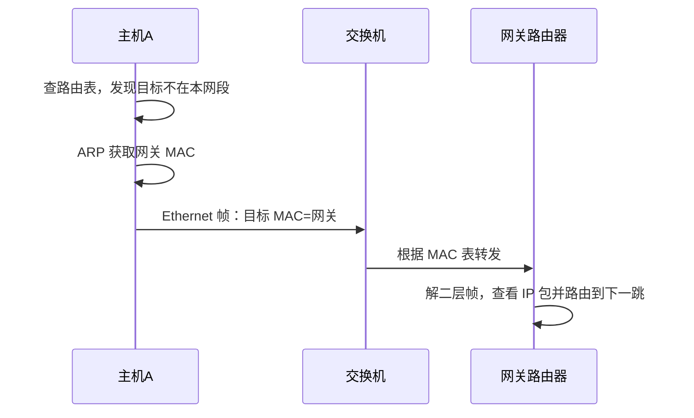

# OSI 第 2 层：数据链路层总览

最后整理：2026-06-11

数据链路层负责同一链路或同一二层网络中的通信。它把网络层交下来的包封装成帧，使用 MAC 地址等链路层地址识别节点，并通过校验字段发现传输错误。

## 学习目标

- 理解帧、MAC 地址、交换机、广播域、冲突域。
- 理解 ARP 为什么是 IPv4 局域网通信的关键。
- 理解 VLAN 如何把一个物理交换网络划分成多个逻辑二层网络。
- 理解 CAN、I2C、SPI 这类总线在嵌入式和工业设备中的链路机制。
- 能通过 MAC 表、ARP 表、抓包判断二层问题。

## 核心概念

| 概念 | 含义 |
|---|---|
| 帧 Frame | 链路层传输单位，包含目标/源 MAC、类型、载荷、校验等 |
| MAC 地址 | 链路层地址，通常 48 位，用于同一二层网络内寻址 |
| 广播 | 发给同一广播域内所有主机，例如 ARP Request |
| 交换机 | 根据 MAC 地址表转发以太网帧 |
| VLAN | 用标签隔离二层广播域 |
| FCS/CRC | 帧校验序列，用于发现链路传输错误 |

## 嵌入式与工业总线

除了 Ethernet 这类局域网链路层，工程中还会遇到很多总线型链路：

| 总线 | 典型场景 | 重点 |
|---|---|---|
| CAN | 汽车、工业控制、机器人 | 消息 ID 仲裁、错误检测、终端电阻 |
| I2C | 板级传感器、EEPROM、RTC | 地址、ACK/NACK、上拉电阻、总线电容 |
| SPI | Flash、显示屏、ADC、无线模块 | 时钟模式、片选、全双工、信号完整性 |

## 数据链路层与网络层的边界

网络层负责“目标 IP 在哪里、下一跳是谁”，数据链路层负责“如何把这一跳发出去”。一次跨网段通信可能经过很多个二层链路，每一跳的源/目标 MAC 都会变化，但源/目标 IP 通常保持不变。

## 常见问题

- ARP 表错误会导致同网段或访问网关失败。
- VLAN 配置错误会导致“物理连通但逻辑不通”。
- 环路会导致广播风暴，需要 STP/RSTP 等机制控制。
- MAC 地址漂移可能表示环路、虚拟机迁移或链路聚合配置问题。

## 参考资料

- IEEE 802.3 Ethernet Working Group: <https://www.ieee802.org/3/>
- RFC 826 ARP: <https://www.rfc-editor.org/rfc/rfc826.html>
- IEEE 802.1Q: <https://standards.ieee.org/ieee/802.1Q/>
- CiA CAN knowledge: <https://www.can-cia.org/can-knowledge/>
