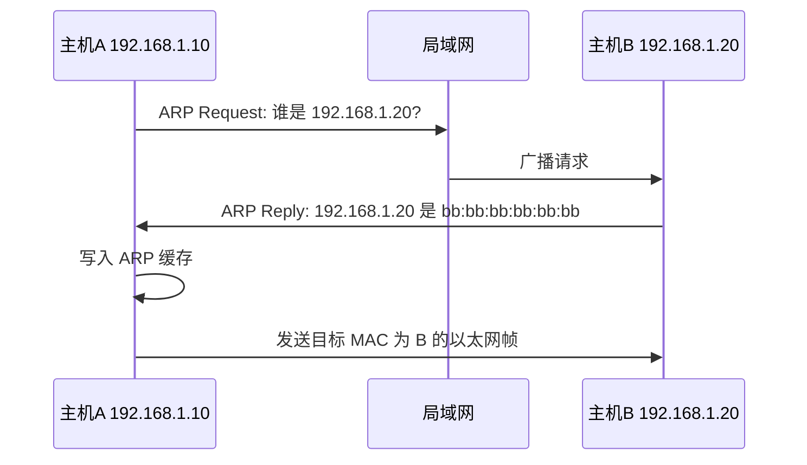

# ARP 地址解析协议学习笔记

最后整理：2026-06-11

ARP（Address Resolution Protocol）用于在 IPv4 局域网中把 IP 地址解析为 MAC 地址。主机知道目标 IP 或网关 IP 后，必须知道下一跳的 MAC 地址，才能封装以太网帧。

## 协议定位

ARP 位于网络层和数据链路层之间。它服务于 IPv4，但报文本身直接封装在以太网帧中，EtherType 为 `0x0806`。IPv6 不使用 ARP，而使用邻居发现协议 NDP。

## 工作流程



## 报文字段

| 字段 | 作用 |
|---|---|
| Hardware Type | 链路类型，以太网通常为 1 |
| Protocol Type | 网络层协议，IPv4 为 `0x0800` |
| Hardware Size | MAC 地址长度，通常 6 |
| Protocol Size | IPv4 地址长度，4 |
| Opcode | 1 表示请求，2 表示应答 |
| Sender MAC/IP | 发送方地址 |
| Target MAC/IP | 目标地址 |

## 常见场景

- 同网段访问：解析目标主机 IP 的 MAC。
- 跨网段访问：解析默认网关 IP 的 MAC。
- Gratuitous ARP：主动声明自己的 IP-MAC 绑定，可用于地址冲突检测、主备切换刷新缓存。

## 常见问题

- ARP 欺骗：攻击者伪造网关或目标主机的 MAC，劫持流量。
- ARP 缓存过期：第一次访问可能多一次 ARP 请求延迟。
- 静态 IP 冲突：多个主机使用同一个 IP，会出现 ARP 表频繁变化。
- VLAN 错误：ARP 请求广播不到目标，表现为同网段不通。

## 排查命令

```powershell
arp -a
ping 192.168.1.1
arp -d 192.168.1.1
```

Wireshark 过滤：

```text
arp
arp.opcode == 1
arp.opcode == 2
```

## 参考资料

- [RFC 826 - Address Resolution Protocol](https://www.rfc-editor.org/rfc/rfc826.html)

