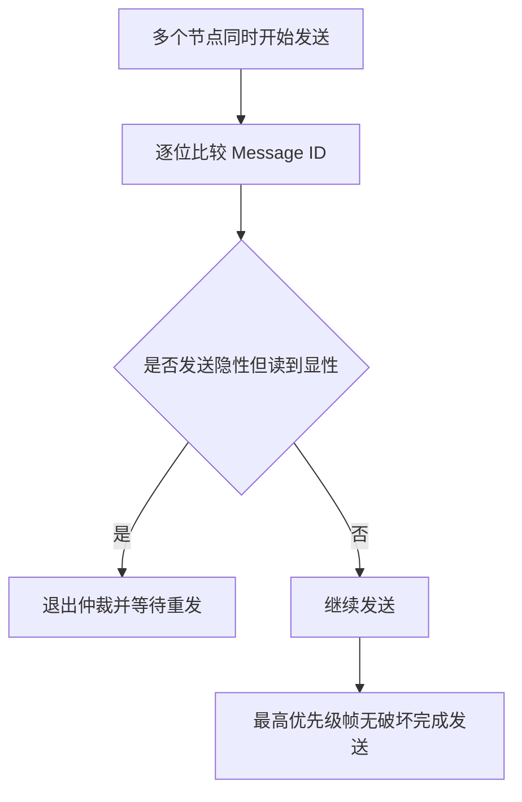

# CAN 控制器局域网学习笔记

最后整理：2026-06-11

CAN（Controller Area Network）是面向汽车和工业控制的总线协议。它强调实时性、抗干扰、错误检测和多主仲裁。CAN 本身主要覆盖物理层和数据链路层，上层还可以运行 CANopen、J1939、DeviceNet 等协议。

## 协议定位

CAN 不是像 TCP/IP 那样的端到端网络协议，而是面向总线的现场通信技术。它用消息 ID 表示消息优先级和含义，而不是用设备地址作为唯一中心。

## 解决的问题

- 多个控制器需要在强干扰环境中可靠通信。
- 汽车和工业现场需要实时、短帧、高可靠的总线。
- 多个节点可能同时发送，需要无破坏仲裁。

## 核心概念

| 概念 | 说明 |
|---|---|
| Message ID | 消息标识符，也决定仲裁优先级 |
| Dominant/Recessive | 显性/隐性电平，用于线与仲裁 |
| Arbitration | 多节点同时发送时，ID 优先级高者继续发送 |
| Data Frame | 数据帧，承载应用数据 |
| Remote Frame | 远程帧，请求发送某个 ID 的数据 |
| Error Frame | 错误帧，通知总线错误 |
| ACK Slot | 接收节点确认帧被正确接收 |

## CAN 仲裁机制

CAN 使用非破坏性仲裁。节点发送时同时监听总线，如果自己发送隐性位但读到显性位，说明有更高优先级消息在发送，于是退出仲裁。

## 标准帧与扩展帧

| 类型 | ID 长度 |
|---|---:|
| 标准帧 | 11 位 |
| 扩展帧 | 29 位 |

CAN Classic 单帧数据长度最多 8 字节。CAN FD 扩展了数据长度和数据阶段速率，更适合更大载荷。

## 常见问题

- 终端电阻缺失或数量错误，导致总线反射和错误帧。
- CAN_H/CAN_L 接反。
- 波特率不一致导致节点无法通信。
- 总线负载过高，低优先级消息延迟变大。
- ID 规划混乱，导致优先级和业务语义不清。

## 参考资料

- Bosch CAN Specification: <https://www.bosch-semiconductors.com/ip-modules/can-protocol/>
- ISO 11898 overview: <https://www.iso.org/standard/63648.html>
- CiA CAN knowledge: <https://www.can-cia.org/can-knowledge/>

