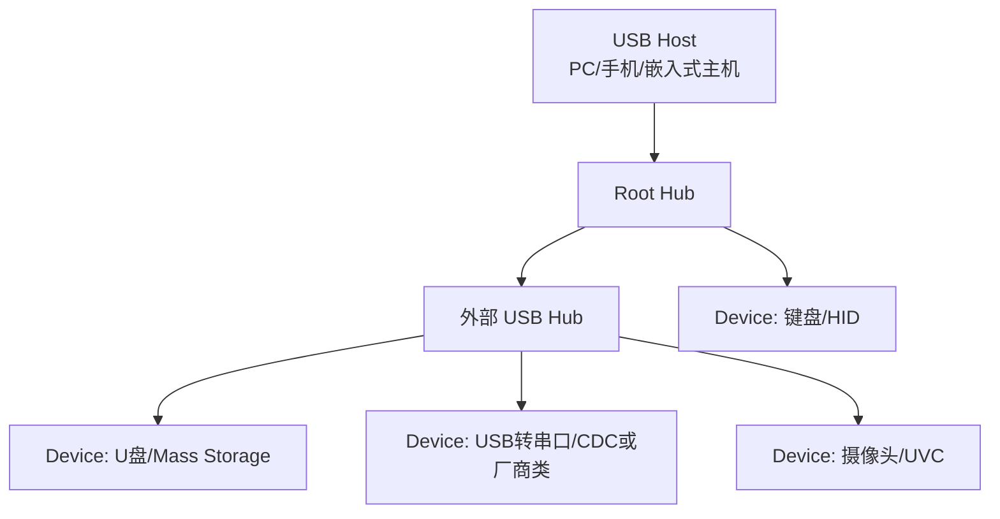
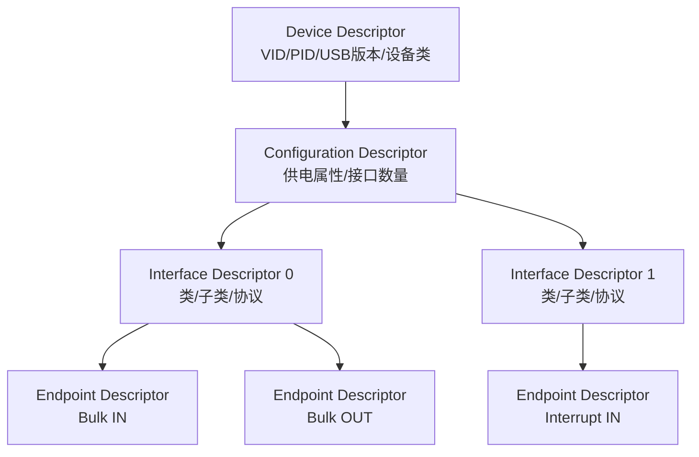
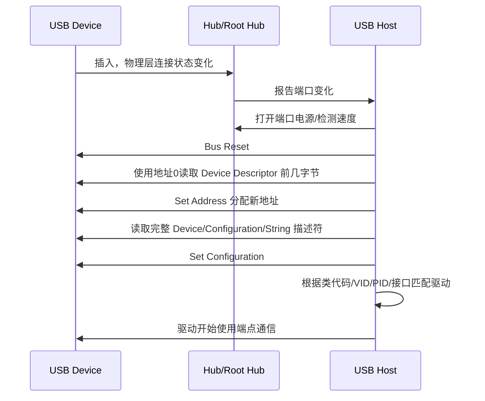

# USB 总线协议学习笔记

最后整理：2026-06-14

Last researched：2026-06-14

USB（Universal Serial Bus）是一套主机中心化的串行总线协议体系。它不只是接口形状，也不只是“充电线”。从协议学习角度看，USB 的核心是：Host 发现 Device，读取描述符，选择配置，加载驱动，然后通过端点进行不同类型的数据传输。

物理连接、Type-C、CC、PD 和线缆能力看 `../01-物理层/USB与Type-C物理层.md`。

## 学习目标

- 理解 USB 的 Host、Device、Hub、Function、Interface、Endpoint。
- 理解 USB 枚举过程：插入、复位、读描述符、分配地址、选择配置、加载驱动。
- 分清设备描述符、配置描述符、接口描述符、端点描述符的层次。
- 掌握控制、批量、中断、同步四类传输的适用场景。
- 能排查 USB 设备不识别、驱动不匹配、端点传输异常、USB 转串口异常等问题。

## USB 在分层模型里的位置

USB 跨越物理层和数据链路层，还包含设备模型和类协议：

| 层次 | USB 中的内容 |
|---|---|
| 物理层 | D+/D-、SuperSpeed 差分对、Type-C 引脚、速率、编码、线缆 |
| 链路/总线层 | 包、事务、帧/微帧、端点、传输类型、错误检测 |
| 设备模型 | 描述符、配置、接口、端点、类/子类/协议 |
| 类协议 | HID、Mass Storage、CDC、Audio、Video、DFU 等 |
| 操作系统层 | 驱动匹配、设备节点、权限、电源管理 |

因此 USB 很难只归到 OSI 某一层。本文件放在数据链路层目录，是因为枚举、端点、传输类型和总线调度更接近“同一链路内如何组织通信”。

## 基本拓扑

USB 是 Host 主导的总线，普通 Device 不会像以太网节点一样主动随意发包。设备要等 Host 轮询或发起事务。



Figure: USB 主机、Hub 和设备拓扑。Host 负责枚举和调度，总线不是对等网络。

## 核心对象

| 对象 | 含义 | 类比 |
|---|---|---|
| Host | 总线主控，发起枚举和传输 | 老师点名和安排通信 |
| Device | USB 设备，可以包含一个或多个功能 | 一个外设整体 |
| Hub | 扩展端口并报告插拔事件 | USB 交换/扩展节点，但不是以太网交换机 |
| Function | 设备提供的一个功能 | 串口、网卡、音频、存储 |
| Configuration | 一组可启用的功能组合 | 设备的一种工作模式 |
| Interface | 驱动通常绑定的功能接口 | 一个功能入口 |
| Alternate Setting | 接口的不同带宽/端点配置 | 摄像头不同分辨率档位 |
| Endpoint | 数据收发通道 | IN/OUT 数据管道 |
| Pipe | Host 软件视角中的端点通信通道 | 驱动使用的通路 |

重要结论：

- USB 驱动通常绑定到 Interface，不一定绑定到整个 Device。
- 一个复合设备可以有多个 Interface，例如“音频 + HID 按键 + CDC 串口”。
- Endpoint 0 是默认控制端点，所有 USB 设备都必须支持，用于枚举和标准控制请求。
- 除端点 0 外，普通端点通常有方向：IN 表示设备到主机，OUT 表示主机到设备。

## 设备描述符层次

USB 设备通过描述符告诉 Host：“我是谁、我有几个配置、每个配置有哪些接口、每个接口有哪些端点、需要什么驱动”。



Figure: USB 描述符的常见层级。实际设备还可能有 BOS、String、HID、Audio、Video 等类特定描述符。

### Device Descriptor

设备级信息：

| 字段 | 含义 |
|---|---|
| `bcdUSB` | 设备声明遵循的 USB 规范版本 |
| `bDeviceClass` | 设备级类代码；复合设备常使用接口级类 |
| `idVendor` | 厂商 VID |
| `idProduct` | 产品 PID |
| `bcdDevice` | 设备版本号 |
| `iManufacturer` | 厂商字符串索引 |
| `iProduct` | 产品字符串索引 |
| `iSerialNumber` | 序列号字符串索引 |
| `bNumConfigurations` | 配置数量 |

Windows、Linux、macOS 都会根据 VID/PID、类代码、接口信息等匹配驱动。实际工程中，VID/PID 相同但固件描述符变化，可能导致驱动匹配和缓存行为变化。

### Configuration Descriptor

配置级信息：

- 该配置包含几个 Interface；
- 设备是总线供电还是自供电；
- 声明最大取电能力；
- 配置总长度，Host 会据此继续读取后续接口和端点描述符。

多数简单设备只有一个配置。复杂设备可能通过不同配置表达不同功能组合。

### Interface Descriptor

接口通常是驱动绑定的单位。一个设备可以有多个接口：

| 设备 | 可能的接口 |
|---|---|
| USB 音箱 | Audio Streaming + HID 按键 |
| USB 摄像头 | Video Control + Video Streaming |
| USB 转串口 | CDC Control + CDC Data，或厂商自定义接口 |
| 复合调试器 | Mass Storage + CDC 串口 + HID 调试接口 |

Interface 的类、子类、协议字段决定系统能否用通用类驱动。

### Endpoint Descriptor

端点描述具体数据通道：

| 字段 | 关注点 |
|---|---|
| Endpoint Address | 端点号和方向，例如 `0x81` 常表示 Endpoint 1 IN |
| Attributes | 控制/批量/中断/同步传输类型 |
| Max Packet Size | 最大包大小 |
| Interval | 中断/同步传输轮询间隔 |

端点不是“端口号”。它更像设备内部的硬件/协议数据管道。

## USB 枚举过程

枚举是 USB 设备从“插上”到“系统可用”的过程。



Figure: USB 枚举的简化流程，实际过程会因 USB 版本、Hub、操作系统和设备类而有差异。

### 枚举关键点

- 新设备先使用默认地址 0 响应控制传输。
- Host 通过端点 0 发标准请求，例如 `GET_DESCRIPTOR`、`SET_ADDRESS`、`SET_CONFIGURATION`。
- 设备描述符必须稳定，连接生命周期内不应随意变化。
- 配置成功后，非 0 端点才进入正常业务传输。
- 如果描述符字段不一致，例如总长度错误、端点数量错误、类描述符格式错误，系统可能枚举失败或驱动不加载。

## 四类传输类型

USB 根据业务需求定义了四类传输。

| 传输类型 | 典型用途 | 特点 | 不适合 |
|---|---|---|---|
| Control 控制传输 | 枚举、标准请求、配置设备 | 可靠、有固定阶段，端点 0 必备 | 大量持续数据 |
| Bulk 批量传输 | U 盘、USB 网卡、USB 转串口数据 | 吞吐高，利用剩余带宽，可靠性好 | 严格实时音视频 |
| Interrupt 中断传输 | 键盘、鼠标、状态通知 | 周期轮询，延迟可控 | 大吞吐连续数据 |
| Isochronous 同步传输 | 音频、视频采集 | 保证带宽和时间，允许丢包 | 不能丢数据的文件传输 |

注意“Interrupt”这个名字容易误导。USB 中断传输不是设备随时打断主机，而是 Host 按约定间隔轮询设备端点。

## 端点方向：IN/OUT 以 Host 为视角

USB 的 IN/OUT 方向永远以 Host 为中心：

| 方向 | 含义 |
|---|---|
| IN | Device -> Host |
| OUT | Host -> Device |

例子：

- USB 转串口收到 MCU 发来的串口数据，再通过 USB Bulk IN 送给 PC。
- PC 要通过 USB 转串口发送 AT 指令，则走 USB Bulk OUT 到转换芯片，再由芯片输出 UART TX。

这也是调试中常见混淆点：USB IN 不等于“进入设备”，而是“进入主机”。

## USB 类协议

USB-IF 定义了许多类协议，让操作系统可以用通用驱动支持同类设备。

| 类 | 全称 | 典型设备 |
|---|---|---|
| HID | Human Interface Device | 键盘、鼠标、游戏手柄、简单控制器 |
| MSC | Mass Storage Class | U 盘、读卡器、部分调试器拖拽烧录盘 |
| CDC ACM | Communications Device Class Abstract Control Model | USB 虚拟串口 |
| UAC | USB Audio Class | USB 声卡、麦克风、耳机 |
| UVC | USB Video Class | 摄像头、采集卡 |
| DFU | Device Firmware Upgrade | 固件升级 |
| NCM/ECM/RNDIS | USB 网络 | USB 网卡、手机网络共享 |
| Vendor Specific | 厂商自定义 | 调试器、加密狗、特殊仪器 |

选择类协议的工程建议：

- 能用标准类就优先用标准类，减少驱动安装成本。
- CDC ACM 适合命令行、日志、低到中速控制通道。
- HID 适合小数据、免驱控制，但报文长度和轮询模型有限制。
- Bulk Vendor 自定义适合高吞吐私有协议，但需要自己维护驱动或用户态库。
- 音视频要认真选择 UAC/UVC 和同步传输参数，避免带宽和延迟问题。

## USB 转串口的协议路径

USB 转串口在 PC 侧是 USB 设备，在另一侧才是 UART/RS-232/RS-485。


排查时分段：

| 段 | 检查内容 |
|---|---|
| USB 枚举 | 设备是否出现、VID/PID、驱动是否加载、是否反复断开 |
| 虚拟串口 | COM 号或 `/dev/ttyUSBx` 是否存在，权限是否正确 |
| UART 参数 | 波特率、数据位、校验位、停止位 |
| 电气层 | TTL 电平、RS-232 电平、RS-485 A/B、GND、终端电阻 |
| 应用协议 | Modbus RTU、AT 指令、自定义帧、CRC、地址 |

## 常见系统观察命令

### Linux

```bash
lsusb
lsusb -t
lsusb -v -d <vid:pid>
dmesg -w
udevadm info -a -n /dev/ttyUSB0
cat /sys/bus/usb/devices/*/speed
```

关注点：

- `lsusb` 看 VID/PID 和设备是否枚举。
- `lsusb -t` 看设备挂在哪个 Host Controller、使用什么驱动、协商速率。
- `dmesg` 看 `device descriptor read/64, error -71`、`reset high-speed USB device`、`not enough bandwidth` 等错误。
- `/dev/ttyACM*` 常见于 CDC ACM；`/dev/ttyUSB*` 常见于 USB-Serial 厂商驱动。

### Windows

常用工具：

- 设备管理器；
- USBView；
- 事件查看器；
- 厂商驱动工具；
- Wireshark USBPcap。

关注点：

- 设备是否显示为未知设备；
- 硬件 ID 中的 VID/PID；
- 是否匹配到了 WinUSB、usbser、HID、Mass Storage 或厂商驱动；
- 是否因为签名、权限、旧驱动冲突导致不能打开设备。

## 常见问题与排查

| 现象 | 可能原因 | 排查建议 |
|---|---|---|
| 插入无任何反应 | 无 VBUS、Type-C CC 错误、线缆坏、接口坏 | 测 VBUS/CC，换线换口 |
| 反复连接/断开 | 供电不足、线缆压降、信号质量差、设备复位 | 看 `dmesg`/事件日志，测电源跌落 |
| `device descriptor read` 失败 | D+/D- 信号问题、上拉异常、固件 EP0 响应错误 | 换短线，示波器看 D+/D-，检查固件控制传输 |
| 枚举成功但驱动不加载 | 类代码错误、VID/PID 不匹配、INF/签名问题 | 查看描述符和硬件 ID |
| 设备变成未知设备 | 描述符格式错误、固件崩溃、供电不稳 | 用 USBView/协议分析仪看失败阶段 |
| 速度不对 | 线缆或接口只支持 USB2，SuperSpeed 线对异常 | `lsusb -t` 看速率，换认证线 |
| UVC 摄像头打不开高分辨率 | 带宽不足、Alt Setting 不对、Hub 限制 | 降低分辨率/帧率，直连主机 |
| CDC 串口能打开但无数据 | 串口参数错、DTR/RTS 未置位、目标电气层错 | 设置 DTR/RTS，检查波特率和电平 |
| Bulk 传输吞吐低 | 包大小、队列深度、短包、驱动同步阻塞 | 增大异步队列，检查 MaxPacket 和缓冲 |

## 描述符设计常见坑

- `wTotalLength` 和实际配置描述符集合长度不一致。
- `bNumInterfaces` 与实际 Interface 数量不一致。
- Endpoint 地址重复或方向错误。
- Max Packet Size 与速度档位不匹配。
- 字符串描述符语言 ID 不完整。
- 复合设备没有正确使用 IAD，导致 Windows 驱动绑定异常。
- CDC ACM 的控制接口、数据接口、功能描述符顺序不符合系统预期。
- HID Report Descriptor 与 Endpoint 包大小、应用层解析不一致。
- 固件在 Set Configuration 后没有正确启用非 0 端点。

## 带宽与调度理解

USB Host 负责调度总线带宽：

- Control 和 Bulk 使用可用带宽，适合可靠传输。
- Interrupt 和 Isochronous 属于周期传输，会预留调度资源。
- 高速 Hub 下接低速/全速设备时，还涉及 Transaction Translator。
- xHCI 控制器下，带宽通常在配置或选择 alternate setting 时决定，不是每次提交传输时才临时抢。

工程判断：

- U 盘、串口、网卡优先考虑 Bulk。
- 键盘鼠标、少量状态上报用 Interrupt。
- 音频视频用 Isochronous 或特定类规范推荐方式。
- 不要用 HID 传大量日志或固件数据，除非确实需要免驱且吞吐要求很低。

## 和 Type-C/PD 的边界

Type-C 和 USB 枚举经常同时发生，但它们解决的问题不同：

| 阶段 | 处理者 | 解决的问题 |
|---|---|---|
| Type-C CC 检测 | Type-C/PD 控制器或简单电阻 | 是否插入、方向、电源角色、默认电流 |
| USB PD 协商 | PD 控制器/固件 | 更高电压电流、角色交换、Alt Mode |
| USB 物理连接 | USB PHY/控制器 | 速率检测、链路训练、信号传输 |
| USB 枚举 | USB Host 栈和设备固件 | 识别设备、读取描述符、加载驱动 |
| 类协议通信 | 驱动和应用 | 传文件、串口、音频、视频、控制命令 |

典型案例：

- 充电器和手机可能只完成 Type-C/PD 协商，不发生 USB 数据枚举。
- U 盘插入 C 口需要先通过 CC 让 VBUS 打开，然后 USB Host 才能枚举设备。
- C 口显示器需要 Type-C/PD/Alt Mode 协商 DisplayPort，再由显示链路传视频；这不是普通 USB 枚举能单独完成的。

## 最小学习案例：CDC ACM 虚拟串口

一个 USB CDC ACM 设备通常包括：

| 组成 | 作用 |
|---|---|
| Device Descriptor | 声明 VID/PID、USB 版本、设备类策略 |
| Configuration Descriptor | 声明一个配置 |
| CDC Control Interface | 控制串口线状态、波特率等 |
| CDC Data Interface | 承载串口数据 |
| Interrupt IN Endpoint | 上报串口状态通知 |
| Bulk IN Endpoint | 设备发给主机的数据 |
| Bulk OUT Endpoint | 主机发给设备的数据 |

应用层看到的是“串口”，但底层实际是 USB 描述符 + 控制请求 + Bulk/Interrupt 端点组合。

## 学习路径建议

1. 先读本篇，掌握 Host、Device、描述符、端点和枚举。
2. 再读 `../01-物理层/USB与Type-C物理层.md`，理解 Type-C、PD 和高速物理层。
3. 做嵌入式 USB Device 时，重点看芯片 SDK 的 USB Device Stack、描述符模板和类驱动。
4. 做 PC 端通信时，重点看系统驱动模型：HID、CDC、WinUSB/libusb、厂商驱动。
5. 做高速硬件时，必须结合 USB-IF 规范、芯片厂商 Layout Guide、示波器和协议分析仪。

## 参考资料

- [Official - USB-IF Document Library](https://www.usb.org/documents)
- [Official - USB-IF USB 2.0 Specification](https://www.usb.org/document-library/usb-20-specification)
- [Official - USB-IF USB 3.2](https://www.usb.org/usb-32)
- [Official - USB-IF USB4](https://www.usb.org/usb4)
- [Official - Microsoft USB device descriptors](https://learn.microsoft.com/en-us/windows-hardware/drivers/usbcon/usb-device-descriptors)
- [Official - Linux Kernel USB Host Side API](https://docs.kernel.org/driver-api/usb/usb.html)
- [Community - CSDN USB 枚举过程](https://blog.csdn.net/MyArrow/article/details/8270029)
- [Community - openvela USB 描述符](https://openvela.csdn.net/69c3bb080a2f6a37c59a43cf.html)
- [Community - openvela USB 设备枚举过程解析](https://openvela.csdn.net/69c3baf954b52172bc643594.html)
