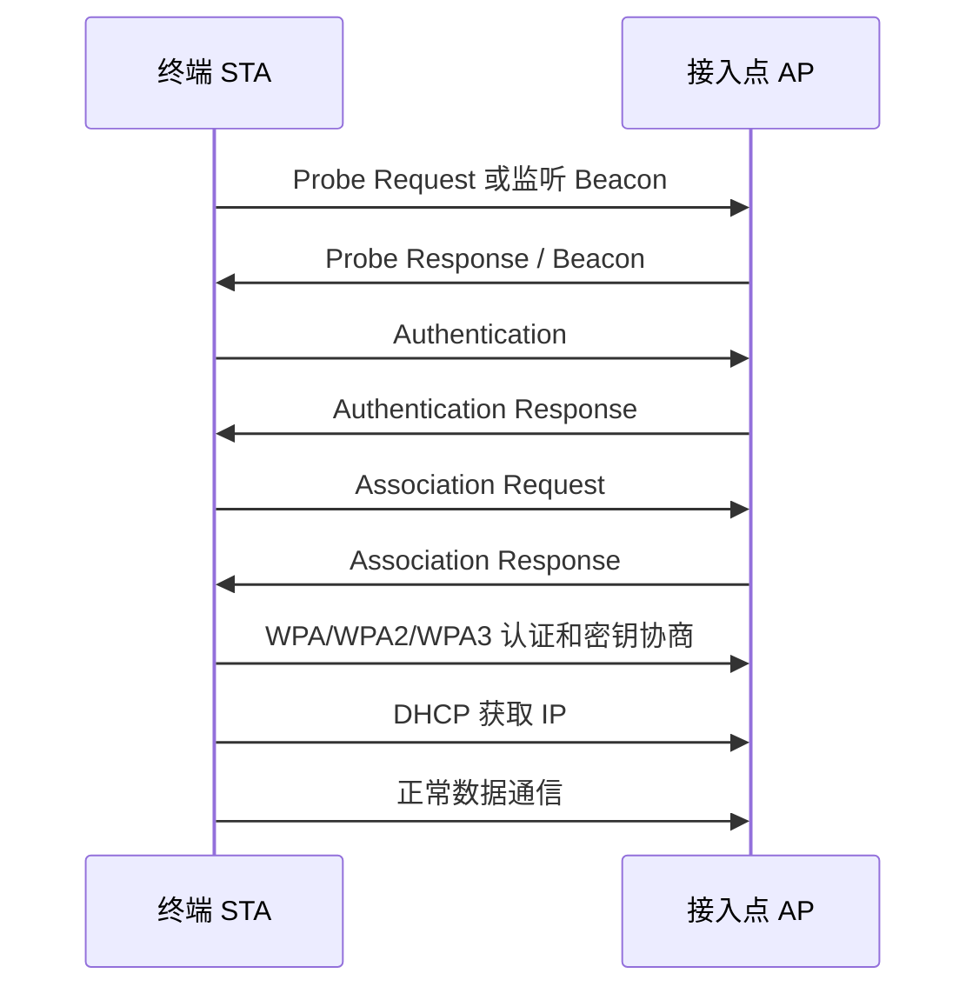

# Wi-Fi 数据链路层 IEEE 802.11 MAC 学习笔记

最后整理：2026-06-14

Last researched：2026-06-14

Wi-Fi 不只是无线电波。802.11 同时包含物理层 PHY 和数据链路层 MAC。PHY 负责频段、信道、调制、编码和空间流；MAC 负责无线介质访问、扫描、认证、关联、帧类型、省电、重传和漫游等机制。本篇关注 802.11 MAC，物理层部分看 `../01-物理层/Wi-Fi物理层-802.11-PHY.md`。

## 学习目标

- 理解 Wi-Fi 的 AP、STA、SSID、BSSID、信道、关联、漫游。
- 分清管理帧、控制帧、数据帧。
- 理解无线链路为什么需要 CSMA/CA，而不是以太网早期的 CSMA/CD。
- 能排查“搜不到 Wi-Fi、连不上、拿不到 IP、速度慢、漫游差、频繁掉线”等问题。

## 基本角色

| 概念 | 含义 |
|---|---|
| STA | Station，无线终端，例如手机、笔记本、IoT 设备 |
| AP | Access Point，无线接入点 |
| SSID | 网络名称，用户看到的 Wi-Fi 名称 |
| BSSID | AP 无线接口 MAC 地址，同一 SSID 下可有多个 BSSID |
| ESS | 多个 AP 使用同一 SSID 形成的扩展服务集 |
| Channel | 信道，例如 2.4GHz 的 1/6/11，5GHz/6GHz 更多 |
| Roaming | 终端在同一 ESS 的不同 AP 之间切换 |

## Wi-Fi 连接流程



注意：802.11 的 Authentication 帧名称容易误导。开放系统认证本身不等于 WPA 密码认证，真正的安全认证和密钥协商由后续 WPA/WPA2/WPA3 机制完成。

## 帧类型

| 帧类型 | 作用 | 例子 |
|---|---|---|
| 管理帧 Management | 发现、认证、关联、漫游 | Beacon、Probe、Authentication、Association、Deauthentication |
| 控制帧 Control | 介质访问控制、确认、保护 | ACK、RTS、CTS、Block ACK |
| 数据帧 Data | 承载上层数据 | IP 数据、ARP、EAPOL、QoS Data |

常见抓包观察点：

- Beacon 是否存在，SSID、信道、加密方式是否正确。
- Association Response 是否拒绝，原因码是什么。
- EAPOL 四次握手是否完成。
- Deauthentication/Disassociation 是否频繁出现。
- 数据帧是否大量重传。

## CSMA/CA 与无线介质访问

无线环境中，终端难以一边发一边可靠检测碰撞，因此 Wi-Fi 使用 CSMA/CA：Carrier Sense Multiple Access with Collision Avoidance。

核心思想：

1. 发送前监听信道是否空闲。
2. 如果空闲，等待 DIFS 和随机退避时间。
3. 发送数据帧。
4. 接收方返回 ACK。
5. 如果未收到 ACK，发送方认为失败并重传。

为什么不是 CSMA/CD：

- 无线发送和接收功率差异大，发送时难以可靠监听别人。
- 隐藏节点问题明显，两个终端互相听不到但都能干扰 AP。
- 无线链路误码和干扰更复杂，ACK/重传是正常机制。

## 隐藏节点、RTS/CTS

隐藏节点指两个终端彼此听不到，但都能和 AP 通信。如果它们同时发给 AP，AP 处会冲突。

RTS/CTS 机制：

```text
STA -> AP: RTS 请求发送
AP  -> STA: CTS 允许发送，并通知周围节点保持静默
STA -> AP: Data
AP  -> STA: ACK
```

RTS/CTS 能缓解隐藏节点，但会增加控制帧开销。通常只在特定场景或超过阈值的帧上使用。

## 省电机制

Wi-Fi 终端为了省电可能进入休眠。AP 会在 Beacon 中通过 TIM/DTIM 告知是否有缓存数据。

| 机制 | 含义 |
|---|---|
| TIM | Traffic Indication Map，提示某些终端有缓存数据 |
| DTIM | Delivery TIM，广播/组播缓存数据释放时机 |
| Power Save | 终端休眠，周期性醒来听 Beacon |

IoT 设备省电场景下，DTIM 周期、休眠策略、路由器兼容性都会影响延迟和掉线感知。

## 加密与认证

| 方案 | 说明 |
|---|---|
| Open | 不加密，不推荐 |
| WEP | 已过时，不安全 |
| WPA/WPA2-Personal | 使用预共享密钥，家庭和小型网络常见 |
| WPA2-Enterprise | 使用 802.1X/EAP/RADIUS，企业网络常见 |
| WPA3-Personal | 使用 SAE，提升抗离线破解能力 |
| WPA3-Enterprise | 企业安全增强 |

抓包时，EAPOL 四次握手是判断 WPA/WPA2 连接是否完成的重要依据。

## 常见问题

| 现象 | 可能原因 | 排查方向 |
|---|---|---|
| 搜不到 SSID | AP 未广播、频段不支持、信道被地区限制、信号太弱 | 看 Beacon、确认国家码和频段 |
| 密码正确但连不上 | 加密模式不兼容、PMF 要求、黑名单、终端能力不足 | 看 Association/EAPOL 失败原因 |
| 已连接但无 IP | DHCP 失败、VLAN 错、AP 隔离、网关不通 | 抓 DHCP、看 ARP 和 VLAN |
| 速度慢 | 信号弱、干扰、信道拥塞、低速终端拖累、带宽配置不合理 | 看 RSSI/SNR/MCS/重传 |
| 频繁掉线 | 漫游阈值、AP 负载、干扰、省电兼容性、Deauth | 看管理帧和客户端日志 |
| 漫游体验差 | AP 功率过大、802.11k/v/r 配置不当、终端策略 | 看 BSSID 切换和重关联时延 |

## 排查工具

| 工具 | 用途 |
|---|---|
| Wireshark monitor mode | 抓 802.11 管理/控制/数据帧 |
| `iw dev` / `iw link` | Linux 查看无线接口和连接状态 |
| `nmcli dev wifi` | Linux 扫描 Wi-Fi |
| 路由器/AP 控制器 | 看客户端 RSSI、协商速率、漫游、重试率 |
| 频谱分析仪 | 看非 Wi-Fi 干扰 |
| 手机 Wi-Fi 分析工具 | 快速看信道拥塞和信号强度 |

## 与以太网的差异

| 对比 | Ethernet | Wi-Fi |
|---|---|---|
| 介质 | 有线双绞线/光纤 | 共享无线频谱 |
| 访问控制 | 交换机全双工场景下基本无碰撞 | CSMA/CA、退避、ACK、重传 |
| 地址 | MAC 地址 | 802.11 帧可包含多个地址字段 |
| 链路稳定性 | 相对稳定 | 受信号、干扰、移动、墙体影响 |
| 抓包 | 普通网卡容易抓本机流量 | 需要 monitor mode 才能看完整 802.11 帧 |

## 参考资料

- Official - IEEE 802.11 Wireless LAN Working Group: <[https://www.ieee802.org/11/](https://www.ieee802.org/11/)>
- Official - Wi-Fi Alliance: <[https://www.wi-fi.org/](https://www.wi-fi.org/)>
- Official - Wireshark WLAN capture setup: <[https://wiki.wireshark.org/CaptureSetup/WLAN](https://wiki.wireshark.org/CaptureSetup/WLAN)>
- Official - Linux wireless documentation: <[https://wireless.wiki.kernel.org/](https://wireless.wiki.kernel.org/)>
- Community - Aruba Wi-Fi fundamentals: <[https://www.arubanetworks.com/techdocs/](https://www.arubanetworks.com/techdocs/)>
