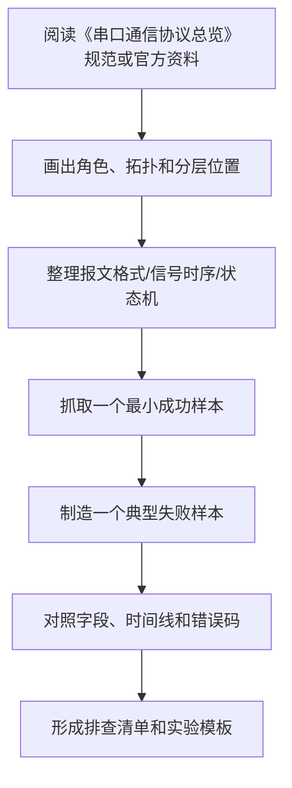

# 串口通信协议总览

<!-- lecture-notes:integrated-v2 -->

## 讲义导读：按分层、字段和时序读协议

这一章讲的是 **串口通信协议总览**，属于 **数据链路层协议**。学习协议时，不要只背“它是什么协议、默认端口是多少”，而要把它当成一份双方共同遵守的通信合同：谁先说话，说什么格式，字段怎么解释，什么时候确认，什么时候重传，出错时返回什么，版本升级时怎样保持兼容。

### 一句话先懂

串口类协议学习重点是电气标准、波特率、帧格式、收发方向、终端匹配和上层数据帧。

初学时先问三个问题：它处在哪一层，解决哪一段通信问题；它的最小报文长什么样；一次正常交互和一次失败交互分别是什么时序。

### 通俗类比

链路层像小区内部快递：不负责跨城路线，但要知道门牌号、门禁规则、包裹格式和收件确认。

类比只是入口。真正排查协议问题时，要回到报文字段、状态机、时序图、错误码、注册编号、协商参数、抓包证据和官方规范上。

### 本章学习主线

1. **先定位分层**：这是物理信号、链路帧、网络寻址、传输连接、加密编码，还是应用语义？
2. **再看参与角色**：谁是主站/从站、客户端/服务端、发布者/订阅者、请求方/响应方？
3. **然后拆报文格式**：固定头、长度、类型、地址、序号、标志位、负载、校验和扩展字段分别做什么？
4. **接着画时序和状态机**：建立、协商、传输、确认、异常、重试、关闭分别在哪些报文里体现？
5. **最后抓包验证**：用工具捕获真实通信，把每个关键字段和标准文档对应起来。

### 本章重点抓手

帧格式、MAC/节点地址、仲裁、CRC、重发、总线时序、VLAN、ARP、MTU 和链路状态。

### 最小实践任务

用串口工具和逻辑分析仪收发一帧数据，核对波特率、校验位、停止位和方向控制。

建议每次学习协议都写一页“协议卡片”：分层位置、典型端口/速率、参与角色、核心字段、正常时序、异常时序、常见抓包过滤条件、官方标准来源。这样以后排查问题时，可以从证据回到规则，而不是凭印象猜。

### 常见误区

- 把链路可达等同于网络可达。
- 忽略 MTU、VLAN、半双工/全双工、总线仲裁。
- 没有核对 CRC、ACK/NACK 或错误帧。

### 推荐观察工具

Wireshark、tcpdump、tshark、curl、openssl、dig/nslookup、ping/traceroute、ss/netstat、串口/逻辑分析仪、协议官方测试工具。

### 读完本章应该能做到

- 说明本协议处在哪一层，以及它不负责哪些事情。
- 画出一次最小正常交互的时序图，并标出关键字段。
- 解释一个失败场景的错误码、超时、重试或状态转换。
- 用抓包、串口日志、逻辑分析仪或官方工具拿到可验证证据。

> 本节是讲义化改写后的阅读入口。后续正文中的字段表、流程图、命令和参考资料，都应围绕“分层定位 + 报文字段 + 时序状态 + 抓包验证”来理解。

最后整理：2026-06-14

“串口通信协议”这个说法在工程现场经常被混用。有人说串口时指 UART，有人指 RS-232 或 RS-485，有人指 Modbus RTU，还有人把 I2C、SPI、CAN 也归到串行通信里。学习时必须先把层次拆开，否则会出现“接线是对的但协议不通”“波特率对了但读不到数据”“RS-485 和 Modbus 混为一谈”等问题。

## 一句话区分

串口通信可以按三层理解：

| 层次 | 解决的问题 | 典型内容 |
|---|---|---|
| 电气/物理层 | 电压、电流、线缆、传输距离、抗干扰 | TTL UART、RS-232、RS-422、RS-485、USB 转串口 |
| 字符帧/链路层 | 一个字节如何在链路上传输和校验 | UART 8N1、奇偶校验、起始位、停止位、流控 |
| 应用层协议 | 字节流代表什么业务含义 | Modbus RTU、Modbus ASCII、NMEA 0183、AT 指令、自定义协议 |

所以，RS-485 不是 Modbus，UART 也不是 RS-232。一个常见组合是：

```text
Modbus RTU 报文 + UART 字符帧 + RS-485 差分电气层
```

另一个常见组合是：

```text
AT 指令文本 + UART 字符帧 + TTL 3.3V 电平
```

## 狭义串口与广义串行通信

### 狭义串口

狭义串口通常指异步串行口，也就是基于 UART 的通信。它的典型特征：

- 不单独传输时钟线；
- 双方约定波特率；
- 每个字符用起始位、数据位、可选校验位、停止位分隔；
- 常见参数写法是 `9600 8N1`、`115200 8N1`、`9600 8E1`；
- 常见物理接口是 TTL UART、RS-232、RS-485。

单片机、嵌入式 Linux、PLC、传感器、调试口、工业仪表中说“串口”，大多数情况下就是这个意思。

### 广义串行通信

广义串行通信指“数据按位依次传输”的通信方式，包含：

- UART；
- I2C；
- SPI；
- CAN；
- USB；
- LIN；
- 1-Wire；
- RS-485 上承载的现场总线。

这些都属于串行通信，但工程中不一定都叫“串口”。例如 I2C 和 SPI 更常被称为板级总线，CAN 更常被称为现场总线或车载总线。

## 按同步方式分类

### 异步串行：UART

UART 是最常见的异步串行通信方式。它不传时钟线，收发双方靠相同波特率和字符帧格式来识别数据。

典型帧：

```text
空闲高电平 -> 起始位 -> 数据位 -> 可选校验位 -> 停止位 -> 空闲
```

常见配置：

| 写法 | 含义 |
|---|---|
| `9600 8N1` | 9600 bps，8 个数据位，无校验，1 个停止位 |
| `115200 8N1` | 115200 bps，8 个数据位，无校验，1 个停止位 |
| `9600 8E1` | 9600 bps，8 个数据位，偶校验，1 个停止位 |
| `9600 7E1` | 9600 bps，7 个数据位，偶校验，1 个停止位，老设备中可见 |

优点：

- 简单；
- 成本低；
- MCU 和工控设备普遍支持；
- 适合调试、低速控制和设备参数配置。

缺点：

- 双方参数必须一致；
- 本身没有地址、重传、业务语义；
- 抗干扰和距离取决于底层电气标准；
- 高速长线通信不如差分总线稳定。

### 同步串行：SPI、I2C

同步串行通信会有时钟线，由主设备提供时钟，接收方根据时钟采样数据。

常见同步串行接口：

| 接口 | 特点 | 典型用途 |
|---|---|---|
| SPI | 全双工、高速、片选区分设备、无统一上层语义 | Flash、显示屏、ADC/DAC、无线模块 |
| I2C | 两根线、地址寻址、ACK/NACK、开漏上拉 | 传感器、EEPROM、RTC、电源芯片 |
| I2S | 音频同步串行接口 | 音频 ADC/DAC、数字麦克风、Codec |

SPI 和 I2C 是串行通信，但它们通常不使用“波特率、8N1、停止位”这套 UART 参数，而是关注时钟频率、时序、地址、片选、ACK 等。

## 按电气层分类

### TTL UART

TTL UART 是 MCU、开发板、传感器模块上常见的串口电平。

常见电平：

- 3.3V TTL；
- 5V TTL。

特点：

- TX、RX、GND 三根线即可通信；
- 常用于板内或短距离板间连接；
- 不能直接接 RS-232，因为 RS-232 电平范围和极性不同；
- 3.3V 和 5V 设备互接时要确认 IO 是否耐压。

典型场景：

- 单片机调试串口；
- USB-TTL 模块连接开发板；
- GPS、蓝牙、Wi-Fi、LoRa 模块 AT 指令；
- 嵌入式 Linux 控制台。

### RS-232

RS-232 是经典串行电气标准，常用于点对点通信。

特点：

- 单端信号；
- 点对点连接；
- 电平不是 TTL，常见为正负电压；
- 抗干扰能力和距离不如差分标准；
- 老式 PC、仪器、工控设备中常见。

典型场景：

- 工业仪表调试；
- 旧设备维护；
- 串口服务器；
- 条码枪、称重仪、老式数控设备。

注意：PC 上的 DB9 接口通常是 RS-232，不是 TTL UART。TTL 串口直接接 RS-232 可能损坏芯片。

### RS-422

RS-422 是差分串行电气标准，适合比 RS-232 更远、更抗干扰的通信。

特点：

- 差分传输；
- 常见为一个发送器、多个接收器；
- 通常适合长距离单向或全双工场景；
- 不像 RS-485 那样强调多发送器共享同一总线。

典型场景：

- 编码器信号；
- 工业设备长距离点对多点；
- 需要抗干扰的串行链路。

### RS-485

RS-485 是工业现场非常常见的差分串行电气标准。

特点：

- 差分传输，抗干扰强；
- 支持多节点总线；
- 常见为半双工两线制，也有四线全双工；
- 需要关注 A/B 线、终端电阻、偏置电阻、总线拓扑；
- 经常承载 Modbus RTU、自定义协议或其他现场协议。

典型场景：

- PLC 与变频器；
- 智能电表；
- 温控仪；
- 传感器采集；
- 多设备轮询控制。

常见误区：

- “设备是 RS-485”只说明电气接口，不说明它一定是 Modbus；
- A/B 标注不同厂家可能相反，接反时通常通信失败；
- 星形接线容易反射和不稳定，优先使用总线型手拉手连接；
- 总线两端通常需要终端电阻，中间节点不随意加。

### USB 转串口

USB 转串口并不是传统意义上的 UART 电气标准，而是通过 USB 芯片在电脑上模拟串口设备。

它实际包含两段完全不同的通信：

```text
PC USB Host
  -> USB 枚举、描述符、驱动、Bulk/Interrupt 端点
  -> USB 转串口芯片
  -> UART 字符帧
  -> TTL / RS-232 / RS-485 电气层
  -> 目标设备
```

所以“USB 转串口不通”不能只查波特率，也要确认 USB 侧是否枚举成功、驱动是否加载、Type-C 线缆是否支持数据、转换芯片是否被系统识别。

常见芯片：

- CH340/CH341；
- CP210x；
- FT232；
- PL2303。

常见形式：

- USB-TTL；
- USB-RS232；
- USB-RS485。

排查重点：

- Type-C 口是否正确识别，C to C 线是否是数据线；
- 驱动是否正常；
- 设备号是否变化；
- 转换器类型是否匹配目标设备；
- USB-TTL 的电平是 3.3V 还是 5V；
- USB-RS485 是否自动控制收发方向。

## 按通信拓扑分类

### 点对点

两个设备直接通信。

常见组合：

- TTL UART；
- RS-232；
- RS-422；
- 两个 MCU 的 UART。

优点是简单，缺点是扩展多设备困难。

### 主从轮询

一个主站依次请求多个从站，从站只在被询问时响应。

常见组合：

- Modbus RTU + RS-485；
- 自定义主从协议 + RS-485。

优点是总线冲突少、实现简单。缺点是实时性受轮询周期影响，主站故障后整条链路通常无法工作。

### 多主或仲裁

多个节点可能发起通信，需要仲裁或冲突处理。

典型代表：

- CAN：通过消息 ID 仲裁；
- I2C：支持多主仲裁，但实际项目中常见单主；
- RS-485 自定义多主：需要额外设计避让和重发机制。

UART/RS-485 本身不提供可靠多主仲裁，随意让多个设备同时发送会造成总线冲突。

## 按上层协议分类

### 裸 UART 字节流

最简单的方式是直接发送字节或文本。

例子：

```text
HELLO\r\n
```

适合：

- 调试日志；
- 简单命令；
- 两个固定设备之间的简单通信。

缺点：

- 没有统一帧边界；
- 没有地址；
- 没有错误恢复；
- 二进制数据中可能出现分隔符冲突。

### AT 指令

AT 指令是一类文本命令风格，常见于通信模块。

例子：

```text
AT\r\n
AT+GMR\r\n
AT+RST\r\n
```

典型设备：

- 蓝牙模块；
- Wi-Fi 模块；
- 4G/5G 模块；
- GPS/GNSS 模块的配置接口；
- LoRa/NB-IoT 模块。

特点：

- 可读性强；
- 适合人工调试；
- 不同厂家扩展命令差异很大；
- 响应格式要按模块手册解析。

### Modbus RTU

Modbus RTU 是工业现场最常见的串口应用层协议之一。

典型帧：

```text
从站地址 + 功能码 + 数据 + CRC16
```

特点：

- 主从模式；
- 使用地址区分设备；
- 使用功能码读写线圈和寄存器；
- CRC16 校验；
- 常运行在 RS-485 上；
- 帧之间依赖静默时间分隔。

适合：

- PLC；
- 变频器；
- 电表；
- 温控器；
- 采集模块；
- 工业传感器。

### Modbus ASCII

Modbus ASCII 也是串口 Modbus 变体，使用 ASCII 字符表示报文。

特点：

- 以冒号 `:` 开始；
- 使用 ASCII 十六进制字符；
- 使用 LRC 校验；
- 可读性比 RTU 好；
- 效率比 RTU 低；
- 老设备或特殊场景中可见。

### NMEA 0183

NMEA 0183 常用于 GPS/GNSS、航海电子设备。

典型格式：

```text
$GPGGA,....*CS
```

特点：

- 文本协议；
- 以 `$` 开头；
- 逗号分隔字段；
- 末尾有校验；
- 常通过 UART/RS-232/RS-422 输出。

典型场景：

- GPS 定位模块；
- 船舶导航设备；
- 时间同步设备。

### LIN

LIN 是 Local Interconnect Network，常用于汽车低成本车身电子网络。

特点：

- 单线串行；
- 主从结构；
- 成本低；
- 速率较低；
- 常用于车窗、座椅、空调、雨刮等非关键控制。

LIN 不等同于普通 UART，但其底层与 UART 字符传输有密切关系。

### DMX512

DMX512 常用于舞台灯光控制。

特点：

- 基于差分传输；
- 常用 RS-485 物理层；
- 主控连续发送通道数据；
- 适合灯光亮度、颜色、动作控制；
- 强调实时刷新，不强调可靠重传。

### 厂家自定义协议

很多设备使用厂家自定义串口协议。

常见帧格式：

```text
帧头 + 地址 + 命令 + 长度 + 数据 + 校验 + 帧尾
```

例子：

```text
AA 55 01 03 02 00 64 CRC
```

设计自定义协议时应考虑：

- 帧头如何同步；
- 长度字段如何定义；
- 是否需要地址；
- 校验用和校验、CRC8、CRC16 还是 CRC32；
- 字节序是大端还是小端；
- 超时和重发机制；
- 粘包、半包、丢字节如何恢复；
- 协议版本如何扩展。

## 常见串口参数

| 参数 | 说明 | 常见值 |
|---|---|---|
| 波特率 | 每秒符号数，工程中常近似理解为 bps | 9600、19200、38400、57600、115200 |
| 数据位 | 每个字符携带的数据位数 | 7、8 |
| 校验位 | 奇偶校验或无校验 | N、E、O |
| 停止位 | 字符结束标记 | 1、1.5、2 |
| 流控 | 控制发送节奏 | 无、RTS/CTS、XON/XOFF |

`115200 8N1` 表示：

- 115200 波特；
- 8 个数据位；
- 无奇偶校验；
- 1 个停止位。

## 常见接线方式

### TTL UART

```text
设备A TX -> 设备B RX
设备A RX <- 设备B TX
设备A GND -- 设备B GND
```

注意 TX/RX 交叉连接，并共地。

### RS-232

常见信号：

- TXD；
- RXD；
- GND；
- RTS/CTS；
- DTR/DSR。

简单通信通常只需要 TXD、RXD、GND，但硬件流控设备可能需要 RTS/CTS。

### RS-485 两线半双工

```text
A 连接 A
B 连接 B
GND 视现场情况连接参考地
总线两端加终端电阻
```

注意不同厂家可能把 A/B、D+/D- 标注反过来。现场不通时可以在确认安全的前提下交换 A/B 测试。

## 串口通信排查清单

按顺序排查：

1. 确认电气类型：TTL、RS-232、RS-485 不能混接。
2. 确认电平：TTL 3.3V 和 5V 是否兼容。
3. 确认接线：TX/RX 是否交叉，RS-485 A/B 是否正确，GND 是否需要连接。
4. 确认串口参数：波特率、数据位、校验位、停止位是否一致。
5. 确认通信方向：RS-485 半双工是否正确控制发送/接收方向。
6. 确认上层协议：是否是 Modbus RTU、AT 指令、NMEA、自定义帧。
7. 确认地址：从站地址、设备 ID、广播地址是否正确。
8. 确认校验：CRC、LRC、和校验、异或校验是否按文档计算。
9. 确认字节序：寄存器高低字节、浮点数大小端是否正确。
10. 确认时序：超时时间、帧间隔、轮询周期是否满足设备要求。

## 选型建议

| 场景 | 推荐 |
|---|---|
| MCU 调试日志 | TTL UART + USB-TTL |
| PC 连接老式仪器 | RS-232 |
| 工业现场多设备轮询 | RS-485 + Modbus RTU |
| 板级低速传感器 | I2C |
| 板级高速外设 | SPI |
| 汽车或机器人多节点控制 | CAN 或 CANopen |
| GPS 模块输出定位语句 | UART + NMEA 0183 |
| 蜂窝/Wi-Fi/蓝牙模块配置 | UART + AT 指令 |
| 舞台灯光 | RS-485 物理层 + DMX512 |

## 与已有笔记的关系

- `../01-物理层/RS-232.md`：重点看 RS-232 电气层和点对点串口。
- `../01-物理层/RS-422.md`：重点看差分串行和点对多点。
- `../01-物理层/RS-485.md`：重点看工业差分总线、终端电阻和 Modbus 的关系。
- `I2C.md`：重点看同步串行、地址、ACK/NACK。
- `SPI.md`：重点看同步串行、时钟模式、片选。
- `CAN-控制器局域网.md`：重点看仲裁、错误处理和车载/工业总线。
- `../01-物理层/USB与Type-C物理层.md`：重点看 USB 物理层、Type-C、CC、VCONN、USB PD 和线缆能力。
- `USB总线协议.md`：重点看 USB 枚举、描述符、端点、传输类型和 USB 转串口在系统中的位置。
- `../07-应用层/Modbus.md`：重点看 Modbus RTU/ASCII/TCP 的报文语义。

---

## 万字精讲扩展（2026-06-16 更新）
> Last researched: 2026-06-16。本文补充内容以协议规范、RFC、标准组织资料和抓包排查实践为主；具体设备、芯片、操作系统、网关和库实现可能存在差异，真实项目中应继续核对对应版本手册和现场抓包。

### 本章在协议学习路线中的位置

《串口通信协议总览》是协议体系中的一个观察点。学习它时不要只问“它是什么”，还要问它处在哪一层、解决什么互操作问题、依赖什么下层能力、给上层提供什么语义、正常流程如何推进、异常流程如何终止。协议学习的最终目标不是背标准号，而是在真实系统中定位问题：线缆是否可靠，帧是否完整，地址是否正确，路由是否可达，连接是否建立，握手是否成功，业务字段是否被双方一致理解。

本章学习完成后，至少应达到三个标准。第一，能画出最小拓扑和分层位置。第二，能解释关键报文字段、状态机或信号时序。第三，能设计一个抓包或测量实验，把正常样本和失败样本对比出来。只要这三个标准完成，这篇笔记就能用于工程排查，而不仅是概念复习。

### 数据链路层类协议的精讲重点

数据链路层关注同一链路或同一介质上的帧传输。它通常处理帧边界、物理地址、介质访问、仲裁、校验、重发或错误检测。以太网 MAC、VLAN、ARP、PPP、CAN、I2C、SPI、USB 总线、Wi-Fi MAC 和串口帧格式都属于这一层或接近这一层的学习对象。链路层错误常表现为“设备能上电但通信不稳定”“偶发 CRC 错”“总线被拉死”“地址解析失败”“广播风暴”“仲裁冲突”或“帧边界错”。

链路层学习要特别关注“谁能说话、什么时候说话、怎么知道一帧结束”。I2C 有起始/停止、地址、ACK/NACK 和上拉电阻；SPI 没有统一高层标准，片选、时钟极性相位、字节序和帧长度必须由设备手册定义；CAN 依赖仲裁、位填充、错误状态和终端；以太网依赖 MAC 地址和 FCS；Wi-Fi MAC 要处理关联、认证、管理帧、重传和加密；USB 总线有主机调度、端点、传输类型和枚举过程。不同链路的“帧”概念不能混用。

### 协议学习的底层方法：先分层，再看报文，再看状态机

协议学习最常见的错误，是把协议当成一串术语和端口号背诵。真正能用于工程排查的学习方式，应同时抓住四个维度：分层位置、报文格式、状态机和错误处理。分层位置回答“这个协议依赖谁、服务谁”；报文格式回答“线上实际传了哪些字段”；状态机回答“双方如何从开始到结束推进”；错误处理回答“超时、重传、乱序、丢包、校验失败、权限失败、版本不兼容时应该怎样表现”。只有这四个维度都清楚，遇到抓包、串口波形、日志或现场问题时才不会只凭感觉判断。

学习任何协议时，都建议先画一个最小通信链路。物理层协议要画电平、线缆、连接器、阻抗、端接、拓扑和速率；链路层协议要画帧边界、地址、校验、仲裁和介质访问；网络层协议要画寻址、路由、分片、MTU、错误反馈和安全封装；传输层协议要画连接、端口、可靠性、流控、拥塞、保活和关闭；应用层协议要画请求响应、会话、认证、编码、版本协商和业务语义。这个图比单纯背“它属于第几层”更有价值。

### 抓包和排查闭环


Figure: 协议排查闭环，综合 IETF RFC、USB/NXP/Modbus/OASIS/OPC/IEEE 等规范和 Wireshark/tcpdump 实践资料整理。

排查时不要只看单个包。很多协议问题只有放在时序里才成立：TCP 三次握手是否完成，TLS 握手在哪一步失败，DNS 是否有重传或返回错误码，HTTP 是否被代理或缓存影响，Modbus 是否功能码和寄存器地址不匹配，RS-485 是否方向控制或终端电阻错误，CAN 是否仲裁失败或错误帧增加，MQTT 是否 Keep Alive 超时，OPC UA 是否安全策略或证书不匹配。单包解释字段，多包解释状态机。

### 报文字段要和工程现象绑定

协议字段不是孤立名词。长度字段错误可能导致粘包拆包失败；校验字段错误可能说明线路干扰、字节序错误或帧边界错；序列号和确认号异常可能指向丢包、重传、乱序或中间设备干预；TTL/Hop Limit 异常可能说明路由环路或路径变化；MSS/MTU 不匹配可能造成黑洞；TLS Alert 可以直接提示证书、版本、密码套件或应用协议协商问题；HTTP 状态码要结合方法、缓存、代理和服务端日志解释。学习时每个字段都应该写“它异常时会看到什么”。

### 规范、实现和现场三者要分开

协议规范说明应该如何互操作，实现代码说明某个库或设备实际怎么做，现场抓包说明这一刻真实发生了什么。三者可能不完全一致：旧设备可能只支持旧版本，厂商实现可能有扩展字段，中间盒可能改写报文，NAT/防火墙/代理可能改变连接行为，串口网关可能改变时序，工业现场线缆和接地可能影响物理层。工程判断应优先以规范为语义基准，以抓包和测量为事实依据，以实现文档解释具体差异。

### 核心知识点逐条精讲

#### 1. 串口通信协议总览 的协议定位

在《串口通信协议总览》中，`串口通信协议总览 的协议定位` 必须同时落到规范、报文和现场现象三层。规范层回答这个协议被设计来解决什么问题，依赖哪些下层能力，向上提供哪些语义；报文层回答字段如何编码、长度如何确定、状态如何推进、错误如何表达；现场层回答当线路、设备、软件、配置或中间网络异常时，会在日志、抓包、波形或业务行为上看到什么。只知道概念而看不懂报文，排查时会缺少证据；只会看字段而不知道状态机，也容易把正常重传、协商或错误响应误判成故障。

学习 `串口通信协议总览 的协议定位` 时建议固定写五项：第一，通信双方角色和拓扑；第二，最小成功流程；第三，关键字段或信号；第四，常见失败流程；第五，验证工具。比如网络协议要写 Wireshark display filter、tcpdump 命令、端口和状态码；串行和总线协议要写逻辑分析仪通道、波特率/时钟、采样设置、字节序和校验；工业协议要写站号、对象字典、寄存器地址、功能码、设备配置和网关映射。这样笔记会直接服务排查，而不是只能复习概念。

工程上要特别警惕“协议名相同但实现差异很大”。同一个 `串口通信协议总览` 在不同设备、系统版本、库版本、网关或厂商扩展中，可能在超时、重试、字节序、字段可选性、安全策略、错误码、最大报文长度、默认端口和兼容模式上存在差异。规范给出互操作底线，设备手册给出实现约束，抓包和测量给出现场事实。三者互相校验，才能得到可靠结论。

#### 2. 帧格式和边界

在《串口通信协议总览》中，`帧格式和边界` 必须同时落到规范、报文和现场现象三层。规范层回答这个协议被设计来解决什么问题，依赖哪些下层能力，向上提供哪些语义；报文层回答字段如何编码、长度如何确定、状态如何推进、错误如何表达；现场层回答当线路、设备、软件、配置或中间网络异常时，会在日志、抓包、波形或业务行为上看到什么。只知道概念而看不懂报文，排查时会缺少证据；只会看字段而不知道状态机，也容易把正常重传、协商或错误响应误判成故障。

学习 `帧格式和边界` 时建议固定写五项：第一，通信双方角色和拓扑；第二，最小成功流程；第三，关键字段或信号；第四，常见失败流程；第五，验证工具。比如网络协议要写 Wireshark display filter、tcpdump 命令、端口和状态码；串行和总线协议要写逻辑分析仪通道、波特率/时钟、采样设置、字节序和校验；工业协议要写站号、对象字典、寄存器地址、功能码、设备配置和网关映射。这样笔记会直接服务排查，而不是只能复习概念。

工程上要特别警惕“协议名相同但实现差异很大”。同一个 `串口通信协议总览` 在不同设备、系统版本、库版本、网关或厂商扩展中，可能在超时、重试、字节序、字段可选性、安全策略、错误码、最大报文长度、默认端口和兼容模式上存在差异。规范给出互操作底线，设备手册给出实现约束，抓包和测量给出现场事实。三者互相校验，才能得到可靠结论。

#### 3. 地址、仲裁和介质访问

在《串口通信协议总览》中，`地址、仲裁和介质访问` 必须同时落到规范、报文和现场现象三层。规范层回答这个协议被设计来解决什么问题，依赖哪些下层能力，向上提供哪些语义；报文层回答字段如何编码、长度如何确定、状态如何推进、错误如何表达；现场层回答当线路、设备、软件、配置或中间网络异常时，会在日志、抓包、波形或业务行为上看到什么。只知道概念而看不懂报文，排查时会缺少证据；只会看字段而不知道状态机，也容易把正常重传、协商或错误响应误判成故障。

学习 `地址、仲裁和介质访问` 时建议固定写五项：第一，通信双方角色和拓扑；第二，最小成功流程；第三，关键字段或信号；第四，常见失败流程；第五，验证工具。比如网络协议要写 Wireshark display filter、tcpdump 命令、端口和状态码；串行和总线协议要写逻辑分析仪通道、波特率/时钟、采样设置、字节序和校验；工业协议要写站号、对象字典、寄存器地址、功能码、设备配置和网关映射。这样笔记会直接服务排查，而不是只能复习概念。

工程上要特别警惕“协议名相同但实现差异很大”。同一个 `串口通信协议总览` 在不同设备、系统版本、库版本、网关或厂商扩展中，可能在超时、重试、字节序、字段可选性、安全策略、错误码、最大报文长度、默认端口和兼容模式上存在差异。规范给出互操作底线，设备手册给出实现约束，抓包和测量给出现场事实。三者互相校验，才能得到可靠结论。

#### 4. 校验与错误处理

在《串口通信协议总览》中，`校验与错误处理` 必须同时落到规范、报文和现场现象三层。规范层回答这个协议被设计来解决什么问题，依赖哪些下层能力，向上提供哪些语义；报文层回答字段如何编码、长度如何确定、状态如何推进、错误如何表达；现场层回答当线路、设备、软件、配置或中间网络异常时，会在日志、抓包、波形或业务行为上看到什么。只知道概念而看不懂报文，排查时会缺少证据；只会看字段而不知道状态机，也容易把正常重传、协商或错误响应误判成故障。

学习 `校验与错误处理` 时建议固定写五项：第一，通信双方角色和拓扑；第二，最小成功流程；第三，关键字段或信号；第四，常见失败流程；第五，验证工具。比如网络协议要写 Wireshark display filter、tcpdump 命令、端口和状态码；串行和总线协议要写逻辑分析仪通道、波特率/时钟、采样设置、字节序和校验；工业协议要写站号、对象字典、寄存器地址、功能码、设备配置和网关映射。这样笔记会直接服务排查，而不是只能复习概念。

工程上要特别警惕“协议名相同但实现差异很大”。同一个 `串口通信协议总览` 在不同设备、系统版本、库版本、网关或厂商扩展中，可能在超时、重试、字节序、字段可选性、安全策略、错误码、最大报文长度、默认端口和兼容模式上存在差异。规范给出互操作底线，设备手册给出实现约束，抓包和测量给出现场事实。三者互相校验，才能得到可靠结论。

#### 5. 抓包/逻辑分析仪观察

在《串口通信协议总览》中，`抓包/逻辑分析仪观察` 必须同时落到规范、报文和现场现象三层。规范层回答这个协议被设计来解决什么问题，依赖哪些下层能力，向上提供哪些语义；报文层回答字段如何编码、长度如何确定、状态如何推进、错误如何表达；现场层回答当线路、设备、软件、配置或中间网络异常时，会在日志、抓包、波形或业务行为上看到什么。只知道概念而看不懂报文，排查时会缺少证据；只会看字段而不知道状态机，也容易把正常重传、协商或错误响应误判成故障。

学习 `抓包/逻辑分析仪观察` 时建议固定写五项：第一，通信双方角色和拓扑；第二，最小成功流程；第三，关键字段或信号；第四，常见失败流程；第五，验证工具。比如网络协议要写 Wireshark display filter、tcpdump 命令、端口和状态码；串行和总线协议要写逻辑分析仪通道、波特率/时钟、采样设置、字节序和校验；工业协议要写站号、对象字典、寄存器地址、功能码、设备配置和网关映射。这样笔记会直接服务排查，而不是只能复习概念。

工程上要特别警惕“协议名相同但实现差异很大”。同一个 `串口通信协议总览` 在不同设备、系统版本、库版本、网关或厂商扩展中，可能在超时、重试、字节序、字段可选性、安全策略、错误码、最大报文长度、默认端口和兼容模式上存在差异。规范给出互操作底线，设备手册给出实现约束，抓包和测量给出现场事实。三者互相校验，才能得到可靠结论。


### 场景化学习与排错表

| 主题 | 推荐动作 | 常见风险 | 验证方式 |
| :--- | :--- | :--- | :--- |
| 串口通信协议总览 的协议定位 | 先查规范和设备手册，再抓取最小成功/失败样本，最后写成排查规则 | 只背概念、不看报文；只看单包、不看状态机；忽略版本和设备差异 | Wireshark/tcpdump/串口日志/逻辑分析仪/示波器/设备日志/最小复现实验 |
| 帧格式和边界 | 先查规范和设备手册，再抓取最小成功/失败样本，最后写成排查规则 | 只背概念、不看报文；只看单包、不看状态机；忽略版本和设备差异 | Wireshark/tcpdump/串口日志/逻辑分析仪/示波器/设备日志/最小复现实验 |
| 地址、仲裁和介质访问 | 先查规范和设备手册，再抓取最小成功/失败样本，最后写成排查规则 | 只背概念、不看报文；只看单包、不看状态机；忽略版本和设备差异 | Wireshark/tcpdump/串口日志/逻辑分析仪/示波器/设备日志/最小复现实验 |
| 校验与错误处理 | 先查规范和设备手册，再抓取最小成功/失败样本，最后写成排查规则 | 只背概念、不看报文；只看单包、不看状态机；忽略版本和设备差异 | Wireshark/tcpdump/串口日志/逻辑分析仪/示波器/设备日志/最小复现实验 |
| 抓包/逻辑分析仪观察 | 先查规范和设备手册，再抓取最小成功/失败样本，最后写成排查规则 | 只背概念、不看报文；只看单包、不看状态机；忽略版本和设备差异 | Wireshark/tcpdump/串口日志/逻辑分析仪/示波器/设备日志/最小复现实验 |

这张表的重点是把协议知识变成可验证动作。协议问题通常不是一句“网络不通”或“设备不兼容”能解释的，而是需要把拓扑、配置、报文、状态机、时间线和错误码拼在一起。每次排查结束，都应把最终规则写回笔记，例如某设备的超时时间、某网关的字节序、某协议栈的版本限制或某端口在防火墙上的放行条件。

### 本章建议工作流



Figure: 《串口通信协议总览》学习工作流，综合 RFC、USB-IF、NXP、Modbus、OASIS、OPC Foundation、IEEE、Wireshark/tcpdump 等资料整理。

这个流程强调“成功样本”和“失败样本”都要保留。只保存成功样本，现场出问题时没有对照；只看失败样本，容易不知道正常状态机应该长什么样。对协议学习者来说，一组高质量抓包、串口日志或波形截图，比一段泛泛解释更能积累经验。

### 常见误区和纠正方法

- 误区：只背 OSI 层级。纠正：层级只是定位工具，必须继续看报文格式、状态机、错误码和现场证据。
- 误区：端口通就认为协议通。纠正：端口可达只说明传输层可能可达，应用层认证、版本、功能码、证书、权限和业务字段仍可能失败。
- 误区：只抓客户端或只抓服务端。纠正：复杂问题要尽量在两端或关键中间点同时取证，尤其是 NAT、代理、网关、交换机和串口转换器场景。
- 误区：忽略时间。纠正：超时、重试、保活、退避、握手和关闭都依赖时间线；协议排查要看相对时间和间隔。
- 误区：把社区文章当规范。纠正：社区经验适合发现常见坑，语义和字段定义应回到 RFC、标准组织文档、厂商手册和抓包事实。
- 误区：只保存结论，不保存样本。纠正：保留 pcap、串口日志、波形、配置和版本信息，后续才能复盘和对比。

### 与相邻协议的关系

《串口通信协议总览》通常不是单独工作的。物理层问题会让链路层帧错误增加，链路层地址或校验错误会影响网络层可达性，网络层 MTU/NAT/路由会影响传输层连接，传输层超时和重传会影响应用层表现，表示层编码和 TLS 会影响应用层解析。排查时要从现象所在层向下验证承载是否正常，再向上验证语义是否正确。不要在没有证据的情况下跨层猜测。

### 实操训练和复盘模板

1. 围绕 `串口通信协议总览 的协议定位` 做一次最小实验：记录拓扑、配置、成功样本、失败样本、字段解释和最终结论。
2. 围绕 `帧格式和边界` 做一次最小实验：记录拓扑、配置、成功样本、失败样本、字段解释和最终结论。
3. 围绕 `地址、仲裁和介质访问` 做一次最小实验：记录拓扑、配置、成功样本、失败样本、字段解释和最终结论。
4. 围绕 `校验与错误处理` 做一次最小实验：记录拓扑、配置、成功样本、失败样本、字段解释和最终结论。
5. 围绕 `抓包/逻辑分析仪观察` 做一次最小实验：记录拓扑、配置、成功样本、失败样本、字段解释和最终结论。

建议每篇协议笔记都维护下面的复盘格式：

```text
实验名称：
协议主题：串口通信协议总览
设备/软件/版本：
拓扑：客户端、服务端、网关、交换机、线缆、总线节点
关键配置：端口、地址、速率、校验、证书、账号、功能码、寄存器、topic 等
成功样本：抓包文件、串口日志、波形或设备日志位置
失败样本：如何复现，错误码或异常现象
字段解释：哪些字段证明状态机走到哪一步
根因判断：线路/配置/协议栈/版本/权限/业务数据/中间设备
修复动作：
回归验证：
以后检查规则：
```

这个模板能避免“凭经验说可能是某某问题”。协议排查必须留下证据链：现象是什么、哪一层开始异常、哪个字段证明异常、哪个实验排除了其他可能。长期积累后，这些复盘会比零散教程更有价值。

## 参考资料与延伸阅读

- [IETF / RFC] RFC 791 - Internet Protocol IPv4: https://datatracker.ietf.org/doc/html/rfc791
- [IETF / RFC] RFC 8200 - Internet Protocol Version 6 IPv6: https://www.rfc-editor.org/info/rfc8200
- [IETF / RFC] RFC 826 - Address Resolution Protocol ARP: https://datatracker.ietf.org/doc/html/rfc826
- [IETF / RFC] RFC 792 - Internet Control Message Protocol ICMP: https://datatracker.ietf.org/doc/html/rfc792
- [IETF / RFC] RFC 4443 - ICMPv6: https://datatracker.ietf.org/doc/html/rfc4443
- [IETF / RFC] RFC 768 - User Datagram Protocol UDP: https://datatracker.ietf.org/doc/html/rfc768
- [IETF / RFC] RFC 9293 - Transmission Control Protocol TCP: https://datatracker.ietf.org/doc/rfc9293/
- [IETF / RFC] RFC 9000 - QUIC: A UDP-Based Multiplexed and Secure Transport: https://datatracker.ietf.org/doc/rfc9000/
- [IETF / RFC] RFC 8446 - TLS 1.3: https://www.rfc-editor.org/info/rfc8446/
- [IETF / RFC] RFC 9110 - HTTP Semantics: https://www.rfc-editor.org/rfc/rfc9110.html
- [IETF / RFC] RFC 9111 - HTTP Caching: https://www.rfc-editor.org/rfc/rfc9111.html
- [IETF / RFC] RFC 9112 - HTTP/1.1: https://www.rfc-editor.org/rfc/rfc9112.html
- [IETF / RFC] RFC 6455 - The WebSocket Protocol: https://datatracker.ietf.org/doc/html/rfc6455
- [IETF / RFC] RFC 1034 - Domain Names Concepts and Facilities: https://www.rfc-editor.org/info/rfc1034/
- [IETF / RFC] RFC 1035 - Domain Names Implementation and Specification: https://datatracker.ietf.org/doc/html/rfc1035
- [IETF / RFC] RFC 2131 - Dynamic Host Configuration Protocol DHCP: https://datatracker.ietf.org/doc/html/rfc2131
- [IETF / RFC] RFC 5321 - Simple Mail Transfer Protocol SMTP: https://datatracker.ietf.org/doc/rfc5321/
- [IETF / RFC] RFC 959 - File Transfer Protocol FTP: https://datatracker.ietf.org/doc/html/rfc959
- [IETF / RFC] RFC 2045 - MIME Part One: https://www.ietf.org/rfc/rfc2045.txt
- [IETF / RFC] RFC 2046 - MIME Media Types: https://www.rfc-editor.org/info/rfc2046/
- [IETF / RFC] RFC 1661 - Point-to-Point Protocol PPP: https://datatracker.ietf.org/doc/rfc1661/
- [IETF / RFC] RFC 4301 - Security Architecture for IPsec: https://datatracker.ietf.org/doc/html/rfc4301
- [IETF / RFC] RFC 3022 - Traditional NAT: https://datatracker.ietf.org/doc/html/rfc3022
- [IETF / RFC] RFC 1191 - Path MTU Discovery: https://datatracker.ietf.org/doc/html/rfc1191
- [IETF / RFC] RFC 8201 - Path MTU Discovery for IPv6: https://datatracker.ietf.org/doc/html/rfc8201
- [IETF / RFC] RFC 9260 - Stream Control Transmission Protocol SCTP: https://datatracker.ietf.org/doc/html/rfc9260
- [IETF / RFC] RFC 3261 - SIP Session Initiation Protocol: https://datatracker.ietf.org/doc/html/rfc3261
- [IETF / RFC] RFC 5531 - RPC Remote Procedure Call Protocol Version 2: https://datatracker.ietf.org/doc/html/rfc5531
- [IETF / RFC] RFC 1001 / RFC 1002 - NetBIOS over TCP/IP: https://datatracker.ietf.org/doc/html/rfc1001
- [USB-IF / Spec] USB Document Library: https://www.usb.org/documents
- [USB-IF / Spec] USB 2.0 Specification: https://www.usb.org/document-library/usb-20-specification
- [USB-IF / Spec] USB Type-C Cable and Connector Specification: https://www.usb.org/document-library/usb-type-cr-cable-and-connector-specification-release-24
- [NXP / Spec] I2C-bus specification and user manual UM10204: https://www.nxp.com/documents/user_manual/UM10204.pdf
- [Modbus Organization / Spec] Modbus Specifications: https://www.modbus.org/modbus-specifications
- [OASIS / Standard] MQTT Version 5.0: https://docs.oasis-open.org/mqtt/mqtt/v5.0/mqtt-v5.0.html
- [OPC Foundation / Spec] OPC UA Online Reference: https://reference.opcfoundation.org/
- [OPC Foundation / Overview] OPC Unified Architecture: https://opcfoundation.org/about/opc-technologies/opc-ua/
- [EtherCAT Technology Group / Overview] EtherCAT Technology: https://www.ethercat.org/en/technology.html
- [CAN in Automation / Overview] CANopen: https://www.can-cia.org/can-knowledge/canopen
- [CAN in Automation / Documents] Technical documents: https://www.can-cia.org/cia-groups/technical-documents
- [IO-Link Community / Spec] IO-Link downloads and specifications: https://io-link.com/downloads
- [IO-Link Community / Overview] IO-Link standardized IO technology: https://io-link.com/
- [IEEE / Standard family] IEEE 802.3 Ethernet: https://standards.ieee.org/ieee/802.3/7071/
- [IEEE / Standard family] IEEE 802.11 Wireless LAN: https://standards.ieee.org/ieee/802.11/7028/
- [IEEE / Standard family] IEEE 802.1Q VLAN bridging: https://standards.ieee.org/ieee/802.1Q/6844/
- [IANA / Registry] Service Name and Transport Protocol Port Number Registry: https://www.iana.org/assignments/service-names-port-numbers/service-names-port-numbers.xhtml
- [Wireshark / Docs] Wireshark User's Guide: https://www.wireshark.org/docs/wsug_html_chunked/
- [tcpdump / Docs] tcpdump and libpcap: https://www.tcpdump.org/
- [Community / CSDN] 协议抓包与网络协议学习笔记检索入口: https://so.csdn.net/so/search?q=%E5%8D%8F%E8%AE%AE%20%E6%8A%93%E5%8C%85%20%E5%AD%A6%E4%B9%A0%E7%AC%94%E8%AE%B0
- [Community / 博客园] 网络协议、TCP/IP、工业协议实践检索入口: https://zzk.cnblogs.com/s/blogpost?Keywords=%E7%BD%91%E7%BB%9C%E5%8D%8F%E8%AE%AE%20TCP%20Modbus%20MQTT
- [Community / 掘金] HTTP、TCP、WebSocket、MQTT 实践检索入口: https://juejin.cn/search?query=HTTP%20TCP%20WebSocket%20MQTT%20%E5%8D%8F%E8%AE%AE&type=0

## 2026 协议资料与抓包核对补充

协议类笔记建议按“官方规范 + 注册表 + 真实报文”三层核对。

- **互联网协议**：RFC Editor 和 IETF Datatracker 是 HTTP、TCP、UDP、QUIC、IP、ICMP、DNS、TLS 相关 RFC 的首选来源；IANA 注册表用于核对端口号、协议号、媒体类型和参数编号。
- **局域网与物理链路**：以太网看 IEEE 802.3，Wi-Fi 看 IEEE 802.11 与 Wi-Fi Alliance，USB/Type-C 看 USB-IF，具体芯片实现还要看数据手册和一致性测试要求。
- **工业协议**：MQTT 看 OASIS 标准，OPC UA 看 OPC Foundation 在线规范，CANopen 看 CiA，Modbus 看 Modbus Organization，EtherCAT 看 EtherCAT Technology Group，PROFIBUS/PROFINET 看 PI，IO-Link 看 IO-Link Community。
- **排查方法**：互联网协议优先查 RFC Editor/IETF Datatracker 和 IANA 注册表；链路/物理协议查 IEEE、USB-IF、Wi-Fi Alliance 或行业组织；工业协议查对应基金会或联盟规范。 不要只看教程截图；至少保留一次真实抓包、串口日志或逻辑分析仪波形。
- **版本意识**：协议规范会演进，字段含义、注册编号、加密套件、浏览器/系统默认行为都可能变化；写笔记时要标明参考版本和抓包环境。

通俗地说，规范告诉你“规则怎么写”，注册表告诉你“编号归谁用”，抓包告诉你“现场到底发生了什么”。三者能对上，协议才算学扎实。

参考资料：

- RFC Editor：https://www.rfc-editor.org/
- IETF Datatracker：https://datatracker.ietf.org/
- IANA Protocol Registries：https://www.iana.org/protocols
- IANA Service Name and Transport Protocol Port Number Registry：https://www.iana.org/assignments/service-names-port-numbers
- IEEE 802.3 Ethernet：https://www.ieee802.org/3/
- IEEE 802.11 Working Group：https://www.ieee802.org/11/
- USB-IF Document Library：https://www.usb.org/documents
- OASIS MQTT Version 5.0：https://www.oasis-open.org/standard/mqtt-v5-0-os/
- OPC Foundation Online Reference：https://reference.opcfoundation.org/
- CAN in Automation CANopen：https://www.can-cia.org/can-knowledge/canopen
- Modbus Specifications：https://www.modbus.org/modbus-specifications
- EtherCAT Technology Group：https://www.ethercat.org/
- PROFIBUS & PROFINET International：https://www.profibus.com/
- IO-Link Downloads：https://io-link.com/downloads
