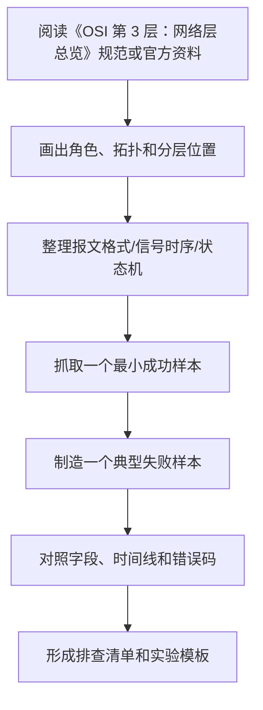

# OSI 第 3 层：网络层总览

最后整理：2026-06-14

网络层负责跨网络传递数据包。它的核心任务是寻址和路由：源主机把数据交给下一跳，路由器逐跳转发，最终到达目标网络。互联网中最重要的网络层协议是 IP，包括 IPv4 和 IPv6。

## 学习目标

- 理解 IP 地址、子网、默认网关、路由表。
- 理解 TTL/Hop Limit、分片、MTU、ICMP 的作用。
- 理解 NAT、私有地址、端口映射、连接跟踪对通信路径的影响。
- 区分公网地址、私网地址、链路本地地址、组播地址。
- 能使用 ping、traceroute、路由表排查三层问题。

## 核心概念

| 概念 | 说明 |
|---|---|
| IP 包 | 网络层传输单位，包含源/目标 IP 和上层协议号 |
| 路由表 | 根据目标地址选择下一跳和出接口 |
| 默认网关 | 目标不在本地网络时交给的下一跳 |
| TTL/Hop Limit | 防止包在网络中无限循环 |
| MTU | 一条链路能承载的最大网络层包大小 |
| ICMP | 网络层控制和错误报告消息 |
| NAT | 在网络边界改写 IP 地址和端口 |
| PMTUD | 路径 MTU 发现，用于避免路径中大包被丢弃 |

## 一次跨网段通信

1. 主机判断目标 IP 是否在本地子网。
2. 如果不在本地子网，查路由表选择默认网关。
3. 通过 ARP/NDP 找到下一跳链路层地址。
4. 封装成链路层帧发送给下一跳。
5. 路由器解开二层帧，查看 IP 头，递减 TTL/Hop Limit。
6. 路由器根据路由表继续转发，直到目标网络。

## 常见问题

- IP 地址或掩码配置错误会导致误判本地/远端网络。
- 默认网关缺失会导致只能访问本地网段。
- 路由回程不对称可能导致请求出去但响应回不来。
- MTU 黑洞会导致小包通、大包不通。
- ICMP 被完全禁用会增加排查难度，也可能破坏 Path MTU Discovery。
- NAT 会改变源地址或端口，排查日志和抓包时要同时看 NAT 前后。
- 多网卡、VPN、容器网络容易出现路由优先级和网段冲突问题。

## 专题阅读顺序

1. `IPv4.md`：理解 IPv4 头部、地址、子网、分片。
2. `IPv6.md`：理解 IPv6 地址、基本头部、NDP 和与 IPv4 的差异。
3. `ICMP.md`：理解 ping、traceroute、错误报告和 PMTUD。
4. `路由与MTU.md`：系统学习路由表、最长前缀匹配、MTU、MSS、路径排查。
5. `NAT-网络地址转换.md`：理解 SNAT、DNAT、端口映射、连接跟踪和 CGNAT。
6. `IPsec.md`：理解网络层加密和 VPN 场景。

## 参考资料

- [RFC 791 - Internet Protocol](https://www.rfc-editor.org/rfc/rfc791.html)
- [RFC 8200 - IPv6 Specification](https://www.rfc-editor.org/rfc/rfc8200.html)
- [RFC 792 - ICMP](https://www.rfc-editor.org/rfc/rfc792.html)
- [RFC 1918 - Private Address Space](https://www.rfc-editor.org/rfc/rfc1918)
- [RFC 1191 - Path MTU Discovery](https://www.rfc-editor.org/rfc/rfc1191)
- [RFC 3022 - Traditional NAT](https://www.rfc-editor.org/rfc/rfc3022)

---

## 万字精讲扩展（2026-06-16 更新）
> Last researched: 2026-06-16。本文补充内容以协议规范、RFC、标准组织资料和抓包排查实践为主；具体设备、芯片、操作系统、网关和库实现可能存在差异，真实项目中应继续核对对应版本手册和现场抓包。

### 本章在协议学习路线中的位置

《OSI 第 3 层：网络层总览》是协议体系中的一个观察点。学习它时不要只问“它是什么”，还要问它处在哪一层、解决什么互操作问题、依赖什么下层能力、给上层提供什么语义、正常流程如何推进、异常流程如何终止。协议学习的最终目标不是背标准号，而是在真实系统中定位问题：线缆是否可靠，帧是否完整，地址是否正确，路由是否可达，连接是否建立，握手是否成功，业务字段是否被双方一致理解。

本章学习完成后，至少应达到三个标准。第一，能画出最小拓扑和分层位置。第二，能解释关键报文字段、状态机或信号时序。第三，能设计一个抓包或测量实验，把正常样本和失败样本对比出来。只要这三个标准完成，这篇笔记就能用于工程排查，而不仅是概念复习。

### 网络层类协议的精讲重点

网络层解决跨网络寻址和转发问题。IPv4/IPv6、ICMP、IPsec、NAT、路由和 MTU 都属于网络层学习核心。这里最重要的是区分“端到端语义”和“逐跳转发语义”：IP 尽力而为转发，不保证可靠；ICMP 反馈错误和诊断信息；路由决定下一跳；MTU 决定一次能承载多大包；NAT 改写地址和端口，影响端到端可达性；IPsec 在 IP 层提供安全封装。

网络层排查要从路径开始。能 ping 不代表应用可用，不能 ping 也不一定代表 TCP/UDP 不通，因为 ICMP 可能被禁。IPv4 分片、IPv6 不允许中间路由器分片、PMTU 黑洞、NAT 映射超时、策略路由、防火墙、隧道封装和双栈优先级都可能造成复杂问题。抓包时要同时看源/目的地址、TTL/Hop Limit、DF、分片字段、ICMP 错误、路由表和中间设备策略。

### 协议学习的底层方法：先分层，再看报文，再看状态机

协议学习最常见的错误，是把协议当成一串术语和端口号背诵。真正能用于工程排查的学习方式，应同时抓住四个维度：分层位置、报文格式、状态机和错误处理。分层位置回答“这个协议依赖谁、服务谁”；报文格式回答“线上实际传了哪些字段”；状态机回答“双方如何从开始到结束推进”；错误处理回答“超时、重传、乱序、丢包、校验失败、权限失败、版本不兼容时应该怎样表现”。只有这四个维度都清楚，遇到抓包、串口波形、日志或现场问题时才不会只凭感觉判断。

学习任何协议时，都建议先画一个最小通信链路。物理层协议要画电平、线缆、连接器、阻抗、端接、拓扑和速率；链路层协议要画帧边界、地址、校验、仲裁和介质访问；网络层协议要画寻址、路由、分片、MTU、错误反馈和安全封装；传输层协议要画连接、端口、可靠性、流控、拥塞、保活和关闭；应用层协议要画请求响应、会话、认证、编码、版本协商和业务语义。这个图比单纯背“它属于第几层”更有价值。

### 抓包和排查闭环


Figure: 协议排查闭环，综合 IETF RFC、USB/NXP/Modbus/OASIS/OPC/IEEE 等规范和 Wireshark/tcpdump 实践资料整理。

排查时不要只看单个包。很多协议问题只有放在时序里才成立：TCP 三次握手是否完成，TLS 握手在哪一步失败，DNS 是否有重传或返回错误码，HTTP 是否被代理或缓存影响，Modbus 是否功能码和寄存器地址不匹配，RS-485 是否方向控制或终端电阻错误，CAN 是否仲裁失败或错误帧增加，MQTT 是否 Keep Alive 超时，OPC UA 是否安全策略或证书不匹配。单包解释字段，多包解释状态机。

### 报文字段要和工程现象绑定

协议字段不是孤立名词。长度字段错误可能导致粘包拆包失败；校验字段错误可能说明线路干扰、字节序错误或帧边界错；序列号和确认号异常可能指向丢包、重传、乱序或中间设备干预；TTL/Hop Limit 异常可能说明路由环路或路径变化；MSS/MTU 不匹配可能造成黑洞；TLS Alert 可以直接提示证书、版本、密码套件或应用协议协商问题；HTTP 状态码要结合方法、缓存、代理和服务端日志解释。学习时每个字段都应该写“它异常时会看到什么”。

### 规范、实现和现场三者要分开

协议规范说明应该如何互操作，实现代码说明某个库或设备实际怎么做，现场抓包说明这一刻真实发生了什么。三者可能不完全一致：旧设备可能只支持旧版本，厂商实现可能有扩展字段，中间盒可能改写报文，NAT/防火墙/代理可能改变连接行为，串口网关可能改变时序，工业现场线缆和接地可能影响物理层。工程判断应优先以规范为语义基准，以抓包和测量为事实依据，以实现文档解释具体差异。

### 核心知识点逐条精讲

#### 1. OSI 第 3 层：网络层总览 的协议定位

在《OSI 第 3 层：网络层总览》中，`OSI 第 3 层：网络层总览 的协议定位` 必须同时落到规范、报文和现场现象三层。规范层回答这个协议被设计来解决什么问题，依赖哪些下层能力，向上提供哪些语义；报文层回答字段如何编码、长度如何确定、状态如何推进、错误如何表达；现场层回答当线路、设备、软件、配置或中间网络异常时，会在日志、抓包、波形或业务行为上看到什么。只知道概念而看不懂报文，排查时会缺少证据；只会看字段而不知道状态机，也容易把正常重传、协商或错误响应误判成故障。

学习 `OSI 第 3 层：网络层总览 的协议定位` 时建议固定写五项：第一，通信双方角色和拓扑；第二，最小成功流程；第三，关键字段或信号；第四，常见失败流程；第五，验证工具。比如网络协议要写 Wireshark display filter、tcpdump 命令、端口和状态码；串行和总线协议要写逻辑分析仪通道、波特率/时钟、采样设置、字节序和校验；工业协议要写站号、对象字典、寄存器地址、功能码、设备配置和网关映射。这样笔记会直接服务排查，而不是只能复习概念。

工程上要特别警惕“协议名相同但实现差异很大”。同一个 `OSI 第 3 层：网络层总览` 在不同设备、系统版本、库版本、网关或厂商扩展中，可能在超时、重试、字节序、字段可选性、安全策略、错误码、最大报文长度、默认端口和兼容模式上存在差异。规范给出互操作底线，设备手册给出实现约束，抓包和测量给出现场事实。三者互相校验，才能得到可靠结论。

#### 2. 寻址和转发

在《OSI 第 3 层：网络层总览》中，`寻址和转发` 必须同时落到规范、报文和现场现象三层。规范层回答这个协议被设计来解决什么问题，依赖哪些下层能力，向上提供哪些语义；报文层回答字段如何编码、长度如何确定、状态如何推进、错误如何表达；现场层回答当线路、设备、软件、配置或中间网络异常时，会在日志、抓包、波形或业务行为上看到什么。只知道概念而看不懂报文，排查时会缺少证据；只会看字段而不知道状态机，也容易把正常重传、协商或错误响应误判成故障。

学习 `寻址和转发` 时建议固定写五项：第一，通信双方角色和拓扑；第二，最小成功流程；第三，关键字段或信号；第四，常见失败流程；第五，验证工具。比如网络协议要写 Wireshark display filter、tcpdump 命令、端口和状态码；串行和总线协议要写逻辑分析仪通道、波特率/时钟、采样设置、字节序和校验；工业协议要写站号、对象字典、寄存器地址、功能码、设备配置和网关映射。这样笔记会直接服务排查，而不是只能复习概念。

工程上要特别警惕“协议名相同但实现差异很大”。同一个 `OSI 第 3 层：网络层总览` 在不同设备、系统版本、库版本、网关或厂商扩展中，可能在超时、重试、字节序、字段可选性、安全策略、错误码、最大报文长度、默认端口和兼容模式上存在差异。规范给出互操作底线，设备手册给出实现约束，抓包和测量给出现场事实。三者互相校验，才能得到可靠结论。

#### 3. 报文字段和路径行为

在《OSI 第 3 层：网络层总览》中，`报文字段和路径行为` 必须同时落到规范、报文和现场现象三层。规范层回答这个协议被设计来解决什么问题，依赖哪些下层能力，向上提供哪些语义；报文层回答字段如何编码、长度如何确定、状态如何推进、错误如何表达；现场层回答当线路、设备、软件、配置或中间网络异常时，会在日志、抓包、波形或业务行为上看到什么。只知道概念而看不懂报文，排查时会缺少证据；只会看字段而不知道状态机，也容易把正常重传、协商或错误响应误判成故障。

学习 `报文字段和路径行为` 时建议固定写五项：第一，通信双方角色和拓扑；第二，最小成功流程；第三，关键字段或信号；第四，常见失败流程；第五，验证工具。比如网络协议要写 Wireshark display filter、tcpdump 命令、端口和状态码；串行和总线协议要写逻辑分析仪通道、波特率/时钟、采样设置、字节序和校验；工业协议要写站号、对象字典、寄存器地址、功能码、设备配置和网关映射。这样笔记会直接服务排查，而不是只能复习概念。

工程上要特别警惕“协议名相同但实现差异很大”。同一个 `OSI 第 3 层：网络层总览` 在不同设备、系统版本、库版本、网关或厂商扩展中，可能在超时、重试、字节序、字段可选性、安全策略、错误码、最大报文长度、默认端口和兼容模式上存在差异。规范给出互操作底线，设备手册给出实现约束，抓包和测量给出现场事实。三者互相校验，才能得到可靠结论。

#### 4. 错误反馈和诊断

在《OSI 第 3 层：网络层总览》中，`错误反馈和诊断` 必须同时落到规范、报文和现场现象三层。规范层回答这个协议被设计来解决什么问题，依赖哪些下层能力，向上提供哪些语义；报文层回答字段如何编码、长度如何确定、状态如何推进、错误如何表达；现场层回答当线路、设备、软件、配置或中间网络异常时，会在日志、抓包、波形或业务行为上看到什么。只知道概念而看不懂报文，排查时会缺少证据；只会看字段而不知道状态机，也容易把正常重传、协商或错误响应误判成故障。

学习 `错误反馈和诊断` 时建议固定写五项：第一，通信双方角色和拓扑；第二，最小成功流程；第三，关键字段或信号；第四，常见失败流程；第五，验证工具。比如网络协议要写 Wireshark display filter、tcpdump 命令、端口和状态码；串行和总线协议要写逻辑分析仪通道、波特率/时钟、采样设置、字节序和校验；工业协议要写站号、对象字典、寄存器地址、功能码、设备配置和网关映射。这样笔记会直接服务排查，而不是只能复习概念。

工程上要特别警惕“协议名相同但实现差异很大”。同一个 `OSI 第 3 层：网络层总览` 在不同设备、系统版本、库版本、网关或厂商扩展中，可能在超时、重试、字节序、字段可选性、安全策略、错误码、最大报文长度、默认端口和兼容模式上存在差异。规范给出互操作底线，设备手册给出实现约束，抓包和测量给出现场事实。三者互相校验，才能得到可靠结论。

#### 5. 安全、NAT 和隧道影响

在《OSI 第 3 层：网络层总览》中，`安全、NAT 和隧道影响` 必须同时落到规范、报文和现场现象三层。规范层回答这个协议被设计来解决什么问题，依赖哪些下层能力，向上提供哪些语义；报文层回答字段如何编码、长度如何确定、状态如何推进、错误如何表达；现场层回答当线路、设备、软件、配置或中间网络异常时，会在日志、抓包、波形或业务行为上看到什么。只知道概念而看不懂报文，排查时会缺少证据；只会看字段而不知道状态机，也容易把正常重传、协商或错误响应误判成故障。

学习 `安全、NAT 和隧道影响` 时建议固定写五项：第一，通信双方角色和拓扑；第二，最小成功流程；第三，关键字段或信号；第四，常见失败流程；第五，验证工具。比如网络协议要写 Wireshark display filter、tcpdump 命令、端口和状态码；串行和总线协议要写逻辑分析仪通道、波特率/时钟、采样设置、字节序和校验；工业协议要写站号、对象字典、寄存器地址、功能码、设备配置和网关映射。这样笔记会直接服务排查，而不是只能复习概念。

工程上要特别警惕“协议名相同但实现差异很大”。同一个 `OSI 第 3 层：网络层总览` 在不同设备、系统版本、库版本、网关或厂商扩展中，可能在超时、重试、字节序、字段可选性、安全策略、错误码、最大报文长度、默认端口和兼容模式上存在差异。规范给出互操作底线，设备手册给出实现约束，抓包和测量给出现场事实。三者互相校验，才能得到可靠结论。


### 场景化学习与排错表

| 主题 | 推荐动作 | 常见风险 | 验证方式 |
| :--- | :--- | :--- | :--- |
| OSI 第 3 层：网络层总览 的协议定位 | 先查规范和设备手册，再抓取最小成功/失败样本，最后写成排查规则 | 只背概念、不看报文；只看单包、不看状态机；忽略版本和设备差异 | Wireshark/tcpdump/串口日志/逻辑分析仪/示波器/设备日志/最小复现实验 |
| 寻址和转发 | 先查规范和设备手册，再抓取最小成功/失败样本，最后写成排查规则 | 只背概念、不看报文；只看单包、不看状态机；忽略版本和设备差异 | Wireshark/tcpdump/串口日志/逻辑分析仪/示波器/设备日志/最小复现实验 |
| 报文字段和路径行为 | 先查规范和设备手册，再抓取最小成功/失败样本，最后写成排查规则 | 只背概念、不看报文；只看单包、不看状态机；忽略版本和设备差异 | Wireshark/tcpdump/串口日志/逻辑分析仪/示波器/设备日志/最小复现实验 |
| 错误反馈和诊断 | 先查规范和设备手册，再抓取最小成功/失败样本，最后写成排查规则 | 只背概念、不看报文；只看单包、不看状态机；忽略版本和设备差异 | Wireshark/tcpdump/串口日志/逻辑分析仪/示波器/设备日志/最小复现实验 |
| 安全、NAT 和隧道影响 | 先查规范和设备手册，再抓取最小成功/失败样本，最后写成排查规则 | 只背概念、不看报文；只看单包、不看状态机；忽略版本和设备差异 | Wireshark/tcpdump/串口日志/逻辑分析仪/示波器/设备日志/最小复现实验 |

这张表的重点是把协议知识变成可验证动作。协议问题通常不是一句“网络不通”或“设备不兼容”能解释的，而是需要把拓扑、配置、报文、状态机、时间线和错误码拼在一起。每次排查结束，都应把最终规则写回笔记，例如某设备的超时时间、某网关的字节序、某协议栈的版本限制或某端口在防火墙上的放行条件。

### 本章建议工作流



Figure: 《OSI 第 3 层：网络层总览》学习工作流，综合 RFC、USB-IF、NXP、Modbus、OASIS、OPC Foundation、IEEE、Wireshark/tcpdump 等资料整理。

这个流程强调“成功样本”和“失败样本”都要保留。只保存成功样本，现场出问题时没有对照；只看失败样本，容易不知道正常状态机应该长什么样。对协议学习者来说，一组高质量抓包、串口日志或波形截图，比一段泛泛解释更能积累经验。

### 常见误区和纠正方法

- 误区：只背 OSI 层级。纠正：层级只是定位工具，必须继续看报文格式、状态机、错误码和现场证据。
- 误区：端口通就认为协议通。纠正：端口可达只说明传输层可能可达，应用层认证、版本、功能码、证书、权限和业务字段仍可能失败。
- 误区：只抓客户端或只抓服务端。纠正：复杂问题要尽量在两端或关键中间点同时取证，尤其是 NAT、代理、网关、交换机和串口转换器场景。
- 误区：忽略时间。纠正：超时、重试、保活、退避、握手和关闭都依赖时间线；协议排查要看相对时间和间隔。
- 误区：把社区文章当规范。纠正：社区经验适合发现常见坑，语义和字段定义应回到 RFC、标准组织文档、厂商手册和抓包事实。
- 误区：只保存结论，不保存样本。纠正：保留 pcap、串口日志、波形、配置和版本信息，后续才能复盘和对比。

### 与相邻协议的关系

《OSI 第 3 层：网络层总览》通常不是单独工作的。物理层问题会让链路层帧错误增加，链路层地址或校验错误会影响网络层可达性，网络层 MTU/NAT/路由会影响传输层连接，传输层超时和重传会影响应用层表现，表示层编码和 TLS 会影响应用层解析。排查时要从现象所在层向下验证承载是否正常，再向上验证语义是否正确。不要在没有证据的情况下跨层猜测。

### 实操训练和复盘模板

1. 围绕 `OSI 第 3 层：网络层总览 的协议定位` 做一次最小实验：记录拓扑、配置、成功样本、失败样本、字段解释和最终结论。
2. 围绕 `寻址和转发` 做一次最小实验：记录拓扑、配置、成功样本、失败样本、字段解释和最终结论。
3. 围绕 `报文字段和路径行为` 做一次最小实验：记录拓扑、配置、成功样本、失败样本、字段解释和最终结论。
4. 围绕 `错误反馈和诊断` 做一次最小实验：记录拓扑、配置、成功样本、失败样本、字段解释和最终结论。
5. 围绕 `安全、NAT 和隧道影响` 做一次最小实验：记录拓扑、配置、成功样本、失败样本、字段解释和最终结论。

建议每篇协议笔记都维护下面的复盘格式：

```text
实验名称：
协议主题：OSI 第 3 层：网络层总览
设备/软件/版本：
拓扑：客户端、服务端、网关、交换机、线缆、总线节点
关键配置：端口、地址、速率、校验、证书、账号、功能码、寄存器、topic 等
成功样本：抓包文件、串口日志、波形或设备日志位置
失败样本：如何复现，错误码或异常现象
字段解释：哪些字段证明状态机走到哪一步
根因判断：线路/配置/协议栈/版本/权限/业务数据/中间设备
修复动作：
回归验证：
以后检查规则：
```

这个模板能避免“凭经验说可能是某某问题”。协议排查必须留下证据链：现象是什么、哪一层开始异常、哪个字段证明异常、哪个实验排除了其他可能。长期积累后，这些复盘会比零散教程更有价值。

## 参考资料与延伸阅读

- [IETF / RFC] RFC 791 - Internet Protocol IPv4: https://datatracker.ietf.org/doc/html/rfc791
- [IETF / RFC] RFC 8200 - Internet Protocol Version 6 IPv6: https://www.rfc-editor.org/info/rfc8200
- [IETF / RFC] RFC 826 - Address Resolution Protocol ARP: https://datatracker.ietf.org/doc/html/rfc826
- [IETF / RFC] RFC 792 - Internet Control Message Protocol ICMP: https://datatracker.ietf.org/doc/html/rfc792
- [IETF / RFC] RFC 4443 - ICMPv6: https://datatracker.ietf.org/doc/html/rfc4443
- [IETF / RFC] RFC 768 - User Datagram Protocol UDP: https://datatracker.ietf.org/doc/html/rfc768
- [IETF / RFC] RFC 9293 - Transmission Control Protocol TCP: https://datatracker.ietf.org/doc/rfc9293/
- [IETF / RFC] RFC 9000 - QUIC: A UDP-Based Multiplexed and Secure Transport: https://datatracker.ietf.org/doc/rfc9000/
- [IETF / RFC] RFC 8446 - TLS 1.3: https://www.rfc-editor.org/info/rfc8446/
- [IETF / RFC] RFC 9110 - HTTP Semantics: https://www.rfc-editor.org/rfc/rfc9110.html
- [IETF / RFC] RFC 9111 - HTTP Caching: https://www.rfc-editor.org/rfc/rfc9111.html
- [IETF / RFC] RFC 9112 - HTTP/1.1: https://www.rfc-editor.org/rfc/rfc9112.html
- [IETF / RFC] RFC 6455 - The WebSocket Protocol: https://datatracker.ietf.org/doc/html/rfc6455
- [IETF / RFC] RFC 1034 - Domain Names Concepts and Facilities: https://www.rfc-editor.org/info/rfc1034/
- [IETF / RFC] RFC 1035 - Domain Names Implementation and Specification: https://datatracker.ietf.org/doc/html/rfc1035
- [IETF / RFC] RFC 2131 - Dynamic Host Configuration Protocol DHCP: https://datatracker.ietf.org/doc/html/rfc2131
- [IETF / RFC] RFC 5321 - Simple Mail Transfer Protocol SMTP: https://datatracker.ietf.org/doc/rfc5321/
- [IETF / RFC] RFC 959 - File Transfer Protocol FTP: https://datatracker.ietf.org/doc/html/rfc959
- [IETF / RFC] RFC 2045 - MIME Part One: https://www.ietf.org/rfc/rfc2045.txt
- [IETF / RFC] RFC 2046 - MIME Media Types: https://www.rfc-editor.org/info/rfc2046/
- [IETF / RFC] RFC 1661 - Point-to-Point Protocol PPP: https://datatracker.ietf.org/doc/rfc1661/
- [IETF / RFC] RFC 4301 - Security Architecture for IPsec: https://datatracker.ietf.org/doc/html/rfc4301
- [IETF / RFC] RFC 3022 - Traditional NAT: https://datatracker.ietf.org/doc/html/rfc3022
- [IETF / RFC] RFC 1191 - Path MTU Discovery: https://datatracker.ietf.org/doc/html/rfc1191
- [IETF / RFC] RFC 8201 - Path MTU Discovery for IPv6: https://datatracker.ietf.org/doc/html/rfc8201
- [IETF / RFC] RFC 9260 - Stream Control Transmission Protocol SCTP: https://datatracker.ietf.org/doc/html/rfc9260
- [IETF / RFC] RFC 3261 - SIP Session Initiation Protocol: https://datatracker.ietf.org/doc/html/rfc3261
- [IETF / RFC] RFC 5531 - RPC Remote Procedure Call Protocol Version 2: https://datatracker.ietf.org/doc/html/rfc5531
- [IETF / RFC] RFC 1001 / RFC 1002 - NetBIOS over TCP/IP: https://datatracker.ietf.org/doc/html/rfc1001
- [USB-IF / Spec] USB Document Library: https://www.usb.org/documents
- [USB-IF / Spec] USB 2.0 Specification: https://www.usb.org/document-library/usb-20-specification
- [USB-IF / Spec] USB Type-C Cable and Connector Specification: https://www.usb.org/document-library/usb-type-cr-cable-and-connector-specification-release-24
- [NXP / Spec] I2C-bus specification and user manual UM10204: https://www.nxp.com/documents/user_manual/UM10204.pdf
- [Modbus Organization / Spec] Modbus Specifications: https://www.modbus.org/modbus-specifications
- [OASIS / Standard] MQTT Version 5.0: https://docs.oasis-open.org/mqtt/mqtt/v5.0/mqtt-v5.0.html
- [OPC Foundation / Spec] OPC UA Online Reference: https://reference.opcfoundation.org/
- [OPC Foundation / Overview] OPC Unified Architecture: https://opcfoundation.org/about/opc-technologies/opc-ua/
- [EtherCAT Technology Group / Overview] EtherCAT Technology: https://www.ethercat.org/en/technology.html
- [CAN in Automation / Overview] CANopen: https://www.can-cia.org/can-knowledge/canopen
- [CAN in Automation / Documents] Technical documents: https://www.can-cia.org/cia-groups/technical-documents
- [IO-Link Community / Spec] IO-Link downloads and specifications: https://io-link.com/downloads
- [IO-Link Community / Overview] IO-Link standardized IO technology: https://io-link.com/
- [IEEE / Standard family] IEEE 802.3 Ethernet: https://standards.ieee.org/ieee/802.3/7071/
- [IEEE / Standard family] IEEE 802.11 Wireless LAN: https://standards.ieee.org/ieee/802.11/7028/
- [IEEE / Standard family] IEEE 802.1Q VLAN bridging: https://standards.ieee.org/ieee/802.1Q/6844/
- [IANA / Registry] Service Name and Transport Protocol Port Number Registry: https://www.iana.org/assignments/service-names-port-numbers/service-names-port-numbers.xhtml
- [Wireshark / Docs] Wireshark User's Guide: https://www.wireshark.org/docs/wsug_html_chunked/
- [tcpdump / Docs] tcpdump and libpcap: https://www.tcpdump.org/
- [Community / CSDN] 协议抓包与网络协议学习笔记检索入口: https://so.csdn.net/so/search?q=%E5%8D%8F%E8%AE%AE%20%E6%8A%93%E5%8C%85%20%E5%AD%A6%E4%B9%A0%E7%AC%94%E8%AE%B0
- [Community / 博客园] 网络协议、TCP/IP、工业协议实践检索入口: https://zzk.cnblogs.com/s/blogpost?Keywords=%E7%BD%91%E7%BB%9C%E5%8D%8F%E8%AE%AE%20TCP%20Modbus%20MQTT
- [Community / 掘金] HTTP、TCP、WebSocket、MQTT 实践检索入口: https://juejin.cn/search?query=HTTP%20TCP%20WebSocket%20MQTT%20%E5%8D%8F%E8%AE%AE&type=0

<!-- research-notes: enhanced-v1 -->

## 研究笔记增强

> Last reviewed: 2026-06-17。此节用于把《OSI 第 3 层：网络层总览》从阅读笔记推进到可复习、可实践、可验证的研究笔记；具体版本、参数和环境仍需结合官方资料、项目约束和实测结果校准。

### 知识定位

以分层定位、报文证据和状态机为核心，结论必须能回到规范、抓包、日志、波形或设备手册验证。

### 重点补充
- 区分各网络层次负责的问题。
- 关注报文格式、状态机、错误码、超时重试和兼容性。
- 记录拓扑、版本、配置、时间线和抓包位置。
- 明确适用场景、限制条件、替代方案和迁移成本。

### 实践清单
- 为本章整理一张概念关系图、流程图或最小系统图。
- 写一个最小可运行示例，并保留运行命令、输入、输出和环境版本。
- 列出常见错误、排查命令、关键日志和修复动作。
- 补充安全、性能、兼容性、可维护性和上线运维注意事项。
- 用一次真实问题或练习项目复盘验证笔记是否可用。

### 常见误区
- 只摘抄定义或命令，没有记录上下文、前提条件和边界。
- 只记录成功路径，不记录失败样本、异常现象和排查过程。
- 没有版本、环境和数据样本，导致后续无法复现。
- 把教程默认值直接用于真实项目，没有结合约束重新评估。

### 复盘问题
- 学完《OSI 第 3 层：网络层总览》后，能否用自己的话说明它解决什么问题、不解决什么问题？
- 如果要在真实项目中使用，需要哪些前置条件、依赖版本、输入数据和验证手段？
- 失败时最先检查哪三类证据：日志、指标、抓包、堆栈、配置、样本还是硬件测量？
- 有没有形成可重复的最小实验、测试用例或排查命令？

### 延伸方向
- 官方文档和版本变更记录。
- 同类技术、框架或方案对比。
- 面向真实项目的最小实践。
- 故障排查清单和复盘案例库。

### 复盘记录模板

```text
主题：OSI 第 3 层：网络层总览
日期：
目标：本次要验证或掌握的具体问题
环境：系统 / 语言 / 框架 / 工具 / 设备 / 版本
步骤：最小可复现流程
现象：成功输出、失败输出、日志、指标或测量数据
分析：为什么会出现该现象，和哪些概念相关
结论：可复用的规则、命令、配置或设计取舍
风险：边界条件、性能、安全、兼容性或维护成本
下一步：继续实验、补充资料或应用到项目
```

<!-- lecture-notes:start -->

## 讲义级补充：如何真正学懂《OSI 第 3 层：网络层总览》

> 适用位置：协议\03-网络层\00-网络层总览.md  
> 说明：本补充用于把原始提纲扩展成课堂讲义式学习材料。阅读时建议先看原文，再用本节建立知识框架、例子、实践和自测闭环。

### 1. 这一讲要解决什么问题

协议学习的核心是理解通信双方如何约定格式、时序、错误处理和兼容性。把协议想成“双方都严格遵守的对话规则”，任何一方听错、漏听或理解版本不同，通信都会出问题。

学习本讲时，可以用三个问题检查自己是否真的理解：

1. 它解决的真实问题是什么？
2. 如果没有它，系统会出现什么具体麻烦？
3. 在真实项目中，应该用什么现象或指标判断它做得好不好？

### 2. 核心知识拆解

可以把本讲拆成几块来学：

- 格式：双方传输的数据长什么样。
- 时序：谁先说、谁后说、什么时候确认或重试。
- 状态：连接、会话、缓存、认证等上下文如何维护。
- 异常：丢包、乱序、超时、版本不兼容时如何恢复。

拆解的好处是防止“整章都懂一点，但哪块都说不清”。复习时可以逐块追问：它的输入是什么、输出是什么、依赖什么、失败时有什么表现。

### 3. 通俗类比

可以把协议类比成寄快递：物理层像道路，链路层像同城派送，网络层决定跨城市路线，传输层确认包裹是否送到，应用层才是包裹里的业务内容。排查问题时不要一上来就怀疑应用代码，先确认每一层是否把自己的职责完成了。

类比不是严格定义，但能帮助初学者先建立直觉。真正使用时，还要回到术语、公式、接口、数据结构、时序图或工程规范上，把“感觉理解”变成“可验证理解”。

### 4. 具体例子

学习《OSI 第 3 层：网络层总览》时，可以打开抓包工具观察一次真实通信：先看 DNS 是否解析成功，再看连接或握手是否建立，随后看请求响应内容，最后检查超时、重传或错误码。这样能把抽象协议变成可观察的证据链。

讲义级学习不能只停留在“概念解释”。至少要有一个能跑、能算、能画或能检查的例子。例子越小，越容易看清关键机制；等机制清楚后，再逐步扩展到复杂项目。

### 5. 学习路径

- 先确认协议解决的是寻址、可靠传输、数据表达、会话管理还是业务语义问题。
- 再看报文格式、握手流程、状态机、超时重试和错误码。
- 最后用抓包工具把理论和真实流量对应起来。

建议每学完一小节都做一次“复述练习”：不用看笔记，用自己的话讲清楚概念、输入、输出、关键步骤和常见错误。如果讲不清，通常说明还没有真正掌握。

### 6. 课堂讲解框架

可以按下面顺序讲解或复习本主题：

1. 背景：先讲这个知识为什么出现，它试图降低什么成本、解决什么风险或提升什么能力。
2. 基本概念：给出核心名词的准确定义，说明它们之间的关系。
3. 工作流程：按时间顺序描述一次完整过程，必要时画出流程图、状态机或数据流图。
4. 关键细节：解释最容易误解的机制，例如边界条件、异常处理、性能限制、资源生命周期或安全约束。
5. 实战例子：用一个足够小但完整的例子，把概念落到命令、代码、图纸、配置、数据或操作步骤上。
6. 反例与排错：展示错误做法会导致什么现象，再说明如何定位和修复。
7. 总结迁移：最后说明它和相邻知识点的区别、联系以及后续该学什么。

### 7. 最小实践任务

为了避免“看懂了但不会用”，建议为本讲配一个最小实践：

- 选一个可以在 30 到 90 分钟内完成的小任务。
- 明确输入、预期输出和验收标准。
- 记录遇到的第一个错误、定位过程和最终修复方法。
- 完成后写 5 行复盘：我原来以为是什么，实际是什么，下次会如何更快处理。

如果本主题偏理论，实践可以是手算一个小例子、画一张流程图、推导一个简化公式或解释一段真实日志；如果偏工程，实践应该尽量落到可运行命令、可测试代码、可检查配置或可测量硬件现象上。

### 8. 常见误区

- 只背端口号，不理解握手、状态和超时。
- 抓包时只看应用层内容，忽略 DNS、路由、MTU、TLS 和重传。
- 把 TCP 的可靠性误解为业务一定不会失败，忽略应用层幂等和重试。

遇到这些问题时，不要急着背更多资料。更有效的办法是回到一个最小例子，把输入、状态变化、输出和验证方式重新走一遍。

### 9. 自测题

1. 用一句话说明本讲主题解决的核心问题。
2. 列出本讲最重要的 3 个概念，并说明它们的关系。
3. 举一个生活类比，再指出这个类比在哪些地方不严谨。
4. 写出一个最小实践任务的验收标准。
5. 如果结果不符合预期，你会优先检查哪 3 个环节？为什么？
6. 本讲和相邻章节的知识边界是什么？哪些问题应该交给其他章节解决？

### 10. 复习口诀

先问场景，再看输入；先拆结构，再走流程；先做小例，再谈优化；先会排错，再做规模化。

<!-- lecture-notes:end -->
