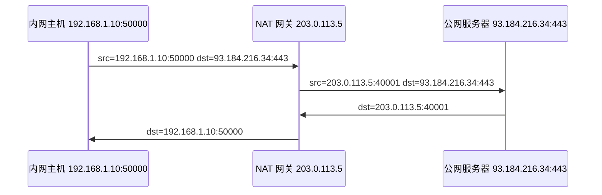

# NAT 网络地址转换学习笔记

最后整理：2026-06-14

Last researched：2026-06-14

NAT（Network Address Translation）用于在网络边界修改 IP 地址，有时也修改传输层端口。它常见于家庭路由器、企业出口、防火墙、云网关、容器网络和 Kubernetes。NAT 解决了地址复用和边界访问问题，但也会引入连接跟踪、回程路径、端口耗尽、协议兼容和排查复杂度。

## 学习目标

- 分清 SNAT、DNAT、PAT、静态 NAT、动态 NAT。
- 理解 NAT 如何影响 TCP/UDP 连接、日志、抓包和防火墙。
- 能排查内网访问外网、外网访问内网、容器/云网络 NAT 问题。
- 知道 NAT 与私有地址、端口映射、连接跟踪、Hairpin NAT 的关系。

## NAT 解决的问题

| 问题 | NAT 的作用 |
|---|---|
| 私有地址不能直接访问公网 | 出口网关把源地址改成公网地址 |
| 多台内网主机共享一个公网 IP | 用端口映射区分不同连接 |
| 外网访问内网服务 | 把公网 IP:端口 转发到内网 IP:端口 |
| 网络迁移或地址重叠 | 在边界做地址映射 |
| 容器访问外网 | 节点或网关对 Pod/容器地址做 SNAT |

## 私有地址范围

RFC 1918 定义的 IPv4 私有地址：

| 地址范围 | CIDR |
|---|---|
| 10.0.0.0 - 10.255.255.255 | `10.0.0.0/8` |
| 172.16.0.0 - 172.31.255.255 | `172.16.0.0/12` |
| 192.168.0.0 - 192.168.255.255 | `192.168.0.0/16` |

这些地址不能在公网互联网中直接路由，需要 NAT 或专线/VPN/私网互联。

## NAT 类型

| 类型 | 修改内容 | 典型场景 |
|---|---|---|
| SNAT | 修改源 IP，可能修改源端口 | 内网访问公网 |
| DNAT | 修改目的 IP，可能修改目的端口 | 端口转发、负载均衡入口 |
| PAT/NAPT | 多个内网连接共享一个公网 IP，通过端口区分 | 家庭路由器、企业出口 |
| Static NAT | 一对一固定映射 | 公网 IP 映射内网服务器 |
| Dynamic NAT | 地址池动态映射 | 企业出口地址池 |
| Hairpin NAT | 内网访问网关公网地址再回到内网服务 | 内外使用同一域名访问服务 |

## SNAT 工作过程



NAT 网关必须维护连接映射表：

| 内部五元组 | 外部映射 |
|---|---|
| 192.168.1.10:50000 -> 93.184.216.34:443 TCP | 203.0.113.5:40001 -> 93.184.216.34:443 TCP |

## DNAT 和端口转发

外部访问内网服务时，网关把目的地址改写为内网服务器地址。

```text
公网访问 203.0.113.5:8443
  -> DNAT 到 192.168.1.20:443
```

常见用途：

- 家庭宽带端口映射；
- 云负载均衡入口；
- Kubernetes NodePort；
- 防火墙发布内网服务。

排查重点：

- 外部请求是否到达网关；
- DNAT 规则是否匹配；
- 内网服务器是否响应；
- 回程是否经过同一个 NAT 网关；
- 防火墙是否允许转发流量；
- 服务端日志看到的源 IP 是否是 NAT 后地址。

## NAT 与连接跟踪

NAT 依赖连接跟踪表。TCP 连接有明确状态，UDP 没有连接但网关仍会用超时时间维护映射。

常见问题：

- 连接跟踪表满，导致新连接失败。
- UDP 映射超时太短，导致语音、视频、游戏、IoT 心跳异常。
- 长连接空闲时间超过 NAT 超时，被中间设备清理。
- 回程路径不经过原 NAT 设备，导致连接状态不匹配。

Linux 常见观察：

```bash
conntrack -L
conntrack -S
sysctl net.netfilter.nf_conntrack_max
```

## NAT 穿透

NAT 会让外部无法直接访问内网设备。常见穿透思路：

| 方法 | 说明 |
|---|---|
| 端口映射 | 手动在网关配置 DNAT |
| UPnP/NAT-PMP/PCP | 应用请求网关自动开放映射 |
| STUN | 发现自己在公网侧看到的映射地址 |
| TURN | 通过中继服务器转发流量 |
| ICE | 综合候选地址，选择可用路径，WebRTC 常用 |
| 反向连接 | 内网设备主动连到公网服务端 |

注意：对称 NAT、企业防火墙、运营商 CGNAT 会显著增加穿透难度。

## CGNAT

CGNAT 是运营商级 NAT。用户路由器拿到的 WAN 地址可能仍是私有地址或共享地址。

常见现象：

- 家庭宽带无法从公网访问内网服务。
- 路由器 WAN IP 与公网查询 IP 不一致。
- 端口映射配置了也不生效。
- P2P、游戏、远程访问受影响。

检查方式：

1. 查看路由器 WAN IP。
2. 用公网网站或 `curl ifconfig.me` 看出口 IP。
3. 如果两者不同，中间可能存在上级 NAT。

## NAT 与 IPv6

IPv6 地址空间足够大，设计上不依赖 NAT 解决地址不足。IPv6 更推荐：

- 全局单播地址；
- 防火墙控制入站访问；
- 前缀委派；
- 临时地址保护隐私。

但现实中仍可能出现 NAT66、NPTv6 等方案。学习时要知道：IPv6 的安全边界不应该依赖 NAT，而应该依赖明确的防火墙策略。

## 常见问题

| 现象 | 可能原因 | 排查方向 |
|---|---|---|
| 内网能 ping 网关但不能上网 | SNAT 缺失、默认路由错、DNS 问题 | 查路由、NAT 规则、DNS |
| 外网访问端口不通 | DNAT 未配置、防火墙拦截、CGNAT | 外网抓包、查网关 WAN IP |
| 服务端看到的客户端 IP 都是网关 | SNAT/负载均衡改写源地址 | 使用 X-Forwarded-For、PROXY Protocol 或保源方案 |
| 长连接偶发断开 | NAT 空闲超时、心跳太慢 | 调整 keepalive 或 NAT timeout |
| UDP 音视频不稳定 | NAT 映射超时、对称 NAT、丢包 | STUN/TURN/ICE、缩短心跳 |
| 内网访问公网域名回内网失败 | 缺 Hairpin NAT 或 Split DNS | 配 Hairpin NAT 或内网 DNS |
| 容器访问外网源 IP 不对 | 节点 SNAT/Masquerade | 查 iptables/nftables/eBPF 规则 |

## 排查命令

Linux：

```bash
ip addr
ip route
ip neigh
ss -tanp
tcpdump -i any -nn host <target>
iptables -t nat -S
nft list ruleset
conntrack -L
```

Windows：

```powershell
ipconfig /all
route print
netstat -ano
Test-NetConnection example.com -Port 443
tracert example.com
```

## 参考资料

- [RFC 1918 - Address Allocation for Private Internets](https://www.rfc-editor.org/rfc/rfc1918)
- [RFC 3022 - Traditional IP Network Address Translator](https://www.rfc-editor.org/rfc/rfc3022)
- [RFC 4787 - NAT UDP Requirements](https://www.rfc-editor.org/rfc/rfc4787)
- [RFC 5382 - NAT TCP Requirements](https://www.rfc-editor.org/rfc/rfc5382)
- [RFC 6888 - Common Requirements for Carrier-Grade NATs](https://www.rfc-editor.org/rfc/rfc6888)
- [Linux Netfilter conntrack tools](https://conntrack-tools.netfilter.org/)
