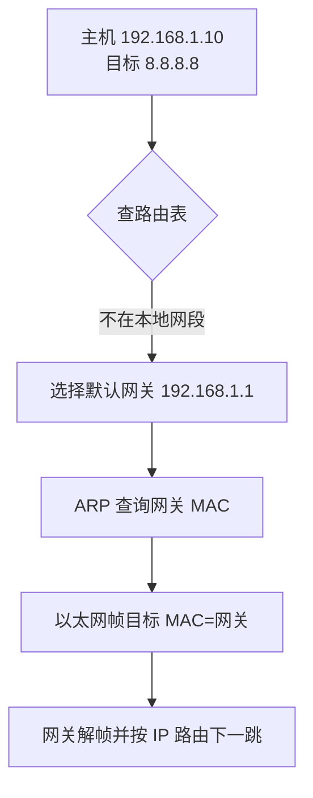

# 路由、MTU 与路径排查学习笔记

最后整理：2026-06-14

Last researched：2026-06-14

网络层的核心问题是“目标地址在哪里，下一跳是谁，包能不能沿路径到达”。实际排查中，路由、默认网关、最长前缀匹配、MTU、分片、PMTUD 是非常高频的问题。本篇把这些内容集中整理。

## 学习目标

- 理解路由表、默认路由、下一跳、最长前缀匹配。
- 理解直连路由、静态路由、动态路由的区别。
- 理解 MTU、MSS、分片、路径 MTU 发现。
- 能排查“某网段不通”“小包通大包不通”“VPN 访问异常”“多网卡走错路”等问题。

## 路由表是什么

路由表告诉主机或路由器：去某个目标网段，应该从哪个接口发给哪个下一跳。

典型字段：

| 字段 | 含义 |
|---|---|
| Destination | 目标网段 |
| Prefix Length | 前缀长度，例如 `/24` |
| Gateway/Next Hop | 下一跳地址 |
| Interface | 出接口 |
| Metric | 优先级或代价 |

Linux：

```bash
ip route
ip route get 8.8.8.8
```

Windows：

```powershell
route print
Test-NetConnection 8.8.8.8
```

## 最长前缀匹配

如果多条路由都能匹配目标 IP，选择前缀最长的那条。

| 路由 | 是否匹配 `10.1.2.3` | 优先级 |
|---|---|---|
| `0.0.0.0/0` | 匹配 | 最低 |
| `10.0.0.0/8` | 匹配 | 中 |
| `10.1.0.0/16` | 匹配 | 高 |
| `10.1.2.0/24` | 匹配 | 最高 |

所以默认路由 `0.0.0.0/0` 只在没有更具体路由时使用。

## 直连路由、静态路由、动态路由

| 类型 | 来源 | 特点 |
|---|---|---|
| 直连路由 | 接口配置 IP 后自动生成 | 只到本地链路 |
| 静态路由 | 管理员手动配置 | 简单可控，规模大时维护困难 |
| 动态路由 | OSPF/BGP/RIP/IS-IS 等协议学习 | 可自动收敛，复杂度更高 |
| 默认路由 | 特殊路由 `0.0.0.0/0` 或 `::/0` | 去未知目的地的出口 |

主机通常只需要直连路由和默认路由；路由器、云网关、企业网络才大量使用动态路由。

## 一次跨网段发送



注意：跨网段通信时，以太网帧的目标 MAC 是下一跳网关，不是最终目标主机。

## 策略路由和多网卡

多网卡、多出口、VPN、容器环境中，普通目标地址路由不够用，可能会使用策略路由：

- 按源地址选路；
- 按 fwmark 选路；
- 按用户、进程、VRF、路由表选路；
- VPN 只接管特定网段或接管默认路由。

常见问题：

- Wi-Fi 和有线同时连接，默认路由走错。
- VPN 推送了默认路由，所有流量走 VPN。
- 容器网段和公司内网网段冲突。
- 回程路由不对，导致请求到达但响应回不去。

Linux 查看：

```bash
ip rule
ip route show table all
```

## MTU 与 MSS

| 概念 | 含义 |
|---|---|
| MTU | Maximum Transmission Unit，链路层一次能承载的最大网络层包大小 |
| MSS | Maximum Segment Size，TCP 单段最大应用数据大小 |
| PMTUD | Path MTU Discovery，路径 MTU 发现 |

以太网常见 MTU 是 1500。IPv4 TCP 在无选项时：

```text
MSS = MTU - IPv4头20字节 - TCP头20字节 = 1460
```

IPv6 基本头 40 字节，因此同样 1500 MTU 下 TCP MSS 常见为 1440。

## 分片

IPv4 支持路由器分片，但分片会增加丢包影响和处理开销。IPv6 中间路由器不分片，源主机需要根据路径 MTU 发送合适大小的包。

常见策略：

- 尽量避免分片。
- 让 PMTUD 正常工作。
- VPN/隧道场景调整 MTU 或 TCP MSS Clamp。
- 不要随意屏蔽所有 ICMP，因为 PMTUD 依赖 ICMP 错误消息。

## PMTUD

路径 MTU 发现依赖“包太大且不能分片”的反馈。

IPv4：

- 发送方设置 DF（Don't Fragment）。
- 中间路由器发现包超过下一跳 MTU，丢包并返回 ICMP Fragmentation Needed。

IPv6：

- 中间路由器不会分片。
- 包太大时返回 ICMPv6 Packet Too Big。

如果这些 ICMP 被防火墙屏蔽，就会出现 MTU 黑洞。

## MTU 黑洞现象

| 现象 | 说明 |
|---|---|
| ping 小包通，大包不通 | 典型 MTU 问题 |
| TCP 能握手，但 TLS/HTTP 卡住 | 握手小包正常，大包数据失败 |
| 访问部分网站失败 | 不同路径 MTU 不同 |
| VPN 内访问异常 | 隧道封装降低有效 MTU |
| 上传大文件失败，小请求正常 | 大包触发路径问题 |

测试：

```bash
# Linux IPv4，禁止分片
ping -M do -s 1472 8.8.8.8

# Windows
ping -f -l 1472 8.8.8.8

# 找路径
tracepath example.com
```

## traceroute 原理

traceroute 利用 TTL/Hop Limit 逐跳递增：

1. 发送 TTL=1 的探测包，第一跳路由器返回 Time Exceeded。
2. 发送 TTL=2，第二跳返回 Time Exceeded。
3. 依次递增，直到到达目标或超时。

注意：

- 中间跳不响应不代表流量不经过。
- 回包路径可能和去程不同。
- 防火墙、负载均衡、MPLS、NAT 都会影响显示结果。
- Windows `tracert` 默认使用 ICMP，Linux traceroute 常用 UDP，也可指定 ICMP/TCP。

## 常见问题

| 现象 | 可能原因 | 排查建议 |
|---|---|---|
| 同网段不通 | IP/掩码错、ARP 失败、VLAN 错 | 查 `ip addr`、ARP、交换机 |
| 跨网段不通 | 默认网关错、路由缺失、防火墙 | 查路由表和网关抓包 |
| 只某个网段不通 | 静态路由缺失、网段冲突、ACL | `ip route get`、traceroute |
| 请求到服务端但客户端收不到 | 回程路由错、非对称路径、防火墙状态丢失 | 双端抓包 |
| VPN 开启后内网冲突 | VPN 网段和本地网段重叠 | 调整网段或策略路由 |
| 大包失败 | MTU/PMTUD/ICMP 被阻断 | ping DF、tracepath、MSS clamp |
| 多网卡走错出口 | Metric、默认路由、策略路由 | 查看路由优先级 |

## 排查命令

Linux：

```bash
ip addr
ip route
ip route get <target>
ip rule
ip neigh
ping <target>
tracepath <target>
traceroute <target>
tcpdump -i any -nn host <target>
```

Windows：

```powershell
ipconfig /all
route print
ping <target>
tracert <target>
pathping <target>
Test-NetConnection <target> -Port 443
```

## 参考资料

- RFC 791 - Internet Protocol: <[https://www.rfc-editor.org/rfc/rfc791](https://www.rfc-editor.org/rfc/rfc791)>
- RFC 8200 - Internet Protocol, Version 6 Specification: <[https://www.rfc-editor.org/rfc/rfc8200](https://www.rfc-editor.org/rfc/rfc8200)>
- RFC 1191 - Path MTU Discovery: <[https://www.rfc-editor.org/rfc/rfc1191](https://www.rfc-editor.org/rfc/rfc1191)>
- RFC 8201 - Path MTU Discovery for IPv6: <[https://www.rfc-editor.org/rfc/rfc8201](https://www.rfc-editor.org/rfc/rfc8201)>
- Linux iproute2: <[https://wiki.linuxfoundation.org/networking/iproute2](https://wiki.linuxfoundation.org/networking/iproute2)>
- Microsoft Test-NetConnection: <[https://learn.microsoft.com/en-us/powershell/module/nettcpip/test-netconnection](https://learn.microsoft.com/en-us/powershell/module/nettcpip/test-netconnection)>
