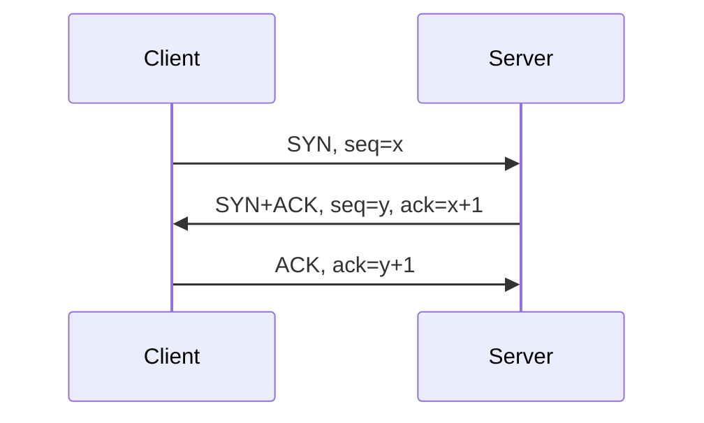

# TCP 传输控制协议学习笔记

最后整理：2026-06-11

TCP（Transmission Control Protocol）是互联网中最重要的传输层协议之一。它为应用提供可靠、有序、面向连接的字节流服务。TCP 不保留消息边界，应用看到的是连续字节流。

## 解决的问题

- IP 只提供尽力而为传输，TCP 在此基础上实现可靠传输。
- 网络可能丢包、乱序、重复、拥塞，TCP 通过序列号、确认、重传、窗口和拥塞控制处理。
- 多个应用共享同一主机网络栈，TCP 使用端口区分应用。

## TCP 头部关键字段

| 字段 | 作用 |
|---|---|
| Source/Destination Port | 源/目标端口 |
| Sequence Number | 当前段第一个字节的序列号 |
| Acknowledgment Number | 期望收到的下一个字节序号 |
| Flags | SYN、ACK、FIN、RST、PSH、URG、ECE、CWR 等 |
| Window Size | 接收窗口，用于流量控制 |
| Checksum | 覆盖 TCP 头和数据 |
| Options | MSS、窗口扩大、SACK、时间戳等 |

## 三次握手



三次握手的目的不是“发三次才可靠”这么简单，而是让双方同步初始序列号、确认双方收发能力，并建立连接状态。

## 可靠传输机制

- 序列号：为字节流编号。
- ACK：确认已收到的数据。
- 重传：超时或快速重传处理丢包。
- 滑动窗口：允许多个未确认数据在网络中飞行。
- SACK：选择性确认，减少不必要重传。
- 流量控制：接收方通过窗口告诉发送方自己还能接收多少。
- 拥塞控制：发送方根据网络拥塞情况调整发送速率。

## 连接关闭

TCP 是全双工，两个方向可以分别关闭。常见正常关闭是 FIN/ACK 交换。RST 表示异常终止，可能来自端口未监听、防火墙策略、应用主动重置或协议状态不一致。

## 常见问题

- 粘包/拆包：TCP 是字节流，应用必须自己定义消息边界。
- TIME_WAIT 不是错误，它用于确保旧连接报文不会污染新连接。
- 大量重传通常表示丢包、拥塞、MTU 或链路质量问题。
- 零窗口表示接收方应用读取慢或缓冲区压力大。

## 抓包过滤

```text
tcp.flags.syn == 1
tcp.analysis.retransmission
tcp.flags.reset == 1
tcp.window_size == 0
```

## 参考资料

- RFC 9293 - Transmission Control Protocol: <[https://www.rfc-editor.org/rfc/rfc9293.html](https://www.rfc-editor.org/rfc/rfc9293.html)>
- RFC 5681 - TCP Congestion Control: <[https://www.rfc-editor.org/rfc/rfc5681.html](https://www.rfc-editor.org/rfc/rfc5681.html)>
- RFC 2018 - TCP Selective Acknowledgment Options: <[https://www.rfc-editor.org/rfc/rfc2018.html](https://www.rfc-editor.org/rfc/rfc2018.html)>

