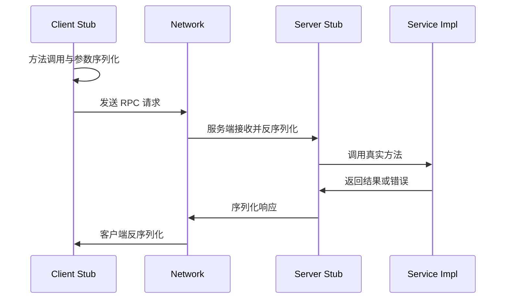

# RPC 远程过程调用学习笔记

最后整理：2026-06-11

RPC（Remote Procedure Call）不是单一协议，而是一类通信模型：让程序像调用本地函数一样调用远端服务。典型 RPC 系统会处理连接、方法标识、参数序列化、超时、重试、错误码、认证和负载均衡。

## 解决的问题

- 分布式系统中服务之间需要结构化调用。
- 应用希望用接口和方法表达通信，而不是手写字节流。
- 需要统一处理序列化、超时、错误、认证和服务发现。

## 基本流程

## 关键设计点

| 设计点 | 说明 |
|---|---|
| IDL | 接口定义语言，例如 Protocol Buffers、Thrift IDL |
| 序列化 | 把结构化对象变成字节，例如 Protobuf、JSON、CBOR |
| 传输 | HTTP/2、TCP、自定义协议等 |
| 调用语义 | unary、streaming、oneway 等 |
| 超时与重试 | 分布式调用必须设置截止时间和重试策略 |
| 兼容性 | 字段新增、删除、默认值和版本演进 |

## 常见实现

- ONC RPC：经典 RPC，NFS 等系统使用。
- gRPC：基于 HTTP/2 和 Protocol Buffers，支持流式调用。
- JSON-RPC：轻量文本 RPC，常用于工具接口和区块链节点接口。
- XML-RPC / SOAP：较早的 Web 服务风格。

## 常见误区

- RPC 调用不是本地函数调用，必须考虑网络失败、超时、重复执行和部分成功。
- 重试不是总是安全，非幂等操作可能被重复执行。
- 长超时会放大故障，短超时会造成误失败，需要结合业务 SLO 设置。

## 参考资料

- RFC 5531 - RPC: Remote Procedure Call Protocol Specification Version 2: <[https://www.rfc-editor.org/rfc/rfc5531.html](https://www.rfc-editor.org/rfc/rfc5531.html)>
- gRPC Documentation: <[https://grpc.io/docs/](https://grpc.io/docs/)>
- JSON-RPC 2.0 Specification: <[https://www.jsonrpc.org/specification](https://www.jsonrpc.org/specification)>

