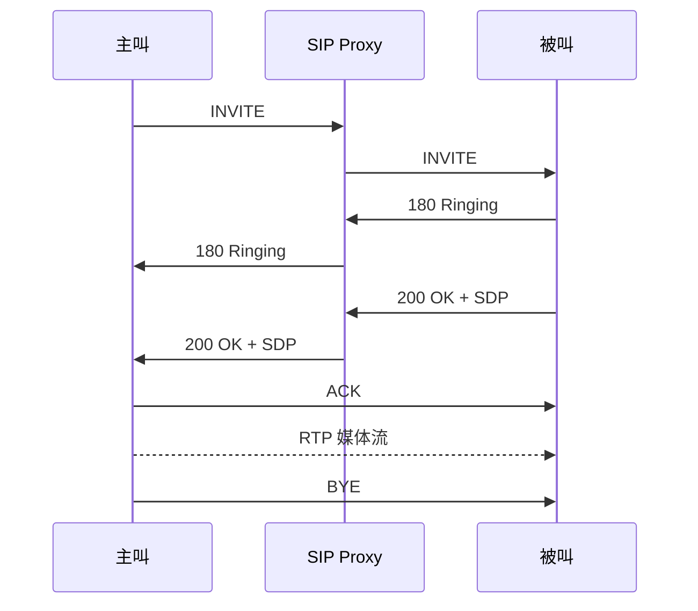

# SIP 会话发起协议学习笔记

最后整理：2026-06-11

SIP（Session Initiation Protocol）用于建立、修改和终止多媒体会话，常见于 VoIP、视频会议、即时通信呼叫控制。SIP 本身不传输媒体流，媒体通常由 RTP/RTCP 承载。

## 解决的问题

- 如何找到被叫用户或终端。
- 如何协商一次语音/视频会话的媒体能力。
- 如何处理响铃、接听、挂断、转接、重定向等呼叫控制。
- 如何让代理服务器参与路由和策略控制。

## 核心组件

| 组件 | 作用 |
|---|---|
| User Agent Client | 发起 SIP 请求 |
| User Agent Server | 响应 SIP 请求 |
| Proxy Server | 转发和路由请求 |
| Registrar | 接收 REGISTER，记录用户当前位置 |
| Redirect Server | 告诉客户端新的联系地址 |

## 常见方法

| 方法 | 作用 |
|---|---|
| REGISTER | 注册用户当前位置 |
| INVITE | 发起会话 |
| ACK | 确认最终响应 |
| BYE | 结束会话 |
| CANCEL | 取消尚未完成的请求 |
| OPTIONS | 查询能力 |

## 基本呼叫流程

## SIP 与 SDP/RTP

SIP 负责会话控制，SDP 描述媒体能力，例如编解码器、IP、端口，RTP 负责真正传输音视频包。排查通话问题时要分别看 SIP 信令是否成功、SDP 地址端口是否正确、RTP 是否双向可达。

## 参考资料

- [RFC 3261 - SIP](https://www.rfc-editor.org/rfc/rfc3261.html)
- [RFC 4566 - SDP](https://www.rfc-editor.org/rfc/rfc4566.html)
- [RFC 3550 - RTP](https://www.rfc-editor.org/rfc/rfc3550.html)

