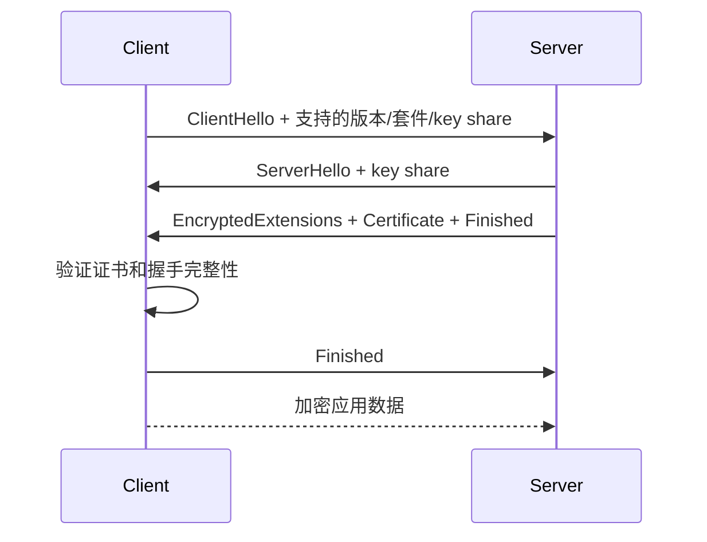

# TLS 传输层安全协议学习笔记

最后整理：2026-06-11

TLS（Transport Layer Security）为应用通信提供加密、身份认证和完整性保护。HTTPS 就是 HTTP over TLS。虽然名字里有 Transport Layer，但从 OSI 学习角度，TLS 常被放在传输层之上、应用层之下，承担表示层和会话安全能力。

## 解决的问题

- 防止中间人读取明文内容。
- 验证服务器身份，必要时也验证客户端身份。
- 防止通信内容被篡改。
- 协商会话密钥，保护后续应用数据。

## TLS 1.3 握手简化流程



## 核心概念

| 概念 | 说明 |
|---|---|
| 证书 | 绑定公钥和身份，例如域名 |
| CA | 证书颁发机构，浏览器和系统信任根 CA |
| SNI | ClientHello 中携带目标域名，便于服务器选择证书 |
| ALPN | 协商上层协议，例如 HTTP/1.1、h2、h3 |
| ECDHE | 常见密钥交换方式，提供前向安全 |
| Session Resumption | 会话恢复，减少握手成本 |

## TLS 1.2 与 TLS 1.3 差异

- TLS 1.3 移除了许多旧算法和不安全选项。
- TLS 1.3 握手更快，默认使用前向安全的密钥交换。
- TLS 1.3 加密了更多握手内容。
- TLS 1.3 支持 0-RTT，但 0-RTT 存在重放风险。

## 常见问题

- 证书域名不匹配：访问 IP 或错误域名时常见。
- 证书链不完整：服务端没有发送中间证书。
- 系统时间错误：会导致证书未生效或已过期判断异常。
- 客户端太旧：不支持服务端要求的 TLS 版本或密码套件。

## 排查命令

```powershell
curl -v https://example.com
openssl s_client -connect example.com:443 -servername example.com
```

## 参考资料

- RFC 8446 - TLS 1.3: <https://www.rfc-editor.org/rfc/rfc8446.html>
- RFC 6066 - TLS Extensions, including SNI: <https://www.rfc-editor.org/rfc/rfc6066.html>
- RFC 7301 - ALPN: <https://www.rfc-editor.org/rfc/rfc7301.html>

