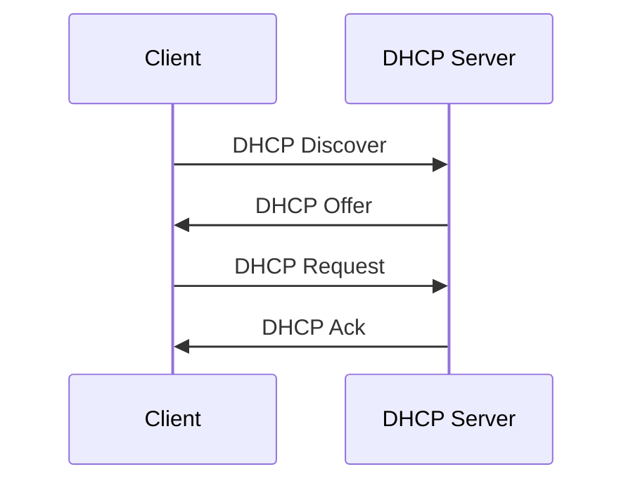

# DHCP 动态主机配置协议学习笔记

最后整理：2026-06-11

DHCP（Dynamic Host Configuration Protocol）用于自动给主机分配网络配置，包括 IP 地址、子网掩码、默认网关、DNS 服务器和租期。没有 DHCP，终端就需要手动配置这些参数。

## 解决的问题

- 大量终端手动配置 IP 成本高且容易冲突。
- 网络需要集中管理地址池、网关、DNS 等参数。
- 终端移动到不同网络后需要自动获得新配置。

## DORA 流程

客户端初始可能没有 IP，因此 DHCP 使用广播。IPv4 DHCP 常用 UDP 67/68 端口。

## 常见选项

| 选项 | 作用 |
|---|---|
| Subnet Mask | 子网掩码 |
| Router | 默认网关 |
| Domain Name Server | DNS 服务器 |
| Lease Time | 地址租期 |
| Domain Name | 域名后缀 |
| NTP Server | 时间服务器 |

## 租期

DHCP 分配的地址有租期。客户端通常在租期中途尝试续租。如果续租失败，后续会重新广播请求。租期太短会增加 DHCP 负担，租期太长会降低地址回收速度。

## DHCP Relay

DHCP 广播不能跨路由器。跨网段集中部署 DHCP 时，需要 DHCP Relay，把客户端广播转发给远端 DHCP 服务器，并带上来源网段信息。

## 常见问题

- 地址池耗尽：新设备无法获取 IP。
- DHCP 服务器冲突：多个服务器给出不同网关或 DNS。
- Relay 配置错误：跨网段客户端无法获取地址。
- VLAN 配错：客户端请求到不了正确的 DHCP 服务。

## 参考资料

- RFC 2131 - Dynamic Host Configuration Protocol: <https://www.rfc-editor.org/rfc/rfc2131.html>
- RFC 2132 - DHCP Options: <https://www.rfc-editor.org/rfc/rfc2132.html>

