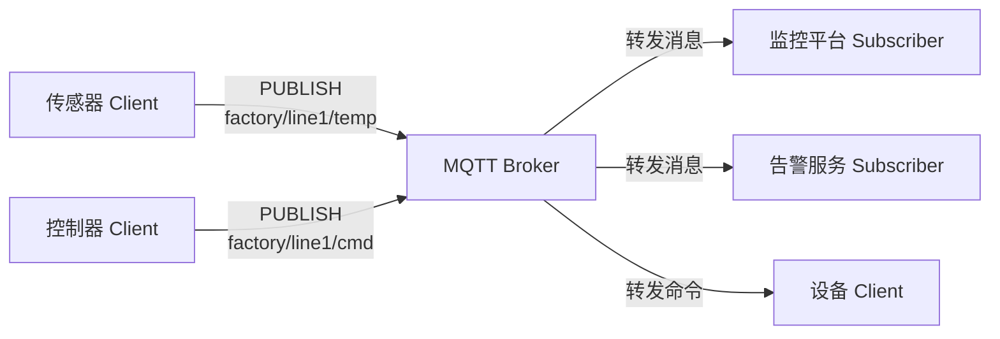

# MQTT 消息协议学习笔记

最后整理：2026-06-14

Last researched：2026-06-14

MQTT（Message Queuing Telemetry Transport）是轻量级发布/订阅消息协议，常用于 IoT、设备遥测、弱网络环境、移动端推送和边缘设备通信。它通过 Broker 解耦发布者和订阅者，客户端不直接互相连接。

## 学习目标

- 理解 MQTT 的 Client、Broker、Topic、Publish、Subscribe。
- 分清 QoS 0/1/2 的可靠性和代价。
- 理解 Retained Message、Will Message、Clean Start/Session Expiry。
- 能排查连接失败、订阅无消息、重复消息、离线消息、鉴权和 TLS 问题。

## 协议定位

| 项 | 说明 |
|---|---|
| 默认端口 | TCP 1883 |
| TLS 端口 | TCP 8883 |
| 通信模型 | 发布/订阅 |
| 中心节点 | Broker |
| 典型载荷 | 任意字节，常见 JSON、二进制、Protobuf |
| 适用场景 | IoT、遥测、设备控制、消息分发 |

MQTT 本身不规定业务载荷格式。Topic 和 Payload 的语义需要应用自己定义。

## 基本模型



特点：

- 发布者不需要知道订阅者是谁。
- 订阅者只关心 Topic。
- Broker 负责连接管理、订阅匹配、消息转发、会话和权限。

## Topic

Topic 是层级字符串，用 `/` 分隔：

```text
factory/line1/motor/temperature
home/livingroom/light/status
device/123456/telemetry
```

通配符：

| 通配符 | 含义 | 示例 |
|---|---|---|
| `+` | 匹配单层 | `factory/+/temp` |
| `#` | 匹配多层，只能放末尾 | `factory/#` |

设计建议：

- Topic 表示资源路径或消息类别，不要把大量动态数据塞进 Topic。
- 设备 ID、区域、类型、方向要有稳定规范。
- 命令、状态、遥测、事件最好分开。
- 权限通常按 Topic 前缀配置，命名要方便授权。

## QoS

| QoS | 语义 | 流程 | 代价 | 适用 |
|---:|---|---|---|---|
| 0 | 至多一次 | 发出即不确认 | 最低 | 高频遥测、可丢数据 |
| 1 | 至少一次 | PUBLISH/PUBACK | 中等，可能重复 | 状态上报、命令确认 |
| 2 | 恰好一次 | 四步握手 | 最高 | 强一致但低频场景 |

注意：

- QoS 1 可能重复，业务必须能去重或幂等处理。
- QoS 2 代价高，不代表端到端业务一定“绝对只执行一次”，应用层仍要考虑幂等。
- 发布 QoS 和订阅 QoS 会共同决定最终投递 QoS。

## Retained Message

Retained Message 是 Broker 为某个 Topic 保留的最后一条消息。新订阅者订阅后会立即收到该保留消息。

适合：

- 设备当前状态；
- 开关状态；
- 配置版本；
- 在线状态摘要。

不适合：

- 每一条历史遥测；
- 命令消息；
- 会造成新订阅者误动作的瞬时事件。

清除方式通常是向该 Topic 发布空载荷且 retained 标志为 true。

## Will Message

Will Message 是客户端连接时提交给 Broker 的“遗嘱消息”。如果客户端异常断开，Broker 会发布该消息。

典型用途：

```text
Topic: device/123/status
Payload: offline
Retain: true
```

配合上线时发布 retained `online`，可以维护设备在线状态。

## 会话

MQTT 3.1.1 使用 Clean Session；MQTT 5 引入 Clean Start 和 Session Expiry Interval，表达更清晰。

会话可能保存：

- 订阅关系；
- 未确认 QoS 1/2 消息；
- 离线期间排队消息；
- Packet Identifier 状态。

常见问题：

- Clean Session 开启后，断线重连不会收到离线消息。
- Session 过期太长会让 Broker 堆积大量离线消息。
- 同一个 Client ID 重复连接，旧连接通常会被踢下线。

## MQTT 5 新特性

MQTT 5 增强了协议可观测性和扩展能力：

| 特性 | 作用 |
|---|---|
| Reason Code | 更明确的失败原因 |
| User Properties | 用户自定义属性 |
| Session Expiry | 精确控制会话保存时间 |
| Message Expiry | 消息过期 |
| Topic Alias | 减少长 Topic 重复传输 |
| Request/Response | 通过 Response Topic 和 Correlation Data 支持请求响应模式 |
| Shared Subscription | 多消费者共享订阅负载 |

## 常见问题

| 现象 | 可能原因 | 排查方向 |
|---|---|---|
| 连接失败 | 地址/端口、账号密码、TLS、Client ID 冲突 | 看 CONNACK Reason Code 和 Broker 日志 |
| 订阅不到消息 | Topic 拼写、权限、通配符、QoS、发布到不同 Broker | 用测试客户端订阅 `#` 验证 |
| 消息重复 | QoS 1 重发、客户端重连、业务未去重 | 使用消息 ID 或业务序号 |
| 离线收不到消息 | Clean Session、Session Expiry、QoS 0 | 检查会话配置 |
| retained 消息误触发 | 把命令做成 retained | 区分状态和命令 Topic |
| Broker 内存高 | 离线会话、堆积消息、慢订阅者 | 配置过期和限额 |
| 设备频繁掉线 | Keep Alive 太长/太短、网络 NAT 超时、心跳异常 | 调整 keepalive 和重连策略 |

## 抓包与调试

```bash
# 明文 MQTT
tcpdump -i eth0 -nn port 1883

# TLS MQTT
tcpdump -i eth0 -nn port 8883
```

常用客户端：

```bash
mosquitto_sub -h broker.example.com -t 'device/+/status' -v
mosquitto_pub -h broker.example.com -t 'device/123/cmd' -m '{"on":true}'
```

Wireshark 过滤：

```text
mqtt || tcp.port == 1883 || tcp.port == 8883
```

## 参考资料

- Official - MQTT Version 5.0 OASIS Standard: <https://docs.oasis-open.org/mqtt/mqtt/v5.0/mqtt-v5.0.html>
- Official - MQTT Version 3.1.1 OASIS Standard: <https://docs.oasis-open.org/mqtt/mqtt/v3.1.1/mqtt-v3.1.1.html>
- Official - MQTT.org: <https://mqtt.org/>
- Official - Eclipse Mosquitto documentation: <https://mosquitto.org/documentation/>
- Community - EMQX MQTT guide: <https://www.emqx.com/en/mqtt-guide>
