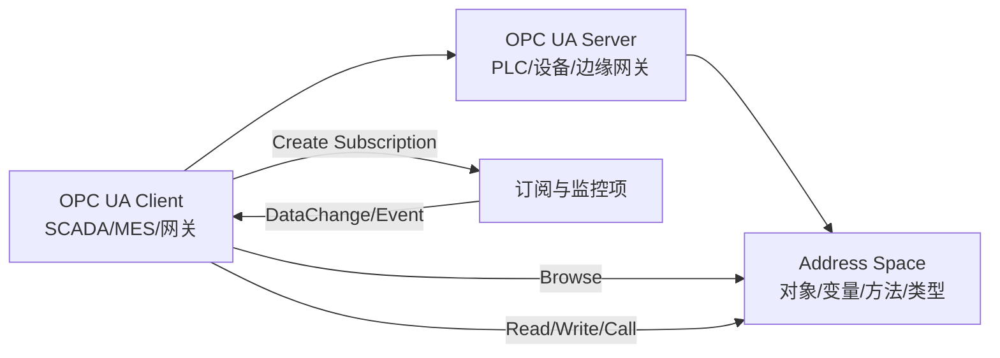

# OPC UA 工业通信协议学习笔记

最后整理：2026-06-14

Last researched：2026-06-14

OPC UA（OPC Unified Architecture）是工业自动化中用于设备、控制系统、SCADA、MES、云平台之间互操作的数据建模和通信标准。它不仅是“读写点位”的协议，还定义了地址空间、节点、类型系统、服务、安全、订阅和信息模型。

## 学习目标

- 理解 OPC UA 的 Client、Server、Address Space、Node、Service。
- 分清 OPC UA 和 Modbus、OPC DA 的定位差异。
- 理解变量、对象、方法、引用、命名空间、NodeId。
- 理解安全策略、证书、会话、订阅和监控项。
- 能排查连接失败、证书不信任、节点找不到、订阅无数据等问题。

## 协议定位

| 项 | OPC UA |
|---|---|
| 通信模型 | Client/Server，也支持 PubSub |
| 数据模型 | 面向对象的地址空间和信息模型 |
| 默认端口 | TCP 4840 常见 |
| 安全机制 | 证书、签名、加密、用户身份认证 |
| 典型场景 | SCADA、PLC 网关、工业平台、设备语义建模 |

与 Modbus 对比：

| 对比 | Modbus | OPC UA |
|---|---|---|
| 数据模型 | 线圈/寄存器，语义弱 | 节点、对象、变量、类型、引用 |
| 自描述能力 | 弱，依赖设备手册 | 强，可浏览地址空间 |
| 安全 | 协议本身较弱 | 内置证书、签名、加密 |
| 复杂度 | 低 | 高 |
| 适合 | 简单寄存器读写 | 复杂设备模型和跨厂商互操作 |

## 基本架构



## 地址空间

OPC UA Server 暴露一个 Address Space。里面的元素叫 Node。

常见节点类型：

| 节点类型 | 作用 |
|---|---|
| Object | 表示设备、组件、系统对象 |
| Variable | 表示可读写数据，例如温度、压力、状态 |
| Method | 表示可调用操作 |
| ObjectType | 对象类型定义 |
| VariableType | 变量类型定义 |
| ReferenceType | 引用类型定义 |
| DataType | 数据类型定义 |
| View | 地址空间视图 |

Node 之间通过 Reference 连接，例如 `HasComponent`、`Organizes`、`HasTypeDefinition`。

## NodeId 与命名空间

NodeId 唯一标识一个节点，通常包含命名空间和标识符。

例子：

```text
ns=2;s=Device1.Temperature
ns=3;i=1001
```

| 部分 | 含义 |
|---|---|
| `ns=2` | 命名空间索引 |
| `s=...` | 字符串标识符 |
| `i=...` | 数值标识符 |

注意：

- 命名空间索引可能随服务器配置变化，工程中最好结合 Namespace URI 使用。
- 不同厂商模型的 NodeId 命名方式差异很大。
- 浏览地址空间比盲猜点位更可靠。

## 服务集

OPC UA 定义了多个服务集：

| 服务集 | 用途 |
|---|---|
| Discovery | 发现服务器和端点 |
| SecureChannel | 建立安全通道 |
| Session | 建立和管理会话 |
| View | 浏览地址空间 |
| Attribute | 读写节点属性 |
| Method | 调用方法 |
| MonitoredItem | 创建监控项 |
| Subscription | 管理订阅 |

常见操作：

- Browse：浏览节点树。
- Read：读取变量值。
- Write：写入变量值。
- Call：调用方法。
- CreateSubscription：创建订阅。
- CreateMonitoredItems：监控变量变化。

## 安全机制

OPC UA 安全通常包含：

| 层次 | 内容 |
|---|---|
| 应用实例证书 | Client 和 Server 互相信任 |
| Security Policy | 加密和签名算法套件 |
| Message Security Mode | None、Sign、SignAndEncrypt |
| User Identity | Anonymous、用户名密码、证书、Token |
| 权限模型 | 节点读写权限、角色、访问控制 |

常见问题：

- 客户端证书未被服务器信任。
- 服务器证书未被客户端信任。
- Endpoint 安全策略不匹配。
- 用户认证通过但没有节点访问权限。
- 时间不准导致证书有效期校验失败。

## 订阅与监控项

轮询 Read 会增加负载。OPC UA 推荐用 Subscription + MonitoredItem 订阅数据变化。

关键参数：

| 参数 | 含义 |
|---|---|
| Publishing Interval | 订阅发布周期 |
| Sampling Interval | 采样周期 |
| Queue Size | 队列大小 |
| Deadband | 死区，变化超过阈值才上报 |
| KeepAlive Count | 无数据变化时的保活发布 |
| Lifetime Count | 订阅生命周期 |

调优原则：

- 高频数据不要盲目订阅过多点位。
- 采样周期小于设备实际刷新周期没有意义。
- 队列太小会丢中间变化，太大占内存。
- 网络不稳定时要关注 KeepAlive 和重连恢复。

## OPC UA PubSub

OPC UA 除 Client/Server 外，还定义 PubSub 模型，可运行在 UDP、MQTT 等传输上，用于一对多数据分发和云集成。学习初期先掌握 Client/Server，再看 PubSub。

## 常见问题

| 现象 | 可能原因 | 排查方向 |
|---|---|---|
| 连接不上 | 地址/端口、防火墙、Endpoint 不匹配 | 测 TCP 4840，查看 Endpoint 列表 |
| 证书错误 | 双方证书未信任、证书过期、时间错误 | 导入信任列表，校准时间 |
| 能连接但浏览不到节点 | 权限不足、命名空间不同、服务器模型限制 | 换用户，查看 Namespace |
| Read BadNodeIdUnknown | NodeId 错或命名空间索引变化 | Browse 后复制 NodeId |
| Write 失败 | 节点只读、类型不匹配、权限不足 | 查看 AccessLevel 和 DataType |
| 订阅无数据 | Sampling/Publishing 配置、Deadband、队列、权限 | 检查监控项状态码 |
| 数据质量 Bad/Uncertain | 设备源异常、PLC 通信异常、网关映射错误 | 看 StatusCode 和源设备 |

## 调试工具

| 工具 | 用途 |
|---|---|
| UaExpert | 常用 OPC UA 客户端，浏览、读写、订阅 |
| open62541 工具 | 开源 OPC UA 栈和示例 |
| Wireshark | 抓 OPC UA TCP；加密后只能看部分元信息 |
| 服务器日志 | 证书、权限、节点、订阅错误 |
| 证书管理工具 | 管理信任列表和应用证书 |

Wireshark 过滤：

```text
opcua || tcp.port == 4840
```

## 学习建议

1. 先用 UaExpert 连接一个测试 Server，浏览地址空间。
2. 理解 NodeId、Namespace、Variable、Object、Reference。
3. 再学习安全证书和 Endpoint 策略。
4. 最后学习订阅参数和信息模型建模。
5. 做工程集成时，记录服务器 Namespace URI、NodeId、DataType、AccessLevel、采样周期和质量码。

## 参考资料

- [Official - OPC Foundation OPC UA](https://opcfoundation.org/about/opc-technologies/opc-ua/)
- [Official - OPC UA Online Reference](https://reference.opcfoundation.org/)
- [Official - OPC UA Part 4 Services](https://reference.opcfoundation.org/Core/Part4/)
- [Official - OPC UA Part 6 Mappings](https://reference.opcfoundation.org/Core/Part6/)
- [Official - open62541 documentation](https://www.open62541.org/doc/)
