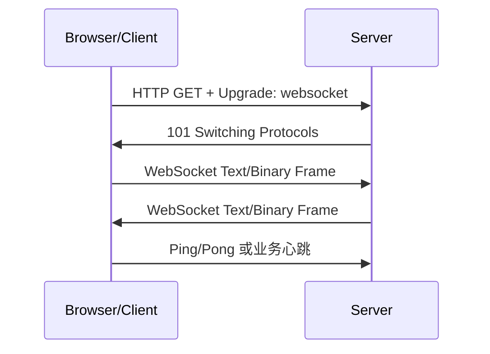

# WebSocket 协议学习笔记

最后整理：2026-06-14

Last researched：2026-06-14

WebSocket 是在单个 TCP 连接上提供全双工消息通信的协议。它常用于网页实时通信、在线协作、行情推送、聊天、游戏、设备控制台和日志流。WebSocket 通过 HTTP/1.1 Upgrade 握手建立，建立后不再按普通 HTTP 请求/响应模型工作。

## 学习目标

- 理解 WebSocket 为什么存在，以及它和 HTTP 轮询、SSE 的区别。
- 理解 Upgrade 握手、帧、文本/二进制消息、Ping/Pong、关闭流程。
- 能排查连接失败、代理不支持、跨域/鉴权、心跳、断线重连问题。

## 协议定位

| 项 | 说明 |
|---|---|
| URL scheme | `ws://`、`wss://` |
| 默认端口 | `ws` 默认 80，`wss` 默认 443 |
| 底层 | TCP；`wss` 使用 TLS |
| 握手 | HTTP/1.1 Upgrade |
| 通信模型 | 建连后全双工消息传输 |

WebSocket 适合持续双向通信，不适合替代所有 HTTP API。普通 CRUD、缓存友好的资源获取仍然适合 HTTP。

## 与轮询、SSE 对比

| 方案 | 方向 | 特点 | 适合 |
|---|---|---|---|
| 短轮询 | 客户端周期请求 | 简单但延迟和开销大 | 低频状态检查 |
| 长轮询 | 服务端挂起请求直到有数据 | 兼容 HTTP，但连接管理复杂 | 兼容性要求高的推送 |
| SSE | 服务端到客户端单向推送 | 基于 HTTP，自动重连，文本事件 | 通知、日志、状态流 |
| WebSocket | 双向全双工 | 长连接、低延迟、消息帧 | 聊天、协作、控制、实时数据 |

## 握手过程

客户端发起 HTTP Upgrade：

```http
GET /chat HTTP/1.1
Host: example.com
Upgrade: websocket
Connection: Upgrade
Sec-WebSocket-Key: base64-random
Sec-WebSocket-Version: 13
Origin: https://example.com
```

服务端响应：

```http
HTTP/1.1 101 Switching Protocols
Upgrade: websocket
Connection: Upgrade
Sec-WebSocket-Accept: computed-value
```

握手成功后，连接切换为 WebSocket 帧格式。



## 帧与消息

WebSocket 传输的是消息，底层用帧承载。一个消息可以被分片成多个帧。

常见 Opcode：

| Opcode | 含义 |
|---|---|
| `0x1` | 文本帧 |
| `0x2` | 二进制帧 |
| `0x8` | 关闭 |
| `0x9` | Ping |
| `0xA` | Pong |

浏览器到服务端的帧必须 Mask，服务端到浏览器的帧不 Mask。这是 WebSocket 协议要求，用于降低某些代理缓存污染风险。

## 心跳与断线重连

WebSocket 是长连接，必须处理断线：

- TCP 连接可能被 NAT、防火墙、负载均衡空闲超时清理。
- 移动网络切换时，客户端可能长时间不知道连接已失效。
- 服务器发布、重启、扩容会断开连接。
- 应用层需要心跳、超时检测和重连策略。

常见策略：

1. 服务端定期 Ping，客户端自动 Pong。
2. 浏览器 API 不直接暴露协议 Ping/Pong 时，应用层发送心跳消息。
3. 客户端断线后指数退避重连。
4. 重连后重新鉴权、重新订阅、补拉缺失消息。

## 鉴权与安全

WebSocket 握手是 HTTP 请求，可以复用 Cookie、Authorization Header、查询参数、子协议等方式传递认证信息。

建议：

- 生产环境使用 `wss://`。
- 不要把长期敏感 token 放在 URL 查询参数中，日志容易泄露。
- 校验 Origin，防止浏览器跨站滥用已登录 Cookie 建立连接。
- 服务端限制连接数、消息大小、心跳超时和发送频率。
- 对业务消息做权限校验，不要只在握手时鉴权。

## 代理与负载均衡

WebSocket 对中间代理有要求：

- 必须支持 HTTP Upgrade。
- 空闲超时时间要足够长。
- 反向代理要转发 `Upgrade` 和 `Connection` 头。
- 负载均衡如需会话状态，要考虑粘性会话或外部共享状态。

Nginx 常见关键配置：

```nginx
proxy_http_version 1.1;
proxy_set_header Upgrade $http_upgrade;
proxy_set_header Connection "upgrade";
proxy_read_timeout 3600s;
```

## 常见问题

| 现象 | 可能原因 | 排查方向 |
|---|---|---|
| 握手返回 400/404 | 路径错误、服务未处理 Upgrade | 看服务路由和代理规则 |
| 返回 426 或没有 101 | 代理不支持或未转发 Upgrade | 查反向代理配置 |
| 浏览器报跨域/Origin | 服务端 Origin 校验不通过 | 检查允许源 |
| 连接一段时间后断开 | 代理/NAT 空闲超时、心跳缺失 | 调整 ping/心跳和超时 |
| 能连但收不到消息 | 未订阅、鉴权失败、业务路由错误 | 看服务端连接和订阅状态 |
| 消息乱序或丢失 | 重连后未补偿、业务无序列号 | 设计消息 ID 和补拉 |
| 大消息失败 | 代理或服务端消息大小限制 | 调整 max frame/message size |

## 调试命令

```bash
# curl 只能观察 Upgrade 握手，不适合完整交互
curl -i -N \
  -H "Connection: Upgrade" \
  -H "Upgrade: websocket" \
  -H "Sec-WebSocket-Key: SGVsbG8sIHdvcmxkIQ==" \
  -H "Sec-WebSocket-Version: 13" \
  http://example.com/ws
```

更适合的工具：

- 浏览器 DevTools Network 的 WS 面板；
- `wscat`；
- Postman WebSocket；
- Wireshark；
- 服务端连接日志。

Wireshark 过滤：

```text
http.websocket || websocket || tcp.port == 80 || tcp.port == 443
```

## 参考资料

- RFC 6455 - The WebSocket Protocol: <https://www.rfc-editor.org/rfc/rfc6455>
- MDN - WebSocket API: <https://developer.mozilla.org/en-US/docs/Web/API/WebSockets_API>
- MDN - Writing WebSocket servers: <https://developer.mozilla.org/en-US/docs/Web/API/WebSockets_API/Writing_WebSocket_servers>
- Nginx WebSocket proxying: <https://nginx.org/en/docs/http/websocket.html>
