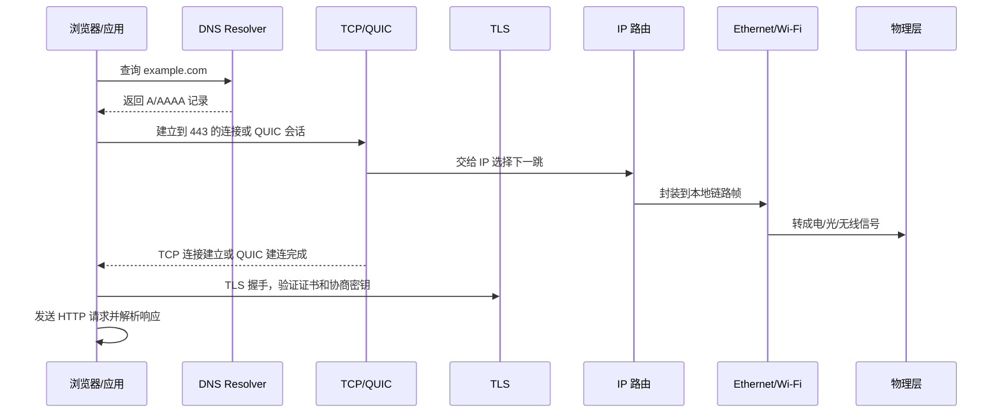

# 协议学习路线与分层地图

最后整理：2026-06-14

Last researched：2026-06-14

网络协议学习最容易卡在两个地方：第一，把“接口、线缆、电气层、帧、报文、应用语义”混为一谈；第二，只背协议名称，不知道问题发生时应该从哪一层开始排查。本篇作为整个 `协议` 目录的学习地图，用来建立分层、术语、阅读顺序和工程排查思路。

## 学习目标

- 建立 OSI 七层、TCP/IP 四层、工程实际协议栈之间的对应关系。
- 知道每一层解决什么问题、典型协议是什么、常见故障是什么。
- 能把一次访问网站、一次串口读寄存器、一次 USB 设备插入分别拆成多层过程。
- 学会从“现象”反推“可能在哪一层出问题”。
- 建立后续阅读本目录各专题笔记的顺序。

## OSI 七层与 TCP/IP 分层

OSI 七层适合学习和归档，TCP/IP 分层更接近互联网工程实践。

| OSI 层 | 关注点 | TCP/IP 常见归类 | 本目录重点 |
|---|---|---|---|
| 第 7 层 应用层 | 业务语义、命令、资源、状态码 | 应用层 | HTTP、DNS、DHCP、FTP、SMTP、Modbus、CANopen |
| 第 6 层 表示层 | 编码、序列化、压缩、加密、内容表示 | 应用层的一部分 | JSON、MIME、ASN.1、TLS |
| 第 5 层 会话层 | 会话建立、保持、恢复、认证上下文 | 应用层的一部分 | RPC、SIP、NetBIOS |
| 第 4 层 传输层 | 端到端传输、端口、可靠性、拥塞控制 | 传输层 | TCP、UDP、QUIC、SCTP |
| 第 3 层 网络层 | 跨网段寻址、路由、分片、控制消息 | 网际层 | IPv4、IPv6、ICMP、IPsec |
| 第 2 层 数据链路层 | 同一链路内成帧、寻址、校验、仲裁 | 网络接口层 | Ethernet MAC、ARP、VLAN、CAN、I2C、SPI、USB |
| 第 1 层 物理层 | 电/光/无线信号、连接器、线缆、速率 | 网络接口层 | Ethernet PHY、Wi-Fi PHY、RS-232/485、USB Type-C |

重要提醒：

- OSI 分层是学习模型，不是所有真实协议的硬边界。
- ARP 介于链路层和网络层之间。
- TLS 常被放在应用层和传输层之间。
- QUIC 把传输、多路复用、TLS 1.3 安全握手组合在 UDP 之上。
- USB、CAN、I2C、SPI 这类总线不一定适合套用互联网协议栈，但仍可用“物理连接、帧/事务、上层语义”来拆解。

## 每层解决的问题

| 层 | 核心问题 | 典型故障现象 | 常用工具 |
|---|---|---|---|
| 物理层 | 比特如何变成信号并跨介质传播 | 链路不亮、速率降级、误码、掉线 | 万用表、示波器、光功率计、网卡状态、USB/PD 表 |
| 数据链路层 | 同一链路中如何组织帧和访问介质 | ARP 失败、VLAN 不通、总线冲突、枚举失败 | Wireshark、交换机 MAC 表、逻辑分析仪、USBView |
| 网络层 | 包如何跨网段到达目标 | ping 不通、路由错、MTU 黑洞、IP 冲突 | ping、traceroute、ip route、抓 ICMP |
| 传输层 | 进程到进程如何可靠或低开销通信 | 端口不通、TCP 重传、握手失败、连接耗尽 | ss/netstat、tcpdump、Wireshark、curl |
| 会话层 | 调用、登录、连接上下文如何保持 | 会话过期、RPC 超时、SIP 呼叫失败 | 应用日志、抓包、链路追踪 |
| 表示层 | 数据如何编码、压缩、加密和解释 | 乱码、证书错误、Content-Type 错、JSON 解析失败 | openssl、curl -v、jq、证书工具 |
| 应用层 | 双方如何表达业务语义 | HTTP 4xx/5xx、DNS 解析错、Modbus 异常码 | curl、dig、nslookup、业务客户端 |

## 三条主线学习法

### 互联网主线

适合学习 Web、后端、云服务、网络排查：

1. `01-物理层/以太网物理层-Ethernet-PHY.md`
2. `02-数据链路层/以太网-Ethernet-MAC.md`
3. `02-数据链路层/ARP-地址解析协议.md`
4. `03-网络层/IPv4.md` 和 `03-网络层/IPv6.md`
5. `03-网络层/ICMP.md`
6. `04-传输层/TCP.md`、`04-传输层/UDP.md`、`04-传输层/QUIC.md`
7. `06-表示层/TLS.md`
8. `07-应用层/DNS.md`、`07-应用层/HTTP.md`、`07-应用层/DHCP.md`

### 嵌入式与硬件主线

适合学习 MCU、传感器、开发板、仪器调试：

1. `01-物理层/00-物理层总览.md`
2. `02-数据链路层/串口通信协议总览.md`
3. `01-物理层/RS-232.md`、`01-物理层/RS-422.md`、`01-物理层/RS-485.md`
4. `02-数据链路层/I2C.md`
5. `02-数据链路层/SPI.md`
6. `02-数据链路层/CAN-控制器局域网.md`
7. `01-物理层/USB与Type-C物理层.md`
8. `02-数据链路层/USB总线协议.md`

### 工业通信主线

适合学习 PLC、变频器、仪表、运动控制、现场总线：

1. `07-应用层/工业通信协议总览.md`
2. `01-物理层/RS-485.md`
3. `07-应用层/Modbus.md`
4. `02-数据链路层/CAN-控制器局域网.md`
5. `07-应用层/CANopen.md`
6. `07-应用层/PROFIBUS.md`
7. `07-应用层/EtherCAT.md`
8. `07-应用层/HART.md`
9. `07-应用层/IO-Link.md`

## 一个 HTTPS 请求的跨层过程

排查顺序通常是：

1. 域名是否解析正确。
2. IP 是否可达，路由是否正确。
3. 端口是否可连接，是否被防火墙拦截。
4. TLS 证书和协议版本是否兼容。
5. HTTP 方法、路径、头、Body、状态码是否符合预期。
6. 业务服务日志是否有应用层错误。

## 一个 USB 转串口读 Modbus 的跨层过程

排查顺序通常是：

1. USB 设备是否枚举，驱动是否加载。
2. 虚拟串口号是否存在，应用是否有权限打开。
3. USB 转串口模块类型是否匹配 TTL/RS-232/RS-485。
4. 串口参数是否一致。
5. RS-485 A/B、终端电阻、参考地、收发方向是否正确。
6. Modbus 从站地址、功能码、寄存器地址、CRC 是否正确。

## 分层排查通用方法

### 自下而上

适合“完全不通”的情况：

1. 物理层：线缆、电源、接口、链路灯、信号质量。
2. 链路层：MAC、ARP、VLAN、总线仲裁、USB 枚举。
3. 网络层：IP、掩码、网关、路由、MTU。
4. 传输层：端口、连接、重传、防火墙。
5. 表示/会话/应用层：TLS、编码、鉴权、业务协议。

### 自上而下

适合“偶发错误、业务异常、性能差”的情况：

1. 先看应用错误码、日志和请求参数。
2. 再看 TLS/编码/序列化是否正确。
3. 再看连接复用、超时、重试、端口耗尽。
4. 再看网络路径、丢包、MTU、DNS。
5. 最后看物理链路、干扰、速率协商和设备硬件。

### 中间切开

适合复杂系统：

- 用 `ping` 切网络层。
- 用 `curl -v` 切 HTTP/TLS/传输层。
- 用 `tcpdump` 切主机和网络边界。
- 用串口助手切应用软件和串口链路。
- 用 USBView/`lsusb` 切 USB 枚举和上层驱动。
- 用示波器/逻辑分析仪切数字协议和物理信号。

## 常用术语速查

| 术语 | 含义 |
|---|---|
| 帧 Frame | 链路层传输单位，例如 Ethernet Frame、CAN Frame |
| 包 Packet | 网络层传输单位，常指 IP Packet |
| 段 Segment | TCP 传输单位 |
| 数据报 Datagram | UDP 或 IP 场景中常用说法 |
| 报文 Message | 更泛化的协议消息，如 HTTP Message、Modbus PDU |
| PDU | Protocol Data Unit，某一层的协议数据单元 |
| MTU | 链路层可承载的最大网络层包大小 |
| MSS | TCP 单段最大应用数据大小，通常受 MTU 影响 |
| RTT | 往返时延 |
| TTL/Hop Limit | 防止包无限转发的跳数限制 |
| NAT | 地址转换，改变 IP/端口映射 |
| Keepalive | 保活机制，不同层含义不同 |
| Heartbeat | 应用或会话层心跳 |
| Encapsulation | 封装，上层数据被下层加头/尾 |
| Decapsulation | 解封装，接收端逐层剥离头部 |

## 常见学习误区

- 把“能 ping 通”当成“应用一定通”。ICMP 通不代表 TCP 端口、TLS、HTTP 都正常。
- 把“端口开放”当成“协议正确”。TCP 连接成功不代表应用层报文合法。
- 把“网口亮灯”当成“网络正常”。亮灯只说明物理层大概率有链路。
- 把“RS-485”当成“Modbus”。RS-485 是物理层，Modbus RTU 是上层报文协议。
- 把“Type-C”当成“USB4/快充/视频”。Type-C 是连接器，能力取决于控制器、线缆和协议协商。
- 把“JSON”当成“协议”。JSON 是数据表示格式，HTTP/MQTT/WebSocket 等才规定通信语义。
- 把“TLS”当成“HTTP”。TLS 提供安全通道，HTTP 是应用语义。
- 把“抓不到包”当成“没有通信”。交换机镜像、网卡卸载、硬件加密、USB/串口总线都可能影响观察位置。

## 学习顺序建议

1. 先读本篇，形成分层地图。
2. 再读 `00-README.md`，了解目录入口。
3. 按互联网、嵌入式、工业通信三条主线选一条深入。
4. 每学一个协议，都按“定位、解决的问题、报文/帧结构、状态机、常见错误、排查命令、参考规范”整理。
5. 遇到真实问题时，补充到对应专题的“常见问题”和“排查建议”中。

## 参考资料

- [Official - RFC Editor](https://www.rfc-editor.org/)
- [Official - IETF Datatracker](https://datatracker.ietf.org/)
- [Official - IANA Protocol Registries](https://www.iana.org/protocols)
- [Official - IEEE 802 Standards](https://standards.ieee.org/ieee/802/)
- [Official - USB-IF Document Library](https://www.usb.org/documents)
- [Official - Wireshark User's Guide](https://www.wireshark.org/docs/wsug_html_chunked/)
- [Official - MDN HTTP overview](https://developer.mozilla.org/en-US/docs/Web/HTTP/Guides/Overview)
