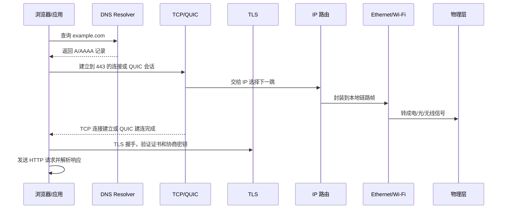
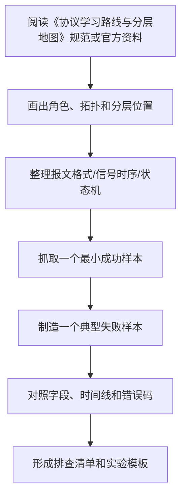

# 协议学习路线与分层地图

最后整理：2026-06-14

Last researched：2026-06-14

网络协议学习最容易卡在两个地方：第一，把“接口、线缆、电气层、帧、报文、应用语义”混为一谈；第二，只背协议名称，不知道问题发生时应该从哪一层开始排查。本篇作为整个 `协议` 目录的学习地图，用来建立分层、术语、阅读顺序和工程排查思路。

## 学习目标

- 建立 OSI 七层、TCP/IP 四层、工程实际协议栈之间的对应关系。
- 知道每一层解决什么问题、典型协议是什么、常见故障是什么。
- 能把一次访问网站、一次串口读寄存器、一次 USB 设备插入分别拆成多层过程。
- 学会从“现象”反推“可能在哪一层出问题”。
- 建立后续阅读本目录各专题笔记的顺序。

## OSI 七层与 TCP/IP 分层

OSI 七层适合学习和归档，TCP/IP 分层更接近互联网工程实践。

| OSI 层 | 关注点 | TCP/IP 常见归类 | 本目录重点 |
|---|---|---|---|
| 第 7 层 应用层 | 业务语义、命令、资源、状态码 | 应用层 | HTTP、DNS、DHCP、FTP、SMTP、Modbus、CANopen |
| 第 6 层 表示层 | 编码、序列化、压缩、加密、内容表示 | 应用层的一部分 | JSON、MIME、ASN.1、TLS |
| 第 5 层 会话层 | 会话建立、保持、恢复、认证上下文 | 应用层的一部分 | RPC、SIP、NetBIOS |
| 第 4 层 传输层 | 端到端传输、端口、可靠性、拥塞控制 | 传输层 | TCP、UDP、QUIC、SCTP |
| 第 3 层 网络层 | 跨网段寻址、路由、分片、控制消息 | 网际层 | IPv4、IPv6、ICMP、IPsec |
| 第 2 层 数据链路层 | 同一链路内成帧、寻址、校验、仲裁 | 网络接口层 | Ethernet MAC、ARP、VLAN、CAN、I2C、SPI、USB |
| 第 1 层 物理层 | 电/光/无线信号、连接器、线缆、速率 | 网络接口层 | Ethernet PHY、Wi-Fi PHY、RS-232/485、USB Type-C |

重要提醒：

- OSI 分层是学习模型，不是所有真实协议的硬边界。
- ARP 介于链路层和网络层之间。
- TLS 常被放在应用层和传输层之间。
- QUIC 把传输、多路复用、TLS 1.3 安全握手组合在 UDP 之上。
- USB、CAN、I2C、SPI 这类总线不一定适合套用互联网协议栈，但仍可用“物理连接、帧/事务、上层语义”来拆解。

## 每层解决的问题

| 层 | 核心问题 | 典型故障现象 | 常用工具 |
|---|---|---|---|
| 物理层 | 比特如何变成信号并跨介质传播 | 链路不亮、速率降级、误码、掉线 | 万用表、示波器、光功率计、网卡状态、USB/PD 表 |
| 数据链路层 | 同一链路中如何组织帧和访问介质 | ARP 失败、VLAN 不通、总线冲突、枚举失败 | Wireshark、交换机 MAC 表、逻辑分析仪、USBView |
| 网络层 | 包如何跨网段到达目标 | ping 不通、路由错、MTU 黑洞、IP 冲突 | ping、traceroute、ip route、抓 ICMP |
| 传输层 | 进程到进程如何可靠或低开销通信 | 端口不通、TCP 重传、握手失败、连接耗尽 | ss/netstat、tcpdump、Wireshark、curl |
| 会话层 | 调用、登录、连接上下文如何保持 | 会话过期、RPC 超时、SIP 呼叫失败 | 应用日志、抓包、链路追踪 |
| 表示层 | 数据如何编码、压缩、加密和解释 | 乱码、证书错误、Content-Type 错、JSON 解析失败 | openssl、curl -v、jq、证书工具 |
| 应用层 | 双方如何表达业务语义 | HTTP 4xx/5xx、DNS 解析错、Modbus 异常码 | curl、dig、nslookup、业务客户端 |

## 三条主线学习法

### 互联网主线

适合学习 Web、后端、云服务、网络排查：

1. `01-物理层/以太网物理层-Ethernet-PHY.md`
2. `02-数据链路层/以太网-Ethernet-MAC.md`
3. `02-数据链路层/ARP-地址解析协议.md`
4. `03-网络层/IPv4.md` 和 `03-网络层/IPv6.md`
5. `03-网络层/ICMP.md`
6. `04-传输层/TCP.md`、`04-传输层/UDP.md`、`04-传输层/QUIC.md`
7. `06-表示层/TLS.md`
8. `07-应用层/DNS.md`、`07-应用层/HTTP.md`、`07-应用层/DHCP.md`

### 嵌入式与硬件主线

适合学习 MCU、传感器、开发板、仪器调试：

1. `01-物理层/00-物理层总览.md`
2. `02-数据链路层/串口通信协议总览.md`
3. `01-物理层/RS-232.md`、`01-物理层/RS-422.md`、`01-物理层/RS-485.md`
4. `02-数据链路层/I2C.md`
5. `02-数据链路层/SPI.md`
6. `02-数据链路层/CAN-控制器局域网.md`
7. `01-物理层/USB与Type-C物理层.md`
8. `02-数据链路层/USB总线协议.md`

### 工业通信主线

适合学习 PLC、变频器、仪表、运动控制、现场总线：

1. `07-应用层/工业通信协议总览.md`
2. `01-物理层/RS-485.md`
3. `07-应用层/Modbus.md`
4. `02-数据链路层/CAN-控制器局域网.md`
5. `07-应用层/CANopen.md`
6. `07-应用层/PROFIBUS.md`
7. `07-应用层/EtherCAT.md`
8. `07-应用层/HART.md`
9. `07-应用层/IO-Link.md`

## 一个 HTTPS 请求的跨层过程



排查顺序通常是：

1. 域名是否解析正确。
2. IP 是否可达，路由是否正确。
3. 端口是否可连接，是否被防火墙拦截。
4. TLS 证书和协议版本是否兼容。
5. HTTP 方法、路径、头、Body、状态码是否符合预期。
6. 业务服务日志是否有应用层错误。

## 一个 USB 转串口读 Modbus 的跨层过程


排查顺序通常是：

1. USB 设备是否枚举，驱动是否加载。
2. 虚拟串口号是否存在，应用是否有权限打开。
3. USB 转串口模块类型是否匹配 TTL/RS-232/RS-485。
4. 串口参数是否一致。
5. RS-485 A/B、终端电阻、参考地、收发方向是否正确。
6. Modbus 从站地址、功能码、寄存器地址、CRC 是否正确。

## 分层排查通用方法

### 自下而上

适合“完全不通”的情况：

1. 物理层：线缆、电源、接口、链路灯、信号质量。
2. 链路层：MAC、ARP、VLAN、总线仲裁、USB 枚举。
3. 网络层：IP、掩码、网关、路由、MTU。
4. 传输层：端口、连接、重传、防火墙。
5. 表示/会话/应用层：TLS、编码、鉴权、业务协议。

### 自上而下

适合“偶发错误、业务异常、性能差”的情况：

1. 先看应用错误码、日志和请求参数。
2. 再看 TLS/编码/序列化是否正确。
3. 再看连接复用、超时、重试、端口耗尽。
4. 再看网络路径、丢包、MTU、DNS。
5. 最后看物理链路、干扰、速率协商和设备硬件。

### 中间切开

适合复杂系统：

- 用 `ping` 切网络层。
- 用 `curl -v` 切 HTTP/TLS/传输层。
- 用 `tcpdump` 切主机和网络边界。
- 用串口助手切应用软件和串口链路。
- 用 USBView/`lsusb` 切 USB 枚举和上层驱动。
- 用示波器/逻辑分析仪切数字协议和物理信号。

## 常用术语速查

| 术语 | 含义 |
|---|---|
| 帧 Frame | 链路层传输单位，例如 Ethernet Frame、CAN Frame |
| 包 Packet | 网络层传输单位，常指 IP Packet |
| 段 Segment | TCP 传输单位 |
| 数据报 Datagram | UDP 或 IP 场景中常用说法 |
| 报文 Message | 更泛化的协议消息，如 HTTP Message、Modbus PDU |
| PDU | Protocol Data Unit，某一层的协议数据单元 |
| MTU | 链路层可承载的最大网络层包大小 |
| MSS | TCP 单段最大应用数据大小，通常受 MTU 影响 |
| RTT | 往返时延 |
| TTL/Hop Limit | 防止包无限转发的跳数限制 |
| NAT | 地址转换，改变 IP/端口映射 |
| Keepalive | 保活机制，不同层含义不同 |
| Heartbeat | 应用或会话层心跳 |
| Encapsulation | 封装，上层数据被下层加头/尾 |
| Decapsulation | 解封装，接收端逐层剥离头部 |

## 常见学习误区

- 把“能 ping 通”当成“应用一定通”。ICMP 通不代表 TCP 端口、TLS、HTTP 都正常。
- 把“端口开放”当成“协议正确”。TCP 连接成功不代表应用层报文合法。
- 把“网口亮灯”当成“网络正常”。亮灯只说明物理层大概率有链路。
- 把“RS-485”当成“Modbus”。RS-485 是物理层，Modbus RTU 是上层报文协议。
- 把“Type-C”当成“USB4/快充/视频”。Type-C 是连接器，能力取决于控制器、线缆和协议协商。
- 把“JSON”当成“协议”。JSON 是数据表示格式，HTTP/MQTT/WebSocket 等才规定通信语义。
- 把“TLS”当成“HTTP”。TLS 提供安全通道，HTTP 是应用语义。
- 把“抓不到包”当成“没有通信”。交换机镜像、网卡卸载、硬件加密、USB/串口总线都可能影响观察位置。

## 学习顺序建议

1. 先读本篇，形成分层地图。
2. 再读 `00-README.md`，了解目录入口。
3. 按互联网、嵌入式、工业通信三条主线选一条深入。
4. 每学一个协议，都按“定位、解决的问题、报文/帧结构、状态机、常见错误、排查命令、参考规范”整理。
5. 遇到真实问题时，补充到对应专题的“常见问题”和“排查建议”中。

## 参考资料

- [Official - RFC Editor](https://www.rfc-editor.org/)
- [Official - IETF Datatracker](https://datatracker.ietf.org/)
- [Official - IANA Protocol Registries](https://www.iana.org/protocols)
- [Official - IEEE 802 Standards](https://standards.ieee.org/ieee/802/)
- [Official - USB-IF Document Library](https://www.usb.org/documents)
- [Official - Wireshark User's Guide](https://www.wireshark.org/docs/wsug_html_chunked/)
- [Official - MDN HTTP overview](https://developer.mozilla.org/en-US/docs/Web/HTTP/Guides/Overview)

---

## 万字精讲扩展（2026-06-16 更新）
> Last researched: 2026-06-16。本文补充内容以协议规范、RFC、标准组织资料和抓包排查实践为主；具体设备、芯片、操作系统、网关和库实现可能存在差异，真实项目中应继续核对对应版本手册和现场抓包。

### 本章在协议学习路线中的位置

《协议学习路线与分层地图》是协议体系中的一个观察点。学习它时不要只问“它是什么”，还要问它处在哪一层、解决什么互操作问题、依赖什么下层能力、给上层提供什么语义、正常流程如何推进、异常流程如何终止。协议学习的最终目标不是背标准号，而是在真实系统中定位问题：线缆是否可靠，帧是否完整，地址是否正确，路由是否可达，连接是否建立，握手是否成功，业务字段是否被双方一致理解。

本章学习完成后，至少应达到三个标准。第一，能画出最小拓扑和分层位置。第二，能解释关键报文字段、状态机或信号时序。第三，能设计一个抓包或测量实验，把正常样本和失败样本对比出来。只要这三个标准完成，这篇笔记就能用于工程排查，而不仅是概念复习。

### 总览和速查类笔记的精讲重点

总览类笔记的价值在于建立协议地图，而不是替代每个协议规范。端口号、协议号、Ethertype、功能码、报文类型、错误码都适合做速查，但速查表必须标明来源和适用范围。端口号只是默认约定，不等于服务一定开放；协议号只说明 IP 载荷类型，不说明应用语义；工业协议的站号、功能码、对象字典、节点 ID、寄存器地址和数据类型需要结合具体设备手册解释。

学习路线应从可观察性开始。先会用 Wireshark、tcpdump、串口工具、逻辑分析仪或示波器看见报文，再学习字段含义。协议排查不是背答案，而是把“现象、拓扑、报文、状态、配置、设备日志”串起来。总览笔记应给每一类协议标出常用工具、典型故障和下一步深挖资料。

### 协议学习的底层方法：先分层，再看报文，再看状态机

协议学习最常见的错误，是把协议当成一串术语和端口号背诵。真正能用于工程排查的学习方式，应同时抓住四个维度：分层位置、报文格式、状态机和错误处理。分层位置回答“这个协议依赖谁、服务谁”；报文格式回答“线上实际传了哪些字段”；状态机回答“双方如何从开始到结束推进”；错误处理回答“超时、重传、乱序、丢包、校验失败、权限失败、版本不兼容时应该怎样表现”。只有这四个维度都清楚，遇到抓包、串口波形、日志或现场问题时才不会只凭感觉判断。

学习任何协议时，都建议先画一个最小通信链路。物理层协议要画电平、线缆、连接器、阻抗、端接、拓扑和速率；链路层协议要画帧边界、地址、校验、仲裁和介质访问；网络层协议要画寻址、路由、分片、MTU、错误反馈和安全封装；传输层协议要画连接、端口、可靠性、流控、拥塞、保活和关闭；应用层协议要画请求响应、会话、认证、编码、版本协商和业务语义。这个图比单纯背“它属于第几层”更有价值。

### 抓包和排查闭环


Figure: 协议排查闭环，综合 IETF RFC、USB/NXP/Modbus/OASIS/OPC/IEEE 等规范和 Wireshark/tcpdump 实践资料整理。

排查时不要只看单个包。很多协议问题只有放在时序里才成立：TCP 三次握手是否完成，TLS 握手在哪一步失败，DNS 是否有重传或返回错误码，HTTP 是否被代理或缓存影响，Modbus 是否功能码和寄存器地址不匹配，RS-485 是否方向控制或终端电阻错误，CAN 是否仲裁失败或错误帧增加，MQTT 是否 Keep Alive 超时，OPC UA 是否安全策略或证书不匹配。单包解释字段，多包解释状态机。

### 报文字段要和工程现象绑定

协议字段不是孤立名词。长度字段错误可能导致粘包拆包失败；校验字段错误可能说明线路干扰、字节序错误或帧边界错；序列号和确认号异常可能指向丢包、重传、乱序或中间设备干预；TTL/Hop Limit 异常可能说明路由环路或路径变化；MSS/MTU 不匹配可能造成黑洞；TLS Alert 可以直接提示证书、版本、密码套件或应用协议协商问题；HTTP 状态码要结合方法、缓存、代理和服务端日志解释。学习时每个字段都应该写“它异常时会看到什么”。

### 规范、实现和现场三者要分开

协议规范说明应该如何互操作，实现代码说明某个库或设备实际怎么做，现场抓包说明这一刻真实发生了什么。三者可能不完全一致：旧设备可能只支持旧版本，厂商实现可能有扩展字段，中间盒可能改写报文，NAT/防火墙/代理可能改变连接行为，串口网关可能改变时序，工业现场线缆和接地可能影响物理层。工程判断应优先以规范为语义基准，以抓包和测量为事实依据，以实现文档解释具体差异。

### 核心知识点逐条精讲

#### 1. 协议学习路线与分层地图 的协议定位

在《协议学习路线与分层地图》中，`协议学习路线与分层地图 的协议定位` 必须同时落到规范、报文和现场现象三层。规范层回答这个协议被设计来解决什么问题，依赖哪些下层能力，向上提供哪些语义；报文层回答字段如何编码、长度如何确定、状态如何推进、错误如何表达；现场层回答当线路、设备、软件、配置或中间网络异常时，会在日志、抓包、波形或业务行为上看到什么。只知道概念而看不懂报文，排查时会缺少证据；只会看字段而不知道状态机，也容易把正常重传、协商或错误响应误判成故障。

学习 `协议学习路线与分层地图 的协议定位` 时建议固定写五项：第一，通信双方角色和拓扑；第二，最小成功流程；第三，关键字段或信号；第四，常见失败流程；第五，验证工具。比如网络协议要写 Wireshark display filter、tcpdump 命令、端口和状态码；串行和总线协议要写逻辑分析仪通道、波特率/时钟、采样设置、字节序和校验；工业协议要写站号、对象字典、寄存器地址、功能码、设备配置和网关映射。这样笔记会直接服务排查，而不是只能复习概念。

工程上要特别警惕“协议名相同但实现差异很大”。同一个 `协议学习路线与分层地图` 在不同设备、系统版本、库版本、网关或厂商扩展中，可能在超时、重试、字节序、字段可选性、安全策略、错误码、最大报文长度、默认端口和兼容模式上存在差异。规范给出互操作底线，设备手册给出实现约束，抓包和测量给出现场事实。三者互相校验，才能得到可靠结论。

#### 2. 分层定位

在《协议学习路线与分层地图》中，`分层定位` 必须同时落到规范、报文和现场现象三层。规范层回答这个协议被设计来解决什么问题，依赖哪些下层能力，向上提供哪些语义；报文层回答字段如何编码、长度如何确定、状态如何推进、错误如何表达；现场层回答当线路、设备、软件、配置或中间网络异常时，会在日志、抓包、波形或业务行为上看到什么。只知道概念而看不懂报文，排查时会缺少证据；只会看字段而不知道状态机，也容易把正常重传、协商或错误响应误判成故障。

学习 `分层定位` 时建议固定写五项：第一，通信双方角色和拓扑；第二，最小成功流程；第三，关键字段或信号；第四，常见失败流程；第五，验证工具。比如网络协议要写 Wireshark display filter、tcpdump 命令、端口和状态码；串行和总线协议要写逻辑分析仪通道、波特率/时钟、采样设置、字节序和校验；工业协议要写站号、对象字典、寄存器地址、功能码、设备配置和网关映射。这样笔记会直接服务排查，而不是只能复习概念。

工程上要特别警惕“协议名相同但实现差异很大”。同一个 `协议学习路线与分层地图` 在不同设备、系统版本、库版本、网关或厂商扩展中，可能在超时、重试、字节序、字段可选性、安全策略、错误码、最大报文长度、默认端口和兼容模式上存在差异。规范给出互操作底线，设备手册给出实现约束，抓包和测量给出现场事实。三者互相校验，才能得到可靠结论。

#### 3. 编号、端口和注册表

在《协议学习路线与分层地图》中，`编号、端口和注册表` 必须同时落到规范、报文和现场现象三层。规范层回答这个协议被设计来解决什么问题，依赖哪些下层能力，向上提供哪些语义；报文层回答字段如何编码、长度如何确定、状态如何推进、错误如何表达；现场层回答当线路、设备、软件、配置或中间网络异常时，会在日志、抓包、波形或业务行为上看到什么。只知道概念而看不懂报文，排查时会缺少证据；只会看字段而不知道状态机，也容易把正常重传、协商或错误响应误判成故障。

学习 `编号、端口和注册表` 时建议固定写五项：第一，通信双方角色和拓扑；第二，最小成功流程；第三，关键字段或信号；第四，常见失败流程；第五，验证工具。比如网络协议要写 Wireshark display filter、tcpdump 命令、端口和状态码；串行和总线协议要写逻辑分析仪通道、波特率/时钟、采样设置、字节序和校验；工业协议要写站号、对象字典、寄存器地址、功能码、设备配置和网关映射。这样笔记会直接服务排查，而不是只能复习概念。

工程上要特别警惕“协议名相同但实现差异很大”。同一个 `协议学习路线与分层地图` 在不同设备、系统版本、库版本、网关或厂商扩展中，可能在超时、重试、字节序、字段可选性、安全策略、错误码、最大报文长度、默认端口和兼容模式上存在差异。规范给出互操作底线，设备手册给出实现约束，抓包和测量给出现场事实。三者互相校验，才能得到可靠结论。

#### 4. 抓包方法

在《协议学习路线与分层地图》中，`抓包方法` 必须同时落到规范、报文和现场现象三层。规范层回答这个协议被设计来解决什么问题，依赖哪些下层能力，向上提供哪些语义；报文层回答字段如何编码、长度如何确定、状态如何推进、错误如何表达；现场层回答当线路、设备、软件、配置或中间网络异常时，会在日志、抓包、波形或业务行为上看到什么。只知道概念而看不懂报文，排查时会缺少证据；只会看字段而不知道状态机，也容易把正常重传、协商或错误响应误判成故障。

学习 `抓包方法` 时建议固定写五项：第一，通信双方角色和拓扑；第二，最小成功流程；第三，关键字段或信号；第四，常见失败流程；第五，验证工具。比如网络协议要写 Wireshark display filter、tcpdump 命令、端口和状态码；串行和总线协议要写逻辑分析仪通道、波特率/时钟、采样设置、字节序和校验；工业协议要写站号、对象字典、寄存器地址、功能码、设备配置和网关映射。这样笔记会直接服务排查，而不是只能复习概念。

工程上要特别警惕“协议名相同但实现差异很大”。同一个 `协议学习路线与分层地图` 在不同设备、系统版本、库版本、网关或厂商扩展中，可能在超时、重试、字节序、字段可选性、安全策略、错误码、最大报文长度、默认端口和兼容模式上存在差异。规范给出互操作底线，设备手册给出实现约束，抓包和测量给出现场事实。三者互相校验，才能得到可靠结论。

#### 5. 常见故障模式

在《协议学习路线与分层地图》中，`常见故障模式` 必须同时落到规范、报文和现场现象三层。规范层回答这个协议被设计来解决什么问题，依赖哪些下层能力，向上提供哪些语义；报文层回答字段如何编码、长度如何确定、状态如何推进、错误如何表达；现场层回答当线路、设备、软件、配置或中间网络异常时，会在日志、抓包、波形或业务行为上看到什么。只知道概念而看不懂报文，排查时会缺少证据；只会看字段而不知道状态机，也容易把正常重传、协商或错误响应误判成故障。

学习 `常见故障模式` 时建议固定写五项：第一，通信双方角色和拓扑；第二，最小成功流程；第三，关键字段或信号；第四，常见失败流程；第五，验证工具。比如网络协议要写 Wireshark display filter、tcpdump 命令、端口和状态码；串行和总线协议要写逻辑分析仪通道、波特率/时钟、采样设置、字节序和校验；工业协议要写站号、对象字典、寄存器地址、功能码、设备配置和网关映射。这样笔记会直接服务排查，而不是只能复习概念。

工程上要特别警惕“协议名相同但实现差异很大”。同一个 `协议学习路线与分层地图` 在不同设备、系统版本、库版本、网关或厂商扩展中，可能在超时、重试、字节序、字段可选性、安全策略、错误码、最大报文长度、默认端口和兼容模式上存在差异。规范给出互操作底线，设备手册给出实现约束，抓包和测量给出现场事实。三者互相校验，才能得到可靠结论。


### 场景化学习与排错表

| 主题 | 推荐动作 | 常见风险 | 验证方式 |
| :--- | :--- | :--- | :--- |
| 协议学习路线与分层地图 的协议定位 | 先查规范和设备手册，再抓取最小成功/失败样本，最后写成排查规则 | 只背概念、不看报文；只看单包、不看状态机；忽略版本和设备差异 | Wireshark/tcpdump/串口日志/逻辑分析仪/示波器/设备日志/最小复现实验 |
| 分层定位 | 先查规范和设备手册，再抓取最小成功/失败样本，最后写成排查规则 | 只背概念、不看报文；只看单包、不看状态机；忽略版本和设备差异 | Wireshark/tcpdump/串口日志/逻辑分析仪/示波器/设备日志/最小复现实验 |
| 编号、端口和注册表 | 先查规范和设备手册，再抓取最小成功/失败样本，最后写成排查规则 | 只背概念、不看报文；只看单包、不看状态机；忽略版本和设备差异 | Wireshark/tcpdump/串口日志/逻辑分析仪/示波器/设备日志/最小复现实验 |
| 抓包方法 | 先查规范和设备手册，再抓取最小成功/失败样本，最后写成排查规则 | 只背概念、不看报文；只看单包、不看状态机；忽略版本和设备差异 | Wireshark/tcpdump/串口日志/逻辑分析仪/示波器/设备日志/最小复现实验 |
| 常见故障模式 | 先查规范和设备手册，再抓取最小成功/失败样本，最后写成排查规则 | 只背概念、不看报文；只看单包、不看状态机；忽略版本和设备差异 | Wireshark/tcpdump/串口日志/逻辑分析仪/示波器/设备日志/最小复现实验 |

这张表的重点是把协议知识变成可验证动作。协议问题通常不是一句“网络不通”或“设备不兼容”能解释的，而是需要把拓扑、配置、报文、状态机、时间线和错误码拼在一起。每次排查结束，都应把最终规则写回笔记，例如某设备的超时时间、某网关的字节序、某协议栈的版本限制或某端口在防火墙上的放行条件。

### 本章建议工作流



Figure: 《协议学习路线与分层地图》学习工作流，综合 RFC、USB-IF、NXP、Modbus、OASIS、OPC Foundation、IEEE、Wireshark/tcpdump 等资料整理。

这个流程强调“成功样本”和“失败样本”都要保留。只保存成功样本，现场出问题时没有对照；只看失败样本，容易不知道正常状态机应该长什么样。对协议学习者来说，一组高质量抓包、串口日志或波形截图，比一段泛泛解释更能积累经验。

### 常见误区和纠正方法

- 误区：只背 OSI 层级。纠正：层级只是定位工具，必须继续看报文格式、状态机、错误码和现场证据。
- 误区：端口通就认为协议通。纠正：端口可达只说明传输层可能可达，应用层认证、版本、功能码、证书、权限和业务字段仍可能失败。
- 误区：只抓客户端或只抓服务端。纠正：复杂问题要尽量在两端或关键中间点同时取证，尤其是 NAT、代理、网关、交换机和串口转换器场景。
- 误区：忽略时间。纠正：超时、重试、保活、退避、握手和关闭都依赖时间线；协议排查要看相对时间和间隔。
- 误区：把社区文章当规范。纠正：社区经验适合发现常见坑，语义和字段定义应回到 RFC、标准组织文档、厂商手册和抓包事实。
- 误区：只保存结论，不保存样本。纠正：保留 pcap、串口日志、波形、配置和版本信息，后续才能复盘和对比。

### 与相邻协议的关系

《协议学习路线与分层地图》通常不是单独工作的。物理层问题会让链路层帧错误增加，链路层地址或校验错误会影响网络层可达性，网络层 MTU/NAT/路由会影响传输层连接，传输层超时和重传会影响应用层表现，表示层编码和 TLS 会影响应用层解析。排查时要从现象所在层向下验证承载是否正常，再向上验证语义是否正确。不要在没有证据的情况下跨层猜测。

### 实操训练和复盘模板

1. 围绕 `协议学习路线与分层地图 的协议定位` 做一次最小实验：记录拓扑、配置、成功样本、失败样本、字段解释和最终结论。
2. 围绕 `分层定位` 做一次最小实验：记录拓扑、配置、成功样本、失败样本、字段解释和最终结论。
3. 围绕 `编号、端口和注册表` 做一次最小实验：记录拓扑、配置、成功样本、失败样本、字段解释和最终结论。
4. 围绕 `抓包方法` 做一次最小实验：记录拓扑、配置、成功样本、失败样本、字段解释和最终结论。
5. 围绕 `常见故障模式` 做一次最小实验：记录拓扑、配置、成功样本、失败样本、字段解释和最终结论。

建议每篇协议笔记都维护下面的复盘格式：

```text
实验名称：
协议主题：协议学习路线与分层地图
设备/软件/版本：
拓扑：客户端、服务端、网关、交换机、线缆、总线节点
关键配置：端口、地址、速率、校验、证书、账号、功能码、寄存器、topic 等
成功样本：抓包文件、串口日志、波形或设备日志位置
失败样本：如何复现，错误码或异常现象
字段解释：哪些字段证明状态机走到哪一步
根因判断：线路/配置/协议栈/版本/权限/业务数据/中间设备
修复动作：
回归验证：
以后检查规则：
```

这个模板能避免“凭经验说可能是某某问题”。协议排查必须留下证据链：现象是什么、哪一层开始异常、哪个字段证明异常、哪个实验排除了其他可能。长期积累后，这些复盘会比零散教程更有价值。

## 参考资料与延伸阅读

- [IETF / RFC] RFC 791 - Internet Protocol IPv4: https://datatracker.ietf.org/doc/html/rfc791
- [IETF / RFC] RFC 8200 - Internet Protocol Version 6 IPv6: https://www.rfc-editor.org/info/rfc8200
- [IETF / RFC] RFC 826 - Address Resolution Protocol ARP: https://datatracker.ietf.org/doc/html/rfc826
- [IETF / RFC] RFC 792 - Internet Control Message Protocol ICMP: https://datatracker.ietf.org/doc/html/rfc792
- [IETF / RFC] RFC 4443 - ICMPv6: https://datatracker.ietf.org/doc/html/rfc4443
- [IETF / RFC] RFC 768 - User Datagram Protocol UDP: https://datatracker.ietf.org/doc/html/rfc768
- [IETF / RFC] RFC 9293 - Transmission Control Protocol TCP: https://datatracker.ietf.org/doc/rfc9293/
- [IETF / RFC] RFC 9000 - QUIC: A UDP-Based Multiplexed and Secure Transport: https://datatracker.ietf.org/doc/rfc9000/
- [IETF / RFC] RFC 8446 - TLS 1.3: https://www.rfc-editor.org/info/rfc8446/
- [IETF / RFC] RFC 9110 - HTTP Semantics: https://www.rfc-editor.org/rfc/rfc9110.html
- [IETF / RFC] RFC 9111 - HTTP Caching: https://www.rfc-editor.org/rfc/rfc9111.html
- [IETF / RFC] RFC 9112 - HTTP/1.1: https://www.rfc-editor.org/rfc/rfc9112.html
- [IETF / RFC] RFC 6455 - The WebSocket Protocol: https://datatracker.ietf.org/doc/html/rfc6455
- [IETF / RFC] RFC 1034 - Domain Names Concepts and Facilities: https://www.rfc-editor.org/info/rfc1034/
- [IETF / RFC] RFC 1035 - Domain Names Implementation and Specification: https://datatracker.ietf.org/doc/html/rfc1035
- [IETF / RFC] RFC 2131 - Dynamic Host Configuration Protocol DHCP: https://datatracker.ietf.org/doc/html/rfc2131
- [IETF / RFC] RFC 5321 - Simple Mail Transfer Protocol SMTP: https://datatracker.ietf.org/doc/rfc5321/
- [IETF / RFC] RFC 959 - File Transfer Protocol FTP: https://datatracker.ietf.org/doc/html/rfc959
- [IETF / RFC] RFC 2045 - MIME Part One: https://www.ietf.org/rfc/rfc2045.txt
- [IETF / RFC] RFC 2046 - MIME Media Types: https://www.rfc-editor.org/info/rfc2046/
- [IETF / RFC] RFC 1661 - Point-to-Point Protocol PPP: https://datatracker.ietf.org/doc/rfc1661/
- [IETF / RFC] RFC 4301 - Security Architecture for IPsec: https://datatracker.ietf.org/doc/html/rfc4301
- [IETF / RFC] RFC 3022 - Traditional NAT: https://datatracker.ietf.org/doc/html/rfc3022
- [IETF / RFC] RFC 1191 - Path MTU Discovery: https://datatracker.ietf.org/doc/html/rfc1191
- [IETF / RFC] RFC 8201 - Path MTU Discovery for IPv6: https://datatracker.ietf.org/doc/html/rfc8201
- [IETF / RFC] RFC 9260 - Stream Control Transmission Protocol SCTP: https://datatracker.ietf.org/doc/html/rfc9260
- [IETF / RFC] RFC 3261 - SIP Session Initiation Protocol: https://datatracker.ietf.org/doc/html/rfc3261
- [IETF / RFC] RFC 5531 - RPC Remote Procedure Call Protocol Version 2: https://datatracker.ietf.org/doc/html/rfc5531
- [IETF / RFC] RFC 1001 / RFC 1002 - NetBIOS over TCP/IP: https://datatracker.ietf.org/doc/html/rfc1001
- [USB-IF / Spec] USB Document Library: https://www.usb.org/documents
- [USB-IF / Spec] USB 2.0 Specification: https://www.usb.org/document-library/usb-20-specification
- [USB-IF / Spec] USB Type-C Cable and Connector Specification: https://www.usb.org/document-library/usb-type-cr-cable-and-connector-specification-release-24
- [NXP / Spec] I2C-bus specification and user manual UM10204: https://www.nxp.com/documents/user_manual/UM10204.pdf
- [Modbus Organization / Spec] Modbus Specifications: https://www.modbus.org/modbus-specifications
- [OASIS / Standard] MQTT Version 5.0: https://docs.oasis-open.org/mqtt/mqtt/v5.0/mqtt-v5.0.html
- [OPC Foundation / Spec] OPC UA Online Reference: https://reference.opcfoundation.org/
- [OPC Foundation / Overview] OPC Unified Architecture: https://opcfoundation.org/about/opc-technologies/opc-ua/
- [EtherCAT Technology Group / Overview] EtherCAT Technology: https://www.ethercat.org/en/technology.html
- [CAN in Automation / Overview] CANopen: https://www.can-cia.org/can-knowledge/canopen
- [CAN in Automation / Documents] Technical documents: https://www.can-cia.org/cia-groups/technical-documents
- [IO-Link Community / Spec] IO-Link downloads and specifications: https://io-link.com/downloads
- [IO-Link Community / Overview] IO-Link standardized IO technology: https://io-link.com/
- [IEEE / Standard family] IEEE 802.3 Ethernet: https://standards.ieee.org/ieee/802.3/7071/
- [IEEE / Standard family] IEEE 802.11 Wireless LAN: https://standards.ieee.org/ieee/802.11/7028/
- [IEEE / Standard family] IEEE 802.1Q VLAN bridging: https://standards.ieee.org/ieee/802.1Q/6844/
- [IANA / Registry] Service Name and Transport Protocol Port Number Registry: https://www.iana.org/assignments/service-names-port-numbers/service-names-port-numbers.xhtml
- [Wireshark / Docs] Wireshark User's Guide: https://www.wireshark.org/docs/wsug_html_chunked/
- [tcpdump / Docs] tcpdump and libpcap: https://www.tcpdump.org/
- [Community / CSDN] 协议抓包与网络协议学习笔记检索入口: https://so.csdn.net/so/search?q=%E5%8D%8F%E8%AE%AE%20%E6%8A%93%E5%8C%85%20%E5%AD%A6%E4%B9%A0%E7%AC%94%E8%AE%B0
- [Community / 博客园] 网络协议、TCP/IP、工业协议实践检索入口: https://zzk.cnblogs.com/s/blogpost?Keywords=%E7%BD%91%E7%BB%9C%E5%8D%8F%E8%AE%AE%20TCP%20Modbus%20MQTT
- [Community / 掘金] HTTP、TCP、WebSocket、MQTT 实践检索入口: https://juejin.cn/search?query=HTTP%20TCP%20WebSocket%20MQTT%20%E5%8D%8F%E8%AE%AE&type=0
