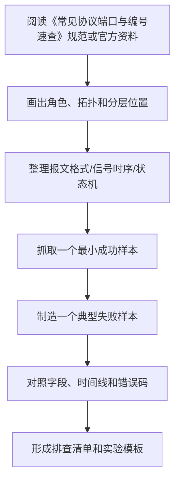

# 常见协议端口与编号速查

<!-- lecture-notes:integrated-v2 -->

## 讲义导读：按分层、字段和时序读协议

这一章讲的是 **常见协议端口与编号速查**，属于 **协议学习路线与排查**。学习协议时，不要只背“它是什么协议、默认端口是多少”，而要把它当成一份双方共同遵守的通信合同：谁先说话，说什么格式，字段怎么解释，什么时候确认，什么时候重传，出错时返回什么，版本升级时怎样保持兼容。

### 一句话先懂

路线类章节要先建立分层地图：看到一个通信问题时，能判断它是物理链路、寻址、路由、传输、加密、编码还是应用语义的问题。

初学时先问三个问题：它处在哪一层，解决哪一段通信问题；它的最小报文长什么样；一次正常交互和一次失败交互分别是什么时序。

### 通俗类比

协议像交通规则：车可以来自不同厂家，司机也互不认识，但只要大家遵守车道、红绿灯、标志和事故处理规则，道路就能运转。

类比只是入口。真正排查协议问题时，要回到报文字段、状态机、时序图、错误码、注册编号、协商参数、抓包证据和官方规范上。

### 本章学习主线

1. **先定位分层**：这是物理信号、链路帧、网络寻址、传输连接、加密编码，还是应用语义？
2. **再看参与角色**：谁是主站/从站、客户端/服务端、发布者/订阅者、请求方/响应方？
3. **然后拆报文格式**：固定头、长度、类型、地址、序号、标志位、负载、校验和扩展字段分别做什么？
4. **接着画时序和状态机**：建立、协商、传输、确认、异常、重试、关闭分别在哪些报文里体现？
5. **最后抓包验证**：用工具捕获真实通信，把每个关键字段和标准文档对应起来。

### 本章重点抓手

OSI/TCP-IP 分层、常见协议族、编号注册表、抓包过滤、时序图、故障定位路径和证据记录。

### 最小实践任务

选一次 HTTP 访问，从 DNS、TCP/TLS、HTTP 到响应缓存完整抓包，并标出每一层的关键证据。

建议每次学习协议都写一页“协议卡片”：分层位置、典型端口/速率、参与角色、核心字段、正常时序、异常时序、常见抓包过滤条件、官方标准来源。这样以后排查问题时，可以从证据回到规则，而不是凭印象猜。

### 常见误区

- 只背端口号或字段名，不看完整交互时序。
- 把不同层的问题混在一起，例如 DNS、TCP、TLS、HTTP 一起背锅。
- 不抓包、不看标准，只靠经验猜协议行为。

### 推荐观察工具

Wireshark、tcpdump、tshark、curl、openssl、dig/nslookup、ping/traceroute、ss/netstat、串口/逻辑分析仪、协议官方测试工具。

### 读完本章应该能做到

- 说明本协议处在哪一层，以及它不负责哪些事情。
- 画出一次最小正常交互的时序图，并标出关键字段。
- 解释一个失败场景的错误码、超时、重试或状态转换。
- 用抓包、串口日志、逻辑分析仪或官方工具拿到可验证证据。

> 本节是讲义化改写后的阅读入口。后续正文中的字段表、流程图、命令和参考资料，都应围绕“分层定位 + 报文字段 + 时序状态 + 抓包验证”来理解。

最后整理：2026-06-14

Last researched：2026-06-14

端口号、协议号、EtherType、IP 协议号、DNS 记录类型、HTTP 状态码这些编号不是用来死记的，而是抓包、排查、防火墙配置、日志分析时快速定位问题的索引。本篇整理常见编号，并标出它们属于哪一层。

## 学习目标

- 区分 TCP/UDP 端口、IP Protocol Number、EtherType、DNS Type、HTTP Status Code。
- 知道常见服务默认端口和抓包过滤方式。
- 能看懂 Wireshark、日志、防火墙规则中的协议编号。
- 避免把“端口号”和“协议号”混淆。

## 编号类型总览

| 编号类型 | 所属层次 | 例子 | 用途 |
|---|---|---|---|
| EtherType | 数据链路层 | IPv4 `0x0800`、ARP `0x0806`、IPv6 `0x86DD` | 以太网帧中标识上层协议 |
| IP Protocol Number / IPv6 Next Header | 网络层 | TCP `6`、UDP `17`、ICMP `1` | IP 包中标识上层协议 |
| TCP/UDP Port | 传输层 | HTTP `80`、HTTPS `443`、DNS `53` | 标识主机上的应用服务 |
| ICMP Type/Code | 网络层控制消息 | Echo Request `8`、Destination Unreachable `3` | 表达网络控制和错误 |
| DNS RR Type | 应用层 | A `1`、AAAA `28`、CNAME `5` | 标识 DNS 记录类型 |
| HTTP Status Code | 应用层 | `200`、`404`、`502` | 表达 HTTP 响应结果 |
| Modbus Function Code | 应用层/工业协议 | `03`、`06`、`10` | 表达寄存器读写命令 |

## 常见 TCP/UDP 端口

| 端口 | TCP/UDP | 协议 | 用途 | 抓包过滤 |
|---:|---|---|---|---|
| 20 | TCP | FTP Data | FTP 主动模式数据连接 | `tcp.port == 20` |
| 21 | TCP | FTP Control | FTP 控制连接 | `tcp.port == 21` |
| 22 | TCP | SSH/SFTP/SCP | 安全远程登录和文件传输 | `tcp.port == 22` |
| 23 | TCP | Telnet | 明文远程登录，已不推荐 | `tcp.port == 23` |
| 25 | TCP | SMTP | 邮件投递 | `tcp.port == 25` |
| 53 | UDP/TCP | DNS | 域名解析 | `dns || port 53` |
| 67/68 | UDP | DHCPv4 | 地址分配 | `dhcp` |
| 80 | TCP | HTTP | 明文 Web | `http || tcp.port == 80` |
| 110 | TCP | POP3 | 邮件接收 | `tcp.port == 110` |
| 123 | UDP | NTP | 时间同步 | `udp.port == 123` |
| 143 | TCP | IMAP | 邮件接收 | `tcp.port == 143` |
| 161/162 | UDP | SNMP | 网络设备管理/Trap | `udp.port == 161 || udp.port == 162` |
| 389 | TCP/UDP | LDAP | 目录服务 | `tcp.port == 389 || udp.port == 389` |
| 443 | TCP | HTTPS | HTTP over TLS | `tcp.port == 443 && tls` |
| 443 | UDP | HTTP/3/QUIC | HTTP over QUIC | `udp.port == 443 || quic` |
| 465 | TCP | SMTPS | SMTP over implicit TLS | `tcp.port == 465` |
| 502 | TCP | Modbus TCP | 工业寄存器读写 | `modbus || tcp.port == 502` |
| 514 | UDP/TCP | Syslog | 日志收集 | `port 514` |
| 587 | TCP | SMTP Submission | 邮件客户端提交 | `tcp.port == 587` |
| 636 | TCP | LDAPS | LDAP over TLS | `tcp.port == 636` |
| 993 | TCP | IMAPS | IMAP over TLS | `tcp.port == 993` |
| 995 | TCP | POP3S | POP3 over TLS | `tcp.port == 995` |
| 1883 | TCP | MQTT | IoT 消息协议 | `tcp.port == 1883` |
| 3306 | TCP | MySQL | 数据库 | `tcp.port == 3306` |
| 3389 | TCP/UDP | RDP | Windows 远程桌面 | `tcp.port == 3389 || udp.port == 3389` |
| 5432 | TCP | PostgreSQL | 数据库 | `tcp.port == 5432` |
| 5672 | TCP | AMQP | RabbitMQ 等消息队列 | `tcp.port == 5672` |
| 6379 | TCP | Redis | 缓存数据库 | `tcp.port == 6379` |
| 8080 | TCP | HTTP Alternate | 常见 Web 备用端口 | `tcp.port == 8080` |
| 8443 | TCP | HTTPS Alternate | 常见 HTTPS 备用端口 | `tcp.port == 8443` |
| 8883 | TCP | MQTT over TLS | IoT 安全连接 | `tcp.port == 8883` |
| 9092 | TCP | Kafka | 消息队列 | `tcp.port == 9092` |

注意：

- 端口只是约定，不是强制。任意服务都可以配置到非默认端口。
- 防火墙规则要同时考虑协议类型：TCP 53 和 UDP 53 都可能用于 DNS。
- QUIC/HTTP/3 走 UDP 443，不是 TCP 443。

## 常见 EtherType

| EtherType | 协议 | 说明 |
|---|---|---|
| `0x0800` | IPv4 | IPv4 数据包 |
| `0x0806` | ARP | IPv4 地址解析 |
| `0x8100` | 802.1Q VLAN | VLAN 标签 |
| `0x86DD` | IPv6 | IPv6 数据包 |
| `0x8847` | MPLS Unicast | MPLS 单播 |
| `0x8863` | PPPoE Discovery | PPPoE 发现阶段 |
| `0x8864` | PPPoE Session | PPPoE 会话阶段 |
| `0x88A8` | 802.1ad QinQ | Provider Bridging |

Wireshark 过滤示例：

```text
eth.type == 0x0806
eth.type == 0x86dd
vlan
```

## 常见 IP Protocol Number

| 编号 | 协议 | 说明 |
|---:|---|---|
| 1 | ICMP | IPv4 控制消息 |
| 2 | IGMP | IPv4 组播管理 |
| 6 | TCP | 可靠字节流传输 |
| 17 | UDP | 无连接数据报 |
| 41 | IPv6 | IPv6 封装 |
| 47 | GRE | 通用路由封装 |
| 50 | ESP | IPsec 封装安全载荷 |
| 51 | AH | IPsec 认证头 |
| 58 | ICMPv6 | IPv6 控制消息 |
| 132 | SCTP | 流控制传输协议 |

Wireshark 过滤示例：

```text
ip.proto == 6
ip.proto == 17
ip.proto == 50
```

## 常见 DNS 记录类型

| 类型 | 编号 | 含义 | 用途 |
|---|---:|---|---|
| A | 1 | 域名到 IPv4 | `example.com -> 93.184.216.34` |
| NS | 2 | 权威 DNS 服务器 | 域名委派 |
| CNAME | 5 | 别名 | CDN、服务别名 |
| SOA | 6 | 授权起始记录 | 区域元信息 |
| PTR | 12 | 反向解析 | IP 到域名 |
| MX | 15 | 邮件交换 | 邮件投递 |
| TXT | 16 | 文本记录 | SPF、DKIM、验证 |
| AAAA | 28 | 域名到 IPv6 | IPv6 地址 |
| SRV | 33 | 服务定位 | SIP、LDAP、Kubernetes 等 |
| CAA | 257 | 证书颁发授权 | 限制 CA 签发证书 |

## HTTP 状态码速查

| 范围 | 含义 | 常见状态 |
|---|---|---|
| 1xx | 信息响应 | `100 Continue`、`101 Switching Protocols` |
| 2xx | 成功 | `200 OK`、`201 Created`、`204 No Content` |
| 3xx | 重定向 | `301`、`302`、`304 Not Modified`、`307`、`308` |
| 4xx | 客户端错误 | `400`、`401`、`403`、`404`、`409`、`429` |
| 5xx | 服务端错误 | `500`、`502`、`503`、`504` |

常见判断：

- `400`：请求格式、参数或协议语义错误。
- `401`：没有认证或认证失败。
- `403`：认证了但没有权限，或被策略拒绝。
- `404`：资源或路由不存在。
- `409`：资源状态冲突。
- `429`：限流。
- `502`：网关从上游收到无效响应。
- `503`：服务不可用或维护。
- `504`：网关等上游超时。

## 常见 Modbus 功能码

| 功能码 | 名称 | 用途 |
|---:|---|---|
| `01` | Read Coils | 读线圈 |
| `02` | Read Discrete Inputs | 读离散输入 |
| `03` | Read Holding Registers | 读保持寄存器 |
| `04` | Read Input Registers | 读输入寄存器 |
| `05` | Write Single Coil | 写单个线圈 |
| `06` | Write Single Register | 写单个寄存器 |
| `0F` | Write Multiple Coils | 写多个线圈 |
| `10` | Write Multiple Registers | 写多个寄存器 |

异常响应规律：

```text
异常功能码 = 原功能码 + 0x80
例如 0x03 异常响应为 0x83
```

## 常见 ICMP 类型

| ICMPv4 Type | 名称 | 用途 |
|---:|---|---|
| 0 | Echo Reply | ping 响应 |
| 3 | Destination Unreachable | 目标不可达 |
| 5 | Redirect | 重定向 |
| 8 | Echo Request | ping 请求 |
| 11 | Time Exceeded | TTL 超时，traceroute 常用 |

ICMPv6 中邻居发现、路由器通告等能力也由 ICMPv6 承载，不能简单粗暴全部屏蔽。

## 2026 协议资料与抓包核对补充

协议类笔记建议按“官方规范 + 注册表 + 真实报文”三层核对。

- **互联网协议**：RFC Editor 和 IETF Datatracker 是 HTTP、TCP、UDP、QUIC、IP、ICMP、DNS、TLS 相关 RFC 的首选来源；IANA 注册表用于核对端口号、协议号、媒体类型和参数编号。
- **局域网与物理链路**：以太网看 IEEE 802.3，Wi-Fi 看 IEEE 802.11 与 Wi-Fi Alliance，USB/Type-C 看 USB-IF，具体芯片实现还要看数据手册和一致性测试要求。
- **工业协议**：MQTT 看 OASIS 标准，OPC UA 看 OPC Foundation 在线规范，CANopen 看 CiA，Modbus 看 Modbus Organization，EtherCAT 看 EtherCAT Technology Group，PROFIBUS/PROFINET 看 PI，IO-Link 看 IO-Link Community。
- **排查方法**：互联网协议优先查 RFC Editor/IETF Datatracker 和 IANA 注册表；链路/物理协议查 IEEE、USB-IF、Wi-Fi Alliance 或行业组织；工业协议查对应基金会或联盟规范。 不要只看教程截图；至少保留一次真实抓包、串口日志或逻辑分析仪波形。
- **版本意识**：协议规范会演进，字段含义、注册编号、加密套件、浏览器/系统默认行为都可能变化；写笔记时要标明参考版本和抓包环境。

通俗地说，规范告诉你“规则怎么写”，注册表告诉你“编号归谁用”，抓包告诉你“现场到底发生了什么”。三者能对上，协议才算学扎实。

参考资料：

- RFC Editor：https://www.rfc-editor.org/
- IETF Datatracker：https://datatracker.ietf.org/
- IANA Protocol Registries：https://www.iana.org/protocols
- IANA Service Name and Transport Protocol Port Number Registry：https://www.iana.org/assignments/service-names-port-numbers
- IEEE 802.3 Ethernet：https://www.ieee802.org/3/
- IEEE 802.11 Working Group：https://www.ieee802.org/11/
- USB-IF Document Library：https://www.usb.org/documents
- OASIS MQTT Version 5.0：https://www.oasis-open.org/standard/mqtt-v5-0-os/
- OPC Foundation Online Reference：https://reference.opcfoundation.org/
- CAN in Automation CANopen：https://www.can-cia.org/can-knowledge/canopen
- Modbus Specifications：https://www.modbus.org/modbus-specifications
- EtherCAT Technology Group：https://www.ethercat.org/
- PROFIBUS & PROFINET International：https://www.profibus.com/
- IO-Link Downloads：https://io-link.com/downloads
## 参考资料

- [Official - IANA Service Name and Transport Protocol Port Number Registry](https://www.iana.org/assignments/service-names-port-numbers/service-names-port-numbers.xhtml)
- [Official - IANA Protocol Numbers](https://www.iana.org/assignments/protocol-numbers/protocol-numbers.xhtml)
- [Official - IANA IEEE 802 Numbers](https://www.iana.org/assignments/ieee-802-numbers/ieee-802-numbers.xhtml)
- [Official - IANA DNS Parameters](https://www.iana.org/assignments/dns-parameters/dns-parameters.xhtml)
- [Official - MDN HTTP response status codes](https://developer.mozilla.org/en-US/docs/Web/HTTP/Reference/Status)
- [Official - Modbus specifications](https://www.modbus.org/specs.php)

---

## 万字精讲扩展（2026-06-16 更新）
> Last researched: 2026-06-16。本文补充内容以协议规范、RFC、标准组织资料和抓包排查实践为主；具体设备、芯片、操作系统、网关和库实现可能存在差异，真实项目中应继续核对对应版本手册和现场抓包。

### 本章在协议学习路线中的位置

《常见协议端口与编号速查》是协议体系中的一个观察点。学习它时不要只问“它是什么”，还要问它处在哪一层、解决什么互操作问题、依赖什么下层能力、给上层提供什么语义、正常流程如何推进、异常流程如何终止。协议学习的最终目标不是背标准号，而是在真实系统中定位问题：线缆是否可靠，帧是否完整，地址是否正确，路由是否可达，连接是否建立，握手是否成功，业务字段是否被双方一致理解。

本章学习完成后，至少应达到三个标准。第一，能画出最小拓扑和分层位置。第二，能解释关键报文字段、状态机或信号时序。第三，能设计一个抓包或测量实验，把正常样本和失败样本对比出来。只要这三个标准完成，这篇笔记就能用于工程排查，而不仅是概念复习。

### 总览和速查类笔记的精讲重点

总览类笔记的价值在于建立协议地图，而不是替代每个协议规范。端口号、协议号、Ethertype、功能码、报文类型、错误码都适合做速查，但速查表必须标明来源和适用范围。端口号只是默认约定，不等于服务一定开放；协议号只说明 IP 载荷类型，不说明应用语义；工业协议的站号、功能码、对象字典、节点 ID、寄存器地址和数据类型需要结合具体设备手册解释。

学习路线应从可观察性开始。先会用 Wireshark、tcpdump、串口工具、逻辑分析仪或示波器看见报文，再学习字段含义。协议排查不是背答案，而是把“现象、拓扑、报文、状态、配置、设备日志”串起来。总览笔记应给每一类协议标出常用工具、典型故障和下一步深挖资料。

### 协议学习的底层方法：先分层，再看报文，再看状态机

协议学习最常见的错误，是把协议当成一串术语和端口号背诵。真正能用于工程排查的学习方式，应同时抓住四个维度：分层位置、报文格式、状态机和错误处理。分层位置回答“这个协议依赖谁、服务谁”；报文格式回答“线上实际传了哪些字段”；状态机回答“双方如何从开始到结束推进”；错误处理回答“超时、重传、乱序、丢包、校验失败、权限失败、版本不兼容时应该怎样表现”。只有这四个维度都清楚，遇到抓包、串口波形、日志或现场问题时才不会只凭感觉判断。

学习任何协议时，都建议先画一个最小通信链路。物理层协议要画电平、线缆、连接器、阻抗、端接、拓扑和速率；链路层协议要画帧边界、地址、校验、仲裁和介质访问；网络层协议要画寻址、路由、分片、MTU、错误反馈和安全封装；传输层协议要画连接、端口、可靠性、流控、拥塞、保活和关闭；应用层协议要画请求响应、会话、认证、编码、版本协商和业务语义。这个图比单纯背“它属于第几层”更有价值。

### 抓包和排查闭环


Figure: 协议排查闭环，综合 IETF RFC、USB/NXP/Modbus/OASIS/OPC/IEEE 等规范和 Wireshark/tcpdump 实践资料整理。

排查时不要只看单个包。很多协议问题只有放在时序里才成立：TCP 三次握手是否完成，TLS 握手在哪一步失败，DNS 是否有重传或返回错误码，HTTP 是否被代理或缓存影响，Modbus 是否功能码和寄存器地址不匹配，RS-485 是否方向控制或终端电阻错误，CAN 是否仲裁失败或错误帧增加，MQTT 是否 Keep Alive 超时，OPC UA 是否安全策略或证书不匹配。单包解释字段，多包解释状态机。

### 报文字段要和工程现象绑定

协议字段不是孤立名词。长度字段错误可能导致粘包拆包失败；校验字段错误可能说明线路干扰、字节序错误或帧边界错；序列号和确认号异常可能指向丢包、重传、乱序或中间设备干预；TTL/Hop Limit 异常可能说明路由环路或路径变化；MSS/MTU 不匹配可能造成黑洞；TLS Alert 可以直接提示证书、版本、密码套件或应用协议协商问题；HTTP 状态码要结合方法、缓存、代理和服务端日志解释。学习时每个字段都应该写“它异常时会看到什么”。

### 规范、实现和现场三者要分开

协议规范说明应该如何互操作，实现代码说明某个库或设备实际怎么做，现场抓包说明这一刻真实发生了什么。三者可能不完全一致：旧设备可能只支持旧版本，厂商实现可能有扩展字段，中间盒可能改写报文，NAT/防火墙/代理可能改变连接行为，串口网关可能改变时序，工业现场线缆和接地可能影响物理层。工程判断应优先以规范为语义基准，以抓包和测量为事实依据，以实现文档解释具体差异。

### 核心知识点逐条精讲

#### 1. 常见协议端口与编号速查 的协议定位

在《常见协议端口与编号速查》中，`常见协议端口与编号速查 的协议定位` 必须同时落到规范、报文和现场现象三层。规范层回答这个协议被设计来解决什么问题，依赖哪些下层能力，向上提供哪些语义；报文层回答字段如何编码、长度如何确定、状态如何推进、错误如何表达；现场层回答当线路、设备、软件、配置或中间网络异常时，会在日志、抓包、波形或业务行为上看到什么。只知道概念而看不懂报文，排查时会缺少证据；只会看字段而不知道状态机，也容易把正常重传、协商或错误响应误判成故障。

学习 `常见协议端口与编号速查 的协议定位` 时建议固定写五项：第一，通信双方角色和拓扑；第二，最小成功流程；第三，关键字段或信号；第四，常见失败流程；第五，验证工具。比如网络协议要写 Wireshark display filter、tcpdump 命令、端口和状态码；串行和总线协议要写逻辑分析仪通道、波特率/时钟、采样设置、字节序和校验；工业协议要写站号、对象字典、寄存器地址、功能码、设备配置和网关映射。这样笔记会直接服务排查，而不是只能复习概念。

工程上要特别警惕“协议名相同但实现差异很大”。同一个 `常见协议端口与编号速查` 在不同设备、系统版本、库版本、网关或厂商扩展中，可能在超时、重试、字节序、字段可选性、安全策略、错误码、最大报文长度、默认端口和兼容模式上存在差异。规范给出互操作底线，设备手册给出实现约束，抓包和测量给出现场事实。三者互相校验，才能得到可靠结论。

#### 2. 分层定位

在《常见协议端口与编号速查》中，`分层定位` 必须同时落到规范、报文和现场现象三层。规范层回答这个协议被设计来解决什么问题，依赖哪些下层能力，向上提供哪些语义；报文层回答字段如何编码、长度如何确定、状态如何推进、错误如何表达；现场层回答当线路、设备、软件、配置或中间网络异常时，会在日志、抓包、波形或业务行为上看到什么。只知道概念而看不懂报文，排查时会缺少证据；只会看字段而不知道状态机，也容易把正常重传、协商或错误响应误判成故障。

学习 `分层定位` 时建议固定写五项：第一，通信双方角色和拓扑；第二，最小成功流程；第三，关键字段或信号；第四，常见失败流程；第五，验证工具。比如网络协议要写 Wireshark display filter、tcpdump 命令、端口和状态码；串行和总线协议要写逻辑分析仪通道、波特率/时钟、采样设置、字节序和校验；工业协议要写站号、对象字典、寄存器地址、功能码、设备配置和网关映射。这样笔记会直接服务排查，而不是只能复习概念。

工程上要特别警惕“协议名相同但实现差异很大”。同一个 `常见协议端口与编号速查` 在不同设备、系统版本、库版本、网关或厂商扩展中，可能在超时、重试、字节序、字段可选性、安全策略、错误码、最大报文长度、默认端口和兼容模式上存在差异。规范给出互操作底线，设备手册给出实现约束，抓包和测量给出现场事实。三者互相校验，才能得到可靠结论。

#### 3. 编号、端口和注册表

在《常见协议端口与编号速查》中，`编号、端口和注册表` 必须同时落到规范、报文和现场现象三层。规范层回答这个协议被设计来解决什么问题，依赖哪些下层能力，向上提供哪些语义；报文层回答字段如何编码、长度如何确定、状态如何推进、错误如何表达；现场层回答当线路、设备、软件、配置或中间网络异常时，会在日志、抓包、波形或业务行为上看到什么。只知道概念而看不懂报文，排查时会缺少证据；只会看字段而不知道状态机，也容易把正常重传、协商或错误响应误判成故障。

学习 `编号、端口和注册表` 时建议固定写五项：第一，通信双方角色和拓扑；第二，最小成功流程；第三，关键字段或信号；第四，常见失败流程；第五，验证工具。比如网络协议要写 Wireshark display filter、tcpdump 命令、端口和状态码；串行和总线协议要写逻辑分析仪通道、波特率/时钟、采样设置、字节序和校验；工业协议要写站号、对象字典、寄存器地址、功能码、设备配置和网关映射。这样笔记会直接服务排查，而不是只能复习概念。

工程上要特别警惕“协议名相同但实现差异很大”。同一个 `常见协议端口与编号速查` 在不同设备、系统版本、库版本、网关或厂商扩展中，可能在超时、重试、字节序、字段可选性、安全策略、错误码、最大报文长度、默认端口和兼容模式上存在差异。规范给出互操作底线，设备手册给出实现约束，抓包和测量给出现场事实。三者互相校验，才能得到可靠结论。

#### 4. 抓包方法

在《常见协议端口与编号速查》中，`抓包方法` 必须同时落到规范、报文和现场现象三层。规范层回答这个协议被设计来解决什么问题，依赖哪些下层能力，向上提供哪些语义；报文层回答字段如何编码、长度如何确定、状态如何推进、错误如何表达；现场层回答当线路、设备、软件、配置或中间网络异常时，会在日志、抓包、波形或业务行为上看到什么。只知道概念而看不懂报文，排查时会缺少证据；只会看字段而不知道状态机，也容易把正常重传、协商或错误响应误判成故障。

学习 `抓包方法` 时建议固定写五项：第一，通信双方角色和拓扑；第二，最小成功流程；第三，关键字段或信号；第四，常见失败流程；第五，验证工具。比如网络协议要写 Wireshark display filter、tcpdump 命令、端口和状态码；串行和总线协议要写逻辑分析仪通道、波特率/时钟、采样设置、字节序和校验；工业协议要写站号、对象字典、寄存器地址、功能码、设备配置和网关映射。这样笔记会直接服务排查，而不是只能复习概念。

工程上要特别警惕“协议名相同但实现差异很大”。同一个 `常见协议端口与编号速查` 在不同设备、系统版本、库版本、网关或厂商扩展中，可能在超时、重试、字节序、字段可选性、安全策略、错误码、最大报文长度、默认端口和兼容模式上存在差异。规范给出互操作底线，设备手册给出实现约束，抓包和测量给出现场事实。三者互相校验，才能得到可靠结论。

#### 5. 常见故障模式

在《常见协议端口与编号速查》中，`常见故障模式` 必须同时落到规范、报文和现场现象三层。规范层回答这个协议被设计来解决什么问题，依赖哪些下层能力，向上提供哪些语义；报文层回答字段如何编码、长度如何确定、状态如何推进、错误如何表达；现场层回答当线路、设备、软件、配置或中间网络异常时，会在日志、抓包、波形或业务行为上看到什么。只知道概念而看不懂报文，排查时会缺少证据；只会看字段而不知道状态机，也容易把正常重传、协商或错误响应误判成故障。

学习 `常见故障模式` 时建议固定写五项：第一，通信双方角色和拓扑；第二，最小成功流程；第三，关键字段或信号；第四，常见失败流程；第五，验证工具。比如网络协议要写 Wireshark display filter、tcpdump 命令、端口和状态码；串行和总线协议要写逻辑分析仪通道、波特率/时钟、采样设置、字节序和校验；工业协议要写站号、对象字典、寄存器地址、功能码、设备配置和网关映射。这样笔记会直接服务排查，而不是只能复习概念。

工程上要特别警惕“协议名相同但实现差异很大”。同一个 `常见协议端口与编号速查` 在不同设备、系统版本、库版本、网关或厂商扩展中，可能在超时、重试、字节序、字段可选性、安全策略、错误码、最大报文长度、默认端口和兼容模式上存在差异。规范给出互操作底线，设备手册给出实现约束，抓包和测量给出现场事实。三者互相校验，才能得到可靠结论。


### 场景化学习与排错表

| 主题 | 推荐动作 | 常见风险 | 验证方式 |
| :--- | :--- | :--- | :--- |
| 常见协议端口与编号速查 的协议定位 | 先查规范和设备手册，再抓取最小成功/失败样本，最后写成排查规则 | 只背概念、不看报文；只看单包、不看状态机；忽略版本和设备差异 | Wireshark/tcpdump/串口日志/逻辑分析仪/示波器/设备日志/最小复现实验 |
| 分层定位 | 先查规范和设备手册，再抓取最小成功/失败样本，最后写成排查规则 | 只背概念、不看报文；只看单包、不看状态机；忽略版本和设备差异 | Wireshark/tcpdump/串口日志/逻辑分析仪/示波器/设备日志/最小复现实验 |
| 编号、端口和注册表 | 先查规范和设备手册，再抓取最小成功/失败样本，最后写成排查规则 | 只背概念、不看报文；只看单包、不看状态机；忽略版本和设备差异 | Wireshark/tcpdump/串口日志/逻辑分析仪/示波器/设备日志/最小复现实验 |
| 抓包方法 | 先查规范和设备手册，再抓取最小成功/失败样本，最后写成排查规则 | 只背概念、不看报文；只看单包、不看状态机；忽略版本和设备差异 | Wireshark/tcpdump/串口日志/逻辑分析仪/示波器/设备日志/最小复现实验 |
| 常见故障模式 | 先查规范和设备手册，再抓取最小成功/失败样本，最后写成排查规则 | 只背概念、不看报文；只看单包、不看状态机；忽略版本和设备差异 | Wireshark/tcpdump/串口日志/逻辑分析仪/示波器/设备日志/最小复现实验 |

这张表的重点是把协议知识变成可验证动作。协议问题通常不是一句“网络不通”或“设备不兼容”能解释的，而是需要把拓扑、配置、报文、状态机、时间线和错误码拼在一起。每次排查结束，都应把最终规则写回笔记，例如某设备的超时时间、某网关的字节序、某协议栈的版本限制或某端口在防火墙上的放行条件。

### 本章建议工作流



Figure: 《常见协议端口与编号速查》学习工作流，综合 RFC、USB-IF、NXP、Modbus、OASIS、OPC Foundation、IEEE、Wireshark/tcpdump 等资料整理。

这个流程强调“成功样本”和“失败样本”都要保留。只保存成功样本，现场出问题时没有对照；只看失败样本，容易不知道正常状态机应该长什么样。对协议学习者来说，一组高质量抓包、串口日志或波形截图，比一段泛泛解释更能积累经验。

### 常见误区和纠正方法

- 误区：只背 OSI 层级。纠正：层级只是定位工具，必须继续看报文格式、状态机、错误码和现场证据。
- 误区：端口通就认为协议通。纠正：端口可达只说明传输层可能可达，应用层认证、版本、功能码、证书、权限和业务字段仍可能失败。
- 误区：只抓客户端或只抓服务端。纠正：复杂问题要尽量在两端或关键中间点同时取证，尤其是 NAT、代理、网关、交换机和串口转换器场景。
- 误区：忽略时间。纠正：超时、重试、保活、退避、握手和关闭都依赖时间线；协议排查要看相对时间和间隔。
- 误区：把社区文章当规范。纠正：社区经验适合发现常见坑，语义和字段定义应回到 RFC、标准组织文档、厂商手册和抓包事实。
- 误区：只保存结论，不保存样本。纠正：保留 pcap、串口日志、波形、配置和版本信息，后续才能复盘和对比。

### 与相邻协议的关系

《常见协议端口与编号速查》通常不是单独工作的。物理层问题会让链路层帧错误增加，链路层地址或校验错误会影响网络层可达性，网络层 MTU/NAT/路由会影响传输层连接，传输层超时和重传会影响应用层表现，表示层编码和 TLS 会影响应用层解析。排查时要从现象所在层向下验证承载是否正常，再向上验证语义是否正确。不要在没有证据的情况下跨层猜测。

### 实操训练和复盘模板

1. 围绕 `常见协议端口与编号速查 的协议定位` 做一次最小实验：记录拓扑、配置、成功样本、失败样本、字段解释和最终结论。
2. 围绕 `分层定位` 做一次最小实验：记录拓扑、配置、成功样本、失败样本、字段解释和最终结论。
3. 围绕 `编号、端口和注册表` 做一次最小实验：记录拓扑、配置、成功样本、失败样本、字段解释和最终结论。
4. 围绕 `抓包方法` 做一次最小实验：记录拓扑、配置、成功样本、失败样本、字段解释和最终结论。
5. 围绕 `常见故障模式` 做一次最小实验：记录拓扑、配置、成功样本、失败样本、字段解释和最终结论。

建议每篇协议笔记都维护下面的复盘格式：

```text
实验名称：
协议主题：常见协议端口与编号速查
设备/软件/版本：
拓扑：客户端、服务端、网关、交换机、线缆、总线节点
关键配置：端口、地址、速率、校验、证书、账号、功能码、寄存器、topic 等
成功样本：抓包文件、串口日志、波形或设备日志位置
失败样本：如何复现，错误码或异常现象
字段解释：哪些字段证明状态机走到哪一步
根因判断：线路/配置/协议栈/版本/权限/业务数据/中间设备
修复动作：
回归验证：
以后检查规则：
```

这个模板能避免“凭经验说可能是某某问题”。协议排查必须留下证据链：现象是什么、哪一层开始异常、哪个字段证明异常、哪个实验排除了其他可能。长期积累后，这些复盘会比零散教程更有价值。

## 参考资料与延伸阅读

- [IETF / RFC] RFC 791 - Internet Protocol IPv4: https://datatracker.ietf.org/doc/html/rfc791
- [IETF / RFC] RFC 8200 - Internet Protocol Version 6 IPv6: https://www.rfc-editor.org/info/rfc8200
- [IETF / RFC] RFC 826 - Address Resolution Protocol ARP: https://datatracker.ietf.org/doc/html/rfc826
- [IETF / RFC] RFC 792 - Internet Control Message Protocol ICMP: https://datatracker.ietf.org/doc/html/rfc792
- [IETF / RFC] RFC 4443 - ICMPv6: https://datatracker.ietf.org/doc/html/rfc4443
- [IETF / RFC] RFC 768 - User Datagram Protocol UDP: https://datatracker.ietf.org/doc/html/rfc768
- [IETF / RFC] RFC 9293 - Transmission Control Protocol TCP: https://datatracker.ietf.org/doc/rfc9293/
- [IETF / RFC] RFC 9000 - QUIC: A UDP-Based Multiplexed and Secure Transport: https://datatracker.ietf.org/doc/rfc9000/
- [IETF / RFC] RFC 8446 - TLS 1.3: https://www.rfc-editor.org/info/rfc8446/
- [IETF / RFC] RFC 9110 - HTTP Semantics: https://www.rfc-editor.org/rfc/rfc9110.html
- [IETF / RFC] RFC 9111 - HTTP Caching: https://www.rfc-editor.org/rfc/rfc9111.html
- [IETF / RFC] RFC 9112 - HTTP/1.1: https://www.rfc-editor.org/rfc/rfc9112.html
- [IETF / RFC] RFC 6455 - The WebSocket Protocol: https://datatracker.ietf.org/doc/html/rfc6455
- [IETF / RFC] RFC 1034 - Domain Names Concepts and Facilities: https://www.rfc-editor.org/info/rfc1034/
- [IETF / RFC] RFC 1035 - Domain Names Implementation and Specification: https://datatracker.ietf.org/doc/html/rfc1035
- [IETF / RFC] RFC 2131 - Dynamic Host Configuration Protocol DHCP: https://datatracker.ietf.org/doc/html/rfc2131
- [IETF / RFC] RFC 5321 - Simple Mail Transfer Protocol SMTP: https://datatracker.ietf.org/doc/rfc5321/
- [IETF / RFC] RFC 959 - File Transfer Protocol FTP: https://datatracker.ietf.org/doc/html/rfc959
- [IETF / RFC] RFC 2045 - MIME Part One: https://www.ietf.org/rfc/rfc2045.txt
- [IETF / RFC] RFC 2046 - MIME Media Types: https://www.rfc-editor.org/info/rfc2046/
- [IETF / RFC] RFC 1661 - Point-to-Point Protocol PPP: https://datatracker.ietf.org/doc/rfc1661/
- [IETF / RFC] RFC 4301 - Security Architecture for IPsec: https://datatracker.ietf.org/doc/html/rfc4301
- [IETF / RFC] RFC 3022 - Traditional NAT: https://datatracker.ietf.org/doc/html/rfc3022
- [IETF / RFC] RFC 1191 - Path MTU Discovery: https://datatracker.ietf.org/doc/html/rfc1191
- [IETF / RFC] RFC 8201 - Path MTU Discovery for IPv6: https://datatracker.ietf.org/doc/html/rfc8201
- [IETF / RFC] RFC 9260 - Stream Control Transmission Protocol SCTP: https://datatracker.ietf.org/doc/html/rfc9260
- [IETF / RFC] RFC 3261 - SIP Session Initiation Protocol: https://datatracker.ietf.org/doc/html/rfc3261
- [IETF / RFC] RFC 5531 - RPC Remote Procedure Call Protocol Version 2: https://datatracker.ietf.org/doc/html/rfc5531
- [IETF / RFC] RFC 1001 / RFC 1002 - NetBIOS over TCP/IP: https://datatracker.ietf.org/doc/html/rfc1001
- [USB-IF / Spec] USB Document Library: https://www.usb.org/documents
- [USB-IF / Spec] USB 2.0 Specification: https://www.usb.org/document-library/usb-20-specification
- [USB-IF / Spec] USB Type-C Cable and Connector Specification: https://www.usb.org/document-library/usb-type-cr-cable-and-connector-specification-release-24
- [NXP / Spec] I2C-bus specification and user manual UM10204: https://www.nxp.com/documents/user_manual/UM10204.pdf
- [Modbus Organization / Spec] Modbus Specifications: https://www.modbus.org/modbus-specifications
- [OASIS / Standard] MQTT Version 5.0: https://docs.oasis-open.org/mqtt/mqtt/v5.0/mqtt-v5.0.html
- [OPC Foundation / Spec] OPC UA Online Reference: https://reference.opcfoundation.org/
- [OPC Foundation / Overview] OPC Unified Architecture: https://opcfoundation.org/about/opc-technologies/opc-ua/
- [EtherCAT Technology Group / Overview] EtherCAT Technology: https://www.ethercat.org/en/technology.html
- [CAN in Automation / Overview] CANopen: https://www.can-cia.org/can-knowledge/canopen
- [CAN in Automation / Documents] Technical documents: https://www.can-cia.org/cia-groups/technical-documents
- [IO-Link Community / Spec] IO-Link downloads and specifications: https://io-link.com/downloads
- [IO-Link Community / Overview] IO-Link standardized IO technology: https://io-link.com/
- [IEEE / Standard family] IEEE 802.3 Ethernet: https://standards.ieee.org/ieee/802.3/7071/
- [IEEE / Standard family] IEEE 802.11 Wireless LAN: https://standards.ieee.org/ieee/802.11/7028/
- [IEEE / Standard family] IEEE 802.1Q VLAN bridging: https://standards.ieee.org/ieee/802.1Q/6844/
- [IANA / Registry] Service Name and Transport Protocol Port Number Registry: https://www.iana.org/assignments/service-names-port-numbers/service-names-port-numbers.xhtml
- [Wireshark / Docs] Wireshark User's Guide: https://www.wireshark.org/docs/wsug_html_chunked/
- [tcpdump / Docs] tcpdump and libpcap: https://www.tcpdump.org/
- [Community / CSDN] 协议抓包与网络协议学习笔记检索入口: https://so.csdn.net/so/search?q=%E5%8D%8F%E8%AE%AE%20%E6%8A%93%E5%8C%85%20%E5%AD%A6%E4%B9%A0%E7%AC%94%E8%AE%B0
- [Community / 博客园] 网络协议、TCP/IP、工业协议实践检索入口: https://zzk.cnblogs.com/s/blogpost?Keywords=%E7%BD%91%E7%BB%9C%E5%8D%8F%E8%AE%AE%20TCP%20Modbus%20MQTT
- [Community / 掘金] HTTP、TCP、WebSocket、MQTT 实践检索入口: https://juejin.cn/search?query=HTTP%20TCP%20WebSocket%20MQTT%20%E5%8D%8F%E8%AE%AE&type=0
