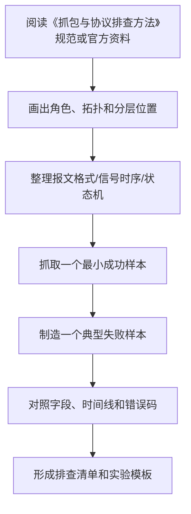

# 抓包与协议排查方法

最后整理：2026-06-14

Last researched：2026-06-14

抓包不是“看到很多包”就结束，而是用证据确认：请求有没有发出、对端有没有回应、在哪一层开始偏离预期、错误是网络造成的还是应用造成的。本篇整理常见工具、过滤表达式、抓包位置、排查路径和典型现象。

## 学习目标

- 知道什么时候用 Wireshark、tcpdump、curl、dig、串口助手、逻辑分析仪、USBView。
- 能根据问题选择正确抓包位置。
- 掌握常用 Wireshark/tcpdump 过滤条件。
- 能初步判断 DNS、TCP、TLS、HTTP、ARP、ICMP、Modbus、USB 等问题。
- 避免抓包中常见误判，例如网卡卸载、NAT、代理、HTTPS 加密、镜像口位置错误。

## 工具选择

| 工具 | 最适合的问题 | 典型命令/用法 |
|---|---|---|
| Wireshark | 图形化分析协议字段、时序、重传、TLS、HTTP/2 | 显示过滤 `tcp.port == 443` |
| tcpdump | 服务器快速抓包、远程环境、低开销留证 | `tcpdump -i eth0 -nn host 8.8.8.8` |
| tshark | 命令行解析 pcap、自动化统计 | `tshark -r a.pcap -Y "dns"` |
| curl | HTTP/TLS/API 快速定位 | `curl -v --http2 https://example.com` |
| dig/nslookup | DNS 解析链路定位 | `dig +trace example.com` |
| ping | ICMP 连通性、RTT、丢包 | `ping 8.8.8.8` |
| traceroute/tracert | 路由路径和中间跳定位 | `tracert example.com` |
| ss/netstat | 本机监听端口和连接状态 | `ss -tanp` |
| ip/route | 地址、路由、邻居表 | `ip addr`、`ip route`、`ip neigh` |
| 串口助手 | UART/RS-232/RS-485/Modbus RTU | 十六进制收发帧 |
| 逻辑分析仪 | UART/I2C/SPI/CAN 时序 | 解码波形、确认采样点 |
| 示波器 | 物理信号质量、电平、边沿、噪声 | 看 D+/D-、A/B、SCL/SDA |
| USBView/lsusb | USB 描述符、驱动、速率 | `lsusb -t`、Windows USBView |
| USB PD 分析仪 | Type-C/PD 协商 | 看 Source Capabilities、Request |

## 抓包位置选择

同一个问题，在不同位置抓到的内容可能完全不同。


| 抓包位置 | 能确认 | 看不到或容易误判 |
|---|---|---|
| 客户端本机 | 应用是否发包、DNS、TCP/TLS 失败点 | NAT 后地址、服务端真实响应路径 |
| 客户端网关 | 客户端是否出网、ARP/VLAN/路由 | 本机应用内部错误 |
| 防火墙/NAT | 是否被策略拦截、地址端口转换 | HTTPS 内部内容 |
| 负载均衡 | 后端选择、连接复用、健康检查 | 客户端本地 DNS 和路由 |
| 服务端本机 | 请求是否到达服务、响应是否发出 | 中间网络是否丢弃响应 |

原则：

- 如果客户端说“发了”，在客户端和服务端两头同时抓。
- 如果服务端说“没收到”，检查中间 NAT、防火墙、路由。
- 如果响应发出但客户端没收到，重点看回程路由、防火墙状态表、MTU、NAT。
- 如果应用日志和抓包矛盾，先确认时间同步和抓包网卡是否正确。

## tcpdump 常用命令

```bash
# 查看网卡
ip link

# 抓某个主机相关流量
tcpdump -i eth0 -nn host 192.168.1.10

# 抓某个端口
tcpdump -i eth0 -nn port 443

# 抓 DNS
tcpdump -i eth0 -nn udp port 53 or tcp port 53

# 抓 ICMP
tcpdump -i eth0 -nn icmp

# 抓 TCP SYN/SYN-ACK/RST/FIN
tcpdump -i eth0 -nn 'tcp[tcpflags] & (tcp-syn|tcp-rst|tcp-fin) != 0'

# 保存 pcap
tcpdump -i eth0 -s 0 -w issue.pcap host 10.0.0.5

# 限制包数量
tcpdump -i eth0 -nn -c 1000 port 80
```

参数说明：

| 参数 | 含义 |
|---|---|
| `-i` | 指定网卡 |
| `-nn` | 不解析主机名和端口名，减少干扰 |
| `-s 0` | 抓完整包 |
| `-w` | 写入 pcap 文件 |
| `-r` | 读取 pcap 文件 |
| `host` | 过滤某个 IP |
| `port` | 过滤端口 |
| `src` / `dst` | 源/目的方向 |

## Wireshark 显示过滤速查

| 目标 | 过滤表达式 |
|---|---|
| 某 IP | `ip.addr == 192.168.1.10` |
| 源 IP | `ip.src == 192.168.1.10` |
| 目的 IP | `ip.dst == 192.168.1.10` |
| TCP 端口 | `tcp.port == 443` |
| UDP 端口 | `udp.port == 53` |
| DNS | `dns` |
| HTTP | `http` |
| TLS | `tls` |
| TCP 重传 | `tcp.analysis.retransmission` |
| TCP RST | `tcp.flags.reset == 1` |
| TCP SYN | `tcp.flags.syn == 1 && tcp.flags.ack == 0` |
| ICMP | `icmp || icmpv6` |
| ARP | `arp` |
| DHCP | `dhcp` |
| QUIC | `quic || udp.port == 443` |
| 某 HTTP Host | `http.host contains "example.com"` |
| TLS SNI | `tls.handshake.extensions_server_name contains "example.com"` |
| Modbus TCP | `modbus || tcp.port == 502` |

注意：

- 捕获过滤和显示过滤语法不同。tcpdump/BPF 是捕获过滤；Wireshark 显示过滤是另一套语法。
- HTTPS 加密后看不到 HTTP 内容，但通常仍能看到 TCP、TLS 握手、SNI、证书、ALPN 等元信息。
- HTTP/2 和 HTTP/3 的应用内容通常被 TLS 加密，除非有会话密钥日志。

## DNS 排查流程

```bash
nslookup example.com
dig example.com
dig @8.8.8.8 example.com
dig +trace example.com
```

排查点：

| 现象 | 可能原因 |
|---|---|
| 本机解析失败，公共 DNS 正常 | 本地 DNS、企业 DNS、搜索域、缓存问题 |
| A 正常但 AAAA 异常 | IPv6 配置或权威记录问题 |
| `SERVFAIL` | 权威 DNS、DNSSEC、递归解析器问题 |
| `NXDOMAIN` | 域名不存在或拼写错误 |
| 解析到内网 IP | split-horizon DNS、企业内外网解析差异 |
| TTL 很短 | 负载均衡、灰度、故障切换策略 |

Wireshark 过滤：

```text
dns
dns.qry.name contains "example.com"
```

## TCP 排查流程

### 三次握手

```text
Client -> Server: SYN
Server -> Client: SYN, ACK
Client -> Server: ACK
```

| 抓包现象 | 常见判断 |
|---|---|
| 只有 SYN，无 SYN-ACK | 服务端不可达、防火墙丢弃、路由不通 |
| SYN 后收到 RST | 端口未监听、服务拒绝、防火墙主动拒绝 |
| SYN/SYN-ACK/ACK 正常，但应用无响应 | 进入应用层或 TLS 层排查 |
| 大量重传 | 丢包、拥塞、MTU、链路质量问题 |
| 零窗口 | 接收端应用读取慢或缓冲耗尽 |
| RST 中断 | 应用关闭、代理策略、连接复用异常 |

### 常见 TCP 状态

| 状态 | 含义 |
|---|---|
| `LISTEN` | 服务正在监听 |
| `SYN-SENT` | 客户端已发 SYN，等待响应 |
| `SYN-RECV` | 服务端收到 SYN，等待客户端 ACK |
| `ESTABLISHED` | 连接建立 |
| `FIN-WAIT` | 主动关闭后等待对端确认 |
| `TIME-WAIT` | 主动关闭方保留连接状态，防止旧包干扰 |
| `CLOSE-WAIT` | 对端已关闭，本地应用还没关闭 socket |

## TLS/HTTPS 排查流程

```bash
curl -v https://example.com
openssl s_client -connect example.com:443 -servername example.com
```

排查点：

| 现象 | 可能原因 |
|---|---|
| 证书域名不匹配 | SNI 错误、证书配置错、访问了错误域名 |
| 证书过期 | 服务端证书未续期 |
| unknown CA | 客户端缺少根证书、企业代理证书未安装 |
| handshake failure | TLS 版本/密码套件/客户端证书要求不匹配 |
| ALPN 不符合预期 | HTTP/2、HTTP/3 协商问题 |
| TCP 正常但 TLS 超时 | 中间设备拦截、服务端 TLS 栈异常 |

Wireshark 过滤：

```text
tls
tls.handshake.type == 1
tls.alert_message
```

## HTTP/API 排查流程

```bash
curl -v https://api.example.com/path
curl -v -X POST https://api.example.com/path -H "Content-Type: application/json" --data '{"id":1}'
curl --http1.1 -v https://example.com
curl --http2 -v https://example.com
curl -I https://example.com
```

排查点：

| 现象 | 层次 | 可能原因 |
|---|---|---|
| `Could not resolve host` | DNS | 域名解析失败 |
| `Connection refused` | TCP | 端口未监听或被拒绝 |
| `Operation timed out` | 网络/传输 | 丢包、防火墙、服务无响应 |
| `SSL certificate problem` | TLS | 证书链或域名错误 |
| `400` | HTTP/应用 | 请求格式错误 |
| `401/403` | 认证/授权 | token、权限、签名、来源限制 |
| `404` | 路由/资源 | 路径、网关规则、服务版本 |
| `429` | 限流 | QPS、配额、风控 |
| `500/502/503/504` | 服务端/网关 | 后端错误、上游超时、网关不可达 |

## MTU 和分片问题

MTU 问题常表现为“小包正常，大包失败”。

排查方法：

```bash
# Linux：禁止分片并指定 payload 大小
ping -M do -s 1472 8.8.8.8

# Windows：禁止分片并指定 payload 大小
ping -f -l 1472 8.8.8.8
```

以太网常见 MTU 是 1500。IPv4 ICMP payload 1472 加上 20 字节 IP 头和 8 字节 ICMP 头，刚好 1500。VPN、PPPoE、隧道、云网络会降低有效 MTU。

常见现象：

- ping 小包通，大包不通。
- TLS 握手或 HTTP POST 卡住。
- 某些网站能打开，某些打不开。
- VPN 内访问异常。

## 串口和工业协议排查

### UART/RS-485

顺序：

1. 确认 USB 转串口是否枚举。
2. 确认电气类型：TTL、RS-232、RS-485 不能混接。
3. 确认 TX/RX、A/B、GND、终端电阻。
4. 确认波特率、数据位、校验位、停止位。
5. 确认 Modbus 地址、功能码、寄存器地址、CRC。
6. 用逻辑分析仪或示波器确认实际波形。

### Modbus RTU

常见问题：

- 寄存器地址文档是从 1 开始，但报文地址从 0 开始。
- 40001 是文档编号，不等于报文里的 `0x0001`。
- 大小端、字节序、字序导致浮点数异常。
- RTU 帧间隔不够，设备无法识别帧边界。
- RS-485 半双工收发方向切换太慢或太快。

### Modbus TCP

Wireshark 过滤：

```text
tcp.port == 502 || modbus
```

重点看：

- MBAP Transaction ID 是否匹配。
- Unit ID 是否符合网关后面的从站地址。
- Function Code 是否返回异常码。
- TCP 连接是否频繁建立关闭。

## USB 排查

### Linux

```bash
lsusb
lsusb -t
dmesg -w
lsusb -v -d vid:pid
```

### Windows

- 设备管理器；
- USBView；
- 事件查看器；
- USBPcap + Wireshark；
- 厂商驱动工具。

排查分层：

| 层次 | 问题 |
|---|---|
| Type-C/供电 | CC/Rd/Rp、VBUS、PD 协商、线缆是否支持数据 |
| USB 物理层 | D+/D-、SuperSpeed 差分对、速率降级 |
| 枚举 | 描述符读取、Set Address、Set Configuration |
| 驱动 | 类代码、VID/PID、INF、权限 |
| 应用 | 串口号、libusb 权限、协议格式 |

## 抓包常见误区

- 抓错网卡：VPN、容器、虚拟机、无线/有线切换都会增加网卡数量。
- 抓包位置不对：客户端抓不到服务端内部转发，服务端抓不到客户端本地 DNS。
- 只看单向包：需要同时看请求和响应。
- 忽略时间同步：多点抓包必须校准时间。
- 忽略网卡卸载：checksum offload 可能让本机抓包显示 checksum 错误。
- 忽略 NAT：客户端看到的源端口和服务端看到的源端口可能不同。
- 忽略代理：HTTP_PROXY、透明代理、服务网格会改变连接路径。
- 忽略加密：HTTPS、QUIC、SSH 看不到应用明文。
- 忽略重传原因：重传是症状，不一定是根因。
- 忽略应用超时：网络包正常，应用仍可能因为线程池、数据库、锁等待而超时。

## 参考资料

- [Official - Wireshark User's Guide](https://www.wireshark.org/docs/wsug_html_chunked/)
- [Official - Wireshark Display Filter Reference](https://www.wireshark.org/docs/dfref/)
- [Official - tcpdump/libpcap](https://www.tcpdump.org/)
- [Official - curl documentation](https://curl.se/docs/)
- [Official - BIND dig manual](https://bind9.readthedocs.io/en/latest/manpages.html#dig-dns-lookup-utility)
- [Official - Microsoft TCP/IP troubleshooting](https://learn.microsoft.com/en-us/troubleshoot/windows-client/networking/tcpip-connectivity-troubleshooting)
- [Official - Linux iproute2](https://wiki.linuxfoundation.org/networking/iproute2)

---

## 万字精讲扩展（2026-06-16 更新）
> Last researched: 2026-06-16。本文补充内容以协议规范、RFC、标准组织资料和抓包排查实践为主；具体设备、芯片、操作系统、网关和库实现可能存在差异，真实项目中应继续核对对应版本手册和现场抓包。

### 本章在协议学习路线中的位置

《抓包与协议排查方法》是协议体系中的一个观察点。学习它时不要只问“它是什么”，还要问它处在哪一层、解决什么互操作问题、依赖什么下层能力、给上层提供什么语义、正常流程如何推进、异常流程如何终止。协议学习的最终目标不是背标准号，而是在真实系统中定位问题：线缆是否可靠，帧是否完整，地址是否正确，路由是否可达，连接是否建立，握手是否成功，业务字段是否被双方一致理解。

本章学习完成后，至少应达到三个标准。第一，能画出最小拓扑和分层位置。第二，能解释关键报文字段、状态机或信号时序。第三，能设计一个抓包或测量实验，把正常样本和失败样本对比出来。只要这三个标准完成，这篇笔记就能用于工程排查，而不仅是概念复习。

### 总览和速查类笔记的精讲重点

总览类笔记的价值在于建立协议地图，而不是替代每个协议规范。端口号、协议号、Ethertype、功能码、报文类型、错误码都适合做速查，但速查表必须标明来源和适用范围。端口号只是默认约定，不等于服务一定开放；协议号只说明 IP 载荷类型，不说明应用语义；工业协议的站号、功能码、对象字典、节点 ID、寄存器地址和数据类型需要结合具体设备手册解释。

学习路线应从可观察性开始。先会用 Wireshark、tcpdump、串口工具、逻辑分析仪或示波器看见报文，再学习字段含义。协议排查不是背答案，而是把“现象、拓扑、报文、状态、配置、设备日志”串起来。总览笔记应给每一类协议标出常用工具、典型故障和下一步深挖资料。

### 协议学习的底层方法：先分层，再看报文，再看状态机

协议学习最常见的错误，是把协议当成一串术语和端口号背诵。真正能用于工程排查的学习方式，应同时抓住四个维度：分层位置、报文格式、状态机和错误处理。分层位置回答“这个协议依赖谁、服务谁”；报文格式回答“线上实际传了哪些字段”；状态机回答“双方如何从开始到结束推进”；错误处理回答“超时、重传、乱序、丢包、校验失败、权限失败、版本不兼容时应该怎样表现”。只有这四个维度都清楚，遇到抓包、串口波形、日志或现场问题时才不会只凭感觉判断。

学习任何协议时，都建议先画一个最小通信链路。物理层协议要画电平、线缆、连接器、阻抗、端接、拓扑和速率；链路层协议要画帧边界、地址、校验、仲裁和介质访问；网络层协议要画寻址、路由、分片、MTU、错误反馈和安全封装；传输层协议要画连接、端口、可靠性、流控、拥塞、保活和关闭；应用层协议要画请求响应、会话、认证、编码、版本协商和业务语义。这个图比单纯背“它属于第几层”更有价值。

### 抓包和排查闭环


Figure: 协议排查闭环，综合 IETF RFC、USB/NXP/Modbus/OASIS/OPC/IEEE 等规范和 Wireshark/tcpdump 实践资料整理。

排查时不要只看单个包。很多协议问题只有放在时序里才成立：TCP 三次握手是否完成，TLS 握手在哪一步失败，DNS 是否有重传或返回错误码，HTTP 是否被代理或缓存影响，Modbus 是否功能码和寄存器地址不匹配，RS-485 是否方向控制或终端电阻错误，CAN 是否仲裁失败或错误帧增加，MQTT 是否 Keep Alive 超时，OPC UA 是否安全策略或证书不匹配。单包解释字段，多包解释状态机。

### 报文字段要和工程现象绑定

协议字段不是孤立名词。长度字段错误可能导致粘包拆包失败；校验字段错误可能说明线路干扰、字节序错误或帧边界错；序列号和确认号异常可能指向丢包、重传、乱序或中间设备干预；TTL/Hop Limit 异常可能说明路由环路或路径变化；MSS/MTU 不匹配可能造成黑洞；TLS Alert 可以直接提示证书、版本、密码套件或应用协议协商问题；HTTP 状态码要结合方法、缓存、代理和服务端日志解释。学习时每个字段都应该写“它异常时会看到什么”。

### 规范、实现和现场三者要分开

协议规范说明应该如何互操作，实现代码说明某个库或设备实际怎么做，现场抓包说明这一刻真实发生了什么。三者可能不完全一致：旧设备可能只支持旧版本，厂商实现可能有扩展字段，中间盒可能改写报文，NAT/防火墙/代理可能改变连接行为，串口网关可能改变时序，工业现场线缆和接地可能影响物理层。工程判断应优先以规范为语义基准，以抓包和测量为事实依据，以实现文档解释具体差异。

### 核心知识点逐条精讲

#### 1. 抓包与协议排查方法 的协议定位

在《抓包与协议排查方法》中，`抓包与协议排查方法 的协议定位` 必须同时落到规范、报文和现场现象三层。规范层回答这个协议被设计来解决什么问题，依赖哪些下层能力，向上提供哪些语义；报文层回答字段如何编码、长度如何确定、状态如何推进、错误如何表达；现场层回答当线路、设备、软件、配置或中间网络异常时，会在日志、抓包、波形或业务行为上看到什么。只知道概念而看不懂报文，排查时会缺少证据；只会看字段而不知道状态机，也容易把正常重传、协商或错误响应误判成故障。

学习 `抓包与协议排查方法 的协议定位` 时建议固定写五项：第一，通信双方角色和拓扑；第二，最小成功流程；第三，关键字段或信号；第四，常见失败流程；第五，验证工具。比如网络协议要写 Wireshark display filter、tcpdump 命令、端口和状态码；串行和总线协议要写逻辑分析仪通道、波特率/时钟、采样设置、字节序和校验；工业协议要写站号、对象字典、寄存器地址、功能码、设备配置和网关映射。这样笔记会直接服务排查，而不是只能复习概念。

工程上要特别警惕“协议名相同但实现差异很大”。同一个 `抓包与协议排查方法` 在不同设备、系统版本、库版本、网关或厂商扩展中，可能在超时、重试、字节序、字段可选性、安全策略、错误码、最大报文长度、默认端口和兼容模式上存在差异。规范给出互操作底线，设备手册给出实现约束，抓包和测量给出现场事实。三者互相校验，才能得到可靠结论。

#### 2. 分层定位

在《抓包与协议排查方法》中，`分层定位` 必须同时落到规范、报文和现场现象三层。规范层回答这个协议被设计来解决什么问题，依赖哪些下层能力，向上提供哪些语义；报文层回答字段如何编码、长度如何确定、状态如何推进、错误如何表达；现场层回答当线路、设备、软件、配置或中间网络异常时，会在日志、抓包、波形或业务行为上看到什么。只知道概念而看不懂报文，排查时会缺少证据；只会看字段而不知道状态机，也容易把正常重传、协商或错误响应误判成故障。

学习 `分层定位` 时建议固定写五项：第一，通信双方角色和拓扑；第二，最小成功流程；第三，关键字段或信号；第四，常见失败流程；第五，验证工具。比如网络协议要写 Wireshark display filter、tcpdump 命令、端口和状态码；串行和总线协议要写逻辑分析仪通道、波特率/时钟、采样设置、字节序和校验；工业协议要写站号、对象字典、寄存器地址、功能码、设备配置和网关映射。这样笔记会直接服务排查，而不是只能复习概念。

工程上要特别警惕“协议名相同但实现差异很大”。同一个 `抓包与协议排查方法` 在不同设备、系统版本、库版本、网关或厂商扩展中，可能在超时、重试、字节序、字段可选性、安全策略、错误码、最大报文长度、默认端口和兼容模式上存在差异。规范给出互操作底线，设备手册给出实现约束，抓包和测量给出现场事实。三者互相校验，才能得到可靠结论。

#### 3. 编号、端口和注册表

在《抓包与协议排查方法》中，`编号、端口和注册表` 必须同时落到规范、报文和现场现象三层。规范层回答这个协议被设计来解决什么问题，依赖哪些下层能力，向上提供哪些语义；报文层回答字段如何编码、长度如何确定、状态如何推进、错误如何表达；现场层回答当线路、设备、软件、配置或中间网络异常时，会在日志、抓包、波形或业务行为上看到什么。只知道概念而看不懂报文，排查时会缺少证据；只会看字段而不知道状态机，也容易把正常重传、协商或错误响应误判成故障。

学习 `编号、端口和注册表` 时建议固定写五项：第一，通信双方角色和拓扑；第二，最小成功流程；第三，关键字段或信号；第四，常见失败流程；第五，验证工具。比如网络协议要写 Wireshark display filter、tcpdump 命令、端口和状态码；串行和总线协议要写逻辑分析仪通道、波特率/时钟、采样设置、字节序和校验；工业协议要写站号、对象字典、寄存器地址、功能码、设备配置和网关映射。这样笔记会直接服务排查，而不是只能复习概念。

工程上要特别警惕“协议名相同但实现差异很大”。同一个 `抓包与协议排查方法` 在不同设备、系统版本、库版本、网关或厂商扩展中，可能在超时、重试、字节序、字段可选性、安全策略、错误码、最大报文长度、默认端口和兼容模式上存在差异。规范给出互操作底线，设备手册给出实现约束，抓包和测量给出现场事实。三者互相校验，才能得到可靠结论。

#### 4. 抓包方法

在《抓包与协议排查方法》中，`抓包方法` 必须同时落到规范、报文和现场现象三层。规范层回答这个协议被设计来解决什么问题，依赖哪些下层能力，向上提供哪些语义；报文层回答字段如何编码、长度如何确定、状态如何推进、错误如何表达；现场层回答当线路、设备、软件、配置或中间网络异常时，会在日志、抓包、波形或业务行为上看到什么。只知道概念而看不懂报文，排查时会缺少证据；只会看字段而不知道状态机，也容易把正常重传、协商或错误响应误判成故障。

学习 `抓包方法` 时建议固定写五项：第一，通信双方角色和拓扑；第二，最小成功流程；第三，关键字段或信号；第四，常见失败流程；第五，验证工具。比如网络协议要写 Wireshark display filter、tcpdump 命令、端口和状态码；串行和总线协议要写逻辑分析仪通道、波特率/时钟、采样设置、字节序和校验；工业协议要写站号、对象字典、寄存器地址、功能码、设备配置和网关映射。这样笔记会直接服务排查，而不是只能复习概念。

工程上要特别警惕“协议名相同但实现差异很大”。同一个 `抓包与协议排查方法` 在不同设备、系统版本、库版本、网关或厂商扩展中，可能在超时、重试、字节序、字段可选性、安全策略、错误码、最大报文长度、默认端口和兼容模式上存在差异。规范给出互操作底线，设备手册给出实现约束，抓包和测量给出现场事实。三者互相校验，才能得到可靠结论。

#### 5. 常见故障模式

在《抓包与协议排查方法》中，`常见故障模式` 必须同时落到规范、报文和现场现象三层。规范层回答这个协议被设计来解决什么问题，依赖哪些下层能力，向上提供哪些语义；报文层回答字段如何编码、长度如何确定、状态如何推进、错误如何表达；现场层回答当线路、设备、软件、配置或中间网络异常时，会在日志、抓包、波形或业务行为上看到什么。只知道概念而看不懂报文，排查时会缺少证据；只会看字段而不知道状态机，也容易把正常重传、协商或错误响应误判成故障。

学习 `常见故障模式` 时建议固定写五项：第一，通信双方角色和拓扑；第二，最小成功流程；第三，关键字段或信号；第四，常见失败流程；第五，验证工具。比如网络协议要写 Wireshark display filter、tcpdump 命令、端口和状态码；串行和总线协议要写逻辑分析仪通道、波特率/时钟、采样设置、字节序和校验；工业协议要写站号、对象字典、寄存器地址、功能码、设备配置和网关映射。这样笔记会直接服务排查，而不是只能复习概念。

工程上要特别警惕“协议名相同但实现差异很大”。同一个 `抓包与协议排查方法` 在不同设备、系统版本、库版本、网关或厂商扩展中，可能在超时、重试、字节序、字段可选性、安全策略、错误码、最大报文长度、默认端口和兼容模式上存在差异。规范给出互操作底线，设备手册给出实现约束，抓包和测量给出现场事实。三者互相校验，才能得到可靠结论。


### 场景化学习与排错表

| 主题 | 推荐动作 | 常见风险 | 验证方式 |
| :--- | :--- | :--- | :--- |
| 抓包与协议排查方法 的协议定位 | 先查规范和设备手册，再抓取最小成功/失败样本，最后写成排查规则 | 只背概念、不看报文；只看单包、不看状态机；忽略版本和设备差异 | Wireshark/tcpdump/串口日志/逻辑分析仪/示波器/设备日志/最小复现实验 |
| 分层定位 | 先查规范和设备手册，再抓取最小成功/失败样本，最后写成排查规则 | 只背概念、不看报文；只看单包、不看状态机；忽略版本和设备差异 | Wireshark/tcpdump/串口日志/逻辑分析仪/示波器/设备日志/最小复现实验 |
| 编号、端口和注册表 | 先查规范和设备手册，再抓取最小成功/失败样本，最后写成排查规则 | 只背概念、不看报文；只看单包、不看状态机；忽略版本和设备差异 | Wireshark/tcpdump/串口日志/逻辑分析仪/示波器/设备日志/最小复现实验 |
| 抓包方法 | 先查规范和设备手册，再抓取最小成功/失败样本，最后写成排查规则 | 只背概念、不看报文；只看单包、不看状态机；忽略版本和设备差异 | Wireshark/tcpdump/串口日志/逻辑分析仪/示波器/设备日志/最小复现实验 |
| 常见故障模式 | 先查规范和设备手册，再抓取最小成功/失败样本，最后写成排查规则 | 只背概念、不看报文；只看单包、不看状态机；忽略版本和设备差异 | Wireshark/tcpdump/串口日志/逻辑分析仪/示波器/设备日志/最小复现实验 |

这张表的重点是把协议知识变成可验证动作。协议问题通常不是一句“网络不通”或“设备不兼容”能解释的，而是需要把拓扑、配置、报文、状态机、时间线和错误码拼在一起。每次排查结束，都应把最终规则写回笔记，例如某设备的超时时间、某网关的字节序、某协议栈的版本限制或某端口在防火墙上的放行条件。

### 本章建议工作流



Figure: 《抓包与协议排查方法》学习工作流，综合 RFC、USB-IF、NXP、Modbus、OASIS、OPC Foundation、IEEE、Wireshark/tcpdump 等资料整理。

这个流程强调“成功样本”和“失败样本”都要保留。只保存成功样本，现场出问题时没有对照；只看失败样本，容易不知道正常状态机应该长什么样。对协议学习者来说，一组高质量抓包、串口日志或波形截图，比一段泛泛解释更能积累经验。

### 常见误区和纠正方法

- 误区：只背 OSI 层级。纠正：层级只是定位工具，必须继续看报文格式、状态机、错误码和现场证据。
- 误区：端口通就认为协议通。纠正：端口可达只说明传输层可能可达，应用层认证、版本、功能码、证书、权限和业务字段仍可能失败。
- 误区：只抓客户端或只抓服务端。纠正：复杂问题要尽量在两端或关键中间点同时取证，尤其是 NAT、代理、网关、交换机和串口转换器场景。
- 误区：忽略时间。纠正：超时、重试、保活、退避、握手和关闭都依赖时间线；协议排查要看相对时间和间隔。
- 误区：把社区文章当规范。纠正：社区经验适合发现常见坑，语义和字段定义应回到 RFC、标准组织文档、厂商手册和抓包事实。
- 误区：只保存结论，不保存样本。纠正：保留 pcap、串口日志、波形、配置和版本信息，后续才能复盘和对比。

### 与相邻协议的关系

《抓包与协议排查方法》通常不是单独工作的。物理层问题会让链路层帧错误增加，链路层地址或校验错误会影响网络层可达性，网络层 MTU/NAT/路由会影响传输层连接，传输层超时和重传会影响应用层表现，表示层编码和 TLS 会影响应用层解析。排查时要从现象所在层向下验证承载是否正常，再向上验证语义是否正确。不要在没有证据的情况下跨层猜测。

### 实操训练和复盘模板

1. 围绕 `抓包与协议排查方法 的协议定位` 做一次最小实验：记录拓扑、配置、成功样本、失败样本、字段解释和最终结论。
2. 围绕 `分层定位` 做一次最小实验：记录拓扑、配置、成功样本、失败样本、字段解释和最终结论。
3. 围绕 `编号、端口和注册表` 做一次最小实验：记录拓扑、配置、成功样本、失败样本、字段解释和最终结论。
4. 围绕 `抓包方法` 做一次最小实验：记录拓扑、配置、成功样本、失败样本、字段解释和最终结论。
5. 围绕 `常见故障模式` 做一次最小实验：记录拓扑、配置、成功样本、失败样本、字段解释和最终结论。

建议每篇协议笔记都维护下面的复盘格式：

```text
实验名称：
协议主题：抓包与协议排查方法
设备/软件/版本：
拓扑：客户端、服务端、网关、交换机、线缆、总线节点
关键配置：端口、地址、速率、校验、证书、账号、功能码、寄存器、topic 等
成功样本：抓包文件、串口日志、波形或设备日志位置
失败样本：如何复现，错误码或异常现象
字段解释：哪些字段证明状态机走到哪一步
根因判断：线路/配置/协议栈/版本/权限/业务数据/中间设备
修复动作：
回归验证：
以后检查规则：
```

这个模板能避免“凭经验说可能是某某问题”。协议排查必须留下证据链：现象是什么、哪一层开始异常、哪个字段证明异常、哪个实验排除了其他可能。长期积累后，这些复盘会比零散教程更有价值。

## 参考资料与延伸阅读

- [IETF / RFC] RFC 791 - Internet Protocol IPv4: https://datatracker.ietf.org/doc/html/rfc791
- [IETF / RFC] RFC 8200 - Internet Protocol Version 6 IPv6: https://www.rfc-editor.org/info/rfc8200
- [IETF / RFC] RFC 826 - Address Resolution Protocol ARP: https://datatracker.ietf.org/doc/html/rfc826
- [IETF / RFC] RFC 792 - Internet Control Message Protocol ICMP: https://datatracker.ietf.org/doc/html/rfc792
- [IETF / RFC] RFC 4443 - ICMPv6: https://datatracker.ietf.org/doc/html/rfc4443
- [IETF / RFC] RFC 768 - User Datagram Protocol UDP: https://datatracker.ietf.org/doc/html/rfc768
- [IETF / RFC] RFC 9293 - Transmission Control Protocol TCP: https://datatracker.ietf.org/doc/rfc9293/
- [IETF / RFC] RFC 9000 - QUIC: A UDP-Based Multiplexed and Secure Transport: https://datatracker.ietf.org/doc/rfc9000/
- [IETF / RFC] RFC 8446 - TLS 1.3: https://www.rfc-editor.org/info/rfc8446/
- [IETF / RFC] RFC 9110 - HTTP Semantics: https://www.rfc-editor.org/rfc/rfc9110.html
- [IETF / RFC] RFC 9111 - HTTP Caching: https://www.rfc-editor.org/rfc/rfc9111.html
- [IETF / RFC] RFC 9112 - HTTP/1.1: https://www.rfc-editor.org/rfc/rfc9112.html
- [IETF / RFC] RFC 6455 - The WebSocket Protocol: https://datatracker.ietf.org/doc/html/rfc6455
- [IETF / RFC] RFC 1034 - Domain Names Concepts and Facilities: https://www.rfc-editor.org/info/rfc1034/
- [IETF / RFC] RFC 1035 - Domain Names Implementation and Specification: https://datatracker.ietf.org/doc/html/rfc1035
- [IETF / RFC] RFC 2131 - Dynamic Host Configuration Protocol DHCP: https://datatracker.ietf.org/doc/html/rfc2131
- [IETF / RFC] RFC 5321 - Simple Mail Transfer Protocol SMTP: https://datatracker.ietf.org/doc/rfc5321/
- [IETF / RFC] RFC 959 - File Transfer Protocol FTP: https://datatracker.ietf.org/doc/html/rfc959
- [IETF / RFC] RFC 2045 - MIME Part One: https://www.ietf.org/rfc/rfc2045.txt
- [IETF / RFC] RFC 2046 - MIME Media Types: https://www.rfc-editor.org/info/rfc2046/
- [IETF / RFC] RFC 1661 - Point-to-Point Protocol PPP: https://datatracker.ietf.org/doc/rfc1661/
- [IETF / RFC] RFC 4301 - Security Architecture for IPsec: https://datatracker.ietf.org/doc/html/rfc4301
- [IETF / RFC] RFC 3022 - Traditional NAT: https://datatracker.ietf.org/doc/html/rfc3022
- [IETF / RFC] RFC 1191 - Path MTU Discovery: https://datatracker.ietf.org/doc/html/rfc1191
- [IETF / RFC] RFC 8201 - Path MTU Discovery for IPv6: https://datatracker.ietf.org/doc/html/rfc8201
- [IETF / RFC] RFC 9260 - Stream Control Transmission Protocol SCTP: https://datatracker.ietf.org/doc/html/rfc9260
- [IETF / RFC] RFC 3261 - SIP Session Initiation Protocol: https://datatracker.ietf.org/doc/html/rfc3261
- [IETF / RFC] RFC 5531 - RPC Remote Procedure Call Protocol Version 2: https://datatracker.ietf.org/doc/html/rfc5531
- [IETF / RFC] RFC 1001 / RFC 1002 - NetBIOS over TCP/IP: https://datatracker.ietf.org/doc/html/rfc1001
- [USB-IF / Spec] USB Document Library: https://www.usb.org/documents
- [USB-IF / Spec] USB 2.0 Specification: https://www.usb.org/document-library/usb-20-specification
- [USB-IF / Spec] USB Type-C Cable and Connector Specification: https://www.usb.org/document-library/usb-type-cr-cable-and-connector-specification-release-24
- [NXP / Spec] I2C-bus specification and user manual UM10204: https://www.nxp.com/documents/user_manual/UM10204.pdf
- [Modbus Organization / Spec] Modbus Specifications: https://www.modbus.org/modbus-specifications
- [OASIS / Standard] MQTT Version 5.0: https://docs.oasis-open.org/mqtt/mqtt/v5.0/mqtt-v5.0.html
- [OPC Foundation / Spec] OPC UA Online Reference: https://reference.opcfoundation.org/
- [OPC Foundation / Overview] OPC Unified Architecture: https://opcfoundation.org/about/opc-technologies/opc-ua/
- [EtherCAT Technology Group / Overview] EtherCAT Technology: https://www.ethercat.org/en/technology.html
- [CAN in Automation / Overview] CANopen: https://www.can-cia.org/can-knowledge/canopen
- [CAN in Automation / Documents] Technical documents: https://www.can-cia.org/cia-groups/technical-documents
- [IO-Link Community / Spec] IO-Link downloads and specifications: https://io-link.com/downloads
- [IO-Link Community / Overview] IO-Link standardized IO technology: https://io-link.com/
- [IEEE / Standard family] IEEE 802.3 Ethernet: https://standards.ieee.org/ieee/802.3/7071/
- [IEEE / Standard family] IEEE 802.11 Wireless LAN: https://standards.ieee.org/ieee/802.11/7028/
- [IEEE / Standard family] IEEE 802.1Q VLAN bridging: https://standards.ieee.org/ieee/802.1Q/6844/
- [IANA / Registry] Service Name and Transport Protocol Port Number Registry: https://www.iana.org/assignments/service-names-port-numbers/service-names-port-numbers.xhtml
- [Wireshark / Docs] Wireshark User's Guide: https://www.wireshark.org/docs/wsug_html_chunked/
- [tcpdump / Docs] tcpdump and libpcap: https://www.tcpdump.org/
- [Community / CSDN] 协议抓包与网络协议学习笔记检索入口: https://so.csdn.net/so/search?q=%E5%8D%8F%E8%AE%AE%20%E6%8A%93%E5%8C%85%20%E5%AD%A6%E4%B9%A0%E7%AC%94%E8%AE%B0
- [Community / 博客园] 网络协议、TCP/IP、工业协议实践检索入口: https://zzk.cnblogs.com/s/blogpost?Keywords=%E7%BD%91%E7%BB%9C%E5%8D%8F%E8%AE%AE%20TCP%20Modbus%20MQTT
- [Community / 掘金] HTTP、TCP、WebSocket、MQTT 实践检索入口: https://juejin.cn/search?query=HTTP%20TCP%20WebSocket%20MQTT%20%E5%8D%8F%E8%AE%AE&type=0

<!-- research-notes: enhanced-v1 -->

## 研究笔记增强

> Last reviewed: 2026-06-17。此节用于把《抓包与协议排查方法》从阅读笔记推进到可复习、可实践、可验证的研究笔记；具体版本、参数和环境仍需结合官方资料、项目约束和实测结果校准。

### 知识定位

以分层定位、报文证据和状态机为核心，结论必须能回到规范、抓包、日志、波形或设备手册验证。

### 重点补充
- 区分各网络层次负责的问题。
- 关注报文格式、状态机、错误码、超时重试和兼容性。
- 记录拓扑、版本、配置、时间线和抓包位置。
- 明确适用场景、限制条件、替代方案和迁移成本。

### 实践清单
- 为本章整理一张概念关系图、流程图或最小系统图。
- 写一个最小可运行示例，并保留运行命令、输入、输出和环境版本。
- 列出常见错误、排查命令、关键日志和修复动作。
- 补充安全、性能、兼容性、可维护性和上线运维注意事项。
- 用一次真实问题或练习项目复盘验证笔记是否可用。

### 常见误区
- 只摘抄定义或命令，没有记录上下文、前提条件和边界。
- 只记录成功路径，不记录失败样本、异常现象和排查过程。
- 没有版本、环境和数据样本，导致后续无法复现。
- 把教程默认值直接用于真实项目，没有结合约束重新评估。

### 复盘问题
- 学完《抓包与协议排查方法》后，能否用自己的话说明它解决什么问题、不解决什么问题？
- 如果要在真实项目中使用，需要哪些前置条件、依赖版本、输入数据和验证手段？
- 失败时最先检查哪三类证据：日志、指标、抓包、堆栈、配置、样本还是硬件测量？
- 有没有形成可重复的最小实验、测试用例或排查命令？

### 延伸方向
- 官方文档和版本变更记录。
- 同类技术、框架或方案对比。
- 面向真实项目的最小实践。
- 故障排查清单和复盘案例库。

### 复盘记录模板

```text
主题：抓包与协议排查方法
日期：
目标：本次要验证或掌握的具体问题
环境：系统 / 语言 / 框架 / 工具 / 设备 / 版本
步骤：最小可复现流程
现象：成功输出、失败输出、日志、指标或测量数据
分析：为什么会出现该现象，和哪些概念相关
结论：可复用的规则、命令、配置或设计取舍
风险：边界条件、性能、安全、兼容性或维护成本
下一步：继续实验、补充资料或应用到项目
```

<!-- lecture-notes:start -->

## 讲义级补充：如何真正学懂《抓包与协议排查方法》

> 适用位置：协议\抓包与协议排查方法.md  
> 说明：本补充用于把原始提纲扩展成课堂讲义式学习材料。阅读时建议先看原文，再用本节建立知识框架、例子、实践和自测闭环。

### 1. 这一讲要解决什么问题

协议学习的核心是理解通信双方如何约定格式、时序、错误处理和兼容性。把协议想成“双方都严格遵守的对话规则”，任何一方听错、漏听或理解版本不同，通信都会出问题。

学习本讲时，可以用三个问题检查自己是否真的理解：

1. 它解决的真实问题是什么？
2. 如果没有它，系统会出现什么具体麻烦？
3. 在真实项目中，应该用什么现象或指标判断它做得好不好？

### 2. 核心知识拆解

可以把本讲拆成几块来学：

- 格式：双方传输的数据长什么样。
- 时序：谁先说、谁后说、什么时候确认或重试。
- 状态：连接、会话、缓存、认证等上下文如何维护。
- 异常：丢包、乱序、超时、版本不兼容时如何恢复。

拆解的好处是防止“整章都懂一点，但哪块都说不清”。复习时可以逐块追问：它的输入是什么、输出是什么、依赖什么、失败时有什么表现。

### 3. 通俗类比

可以把协议类比成寄快递：物理层像道路，链路层像同城派送，网络层决定跨城市路线，传输层确认包裹是否送到，应用层才是包裹里的业务内容。排查问题时不要一上来就怀疑应用代码，先确认每一层是否把自己的职责完成了。

类比不是严格定义，但能帮助初学者先建立直觉。真正使用时，还要回到术语、公式、接口、数据结构、时序图或工程规范上，把“感觉理解”变成“可验证理解”。

### 4. 具体例子

学习《抓包与协议排查方法》时，可以打开抓包工具观察一次真实通信：先看 DNS 是否解析成功，再看连接或握手是否建立，随后看请求响应内容，最后检查超时、重传或错误码。这样能把抽象协议变成可观察的证据链。

讲义级学习不能只停留在“概念解释”。至少要有一个能跑、能算、能画或能检查的例子。例子越小，越容易看清关键机制；等机制清楚后，再逐步扩展到复杂项目。

### 5. 学习路径

- 先确认协议解决的是寻址、可靠传输、数据表达、会话管理还是业务语义问题。
- 再看报文格式、握手流程、状态机、超时重试和错误码。
- 最后用抓包工具把理论和真实流量对应起来。

建议每学完一小节都做一次“复述练习”：不用看笔记，用自己的话讲清楚概念、输入、输出、关键步骤和常见错误。如果讲不清，通常说明还没有真正掌握。

### 6. 课堂讲解框架

可以按下面顺序讲解或复习本主题：

1. 背景：先讲这个知识为什么出现，它试图降低什么成本、解决什么风险或提升什么能力。
2. 基本概念：给出核心名词的准确定义，说明它们之间的关系。
3. 工作流程：按时间顺序描述一次完整过程，必要时画出流程图、状态机或数据流图。
4. 关键细节：解释最容易误解的机制，例如边界条件、异常处理、性能限制、资源生命周期或安全约束。
5. 实战例子：用一个足够小但完整的例子，把概念落到命令、代码、图纸、配置、数据或操作步骤上。
6. 反例与排错：展示错误做法会导致什么现象，再说明如何定位和修复。
7. 总结迁移：最后说明它和相邻知识点的区别、联系以及后续该学什么。

### 7. 最小实践任务

为了避免“看懂了但不会用”，建议为本讲配一个最小实践：

- 选一个可以在 30 到 90 分钟内完成的小任务。
- 明确输入、预期输出和验收标准。
- 记录遇到的第一个错误、定位过程和最终修复方法。
- 完成后写 5 行复盘：我原来以为是什么，实际是什么，下次会如何更快处理。

如果本主题偏理论，实践可以是手算一个小例子、画一张流程图、推导一个简化公式或解释一段真实日志；如果偏工程，实践应该尽量落到可运行命令、可测试代码、可检查配置或可测量硬件现象上。

### 8. 常见误区

- 只背端口号，不理解握手、状态和超时。
- 抓包时只看应用层内容，忽略 DNS、路由、MTU、TLS 和重传。
- 把 TCP 的可靠性误解为业务一定不会失败，忽略应用层幂等和重试。

遇到这些问题时，不要急着背更多资料。更有效的办法是回到一个最小例子，把输入、状态变化、输出和验证方式重新走一遍。

### 9. 自测题

1. 用一句话说明本讲主题解决的核心问题。
2. 列出本讲最重要的 3 个概念，并说明它们的关系。
3. 举一个生活类比，再指出这个类比在哪些地方不严谨。
4. 写出一个最小实践任务的验收标准。
5. 如果结果不符合预期，你会优先检查哪 3 个环节？为什么？
6. 本讲和相邻章节的知识边界是什么？哪些问题应该交给其他章节解决？

### 10. 复习口诀

先问场景，再看输入；先拆结构，再走流程；先做小例，再谈优化；先会排错，再做规模化。

<!-- lecture-notes:end -->
