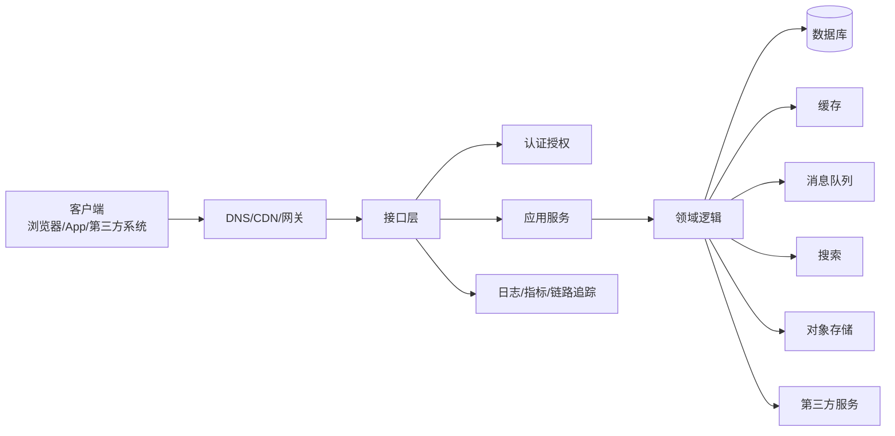

# 01-后端总览、知识地图与学习路线

> 本文目标：建立后端开发的全局地图。读完后应能理解后端到底负责什么、后端系统由哪些部分组成、后端学习为什么不能只学框架、各技术模块之间如何关联，以及如何安排长期学习路线。

<!-- lecture-notes:integrated-v2 -->

## 讲义导读：把后端当成一条请求生命线

这一章讲的是 **后端总览、知识地图与学习路线**。阅读时不要只背框架名、组件名或面试题答案，而要把每个概念放回一条请求生命线里：请求如何进入系统，如何被认证和校验，业务规则在哪里执行，数据如何保持一致，慢操作如何异步化，故障如何被观测，变更如何安全上线。后端学习的目标不是堆技术栈，而是能设计、实现、排查和维护一个长期运行的业务系统。

### 一句话先懂

后端不是会写接口就结束，而是把业务规则、数据状态、外部依赖和运行风险组织成一个长期可维护的系统。

### 通俗类比

像建一座商场：门口能进人只是第一步，还要有动线、仓库、消防、安保、监控、收银、应急预案和维护团队。

类比只是帮助建立第一印象。回到工程上，要把类比里的入口、调度、仓库、通道、监控和维护分别对应到 API、业务层、数据库、缓存、消息队列、可观测性和部署运维。后端概念只有放进真实链路，才知道它解决的是正确性、性能、安全、可靠性、可维护性还是成本问题。

### 本章学习主线

1. **先看职责**：这个概念负责处理请求链路里的哪一段，输入和输出是什么。
2. **再看边界**：它不负责什么，哪些问题应该交给数据库、缓存、队列、网关、客户端或运维平台。
3. **然后看失败**：超时、重复、乱序、并发、脏数据、权限绕过、容量耗尽时会发生什么。
4. **接着看验证**：怎样用单元测试、集成测试、压测、日志、指标、trace 或故障演练证明设计可靠。
5. **最后看演进**：需求变更、流量增长、团队协作和版本升级时，这个设计是否还能维护。

### 概念怎么学才不容易忘

遇到后端概念时，建议按 白话职责 -> 链路位置 -> 最小例子 -> 常见事故 -> 观测信号 -> 修复策略 六步理解。比如缓存不是加速器这么简单，还要看命中率、TTL、一致性、热点 key 和失效策略；消息队列不是异步这么简单，还要看确认、重试、幂等、积压和补偿；JWT 不是登录态这么简单，还要看签名、过期、撤销、泄露和权限边界。

### 最小实践任务

把一个熟悉 App 的登录、下单或发帖流程拆成网关、接口、服务、数据库、缓存、消息、第三方依赖和观测组件。

实践时要故意设计失败场景：重复请求、数据库超时、缓存失效、消息重复、权限不足、发布回滚、下游服务不可用。后端能力往往不是在正常路径里体现，而是在异常路径里体现。

### 读完本章应该能做到

- 用自己的话解释本章概念在后端请求链路中的位置。
- 画出最小流程图，标清入口、处理、存储、副作用、返回和观测点。
- 说出至少三个常见失败模式，以及对应的日志、指标或 trace 信号。
- 给出一个可落地的小设计，并说明它的事务、幂等、安全和回滚边界。
- 能画出后端知识地图，并解释每个知识域解决的问题、常见故障和学习顺序。

> 本节是讲义化阅读入口，后续正文中的协议、架构、数据库、缓存、消息、安全、运维和案例都应围绕这条请求生命线来理解。

## 1. 后端的本质

后端不是“写接口”这么简单。接口只是后端能力暴露出来的一层外壳。真正的后端工作包括业务建模、数据管理、权限控制、系统集成、性能优化、稳定性保障、部署运维和故障排查。

一个后端系统通常要回答这些问题：

- 用户是谁，是否已经登录？
- 用户能不能访问这个资源？
- 请求参数是否合法？
- 这个业务动作是否符合当前状态？
- 数据应该存在哪里？
- 多个数据变更是否需要放在同一个事务里？
- 读数据时是否可以用缓存？
- 写数据后缓存是否需要失效？
- 非核心任务是否可以异步处理？
- 远程服务超时怎么办？
- 请求重复提交怎么办？
- 系统流量过高怎么办？
- 依赖不可用怎么办？
- 出错后如何定位？
- 数据丢失后如何恢复？

从职责上看，后端可以被理解成“业务系统的控制中心”。它连接客户端、数据库、缓存、消息队列、对象存储、搜索引擎、第三方平台、内部服务和运维平台，并负责在这些系统之间维持正确的业务状态。

这个图中每条箭头都可能产生后端问题。例如 API 到数据库慢，可能是索引问题；API 到缓存慢，可能是热点 key；API 到第三方服务慢，可能需要超时、重试、熔断；API 到观察系统没有打点，出问题就无法定位。

## 2. 后端系统的基本组成

后端系统可以拆成若干层，每一层都有自己的职责。

| 层级 | 主要职责 | 常见组件 |
| --- | --- | --- |
| 接入层 | 接收外部请求、路由、限流、TLS、反向代理 | CDN、Nginx、API Gateway、Load Balancer |
| 协议层 | 解析 HTTP/RPC/WebSocket、处理序列化 | REST、gRPC、GraphQL、JSON、Protobuf |
| 认证授权层 | 识别身份、判断权限 | Cookie、Session、Token、OAuth、RBAC、ABAC |
| 应用层 | 编排用例、管理事务、调用领域逻辑 | Application Service、Use Case |
| 领域层 | 表达业务规则和状态变化 | Entity、Value Object、Aggregate、Domain Event |
| 数据访问层 | 屏蔽存储细节 | Repository、DAO、ORM、SQL Mapper |
| 基础设施层 | 连接外部技术组件 | DB、Redis、MQ、对象存储、搜索引擎、第三方 API |
| 观测层 | 输出系统运行信号 | Logs、Metrics、Traces、Profiling |
| 运维层 | 构建、部署、扩缩容、回滚 | CI/CD、Docker、Kubernetes、配置中心 |

初学后端时，经常会把所有东西写在一个接口函数里：参数校验、权限判断、SQL、缓存、业务规则、消息发送、日志、第三方调用混在一起。短期看很快，长期看很难维护。分层的意义不是“显得高级”，而是让变化被隔离：接口格式变了不影响核心业务，数据库表变了不影响 API 契约，第三方服务变了不影响领域规则。

## 3. 后端的核心质量目标

后端系统的质量不只看功能是否能跑。一个真实系统要同时考虑正确性、可用性、性能、安全、可维护性和成本。

| 目标 | 解释 | 典型问题 |
| --- | --- | --- |
| 正确性 | 业务结果必须正确 | 库存不能超卖、余额不能扣错、权限不能越权 |
| 可用性 | 用户需要时服务可用 | 机器故障、网络抖动、依赖不可用时系统如何表现 |
| 可靠性 | 故障发生后状态仍可恢复 | 消息是否丢失、数据是否可恢复、任务是否可重试 |
| 性能 | 在目标流量下响应足够快 | P95/P99 是否稳定、数据库是否扛得住 |
| 可扩展性 | 用户、数据、团队增长后能演进 | 是否能水平扩容、是否能拆分服务 |
| 安全性 | 保护数据、接口和用户身份 | 登录、权限、加密、防注入、防重放、防泄露 |
| 可维护性 | 代码和架构长期可修改 | 模块边界、测试、文档、规范、可读性 |
| 可观测性 | 出问题时能定位 | 日志、指标、链路追踪、告警 |
| 成本效率 | 用合理资源满足目标 | 机器、存储、带宽、数据库、缓存成本 |

这些目标之间存在冲突。例如强一致性通常会牺牲一部分性能和可用性；缓存能提升性能，但会引入一致性问题；微服务提升团队自治，但引入分布式复杂度；多活容灾提高可用性，但成本明显增加。

后端设计不是寻找“唯一正确架构”，而是在业务目标、团队能力、预算、时间和风险之间做权衡。

## 4. 后端学习的知识域

### 4.1 网络与协议

网络是所有后端请求的基础。后端不一定要成为网络协议专家，但必须理解 DNS、TCP、TLS、HTTP、WebSocket、反向代理、负载均衡、长连接、超时和重试。

为什么重要：

- 请求慢不一定是代码慢，可能是 DNS、TLS、网络抖动或连接池耗尽。
- 502、503、504 这类错误常常发生在网关和上游服务之间。
- 长连接、Keep-Alive、连接池会显著影响性能。
- HTTPS 证书过期会导致系统直接不可用。

### 4.2 API 设计

API 是后端和客户端、后端和后端之间的契约。设计差的 API 会导致客户端难用、版本难演进、错误难定位、权限难控制。

需要掌握：

- REST、RPC、GraphQL 的差异。
- HTTP 方法和状态码语义。
- 分页、排序、过滤。
- 错误码和错误响应结构。
- 幂等设计。
- API 版本管理。
- Webhook 和回调签名。

### 4.3 数据库与数据建模

数据库是后端最核心的基础设施。很多后端问题本质上是数据问题：表设计不合理、索引缺失、事务边界错误、隔离级别误解、慢查询、锁等待、数据增长失控。

需要掌握：

- 关系模型。
- 主键、外键、唯一约束。
- 索引和执行计划。
- 事务 ACID。
- 隔离级别和并发异常。
- MVCC。
- 分库分表。
- 数据归档和备份。

### 4.4 缓存

缓存是性能优化的重要手段，但也是事故高发区。缓存带来的问题包括脏数据、穿透、击穿、雪崩、热点 key、大 key、缓存污染和多级缓存失效。

需要掌握：

- Cache-Aside、Read-Through、Write-Through、Write-Behind。
- 本地缓存和分布式缓存。
- TTL、淘汰策略和预热。
- 缓存一致性。
- 布隆过滤器。
- 多级缓存。
- HTTP/CDN 缓存。

### 4.5 消息队列与异步

消息队列让系统从同步调用转为异步处理，常用于削峰、解耦、最终一致和任务处理。它的难点不是发送消息，而是处理重复、乱序、失败、积压、幂等和补偿。

需要掌握：

- Producer、Consumer、Topic、Queue、Partition、Offset。
- At most once、At least once、Exactly once。
- 消费者组。
- 重试和死信队列。
- 本地消息表和 Outbox。
- 事务消息。
- 幂等消费。

### 4.6 并发与分布式

后端系统天然并发。一个服务实例内部有线程、协程、事件循环、锁、连接池和队列；多个服务实例之间有复制、分片、服务发现、负载均衡、分布式锁、分布式事务和一致性问题。

需要掌握：

- 并发、并行、同步、异步、阻塞、非阻塞。
- 线程池、连接池、队列、背压。
- 锁、乐观锁、悲观锁、分布式锁。
- CAP、BASE、最终一致。
- 复制、分片、故障转移。
- 微服务拆分和服务治理。

### 4.7 安全

安全不是一个附加功能，而是后端系统的基础属性。任何接口都可能被恶意调用，任何参数都可能被构造，任何 Token 都可能泄露，任何权限判断都可能被绕过。

需要掌握：

- 认证与授权。
- Cookie、Session、Token、JWT。
- OAuth 2.0 和 OpenID Connect。
- RBAC、ABAC。
- OWASP API Security Top 10。
- SQL 注入、XSS、CSRF、SSRF、重放攻击。
- 密钥管理和审计。

### 4.8 可观测性、性能与运维

系统上线后，最重要的问题是：它是否健康？如果不健康，怎么知道哪里出了问题？

需要掌握：

- 日志、指标、链路追踪。
- RED、USE、四大黄金信号。
- 告警和 SLO。
- 压测和容量规划。
- Docker、Kubernetes、CI/CD。
- 灰度发布、回滚、故障演练。

## 5. 初学者常见误解

### 5.1 “会框架就是会后端”

框架能帮你快速写接口、连接数据库、做依赖注入和配置路由，但框架不能替你理解事务、索引、缓存一致性、幂等、重试、限流、鉴权和系统设计。一个只会框架的人，在系统规模变大后会很快遇到瓶颈。

正确理解是：框架是工具，后端知识是底层能力。学框架时要反向追问它封装了什么问题。

### 5.2 “加缓存就能提升性能”

缓存只有在命中率足够高、数据可接受短暂不一致、key 设计合理、容量足够、失效策略清楚时才有价值。盲目加缓存可能导致读到旧数据、内存爆、热点 key、缓存雪崩，甚至因为缓存和数据库不一致产生严重业务事故。

### 5.3 “微服务一定比单体高级”

微服务解决的是复杂组织和复杂系统演进问题，不是所有项目的默认答案。单体架构在小团队、早期产品、业务变化快的时候通常更简单。更合理的路径是先做模块化单体，边界清楚后再拆服务。

### 5.4 “重试能提高可靠性”

重试能缓解偶发失败，但在系统过载时会放大流量。如果没有超时、退避、抖动、最大次数和幂等设计，重试可能把局部故障扩大成全局故障。

### 5.5 “接口返回 200 就表示设计正确”

接口正确性包括状态码、业务错误码、权限、幂等、日志、追踪、超时、错误语义、版本兼容和安全性。只返回 200 会让客户端和监控系统难以区分成功、失败、限流、权限问题和服务异常。

## 6. 后端学习路线

### 6.1 第一阶段：请求响应和数据库

目标：能理解并实现一个普通业务接口。

学习内容：

- HTTP 请求和响应。
- URL、Header、Body、状态码。
- REST API。
- 参数校验。
- 统一错误响应。
- Cookie、Session、Token。
- 关系型数据库。
- SQL 基础。
- 主键、唯一约束、索引。
- 事务基本概念。

实践项目：

- 用户注册登录。
- 文章发布和评论。
- 商品列表和详情。
- 简单后台管理系统。

关键能力：

- 知道接口如何设计。
- 知道数据如何存储。
- 知道基本权限如何校验。
- 知道错误如何返回。

### 6.2 第二阶段：工程化和中间件

目标：能把业务系统写得可维护、可扩展。

学习内容：

- 分层架构。
- DTO、Entity、Repository。
- 配置管理。
- 日志。
- 缓存。
- 消息队列。
- 定时任务。
- 文件上传。
- API 文档。
- 代码评审。

实践项目：

- 订单系统。
- 通知系统。
- 文件管理系统。
- 带缓存的商品系统。
- 异步任务处理系统。

关键能力：

- 知道如何拆分模块。
- 知道缓存如何设计。
- 知道消息重复消费如何处理。
- 知道定时任务多实例下如何避免重复。

### 6.3 第三阶段：高并发和分布式

目标：能理解系统在高流量和多节点下的复杂问题。

学习内容：

- 线程池和连接池。
- 限流、熔断、降级。
- 分布式锁。
- 分布式事务。
- CAP、BASE、最终一致。
- 服务发现。
- API 网关。
- 多级缓存。
- 分库分表。
- 消息积压处理。

实践项目：

- 秒杀系统。
- 高并发投票系统。
- 订单超时自动关闭。
- 支付回调处理。
- 多服务用户订单系统。

关键能力：

- 知道为什么会出现雪崩。
- 知道如何处理重复请求。
- 知道如何设计最终一致。
- 知道如何保护下游系统。

### 6.4 第四阶段：稳定性、安全和运维

目标：能让系统稳定上线、可观察、可恢复。

学习内容：

- 日志、指标、链路追踪。
- SLO、SLI、SLA。
- 压测和容量规划。
- Docker 和 Kubernetes。
- CI/CD。
- 灰度发布和回滚。
- OAuth、OIDC、JWT。
- OWASP API Security。
- 备份和容灾。
- 故障演练。

实践项目：

- 给已有系统补齐监控。
- 做一次压测和容量评估。
- 做一次灰度发布方案。
- 做一次故障演练。
- 做一份接口安全检查清单。

关键能力：

- 知道如何定位接口变慢。
- 知道如何设计告警。
- 知道如何安全发布。
- 知道如何恢复数据。

## 7. 后端知识的串联场景

### 7.1 登录场景

登录看起来简单，实际涉及很多知识：

- HTTP 表单或 JSON 请求。
- 密码传输必须走 HTTPS。
- 密码存储必须哈希加盐，不能明文。
- 登录失败要限流，防暴力破解。
- 登录成功生成 Session 或 Token。
- Token 要设置过期时间。
- Cookie 要考虑 HttpOnly、Secure、SameSite。
- 登录日志要记录设备、IP、时间。
- 异常登录要触发风控。

### 7.2 下单场景

下单涉及：

- 参数校验。
- 用户权限。
- 商品状态。
- 库存扣减。
- 价格快照。
- 优惠计算。
- 订单创建事务。
- 幂等提交。
- 支付状态。
- 消息队列异步通知。
- 超时未支付关闭订单。
- 库存回滚。

这个场景能串联数据库事务、状态机、消息队列、幂等、定时任务、分布式一致性和故障补偿。

### 7.3 商品详情页

商品详情页涉及：

- CDN 缓存静态资源。
- 应用本地缓存热点配置。
- Redis 缓存商品详情。
- 数据库作为权威数据源。
- 商品更新后删除缓存。
- 热点商品预热。
- 缓存击穿保护。
- 图片走对象存储和 CDN。
- 推荐模块可降级。

这个场景能串联多级缓存、缓存一致性、热点保护和降级。

### 7.4 支付回调

支付回调涉及：

- Webhook 签名验证。
- 回调重复发送。
- 支付流水唯一约束。
- 订单状态机。
- 幂等处理。
- 数据库事务。
- 消息通知。
- 对账补偿。
- 审计日志。

这个场景能串联安全、幂等、事务、消息和最终一致。

## 8. 学习方法

后端学习最有效的方法是“概念 + 场景 + 实验 + 复盘”。

概念：先知道一个技术解决什么问题，例如缓存是为减少重复查询，消息队列是为异步解耦，分布式锁是为跨节点互斥。

场景：把概念放进业务，例如商品详情用缓存，下单用事务和幂等，支付回调用签名和状态机。

实验：自己制造问题，例如让数据库慢查询、让缓存失效、让消息重复消费、让下游超时，看系统表现。

复盘：写出问题原因、影响范围、临时修复、长期修复和监控指标。

## 9. 本章小结

后端是一套系统能力，不是单一框架技能。要从请求链路、接口契约、业务建模、数据管理、缓存、异步、分布式、安全、可观测性和部署运维多个角度理解系统。学习顺序建议从 HTTP 和数据库开始，再进入工程化、中间件、高并发、分布式、安全和运维。

## 10. 参考资料

- The Twelve-Factor App: https://12factor.net/
- Martin Fowler Microservices: https://martinfowler.com/articles/microservices.html
- Google SRE Workbook: https://sre.google/workbook/
- OpenTelemetry Documentation: https://opentelemetry.io/docs/
- Kubernetes Concepts: https://kubernetes.io/docs/concepts/
- OWASP API Security Top 10 2023: https://owasp.org/API-Security/editions/2023/en/0x11-t10/

## 2026 后端资料与工程核对补充

后端基础概念相对稳定，但规范、组件版本和安全风险会持续变化。复现实践前，建议记录运行时版本、框架版本、数据库版本、缓存和消息队列版本、容器镜像、Kubernetes 版本、云厂商组件、配置文件、迁移脚本和压测环境。不要只记录代码提交，还要记录依赖和运行条件。

学习后端时建议优先核对官方规范和项目文档：HTTP 语义看 RFC 9110，HTTP 缓存看 RFC 9111，API 安全风险看 OWASP API Security Top 10，观测体系看 OpenTelemetry，数据库事务和索引看对应数据库官方文档，容器编排看 Kubernetes 官方文档。社区文章适合补充事故经验和踩坑案例，但不能替代规范和官方文档。

### 资料入口

- RFC 9110 HTTP Semantics: https://www.rfc-editor.org/rfc/rfc9110.html
- RFC 9111 HTTP Caching: https://www.rfc-editor.org/rfc/rfc9111.html
- MDN HTTP reference: https://developer.mozilla.org/en-US/docs/Web/HTTP
- OWASP API Security Top 10 2023: https://owasp.org/API-Security/editions/2023/en/0x11-t10/
- OpenTelemetry documentation: https://opentelemetry.io/docs/
- PostgreSQL documentation: https://www.postgresql.org/docs/current/
- Redis documentation: https://redis.io/docs/latest/
- Apache Kafka documentation: https://kafka.apache.org/documentation/
- Kubernetes documentation: https://kubernetes.io/docs/home/
- The Twelve-Factor App: https://12factor.net/

<!-- AUTO_EXPANDED_TO_REFERENCE_LENGTH_2026_06_23 -->

## 万字精讲扩展：后端总览、知识地图与学习路线

> 本节为按参考笔记篇幅补充的系统化扩展内容，目标是把原有笔记从“知识点记录”扩展为“概念、原理、流程、工程实践、常见误区和复盘清单”完整学习材料。

### 精讲扩展 1：后端总览、知识地图与学习路线 的接口设计、领域建模 与工程化理解

学习 $topic 时，不能只把它当成一个孤立知识点来背诵，而要把它放到 $category 的完整问题链条里理解。一个知识点通常同时包含概念定义、适用边界、输入输出、运行过程、常见异常和工程取舍。真正掌握它，意味着看到一个具体场景时，能够判断它解决什么问题、依赖哪些前提、失败时会出现什么现象，以及应该用什么手段验证自己的判断。

从 $a 的角度看，最重要的是先建立清晰的对象模型。也就是明确系统里有哪些参与者、它们之间如何连接、数据或控制信号如何流动、哪些环节是同步的、哪些环节是异步的、哪些状态是临时状态、哪些状态需要长期保存。很多初学问题并不是公式不会、API 不熟，而是对象边界不清：把配置当成状态，把结果当成过程，把局部现象当成全局规律。写笔记时建议始终追问：这个概念的主体是谁，输入是什么，输出是什么，中间约束是什么，错误会在哪里暴露。

从 $b 的角度看，流程比单点知识更关键。一个成熟方案通常不是单个技巧，而是一组步骤：先确定目标，再拆分约束，然后选择工具，最后通过测试和复盘确认效果。比如在实际项目中，不能只问“怎么实现”，还要问“为什么要这样实现”“有没有更简单的替代方案”“边界条件是什么”“数据量、并发量、实时性、可靠性变化后还能不能工作”。这种流程意识能够避免把学习停留在教程层面，也能让后续排错有明确路线。

$topic 的 $c 往往决定它在真实项目中的稳定性。理论上可行的方案，到了工程环境中会受到数据质量、硬件条件、依赖版本、网络环境、团队协作、部署方式和维护成本影响。写代码或做设计时，应该把正常路径和异常路径同时考虑：正常情况下如何运行，输入为空怎么办，超时怎么办，重复执行怎么办，部分成功怎么办，版本升级后兼容性怎么办，日志和指标如何证明系统确实按预期工作。

进一步看 $d，它通常对应性能、可靠性或可维护性的核心矛盾。很多技术选择并没有绝对正确答案，只有是否适合当前约束。例如追求极致性能可能牺牲可读性，追求高度抽象可能增加调试成本，追求快速交付可能留下技术债，追求完全通用可能让简单场景变复杂。高质量笔记应该把这些取舍写出来，而不是只给一个“推荐方案”。推荐方案背后的条件越清楚，迁移到新场景时越不容易误用。

最后从 $e 的角度进行复盘，可以把知识从“看懂”推进到“会用”。建议为 $topic 建立三个层次的检查：第一层是概念检查，确认术语、流程和边界没有混淆；第二层是实践检查，确认能够独立完成一个最小案例；第三层是工程检查，确认这个案例在异常、规模、性能和维护方面经得起追问。每次学习完一个章节，都可以用这三层检查反向补齐笔记。

#### 典型场景拆解

在真实场景中，$topic 通常会经历“需求出现、方案选择、实现落地、问题暴露、持续优化”几个阶段。需求出现时，要先判断这个需求属于基础能力、性能优化、体验改进、可靠性建设还是长期架构演进。不同类型的需求对方案的评价标准不同：基础能力看正确性，性能优化看指标，体验改进看路径是否顺滑，可靠性建设看故障时能否降级和恢复，架构演进看未来变化是否容易吸收。

方案选择阶段，最容易犯的错误是直接套用熟悉工具。更稳妥的方式是列出约束：数据规模、时延要求、资源预算、团队熟悉度、运维能力、安全要求、可测试性和长期维护成本。只有把约束列清楚，才能解释为什么选择当前方案。否则方案看似高级，实际可能只是增加了复杂度。

实现落地阶段，要把 $a 和 $b 拆成可验证的小步骤。每一步都应该有明确的输入、输出和检查方式。对学习笔记而言，这意味着不能只有大段概念，还应该补充流程图式的文字描述、伪代码、命令示例、参数解释、错误现象和排查路径。这样以后复习时，笔记不仅能帮助理解，也能直接指导实践。

问题暴露阶段，要优先区分“理解错误、实现错误、环境错误、数据错误、依赖错误、边界条件错误”。很多复杂问题之所以难排，是因为一开始就把问题归因到错误层级。例如把配置问题当成算法问题，把权限问题当成代码问题，把数据分布变化当成模型失效，把硬件噪声当成软件逻辑错误。好的排查顺序应该从可观测事实开始，而不是从猜测开始。

持续优化阶段，不应只追求把当前问题压下去，还要沉淀成规则。比如记录触发条件、影响范围、定位方法、最终修复、预防措施和可监控指标。这样下一次出现类似问题时，团队可以复用经验，而不是重新从零排查。

#### 常见误区与纠偏

第一个误区是只记结论，不记前提。$topic 中很多结论都是有条件的：适用于小规模，不一定适用于大规模；适用于离线处理，不一定适用于实时系统；适用于单机环境，不一定适用于分布式环境；适用于教学案例，不一定适用于生产项目。纠偏方法是在每个重要结论后面补一句“适用条件”和“不适用情况”。

第二个误区是只关注工具，不关注模型。工具会变化，模型更稳定。无论工具名称如何变化，底层仍然要解决输入建模、状态管理、资源调度、错误恢复、性能约束和质量验证这些问题。学习 $topic 时，应该把工具用法和底层模型分开记录：工具命令解决“怎么做”，底层模型解释“为什么这样做”。

第三个误区是没有验证意识。很多笔记写得很完整，但没有说明如何确认自己做对了。对于 $category 相关主题，验证至少应包含最小样例、边界样例、异常样例和性能样例。最小样例证明流程跑通，边界样例证明理解完整，异常样例证明系统可恢复，性能样例证明方案在目标规模下仍然可用。

第四个误区是忽略可维护性。短期学习时，能跑通就容易产生掌握的错觉；长期使用时，命名、分层、注释、测试、日志、版本管理和文档才会决定知识能否转化为稳定能力。扩充 $topic 笔记时，应把“如何写得清楚、如何排查、如何交接、如何复盘”也纳入内容。

#### 学习与实践建议

建议围绕 $topic 做一个小型闭环练习：先用自己的话解释概念，再画出流程，再实现一个最小案例，然后主动制造一个错误并排查，最后写下复盘。这个过程看起来比直接读资料慢，但能显著提高迁移能力。很多人学完后不会用，根本原因是缺少“从概念到问题再到验证”的闭环。

复习时可以使用四个问题：它解决什么问题；它依赖什么条件；它失败时有什么表现；它如何被验证。只要这四个问题能回答清楚，说明对 $topic 的理解已经从表层进入工程层。如果回答不清楚，就回到对应章节补充例子、边界和排错方法。
### 精讲扩展 2：后端总览、知识地图与学习路线 的领域建模、事务一致性 与工程化理解

学习 $topic 时，不能只把它当成一个孤立知识点来背诵，而要把它放到 $category 的完整问题链条里理解。一个知识点通常同时包含概念定义、适用边界、输入输出、运行过程、常见异常和工程取舍。真正掌握它，意味着看到一个具体场景时，能够判断它解决什么问题、依赖哪些前提、失败时会出现什么现象，以及应该用什么手段验证自己的判断。

从 $a 的角度看，最重要的是先建立清晰的对象模型。也就是明确系统里有哪些参与者、它们之间如何连接、数据或控制信号如何流动、哪些环节是同步的、哪些环节是异步的、哪些状态是临时状态、哪些状态需要长期保存。很多初学问题并不是公式不会、API 不熟，而是对象边界不清：把配置当成状态，把结果当成过程，把局部现象当成全局规律。写笔记时建议始终追问：这个概念的主体是谁，输入是什么，输出是什么，中间约束是什么，错误会在哪里暴露。

从 $b 的角度看，流程比单点知识更关键。一个成熟方案通常不是单个技巧，而是一组步骤：先确定目标，再拆分约束，然后选择工具，最后通过测试和复盘确认效果。比如在实际项目中，不能只问“怎么实现”，还要问“为什么要这样实现”“有没有更简单的替代方案”“边界条件是什么”“数据量、并发量、实时性、可靠性变化后还能不能工作”。这种流程意识能够避免把学习停留在教程层面，也能让后续排错有明确路线。

$topic 的 $c 往往决定它在真实项目中的稳定性。理论上可行的方案，到了工程环境中会受到数据质量、硬件条件、依赖版本、网络环境、团队协作、部署方式和维护成本影响。写代码或做设计时，应该把正常路径和异常路径同时考虑：正常情况下如何运行，输入为空怎么办，超时怎么办，重复执行怎么办，部分成功怎么办，版本升级后兼容性怎么办，日志和指标如何证明系统确实按预期工作。

进一步看 $d，它通常对应性能、可靠性或可维护性的核心矛盾。很多技术选择并没有绝对正确答案，只有是否适合当前约束。例如追求极致性能可能牺牲可读性，追求高度抽象可能增加调试成本，追求快速交付可能留下技术债，追求完全通用可能让简单场景变复杂。高质量笔记应该把这些取舍写出来，而不是只给一个“推荐方案”。推荐方案背后的条件越清楚，迁移到新场景时越不容易误用。

最后从 $e 的角度进行复盘，可以把知识从“看懂”推进到“会用”。建议为 $topic 建立三个层次的检查：第一层是概念检查，确认术语、流程和边界没有混淆；第二层是实践检查，确认能够独立完成一个最小案例；第三层是工程检查，确认这个案例在异常、规模、性能和维护方面经得起追问。每次学习完一个章节，都可以用这三层检查反向补齐笔记。

#### 典型场景拆解

在真实场景中，$topic 通常会经历“需求出现、方案选择、实现落地、问题暴露、持续优化”几个阶段。需求出现时，要先判断这个需求属于基础能力、性能优化、体验改进、可靠性建设还是长期架构演进。不同类型的需求对方案的评价标准不同：基础能力看正确性，性能优化看指标，体验改进看路径是否顺滑，可靠性建设看故障时能否降级和恢复，架构演进看未来变化是否容易吸收。

方案选择阶段，最容易犯的错误是直接套用熟悉工具。更稳妥的方式是列出约束：数据规模、时延要求、资源预算、团队熟悉度、运维能力、安全要求、可测试性和长期维护成本。只有把约束列清楚，才能解释为什么选择当前方案。否则方案看似高级，实际可能只是增加了复杂度。

实现落地阶段，要把 $a 和 $b 拆成可验证的小步骤。每一步都应该有明确的输入、输出和检查方式。对学习笔记而言，这意味着不能只有大段概念，还应该补充流程图式的文字描述、伪代码、命令示例、参数解释、错误现象和排查路径。这样以后复习时，笔记不仅能帮助理解，也能直接指导实践。

问题暴露阶段，要优先区分“理解错误、实现错误、环境错误、数据错误、依赖错误、边界条件错误”。很多复杂问题之所以难排，是因为一开始就把问题归因到错误层级。例如把配置问题当成算法问题，把权限问题当成代码问题，把数据分布变化当成模型失效，把硬件噪声当成软件逻辑错误。好的排查顺序应该从可观测事实开始，而不是从猜测开始。

持续优化阶段，不应只追求把当前问题压下去，还要沉淀成规则。比如记录触发条件、影响范围、定位方法、最终修复、预防措施和可监控指标。这样下一次出现类似问题时，团队可以复用经验，而不是重新从零排查。

#### 常见误区与纠偏

第一个误区是只记结论，不记前提。$topic 中很多结论都是有条件的：适用于小规模，不一定适用于大规模；适用于离线处理，不一定适用于实时系统；适用于单机环境，不一定适用于分布式环境；适用于教学案例，不一定适用于生产项目。纠偏方法是在每个重要结论后面补一句“适用条件”和“不适用情况”。

第二个误区是只关注工具，不关注模型。工具会变化，模型更稳定。无论工具名称如何变化，底层仍然要解决输入建模、状态管理、资源调度、错误恢复、性能约束和质量验证这些问题。学习 $topic 时，应该把工具用法和底层模型分开记录：工具命令解决“怎么做”，底层模型解释“为什么这样做”。

第三个误区是没有验证意识。很多笔记写得很完整，但没有说明如何确认自己做对了。对于 $category 相关主题，验证至少应包含最小样例、边界样例、异常样例和性能样例。最小样例证明流程跑通，边界样例证明理解完整，异常样例证明系统可恢复，性能样例证明方案在目标规模下仍然可用。

第四个误区是忽略可维护性。短期学习时，能跑通就容易产生掌握的错觉；长期使用时，命名、分层、注释、测试、日志、版本管理和文档才会决定知识能否转化为稳定能力。扩充 $topic 笔记时，应把“如何写得清楚、如何排查、如何交接、如何复盘”也纳入内容。

#### 学习与实践建议

建议围绕 $topic 做一个小型闭环练习：先用自己的话解释概念，再画出流程，再实现一个最小案例，然后主动制造一个错误并排查，最后写下复盘。这个过程看起来比直接读资料慢，但能显著提高迁移能力。很多人学完后不会用，根本原因是缺少“从概念到问题再到验证”的闭环。

复习时可以使用四个问题：它解决什么问题；它依赖什么条件；它失败时有什么表现；它如何被验证。只要这四个问题能回答清楚，说明对 $topic 的理解已经从表层进入工程层。如果回答不清楚，就回到对应章节补充例子、边界和排错方法。
### 精讲扩展 3：后端总览、知识地图与学习路线 的事务一致性、缓存策略 与工程化理解

学习 $topic 时，不能只把它当成一个孤立知识点来背诵，而要把它放到 $category 的完整问题链条里理解。一个知识点通常同时包含概念定义、适用边界、输入输出、运行过程、常见异常和工程取舍。真正掌握它，意味着看到一个具体场景时，能够判断它解决什么问题、依赖哪些前提、失败时会出现什么现象，以及应该用什么手段验证自己的判断。

从 $a 的角度看，最重要的是先建立清晰的对象模型。也就是明确系统里有哪些参与者、它们之间如何连接、数据或控制信号如何流动、哪些环节是同步的、哪些环节是异步的、哪些状态是临时状态、哪些状态需要长期保存。很多初学问题并不是公式不会、API 不熟，而是对象边界不清：把配置当成状态，把结果当成过程，把局部现象当成全局规律。写笔记时建议始终追问：这个概念的主体是谁，输入是什么，输出是什么，中间约束是什么，错误会在哪里暴露。

从 $b 的角度看，流程比单点知识更关键。一个成熟方案通常不是单个技巧，而是一组步骤：先确定目标，再拆分约束，然后选择工具，最后通过测试和复盘确认效果。比如在实际项目中，不能只问“怎么实现”，还要问“为什么要这样实现”“有没有更简单的替代方案”“边界条件是什么”“数据量、并发量、实时性、可靠性变化后还能不能工作”。这种流程意识能够避免把学习停留在教程层面，也能让后续排错有明确路线。

$topic 的 $c 往往决定它在真实项目中的稳定性。理论上可行的方案，到了工程环境中会受到数据质量、硬件条件、依赖版本、网络环境、团队协作、部署方式和维护成本影响。写代码或做设计时，应该把正常路径和异常路径同时考虑：正常情况下如何运行，输入为空怎么办，超时怎么办，重复执行怎么办，部分成功怎么办，版本升级后兼容性怎么办，日志和指标如何证明系统确实按预期工作。

进一步看 $d，它通常对应性能、可靠性或可维护性的核心矛盾。很多技术选择并没有绝对正确答案，只有是否适合当前约束。例如追求极致性能可能牺牲可读性，追求高度抽象可能增加调试成本，追求快速交付可能留下技术债，追求完全通用可能让简单场景变复杂。高质量笔记应该把这些取舍写出来，而不是只给一个“推荐方案”。推荐方案背后的条件越清楚，迁移到新场景时越不容易误用。

最后从 $e 的角度进行复盘，可以把知识从“看懂”推进到“会用”。建议为 $topic 建立三个层次的检查：第一层是概念检查，确认术语、流程和边界没有混淆；第二层是实践检查，确认能够独立完成一个最小案例；第三层是工程检查，确认这个案例在异常、规模、性能和维护方面经得起追问。每次学习完一个章节，都可以用这三层检查反向补齐笔记。

#### 典型场景拆解

在真实场景中，$topic 通常会经历“需求出现、方案选择、实现落地、问题暴露、持续优化”几个阶段。需求出现时，要先判断这个需求属于基础能力、性能优化、体验改进、可靠性建设还是长期架构演进。不同类型的需求对方案的评价标准不同：基础能力看正确性，性能优化看指标，体验改进看路径是否顺滑，可靠性建设看故障时能否降级和恢复，架构演进看未来变化是否容易吸收。

方案选择阶段，最容易犯的错误是直接套用熟悉工具。更稳妥的方式是列出约束：数据规模、时延要求、资源预算、团队熟悉度、运维能力、安全要求、可测试性和长期维护成本。只有把约束列清楚，才能解释为什么选择当前方案。否则方案看似高级，实际可能只是增加了复杂度。

实现落地阶段，要把 $a 和 $b 拆成可验证的小步骤。每一步都应该有明确的输入、输出和检查方式。对学习笔记而言，这意味着不能只有大段概念，还应该补充流程图式的文字描述、伪代码、命令示例、参数解释、错误现象和排查路径。这样以后复习时，笔记不仅能帮助理解，也能直接指导实践。

问题暴露阶段，要优先区分“理解错误、实现错误、环境错误、数据错误、依赖错误、边界条件错误”。很多复杂问题之所以难排，是因为一开始就把问题归因到错误层级。例如把配置问题当成算法问题，把权限问题当成代码问题，把数据分布变化当成模型失效，把硬件噪声当成软件逻辑错误。好的排查顺序应该从可观测事实开始，而不是从猜测开始。

持续优化阶段，不应只追求把当前问题压下去，还要沉淀成规则。比如记录触发条件、影响范围、定位方法、最终修复、预防措施和可监控指标。这样下一次出现类似问题时，团队可以复用经验，而不是重新从零排查。

#### 常见误区与纠偏

第一个误区是只记结论，不记前提。$topic 中很多结论都是有条件的：适用于小规模，不一定适用于大规模；适用于离线处理，不一定适用于实时系统；适用于单机环境，不一定适用于分布式环境；适用于教学案例，不一定适用于生产项目。纠偏方法是在每个重要结论后面补一句“适用条件”和“不适用情况”。

第二个误区是只关注工具，不关注模型。工具会变化，模型更稳定。无论工具名称如何变化，底层仍然要解决输入建模、状态管理、资源调度、错误恢复、性能约束和质量验证这些问题。学习 $topic 时，应该把工具用法和底层模型分开记录：工具命令解决“怎么做”，底层模型解释“为什么这样做”。

第三个误区是没有验证意识。很多笔记写得很完整，但没有说明如何确认自己做对了。对于 $category 相关主题，验证至少应包含最小样例、边界样例、异常样例和性能样例。最小样例证明流程跑通，边界样例证明理解完整，异常样例证明系统可恢复，性能样例证明方案在目标规模下仍然可用。

第四个误区是忽略可维护性。短期学习时，能跑通就容易产生掌握的错觉；长期使用时，命名、分层、注释、测试、日志、版本管理和文档才会决定知识能否转化为稳定能力。扩充 $topic 笔记时，应把“如何写得清楚、如何排查、如何交接、如何复盘”也纳入内容。

#### 学习与实践建议

建议围绕 $topic 做一个小型闭环练习：先用自己的话解释概念，再画出流程，再实现一个最小案例，然后主动制造一个错误并排查，最后写下复盘。这个过程看起来比直接读资料慢，但能显著提高迁移能力。很多人学完后不会用，根本原因是缺少“从概念到问题再到验证”的闭环。

复习时可以使用四个问题：它解决什么问题；它依赖什么条件；它失败时有什么表现；它如何被验证。只要这四个问题能回答清楚，说明对 $topic 的理解已经从表层进入工程层。如果回答不清楚，就回到对应章节补充例子、边界和排错方法。
### 精讲扩展 4：后端总览、知识地图与学习路线 的缓存策略、消息队列 与工程化理解

学习 $topic 时，不能只把它当成一个孤立知识点来背诵，而要把它放到 $category 的完整问题链条里理解。一个知识点通常同时包含概念定义、适用边界、输入输出、运行过程、常见异常和工程取舍。真正掌握它，意味着看到一个具体场景时，能够判断它解决什么问题、依赖哪些前提、失败时会出现什么现象，以及应该用什么手段验证自己的判断。

从 $a 的角度看，最重要的是先建立清晰的对象模型。也就是明确系统里有哪些参与者、它们之间如何连接、数据或控制信号如何流动、哪些环节是同步的、哪些环节是异步的、哪些状态是临时状态、哪些状态需要长期保存。很多初学问题并不是公式不会、API 不熟，而是对象边界不清：把配置当成状态，把结果当成过程，把局部现象当成全局规律。写笔记时建议始终追问：这个概念的主体是谁，输入是什么，输出是什么，中间约束是什么，错误会在哪里暴露。

从 $b 的角度看，流程比单点知识更关键。一个成熟方案通常不是单个技巧，而是一组步骤：先确定目标，再拆分约束，然后选择工具，最后通过测试和复盘确认效果。比如在实际项目中，不能只问“怎么实现”，还要问“为什么要这样实现”“有没有更简单的替代方案”“边界条件是什么”“数据量、并发量、实时性、可靠性变化后还能不能工作”。这种流程意识能够避免把学习停留在教程层面，也能让后续排错有明确路线。

$topic 的 $c 往往决定它在真实项目中的稳定性。理论上可行的方案，到了工程环境中会受到数据质量、硬件条件、依赖版本、网络环境、团队协作、部署方式和维护成本影响。写代码或做设计时，应该把正常路径和异常路径同时考虑：正常情况下如何运行，输入为空怎么办，超时怎么办，重复执行怎么办，部分成功怎么办，版本升级后兼容性怎么办，日志和指标如何证明系统确实按预期工作。

进一步看 $d，它通常对应性能、可靠性或可维护性的核心矛盾。很多技术选择并没有绝对正确答案，只有是否适合当前约束。例如追求极致性能可能牺牲可读性，追求高度抽象可能增加调试成本，追求快速交付可能留下技术债，追求完全通用可能让简单场景变复杂。高质量笔记应该把这些取舍写出来，而不是只给一个“推荐方案”。推荐方案背后的条件越清楚，迁移到新场景时越不容易误用。

最后从 $e 的角度进行复盘，可以把知识从“看懂”推进到“会用”。建议为 $topic 建立三个层次的检查：第一层是概念检查，确认术语、流程和边界没有混淆；第二层是实践检查，确认能够独立完成一个最小案例；第三层是工程检查，确认这个案例在异常、规模、性能和维护方面经得起追问。每次学习完一个章节，都可以用这三层检查反向补齐笔记。

#### 典型场景拆解

在真实场景中，$topic 通常会经历“需求出现、方案选择、实现落地、问题暴露、持续优化”几个阶段。需求出现时，要先判断这个需求属于基础能力、性能优化、体验改进、可靠性建设还是长期架构演进。不同类型的需求对方案的评价标准不同：基础能力看正确性，性能优化看指标，体验改进看路径是否顺滑，可靠性建设看故障时能否降级和恢复，架构演进看未来变化是否容易吸收。

方案选择阶段，最容易犯的错误是直接套用熟悉工具。更稳妥的方式是列出约束：数据规模、时延要求、资源预算、团队熟悉度、运维能力、安全要求、可测试性和长期维护成本。只有把约束列清楚，才能解释为什么选择当前方案。否则方案看似高级，实际可能只是增加了复杂度。

实现落地阶段，要把 $a 和 $b 拆成可验证的小步骤。每一步都应该有明确的输入、输出和检查方式。对学习笔记而言，这意味着不能只有大段概念，还应该补充流程图式的文字描述、伪代码、命令示例、参数解释、错误现象和排查路径。这样以后复习时，笔记不仅能帮助理解，也能直接指导实践。

问题暴露阶段，要优先区分“理解错误、实现错误、环境错误、数据错误、依赖错误、边界条件错误”。很多复杂问题之所以难排，是因为一开始就把问题归因到错误层级。例如把配置问题当成算法问题，把权限问题当成代码问题，把数据分布变化当成模型失效，把硬件噪声当成软件逻辑错误。好的排查顺序应该从可观测事实开始，而不是从猜测开始。

持续优化阶段，不应只追求把当前问题压下去，还要沉淀成规则。比如记录触发条件、影响范围、定位方法、最终修复、预防措施和可监控指标。这样下一次出现类似问题时，团队可以复用经验，而不是重新从零排查。

#### 常见误区与纠偏

第一个误区是只记结论，不记前提。$topic 中很多结论都是有条件的：适用于小规模，不一定适用于大规模；适用于离线处理，不一定适用于实时系统；适用于单机环境，不一定适用于分布式环境；适用于教学案例，不一定适用于生产项目。纠偏方法是在每个重要结论后面补一句“适用条件”和“不适用情况”。

第二个误区是只关注工具，不关注模型。工具会变化，模型更稳定。无论工具名称如何变化，底层仍然要解决输入建模、状态管理、资源调度、错误恢复、性能约束和质量验证这些问题。学习 $topic 时，应该把工具用法和底层模型分开记录：工具命令解决“怎么做”，底层模型解释“为什么这样做”。

第三个误区是没有验证意识。很多笔记写得很完整，但没有说明如何确认自己做对了。对于 $category 相关主题，验证至少应包含最小样例、边界样例、异常样例和性能样例。最小样例证明流程跑通，边界样例证明理解完整，异常样例证明系统可恢复，性能样例证明方案在目标规模下仍然可用。

第四个误区是忽略可维护性。短期学习时，能跑通就容易产生掌握的错觉；长期使用时，命名、分层、注释、测试、日志、版本管理和文档才会决定知识能否转化为稳定能力。扩充 $topic 笔记时，应把“如何写得清楚、如何排查、如何交接、如何复盘”也纳入内容。

#### 学习与实践建议

建议围绕 $topic 做一个小型闭环练习：先用自己的话解释概念，再画出流程，再实现一个最小案例，然后主动制造一个错误并排查，最后写下复盘。这个过程看起来比直接读资料慢，但能显著提高迁移能力。很多人学完后不会用，根本原因是缺少“从概念到问题再到验证”的闭环。

复习时可以使用四个问题：它解决什么问题；它依赖什么条件；它失败时有什么表现；它如何被验证。只要这四个问题能回答清楚，说明对 $topic 的理解已经从表层进入工程层。如果回答不清楚，就回到对应章节补充例子、边界和排错方法。
### 精讲扩展 5：后端总览、知识地图与学习路线 的消息队列、并发控制 与工程化理解

学习 $topic 时，不能只把它当成一个孤立知识点来背诵，而要把它放到 $category 的完整问题链条里理解。一个知识点通常同时包含概念定义、适用边界、输入输出、运行过程、常见异常和工程取舍。真正掌握它，意味着看到一个具体场景时，能够判断它解决什么问题、依赖哪些前提、失败时会出现什么现象，以及应该用什么手段验证自己的判断。

从 $a 的角度看，最重要的是先建立清晰的对象模型。也就是明确系统里有哪些参与者、它们之间如何连接、数据或控制信号如何流动、哪些环节是同步的、哪些环节是异步的、哪些状态是临时状态、哪些状态需要长期保存。很多初学问题并不是公式不会、API 不熟，而是对象边界不清：把配置当成状态，把结果当成过程，把局部现象当成全局规律。写笔记时建议始终追问：这个概念的主体是谁，输入是什么，输出是什么，中间约束是什么，错误会在哪里暴露。

从 $b 的角度看，流程比单点知识更关键。一个成熟方案通常不是单个技巧，而是一组步骤：先确定目标，再拆分约束，然后选择工具，最后通过测试和复盘确认效果。比如在实际项目中，不能只问“怎么实现”，还要问“为什么要这样实现”“有没有更简单的替代方案”“边界条件是什么”“数据量、并发量、实时性、可靠性变化后还能不能工作”。这种流程意识能够避免把学习停留在教程层面，也能让后续排错有明确路线。

$topic 的 $c 往往决定它在真实项目中的稳定性。理论上可行的方案，到了工程环境中会受到数据质量、硬件条件、依赖版本、网络环境、团队协作、部署方式和维护成本影响。写代码或做设计时，应该把正常路径和异常路径同时考虑：正常情况下如何运行，输入为空怎么办，超时怎么办，重复执行怎么办，部分成功怎么办，版本升级后兼容性怎么办，日志和指标如何证明系统确实按预期工作。

进一步看 $d，它通常对应性能、可靠性或可维护性的核心矛盾。很多技术选择并没有绝对正确答案，只有是否适合当前约束。例如追求极致性能可能牺牲可读性，追求高度抽象可能增加调试成本，追求快速交付可能留下技术债，追求完全通用可能让简单场景变复杂。高质量笔记应该把这些取舍写出来，而不是只给一个“推荐方案”。推荐方案背后的条件越清楚，迁移到新场景时越不容易误用。

最后从 $e 的角度进行复盘，可以把知识从“看懂”推进到“会用”。建议为 $topic 建立三个层次的检查：第一层是概念检查，确认术语、流程和边界没有混淆；第二层是实践检查，确认能够独立完成一个最小案例；第三层是工程检查，确认这个案例在异常、规模、性能和维护方面经得起追问。每次学习完一个章节，都可以用这三层检查反向补齐笔记。

#### 典型场景拆解

在真实场景中，$topic 通常会经历“需求出现、方案选择、实现落地、问题暴露、持续优化”几个阶段。需求出现时，要先判断这个需求属于基础能力、性能优化、体验改进、可靠性建设还是长期架构演进。不同类型的需求对方案的评价标准不同：基础能力看正确性，性能优化看指标，体验改进看路径是否顺滑，可靠性建设看故障时能否降级和恢复，架构演进看未来变化是否容易吸收。

方案选择阶段，最容易犯的错误是直接套用熟悉工具。更稳妥的方式是列出约束：数据规模、时延要求、资源预算、团队熟悉度、运维能力、安全要求、可测试性和长期维护成本。只有把约束列清楚，才能解释为什么选择当前方案。否则方案看似高级，实际可能只是增加了复杂度。

实现落地阶段，要把 $a 和 $b 拆成可验证的小步骤。每一步都应该有明确的输入、输出和检查方式。对学习笔记而言，这意味着不能只有大段概念，还应该补充流程图式的文字描述、伪代码、命令示例、参数解释、错误现象和排查路径。这样以后复习时，笔记不仅能帮助理解，也能直接指导实践。

问题暴露阶段，要优先区分“理解错误、实现错误、环境错误、数据错误、依赖错误、边界条件错误”。很多复杂问题之所以难排，是因为一开始就把问题归因到错误层级。例如把配置问题当成算法问题，把权限问题当成代码问题，把数据分布变化当成模型失效，把硬件噪声当成软件逻辑错误。好的排查顺序应该从可观测事实开始，而不是从猜测开始。

持续优化阶段，不应只追求把当前问题压下去，还要沉淀成规则。比如记录触发条件、影响范围、定位方法、最终修复、预防措施和可监控指标。这样下一次出现类似问题时，团队可以复用经验，而不是重新从零排查。

#### 常见误区与纠偏

第一个误区是只记结论，不记前提。$topic 中很多结论都是有条件的：适用于小规模，不一定适用于大规模；适用于离线处理，不一定适用于实时系统；适用于单机环境，不一定适用于分布式环境；适用于教学案例，不一定适用于生产项目。纠偏方法是在每个重要结论后面补一句“适用条件”和“不适用情况”。

第二个误区是只关注工具，不关注模型。工具会变化，模型更稳定。无论工具名称如何变化，底层仍然要解决输入建模、状态管理、资源调度、错误恢复、性能约束和质量验证这些问题。学习 $topic 时，应该把工具用法和底层模型分开记录：工具命令解决“怎么做”，底层模型解释“为什么这样做”。

第三个误区是没有验证意识。很多笔记写得很完整，但没有说明如何确认自己做对了。对于 $category 相关主题，验证至少应包含最小样例、边界样例、异常样例和性能样例。最小样例证明流程跑通，边界样例证明理解完整，异常样例证明系统可恢复，性能样例证明方案在目标规模下仍然可用。

第四个误区是忽略可维护性。短期学习时，能跑通就容易产生掌握的错觉；长期使用时，命名、分层、注释、测试、日志、版本管理和文档才会决定知识能否转化为稳定能力。扩充 $topic 笔记时，应把“如何写得清楚、如何排查、如何交接、如何复盘”也纳入内容。

#### 学习与实践建议

建议围绕 $topic 做一个小型闭环练习：先用自己的话解释概念，再画出流程，再实现一个最小案例，然后主动制造一个错误并排查，最后写下复盘。这个过程看起来比直接读资料慢，但能显著提高迁移能力。很多人学完后不会用，根本原因是缺少“从概念到问题再到验证”的闭环。

复习时可以使用四个问题：它解决什么问题；它依赖什么条件；它失败时有什么表现；它如何被验证。只要这四个问题能回答清楚，说明对 $topic 的理解已经从表层进入工程层。如果回答不清楚，就回到对应章节补充例子、边界和排错方法。
## 扩展复盘清单

- 能否用一句话说明本主题解决的问题。
- 能否列出本主题最重要的输入、输出、约束和失败模式。
- 能否独立完成一个最小实践案例，并解释每一步为什么需要。
- 能否设计边界测试、异常测试和性能测试。
- 能否把本主题和所在技术体系中的其他主题连接起来理解。
