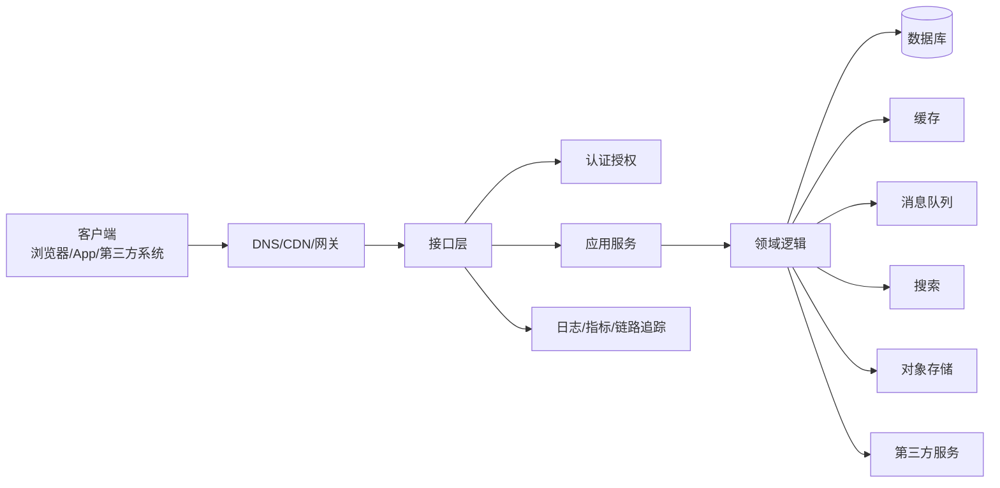

# 01-后端总览、知识地图与学习路线

> 本文目标：建立后端开发的全局地图。读完后应能理解后端到底负责什么、后端系统由哪些部分组成、后端学习为什么不能只学框架、各技术模块之间如何关联，以及如何安排长期学习路线。

## 1. 后端的本质

后端不是“写接口”这么简单。接口只是后端能力暴露出来的一层外壳。真正的后端工作包括业务建模、数据管理、权限控制、系统集成、性能优化、稳定性保障、部署运维和故障排查。

一个后端系统通常要回答这些问题：

- 用户是谁，是否已经登录？
- 用户能不能访问这个资源？
- 请求参数是否合法？
- 这个业务动作是否符合当前状态？
- 数据应该存在哪里？
- 多个数据变更是否需要放在同一个事务里？
- 读数据时是否可以用缓存？
- 写数据后缓存是否需要失效？
- 非核心任务是否可以异步处理？
- 远程服务超时怎么办？
- 请求重复提交怎么办？
- 系统流量过高怎么办？
- 依赖不可用怎么办？
- 出错后如何定位？
- 数据丢失后如何恢复？

从职责上看，后端可以被理解成“业务系统的控制中心”。它连接客户端、数据库、缓存、消息队列、对象存储、搜索引擎、第三方平台、内部服务和运维平台，并负责在这些系统之间维持正确的业务状态。



这个图中每条箭头都可能产生后端问题。例如 API 到数据库慢，可能是索引问题；API 到缓存慢，可能是热点 key；API 到第三方服务慢，可能需要超时、重试、熔断；API 到观察系统没有打点，出问题就无法定位。

## 2. 后端系统的基本组成

后端系统可以拆成若干层，每一层都有自己的职责。

| 层级 | 主要职责 | 常见组件 |
| --- | --- | --- |
| 接入层 | 接收外部请求、路由、限流、TLS、反向代理 | CDN、Nginx、API Gateway、Load Balancer |
| 协议层 | 解析 HTTP/RPC/WebSocket、处理序列化 | REST、gRPC、GraphQL、JSON、Protobuf |
| 认证授权层 | 识别身份、判断权限 | Cookie、Session、Token、OAuth、RBAC、ABAC |
| 应用层 | 编排用例、管理事务、调用领域逻辑 | Application Service、Use Case |
| 领域层 | 表达业务规则和状态变化 | Entity、Value Object、Aggregate、Domain Event |
| 数据访问层 | 屏蔽存储细节 | Repository、DAO、ORM、SQL Mapper |
| 基础设施层 | 连接外部技术组件 | DB、Redis、MQ、对象存储、搜索引擎、第三方 API |
| 观测层 | 输出系统运行信号 | Logs、Metrics、Traces、Profiling |
| 运维层 | 构建、部署、扩缩容、回滚 | CI/CD、Docker、Kubernetes、配置中心 |

初学后端时，经常会把所有东西写在一个接口函数里：参数校验、权限判断、SQL、缓存、业务规则、消息发送、日志、第三方调用混在一起。短期看很快，长期看很难维护。分层的意义不是“显得高级”，而是让变化被隔离：接口格式变了不影响核心业务，数据库表变了不影响 API 契约，第三方服务变了不影响领域规则。

## 3. 后端的核心质量目标

后端系统的质量不只看功能是否能跑。一个真实系统要同时考虑正确性、可用性、性能、安全、可维护性和成本。

| 目标 | 解释 | 典型问题 |
| --- | --- | --- |
| 正确性 | 业务结果必须正确 | 库存不能超卖、余额不能扣错、权限不能越权 |
| 可用性 | 用户需要时服务可用 | 机器故障、网络抖动、依赖不可用时系统如何表现 |
| 可靠性 | 故障发生后状态仍可恢复 | 消息是否丢失、数据是否可恢复、任务是否可重试 |
| 性能 | 在目标流量下响应足够快 | P95/P99 是否稳定、数据库是否扛得住 |
| 可扩展性 | 用户、数据、团队增长后能演进 | 是否能水平扩容、是否能拆分服务 |
| 安全性 | 保护数据、接口和用户身份 | 登录、权限、加密、防注入、防重放、防泄露 |
| 可维护性 | 代码和架构长期可修改 | 模块边界、测试、文档、规范、可读性 |
| 可观测性 | 出问题时能定位 | 日志、指标、链路追踪、告警 |
| 成本效率 | 用合理资源满足目标 | 机器、存储、带宽、数据库、缓存成本 |

这些目标之间存在冲突。例如强一致性通常会牺牲一部分性能和可用性；缓存能提升性能，但会引入一致性问题；微服务提升团队自治，但引入分布式复杂度；多活容灾提高可用性，但成本明显增加。

后端设计不是寻找“唯一正确架构”，而是在业务目标、团队能力、预算、时间和风险之间做权衡。

## 4. 后端学习的知识域

### 4.1 网络与协议

网络是所有后端请求的基础。后端不一定要成为网络协议专家，但必须理解 DNS、TCP、TLS、HTTP、WebSocket、反向代理、负载均衡、长连接、超时和重试。

为什么重要：

- 请求慢不一定是代码慢，可能是 DNS、TLS、网络抖动或连接池耗尽。
- 502、503、504 这类错误常常发生在网关和上游服务之间。
- 长连接、Keep-Alive、连接池会显著影响性能。
- HTTPS 证书过期会导致系统直接不可用。

### 4.2 API 设计

API 是后端和客户端、后端和后端之间的契约。设计差的 API 会导致客户端难用、版本难演进、错误难定位、权限难控制。

需要掌握：

- REST、RPC、GraphQL 的差异。
- HTTP 方法和状态码语义。
- 分页、排序、过滤。
- 错误码和错误响应结构。
- 幂等设计。
- API 版本管理。
- Webhook 和回调签名。

### 4.3 数据库与数据建模

数据库是后端最核心的基础设施。很多后端问题本质上是数据问题：表设计不合理、索引缺失、事务边界错误、隔离级别误解、慢查询、锁等待、数据增长失控。

需要掌握：

- 关系模型。
- 主键、外键、唯一约束。
- 索引和执行计划。
- 事务 ACID。
- 隔离级别和并发异常。
- MVCC。
- 分库分表。
- 数据归档和备份。

### 4.4 缓存

缓存是性能优化的重要手段，但也是事故高发区。缓存带来的问题包括脏数据、穿透、击穿、雪崩、热点 key、大 key、缓存污染和多级缓存失效。

需要掌握：

- Cache-Aside、Read-Through、Write-Through、Write-Behind。
- 本地缓存和分布式缓存。
- TTL、淘汰策略和预热。
- 缓存一致性。
- 布隆过滤器。
- 多级缓存。
- HTTP/CDN 缓存。

### 4.5 消息队列与异步

消息队列让系统从同步调用转为异步处理，常用于削峰、解耦、最终一致和任务处理。它的难点不是发送消息，而是处理重复、乱序、失败、积压、幂等和补偿。

需要掌握：

- Producer、Consumer、Topic、Queue、Partition、Offset。
- At most once、At least once、Exactly once。
- 消费者组。
- 重试和死信队列。
- 本地消息表和 Outbox。
- 事务消息。
- 幂等消费。

### 4.6 并发与分布式

后端系统天然并发。一个服务实例内部有线程、协程、事件循环、锁、连接池和队列；多个服务实例之间有复制、分片、服务发现、负载均衡、分布式锁、分布式事务和一致性问题。

需要掌握：

- 并发、并行、同步、异步、阻塞、非阻塞。
- 线程池、连接池、队列、背压。
- 锁、乐观锁、悲观锁、分布式锁。
- CAP、BASE、最终一致。
- 复制、分片、故障转移。
- 微服务拆分和服务治理。

### 4.7 安全

安全不是一个附加功能，而是后端系统的基础属性。任何接口都可能被恶意调用，任何参数都可能被构造，任何 Token 都可能泄露，任何权限判断都可能被绕过。

需要掌握：

- 认证与授权。
- Cookie、Session、Token、JWT。
- OAuth 2.0 和 OpenID Connect。
- RBAC、ABAC。
- OWASP API Security Top 10。
- SQL 注入、XSS、CSRF、SSRF、重放攻击。
- 密钥管理和审计。

### 4.8 可观测性、性能与运维

系统上线后，最重要的问题是：它是否健康？如果不健康，怎么知道哪里出了问题？

需要掌握：

- 日志、指标、链路追踪。
- RED、USE、四大黄金信号。
- 告警和 SLO。
- 压测和容量规划。
- Docker、Kubernetes、CI/CD。
- 灰度发布、回滚、故障演练。

## 5. 初学者常见误解

### 5.1 “会框架就是会后端”

框架能帮你快速写接口、连接数据库、做依赖注入和配置路由，但框架不能替你理解事务、索引、缓存一致性、幂等、重试、限流、鉴权和系统设计。一个只会框架的人，在系统规模变大后会很快遇到瓶颈。

正确理解是：框架是工具，后端知识是底层能力。学框架时要反向追问它封装了什么问题。

### 5.2 “加缓存就能提升性能”

缓存只有在命中率足够高、数据可接受短暂不一致、key 设计合理、容量足够、失效策略清楚时才有价值。盲目加缓存可能导致读到旧数据、内存爆、热点 key、缓存雪崩，甚至因为缓存和数据库不一致产生严重业务事故。

### 5.3 “微服务一定比单体高级”

微服务解决的是复杂组织和复杂系统演进问题，不是所有项目的默认答案。单体架构在小团队、早期产品、业务变化快的时候通常更简单。更合理的路径是先做模块化单体，边界清楚后再拆服务。

### 5.4 “重试能提高可靠性”

重试能缓解偶发失败，但在系统过载时会放大流量。如果没有超时、退避、抖动、最大次数和幂等设计，重试可能把局部故障扩大成全局故障。

### 5.5 “接口返回 200 就表示设计正确”

接口正确性包括状态码、业务错误码、权限、幂等、日志、追踪、超时、错误语义、版本兼容和安全性。只返回 200 会让客户端和监控系统难以区分成功、失败、限流、权限问题和服务异常。

## 6. 后端学习路线

### 6.1 第一阶段：请求响应和数据库

目标：能理解并实现一个普通业务接口。

学习内容：

- HTTP 请求和响应。
- URL、Header、Body、状态码。
- REST API。
- 参数校验。
- 统一错误响应。
- Cookie、Session、Token。
- 关系型数据库。
- SQL 基础。
- 主键、唯一约束、索引。
- 事务基本概念。

实践项目：

- 用户注册登录。
- 文章发布和评论。
- 商品列表和详情。
- 简单后台管理系统。

关键能力：

- 知道接口如何设计。
- 知道数据如何存储。
- 知道基本权限如何校验。
- 知道错误如何返回。

### 6.2 第二阶段：工程化和中间件

目标：能把业务系统写得可维护、可扩展。

学习内容：

- 分层架构。
- DTO、Entity、Repository。
- 配置管理。
- 日志。
- 缓存。
- 消息队列。
- 定时任务。
- 文件上传。
- API 文档。
- 代码评审。

实践项目：

- 订单系统。
- 通知系统。
- 文件管理系统。
- 带缓存的商品系统。
- 异步任务处理系统。

关键能力：

- 知道如何拆分模块。
- 知道缓存如何设计。
- 知道消息重复消费如何处理。
- 知道定时任务多实例下如何避免重复。

### 6.3 第三阶段：高并发和分布式

目标：能理解系统在高流量和多节点下的复杂问题。

学习内容：

- 线程池和连接池。
- 限流、熔断、降级。
- 分布式锁。
- 分布式事务。
- CAP、BASE、最终一致。
- 服务发现。
- API 网关。
- 多级缓存。
- 分库分表。
- 消息积压处理。

实践项目：

- 秒杀系统。
- 高并发投票系统。
- 订单超时自动关闭。
- 支付回调处理。
- 多服务用户订单系统。

关键能力：

- 知道为什么会出现雪崩。
- 知道如何处理重复请求。
- 知道如何设计最终一致。
- 知道如何保护下游系统。

### 6.4 第四阶段：稳定性、安全和运维

目标：能让系统稳定上线、可观察、可恢复。

学习内容：

- 日志、指标、链路追踪。
- SLO、SLI、SLA。
- 压测和容量规划。
- Docker 和 Kubernetes。
- CI/CD。
- 灰度发布和回滚。
- OAuth、OIDC、JWT。
- OWASP API Security。
- 备份和容灾。
- 故障演练。

实践项目：

- 给已有系统补齐监控。
- 做一次压测和容量评估。
- 做一次灰度发布方案。
- 做一次故障演练。
- 做一份接口安全检查清单。

关键能力：

- 知道如何定位接口变慢。
- 知道如何设计告警。
- 知道如何安全发布。
- 知道如何恢复数据。

## 7. 后端知识的串联场景

### 7.1 登录场景

登录看起来简单，实际涉及很多知识：

- HTTP 表单或 JSON 请求。
- 密码传输必须走 HTTPS。
- 密码存储必须哈希加盐，不能明文。
- 登录失败要限流，防暴力破解。
- 登录成功生成 Session 或 Token。
- Token 要设置过期时间。
- Cookie 要考虑 HttpOnly、Secure、SameSite。
- 登录日志要记录设备、IP、时间。
- 异常登录要触发风控。

### 7.2 下单场景

下单涉及：

- 参数校验。
- 用户权限。
- 商品状态。
- 库存扣减。
- 价格快照。
- 优惠计算。
- 订单创建事务。
- 幂等提交。
- 支付状态。
- 消息队列异步通知。
- 超时未支付关闭订单。
- 库存回滚。

这个场景能串联数据库事务、状态机、消息队列、幂等、定时任务、分布式一致性和故障补偿。

### 7.3 商品详情页

商品详情页涉及：

- CDN 缓存静态资源。
- 应用本地缓存热点配置。
- Redis 缓存商品详情。
- 数据库作为权威数据源。
- 商品更新后删除缓存。
- 热点商品预热。
- 缓存击穿保护。
- 图片走对象存储和 CDN。
- 推荐模块可降级。

这个场景能串联多级缓存、缓存一致性、热点保护和降级。

### 7.4 支付回调

支付回调涉及：

- Webhook 签名验证。
- 回调重复发送。
- 支付流水唯一约束。
- 订单状态机。
- 幂等处理。
- 数据库事务。
- 消息通知。
- 对账补偿。
- 审计日志。

这个场景能串联安全、幂等、事务、消息和最终一致。

## 8. 学习方法

后端学习最有效的方法是“概念 + 场景 + 实验 + 复盘”。

概念：先知道一个技术解决什么问题，例如缓存是为减少重复查询，消息队列是为异步解耦，分布式锁是为跨节点互斥。

场景：把概念放进业务，例如商品详情用缓存，下单用事务和幂等，支付回调用签名和状态机。

实验：自己制造问题，例如让数据库慢查询、让缓存失效、让消息重复消费、让下游超时，看系统表现。

复盘：写出问题原因、影响范围、临时修复、长期修复和监控指标。

## 9. 本章小结

后端是一套系统能力，不是单一框架技能。要从请求链路、接口契约、业务建模、数据管理、缓存、异步、分布式、安全、可观测性和部署运维多个角度理解系统。学习顺序建议从 HTTP 和数据库开始，再进入工程化、中间件、高并发、分布式、安全和运维。

## 10. 参考资料

- The Twelve-Factor App: https://12factor.net/
- Martin Fowler Microservices: https://martinfowler.com/articles/microservices.html
- Google SRE Workbook: https://sre.google/workbook/
- OpenTelemetry Documentation: https://opentelemetry.io/docs/
- Kubernetes Concepts: https://kubernetes.io/docs/concepts/
- OWASP API Security Top 10 2023: https://owasp.org/API-Security/editions/2023/en/0x11-t10/

<!-- research-notes: enhanced-v1 -->

## 研究笔记增强

> Last reviewed: 2026-06-17。此节用于把《01-后端总览、知识地图与学习路线》从阅读笔记推进到可复习、可实践、可验证的研究笔记；具体版本、参数和环境仍需结合官方资料、项目约束和实测结果校准。

### 知识定位

围绕业务建模、接口契约、数据一致性、并发控制、可观测性和运维发布建立整体视角。

### 重点补充
- 为接口定义幂等性、鉴权、限流、超时、重试、错误码和审计日志。
- 理解事务边界、索引选择、缓存一致性和异步消息失败补偿。
- 通过日志、指标、追踪和告警定位线上问题。
- 明确适用场景、限制条件、替代方案和迁移成本。

### 实践清单
- 为本章整理一张概念关系图、流程图或最小系统图。
- 写一个最小可运行示例，并保留运行命令、输入、输出和环境版本。
- 列出常见错误、排查命令、关键日志和修复动作。
- 补充安全、性能、兼容性、可维护性和上线运维注意事项。
- 用一次真实问题或练习项目复盘验证笔记是否可用。

### 常见误区
- 只摘抄定义或命令，没有记录上下文、前提条件和边界。
- 只记录成功路径，不记录失败样本、异常现象和排查过程。
- 没有版本、环境和数据样本，导致后续无法复现。
- 把教程默认值直接用于真实项目，没有结合约束重新评估。

### 复盘问题
- 学完《01-后端总览、知识地图与学习路线》后，能否用自己的话说明它解决什么问题、不解决什么问题？
- 如果要在真实项目中使用，需要哪些前置条件、依赖版本、输入数据和验证手段？
- 失败时最先检查哪三类证据：日志、指标、抓包、堆栈、配置、样本还是硬件测量？
- 有没有形成可重复的最小实验、测试用例或排查命令？

### 延伸方向
- 官方文档和版本变更记录。
- 同类技术、框架或方案对比。
- 面向真实项目的最小实践。
- 故障排查清单和复盘案例库。

### 复盘记录模板

```text
主题：01-后端总览、知识地图与学习路线
日期：
目标：本次要验证或掌握的具体问题
环境：系统 / 语言 / 框架 / 工具 / 设备 / 版本
步骤：最小可复现流程
现象：成功输出、失败输出、日志、指标或测量数据
分析：为什么会出现该现象，和哪些概念相关
结论：可复用的规则、命令、配置或设计取舍
风险：边界条件、性能、安全、兼容性或维护成本
下一步：继续实验、补充资料或应用到项目
```
