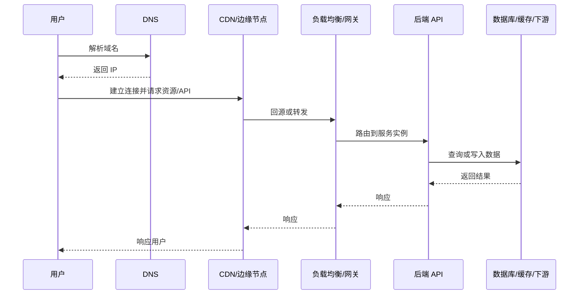

# 02-网络、HTTP 与 API 设计

> 本文目标：系统理解后端请求如何通过网络到达服务，HTTP 如何表达请求和响应，API 如何设计成稳定、清晰、可演进的契约，以及 REST、RPC、GraphQL、WebSocket、SSE、Webhook 等接口形式各自适合什么场景。

<!-- lecture-notes:integrated-v2 -->

## 讲义导读：把后端当成一条请求生命线

这一章讲的是 **网络、HTTP 与 API 设计**。阅读时不要只背框架名、组件名或面试题答案，而要把每个概念放回一条请求生命线里：请求如何进入系统，如何被认证和校验，业务规则在哪里执行，数据如何保持一致，慢操作如何异步化，故障如何被观测，变更如何安全上线。后端学习的目标不是堆技术栈，而是能设计、实现、排查和维护一个长期运行的业务系统。

### 一句话先懂

API 设计的核心是契约：客户端和服务端要对方法、路径、状态码、错误、版本、幂等和缓存语义有稳定约定。

### 通俗类比

HTTP API 像服务窗口的办理规则：不同窗口办不同业务，材料不全要给明确原因，重复提交不能重复扣款，窗口临时关闭也要有可理解的提示。

类比只是帮助建立第一印象。回到工程上，要把类比里的入口、调度、仓库、通道、监控和维护分别对应到 API、业务层、数据库、缓存、消息队列、可观测性和部署运维。后端概念只有放进真实链路，才知道它解决的是正确性、性能、安全、可靠性、可维护性还是成本问题。

### 本章学习主线

1. **先看职责**：这个概念负责处理请求链路里的哪一段，输入和输出是什么。
2. **再看边界**：它不负责什么，哪些问题应该交给数据库、缓存、队列、网关、客户端或运维平台。
3. **然后看失败**：超时、重复、乱序、并发、脏数据、权限绕过、容量耗尽时会发生什么。
4. **接着看验证**：怎样用单元测试、集成测试、压测、日志、指标、trace 或故障演练证明设计可靠。
5. **最后看演进**：需求变更、流量增长、团队协作和版本升级时，这个设计是否还能维护。

### 概念怎么学才不容易忘

遇到后端概念时，建议按 白话职责 -> 链路位置 -> 最小例子 -> 常见事故 -> 观测信号 -> 修复策略 六步理解。比如缓存不是加速器这么简单，还要看命中率、TTL、一致性、热点 key 和失效策略；消息队列不是异步这么简单，还要看确认、重试、幂等、积压和补偿；JWT 不是登录态这么简单，还要看签名、过期、撤销、泄露和权限边界。

### 最小实践任务

设计一个创建订单 API，写出方法、路径、请求体、响应体、状态码、错误码、幂等键、超时和重试语义。

实践时要故意设计失败场景：重复请求、数据库超时、缓存失效、消息重复、权限不足、发布回滚、下游服务不可用。后端能力往往不是在正常路径里体现，而是在异常路径里体现。

### 读完本章应该能做到

- 用自己的话解释本章概念在后端请求链路中的位置。
- 画出最小流程图，标清入口、处理、存储、副作用、返回和观测点。
- 说出至少三个常见失败模式，以及对应的日志、指标或 trace 信号。
- 给出一个可落地的小设计，并说明它的事务、幂等、安全和回滚边界。
- 能解释 DNS、TCP、TLS、HTTP、状态码、缓存头、REST/RPC/GraphQL 的边界，并能设计可演进的 API 契约。

> 本节是讲义化阅读入口，后续正文中的协议、架构、数据库、缓存、消息、安全、运维和案例都应围绕这条请求生命线来理解。

## 1. 请求从哪里来

一次后端请求通常不是“客户端直接调用服务代码”这么简单。真实链路可能是：



这个链路中每一层都可能影响后端表现：

- DNS 解析失败，用户根本找不到服务。
- CDN 缓存策略错误，用户看到旧数据或敏感数据泄露。
- 网关路由错误，请求进入错误服务。
- 负载均衡健康检查错误，流量打到坏实例。
- API 线程池耗尽，请求排队。
- 数据库慢查询，接口超时。
- 下游服务不可用，引发重试风暴。

所以后端工程师至少要知道请求链路中每一段的职责。

## 2. DNS

DNS 负责把域名解析成 IP 地址。用户访问 `example.com` 时，客户端并不知道服务在哪里，需要先通过 DNS 查询。

### 2.1 DNS 常见记录

| 记录 | 含义 | 例子 |
| --- | --- | --- |
| A | 域名到 IPv4 | `example.com -> 93.184.216.34` |
| AAAA | 域名到 IPv6 | `example.com -> 2606:...` |
| CNAME | 域名别名 | `www.example.com -> example.com` |
| MX | 邮件服务器 | 邮箱投递 |
| TXT | 文本记录 | 域名验证、SPF、DKIM |
| NS | 权威 DNS 服务器 | 指定谁管理域名 |

### 2.2 TTL

TTL 表示 DNS 记录可缓存多久。

TTL 太长：

- 域名切换慢。
- 故障迁移慢。
- 旧 IP 可能被客户端继续使用。

TTL 太短：

- DNS 查询压力增加。
- 解析链路更频繁。

工程上要根据场景选择。稳定域名可以长一点，故障切换敏感的入口域名可以短一点。但要注意，客户端、操作系统、运行时、代理和递归 DNS 都可能缓存结果，不是你把 TTL 改短就一定立刻全网生效。

## 3. TCP、UDP 与 QUIC

### 3.1 TCP

TCP 是可靠、有序、面向连接的传输协议。HTTP/1.1 和 HTTP/2 通常运行在 TCP 上。

TCP 提供：

- 连接建立。
- 顺序传输。
- 丢包重传。
- 流量控制。
- 拥塞控制。

后端关注点：

- 连接建立有成本，因此需要连接复用。
- 大量短连接会增加握手和关闭开销。
- 网络丢包会导致重传和延迟抖动。
- 连接池配置会影响吞吐。
- TIME_WAIT、CLOSE_WAIT 异常可能说明连接管理有问题。

### 3.2 UDP

UDP 无连接、不保证可靠和顺序。它开销小，适合实时性要求高、应用层可处理丢包的场景。

常见场景：

- 音视频。
- 游戏。
- DNS。
- QUIC 底层。

普通业务 API 通常不直接用 UDP。

### 3.3 QUIC

QUIC 基于 UDP，在传输层和安全层做了新的设计。HTTP/3 使用 QUIC。它的目标包括减少握手延迟、改善队头阻塞问题、支持连接迁移。

后端学习时可以先知道：

- HTTP/3 不是简单的 HTTP/2 小版本升级。
- QUIC 对移动网络切换更友好。
- 不是所有基础设施都完整支持 HTTP/3。

## 4. TLS 与 HTTPS

HTTPS 是 HTTP over TLS。TLS 解决三个问题：

- 机密性：中间人不能直接看到明文。
- 完整性：传输内容不能被无声篡改。
- 身份认证：客户端能确认服务端证书属于目标域名。

### 4.1 证书链

服务端证书通常由 CA 签发，客户端通过证书链验证信任。

常见问题：

- 证书过期。
- 证书域名不匹配。
- 中间证书缺失。
- 使用弱加密套件。
- 私钥泄露。

后端系统要把证书过期纳入监控。很多严重故障不是代码问题，而是证书到期没人续。

### 4.2 TLS 终止

TLS 终止指在哪一层解密 HTTPS。

常见位置：

- CDN。
- 负载均衡。
- API 网关。
- 应用服务本身。

如果 TLS 在网关终止，网关到应用之间可能是明文，也可能重新加密。内部链路是否加密取决于安全要求、网络边界和基础设施能力。

## 5. HTTP 基础

HTTP 是无状态应用层协议。无状态不代表系统没有状态，而是协议本身不会自动记住上一次请求。状态通常由 Cookie、Session、Token、数据库和缓存维护。

### 5.1 请求结构

一个 HTTP 请求包括：

- 方法：GET、POST、PUT、PATCH、DELETE。
- 路径：资源位置。
- 查询参数：过滤、分页、排序等。
- Header：元信息。
- Body：请求体。

示例：

```http
POST /orders HTTP/1.1
Host: api.example.com
Content-Type: application/json
Authorization: Bearer <token>
Idempotency-Key: 20260616-abc

{
  "skuId": "sku_1001",
  "quantity": 2,
  "addressId": "addr_01"
}
```

后端要处理：

- Header 是否完整。
- Token 是否有效。
- Body 是否可解析。
- 参数是否符合格式。
- 业务规则是否满足。
- 幂等键是否重复。
- 用户是否有权限操作资源。

### 5.2 响应结构

响应包括：

- 状态码。
- Header。
- Body。

示例：

```http
HTTP/1.1 201 Created
Content-Type: application/json
Location: /orders/order_1001
Traceparent: 00-...

{
  "id": "order_1001",
  "status": "CREATED"
}
```

错误响应也应该结构化：

```json
{
  "code": "ORDER_STOCK_NOT_ENOUGH",
  "message": "库存不足",
  "requestId": "req_123",
  "details": {
    "skuId": "sku_1001"
  }
}
```

不要把内部异常堆栈、SQL、服务器路径或密钥信息返回给客户端。

## 6. HTTP 方法

| 方法 | 语义 | 是否安全 | 是否幂等 | 常见用途 |
| --- | --- | --- | --- | --- |
| GET | 获取资源 | 是 | 是 | 查询列表、详情 |
| HEAD | 获取响应头 | 是 | 是 | 检查资源是否存在或是否变化 |
| POST | 提交处理 | 否 | 通常否 | 创建资源、提交动作 |
| PUT | 整体替换 | 否 | 是 | 替换完整资源 |
| PATCH | 局部更新 | 否 | 不一定 | 修改部分字段 |
| DELETE | 删除资源 | 否 | 是 | 删除资源 |
| OPTIONS | 查询能力 | 是 | 是 | CORS 预检 |

### 6.1 安全方法

安全方法指语义上不应该修改服务端资源。GET 和 HEAD 是安全方法。后端不要设计 `GET /deleteUser?id=1` 这种接口，因为浏览器、爬虫、代理、预加载系统可能自动发 GET 请求。

### 6.2 幂等方法

幂等指同一个请求执行一次和执行多次，对资源最终状态的影响相同。

例如：

- `PUT /users/1` 把用户名字设置成 “Alice”，执行多次结果一样。
- `DELETE /users/1` 删除用户，执行多次用户最终都不存在。
- `POST /orders` 创建订单，执行多次可能创建多个订单，因此默认不幂等。

对于支付、下单、转账、发放优惠券这类 POST 动作，必须做业务幂等。

## 7. HTTP 状态码

状态码是协议级结果，不应该被完全替代为“永远 200 + 业务 code”。

### 7.1 常用状态码

| 状态码 | 含义 | 场景 |
| --- | --- | --- |
| 200 | 成功 | 查询成功、普通操作成功 |
| 201 | 已创建 | 创建资源成功 |
| 202 | 已接受 | 异步任务已提交 |
| 204 | 无响应体 | 删除成功但不返回内容 |
| 301 | 永久重定向 | URL 永久迁移 |
| 302 | 临时重定向 | 临时跳转 |
| 304 | 未修改 | 协商缓存命中 |
| 400 | 请求格式错误 | JSON 错误、参数格式错误 |
| 401 | 未认证 | 未登录、Token 无效 |
| 403 | 无权限 | 已登录但无权访问 |
| 404 | 不存在 | 路径或资源不存在 |
| 409 | 冲突 | 重复创建、版本冲突 |
| 422 | 语义错误 | 业务校验失败 |
| 429 | 请求过多 | 限流 |
| 500 | 内部错误 | 未预期异常 |
| 502 | 网关错误 | 上游返回错误 |
| 503 | 服务不可用 | 过载、维护、熔断 |
| 504 | 网关超时 | 上游超时 |

### 7.2 401 与 403

401 是“你还没有证明你是谁”或凭证无效。403 是“我知道你是谁，但你没有权限”。

例如：

- 未携带 Token 访问用户资料：401。
- 普通用户访问管理员接口：403。
- 用户访问别人的订单：403 或 404，具体取决于是否想隐藏资源存在性。

### 7.3 409 与幂等

409 表示请求和当前资源状态冲突。例如：

- 创建用户名时用户名已经存在。
- 使用旧版本号更新资源。
- 订单已经支付，不能取消。

409 常和状态机、乐观锁、唯一约束一起出现。

## 8. Header 设计

Header 用于传递元数据。常见 Header：

| Header | 用途 |
| --- | --- |
| Content-Type | 请求或响应体类型 |
| Accept | 客户端期望响应类型 |
| Authorization | 认证凭证 |
| Cookie | 浏览器携带状态 |
| Set-Cookie | 服务端设置 Cookie |
| Cache-Control | 缓存策略 |
| ETag | 资源版本 |
| If-None-Match | 协商缓存 |
| Location | 新资源地址或重定向地址 |
| Retry-After | 告诉客户端多久后重试 |
| Idempotency-Key | 幂等键 |
| Traceparent | W3C Trace Context |
| X-Request-ID | 请求 ID |

### 8.1 Content-Type

`Content-Type` 必须和 Body 格式一致。常见值：

- `application/json`
- `application/x-www-form-urlencoded`
- `multipart/form-data`
- `text/plain`
- `application/octet-stream`

文件上传通常使用 `multipart/form-data` 或直传对象存储。

### 8.2 Authorization

常见格式：

```http
Authorization: Bearer <access_token>
```

注意：

- Token 不要放 URL 查询参数。
- Token 不要写入普通日志。
- Token 要通过 HTTPS 传输。

### 8.3 X-Forwarded-For

代理常用 `X-Forwarded-For` 记录原始 IP。但客户端也可以伪造这个头。后端只有在请求来自可信网关时，才能信任由网关整理后的客户端 IP。

## 9. Cookie、Session 与 Token

### 9.1 Cookie

Cookie 是浏览器保存并自动携带的小段数据。

重要属性：

| 属性 | 作用 |
| --- | --- |
| HttpOnly | 禁止 JavaScript 读取，降低 XSS 窃取风险 |
| Secure | 只在 HTTPS 发送 |
| SameSite | 降低 CSRF 风险 |
| Domain | Cookie 生效域名 |
| Path | Cookie 生效路径 |
| Max-Age/Expires | 过期时间 |

Cookie 适合浏览器场景，但要注意 CSRF。

### 9.2 Session

Session 的思路是：客户端只保存 Session ID，服务端保存完整会话状态。

优点：

- 服务端可主动失效。
- 敏感信息不暴露给客户端。
- 权限变更后较易控制。

缺点：

- 多实例需要共享 Session 存储。
- Session 存储故障会影响登录态。
- 高并发下 Session 存储会成为压力点。

### 9.3 Token

Token 由客户端保存并在请求中携带。

优点：

- 适合移动端和 API。
- 服务端可无状态验证某些 Token。
- 跨域和跨服务更灵活。

缺点：

- Token 泄露即身份泄露。
- 撤销和续期复杂。
- 长 Token 增加网络开销。

## 10. REST API 设计

REST 的重点是资源。

### 10.1 资源命名

推荐：

```text
GET    /users
GET    /users/{userId}
POST   /users
PATCH  /users/{userId}
DELETE /users/{userId}

GET    /users/{userId}/orders
GET    /orders/{orderId}
POST   /orders
POST   /orders/{orderId}/cancel
```

动作型接口不是完全不能出现。现实中很多业务动作很难表达成简单 CRUD，例如取消订单、支付订单、审核通过。可以使用子资源或动作端点，但要保持语义清晰。

### 10.2 分页

常见分页方式：

| 方式 | 示例 | 优点 | 缺点 |
| --- | --- | --- | --- |
| page/size | `?page=1&size=20` | 简单 | 深分页慢，数据变动时可能重复/遗漏 |
| offset/limit | `?offset=0&limit=20` | 通用 | 深分页慢 |
| cursor | `?cursor=xxx&limit=20` | 性能好，适合滚动加载 | 实现稍复杂 |

数据量大时优先考虑 cursor 分页。

### 10.3 过滤和排序

示例：

```text
GET /orders?status=PAID&createdAfter=2026-01-01&sort=-createdAt
```

注意：

- 过滤字段要白名单。
- 排序字段要白名单。
- 不允许客户端随意拼 SQL。
- 大范围查询要限制时间窗口和分页。

### 10.4 错误响应

统一错误结构很重要：

```json
{
  "code": "USER_NOT_FOUND",
  "message": "用户不存在",
  "requestId": "req_001"
}
```

错误码应该稳定，不要频繁改。错误消息可以面向用户，也可以面向开发者，但要区分内部日志和外部响应。

## 11. RPC API

RPC 强调调用动作，常用于内部服务通信。

示例：

```text
UserService.GetUser
OrderService.CreateOrder
PaymentService.Refund
```

### 11.1 RPC 优点

- 契约清晰。
- 代码生成方便。
- 二进制协议性能好。
- 内部服务调用效率高。

### 11.2 RPC 风险

远程调用不是本地调用。它会：

- 失败。
- 超时。
- 返回部分错误。
- 被重试。
- 产生网络延迟。
- 在下游过载时加剧雪崩。

RPC 接口必须设计超时、重试、熔断、限流和版本兼容。

## 12. GraphQL

GraphQL 允许客户端声明需要哪些字段。

适合：

- 前端页面字段组合复杂。
- 多端字段需求不同。
- 后端需要聚合多个资源。

风险：

- 查询复杂度难控制。
- 容易出现 N+1 查询。
- 缓存复杂。
- 权限需要字段级控制。
- 深层嵌套查询可能拖垮服务。

GraphQL 要配套：

- 查询深度限制。
- 查询复杂度限制。
- DataLoader 类批量加载机制。
- 字段级权限。
- 超时和限流。

## 13. WebSocket、SSE 与 Webhook

### 13.1 WebSocket

WebSocket 是双向长连接。适合：

- 聊天。
- 协作编辑。
- 实时通知。
- 游戏。
- 实时控制。

后端注意：

- 连接数可能很多。
- 要处理心跳和断线重连。
- 要处理消息顺序和重复。
- 要限制单连接发送频率。
- 横向扩容时需要连接路由或消息广播。

### 13.2 SSE

SSE 是服务端向浏览器单向推送事件。适合：

- 日志流。
- 任务进度。
- 通知。
- 简单实时数据。

优点是比 WebSocket 简单，浏览器支持事件流。但它主要是服务端到客户端，不适合复杂双向通信。

### 13.3 Webhook

Webhook 是一个系统主动调用另一个系统的回调接口。

典型场景：

- 支付结果通知。
- 代码仓库 push 事件。
- 第三方审核结果。
- 物流状态变更。

Webhook 必须考虑：

- 签名验证。
- 时间戳和防重放。
- 幂等。
- 重试。
- 死信或人工补偿。
- 事件版本。

## 14. CORS

CORS 是浏览器安全策略，不是后端之间通信的通用限制。当前端页面从一个源访问另一个源的 API 时，浏览器会检查 CORS。

常见 Header：

- `Access-Control-Allow-Origin`
- `Access-Control-Allow-Methods`
- `Access-Control-Allow-Headers`
- `Access-Control-Allow-Credentials`

注意：

- 带凭证请求不能随便使用 `*`。
- CORS 配置过宽可能造成安全风险。
- CORS 只限制浏览器，不限制 curl、后端服务或攻击脚本直接请求。

## 15. API 版本管理

版本管理是为了让 API 能演进而不破坏旧客户端。

### 15.1 兼容变化

通常兼容：

- 响应新增字段。
- 新增可选请求参数。
- 新增枚举值但旧客户端能忽略。

通常不兼容：

- 删除字段。
- 改字段类型。
- 改字段含义。
- 改错误码语义。
- 必填字段变更。

### 15.2 版本方式

| 方式 | 示例 |
| --- | --- |
| URL 版本 | `/v1/users` |
| Header 版本 | `Accept: application/vnd.example.v1+json` |
| 查询参数 | `?version=1` |
| 兼容演进 | 不显式暴露版本，靠兼容规则演进 |

内部系统也需要版本意识。服务之间强依赖时，接口变更要有灰度和兼容期。

## 16. 幂等设计

幂等是 API 设计中最重要的工程概念之一。

### 16.1 为什么重复请求一定会发生

重复请求来源：

- 用户重复点击。
- 客户端超时后重试。
- 网关重试。
- 服务端重试。
- 消息队列重复投递。
- 第三方回调重复发送。
- 网络超时导致调用方不知道结果。

如果没有幂等，下单、支付、退款、发券、发货都可能出严重问题。

### 16.2 幂等方案

| 方案 | 说明 |
| --- | --- |
| Idempotency-Key | 客户端提交唯一请求键 |
| 业务唯一号 | 订单号、支付流水号、退款单号 |
| 数据库唯一约束 | 从存储层防重复 |
| 幂等记录表 | 记录请求处理状态和结果 |
| 状态机 | 限制非法状态转换 |
| 乐观锁 | 版本号防并发覆盖 |

### 16.3 幂等记录状态

幂等记录可以设计为：

| 状态 | 含义 |
| --- | --- |
| PROCESSING | 正在处理 |
| SUCCESS | 已成功，可返回相同结果 |
| FAILED_RETRYABLE | 失败但可重试 |
| FAILED_FINAL | 失败且不可重试 |

注意：

- 幂等记录写入要和业务动作有一致性设计。
- 成功结果最好能重复返回。
- 幂等记录要设置过期或归档。

## 17. API 安全基本要求

每个 API 至少要考虑：

- 是否需要登录？
- 是否需要角色权限？
- 是否需要对象级权限？
- 参数是否校验？
- 是否有限流？
- 是否有审计日志？
- 是否会泄露敏感信息？
- 是否能被重复提交？
- 是否有超时和资源限制？

对象级权限尤其重要。例如 `GET /orders/{id}` 不能只判断用户已登录，还要判断这个订单是否属于当前用户，或者当前用户是否有管理权限。

## 18. API 设计检查清单

设计一个接口时可以检查：

- 路径是否表达资源或动作？
- HTTP 方法是否符合语义？
- 状态码是否合理？
- 请求字段是否有类型、范围和必填说明？
- 响应字段是否稳定？
- 错误码是否可枚举？
- 是否需要分页、排序、过滤？
- 是否需要幂等？
- 是否需要鉴权和授权？
- 是否需要限流？
- 是否需要审计？
- 是否需要版本兼容？
- 是否有超时预期？
- 是否有请求 ID 和链路追踪？

## 19. 本章小结

网络、HTTP 和 API 是后端的入口能力。掌握它们不是为了背协议，而是为了设计清晰契约、减少歧义、提升可维护性，并在请求失败、超时、限流、越权、缓存和版本演进时做出正确判断。

## 20. 参考资料

- RFC 9110 HTTP Semantics: https://www.rfc-editor.org/rfc/rfc9110.html
- RFC 9111 HTTP Caching: https://datatracker.ietf.org/doc/rfc9111/
- MDN HTTP Status Codes: https://developer.mozilla.org/en-US/docs/Web/HTTP/Reference/Status
- MDN CORS: https://developer.mozilla.org/en-US/docs/Web/HTTP/Guides/CORS
- W3C Trace Context: https://www.w3.org/TR/trace-context/
- OpenAPI Specification: https://spec.openapis.org/oas/latest.html

## 2026 后端资料与工程核对补充

后端基础概念相对稳定，但规范、组件版本和安全风险会持续变化。复现实践前，建议记录运行时版本、框架版本、数据库版本、缓存和消息队列版本、容器镜像、Kubernetes 版本、云厂商组件、配置文件、迁移脚本和压测环境。不要只记录代码提交，还要记录依赖和运行条件。

学习后端时建议优先核对官方规范和项目文档：HTTP 语义看 RFC 9110，HTTP 缓存看 RFC 9111，API 安全风险看 OWASP API Security Top 10，观测体系看 OpenTelemetry，数据库事务和索引看对应数据库官方文档，容器编排看 Kubernetes 官方文档。社区文章适合补充事故经验和踩坑案例，但不能替代规范和官方文档。

### 资料入口

- RFC 9110 HTTP Semantics: https://www.rfc-editor.org/rfc/rfc9110.html
- RFC 9111 HTTP Caching: https://www.rfc-editor.org/rfc/rfc9111.html
- MDN HTTP reference: https://developer.mozilla.org/en-US/docs/Web/HTTP
- OWASP API Security Top 10 2023: https://owasp.org/API-Security/editions/2023/en/0x11-t10/
- OpenTelemetry documentation: https://opentelemetry.io/docs/
- PostgreSQL documentation: https://www.postgresql.org/docs/current/
- Redis documentation: https://redis.io/docs/latest/
- Apache Kafka documentation: https://kafka.apache.org/documentation/
- Kubernetes documentation: https://kubernetes.io/docs/home/
- The Twelve-Factor App: https://12factor.net/

API 章节要特别核对 HTTP 方法、状态码、缓存头、条件请求、重试和幂等语义。接口不是只返回 JSON，状态码和错误语义会直接影响客户端、网关、监控和缓存行为。

<!-- AUTO_EXPANDED_TO_REFERENCE_LENGTH_2026_06_23 -->

## 万字精讲扩展：网络、HTTP与API设计

> 本节为按参考笔记篇幅补充的系统化扩展内容，目标是把原有笔记从“知识点记录”扩展为“概念、原理、流程、工程实践、常见误区和复盘清单”完整学习材料。

### 精讲扩展 1：网络、HTTP与API设计 的分层模型、帧格式 与工程化理解

学习 $topic 时，不能只把它当成一个孤立知识点来背诵，而要把它放到 $category 的完整问题链条里理解。一个知识点通常同时包含概念定义、适用边界、输入输出、运行过程、常见异常和工程取舍。真正掌握它，意味着看到一个具体场景时，能够判断它解决什么问题、依赖哪些前提、失败时会出现什么现象，以及应该用什么手段验证自己的判断。

从 $a 的角度看，最重要的是先建立清晰的对象模型。也就是明确系统里有哪些参与者、它们之间如何连接、数据或控制信号如何流动、哪些环节是同步的、哪些环节是异步的、哪些状态是临时状态、哪些状态需要长期保存。很多初学问题并不是公式不会、API 不熟，而是对象边界不清：把配置当成状态，把结果当成过程，把局部现象当成全局规律。写笔记时建议始终追问：这个概念的主体是谁，输入是什么，输出是什么，中间约束是什么，错误会在哪里暴露。

从 $b 的角度看，流程比单点知识更关键。一个成熟方案通常不是单个技巧，而是一组步骤：先确定目标，再拆分约束，然后选择工具，最后通过测试和复盘确认效果。比如在实际项目中，不能只问“怎么实现”，还要问“为什么要这样实现”“有没有更简单的替代方案”“边界条件是什么”“数据量、并发量、实时性、可靠性变化后还能不能工作”。这种流程意识能够避免把学习停留在教程层面，也能让后续排错有明确路线。

$topic 的 $c 往往决定它在真实项目中的稳定性。理论上可行的方案，到了工程环境中会受到数据质量、硬件条件、依赖版本、网络环境、团队协作、部署方式和维护成本影响。写代码或做设计时，应该把正常路径和异常路径同时考虑：正常情况下如何运行，输入为空怎么办，超时怎么办，重复执行怎么办，部分成功怎么办，版本升级后兼容性怎么办，日志和指标如何证明系统确实按预期工作。

进一步看 $d，它通常对应性能、可靠性或可维护性的核心矛盾。很多技术选择并没有绝对正确答案，只有是否适合当前约束。例如追求极致性能可能牺牲可读性，追求高度抽象可能增加调试成本，追求快速交付可能留下技术债，追求完全通用可能让简单场景变复杂。高质量笔记应该把这些取舍写出来，而不是只给一个“推荐方案”。推荐方案背后的条件越清楚，迁移到新场景时越不容易误用。

最后从 $e 的角度进行复盘，可以把知识从“看懂”推进到“会用”。建议为 $topic 建立三个层次的检查：第一层是概念检查，确认术语、流程和边界没有混淆；第二层是实践检查，确认能够独立完成一个最小案例；第三层是工程检查，确认这个案例在异常、规模、性能和维护方面经得起追问。每次学习完一个章节，都可以用这三层检查反向补齐笔记。

#### 典型场景拆解

在真实场景中，$topic 通常会经历“需求出现、方案选择、实现落地、问题暴露、持续优化”几个阶段。需求出现时，要先判断这个需求属于基础能力、性能优化、体验改进、可靠性建设还是长期架构演进。不同类型的需求对方案的评价标准不同：基础能力看正确性，性能优化看指标，体验改进看路径是否顺滑，可靠性建设看故障时能否降级和恢复，架构演进看未来变化是否容易吸收。

方案选择阶段，最容易犯的错误是直接套用熟悉工具。更稳妥的方式是列出约束：数据规模、时延要求、资源预算、团队熟悉度、运维能力、安全要求、可测试性和长期维护成本。只有把约束列清楚，才能解释为什么选择当前方案。否则方案看似高级，实际可能只是增加了复杂度。

实现落地阶段，要把 $a 和 $b 拆成可验证的小步骤。每一步都应该有明确的输入、输出和检查方式。对学习笔记而言，这意味着不能只有大段概念，还应该补充流程图式的文字描述、伪代码、命令示例、参数解释、错误现象和排查路径。这样以后复习时，笔记不仅能帮助理解，也能直接指导实践。

问题暴露阶段，要优先区分“理解错误、实现错误、环境错误、数据错误、依赖错误、边界条件错误”。很多复杂问题之所以难排，是因为一开始就把问题归因到错误层级。例如把配置问题当成算法问题，把权限问题当成代码问题，把数据分布变化当成模型失效，把硬件噪声当成软件逻辑错误。好的排查顺序应该从可观测事实开始，而不是从猜测开始。

持续优化阶段，不应只追求把当前问题压下去，还要沉淀成规则。比如记录触发条件、影响范围、定位方法、最终修复、预防措施和可监控指标。这样下一次出现类似问题时，团队可以复用经验，而不是重新从零排查。

#### 常见误区与纠偏

第一个误区是只记结论，不记前提。$topic 中很多结论都是有条件的：适用于小规模，不一定适用于大规模；适用于离线处理，不一定适用于实时系统；适用于单机环境，不一定适用于分布式环境；适用于教学案例，不一定适用于生产项目。纠偏方法是在每个重要结论后面补一句“适用条件”和“不适用情况”。

第二个误区是只关注工具，不关注模型。工具会变化，模型更稳定。无论工具名称如何变化，底层仍然要解决输入建模、状态管理、资源调度、错误恢复、性能约束和质量验证这些问题。学习 $topic 时，应该把工具用法和底层模型分开记录：工具命令解决“怎么做”，底层模型解释“为什么这样做”。

第三个误区是没有验证意识。很多笔记写得很完整，但没有说明如何确认自己做对了。对于 $category 相关主题，验证至少应包含最小样例、边界样例、异常样例和性能样例。最小样例证明流程跑通，边界样例证明理解完整，异常样例证明系统可恢复，性能样例证明方案在目标规模下仍然可用。

第四个误区是忽略可维护性。短期学习时，能跑通就容易产生掌握的错觉；长期使用时，命名、分层、注释、测试、日志、版本管理和文档才会决定知识能否转化为稳定能力。扩充 $topic 笔记时，应把“如何写得清楚、如何排查、如何交接、如何复盘”也纳入内容。

#### 学习与实践建议

建议围绕 $topic 做一个小型闭环练习：先用自己的话解释概念，再画出流程，再实现一个最小案例，然后主动制造一个错误并排查，最后写下复盘。这个过程看起来比直接读资料慢，但能显著提高迁移能力。很多人学完后不会用，根本原因是缺少“从概念到问题再到验证”的闭环。

复习时可以使用四个问题：它解决什么问题；它依赖什么条件；它失败时有什么表现；它如何被验证。只要这四个问题能回答清楚，说明对 $topic 的理解已经从表层进入工程层。如果回答不清楚，就回到对应章节补充例子、边界和排错方法。
### 精讲扩展 2：网络、HTTP与API设计 的帧格式、握手流程 与工程化理解

学习 $topic 时，不能只把它当成一个孤立知识点来背诵，而要把它放到 $category 的完整问题链条里理解。一个知识点通常同时包含概念定义、适用边界、输入输出、运行过程、常见异常和工程取舍。真正掌握它，意味着看到一个具体场景时，能够判断它解决什么问题、依赖哪些前提、失败时会出现什么现象，以及应该用什么手段验证自己的判断。

从 $a 的角度看，最重要的是先建立清晰的对象模型。也就是明确系统里有哪些参与者、它们之间如何连接、数据或控制信号如何流动、哪些环节是同步的、哪些环节是异步的、哪些状态是临时状态、哪些状态需要长期保存。很多初学问题并不是公式不会、API 不熟，而是对象边界不清：把配置当成状态，把结果当成过程，把局部现象当成全局规律。写笔记时建议始终追问：这个概念的主体是谁，输入是什么，输出是什么，中间约束是什么，错误会在哪里暴露。

从 $b 的角度看，流程比单点知识更关键。一个成熟方案通常不是单个技巧，而是一组步骤：先确定目标，再拆分约束，然后选择工具，最后通过测试和复盘确认效果。比如在实际项目中，不能只问“怎么实现”，还要问“为什么要这样实现”“有没有更简单的替代方案”“边界条件是什么”“数据量、并发量、实时性、可靠性变化后还能不能工作”。这种流程意识能够避免把学习停留在教程层面，也能让后续排错有明确路线。

$topic 的 $c 往往决定它在真实项目中的稳定性。理论上可行的方案，到了工程环境中会受到数据质量、硬件条件、依赖版本、网络环境、团队协作、部署方式和维护成本影响。写代码或做设计时，应该把正常路径和异常路径同时考虑：正常情况下如何运行，输入为空怎么办，超时怎么办，重复执行怎么办，部分成功怎么办，版本升级后兼容性怎么办，日志和指标如何证明系统确实按预期工作。

进一步看 $d，它通常对应性能、可靠性或可维护性的核心矛盾。很多技术选择并没有绝对正确答案，只有是否适合当前约束。例如追求极致性能可能牺牲可读性，追求高度抽象可能增加调试成本，追求快速交付可能留下技术债，追求完全通用可能让简单场景变复杂。高质量笔记应该把这些取舍写出来，而不是只给一个“推荐方案”。推荐方案背后的条件越清楚，迁移到新场景时越不容易误用。

最后从 $e 的角度进行复盘，可以把知识从“看懂”推进到“会用”。建议为 $topic 建立三个层次的检查：第一层是概念检查，确认术语、流程和边界没有混淆；第二层是实践检查，确认能够独立完成一个最小案例；第三层是工程检查，确认这个案例在异常、规模、性能和维护方面经得起追问。每次学习完一个章节，都可以用这三层检查反向补齐笔记。

#### 典型场景拆解

在真实场景中，$topic 通常会经历“需求出现、方案选择、实现落地、问题暴露、持续优化”几个阶段。需求出现时，要先判断这个需求属于基础能力、性能优化、体验改进、可靠性建设还是长期架构演进。不同类型的需求对方案的评价标准不同：基础能力看正确性，性能优化看指标，体验改进看路径是否顺滑，可靠性建设看故障时能否降级和恢复，架构演进看未来变化是否容易吸收。

方案选择阶段，最容易犯的错误是直接套用熟悉工具。更稳妥的方式是列出约束：数据规模、时延要求、资源预算、团队熟悉度、运维能力、安全要求、可测试性和长期维护成本。只有把约束列清楚，才能解释为什么选择当前方案。否则方案看似高级，实际可能只是增加了复杂度。

实现落地阶段，要把 $a 和 $b 拆成可验证的小步骤。每一步都应该有明确的输入、输出和检查方式。对学习笔记而言，这意味着不能只有大段概念，还应该补充流程图式的文字描述、伪代码、命令示例、参数解释、错误现象和排查路径。这样以后复习时，笔记不仅能帮助理解，也能直接指导实践。

问题暴露阶段，要优先区分“理解错误、实现错误、环境错误、数据错误、依赖错误、边界条件错误”。很多复杂问题之所以难排，是因为一开始就把问题归因到错误层级。例如把配置问题当成算法问题，把权限问题当成代码问题，把数据分布变化当成模型失效，把硬件噪声当成软件逻辑错误。好的排查顺序应该从可观测事实开始，而不是从猜测开始。

持续优化阶段，不应只追求把当前问题压下去，还要沉淀成规则。比如记录触发条件、影响范围、定位方法、最终修复、预防措施和可监控指标。这样下一次出现类似问题时，团队可以复用经验，而不是重新从零排查。

#### 常见误区与纠偏

第一个误区是只记结论，不记前提。$topic 中很多结论都是有条件的：适用于小规模，不一定适用于大规模；适用于离线处理，不一定适用于实时系统；适用于单机环境，不一定适用于分布式环境；适用于教学案例，不一定适用于生产项目。纠偏方法是在每个重要结论后面补一句“适用条件”和“不适用情况”。

第二个误区是只关注工具，不关注模型。工具会变化，模型更稳定。无论工具名称如何变化，底层仍然要解决输入建模、状态管理、资源调度、错误恢复、性能约束和质量验证这些问题。学习 $topic 时，应该把工具用法和底层模型分开记录：工具命令解决“怎么做”，底层模型解释“为什么这样做”。

第三个误区是没有验证意识。很多笔记写得很完整，但没有说明如何确认自己做对了。对于 $category 相关主题，验证至少应包含最小样例、边界样例、异常样例和性能样例。最小样例证明流程跑通，边界样例证明理解完整，异常样例证明系统可恢复，性能样例证明方案在目标规模下仍然可用。

第四个误区是忽略可维护性。短期学习时，能跑通就容易产生掌握的错觉；长期使用时，命名、分层、注释、测试、日志、版本管理和文档才会决定知识能否转化为稳定能力。扩充 $topic 笔记时，应把“如何写得清楚、如何排查、如何交接、如何复盘”也纳入内容。

#### 学习与实践建议

建议围绕 $topic 做一个小型闭环练习：先用自己的话解释概念，再画出流程，再实现一个最小案例，然后主动制造一个错误并排查，最后写下复盘。这个过程看起来比直接读资料慢，但能显著提高迁移能力。很多人学完后不会用，根本原因是缺少“从概念到问题再到验证”的闭环。

复习时可以使用四个问题：它解决什么问题；它依赖什么条件；它失败时有什么表现；它如何被验证。只要这四个问题能回答清楚，说明对 $topic 的理解已经从表层进入工程层。如果回答不清楚，就回到对应章节补充例子、边界和排错方法。
### 精讲扩展 3：网络、HTTP与API设计 的握手流程、可靠性 与工程化理解

学习 $topic 时，不能只把它当成一个孤立知识点来背诵，而要把它放到 $category 的完整问题链条里理解。一个知识点通常同时包含概念定义、适用边界、输入输出、运行过程、常见异常和工程取舍。真正掌握它，意味着看到一个具体场景时，能够判断它解决什么问题、依赖哪些前提、失败时会出现什么现象，以及应该用什么手段验证自己的判断。

从 $a 的角度看，最重要的是先建立清晰的对象模型。也就是明确系统里有哪些参与者、它们之间如何连接、数据或控制信号如何流动、哪些环节是同步的、哪些环节是异步的、哪些状态是临时状态、哪些状态需要长期保存。很多初学问题并不是公式不会、API 不熟，而是对象边界不清：把配置当成状态，把结果当成过程，把局部现象当成全局规律。写笔记时建议始终追问：这个概念的主体是谁，输入是什么，输出是什么，中间约束是什么，错误会在哪里暴露。

从 $b 的角度看，流程比单点知识更关键。一个成熟方案通常不是单个技巧，而是一组步骤：先确定目标，再拆分约束，然后选择工具，最后通过测试和复盘确认效果。比如在实际项目中，不能只问“怎么实现”，还要问“为什么要这样实现”“有没有更简单的替代方案”“边界条件是什么”“数据量、并发量、实时性、可靠性变化后还能不能工作”。这种流程意识能够避免把学习停留在教程层面，也能让后续排错有明确路线。

$topic 的 $c 往往决定它在真实项目中的稳定性。理论上可行的方案，到了工程环境中会受到数据质量、硬件条件、依赖版本、网络环境、团队协作、部署方式和维护成本影响。写代码或做设计时，应该把正常路径和异常路径同时考虑：正常情况下如何运行，输入为空怎么办，超时怎么办，重复执行怎么办，部分成功怎么办，版本升级后兼容性怎么办，日志和指标如何证明系统确实按预期工作。

进一步看 $d，它通常对应性能、可靠性或可维护性的核心矛盾。很多技术选择并没有绝对正确答案，只有是否适合当前约束。例如追求极致性能可能牺牲可读性，追求高度抽象可能增加调试成本，追求快速交付可能留下技术债，追求完全通用可能让简单场景变复杂。高质量笔记应该把这些取舍写出来，而不是只给一个“推荐方案”。推荐方案背后的条件越清楚，迁移到新场景时越不容易误用。

最后从 $e 的角度进行复盘，可以把知识从“看懂”推进到“会用”。建议为 $topic 建立三个层次的检查：第一层是概念检查，确认术语、流程和边界没有混淆；第二层是实践检查，确认能够独立完成一个最小案例；第三层是工程检查，确认这个案例在异常、规模、性能和维护方面经得起追问。每次学习完一个章节，都可以用这三层检查反向补齐笔记。

#### 典型场景拆解

在真实场景中，$topic 通常会经历“需求出现、方案选择、实现落地、问题暴露、持续优化”几个阶段。需求出现时，要先判断这个需求属于基础能力、性能优化、体验改进、可靠性建设还是长期架构演进。不同类型的需求对方案的评价标准不同：基础能力看正确性，性能优化看指标，体验改进看路径是否顺滑，可靠性建设看故障时能否降级和恢复，架构演进看未来变化是否容易吸收。

方案选择阶段，最容易犯的错误是直接套用熟悉工具。更稳妥的方式是列出约束：数据规模、时延要求、资源预算、团队熟悉度、运维能力、安全要求、可测试性和长期维护成本。只有把约束列清楚，才能解释为什么选择当前方案。否则方案看似高级，实际可能只是增加了复杂度。

实现落地阶段，要把 $a 和 $b 拆成可验证的小步骤。每一步都应该有明确的输入、输出和检查方式。对学习笔记而言，这意味着不能只有大段概念，还应该补充流程图式的文字描述、伪代码、命令示例、参数解释、错误现象和排查路径。这样以后复习时，笔记不仅能帮助理解，也能直接指导实践。

问题暴露阶段，要优先区分“理解错误、实现错误、环境错误、数据错误、依赖错误、边界条件错误”。很多复杂问题之所以难排，是因为一开始就把问题归因到错误层级。例如把配置问题当成算法问题，把权限问题当成代码问题，把数据分布变化当成模型失效，把硬件噪声当成软件逻辑错误。好的排查顺序应该从可观测事实开始，而不是从猜测开始。

持续优化阶段，不应只追求把当前问题压下去，还要沉淀成规则。比如记录触发条件、影响范围、定位方法、最终修复、预防措施和可监控指标。这样下一次出现类似问题时，团队可以复用经验，而不是重新从零排查。

#### 常见误区与纠偏

第一个误区是只记结论，不记前提。$topic 中很多结论都是有条件的：适用于小规模，不一定适用于大规模；适用于离线处理，不一定适用于实时系统；适用于单机环境，不一定适用于分布式环境；适用于教学案例，不一定适用于生产项目。纠偏方法是在每个重要结论后面补一句“适用条件”和“不适用情况”。

第二个误区是只关注工具，不关注模型。工具会变化，模型更稳定。无论工具名称如何变化，底层仍然要解决输入建模、状态管理、资源调度、错误恢复、性能约束和质量验证这些问题。学习 $topic 时，应该把工具用法和底层模型分开记录：工具命令解决“怎么做”，底层模型解释“为什么这样做”。

第三个误区是没有验证意识。很多笔记写得很完整，但没有说明如何确认自己做对了。对于 $category 相关主题，验证至少应包含最小样例、边界样例、异常样例和性能样例。最小样例证明流程跑通，边界样例证明理解完整，异常样例证明系统可恢复，性能样例证明方案在目标规模下仍然可用。

第四个误区是忽略可维护性。短期学习时，能跑通就容易产生掌握的错觉；长期使用时，命名、分层、注释、测试、日志、版本管理和文档才会决定知识能否转化为稳定能力。扩充 $topic 笔记时，应把“如何写得清楚、如何排查、如何交接、如何复盘”也纳入内容。

#### 学习与实践建议

建议围绕 $topic 做一个小型闭环练习：先用自己的话解释概念，再画出流程，再实现一个最小案例，然后主动制造一个错误并排查，最后写下复盘。这个过程看起来比直接读资料慢，但能显著提高迁移能力。很多人学完后不会用，根本原因是缺少“从概念到问题再到验证”的闭环。

复习时可以使用四个问题：它解决什么问题；它依赖什么条件；它失败时有什么表现；它如何被验证。只要这四个问题能回答清楚，说明对 $topic 的理解已经从表层进入工程层。如果回答不清楚，就回到对应章节补充例子、边界和排错方法。
### 精讲扩展 4：网络、HTTP与API设计 的可靠性、流控拥塞 与工程化理解

学习 $topic 时，不能只把它当成一个孤立知识点来背诵，而要把它放到 $category 的完整问题链条里理解。一个知识点通常同时包含概念定义、适用边界、输入输出、运行过程、常见异常和工程取舍。真正掌握它，意味着看到一个具体场景时，能够判断它解决什么问题、依赖哪些前提、失败时会出现什么现象，以及应该用什么手段验证自己的判断。

从 $a 的角度看，最重要的是先建立清晰的对象模型。也就是明确系统里有哪些参与者、它们之间如何连接、数据或控制信号如何流动、哪些环节是同步的、哪些环节是异步的、哪些状态是临时状态、哪些状态需要长期保存。很多初学问题并不是公式不会、API 不熟，而是对象边界不清：把配置当成状态，把结果当成过程，把局部现象当成全局规律。写笔记时建议始终追问：这个概念的主体是谁，输入是什么，输出是什么，中间约束是什么，错误会在哪里暴露。

从 $b 的角度看，流程比单点知识更关键。一个成熟方案通常不是单个技巧，而是一组步骤：先确定目标，再拆分约束，然后选择工具，最后通过测试和复盘确认效果。比如在实际项目中，不能只问“怎么实现”，还要问“为什么要这样实现”“有没有更简单的替代方案”“边界条件是什么”“数据量、并发量、实时性、可靠性变化后还能不能工作”。这种流程意识能够避免把学习停留在教程层面，也能让后续排错有明确路线。

$topic 的 $c 往往决定它在真实项目中的稳定性。理论上可行的方案，到了工程环境中会受到数据质量、硬件条件、依赖版本、网络环境、团队协作、部署方式和维护成本影响。写代码或做设计时，应该把正常路径和异常路径同时考虑：正常情况下如何运行，输入为空怎么办，超时怎么办，重复执行怎么办，部分成功怎么办，版本升级后兼容性怎么办，日志和指标如何证明系统确实按预期工作。

进一步看 $d，它通常对应性能、可靠性或可维护性的核心矛盾。很多技术选择并没有绝对正确答案，只有是否适合当前约束。例如追求极致性能可能牺牲可读性，追求高度抽象可能增加调试成本，追求快速交付可能留下技术债，追求完全通用可能让简单场景变复杂。高质量笔记应该把这些取舍写出来，而不是只给一个“推荐方案”。推荐方案背后的条件越清楚，迁移到新场景时越不容易误用。

最后从 $e 的角度进行复盘，可以把知识从“看懂”推进到“会用”。建议为 $topic 建立三个层次的检查：第一层是概念检查，确认术语、流程和边界没有混淆；第二层是实践检查，确认能够独立完成一个最小案例；第三层是工程检查，确认这个案例在异常、规模、性能和维护方面经得起追问。每次学习完一个章节，都可以用这三层检查反向补齐笔记。

#### 典型场景拆解

在真实场景中，$topic 通常会经历“需求出现、方案选择、实现落地、问题暴露、持续优化”几个阶段。需求出现时，要先判断这个需求属于基础能力、性能优化、体验改进、可靠性建设还是长期架构演进。不同类型的需求对方案的评价标准不同：基础能力看正确性，性能优化看指标，体验改进看路径是否顺滑，可靠性建设看故障时能否降级和恢复，架构演进看未来变化是否容易吸收。

方案选择阶段，最容易犯的错误是直接套用熟悉工具。更稳妥的方式是列出约束：数据规模、时延要求、资源预算、团队熟悉度、运维能力、安全要求、可测试性和长期维护成本。只有把约束列清楚，才能解释为什么选择当前方案。否则方案看似高级，实际可能只是增加了复杂度。

实现落地阶段，要把 $a 和 $b 拆成可验证的小步骤。每一步都应该有明确的输入、输出和检查方式。对学习笔记而言，这意味着不能只有大段概念，还应该补充流程图式的文字描述、伪代码、命令示例、参数解释、错误现象和排查路径。这样以后复习时，笔记不仅能帮助理解，也能直接指导实践。

问题暴露阶段，要优先区分“理解错误、实现错误、环境错误、数据错误、依赖错误、边界条件错误”。很多复杂问题之所以难排，是因为一开始就把问题归因到错误层级。例如把配置问题当成算法问题，把权限问题当成代码问题，把数据分布变化当成模型失效，把硬件噪声当成软件逻辑错误。好的排查顺序应该从可观测事实开始，而不是从猜测开始。

持续优化阶段，不应只追求把当前问题压下去，还要沉淀成规则。比如记录触发条件、影响范围、定位方法、最终修复、预防措施和可监控指标。这样下一次出现类似问题时，团队可以复用经验，而不是重新从零排查。

#### 常见误区与纠偏

第一个误区是只记结论，不记前提。$topic 中很多结论都是有条件的：适用于小规模，不一定适用于大规模；适用于离线处理，不一定适用于实时系统；适用于单机环境，不一定适用于分布式环境；适用于教学案例，不一定适用于生产项目。纠偏方法是在每个重要结论后面补一句“适用条件”和“不适用情况”。

第二个误区是只关注工具，不关注模型。工具会变化，模型更稳定。无论工具名称如何变化，底层仍然要解决输入建模、状态管理、资源调度、错误恢复、性能约束和质量验证这些问题。学习 $topic 时，应该把工具用法和底层模型分开记录：工具命令解决“怎么做”，底层模型解释“为什么这样做”。

第三个误区是没有验证意识。很多笔记写得很完整，但没有说明如何确认自己做对了。对于 $category 相关主题，验证至少应包含最小样例、边界样例、异常样例和性能样例。最小样例证明流程跑通，边界样例证明理解完整，异常样例证明系统可恢复，性能样例证明方案在目标规模下仍然可用。

第四个误区是忽略可维护性。短期学习时，能跑通就容易产生掌握的错觉；长期使用时，命名、分层、注释、测试、日志、版本管理和文档才会决定知识能否转化为稳定能力。扩充 $topic 笔记时，应把“如何写得清楚、如何排查、如何交接、如何复盘”也纳入内容。

#### 学习与实践建议

建议围绕 $topic 做一个小型闭环练习：先用自己的话解释概念，再画出流程，再实现一个最小案例，然后主动制造一个错误并排查，最后写下复盘。这个过程看起来比直接读资料慢，但能显著提高迁移能力。很多人学完后不会用，根本原因是缺少“从概念到问题再到验证”的闭环。

复习时可以使用四个问题：它解决什么问题；它依赖什么条件；它失败时有什么表现；它如何被验证。只要这四个问题能回答清楚，说明对 $topic 的理解已经从表层进入工程层。如果回答不清楚，就回到对应章节补充例子、边界和排错方法。
### 精讲扩展 5：网络、HTTP与API设计 的流控拥塞、寻址路由 与工程化理解

学习 $topic 时，不能只把它当成一个孤立知识点来背诵，而要把它放到 $category 的完整问题链条里理解。一个知识点通常同时包含概念定义、适用边界、输入输出、运行过程、常见异常和工程取舍。真正掌握它，意味着看到一个具体场景时，能够判断它解决什么问题、依赖哪些前提、失败时会出现什么现象，以及应该用什么手段验证自己的判断。

从 $a 的角度看，最重要的是先建立清晰的对象模型。也就是明确系统里有哪些参与者、它们之间如何连接、数据或控制信号如何流动、哪些环节是同步的、哪些环节是异步的、哪些状态是临时状态、哪些状态需要长期保存。很多初学问题并不是公式不会、API 不熟，而是对象边界不清：把配置当成状态，把结果当成过程，把局部现象当成全局规律。写笔记时建议始终追问：这个概念的主体是谁，输入是什么，输出是什么，中间约束是什么，错误会在哪里暴露。

从 $b 的角度看，流程比单点知识更关键。一个成熟方案通常不是单个技巧，而是一组步骤：先确定目标，再拆分约束，然后选择工具，最后通过测试和复盘确认效果。比如在实际项目中，不能只问“怎么实现”，还要问“为什么要这样实现”“有没有更简单的替代方案”“边界条件是什么”“数据量、并发量、实时性、可靠性变化后还能不能工作”。这种流程意识能够避免把学习停留在教程层面，也能让后续排错有明确路线。

$topic 的 $c 往往决定它在真实项目中的稳定性。理论上可行的方案，到了工程环境中会受到数据质量、硬件条件、依赖版本、网络环境、团队协作、部署方式和维护成本影响。写代码或做设计时，应该把正常路径和异常路径同时考虑：正常情况下如何运行，输入为空怎么办，超时怎么办，重复执行怎么办，部分成功怎么办，版本升级后兼容性怎么办，日志和指标如何证明系统确实按预期工作。

进一步看 $d，它通常对应性能、可靠性或可维护性的核心矛盾。很多技术选择并没有绝对正确答案，只有是否适合当前约束。例如追求极致性能可能牺牲可读性，追求高度抽象可能增加调试成本，追求快速交付可能留下技术债，追求完全通用可能让简单场景变复杂。高质量笔记应该把这些取舍写出来，而不是只给一个“推荐方案”。推荐方案背后的条件越清楚，迁移到新场景时越不容易误用。

最后从 $e 的角度进行复盘，可以把知识从“看懂”推进到“会用”。建议为 $topic 建立三个层次的检查：第一层是概念检查，确认术语、流程和边界没有混淆；第二层是实践检查，确认能够独立完成一个最小案例；第三层是工程检查，确认这个案例在异常、规模、性能和维护方面经得起追问。每次学习完一个章节，都可以用这三层检查反向补齐笔记。

#### 典型场景拆解

在真实场景中，$topic 通常会经历“需求出现、方案选择、实现落地、问题暴露、持续优化”几个阶段。需求出现时，要先判断这个需求属于基础能力、性能优化、体验改进、可靠性建设还是长期架构演进。不同类型的需求对方案的评价标准不同：基础能力看正确性，性能优化看指标，体验改进看路径是否顺滑，可靠性建设看故障时能否降级和恢复，架构演进看未来变化是否容易吸收。

方案选择阶段，最容易犯的错误是直接套用熟悉工具。更稳妥的方式是列出约束：数据规模、时延要求、资源预算、团队熟悉度、运维能力、安全要求、可测试性和长期维护成本。只有把约束列清楚，才能解释为什么选择当前方案。否则方案看似高级，实际可能只是增加了复杂度。

实现落地阶段，要把 $a 和 $b 拆成可验证的小步骤。每一步都应该有明确的输入、输出和检查方式。对学习笔记而言，这意味着不能只有大段概念，还应该补充流程图式的文字描述、伪代码、命令示例、参数解释、错误现象和排查路径。这样以后复习时，笔记不仅能帮助理解，也能直接指导实践。

问题暴露阶段，要优先区分“理解错误、实现错误、环境错误、数据错误、依赖错误、边界条件错误”。很多复杂问题之所以难排，是因为一开始就把问题归因到错误层级。例如把配置问题当成算法问题，把权限问题当成代码问题，把数据分布变化当成模型失效，把硬件噪声当成软件逻辑错误。好的排查顺序应该从可观测事实开始，而不是从猜测开始。

持续优化阶段，不应只追求把当前问题压下去，还要沉淀成规则。比如记录触发条件、影响范围、定位方法、最终修复、预防措施和可监控指标。这样下一次出现类似问题时，团队可以复用经验，而不是重新从零排查。

#### 常见误区与纠偏

第一个误区是只记结论，不记前提。$topic 中很多结论都是有条件的：适用于小规模，不一定适用于大规模；适用于离线处理，不一定适用于实时系统；适用于单机环境，不一定适用于分布式环境；适用于教学案例，不一定适用于生产项目。纠偏方法是在每个重要结论后面补一句“适用条件”和“不适用情况”。

第二个误区是只关注工具，不关注模型。工具会变化，模型更稳定。无论工具名称如何变化，底层仍然要解决输入建模、状态管理、资源调度、错误恢复、性能约束和质量验证这些问题。学习 $topic 时，应该把工具用法和底层模型分开记录：工具命令解决“怎么做”，底层模型解释“为什么这样做”。

第三个误区是没有验证意识。很多笔记写得很完整，但没有说明如何确认自己做对了。对于 $category 相关主题，验证至少应包含最小样例、边界样例、异常样例和性能样例。最小样例证明流程跑通，边界样例证明理解完整，异常样例证明系统可恢复，性能样例证明方案在目标规模下仍然可用。

第四个误区是忽略可维护性。短期学习时，能跑通就容易产生掌握的错觉；长期使用时，命名、分层、注释、测试、日志、版本管理和文档才会决定知识能否转化为稳定能力。扩充 $topic 笔记时，应把“如何写得清楚、如何排查、如何交接、如何复盘”也纳入内容。

#### 学习与实践建议

建议围绕 $topic 做一个小型闭环练习：先用自己的话解释概念，再画出流程，再实现一个最小案例，然后主动制造一个错误并排查，最后写下复盘。这个过程看起来比直接读资料慢，但能显著提高迁移能力。很多人学完后不会用，根本原因是缺少“从概念到问题再到验证”的闭环。

复习时可以使用四个问题：它解决什么问题；它依赖什么条件；它失败时有什么表现；它如何被验证。只要这四个问题能回答清楚，说明对 $topic 的理解已经从表层进入工程层。如果回答不清楚，就回到对应章节补充例子、边界和排错方法。
## 扩展复盘清单

- 能否用一句话说明本主题解决的问题。
- 能否列出本主题最重要的输入、输出、约束和失败模式。
- 能否独立完成一个最小实践案例，并解释每一步为什么需要。
- 能否设计边界测试、异常测试和性能测试。
- 能否把本主题和所在技术体系中的其他主题连接起来理解。
