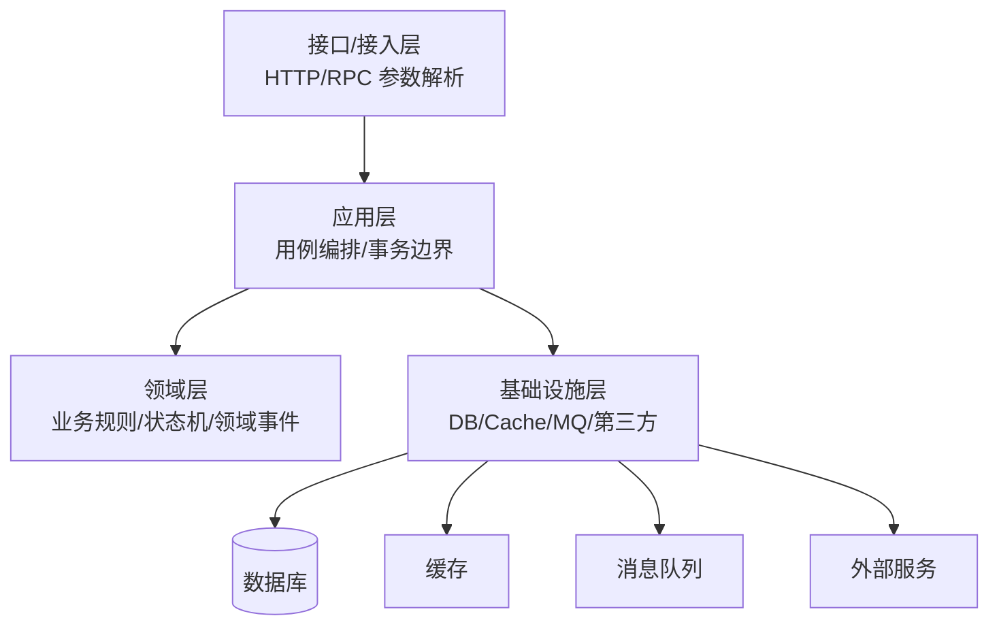
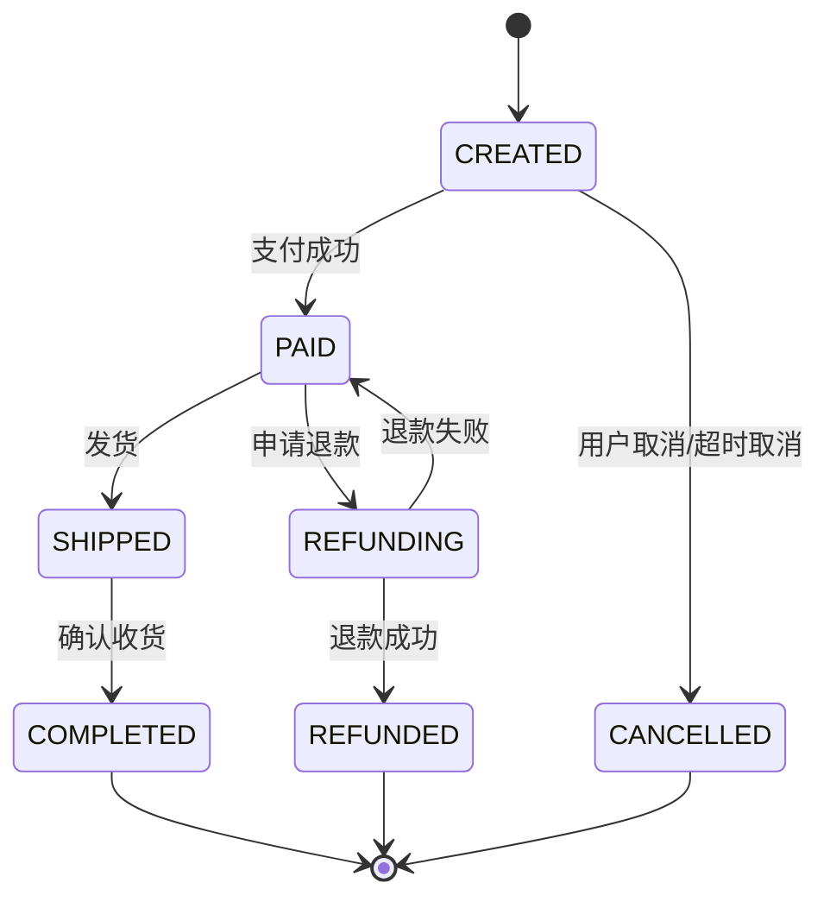

# 03-业务建模、分层架构与工程规范

> 本文目标：理解后端系统如何把业务问题转化成清晰的模型、模块、接口和代码边界。本文不绑定具体语言或框架，重点讲分层架构、领域建模、状态机、DTO/Entity/Repository、错误处理、配置管理、文档、代码评审和工程规范。

<!-- lecture-notes:integrated-v2 -->

## 讲义导读：把后端当成一条请求生命线

这一章讲的是 **业务建模、分层架构与工程规范**。阅读时不要只背框架名、组件名或面试题答案，而要把每个概念放回一条请求生命线里：请求如何进入系统，如何被认证和校验，业务规则在哪里执行，数据如何保持一致，慢操作如何异步化，故障如何被观测，变更如何安全上线。后端学习的目标不是堆技术栈，而是能设计、实现、排查和维护一个长期运行的业务系统。

### 一句话先懂

分层架构的价值不是目录好看，而是把入口协议、业务规则、数据访问、外部调用和工程约束隔离开，让变化不互相污染。

### 通俗类比

像餐厅后厨分工：点餐员不直接翻仓库，厨师不负责收银，采购不决定菜品口味。职责边界清楚，忙起来才不乱。

类比只是帮助建立第一印象。回到工程上，要把类比里的入口、调度、仓库、通道、监控和维护分别对应到 API、业务层、数据库、缓存、消息队列、可观测性和部署运维。后端概念只有放进真实链路，才知道它解决的是正确性、性能、安全、可靠性、可维护性还是成本问题。

### 本章学习主线

1. **先看职责**：这个概念负责处理请求链路里的哪一段，输入和输出是什么。
2. **再看边界**：它不负责什么，哪些问题应该交给数据库、缓存、队列、网关、客户端或运维平台。
3. **然后看失败**：超时、重复、乱序、并发、脏数据、权限绕过、容量耗尽时会发生什么。
4. **接着看验证**：怎样用单元测试、集成测试、压测、日志、指标、trace 或故障演练证明设计可靠。
5. **最后看演进**：需求变更、流量增长、团队协作和版本升级时，这个设计是否还能维护。

### 概念怎么学才不容易忘

遇到后端概念时，建议按 白话职责 -> 链路位置 -> 最小例子 -> 常见事故 -> 观测信号 -> 修复策略 六步理解。比如缓存不是加速器这么简单，还要看命中率、TTL、一致性、热点 key 和失效策略；消息队列不是异步这么简单，还要看确认、重试、幂等、积压和补偿；JWT 不是登录态这么简单，还要看签名、过期、撤销、泄露和权限边界。

### 最小实践任务

把创建订单拆成 Controller、Application Service、Domain、Repository、Message Publisher 和 DTO，并标出每层不该做的事。

实践时要故意设计失败场景：重复请求、数据库超时、缓存失效、消息重复、权限不足、发布回滚、下游服务不可用。后端能力往往不是在正常路径里体现，而是在异常路径里体现。

### 读完本章应该能做到

- 用自己的话解释本章概念在后端请求链路中的位置。
- 画出最小流程图，标清入口、处理、存储、副作用、返回和观测点。
- 说出至少三个常见失败模式，以及对应的日志、指标或 trace 信号。
- 给出一个可落地的小设计，并说明它的事务、幂等、安全和回滚边界。
- 能区分接口层、应用层、领域层、基础设施层、DTO/Entity/VO，并知道事务、校验、权限和日志应该放在哪里。

> 本节是讲义化阅读入口，后续正文中的协议、架构、数据库、缓存、消息、安全、运维和案例都应围绕这条请求生命线来理解。

## 1. 为什么业务建模重要

很多后端系统一开始只是几个接口和几张表，但随着业务增长，问题会逐渐暴露：

- 一个接口里混杂参数校验、权限、业务规则、SQL、缓存和消息发送。
- 多个地方重复实现同一条业务规则。
- 数据库字段直接暴露给前端，表结构一变 API 就跟着变。
- 状态变化没有统一规则，导致订单、支付、退款状态混乱。
- 业务规则依赖大量 if/else，修改时容易漏。
- 外部服务接口变化影响核心业务代码。
- 测试很难写，因为业务逻辑和基础设施耦合在一起。

业务建模的目标是把现实业务中的对象、规则、流程和约束表达成系统可以维护的结构。它不是为了画图或追求复杂概念，而是为了让系统在需求变化时仍然能保持清晰。

## 2. 后端分层的基本思想

分层是为了隔离变化。不同层负责不同问题，不能随意穿透。



常见层次：

| 层 | 主要职责 | 不该做什么 |
| --- | --- | --- |
| 接口层 | 协议适配、参数解析、基础格式校验、响应映射 | 不写复杂业务规则，不直接拼 SQL |
| 应用层 | 编排用例、控制事务、调用领域对象和基础设施 | 不承载细碎领域规则 |
| 领域层 | 表达核心业务规则、状态变化、不变量 | 不依赖 HTTP、数据库、缓存等技术细节 |
| 基础设施层 | 实现数据库、缓存、消息、外部 API 访问 | 不决定业务规则 |
| 共享层 | 通用工具、错误码、基础类型 | 不放业务膨胀代码 |

分层后的好处：

- API 协议变化不会直接影响业务核心。
- 数据库表结构变化可以被 Repository 隔离。
- 第三方接口变化由适配器承担。
- 核心业务逻辑更容易单元测试。
- 权限、事务、日志、错误处理有固定位置。

## 3. MVC、三层架构、洋葱架构、六边形架构

### 3.1 MVC

MVC 常用于 Web 应用：

- Model：数据和业务。
- View：展示。
- Controller：接收请求并调度。

在前后端分离后，View 往往变成前端，后端 Controller 主要负责 API 接入。初学者容易把所有逻辑写进 Controller，这是 MVC 项目常见坏味道。

### 3.2 三层架构

典型三层：

- 表现层：接口和展示。
- 业务逻辑层：业务处理。
- 数据访问层：数据库访问。

三层架构简单清楚，适合多数业务系统。但如果业务复杂，只用 Service 层可能会变成“大 Service”，所有规则都堆进去。

### 3.3 洋葱架构

洋葱架构强调依赖方向指向内部。核心领域层在中心，外部技术细节在外层。

关键思想：

- 领域模型不依赖数据库。
- 领域模型不依赖 Web 框架。
- 外部设施通过接口适配。
- 业务核心稳定，技术细节可替换。

### 3.4 六边形架构

六边形架构也叫 Ports and Adapters。核心系统通过端口定义能力，外部通过适配器接入。

例子：

- 输入端口：创建订单用例。
- 输出端口：订单仓储、支付网关、消息发布器。
- 输入适配器：HTTP Controller、RPC Handler、定时任务。
- 输出适配器：数据库实现、Redis 实现、第三方支付实现。

这种思想适合复杂业务和需要测试隔离的系统。

## 4. 领域驱动设计基础

领域驱动设计（DDD）不是所有系统都必须完整采用，但其中很多概念对后端建模很有用。

### 4.1 领域

领域就是业务问题空间。例如电商领域包含商品、库存、订单、支付、物流、售后、优惠、会员等子领域。

后端建模第一步不是建表，而是理解业务：

- 业务对象是什么？
- 对象之间有什么关系？
- 对象有哪些状态？
- 哪些规则必须永远成立？
- 哪些操作会改变状态？
- 哪些变化需要通知其他系统？

### 4.2 实体 Entity

实体有唯一身份，属性可变。

例子：

- 用户。
- 订单。
- 商品。
- 支付单。
- 退款单。

实体的核心是身份，而不是属性。一个订单修改地址后仍然是同一个订单，因为订单 ID 没变。

### 4.3 值对象 Value Object

值对象没有独立身份，以值相等判断。

例子：

- 金额：数值 + 币种。
- 地址：省市区 + 详细地址。
- 时间范围：开始时间 + 结束时间。
- 坐标：经度 + 纬度。

值对象通常应该不可变。不可变能降低并发和共享带来的问题。

### 4.4 聚合 Aggregate

聚合是一组需要保持强一致的对象边界。聚合根是外部访问聚合的入口。

例子：

- 订单聚合：订单、订单明细、订单价格快照。
- 购物车聚合：购物车、购物车项。

聚合设计原则：

- 聚合内部保持强一致。
- 聚合之间通过 ID 引用，不直接持有对象。
- 一个事务尽量只修改一个聚合。
- 聚合不要设计过大，否则并发和事务成本高。

### 4.5 领域服务

领域服务用于表达不自然属于单个实体的业务规则。

例子：

- 价格计算服务。
- 风控判断服务。
- 库存分配服务。

领域服务不同于应用服务。领域服务包含业务规则，应用服务负责编排流程。

### 4.6 领域事件

领域事件表示业务上已经发生的事实。

例子：

- 用户已注册。
- 订单已创建。
- 支付已成功。
- 库存已扣减。

事件命名通常用过去式，因为事件代表已经发生。

领域事件用途：

- 解耦后续动作。
- 异步通知其他系统。
- 记录业务轨迹。
- 驱动最终一致。

## 5. 业务状态机

状态机是后端业务建模中非常重要的工具。很多业务事故来自状态流转没有统一控制。

### 5.1 订单状态示例



状态机要定义：

- 有哪些状态。
- 哪些状态可以转到哪些状态。
- 每个转移由什么事件触发。
- 每个转移前需要什么条件。
- 每个转移后需要什么副作用。
- 非法状态转移如何处理。

### 5.2 状态机的价值

状态机能防止：

- 已取消订单又支付成功。
- 已退款订单又发货。
- 已完成订单重复完成。
- 支付回调乱序导致状态回退。
- 多个接口各自改状态造成冲突。

### 5.3 状态机与幂等

状态机天然适合幂等处理。比如支付回调重复到达：

- 如果订单是 CREATED，则转为 PAID。
- 如果订单已经是 PAID，则直接返回成功。
- 如果订单是 CANCELLED，则进入异常补偿流程。

这比简单“收到回调就更新状态”更安全。

## 6. DTO、Entity、PO、VO 的边界

不同团队命名可能不同，但核心是分清边界。

| 类型 | 常见含义 | 主要用途 |
| --- | --- | --- |
| Request DTO | 请求对象 | 接口输入 |
| Response DTO | 响应对象 | 接口输出 |
| Command | 用例命令 | 应用层输入 |
| Entity | 领域实体 | 表达业务状态和规则 |
| Value Object | 值对象 | 表达不可变业务值 |
| PO | 持久化对象 | 对应数据库表 |
| View Object | 展示对象 | 面向页面展示 |

### 6.1 为什么不要直接返回数据库对象

直接返回数据库对象的问题：

- 暴露内部字段。
- 数据库表结构变化会影响 API。
- 可能泄露敏感字段。
- API 字段语义受数据库命名限制。
- 无法方便做聚合和裁剪。

例如用户表可能有 `password_hash`、`salt`、`deleted_flag`、`internal_note`，这些绝不能直接返回给客户端。

### 6.2 转换层是否多余

很多初学者觉得 DTO 和 Entity 转来转去很麻烦。确实，在很小的系统中它可能显得啰嗦。但当系统变大后，转换层能隔离：

- 外部协议变化。
- 数据库变化。
- 领域模型变化。
- 安全字段过滤。
- 多端展示差异。

工程上的平衡是：简单 CRUD 可以适当简化，核心业务和对外 API 要保持边界。

## 7. Repository 与数据访问

Repository 的目标是隔离领域逻辑和持久化细节。

领域层关心：

- 保存订单。
- 根据 ID 获取订单。
- 查询用户当前购物车。

不应该关心：

- SQL 怎么写。
- 用哪个 ORM。
- 表如何 join。
- 数据库连接如何获取。

Repository 示例语义：

```text
OrderRepository
  - findById(orderId)
  - save(order)
  - findUnpaidOrdersBefore(time)
```

Repository 不等于简单 DAO。DAO 更偏数据表操作，Repository 更偏聚合和业务对象。

## 8. 应用服务与领域服务

### 8.1 应用服务

应用服务负责用例编排。

创建订单用例可能包括：

1. 校验用户。
2. 查询商品。
3. 校验库存。
4. 计算价格。
5. 创建订单聚合。
6. 保存订单。
7. 发布订单创建事件。

应用服务通常控制事务边界，但不应该承载大量细碎业务规则。

### 8.2 领域服务

领域服务表达核心业务规则。

比如价格计算：

- 商品原价。
- 会员折扣。
- 优惠券。
- 满减。
- 运费。
- 税费。

价格计算规则如果写在 Controller 或应用服务中，会很难复用和测试。独立成领域服务更合适。

## 9. 事务边界

事务边界是业务建模和数据一致性的关键。

原则：

- 一个事务内只放必须强一致的操作。
- 不要在事务内调用慢外部服务。
- 不要在事务内发送不可回滚的消息，除非有事务消息或 Outbox。
- 事务越短越好。
- 大批量处理要拆分。

错误示例：

```text
开启事务
  写订单
  扣库存
  调用第三方支付
  发短信
提交事务
```

问题：

- 第三方支付可能很慢，事务长时间持锁。
- 短信发送成功后事务回滚，外部副作用无法撤销。
- 支付接口超时会导致事务不确定。

更合理：

```text
事务内：
  创建订单
  锁定库存
  写本地消息/事件
提交事务

事务外：
  异步发送通知
  调用后续流程
```

## 10. 错误处理

### 10.1 错误分类

| 类型 | 示例 | 返回建议 |
| --- | --- | --- |
| 参数错误 | 字段缺失、格式错误 | 400 |
| 认证错误 | Token 过期 | 401 |
| 授权错误 | 无权访问资源 | 403 |
| 资源不存在 | 用户、订单不存在 | 404 |
| 业务冲突 | 重复提交、状态不允许 | 409 |
| 业务校验失败 | 库存不足、余额不足 | 422 或业务约定 |
| 限流 | 请求过多 | 429 |
| 依赖失败 | 数据库超时、第三方失败 | 502/503/504 |
| 未预期异常 | 空指针、系统错误 | 500 |

### 10.2 错误码设计

错误码应该：

- 稳定。
- 可枚举。
- 有业务含义。
- 不依赖自然语言。
- 可用于客户端判断。

示例：

```text
USER_NOT_FOUND
ORDER_STATUS_INVALID
PAYMENT_DUPLICATED
STOCK_NOT_ENOUGH
RATE_LIMITED
```

### 10.3 内部错误和外部错误

外部响应要克制，内部日志要详细。

外部：

```json
{
  "code": "ORDER_STATUS_INVALID",
  "message": "当前订单状态不允许取消",
  "requestId": "req_123"
}
```

内部日志：

```text
requestId=req_123 orderId=order_1 currentStatus=SHIPPED targetAction=CANCEL userId=user_9
```

不要把堆栈、SQL、服务器路径、密钥、Token 返回给客户端。

## 11. 配置管理

配置是系统行为的重要部分。常见配置：

- 数据库连接。
- 缓存地址。
- 消息队列地址。
- 超时时间。
- 线程池大小。
- 限流阈值。
- 功能开关。
- 灰度规则。
- 第三方密钥。

### 11.1 配置原则

- 配置和代码分离。
- 敏感配置进入 Secret 或密钥管理系统。
- 配置要有校验。
- 配置变更要审计。
- 重要配置支持灰度和回滚。
- 本地、测试、生产配置差异要清晰。

### 11.2 功能开关

功能开关用于把代码发布和功能上线解耦。

场景：

- 新功能灰度。
- 紧急关闭故障功能。
- 对特定用户开放。
- A/B 测试。

风险：

- 开关太多变成维护负担。
- 老开关不清理导致逻辑复杂。
- 开关默认值错误导致事故。

## 12. 日志规范

日志是排障的重要依据。

### 12.1 应记录什么

- 请求 ID。
- 用户 ID 或匿名主体。
- 业务 ID，如订单号。
- 关键状态变化。
- 外部调用耗时。
- 错误原因。
- 重试次数。
- 降级路径。

### 12.2 不应记录什么

- 明文密码。
- Token。
- 私钥。
- 身份证号完整值。
- 银行卡完整值。
- 过多请求体。

### 12.3 结构化日志

结构化日志比纯文本更易检索：

```json
{
  "level": "INFO",
  "requestId": "req_001",
  "event": "order_created",
  "orderId": "order_1",
  "userId": "user_1",
  "costMs": 35
}
```

## 13. 文档规范

后端常见文档：

- API 文档。
- 数据模型文档。
- 状态机文档。
- 架构图。
- 部署文档。
- 配置说明。
- 故障处理手册。
- 变更记录。

文档应回答：

- 这个系统解决什么问题？
- 核心流程是什么？
- 依赖哪些系统？
- 数据如何流转？
- 出问题怎么排查？
- 如何部署和回滚？

## 14. 代码评审

代码评审不是挑格式，而是控制变更风险。

检查清单：

- 业务规则是否正确？
- 是否有权限校验？
- 是否有对象级授权？
- 是否有幂等？
- 事务边界是否合理？
- 是否在事务中调用外部服务？
- 缓存是否有一致性方案？
- 消息消费是否幂等？
- 远程调用是否有超时？
- 重试是否有上限和退避？
- 错误是否可观测？
- 日志是否泄露敏感信息？
- 是否有测试覆盖关键分支？

## 15. 模块边界

模块边界不清会导致系统腐化。

好边界：

- 模块有明确职责。
- 模块对外提供接口。
- 内部实现可替换。
- 依赖方向清楚。
- 数据所有权明确。

坏边界：

- 所有模块都能直接访问所有表。
- 工具类里藏业务逻辑。
- 一个 Service 调用十几个无关模块。
- 共享对象被所有层修改。
- 循环依赖。

## 16. 常见坏味道

| 坏味道 | 问题 |
| --- | --- |
| 胖 Controller | 接入层承载业务逻辑 |
| 万能 Service | 一个类包含大量无关用例 |
| 贫血模型过度 | 所有规则散落在服务里 |
| 数据库对象直接返回 | 泄露内部结构 |
| 魔法字符串 | 状态和类型难维护 |
| 无状态机 | 业务状态可被随意改 |
| 无统一错误码 | 客户端难处理 |
| 无请求 ID | 排障困难 |
| 事务过大 | 锁等待和回滚成本高 |
| 外部调用无超时 | 资源被长期占用 |

## 17. 本章小结

业务建模和工程规范决定系统能走多远。清晰的分层、稳定的领域模型、明确的状态机、合理的事务边界、统一的错误处理、规范的日志和文档，能显著降低后端系统长期维护成本。

## 18. 参考资料

- Martin Fowler - Patterns of Enterprise Application Architecture: https://martinfowler.com/books/eaa.html
- Martin Fowler - Domain-Driven Design Reference: https://martinfowler.com/tags/domain%20driven%20design.html
- The Twelve-Factor App: https://12factor.net/
- Microsoft Cloud Design Patterns: https://learn.microsoft.com/en-us/azure/architecture/patterns/
- Google SRE Workbook: https://sre.google/workbook/

## 2026 后端资料与工程核对补充

后端基础概念相对稳定，但规范、组件版本和安全风险会持续变化。复现实践前，建议记录运行时版本、框架版本、数据库版本、缓存和消息队列版本、容器镜像、Kubernetes 版本、云厂商组件、配置文件、迁移脚本和压测环境。不要只记录代码提交，还要记录依赖和运行条件。

学习后端时建议优先核对官方规范和项目文档：HTTP 语义看 RFC 9110，HTTP 缓存看 RFC 9111，API 安全风险看 OWASP API Security Top 10，观测体系看 OpenTelemetry，数据库事务和索引看对应数据库官方文档，容器编排看 Kubernetes 官方文档。社区文章适合补充事故经验和踩坑案例，但不能替代规范和官方文档。

### 资料入口

- RFC 9110 HTTP Semantics: https://www.rfc-editor.org/rfc/rfc9110.html
- RFC 9111 HTTP Caching: https://www.rfc-editor.org/rfc/rfc9111.html
- MDN HTTP reference: https://developer.mozilla.org/en-US/docs/Web/HTTP
- OWASP API Security Top 10 2023: https://owasp.org/API-Security/editions/2023/en/0x11-t10/
- OpenTelemetry documentation: https://opentelemetry.io/docs/
- PostgreSQL documentation: https://www.postgresql.org/docs/current/
- Redis documentation: https://redis.io/docs/latest/
- Apache Kafka documentation: https://kafka.apache.org/documentation/
- Kubernetes documentation: https://kubernetes.io/docs/home/
- The Twelve-Factor App: https://12factor.net/

<!-- AUTO_EXPANDED_TO_REFERENCE_LENGTH_2026_06_23 -->

## 万字精讲扩展：业务建模、分层架构与工程规范

> 本节为按参考笔记篇幅补充的系统化扩展内容，目标是把原有笔记从“知识点记录”扩展为“概念、原理、流程、工程实践、常见误区和复盘清单”完整学习材料。

### 精讲扩展 1：业务建模、分层架构与工程规范 的接口设计、领域建模 与工程化理解

学习 $topic 时，不能只把它当成一个孤立知识点来背诵，而要把它放到 $category 的完整问题链条里理解。一个知识点通常同时包含概念定义、适用边界、输入输出、运行过程、常见异常和工程取舍。真正掌握它，意味着看到一个具体场景时，能够判断它解决什么问题、依赖哪些前提、失败时会出现什么现象，以及应该用什么手段验证自己的判断。

从 $a 的角度看，最重要的是先建立清晰的对象模型。也就是明确系统里有哪些参与者、它们之间如何连接、数据或控制信号如何流动、哪些环节是同步的、哪些环节是异步的、哪些状态是临时状态、哪些状态需要长期保存。很多初学问题并不是公式不会、API 不熟，而是对象边界不清：把配置当成状态，把结果当成过程，把局部现象当成全局规律。写笔记时建议始终追问：这个概念的主体是谁，输入是什么，输出是什么，中间约束是什么，错误会在哪里暴露。

从 $b 的角度看，流程比单点知识更关键。一个成熟方案通常不是单个技巧，而是一组步骤：先确定目标，再拆分约束，然后选择工具，最后通过测试和复盘确认效果。比如在实际项目中，不能只问“怎么实现”，还要问“为什么要这样实现”“有没有更简单的替代方案”“边界条件是什么”“数据量、并发量、实时性、可靠性变化后还能不能工作”。这种流程意识能够避免把学习停留在教程层面，也能让后续排错有明确路线。

$topic 的 $c 往往决定它在真实项目中的稳定性。理论上可行的方案，到了工程环境中会受到数据质量、硬件条件、依赖版本、网络环境、团队协作、部署方式和维护成本影响。写代码或做设计时，应该把正常路径和异常路径同时考虑：正常情况下如何运行，输入为空怎么办，超时怎么办，重复执行怎么办，部分成功怎么办，版本升级后兼容性怎么办，日志和指标如何证明系统确实按预期工作。

进一步看 $d，它通常对应性能、可靠性或可维护性的核心矛盾。很多技术选择并没有绝对正确答案，只有是否适合当前约束。例如追求极致性能可能牺牲可读性，追求高度抽象可能增加调试成本，追求快速交付可能留下技术债，追求完全通用可能让简单场景变复杂。高质量笔记应该把这些取舍写出来，而不是只给一个“推荐方案”。推荐方案背后的条件越清楚，迁移到新场景时越不容易误用。

最后从 $e 的角度进行复盘，可以把知识从“看懂”推进到“会用”。建议为 $topic 建立三个层次的检查：第一层是概念检查，确认术语、流程和边界没有混淆；第二层是实践检查，确认能够独立完成一个最小案例；第三层是工程检查，确认这个案例在异常、规模、性能和维护方面经得起追问。每次学习完一个章节，都可以用这三层检查反向补齐笔记。

#### 典型场景拆解

在真实场景中，$topic 通常会经历“需求出现、方案选择、实现落地、问题暴露、持续优化”几个阶段。需求出现时，要先判断这个需求属于基础能力、性能优化、体验改进、可靠性建设还是长期架构演进。不同类型的需求对方案的评价标准不同：基础能力看正确性，性能优化看指标，体验改进看路径是否顺滑，可靠性建设看故障时能否降级和恢复，架构演进看未来变化是否容易吸收。

方案选择阶段，最容易犯的错误是直接套用熟悉工具。更稳妥的方式是列出约束：数据规模、时延要求、资源预算、团队熟悉度、运维能力、安全要求、可测试性和长期维护成本。只有把约束列清楚，才能解释为什么选择当前方案。否则方案看似高级，实际可能只是增加了复杂度。

实现落地阶段，要把 $a 和 $b 拆成可验证的小步骤。每一步都应该有明确的输入、输出和检查方式。对学习笔记而言，这意味着不能只有大段概念，还应该补充流程图式的文字描述、伪代码、命令示例、参数解释、错误现象和排查路径。这样以后复习时，笔记不仅能帮助理解，也能直接指导实践。

问题暴露阶段，要优先区分“理解错误、实现错误、环境错误、数据错误、依赖错误、边界条件错误”。很多复杂问题之所以难排，是因为一开始就把问题归因到错误层级。例如把配置问题当成算法问题，把权限问题当成代码问题，把数据分布变化当成模型失效，把硬件噪声当成软件逻辑错误。好的排查顺序应该从可观测事实开始，而不是从猜测开始。

持续优化阶段，不应只追求把当前问题压下去，还要沉淀成规则。比如记录触发条件、影响范围、定位方法、最终修复、预防措施和可监控指标。这样下一次出现类似问题时，团队可以复用经验，而不是重新从零排查。

#### 常见误区与纠偏

第一个误区是只记结论，不记前提。$topic 中很多结论都是有条件的：适用于小规模，不一定适用于大规模；适用于离线处理，不一定适用于实时系统；适用于单机环境，不一定适用于分布式环境；适用于教学案例，不一定适用于生产项目。纠偏方法是在每个重要结论后面补一句“适用条件”和“不适用情况”。

第二个误区是只关注工具，不关注模型。工具会变化，模型更稳定。无论工具名称如何变化，底层仍然要解决输入建模、状态管理、资源调度、错误恢复、性能约束和质量验证这些问题。学习 $topic 时，应该把工具用法和底层模型分开记录：工具命令解决“怎么做”，底层模型解释“为什么这样做”。

第三个误区是没有验证意识。很多笔记写得很完整，但没有说明如何确认自己做对了。对于 $category 相关主题，验证至少应包含最小样例、边界样例、异常样例和性能样例。最小样例证明流程跑通，边界样例证明理解完整，异常样例证明系统可恢复，性能样例证明方案在目标规模下仍然可用。

第四个误区是忽略可维护性。短期学习时，能跑通就容易产生掌握的错觉；长期使用时，命名、分层、注释、测试、日志、版本管理和文档才会决定知识能否转化为稳定能力。扩充 $topic 笔记时，应把“如何写得清楚、如何排查、如何交接、如何复盘”也纳入内容。

#### 学习与实践建议

建议围绕 $topic 做一个小型闭环练习：先用自己的话解释概念，再画出流程，再实现一个最小案例，然后主动制造一个错误并排查，最后写下复盘。这个过程看起来比直接读资料慢，但能显著提高迁移能力。很多人学完后不会用，根本原因是缺少“从概念到问题再到验证”的闭环。

复习时可以使用四个问题：它解决什么问题；它依赖什么条件；它失败时有什么表现；它如何被验证。只要这四个问题能回答清楚，说明对 $topic 的理解已经从表层进入工程层。如果回答不清楚，就回到对应章节补充例子、边界和排错方法。
### 精讲扩展 2：业务建模、分层架构与工程规范 的领域建模、事务一致性 与工程化理解

学习 $topic 时，不能只把它当成一个孤立知识点来背诵，而要把它放到 $category 的完整问题链条里理解。一个知识点通常同时包含概念定义、适用边界、输入输出、运行过程、常见异常和工程取舍。真正掌握它，意味着看到一个具体场景时，能够判断它解决什么问题、依赖哪些前提、失败时会出现什么现象，以及应该用什么手段验证自己的判断。

从 $a 的角度看，最重要的是先建立清晰的对象模型。也就是明确系统里有哪些参与者、它们之间如何连接、数据或控制信号如何流动、哪些环节是同步的、哪些环节是异步的、哪些状态是临时状态、哪些状态需要长期保存。很多初学问题并不是公式不会、API 不熟，而是对象边界不清：把配置当成状态，把结果当成过程，把局部现象当成全局规律。写笔记时建议始终追问：这个概念的主体是谁，输入是什么，输出是什么，中间约束是什么，错误会在哪里暴露。

从 $b 的角度看，流程比单点知识更关键。一个成熟方案通常不是单个技巧，而是一组步骤：先确定目标，再拆分约束，然后选择工具，最后通过测试和复盘确认效果。比如在实际项目中，不能只问“怎么实现”，还要问“为什么要这样实现”“有没有更简单的替代方案”“边界条件是什么”“数据量、并发量、实时性、可靠性变化后还能不能工作”。这种流程意识能够避免把学习停留在教程层面，也能让后续排错有明确路线。

$topic 的 $c 往往决定它在真实项目中的稳定性。理论上可行的方案，到了工程环境中会受到数据质量、硬件条件、依赖版本、网络环境、团队协作、部署方式和维护成本影响。写代码或做设计时，应该把正常路径和异常路径同时考虑：正常情况下如何运行，输入为空怎么办，超时怎么办，重复执行怎么办，部分成功怎么办，版本升级后兼容性怎么办，日志和指标如何证明系统确实按预期工作。

进一步看 $d，它通常对应性能、可靠性或可维护性的核心矛盾。很多技术选择并没有绝对正确答案，只有是否适合当前约束。例如追求极致性能可能牺牲可读性，追求高度抽象可能增加调试成本，追求快速交付可能留下技术债，追求完全通用可能让简单场景变复杂。高质量笔记应该把这些取舍写出来，而不是只给一个“推荐方案”。推荐方案背后的条件越清楚，迁移到新场景时越不容易误用。

最后从 $e 的角度进行复盘，可以把知识从“看懂”推进到“会用”。建议为 $topic 建立三个层次的检查：第一层是概念检查，确认术语、流程和边界没有混淆；第二层是实践检查，确认能够独立完成一个最小案例；第三层是工程检查，确认这个案例在异常、规模、性能和维护方面经得起追问。每次学习完一个章节，都可以用这三层检查反向补齐笔记。

#### 典型场景拆解

在真实场景中，$topic 通常会经历“需求出现、方案选择、实现落地、问题暴露、持续优化”几个阶段。需求出现时，要先判断这个需求属于基础能力、性能优化、体验改进、可靠性建设还是长期架构演进。不同类型的需求对方案的评价标准不同：基础能力看正确性，性能优化看指标，体验改进看路径是否顺滑，可靠性建设看故障时能否降级和恢复，架构演进看未来变化是否容易吸收。

方案选择阶段，最容易犯的错误是直接套用熟悉工具。更稳妥的方式是列出约束：数据规模、时延要求、资源预算、团队熟悉度、运维能力、安全要求、可测试性和长期维护成本。只有把约束列清楚，才能解释为什么选择当前方案。否则方案看似高级，实际可能只是增加了复杂度。

实现落地阶段，要把 $a 和 $b 拆成可验证的小步骤。每一步都应该有明确的输入、输出和检查方式。对学习笔记而言，这意味着不能只有大段概念，还应该补充流程图式的文字描述、伪代码、命令示例、参数解释、错误现象和排查路径。这样以后复习时，笔记不仅能帮助理解，也能直接指导实践。

问题暴露阶段，要优先区分“理解错误、实现错误、环境错误、数据错误、依赖错误、边界条件错误”。很多复杂问题之所以难排，是因为一开始就把问题归因到错误层级。例如把配置问题当成算法问题，把权限问题当成代码问题，把数据分布变化当成模型失效，把硬件噪声当成软件逻辑错误。好的排查顺序应该从可观测事实开始，而不是从猜测开始。

持续优化阶段，不应只追求把当前问题压下去，还要沉淀成规则。比如记录触发条件、影响范围、定位方法、最终修复、预防措施和可监控指标。这样下一次出现类似问题时，团队可以复用经验，而不是重新从零排查。

#### 常见误区与纠偏

第一个误区是只记结论，不记前提。$topic 中很多结论都是有条件的：适用于小规模，不一定适用于大规模；适用于离线处理，不一定适用于实时系统；适用于单机环境，不一定适用于分布式环境；适用于教学案例，不一定适用于生产项目。纠偏方法是在每个重要结论后面补一句“适用条件”和“不适用情况”。

第二个误区是只关注工具，不关注模型。工具会变化，模型更稳定。无论工具名称如何变化，底层仍然要解决输入建模、状态管理、资源调度、错误恢复、性能约束和质量验证这些问题。学习 $topic 时，应该把工具用法和底层模型分开记录：工具命令解决“怎么做”，底层模型解释“为什么这样做”。

第三个误区是没有验证意识。很多笔记写得很完整，但没有说明如何确认自己做对了。对于 $category 相关主题，验证至少应包含最小样例、边界样例、异常样例和性能样例。最小样例证明流程跑通，边界样例证明理解完整，异常样例证明系统可恢复，性能样例证明方案在目标规模下仍然可用。

第四个误区是忽略可维护性。短期学习时，能跑通就容易产生掌握的错觉；长期使用时，命名、分层、注释、测试、日志、版本管理和文档才会决定知识能否转化为稳定能力。扩充 $topic 笔记时，应把“如何写得清楚、如何排查、如何交接、如何复盘”也纳入内容。

#### 学习与实践建议

建议围绕 $topic 做一个小型闭环练习：先用自己的话解释概念，再画出流程，再实现一个最小案例，然后主动制造一个错误并排查，最后写下复盘。这个过程看起来比直接读资料慢，但能显著提高迁移能力。很多人学完后不会用，根本原因是缺少“从概念到问题再到验证”的闭环。

复习时可以使用四个问题：它解决什么问题；它依赖什么条件；它失败时有什么表现；它如何被验证。只要这四个问题能回答清楚，说明对 $topic 的理解已经从表层进入工程层。如果回答不清楚，就回到对应章节补充例子、边界和排错方法。
### 精讲扩展 3：业务建模、分层架构与工程规范 的事务一致性、缓存策略 与工程化理解

学习 $topic 时，不能只把它当成一个孤立知识点来背诵，而要把它放到 $category 的完整问题链条里理解。一个知识点通常同时包含概念定义、适用边界、输入输出、运行过程、常见异常和工程取舍。真正掌握它，意味着看到一个具体场景时，能够判断它解决什么问题、依赖哪些前提、失败时会出现什么现象，以及应该用什么手段验证自己的判断。

从 $a 的角度看，最重要的是先建立清晰的对象模型。也就是明确系统里有哪些参与者、它们之间如何连接、数据或控制信号如何流动、哪些环节是同步的、哪些环节是异步的、哪些状态是临时状态、哪些状态需要长期保存。很多初学问题并不是公式不会、API 不熟，而是对象边界不清：把配置当成状态，把结果当成过程，把局部现象当成全局规律。写笔记时建议始终追问：这个概念的主体是谁，输入是什么，输出是什么，中间约束是什么，错误会在哪里暴露。

从 $b 的角度看，流程比单点知识更关键。一个成熟方案通常不是单个技巧，而是一组步骤：先确定目标，再拆分约束，然后选择工具，最后通过测试和复盘确认效果。比如在实际项目中，不能只问“怎么实现”，还要问“为什么要这样实现”“有没有更简单的替代方案”“边界条件是什么”“数据量、并发量、实时性、可靠性变化后还能不能工作”。这种流程意识能够避免把学习停留在教程层面，也能让后续排错有明确路线。

$topic 的 $c 往往决定它在真实项目中的稳定性。理论上可行的方案，到了工程环境中会受到数据质量、硬件条件、依赖版本、网络环境、团队协作、部署方式和维护成本影响。写代码或做设计时，应该把正常路径和异常路径同时考虑：正常情况下如何运行，输入为空怎么办，超时怎么办，重复执行怎么办，部分成功怎么办，版本升级后兼容性怎么办，日志和指标如何证明系统确实按预期工作。

进一步看 $d，它通常对应性能、可靠性或可维护性的核心矛盾。很多技术选择并没有绝对正确答案，只有是否适合当前约束。例如追求极致性能可能牺牲可读性，追求高度抽象可能增加调试成本，追求快速交付可能留下技术债，追求完全通用可能让简单场景变复杂。高质量笔记应该把这些取舍写出来，而不是只给一个“推荐方案”。推荐方案背后的条件越清楚，迁移到新场景时越不容易误用。

最后从 $e 的角度进行复盘，可以把知识从“看懂”推进到“会用”。建议为 $topic 建立三个层次的检查：第一层是概念检查，确认术语、流程和边界没有混淆；第二层是实践检查，确认能够独立完成一个最小案例；第三层是工程检查，确认这个案例在异常、规模、性能和维护方面经得起追问。每次学习完一个章节，都可以用这三层检查反向补齐笔记。

#### 典型场景拆解

在真实场景中，$topic 通常会经历“需求出现、方案选择、实现落地、问题暴露、持续优化”几个阶段。需求出现时，要先判断这个需求属于基础能力、性能优化、体验改进、可靠性建设还是长期架构演进。不同类型的需求对方案的评价标准不同：基础能力看正确性，性能优化看指标，体验改进看路径是否顺滑，可靠性建设看故障时能否降级和恢复，架构演进看未来变化是否容易吸收。

方案选择阶段，最容易犯的错误是直接套用熟悉工具。更稳妥的方式是列出约束：数据规模、时延要求、资源预算、团队熟悉度、运维能力、安全要求、可测试性和长期维护成本。只有把约束列清楚，才能解释为什么选择当前方案。否则方案看似高级，实际可能只是增加了复杂度。

实现落地阶段，要把 $a 和 $b 拆成可验证的小步骤。每一步都应该有明确的输入、输出和检查方式。对学习笔记而言，这意味着不能只有大段概念，还应该补充流程图式的文字描述、伪代码、命令示例、参数解释、错误现象和排查路径。这样以后复习时，笔记不仅能帮助理解，也能直接指导实践。

问题暴露阶段，要优先区分“理解错误、实现错误、环境错误、数据错误、依赖错误、边界条件错误”。很多复杂问题之所以难排，是因为一开始就把问题归因到错误层级。例如把配置问题当成算法问题，把权限问题当成代码问题，把数据分布变化当成模型失效，把硬件噪声当成软件逻辑错误。好的排查顺序应该从可观测事实开始，而不是从猜测开始。

持续优化阶段，不应只追求把当前问题压下去，还要沉淀成规则。比如记录触发条件、影响范围、定位方法、最终修复、预防措施和可监控指标。这样下一次出现类似问题时，团队可以复用经验，而不是重新从零排查。

#### 常见误区与纠偏

第一个误区是只记结论，不记前提。$topic 中很多结论都是有条件的：适用于小规模，不一定适用于大规模；适用于离线处理，不一定适用于实时系统；适用于单机环境，不一定适用于分布式环境；适用于教学案例，不一定适用于生产项目。纠偏方法是在每个重要结论后面补一句“适用条件”和“不适用情况”。

第二个误区是只关注工具，不关注模型。工具会变化，模型更稳定。无论工具名称如何变化，底层仍然要解决输入建模、状态管理、资源调度、错误恢复、性能约束和质量验证这些问题。学习 $topic 时，应该把工具用法和底层模型分开记录：工具命令解决“怎么做”，底层模型解释“为什么这样做”。

第三个误区是没有验证意识。很多笔记写得很完整，但没有说明如何确认自己做对了。对于 $category 相关主题，验证至少应包含最小样例、边界样例、异常样例和性能样例。最小样例证明流程跑通，边界样例证明理解完整，异常样例证明系统可恢复，性能样例证明方案在目标规模下仍然可用。

第四个误区是忽略可维护性。短期学习时，能跑通就容易产生掌握的错觉；长期使用时，命名、分层、注释、测试、日志、版本管理和文档才会决定知识能否转化为稳定能力。扩充 $topic 笔记时，应把“如何写得清楚、如何排查、如何交接、如何复盘”也纳入内容。

#### 学习与实践建议

建议围绕 $topic 做一个小型闭环练习：先用自己的话解释概念，再画出流程，再实现一个最小案例，然后主动制造一个错误并排查，最后写下复盘。这个过程看起来比直接读资料慢，但能显著提高迁移能力。很多人学完后不会用，根本原因是缺少“从概念到问题再到验证”的闭环。

复习时可以使用四个问题：它解决什么问题；它依赖什么条件；它失败时有什么表现；它如何被验证。只要这四个问题能回答清楚，说明对 $topic 的理解已经从表层进入工程层。如果回答不清楚，就回到对应章节补充例子、边界和排错方法。
### 精讲扩展 4：业务建模、分层架构与工程规范 的缓存策略、消息队列 与工程化理解

学习 $topic 时，不能只把它当成一个孤立知识点来背诵，而要把它放到 $category 的完整问题链条里理解。一个知识点通常同时包含概念定义、适用边界、输入输出、运行过程、常见异常和工程取舍。真正掌握它，意味着看到一个具体场景时，能够判断它解决什么问题、依赖哪些前提、失败时会出现什么现象，以及应该用什么手段验证自己的判断。

从 $a 的角度看，最重要的是先建立清晰的对象模型。也就是明确系统里有哪些参与者、它们之间如何连接、数据或控制信号如何流动、哪些环节是同步的、哪些环节是异步的、哪些状态是临时状态、哪些状态需要长期保存。很多初学问题并不是公式不会、API 不熟，而是对象边界不清：把配置当成状态，把结果当成过程，把局部现象当成全局规律。写笔记时建议始终追问：这个概念的主体是谁，输入是什么，输出是什么，中间约束是什么，错误会在哪里暴露。

从 $b 的角度看，流程比单点知识更关键。一个成熟方案通常不是单个技巧，而是一组步骤：先确定目标，再拆分约束，然后选择工具，最后通过测试和复盘确认效果。比如在实际项目中，不能只问“怎么实现”，还要问“为什么要这样实现”“有没有更简单的替代方案”“边界条件是什么”“数据量、并发量、实时性、可靠性变化后还能不能工作”。这种流程意识能够避免把学习停留在教程层面，也能让后续排错有明确路线。

$topic 的 $c 往往决定它在真实项目中的稳定性。理论上可行的方案，到了工程环境中会受到数据质量、硬件条件、依赖版本、网络环境、团队协作、部署方式和维护成本影响。写代码或做设计时，应该把正常路径和异常路径同时考虑：正常情况下如何运行，输入为空怎么办，超时怎么办，重复执行怎么办，部分成功怎么办，版本升级后兼容性怎么办，日志和指标如何证明系统确实按预期工作。

进一步看 $d，它通常对应性能、可靠性或可维护性的核心矛盾。很多技术选择并没有绝对正确答案，只有是否适合当前约束。例如追求极致性能可能牺牲可读性，追求高度抽象可能增加调试成本，追求快速交付可能留下技术债，追求完全通用可能让简单场景变复杂。高质量笔记应该把这些取舍写出来，而不是只给一个“推荐方案”。推荐方案背后的条件越清楚，迁移到新场景时越不容易误用。

最后从 $e 的角度进行复盘，可以把知识从“看懂”推进到“会用”。建议为 $topic 建立三个层次的检查：第一层是概念检查，确认术语、流程和边界没有混淆；第二层是实践检查，确认能够独立完成一个最小案例；第三层是工程检查，确认这个案例在异常、规模、性能和维护方面经得起追问。每次学习完一个章节，都可以用这三层检查反向补齐笔记。

#### 典型场景拆解

在真实场景中，$topic 通常会经历“需求出现、方案选择、实现落地、问题暴露、持续优化”几个阶段。需求出现时，要先判断这个需求属于基础能力、性能优化、体验改进、可靠性建设还是长期架构演进。不同类型的需求对方案的评价标准不同：基础能力看正确性，性能优化看指标，体验改进看路径是否顺滑，可靠性建设看故障时能否降级和恢复，架构演进看未来变化是否容易吸收。

方案选择阶段，最容易犯的错误是直接套用熟悉工具。更稳妥的方式是列出约束：数据规模、时延要求、资源预算、团队熟悉度、运维能力、安全要求、可测试性和长期维护成本。只有把约束列清楚，才能解释为什么选择当前方案。否则方案看似高级，实际可能只是增加了复杂度。

实现落地阶段，要把 $a 和 $b 拆成可验证的小步骤。每一步都应该有明确的输入、输出和检查方式。对学习笔记而言，这意味着不能只有大段概念，还应该补充流程图式的文字描述、伪代码、命令示例、参数解释、错误现象和排查路径。这样以后复习时，笔记不仅能帮助理解，也能直接指导实践。

问题暴露阶段，要优先区分“理解错误、实现错误、环境错误、数据错误、依赖错误、边界条件错误”。很多复杂问题之所以难排，是因为一开始就把问题归因到错误层级。例如把配置问题当成算法问题，把权限问题当成代码问题，把数据分布变化当成模型失效，把硬件噪声当成软件逻辑错误。好的排查顺序应该从可观测事实开始，而不是从猜测开始。

持续优化阶段，不应只追求把当前问题压下去，还要沉淀成规则。比如记录触发条件、影响范围、定位方法、最终修复、预防措施和可监控指标。这样下一次出现类似问题时，团队可以复用经验，而不是重新从零排查。

#### 常见误区与纠偏

第一个误区是只记结论，不记前提。$topic 中很多结论都是有条件的：适用于小规模，不一定适用于大规模；适用于离线处理，不一定适用于实时系统；适用于单机环境，不一定适用于分布式环境；适用于教学案例，不一定适用于生产项目。纠偏方法是在每个重要结论后面补一句“适用条件”和“不适用情况”。

第二个误区是只关注工具，不关注模型。工具会变化，模型更稳定。无论工具名称如何变化，底层仍然要解决输入建模、状态管理、资源调度、错误恢复、性能约束和质量验证这些问题。学习 $topic 时，应该把工具用法和底层模型分开记录：工具命令解决“怎么做”，底层模型解释“为什么这样做”。

第三个误区是没有验证意识。很多笔记写得很完整，但没有说明如何确认自己做对了。对于 $category 相关主题，验证至少应包含最小样例、边界样例、异常样例和性能样例。最小样例证明流程跑通，边界样例证明理解完整，异常样例证明系统可恢复，性能样例证明方案在目标规模下仍然可用。

第四个误区是忽略可维护性。短期学习时，能跑通就容易产生掌握的错觉；长期使用时，命名、分层、注释、测试、日志、版本管理和文档才会决定知识能否转化为稳定能力。扩充 $topic 笔记时，应把“如何写得清楚、如何排查、如何交接、如何复盘”也纳入内容。

#### 学习与实践建议

建议围绕 $topic 做一个小型闭环练习：先用自己的话解释概念，再画出流程，再实现一个最小案例，然后主动制造一个错误并排查，最后写下复盘。这个过程看起来比直接读资料慢，但能显著提高迁移能力。很多人学完后不会用，根本原因是缺少“从概念到问题再到验证”的闭环。

复习时可以使用四个问题：它解决什么问题；它依赖什么条件；它失败时有什么表现；它如何被验证。只要这四个问题能回答清楚，说明对 $topic 的理解已经从表层进入工程层。如果回答不清楚，就回到对应章节补充例子、边界和排错方法。
### 精讲扩展 5：业务建模、分层架构与工程规范 的消息队列、并发控制 与工程化理解

学习 $topic 时，不能只把它当成一个孤立知识点来背诵，而要把它放到 $category 的完整问题链条里理解。一个知识点通常同时包含概念定义、适用边界、输入输出、运行过程、常见异常和工程取舍。真正掌握它，意味着看到一个具体场景时，能够判断它解决什么问题、依赖哪些前提、失败时会出现什么现象，以及应该用什么手段验证自己的判断。

从 $a 的角度看，最重要的是先建立清晰的对象模型。也就是明确系统里有哪些参与者、它们之间如何连接、数据或控制信号如何流动、哪些环节是同步的、哪些环节是异步的、哪些状态是临时状态、哪些状态需要长期保存。很多初学问题并不是公式不会、API 不熟，而是对象边界不清：把配置当成状态，把结果当成过程，把局部现象当成全局规律。写笔记时建议始终追问：这个概念的主体是谁，输入是什么，输出是什么，中间约束是什么，错误会在哪里暴露。

从 $b 的角度看，流程比单点知识更关键。一个成熟方案通常不是单个技巧，而是一组步骤：先确定目标，再拆分约束，然后选择工具，最后通过测试和复盘确认效果。比如在实际项目中，不能只问“怎么实现”，还要问“为什么要这样实现”“有没有更简单的替代方案”“边界条件是什么”“数据量、并发量、实时性、可靠性变化后还能不能工作”。这种流程意识能够避免把学习停留在教程层面，也能让后续排错有明确路线。

$topic 的 $c 往往决定它在真实项目中的稳定性。理论上可行的方案，到了工程环境中会受到数据质量、硬件条件、依赖版本、网络环境、团队协作、部署方式和维护成本影响。写代码或做设计时，应该把正常路径和异常路径同时考虑：正常情况下如何运行，输入为空怎么办，超时怎么办，重复执行怎么办，部分成功怎么办，版本升级后兼容性怎么办，日志和指标如何证明系统确实按预期工作。

进一步看 $d，它通常对应性能、可靠性或可维护性的核心矛盾。很多技术选择并没有绝对正确答案，只有是否适合当前约束。例如追求极致性能可能牺牲可读性，追求高度抽象可能增加调试成本，追求快速交付可能留下技术债，追求完全通用可能让简单场景变复杂。高质量笔记应该把这些取舍写出来，而不是只给一个“推荐方案”。推荐方案背后的条件越清楚，迁移到新场景时越不容易误用。

最后从 $e 的角度进行复盘，可以把知识从“看懂”推进到“会用”。建议为 $topic 建立三个层次的检查：第一层是概念检查，确认术语、流程和边界没有混淆；第二层是实践检查，确认能够独立完成一个最小案例；第三层是工程检查，确认这个案例在异常、规模、性能和维护方面经得起追问。每次学习完一个章节，都可以用这三层检查反向补齐笔记。

#### 典型场景拆解

在真实场景中，$topic 通常会经历“需求出现、方案选择、实现落地、问题暴露、持续优化”几个阶段。需求出现时，要先判断这个需求属于基础能力、性能优化、体验改进、可靠性建设还是长期架构演进。不同类型的需求对方案的评价标准不同：基础能力看正确性，性能优化看指标，体验改进看路径是否顺滑，可靠性建设看故障时能否降级和恢复，架构演进看未来变化是否容易吸收。

方案选择阶段，最容易犯的错误是直接套用熟悉工具。更稳妥的方式是列出约束：数据规模、时延要求、资源预算、团队熟悉度、运维能力、安全要求、可测试性和长期维护成本。只有把约束列清楚，才能解释为什么选择当前方案。否则方案看似高级，实际可能只是增加了复杂度。

实现落地阶段，要把 $a 和 $b 拆成可验证的小步骤。每一步都应该有明确的输入、输出和检查方式。对学习笔记而言，这意味着不能只有大段概念，还应该补充流程图式的文字描述、伪代码、命令示例、参数解释、错误现象和排查路径。这样以后复习时，笔记不仅能帮助理解，也能直接指导实践。

问题暴露阶段，要优先区分“理解错误、实现错误、环境错误、数据错误、依赖错误、边界条件错误”。很多复杂问题之所以难排，是因为一开始就把问题归因到错误层级。例如把配置问题当成算法问题，把权限问题当成代码问题，把数据分布变化当成模型失效，把硬件噪声当成软件逻辑错误。好的排查顺序应该从可观测事实开始，而不是从猜测开始。

持续优化阶段，不应只追求把当前问题压下去，还要沉淀成规则。比如记录触发条件、影响范围、定位方法、最终修复、预防措施和可监控指标。这样下一次出现类似问题时，团队可以复用经验，而不是重新从零排查。

#### 常见误区与纠偏

第一个误区是只记结论，不记前提。$topic 中很多结论都是有条件的：适用于小规模，不一定适用于大规模；适用于离线处理，不一定适用于实时系统；适用于单机环境，不一定适用于分布式环境；适用于教学案例，不一定适用于生产项目。纠偏方法是在每个重要结论后面补一句“适用条件”和“不适用情况”。

第二个误区是只关注工具，不关注模型。工具会变化，模型更稳定。无论工具名称如何变化，底层仍然要解决输入建模、状态管理、资源调度、错误恢复、性能约束和质量验证这些问题。学习 $topic 时，应该把工具用法和底层模型分开记录：工具命令解决“怎么做”，底层模型解释“为什么这样做”。

第三个误区是没有验证意识。很多笔记写得很完整，但没有说明如何确认自己做对了。对于 $category 相关主题，验证至少应包含最小样例、边界样例、异常样例和性能样例。最小样例证明流程跑通，边界样例证明理解完整，异常样例证明系统可恢复，性能样例证明方案在目标规模下仍然可用。

第四个误区是忽略可维护性。短期学习时，能跑通就容易产生掌握的错觉；长期使用时，命名、分层、注释、测试、日志、版本管理和文档才会决定知识能否转化为稳定能力。扩充 $topic 笔记时，应把“如何写得清楚、如何排查、如何交接、如何复盘”也纳入内容。

#### 学习与实践建议

建议围绕 $topic 做一个小型闭环练习：先用自己的话解释概念，再画出流程，再实现一个最小案例，然后主动制造一个错误并排查，最后写下复盘。这个过程看起来比直接读资料慢，但能显著提高迁移能力。很多人学完后不会用，根本原因是缺少“从概念到问题再到验证”的闭环。

复习时可以使用四个问题：它解决什么问题；它依赖什么条件；它失败时有什么表现；它如何被验证。只要这四个问题能回答清楚，说明对 $topic 的理解已经从表层进入工程层。如果回答不清楚，就回到对应章节补充例子、边界和排错方法。
## 扩展复盘清单

- 能否用一句话说明本主题解决的问题。
- 能否列出本主题最重要的输入、输出、约束和失败模式。
- 能否独立完成一个最小实践案例，并解释每一步为什么需要。
- 能否设计边界测试、异常测试和性能测试。
- 能否把本主题和所在技术体系中的其他主题连接起来理解。
