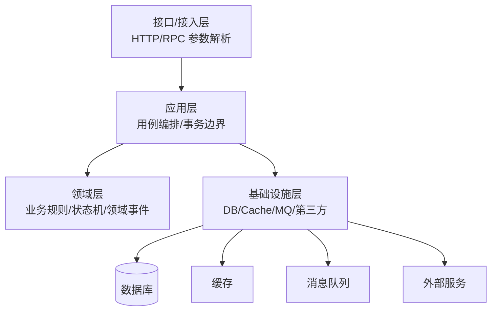
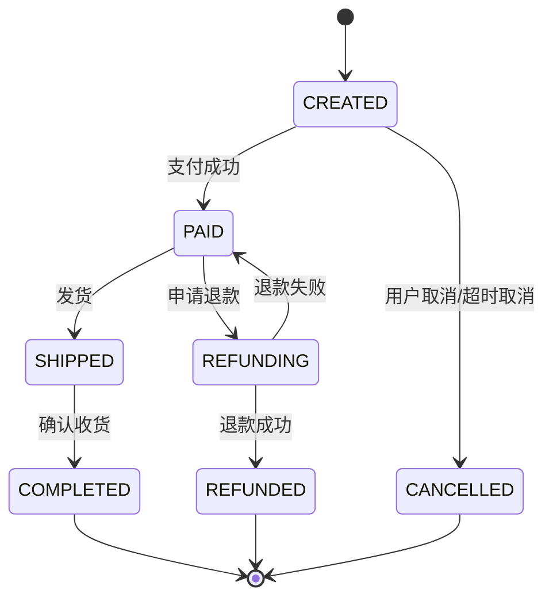

# 03-业务建模、分层架构与工程规范

> 本文目标：理解后端系统如何把业务问题转化成清晰的模型、模块、接口和代码边界。本文不绑定具体语言或框架，重点讲分层架构、领域建模、状态机、DTO/Entity/Repository、错误处理、配置管理、文档、代码评审和工程规范。

## 1. 为什么业务建模重要

很多后端系统一开始只是几个接口和几张表，但随着业务增长，问题会逐渐暴露：

- 一个接口里混杂参数校验、权限、业务规则、SQL、缓存和消息发送。
- 多个地方重复实现同一条业务规则。
- 数据库字段直接暴露给前端，表结构一变 API 就跟着变。
- 状态变化没有统一规则，导致订单、支付、退款状态混乱。
- 业务规则依赖大量 if/else，修改时容易漏。
- 外部服务接口变化影响核心业务代码。
- 测试很难写，因为业务逻辑和基础设施耦合在一起。

业务建模的目标是把现实业务中的对象、规则、流程和约束表达成系统可以维护的结构。它不是为了画图或追求复杂概念，而是为了让系统在需求变化时仍然能保持清晰。

## 2. 后端分层的基本思想

分层是为了隔离变化。不同层负责不同问题，不能随意穿透。



常见层次：

| 层 | 主要职责 | 不该做什么 |
| --- | --- | --- |
| 接口层 | 协议适配、参数解析、基础格式校验、响应映射 | 不写复杂业务规则，不直接拼 SQL |
| 应用层 | 编排用例、控制事务、调用领域对象和基础设施 | 不承载细碎领域规则 |
| 领域层 | 表达核心业务规则、状态变化、不变量 | 不依赖 HTTP、数据库、缓存等技术细节 |
| 基础设施层 | 实现数据库、缓存、消息、外部 API 访问 | 不决定业务规则 |
| 共享层 | 通用工具、错误码、基础类型 | 不放业务膨胀代码 |

分层后的好处：

- API 协议变化不会直接影响业务核心。
- 数据库表结构变化可以被 Repository 隔离。
- 第三方接口变化由适配器承担。
- 核心业务逻辑更容易单元测试。
- 权限、事务、日志、错误处理有固定位置。

## 3. MVC、三层架构、洋葱架构、六边形架构

### 3.1 MVC

MVC 常用于 Web 应用：

- Model：数据和业务。
- View：展示。
- Controller：接收请求并调度。

在前后端分离后，View 往往变成前端，后端 Controller 主要负责 API 接入。初学者容易把所有逻辑写进 Controller，这是 MVC 项目常见坏味道。

### 3.2 三层架构

典型三层：

- 表现层：接口和展示。
- 业务逻辑层：业务处理。
- 数据访问层：数据库访问。

三层架构简单清楚，适合多数业务系统。但如果业务复杂，只用 Service 层可能会变成“大 Service”，所有规则都堆进去。

### 3.3 洋葱架构

洋葱架构强调依赖方向指向内部。核心领域层在中心，外部技术细节在外层。

关键思想：

- 领域模型不依赖数据库。
- 领域模型不依赖 Web 框架。
- 外部设施通过接口适配。
- 业务核心稳定，技术细节可替换。

### 3.4 六边形架构

六边形架构也叫 Ports and Adapters。核心系统通过端口定义能力，外部通过适配器接入。

例子：

- 输入端口：创建订单用例。
- 输出端口：订单仓储、支付网关、消息发布器。
- 输入适配器：HTTP Controller、RPC Handler、定时任务。
- 输出适配器：数据库实现、Redis 实现、第三方支付实现。

这种思想适合复杂业务和需要测试隔离的系统。

## 4. 领域驱动设计基础

领域驱动设计（DDD）不是所有系统都必须完整采用，但其中很多概念对后端建模很有用。

### 4.1 领域

领域就是业务问题空间。例如电商领域包含商品、库存、订单、支付、物流、售后、优惠、会员等子领域。

后端建模第一步不是建表，而是理解业务：

- 业务对象是什么？
- 对象之间有什么关系？
- 对象有哪些状态？
- 哪些规则必须永远成立？
- 哪些操作会改变状态？
- 哪些变化需要通知其他系统？

### 4.2 实体 Entity

实体有唯一身份，属性可变。

例子：

- 用户。
- 订单。
- 商品。
- 支付单。
- 退款单。

实体的核心是身份，而不是属性。一个订单修改地址后仍然是同一个订单，因为订单 ID 没变。

### 4.3 值对象 Value Object

值对象没有独立身份，以值相等判断。

例子：

- 金额：数值 + 币种。
- 地址：省市区 + 详细地址。
- 时间范围：开始时间 + 结束时间。
- 坐标：经度 + 纬度。

值对象通常应该不可变。不可变能降低并发和共享带来的问题。

### 4.4 聚合 Aggregate

聚合是一组需要保持强一致的对象边界。聚合根是外部访问聚合的入口。

例子：

- 订单聚合：订单、订单明细、订单价格快照。
- 购物车聚合：购物车、购物车项。

聚合设计原则：

- 聚合内部保持强一致。
- 聚合之间通过 ID 引用，不直接持有对象。
- 一个事务尽量只修改一个聚合。
- 聚合不要设计过大，否则并发和事务成本高。

### 4.5 领域服务

领域服务用于表达不自然属于单个实体的业务规则。

例子：

- 价格计算服务。
- 风控判断服务。
- 库存分配服务。

领域服务不同于应用服务。领域服务包含业务规则，应用服务负责编排流程。

### 4.6 领域事件

领域事件表示业务上已经发生的事实。

例子：

- 用户已注册。
- 订单已创建。
- 支付已成功。
- 库存已扣减。

事件命名通常用过去式，因为事件代表已经发生。

领域事件用途：

- 解耦后续动作。
- 异步通知其他系统。
- 记录业务轨迹。
- 驱动最终一致。

## 5. 业务状态机

状态机是后端业务建模中非常重要的工具。很多业务事故来自状态流转没有统一控制。

### 5.1 订单状态示例



状态机要定义：

- 有哪些状态。
- 哪些状态可以转到哪些状态。
- 每个转移由什么事件触发。
- 每个转移前需要什么条件。
- 每个转移后需要什么副作用。
- 非法状态转移如何处理。

### 5.2 状态机的价值

状态机能防止：

- 已取消订单又支付成功。
- 已退款订单又发货。
- 已完成订单重复完成。
- 支付回调乱序导致状态回退。
- 多个接口各自改状态造成冲突。

### 5.3 状态机与幂等

状态机天然适合幂等处理。比如支付回调重复到达：

- 如果订单是 CREATED，则转为 PAID。
- 如果订单已经是 PAID，则直接返回成功。
- 如果订单是 CANCELLED，则进入异常补偿流程。

这比简单“收到回调就更新状态”更安全。

## 6. DTO、Entity、PO、VO 的边界

不同团队命名可能不同，但核心是分清边界。

| 类型 | 常见含义 | 主要用途 |
| --- | --- | --- |
| Request DTO | 请求对象 | 接口输入 |
| Response DTO | 响应对象 | 接口输出 |
| Command | 用例命令 | 应用层输入 |
| Entity | 领域实体 | 表达业务状态和规则 |
| Value Object | 值对象 | 表达不可变业务值 |
| PO | 持久化对象 | 对应数据库表 |
| View Object | 展示对象 | 面向页面展示 |

### 6.1 为什么不要直接返回数据库对象

直接返回数据库对象的问题：

- 暴露内部字段。
- 数据库表结构变化会影响 API。
- 可能泄露敏感字段。
- API 字段语义受数据库命名限制。
- 无法方便做聚合和裁剪。

例如用户表可能有 `password_hash`、`salt`、`deleted_flag`、`internal_note`，这些绝不能直接返回给客户端。

### 6.2 转换层是否多余

很多初学者觉得 DTO 和 Entity 转来转去很麻烦。确实，在很小的系统中它可能显得啰嗦。但当系统变大后，转换层能隔离：

- 外部协议变化。
- 数据库变化。
- 领域模型变化。
- 安全字段过滤。
- 多端展示差异。

工程上的平衡是：简单 CRUD 可以适当简化，核心业务和对外 API 要保持边界。

## 7. Repository 与数据访问

Repository 的目标是隔离领域逻辑和持久化细节。

领域层关心：

- 保存订单。
- 根据 ID 获取订单。
- 查询用户当前购物车。

不应该关心：

- SQL 怎么写。
- 用哪个 ORM。
- 表如何 join。
- 数据库连接如何获取。

Repository 示例语义：

```text
OrderRepository
  - findById(orderId)
  - save(order)
  - findUnpaidOrdersBefore(time)
```

Repository 不等于简单 DAO。DAO 更偏数据表操作，Repository 更偏聚合和业务对象。

## 8. 应用服务与领域服务

### 8.1 应用服务

应用服务负责用例编排。

创建订单用例可能包括：

1. 校验用户。
2. 查询商品。
3. 校验库存。
4. 计算价格。
5. 创建订单聚合。
6. 保存订单。
7. 发布订单创建事件。

应用服务通常控制事务边界，但不应该承载大量细碎业务规则。

### 8.2 领域服务

领域服务表达核心业务规则。

比如价格计算：

- 商品原价。
- 会员折扣。
- 优惠券。
- 满减。
- 运费。
- 税费。

价格计算规则如果写在 Controller 或应用服务中，会很难复用和测试。独立成领域服务更合适。

## 9. 事务边界

事务边界是业务建模和数据一致性的关键。

原则：

- 一个事务内只放必须强一致的操作。
- 不要在事务内调用慢外部服务。
- 不要在事务内发送不可回滚的消息，除非有事务消息或 Outbox。
- 事务越短越好。
- 大批量处理要拆分。

错误示例：

```text
开启事务
  写订单
  扣库存
  调用第三方支付
  发短信
提交事务
```

问题：

- 第三方支付可能很慢，事务长时间持锁。
- 短信发送成功后事务回滚，外部副作用无法撤销。
- 支付接口超时会导致事务不确定。

更合理：

```text
事务内：
  创建订单
  锁定库存
  写本地消息/事件
提交事务

事务外：
  异步发送通知
  调用后续流程
```

## 10. 错误处理

### 10.1 错误分类

| 类型 | 示例 | 返回建议 |
| --- | --- | --- |
| 参数错误 | 字段缺失、格式错误 | 400 |
| 认证错误 | Token 过期 | 401 |
| 授权错误 | 无权访问资源 | 403 |
| 资源不存在 | 用户、订单不存在 | 404 |
| 业务冲突 | 重复提交、状态不允许 | 409 |
| 业务校验失败 | 库存不足、余额不足 | 422 或业务约定 |
| 限流 | 请求过多 | 429 |
| 依赖失败 | 数据库超时、第三方失败 | 502/503/504 |
| 未预期异常 | 空指针、系统错误 | 500 |

### 10.2 错误码设计

错误码应该：

- 稳定。
- 可枚举。
- 有业务含义。
- 不依赖自然语言。
- 可用于客户端判断。

示例：

```text
USER_NOT_FOUND
ORDER_STATUS_INVALID
PAYMENT_DUPLICATED
STOCK_NOT_ENOUGH
RATE_LIMITED
```

### 10.3 内部错误和外部错误

外部响应要克制，内部日志要详细。

外部：

```json
{
  "code": "ORDER_STATUS_INVALID",
  "message": "当前订单状态不允许取消",
  "requestId": "req_123"
}
```

内部日志：

```text
requestId=req_123 orderId=order_1 currentStatus=SHIPPED targetAction=CANCEL userId=user_9
```

不要把堆栈、SQL、服务器路径、密钥、Token 返回给客户端。

## 11. 配置管理

配置是系统行为的重要部分。常见配置：

- 数据库连接。
- 缓存地址。
- 消息队列地址。
- 超时时间。
- 线程池大小。
- 限流阈值。
- 功能开关。
- 灰度规则。
- 第三方密钥。

### 11.1 配置原则

- 配置和代码分离。
- 敏感配置进入 Secret 或密钥管理系统。
- 配置要有校验。
- 配置变更要审计。
- 重要配置支持灰度和回滚。
- 本地、测试、生产配置差异要清晰。

### 11.2 功能开关

功能开关用于把代码发布和功能上线解耦。

场景：

- 新功能灰度。
- 紧急关闭故障功能。
- 对特定用户开放。
- A/B 测试。

风险：

- 开关太多变成维护负担。
- 老开关不清理导致逻辑复杂。
- 开关默认值错误导致事故。

## 12. 日志规范

日志是排障的重要依据。

### 12.1 应记录什么

- 请求 ID。
- 用户 ID 或匿名主体。
- 业务 ID，如订单号。
- 关键状态变化。
- 外部调用耗时。
- 错误原因。
- 重试次数。
- 降级路径。

### 12.2 不应记录什么

- 明文密码。
- Token。
- 私钥。
- 身份证号完整值。
- 银行卡完整值。
- 过多请求体。

### 12.3 结构化日志

结构化日志比纯文本更易检索：

```json
{
  "level": "INFO",
  "requestId": "req_001",
  "event": "order_created",
  "orderId": "order_1",
  "userId": "user_1",
  "costMs": 35
}
```

## 13. 文档规范

后端常见文档：

- API 文档。
- 数据模型文档。
- 状态机文档。
- 架构图。
- 部署文档。
- 配置说明。
- 故障处理手册。
- 变更记录。

文档应回答：

- 这个系统解决什么问题？
- 核心流程是什么？
- 依赖哪些系统？
- 数据如何流转？
- 出问题怎么排查？
- 如何部署和回滚？

## 14. 代码评审

代码评审不是挑格式，而是控制变更风险。

检查清单：

- 业务规则是否正确？
- 是否有权限校验？
- 是否有对象级授权？
- 是否有幂等？
- 事务边界是否合理？
- 是否在事务中调用外部服务？
- 缓存是否有一致性方案？
- 消息消费是否幂等？
- 远程调用是否有超时？
- 重试是否有上限和退避？
- 错误是否可观测？
- 日志是否泄露敏感信息？
- 是否有测试覆盖关键分支？

## 15. 模块边界

模块边界不清会导致系统腐化。

好边界：

- 模块有明确职责。
- 模块对外提供接口。
- 内部实现可替换。
- 依赖方向清楚。
- 数据所有权明确。

坏边界：

- 所有模块都能直接访问所有表。
- 工具类里藏业务逻辑。
- 一个 Service 调用十几个无关模块。
- 共享对象被所有层修改。
- 循环依赖。

## 16. 常见坏味道

| 坏味道 | 问题 |
| --- | --- |
| 胖 Controller | 接入层承载业务逻辑 |
| 万能 Service | 一个类包含大量无关用例 |
| 贫血模型过度 | 所有规则散落在服务里 |
| 数据库对象直接返回 | 泄露内部结构 |
| 魔法字符串 | 状态和类型难维护 |
| 无状态机 | 业务状态可被随意改 |
| 无统一错误码 | 客户端难处理 |
| 无请求 ID | 排障困难 |
| 事务过大 | 锁等待和回滚成本高 |
| 外部调用无超时 | 资源被长期占用 |

## 17. 本章小结

业务建模和工程规范决定系统能走多远。清晰的分层、稳定的领域模型、明确的状态机、合理的事务边界、统一的错误处理、规范的日志和文档，能显著降低后端系统长期维护成本。

## 18. 参考资料

- Martin Fowler - Patterns of Enterprise Application Architecture: https://martinfowler.com/books/eaa.html
- Martin Fowler - Domain-Driven Design Reference: https://martinfowler.com/tags/domain%20driven%20design.html
- The Twelve-Factor App: https://12factor.net/
- Microsoft Cloud Design Patterns: https://learn.microsoft.com/en-us/azure/architecture/patterns/
- Google SRE Workbook: https://sre.google/workbook/

<!-- research-notes: enhanced-v1 -->

## 研究笔记增强

> Last reviewed: 2026-06-17。此节用于把《03-业务建模、分层架构与工程规范》从阅读笔记推进到可复习、可实践、可验证的研究笔记；具体版本、参数和环境仍需结合官方资料、项目约束和实测结果校准。

### 知识定位

围绕业务建模、接口契约、数据一致性、并发控制、可观测性和运维发布建立整体视角。

### 重点补充
- 为接口定义幂等性、鉴权、限流、超时、重试、错误码和审计日志。
- 理解事务边界、索引选择、缓存一致性和异步消息失败补偿。
- 通过日志、指标、追踪和告警定位线上问题。
- 明确适用场景、限制条件、替代方案和迁移成本。

### 实践清单
- 为本章整理一张概念关系图、流程图或最小系统图。
- 写一个最小可运行示例，并保留运行命令、输入、输出和环境版本。
- 列出常见错误、排查命令、关键日志和修复动作。
- 补充安全、性能、兼容性、可维护性和上线运维注意事项。
- 用一次真实问题或练习项目复盘验证笔记是否可用。

### 常见误区
- 只摘抄定义或命令，没有记录上下文、前提条件和边界。
- 只记录成功路径，不记录失败样本、异常现象和排查过程。
- 没有版本、环境和数据样本，导致后续无法复现。
- 把教程默认值直接用于真实项目，没有结合约束重新评估。

### 复盘问题
- 学完《03-业务建模、分层架构与工程规范》后，能否用自己的话说明它解决什么问题、不解决什么问题？
- 如果要在真实项目中使用，需要哪些前置条件、依赖版本、输入数据和验证手段？
- 失败时最先检查哪三类证据：日志、指标、抓包、堆栈、配置、样本还是硬件测量？
- 有没有形成可重复的最小实验、测试用例或排查命令？

### 延伸方向
- 官方文档和版本变更记录。
- 同类技术、框架或方案对比。
- 面向真实项目的最小实践。
- 故障排查清单和复盘案例库。

### 复盘记录模板

```text
主题：03-业务建模、分层架构与工程规范
日期：
目标：本次要验证或掌握的具体问题
环境：系统 / 语言 / 框架 / 工具 / 设备 / 版本
步骤：最小可复现流程
现象：成功输出、失败输出、日志、指标或测量数据
分析：为什么会出现该现象，和哪些概念相关
结论：可复用的规则、命令、配置或设计取舍
风险：边界条件、性能、安全、兼容性或维护成本
下一步：继续实验、补充资料或应用到项目
```

<!-- lecture-notes:start -->

## 讲义级补充：如何真正学懂《03-业务建模、分层架构与工程规范》

> 适用位置：后端开发完整学习笔记\03-业务建模、分层架构与工程规范.md  
> 说明：本补充用于把原始提纲扩展成课堂讲义式学习材料。阅读时建议先看原文，再用本节建立知识框架、例子、实践和自测闭环。

### 1. 这一讲要解决什么问题

后端知识的核心是让业务数据在并发、故障、流量波动和安全威胁下仍然保持正确。学习时要把接口、数据、事务、缓存、队列、日志和运维放在同一张图里看。

学习本讲时，可以用三个问题检查自己是否真的理解：

1. 它解决的真实问题是什么？
2. 如果没有它，系统会出现什么具体麻烦？
3. 在真实项目中，应该用什么现象或指标判断它做得好不好？

### 2. 核心知识拆解

可以把本讲拆成几块来学：

- 接口：请求如何进入系统，参数如何校验，错误如何返回。
- 数据：如何建模、持久化、索引、缓存和迁移。
- 并发：事务、锁、幂等、重试和一致性如何处理。
- 运维：日志、指标、告警、容量、发布和回滚如何保障。

拆解的好处是防止“整章都懂一点，但哪块都说不清”。复习时可以逐块追问：它的输入是什么、输出是什么、依赖什么、失败时有什么表现。

### 3. 通俗类比

可以把后端系统类比成餐厅后厨：API 是点餐窗口，数据库是库存账本，缓存是备好的常用食材，消息队列是排队小票，日志和监控是摄像头与账单。高峰期能否稳定服务，取决于整套流程是否有秩序。

类比不是严格定义，但能帮助初学者先建立直觉。真正使用时，还要回到术语、公式、接口、数据结构、时序图或工程规范上，把“感觉理解”变成“可验证理解”。

### 4. 具体例子

学习《03-业务建模、分层架构与工程规范》时，可以设计一个下单或登录接口：先写正常流程，再补参数校验、幂等、事务、日志、限流和错误返回。这个小例子能覆盖后端工程里最常见的一组真实问题。

讲义级学习不能只停留在“概念解释”。至少要有一个能跑、能算、能画或能检查的例子。例子越小，越容易看清关键机制；等机制清楚后，再逐步扩展到复杂项目。

### 5. 学习路径

- 从一个业务请求开始，画出 API、鉴权、服务逻辑、数据库、缓存、队列和日志的路径。
- 逐个分析并发、事务、幂等、超时、重试、限流和降级。
- 用压测、监控和故障演练验证设计，而不是只看单元测试通过。

建议每学完一小节都做一次“复述练习”：不用看笔记，用自己的话讲清楚概念、输入、输出、关键步骤和常见错误。如果讲不清，通常说明还没有真正掌握。

### 6. 课堂讲解框架

可以按下面顺序讲解或复习本主题：

1. 背景：先讲这个知识为什么出现，它试图降低什么成本、解决什么风险或提升什么能力。
2. 基本概念：给出核心名词的准确定义，说明它们之间的关系。
3. 工作流程：按时间顺序描述一次完整过程，必要时画出流程图、状态机或数据流图。
4. 关键细节：解释最容易误解的机制，例如边界条件、异常处理、性能限制、资源生命周期或安全约束。
5. 实战例子：用一个足够小但完整的例子，把概念落到命令、代码、图纸、配置、数据或操作步骤上。
6. 反例与排错：展示错误做法会导致什么现象，再说明如何定位和修复。
7. 总结迁移：最后说明它和相邻知识点的区别、联系以及后续该学什么。

### 7. 最小实践任务

为了避免“看懂了但不会用”，建议为本讲配一个最小实践：

- 选一个可以在 30 到 90 分钟内完成的小任务。
- 明确输入、预期输出和验收标准。
- 记录遇到的第一个错误、定位过程和最终修复方法。
- 完成后写 5 行复盘：我原来以为是什么，实际是什么，下次会如何更快处理。

如果本主题偏理论，实践可以是手算一个小例子、画一张流程图、推导一个简化公式或解释一段真实日志；如果偏工程，实践应该尽量落到可运行命令、可测试代码、可检查配置或可测量硬件现象上。

### 8. 常见误区

- 接口能跑就认为完成，忽略并发、幂等和事务边界。
- 缓存和数据库一致性没有策略，故障时数据互相打架。
- 没有日志、指标和 trace，出问题只能猜。

遇到这些问题时，不要急着背更多资料。更有效的办法是回到一个最小例子，把输入、状态变化、输出和验证方式重新走一遍。

### 9. 自测题

1. 用一句话说明本讲主题解决的核心问题。
2. 列出本讲最重要的 3 个概念，并说明它们的关系。
3. 举一个生活类比，再指出这个类比在哪些地方不严谨。
4. 写出一个最小实践任务的验收标准。
5. 如果结果不符合预期，你会优先检查哪 3 个环节？为什么？
6. 本讲和相邻章节的知识边界是什么？哪些问题应该交给其他章节解决？

### 10. 复习口诀

先问场景，再看输入；先拆结构，再走流程；先做小例，再谈优化；先会排错，再做规模化。

<!-- lecture-notes:end -->
