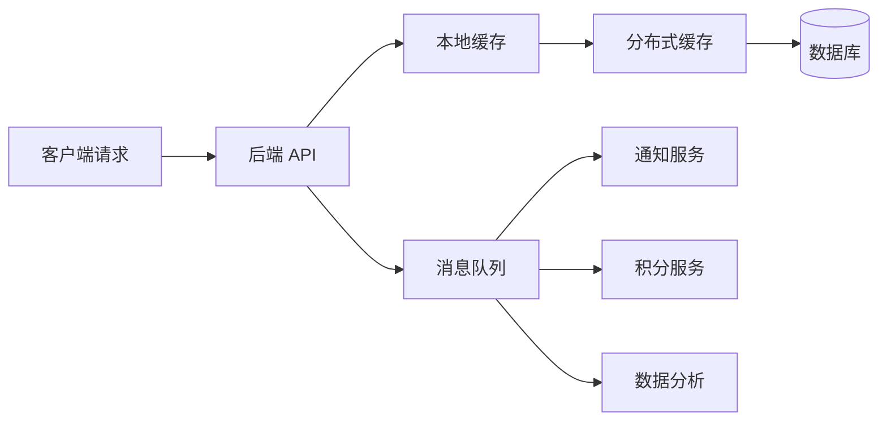

# 05-缓存、消息队列与异步系统

> 本文目标：深入理解缓存、消息队列和异步系统。缓存用于降低延迟和减轻后端压力，消息队列用于异步解耦和削峰，异步系统用于把复杂流程拆成可恢复、可重试、最终一致的多个步骤。

## 1. 为什么缓存和消息队列重要

后端系统面对两个典型压力：

- 读压力：大量请求重复读取同一批数据。
- 写压力和慢任务：主链路中有很多不必同步完成的耗时操作。

缓存解决读压力，消息队列解决异步解耦和削峰。



但这两个组件都会引入新问题：

- 缓存会引入一致性、穿透、击穿、雪崩、热点、大 key。
- 消息队列会引入重复、乱序、积压、失败重试、最终一致。

## 2. 缓存的本质

缓存是把昂贵结果存到更快的位置，下一次直接读取。

昂贵可能是：

- 数据库查询慢。
- 远程接口慢。
- 计算复杂。
- 文件读取慢。
- 网络距离远。

缓存的价值来自命中率。如果请求大多命中缓存，就能减少慢操作。如果命中率很低，缓存不仅收益小，还增加复杂度。

## 3. 缓存适用场景

适合缓存：

- 读多写少。
- 访问热点明显。
- 数据可以短暂不一致。
- 数据生成成本高。
- key 能明确标识结果。
- value 大小可控。

不适合缓存：

- 强一致核心状态。
- 写多读少。
- key 空间巨大且无重复访问。
- value 特别大。
- 结果依赖大量隐含上下文。
- 失效条件复杂且无法维护。

## 4. 缓存层级

### 4.1 多级缓存

```text
浏览器缓存 -> CDN -> 网关缓存 -> 应用本地缓存 -> Redis/Memcached -> 数据库
```

| 层级 | 优点 | 风险 |
| --- | --- | --- |
| 浏览器缓存 | 离用户最近 | 用户侧失效不可完全控制 |
| CDN | 抗大流量 | 个性化数据不能乱缓存 |
| 网关缓存 | 降低应用入口压力 | 路由和权限要谨慎 |
| 本地缓存 | 极低延迟 | 多实例不一致 |
| 分布式缓存 | 共享缓存 | 网络开销和热点 |
| 数据库 | 权威数据源 | 成本高、慢、连接有限 |

### 4.2 本地缓存

本地缓存存在应用进程内。

优点：

- 无网络开销。
- 延迟极低。
- 适合热点配置、字典、规则。

缺点：

- 多实例各自一份。
- 实例重启缓存丢失。
- 占用应用内存。
- 失效广播复杂。

### 4.3 分布式缓存

分布式缓存由独立缓存服务提供，多个应用实例共享。

优点：

- 多实例共享。
- 容量更大。
- 可统一管理。

缺点：

- 有网络开销。
- 缓存服务本身要高可用。
- 热点 key 会集中打到某个节点。
- 大 key 会影响网络和执行延迟。

## 5. 缓存模式

### 5.1 Cache-Aside

最常见模式：应用自己读写缓存。

读：

1. 先读缓存。
2. 命中则返回。
3. 未命中读数据库。
4. 写入缓存。
5. 返回结果。

写：

1. 更新数据库。
2. 删除缓存。

为什么通常删除缓存而不是更新缓存：

- 删除简单。
- 聚合缓存难以准确更新。
- 下一次读会回源生成新值。

风险：

- 删除缓存失败导致旧值残留。
- 删除后热点请求可能击穿数据库。
- 并发读写可能短暂不一致。

### 5.2 Read-Through

应用只读缓存，缓存负责加载数据。

适合：

- 本地缓存框架。
- 加载逻辑简单。
- 想集中处理缓存加载。

风险：

- 缓存层与数据源耦合。
- 加载失败处理复杂。

### 5.3 Write-Through

写缓存时同步写数据库。

优点：

- 缓存更容易有新值。

缺点：

- 写延迟增加。
- 缓存失败仍要处理。
- 不适合复杂聚合缓存。

### 5.4 Write-Behind

先写缓存或队列，再异步写数据库。

优点：

- 写入快。
- 可批量落库。

缺点：

- 宕机可能丢数据。
- 一致性复杂。
- 必须有可靠队列和补偿。

适合：

- 日志。
- 统计。
- 计数。
- 非核心状态。

不适合：

- 账户余额。
- 支付核心流水。
- 强一致库存。

### 5.5 Refresh-Ahead

缓存快过期前主动刷新。

适合：

- 热点数据。
- 回源很慢。
- 可接受旧值。

常见实现：

- 逻辑过期。
- 后台异步刷新。
- 刷新失败继续返回旧值。

## 6. TTL 与淘汰策略

TTL 是缓存过期时间。

设计 TTL 要考虑：

- 数据变化频率。
- 业务可接受旧值时长。
- 回源成本。
- 缓存容量。
- 热点程度。

建议：

- 不要所有 key 使用相同 TTL。
- 给 TTL 加随机抖动。
- 热点 key 可使用逻辑过期。
- 空值缓存使用短 TTL。
- 重要配置使用主动失效 + 长 TTL 兜底。

淘汰策略关注缓存满了后删什么：

- 最近最少使用。
- 最近最少访问。
- 随机淘汰。
- 按过期时间淘汰。

不同缓存产品策略不同，要查官方文档。

## 7. 缓存穿透、击穿、雪崩

### 7.1 缓存穿透

穿透是查询不存在数据，每次都打数据库。

解决：

- 参数校验。
- 空对象缓存。
- 布隆过滤器。
- 限流和风控。

空对象缓存注意：

- TTL 要短。
- 防止恶意构造大量不存在 key 占满缓存。

布隆过滤器注意：

- 能判断“一定不存在”或“可能存在”。
- 有误判。
- 删除困难。

### 7.2 缓存击穿

击穿是热点 key 过期，大量请求同时回源。

解决：

- 互斥锁回源。
- 单飞机制。
- 逻辑过期。
- 热点预热。
- 返回旧值并异步刷新。

### 7.3 缓存雪崩

雪崩是大量 key 同时失效，或缓存集群不可用，导致数据库被压垮。

解决：

- TTL 随机抖动。
- 多级缓存。
- 缓存高可用。
- 限流。
- 降级。
- 热点预热。
- 缓存故障时不要无脑打数据库。

## 8. 热点 key 与大 key

### 8.1 热点 key

热点 key 是访问量极高的 key。

风险：

- 单个缓存节点压力过高。
- 网络带宽打满。
- 过期时击穿数据库。

治理：

- 本地缓存。
- 热点 key 副本。
- 请求合并。
- 逻辑过期。
- 预热。

### 8.2 大 key

大 key 是 value 很大或集合元素很多的 key。

风险：

- 网络传输慢。
- 序列化慢。
- 删除阻塞。
- 迁移慢。
- 内存碎片。

治理：

- 拆分。
- 分页。
- 控制集合大小。
- 异步删除。
- 定期扫描。

## 9. 缓存一致性

### 9.1 一致性级别

| 级别 | 含义 | 场景 |
| --- | --- | --- |
| 强一致 | 读必须看到最新写 | 账户、支付、库存 |
| 最终一致 | 短暂旧值可接受 | 商品详情、用户资料 |
| 弱一致 | 长一点旧值也可接受 | 排行榜、统计 |

缓存一般不适合承载强一致判断。强一致应由数据库事务、唯一约束、状态机等保障。

### 9.2 常见方案

| 方案 | 说明 |
| --- | --- |
| 写 DB 后删缓存 | Cache-Aside 主流方案 |
| 删除失败重试 | 通过 MQ 或任务补偿 |
| 延迟双删 | 降低并发读写不一致概率 |
| CDC 删除缓存 | 订阅数据库变更 |
| 短 TTL | 依靠过期收敛 |
| 版本号 | 防止旧值覆盖新值 |

### 9.3 删除缓存失败怎么办

必须有补偿：

- 记录失败任务。
- MQ 重试。
- 定时扫描。
- CDC 兜底。
- 人工修复工具。

不要只在日志里打印“删除缓存失败”就结束。

## 10. HTTP 与 CDN 缓存

HTTP 缓存用于浏览器、代理和 CDN。

常见 Header：

| Header | 作用 |
| --- | --- |
| Cache-Control | 控制缓存策略 |
| ETag | 资源版本 |
| If-None-Match | 协商缓存 |
| Last-Modified | 最后修改时间 |
| Expires | 过期时间 |

静态资源常用：

```http
Cache-Control: public, max-age=31536000, immutable
```

前提是文件名带 hash。

私有敏感数据：

```http
Cache-Control: no-store
```

公开但短期可缓存：

```http
Cache-Control: public, max-age=30, stale-while-revalidate=60
```

## 11. 消息队列基础

消息队列是异步系统的核心组件。

### 11.1 基本概念

| 术语 | 含义 |
| --- | --- |
| Producer | 生产者 |
| Consumer | 消费者 |
| Topic | 主题 |
| Queue | 队列 |
| Partition | 分区 |
| Offset | 消费位置 |
| Consumer Group | 消费者组 |
| Ack | 确认 |
| Retry | 重试 |
| DLQ | 死信队列 |

### 11.2 为什么用 MQ

| 目的 | 例子 |
| --- | --- |
| 异步 | 下单后异步发短信 |
| 解耦 | 订单系统不直接依赖积分系统 |
| 削峰 | 秒杀请求进入队列慢慢处理 |
| 广播 | 用户注册事件多个服务订阅 |
| 重试 | 第三方失败后延迟重试 |
| 顺序 | 同一订单事件按序处理 |

## 12. 消息投递语义

| 语义 | 含义 | 工程解释 |
| --- | --- | --- |
| At most once | 最多一次 | 可能丢，不重复 |
| At least once | 至少一次 | 不丢，但可能重复 |
| Exactly once | 恰好一次 | 通常限定在特定系统边界内 |

后端工程中最常见的策略是：

```text
At least once + 幂等消费
```

因为在分布式系统中，完全避免重复很难。更可行的是允许重复，但重复不会造成错误结果。

## 13. 消费幂等

重复消息来源：

- 生产者重试。
- Broker 重投递。
- 消费者处理成功但 ack 失败。
- 消费者宕机后重新消费。
- 人工补偿重放。

幂等方案：

- 消息 ID 去重。
- 业务唯一键。
- 数据库唯一约束。
- 状态机。
- 消费记录表。
- 乐观锁版本。

例如支付成功事件：

- 如果订单是待支付，则更新为已支付。
- 如果订单已经已支付，则直接返回成功。
- 如果订单已取消，则进入异常对账流程。

## 14. 消息顺序

顺序消息常见于订单、库存、账户流水。

要保证同一业务对象顺序：

- 使用同一分区键，例如 orderId。
- 同一分区单消费者有序处理。
- 消费失败时要决定是否阻塞后续消息。

全局有序代价很高，通常只需要局部有序。

## 15. 消息积压

积压表示生产速度大于消费速度。

原因：

- 消费者实例太少。
- 下游慢。
- 单条消息处理慢。
- 消费失败反复重试。
- 分区数不足。
- 热点 key 导致某分区过载。

处理：

- 扩容消费者。
- 优化消费逻辑。
- 批量处理。
- 暂停非核心生产。
- 分流到临时队列。
- 跳过或隔离毒消息。

## 16. 死信队列

死信队列保存多次处理失败的消息。

进入死信的原因：

- 重试次数耗尽。
- 消息格式错误。
- 业务状态不允许。
- 下游长期不可用。

死信队列要有：

- 监控告警。
- 查询工具。
- 重新投递工具。
- 人工处理流程。
- 失败原因记录。

## 17. 本地消息表与 Outbox

问题：业务数据库写成功，但消息发送失败怎么办？

Outbox 思路：

1. 在同一个数据库事务中写业务数据和 outbox 事件表。
2. 事务提交后，由后台任务或 CDC 读取 outbox。
3. 发送消息到 MQ。
4. 发送成功后标记事件已发布。

优点：

- 业务数据和待发送事件原子提交。
- 消息发送失败可重试。

缺点：

- 需要事件表和发布器。
- 有延迟。
- 需要处理重复发布。

## 18. 异步系统设计

异步系统要处理的不是“如何后台执行”，而是“如何保证最终可恢复”。

要设计：

- 任务 ID。
- 状态机。
- 重试策略。
- 超时策略。
- 幂等。
- 补偿。
- 死信。
- 监控。
- 人工介入入口。

异步任务状态：

| 状态 | 含义 |
| --- | --- |
| PENDING | 等待处理 |
| PROCESSING | 处理中 |
| SUCCESS | 成功 |
| FAILED_RETRYABLE | 可重试失败 |
| FAILED_FINAL | 最终失败 |
| CANCELLED | 已取消 |

## 19. 定时任务

定时任务常用于：

- 订单超时关闭。
- 数据同步。
- 报表生成。
- 清理过期数据。
- 重试补偿。

多实例注意：

- 避免多个实例重复执行。
- 使用分布式锁或任务分片。
- 任务必须幂等。
- 长任务要可中断和恢复。
- 记录执行日志。

## 20. 典型场景

### 20.1 下单后通知

主链路：

- 创建订单。
- 返回用户。

异步链路：

- 发短信。
- 加积分。
- 更新推荐特征。
- 发送站内信。

这些异步任务失败不应该影响订单创建，但要能重试和补偿。

### 20.2 秒杀削峰

流程：

- 网关限流。
- Redis 预扣库存。
- 成功请求写 MQ。
- 消费者创建订单。
- 数据库唯一约束防重复。
- 用户查询排队状态。

关键：

- 不要让所有请求直接打数据库。
- 消费者幂等。
- 队列积压可观测。

### 20.3 搜索索引更新

商品更新后：

- 数据库更新成功。
- 发布商品变更事件。
- 搜索服务消费事件更新索引。

搜索结果可以短暂延迟，但要有补偿任务定期校验索引一致性。

## 21. 本章小结

缓存和消息队列都是后端系统的复杂度交换器。缓存用一致性复杂度换性能，消息队列用最终一致复杂度换解耦和削峰。使用它们时必须同时设计失效、重试、幂等、监控和补偿，否则容易从性能优化变成稳定性风险。

## 22. 参考资料

- Redis Documentation: https://redis.io/docs/latest/
- RFC 9111 HTTP Caching: https://datatracker.ietf.org/doc/rfc9111/
- MDN Cache-Control: https://developer.mozilla.org/en-US/docs/Web/HTTP/Reference/Headers/Cache-Control
- Apache Kafka Documentation: https://kafka.apache.org/documentation/
- Confluent Kafka Delivery Semantics: https://docs.confluent.io/kafka/design/delivery-semantics.html
- Microsoft Cache-Aside Pattern: https://learn.microsoft.com/en-us/azure/architecture/patterns/cache-aside
- Microservices.io Transactional Outbox: https://microservices.io/patterns/data/transactional-outbox.html

<!-- research-notes: enhanced-v1 -->

## 研究笔记增强

> Last reviewed: 2026-06-17。此节用于把《05-缓存、消息队列与异步系统》从阅读笔记推进到可复习、可实践、可验证的研究笔记；具体版本、参数和环境仍需结合官方资料、项目约束和实测结果校准。

### 知识定位

围绕业务建模、接口契约、数据一致性、并发控制、可观测性和运维发布建立整体视角。

### 重点补充
- 为接口定义幂等性、鉴权、限流、超时、重试、错误码和审计日志。
- 理解事务边界、索引选择、缓存一致性和异步消息失败补偿。
- 通过日志、指标、追踪和告警定位线上问题。
- 明确适用场景、限制条件、替代方案和迁移成本。

### 实践清单
- 为本章整理一张概念关系图、流程图或最小系统图。
- 写一个最小可运行示例，并保留运行命令、输入、输出和环境版本。
- 列出常见错误、排查命令、关键日志和修复动作。
- 补充安全、性能、兼容性、可维护性和上线运维注意事项。
- 用一次真实问题或练习项目复盘验证笔记是否可用。

### 常见误区
- 只摘抄定义或命令，没有记录上下文、前提条件和边界。
- 只记录成功路径，不记录失败样本、异常现象和排查过程。
- 没有版本、环境和数据样本，导致后续无法复现。
- 把教程默认值直接用于真实项目，没有结合约束重新评估。

### 复盘问题
- 学完《05-缓存、消息队列与异步系统》后，能否用自己的话说明它解决什么问题、不解决什么问题？
- 如果要在真实项目中使用，需要哪些前置条件、依赖版本、输入数据和验证手段？
- 失败时最先检查哪三类证据：日志、指标、抓包、堆栈、配置、样本还是硬件测量？
- 有没有形成可重复的最小实验、测试用例或排查命令？

### 延伸方向
- 官方文档和版本变更记录。
- 同类技术、框架或方案对比。
- 面向真实项目的最小实践。
- 故障排查清单和复盘案例库。

### 复盘记录模板

```text
主题：05-缓存、消息队列与异步系统
日期：
目标：本次要验证或掌握的具体问题
环境：系统 / 语言 / 框架 / 工具 / 设备 / 版本
步骤：最小可复现流程
现象：成功输出、失败输出、日志、指标或测量数据
分析：为什么会出现该现象，和哪些概念相关
结论：可复用的规则、命令、配置或设计取舍
风险：边界条件、性能、安全、兼容性或维护成本
下一步：继续实验、补充资料或应用到项目
```
