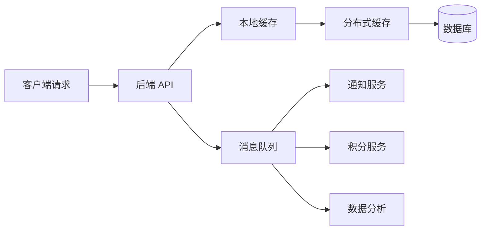

# 05-缓存、消息队列与异步系统

> 本文目标：深入理解缓存、消息队列和异步系统。缓存用于降低延迟和减轻后端压力，消息队列用于异步解耦和削峰，异步系统用于把复杂流程拆成可恢复、可重试、最终一致的多个步骤。

<!-- lecture-notes:integrated-v2 -->

## 讲义导读：把后端当成一条请求生命线

这一章讲的是 **缓存、消息队列与异步系统**。阅读时不要只背框架名、组件名或面试题答案，而要把每个概念放回一条请求生命线里：请求如何进入系统，如何被认证和校验，业务规则在哪里执行，数据如何保持一致，慢操作如何异步化，故障如何被观测，变更如何安全上线。后端学习的目标不是堆技术栈，而是能设计、实现、排查和维护一个长期运行的业务系统。

### 一句话先懂

缓存和消息队列都是把主链路压力转移出去的工具，但它们会引入一致性、重复、乱序、积压和补偿问题。

### 通俗类比

缓存像前台备好的热菜，快但可能不是最新；消息队列像传菜通道，能削峰但可能重复送、延迟送或顺序变化。

类比只是帮助建立第一印象。回到工程上，要把类比里的入口、调度、仓库、通道、监控和维护分别对应到 API、业务层、数据库、缓存、消息队列、可观测性和部署运维。后端概念只有放进真实链路，才知道它解决的是正确性、性能、安全、可靠性、可维护性还是成本问题。

### 本章学习主线

1. **先看职责**：这个概念负责处理请求链路里的哪一段，输入和输出是什么。
2. **再看边界**：它不负责什么，哪些问题应该交给数据库、缓存、队列、网关、客户端或运维平台。
3. **然后看失败**：超时、重复、乱序、并发、脏数据、权限绕过、容量耗尽时会发生什么。
4. **接着看验证**：怎样用单元测试、集成测试、压测、日志、指标、trace 或故障演练证明设计可靠。
5. **最后看演进**：需求变更、流量增长、团队协作和版本升级时，这个设计是否还能维护。

### 概念怎么学才不容易忘

遇到后端概念时，建议按 白话职责 -> 链路位置 -> 最小例子 -> 常见事故 -> 观测信号 -> 修复策略 六步理解。比如缓存不是加速器这么简单，还要看命中率、TTL、一致性、热点 key 和失效策略；消息队列不是异步这么简单，还要看确认、重试、幂等、积压和补偿；JWT 不是登录态这么简单，还要看签名、过期、撤销、泄露和权限边界。

### 最小实践任务

设计商品详情缓存和订单创建后的异步通知流程，写出缓存 key、TTL、失效策略、消息幂等键、失败重试和补偿方案。

实践时要故意设计失败场景：重复请求、数据库超时、缓存失效、消息重复、权限不足、发布回滚、下游服务不可用。后端能力往往不是在正常路径里体现，而是在异常路径里体现。

### 读完本章应该能做到

- 用自己的话解释本章概念在后端请求链路中的位置。
- 画出最小流程图，标清入口、处理、存储、副作用、返回和观测点。
- 说出至少三个常见失败模式，以及对应的日志、指标或 trace 信号。
- 给出一个可落地的小设计，并说明它的事务、幂等、安全和回滚边界。
- 能解释缓存穿透、击穿、雪崩、热点 key、大 key、消息确认、重复消费、死信队列、Outbox 和最终一致性。

> 本节是讲义化阅读入口，后续正文中的协议、架构、数据库、缓存、消息、安全、运维和案例都应围绕这条请求生命线来理解。

## 1. 为什么缓存和消息队列重要

后端系统面对两个典型压力：

- 读压力：大量请求重复读取同一批数据。
- 写压力和慢任务：主链路中有很多不必同步完成的耗时操作。

缓存解决读压力，消息队列解决异步解耦和削峰。



但这两个组件都会引入新问题：

- 缓存会引入一致性、穿透、击穿、雪崩、热点、大 key。
- 消息队列会引入重复、乱序、积压、失败重试、最终一致。

## 2. 缓存的本质

缓存是把昂贵结果存到更快的位置，下一次直接读取。

昂贵可能是：

- 数据库查询慢。
- 远程接口慢。
- 计算复杂。
- 文件读取慢。
- 网络距离远。

缓存的价值来自命中率。如果请求大多命中缓存，就能减少慢操作。如果命中率很低，缓存不仅收益小，还增加复杂度。

## 3. 缓存适用场景

适合缓存：

- 读多写少。
- 访问热点明显。
- 数据可以短暂不一致。
- 数据生成成本高。
- key 能明确标识结果。
- value 大小可控。

不适合缓存：

- 强一致核心状态。
- 写多读少。
- key 空间巨大且无重复访问。
- value 特别大。
- 结果依赖大量隐含上下文。
- 失效条件复杂且无法维护。

## 4. 缓存层级

### 4.1 多级缓存

```text
浏览器缓存 -> CDN -> 网关缓存 -> 应用本地缓存 -> Redis/Memcached -> 数据库
```

| 层级 | 优点 | 风险 |
| --- | --- | --- |
| 浏览器缓存 | 离用户最近 | 用户侧失效不可完全控制 |
| CDN | 抗大流量 | 个性化数据不能乱缓存 |
| 网关缓存 | 降低应用入口压力 | 路由和权限要谨慎 |
| 本地缓存 | 极低延迟 | 多实例不一致 |
| 分布式缓存 | 共享缓存 | 网络开销和热点 |
| 数据库 | 权威数据源 | 成本高、慢、连接有限 |

### 4.2 本地缓存

本地缓存存在应用进程内。

优点：

- 无网络开销。
- 延迟极低。
- 适合热点配置、字典、规则。

缺点：

- 多实例各自一份。
- 实例重启缓存丢失。
- 占用应用内存。
- 失效广播复杂。

### 4.3 分布式缓存

分布式缓存由独立缓存服务提供，多个应用实例共享。

优点：

- 多实例共享。
- 容量更大。
- 可统一管理。

缺点：

- 有网络开销。
- 缓存服务本身要高可用。
- 热点 key 会集中打到某个节点。
- 大 key 会影响网络和执行延迟。

## 5. 缓存模式

### 5.1 Cache-Aside

最常见模式：应用自己读写缓存。

读：

1. 先读缓存。
2. 命中则返回。
3. 未命中读数据库。
4. 写入缓存。
5. 返回结果。

写：

1. 更新数据库。
2. 删除缓存。

为什么通常删除缓存而不是更新缓存：

- 删除简单。
- 聚合缓存难以准确更新。
- 下一次读会回源生成新值。

风险：

- 删除缓存失败导致旧值残留。
- 删除后热点请求可能击穿数据库。
- 并发读写可能短暂不一致。

### 5.2 Read-Through

应用只读缓存，缓存负责加载数据。

适合：

- 本地缓存框架。
- 加载逻辑简单。
- 想集中处理缓存加载。

风险：

- 缓存层与数据源耦合。
- 加载失败处理复杂。

### 5.3 Write-Through

写缓存时同步写数据库。

优点：

- 缓存更容易有新值。

缺点：

- 写延迟增加。
- 缓存失败仍要处理。
- 不适合复杂聚合缓存。

### 5.4 Write-Behind

先写缓存或队列，再异步写数据库。

优点：

- 写入快。
- 可批量落库。

缺点：

- 宕机可能丢数据。
- 一致性复杂。
- 必须有可靠队列和补偿。

适合：

- 日志。
- 统计。
- 计数。
- 非核心状态。

不适合：

- 账户余额。
- 支付核心流水。
- 强一致库存。

### 5.5 Refresh-Ahead

缓存快过期前主动刷新。

适合：

- 热点数据。
- 回源很慢。
- 可接受旧值。

常见实现：

- 逻辑过期。
- 后台异步刷新。
- 刷新失败继续返回旧值。

## 6. TTL 与淘汰策略

TTL 是缓存过期时间。

设计 TTL 要考虑：

- 数据变化频率。
- 业务可接受旧值时长。
- 回源成本。
- 缓存容量。
- 热点程度。

建议：

- 不要所有 key 使用相同 TTL。
- 给 TTL 加随机抖动。
- 热点 key 可使用逻辑过期。
- 空值缓存使用短 TTL。
- 重要配置使用主动失效 + 长 TTL 兜底。

淘汰策略关注缓存满了后删什么：

- 最近最少使用。
- 最近最少访问。
- 随机淘汰。
- 按过期时间淘汰。

不同缓存产品策略不同，要查官方文档。

## 7. 缓存穿透、击穿、雪崩

### 7.1 缓存穿透

穿透是查询不存在数据，每次都打数据库。

解决：

- 参数校验。
- 空对象缓存。
- 布隆过滤器。
- 限流和风控。

空对象缓存注意：

- TTL 要短。
- 防止恶意构造大量不存在 key 占满缓存。

布隆过滤器注意：

- 能判断“一定不存在”或“可能存在”。
- 有误判。
- 删除困难。

### 7.2 缓存击穿

击穿是热点 key 过期，大量请求同时回源。

解决：

- 互斥锁回源。
- 单飞机制。
- 逻辑过期。
- 热点预热。
- 返回旧值并异步刷新。

### 7.3 缓存雪崩

雪崩是大量 key 同时失效，或缓存集群不可用，导致数据库被压垮。

解决：

- TTL 随机抖动。
- 多级缓存。
- 缓存高可用。
- 限流。
- 降级。
- 热点预热。
- 缓存故障时不要无脑打数据库。

## 8. 热点 key 与大 key

### 8.1 热点 key

热点 key 是访问量极高的 key。

风险：

- 单个缓存节点压力过高。
- 网络带宽打满。
- 过期时击穿数据库。

治理：

- 本地缓存。
- 热点 key 副本。
- 请求合并。
- 逻辑过期。
- 预热。

### 8.2 大 key

大 key 是 value 很大或集合元素很多的 key。

风险：

- 网络传输慢。
- 序列化慢。
- 删除阻塞。
- 迁移慢。
- 内存碎片。

治理：

- 拆分。
- 分页。
- 控制集合大小。
- 异步删除。
- 定期扫描。

## 9. 缓存一致性

### 9.1 一致性级别

| 级别 | 含义 | 场景 |
| --- | --- | --- |
| 强一致 | 读必须看到最新写 | 账户、支付、库存 |
| 最终一致 | 短暂旧值可接受 | 商品详情、用户资料 |
| 弱一致 | 长一点旧值也可接受 | 排行榜、统计 |

缓存一般不适合承载强一致判断。强一致应由数据库事务、唯一约束、状态机等保障。

### 9.2 常见方案

| 方案 | 说明 |
| --- | --- |
| 写 DB 后删缓存 | Cache-Aside 主流方案 |
| 删除失败重试 | 通过 MQ 或任务补偿 |
| 延迟双删 | 降低并发读写不一致概率 |
| CDC 删除缓存 | 订阅数据库变更 |
| 短 TTL | 依靠过期收敛 |
| 版本号 | 防止旧值覆盖新值 |

### 9.3 删除缓存失败怎么办

必须有补偿：

- 记录失败任务。
- MQ 重试。
- 定时扫描。
- CDC 兜底。
- 人工修复工具。

不要只在日志里打印“删除缓存失败”就结束。

## 10. HTTP 与 CDN 缓存

HTTP 缓存用于浏览器、代理和 CDN。

常见 Header：

| Header | 作用 |
| --- | --- |
| Cache-Control | 控制缓存策略 |
| ETag | 资源版本 |
| If-None-Match | 协商缓存 |
| Last-Modified | 最后修改时间 |
| Expires | 过期时间 |

静态资源常用：

```http
Cache-Control: public, max-age=31536000, immutable
```

前提是文件名带 hash。

私有敏感数据：

```http
Cache-Control: no-store
```

公开但短期可缓存：

```http
Cache-Control: public, max-age=30, stale-while-revalidate=60
```

## 11. 消息队列基础

消息队列是异步系统的核心组件。

### 11.1 基本概念

| 术语 | 含义 |
| --- | --- |
| Producer | 生产者 |
| Consumer | 消费者 |
| Topic | 主题 |
| Queue | 队列 |
| Partition | 分区 |
| Offset | 消费位置 |
| Consumer Group | 消费者组 |
| Ack | 确认 |
| Retry | 重试 |
| DLQ | 死信队列 |

### 11.2 为什么用 MQ

| 目的 | 例子 |
| --- | --- |
| 异步 | 下单后异步发短信 |
| 解耦 | 订单系统不直接依赖积分系统 |
| 削峰 | 秒杀请求进入队列慢慢处理 |
| 广播 | 用户注册事件多个服务订阅 |
| 重试 | 第三方失败后延迟重试 |
| 顺序 | 同一订单事件按序处理 |

## 12. 消息投递语义

| 语义 | 含义 | 工程解释 |
| --- | --- | --- |
| At most once | 最多一次 | 可能丢，不重复 |
| At least once | 至少一次 | 不丢，但可能重复 |
| Exactly once | 恰好一次 | 通常限定在特定系统边界内 |

后端工程中最常见的策略是：

```text
At least once + 幂等消费
```

因为在分布式系统中，完全避免重复很难。更可行的是允许重复，但重复不会造成错误结果。

## 13. 消费幂等

重复消息来源：

- 生产者重试。
- Broker 重投递。
- 消费者处理成功但 ack 失败。
- 消费者宕机后重新消费。
- 人工补偿重放。

幂等方案：

- 消息 ID 去重。
- 业务唯一键。
- 数据库唯一约束。
- 状态机。
- 消费记录表。
- 乐观锁版本。

例如支付成功事件：

- 如果订单是待支付，则更新为已支付。
- 如果订单已经已支付，则直接返回成功。
- 如果订单已取消，则进入异常对账流程。

## 14. 消息顺序

顺序消息常见于订单、库存、账户流水。

要保证同一业务对象顺序：

- 使用同一分区键，例如 orderId。
- 同一分区单消费者有序处理。
- 消费失败时要决定是否阻塞后续消息。

全局有序代价很高，通常只需要局部有序。

## 15. 消息积压

积压表示生产速度大于消费速度。

原因：

- 消费者实例太少。
- 下游慢。
- 单条消息处理慢。
- 消费失败反复重试。
- 分区数不足。
- 热点 key 导致某分区过载。

处理：

- 扩容消费者。
- 优化消费逻辑。
- 批量处理。
- 暂停非核心生产。
- 分流到临时队列。
- 跳过或隔离毒消息。

## 16. 死信队列

死信队列保存多次处理失败的消息。

进入死信的原因：

- 重试次数耗尽。
- 消息格式错误。
- 业务状态不允许。
- 下游长期不可用。

死信队列要有：

- 监控告警。
- 查询工具。
- 重新投递工具。
- 人工处理流程。
- 失败原因记录。

## 17. 本地消息表与 Outbox

问题：业务数据库写成功，但消息发送失败怎么办？

Outbox 思路：

1. 在同一个数据库事务中写业务数据和 outbox 事件表。
2. 事务提交后，由后台任务或 CDC 读取 outbox。
3. 发送消息到 MQ。
4. 发送成功后标记事件已发布。

优点：

- 业务数据和待发送事件原子提交。
- 消息发送失败可重试。

缺点：

- 需要事件表和发布器。
- 有延迟。
- 需要处理重复发布。

## 18. 异步系统设计

异步系统要处理的不是“如何后台执行”，而是“如何保证最终可恢复”。

要设计：

- 任务 ID。
- 状态机。
- 重试策略。
- 超时策略。
- 幂等。
- 补偿。
- 死信。
- 监控。
- 人工介入入口。

异步任务状态：

| 状态 | 含义 |
| --- | --- |
| PENDING | 等待处理 |
| PROCESSING | 处理中 |
| SUCCESS | 成功 |
| FAILED_RETRYABLE | 可重试失败 |
| FAILED_FINAL | 最终失败 |
| CANCELLED | 已取消 |

## 19. 定时任务

定时任务常用于：

- 订单超时关闭。
- 数据同步。
- 报表生成。
- 清理过期数据。
- 重试补偿。

多实例注意：

- 避免多个实例重复执行。
- 使用分布式锁或任务分片。
- 任务必须幂等。
- 长任务要可中断和恢复。
- 记录执行日志。

## 20. 典型场景

### 20.1 下单后通知

主链路：

- 创建订单。
- 返回用户。

异步链路：

- 发短信。
- 加积分。
- 更新推荐特征。
- 发送站内信。

这些异步任务失败不应该影响订单创建，但要能重试和补偿。

### 20.2 秒杀削峰

流程：

- 网关限流。
- Redis 预扣库存。
- 成功请求写 MQ。
- 消费者创建订单。
- 数据库唯一约束防重复。
- 用户查询排队状态。

关键：

- 不要让所有请求直接打数据库。
- 消费者幂等。
- 队列积压可观测。

### 20.3 搜索索引更新

商品更新后：

- 数据库更新成功。
- 发布商品变更事件。
- 搜索服务消费事件更新索引。

搜索结果可以短暂延迟，但要有补偿任务定期校验索引一致性。

## 21. 本章小结

缓存和消息队列都是后端系统的复杂度交换器。缓存用一致性复杂度换性能，消息队列用最终一致复杂度换解耦和削峰。使用它们时必须同时设计失效、重试、幂等、监控和补偿，否则容易从性能优化变成稳定性风险。

## 22. 参考资料

- Redis Documentation: https://redis.io/docs/latest/
- RFC 9111 HTTP Caching: https://datatracker.ietf.org/doc/rfc9111/
- MDN Cache-Control: https://developer.mozilla.org/en-US/docs/Web/HTTP/Reference/Headers/Cache-Control
- Apache Kafka Documentation: https://kafka.apache.org/documentation/
- Confluent Kafka Delivery Semantics: https://docs.confluent.io/kafka/design/delivery-semantics.html
- Microsoft Cache-Aside Pattern: https://learn.microsoft.com/en-us/azure/architecture/patterns/cache-aside
- Microservices.io Transactional Outbox: https://microservices.io/patterns/data/transactional-outbox.html

## 2026 后端资料与工程核对补充

后端基础概念相对稳定，但规范、组件版本和安全风险会持续变化。复现实践前，建议记录运行时版本、框架版本、数据库版本、缓存和消息队列版本、容器镜像、Kubernetes 版本、云厂商组件、配置文件、迁移脚本和压测环境。不要只记录代码提交，还要记录依赖和运行条件。

学习后端时建议优先核对官方规范和项目文档：HTTP 语义看 RFC 9110，HTTP 缓存看 RFC 9111，API 安全风险看 OWASP API Security Top 10，观测体系看 OpenTelemetry，数据库事务和索引看对应数据库官方文档，容器编排看 Kubernetes 官方文档。社区文章适合补充事故经验和踩坑案例，但不能替代规范和官方文档。

### 资料入口

- RFC 9110 HTTP Semantics: https://www.rfc-editor.org/rfc/rfc9110.html
- RFC 9111 HTTP Caching: https://www.rfc-editor.org/rfc/rfc9111.html
- MDN HTTP reference: https://developer.mozilla.org/en-US/docs/Web/HTTP
- OWASP API Security Top 10 2023: https://owasp.org/API-Security/editions/2023/en/0x11-t10/
- OpenTelemetry documentation: https://opentelemetry.io/docs/
- PostgreSQL documentation: https://www.postgresql.org/docs/current/
- Redis documentation: https://redis.io/docs/latest/
- Apache Kafka documentation: https://kafka.apache.org/documentation/
- Kubernetes documentation: https://kubernetes.io/docs/home/
- The Twelve-Factor App: https://12factor.net/

缓存和消息章节要把一致性和失败补偿写进设计。Kafka、Redis 或其他中间件的默认配置只是起点，真正上线前要验证容量、过期、重试、死信、消费者幂等和积压恢复速度。

<!-- AUTO_EXPANDED_TO_REFERENCE_LENGTH_2026_06_23 -->

## 万字精讲扩展：缓存、消息队列与异步系统

> 本节为按参考笔记篇幅补充的系统化扩展内容，目标是把原有笔记从“知识点记录”扩展为“概念、原理、流程、工程实践、常见误区和复盘清单”完整学习材料。

### 精讲扩展 1：缓存、消息队列与异步系统 的接口设计、领域建模 与工程化理解

学习 $topic 时，不能只把它当成一个孤立知识点来背诵，而要把它放到 $category 的完整问题链条里理解。一个知识点通常同时包含概念定义、适用边界、输入输出、运行过程、常见异常和工程取舍。真正掌握它，意味着看到一个具体场景时，能够判断它解决什么问题、依赖哪些前提、失败时会出现什么现象，以及应该用什么手段验证自己的判断。

从 $a 的角度看，最重要的是先建立清晰的对象模型。也就是明确系统里有哪些参与者、它们之间如何连接、数据或控制信号如何流动、哪些环节是同步的、哪些环节是异步的、哪些状态是临时状态、哪些状态需要长期保存。很多初学问题并不是公式不会、API 不熟，而是对象边界不清：把配置当成状态，把结果当成过程，把局部现象当成全局规律。写笔记时建议始终追问：这个概念的主体是谁，输入是什么，输出是什么，中间约束是什么，错误会在哪里暴露。

从 $b 的角度看，流程比单点知识更关键。一个成熟方案通常不是单个技巧，而是一组步骤：先确定目标，再拆分约束，然后选择工具，最后通过测试和复盘确认效果。比如在实际项目中，不能只问“怎么实现”，还要问“为什么要这样实现”“有没有更简单的替代方案”“边界条件是什么”“数据量、并发量、实时性、可靠性变化后还能不能工作”。这种流程意识能够避免把学习停留在教程层面，也能让后续排错有明确路线。

$topic 的 $c 往往决定它在真实项目中的稳定性。理论上可行的方案，到了工程环境中会受到数据质量、硬件条件、依赖版本、网络环境、团队协作、部署方式和维护成本影响。写代码或做设计时，应该把正常路径和异常路径同时考虑：正常情况下如何运行，输入为空怎么办，超时怎么办，重复执行怎么办，部分成功怎么办，版本升级后兼容性怎么办，日志和指标如何证明系统确实按预期工作。

进一步看 $d，它通常对应性能、可靠性或可维护性的核心矛盾。很多技术选择并没有绝对正确答案，只有是否适合当前约束。例如追求极致性能可能牺牲可读性，追求高度抽象可能增加调试成本，追求快速交付可能留下技术债，追求完全通用可能让简单场景变复杂。高质量笔记应该把这些取舍写出来，而不是只给一个“推荐方案”。推荐方案背后的条件越清楚，迁移到新场景时越不容易误用。

最后从 $e 的角度进行复盘，可以把知识从“看懂”推进到“会用”。建议为 $topic 建立三个层次的检查：第一层是概念检查，确认术语、流程和边界没有混淆；第二层是实践检查，确认能够独立完成一个最小案例；第三层是工程检查，确认这个案例在异常、规模、性能和维护方面经得起追问。每次学习完一个章节，都可以用这三层检查反向补齐笔记。

#### 典型场景拆解

在真实场景中，$topic 通常会经历“需求出现、方案选择、实现落地、问题暴露、持续优化”几个阶段。需求出现时，要先判断这个需求属于基础能力、性能优化、体验改进、可靠性建设还是长期架构演进。不同类型的需求对方案的评价标准不同：基础能力看正确性，性能优化看指标，体验改进看路径是否顺滑，可靠性建设看故障时能否降级和恢复，架构演进看未来变化是否容易吸收。

方案选择阶段，最容易犯的错误是直接套用熟悉工具。更稳妥的方式是列出约束：数据规模、时延要求、资源预算、团队熟悉度、运维能力、安全要求、可测试性和长期维护成本。只有把约束列清楚，才能解释为什么选择当前方案。否则方案看似高级，实际可能只是增加了复杂度。

实现落地阶段，要把 $a 和 $b 拆成可验证的小步骤。每一步都应该有明确的输入、输出和检查方式。对学习笔记而言，这意味着不能只有大段概念，还应该补充流程图式的文字描述、伪代码、命令示例、参数解释、错误现象和排查路径。这样以后复习时，笔记不仅能帮助理解，也能直接指导实践。

问题暴露阶段，要优先区分“理解错误、实现错误、环境错误、数据错误、依赖错误、边界条件错误”。很多复杂问题之所以难排，是因为一开始就把问题归因到错误层级。例如把配置问题当成算法问题，把权限问题当成代码问题，把数据分布变化当成模型失效，把硬件噪声当成软件逻辑错误。好的排查顺序应该从可观测事实开始，而不是从猜测开始。

持续优化阶段，不应只追求把当前问题压下去，还要沉淀成规则。比如记录触发条件、影响范围、定位方法、最终修复、预防措施和可监控指标。这样下一次出现类似问题时，团队可以复用经验，而不是重新从零排查。

#### 常见误区与纠偏

第一个误区是只记结论，不记前提。$topic 中很多结论都是有条件的：适用于小规模，不一定适用于大规模；适用于离线处理，不一定适用于实时系统；适用于单机环境，不一定适用于分布式环境；适用于教学案例，不一定适用于生产项目。纠偏方法是在每个重要结论后面补一句“适用条件”和“不适用情况”。

第二个误区是只关注工具，不关注模型。工具会变化，模型更稳定。无论工具名称如何变化，底层仍然要解决输入建模、状态管理、资源调度、错误恢复、性能约束和质量验证这些问题。学习 $topic 时，应该把工具用法和底层模型分开记录：工具命令解决“怎么做”，底层模型解释“为什么这样做”。

第三个误区是没有验证意识。很多笔记写得很完整，但没有说明如何确认自己做对了。对于 $category 相关主题，验证至少应包含最小样例、边界样例、异常样例和性能样例。最小样例证明流程跑通，边界样例证明理解完整，异常样例证明系统可恢复，性能样例证明方案在目标规模下仍然可用。

第四个误区是忽略可维护性。短期学习时，能跑通就容易产生掌握的错觉；长期使用时，命名、分层、注释、测试、日志、版本管理和文档才会决定知识能否转化为稳定能力。扩充 $topic 笔记时，应把“如何写得清楚、如何排查、如何交接、如何复盘”也纳入内容。

#### 学习与实践建议

建议围绕 $topic 做一个小型闭环练习：先用自己的话解释概念，再画出流程，再实现一个最小案例，然后主动制造一个错误并排查，最后写下复盘。这个过程看起来比直接读资料慢，但能显著提高迁移能力。很多人学完后不会用，根本原因是缺少“从概念到问题再到验证”的闭环。

复习时可以使用四个问题：它解决什么问题；它依赖什么条件；它失败时有什么表现；它如何被验证。只要这四个问题能回答清楚，说明对 $topic 的理解已经从表层进入工程层。如果回答不清楚，就回到对应章节补充例子、边界和排错方法。
### 精讲扩展 2：缓存、消息队列与异步系统 的领域建模、事务一致性 与工程化理解

学习 $topic 时，不能只把它当成一个孤立知识点来背诵，而要把它放到 $category 的完整问题链条里理解。一个知识点通常同时包含概念定义、适用边界、输入输出、运行过程、常见异常和工程取舍。真正掌握它，意味着看到一个具体场景时，能够判断它解决什么问题、依赖哪些前提、失败时会出现什么现象，以及应该用什么手段验证自己的判断。

从 $a 的角度看，最重要的是先建立清晰的对象模型。也就是明确系统里有哪些参与者、它们之间如何连接、数据或控制信号如何流动、哪些环节是同步的、哪些环节是异步的、哪些状态是临时状态、哪些状态需要长期保存。很多初学问题并不是公式不会、API 不熟，而是对象边界不清：把配置当成状态，把结果当成过程，把局部现象当成全局规律。写笔记时建议始终追问：这个概念的主体是谁，输入是什么，输出是什么，中间约束是什么，错误会在哪里暴露。

从 $b 的角度看，流程比单点知识更关键。一个成熟方案通常不是单个技巧，而是一组步骤：先确定目标，再拆分约束，然后选择工具，最后通过测试和复盘确认效果。比如在实际项目中，不能只问“怎么实现”，还要问“为什么要这样实现”“有没有更简单的替代方案”“边界条件是什么”“数据量、并发量、实时性、可靠性变化后还能不能工作”。这种流程意识能够避免把学习停留在教程层面，也能让后续排错有明确路线。

$topic 的 $c 往往决定它在真实项目中的稳定性。理论上可行的方案，到了工程环境中会受到数据质量、硬件条件、依赖版本、网络环境、团队协作、部署方式和维护成本影响。写代码或做设计时，应该把正常路径和异常路径同时考虑：正常情况下如何运行，输入为空怎么办，超时怎么办，重复执行怎么办，部分成功怎么办，版本升级后兼容性怎么办，日志和指标如何证明系统确实按预期工作。

进一步看 $d，它通常对应性能、可靠性或可维护性的核心矛盾。很多技术选择并没有绝对正确答案，只有是否适合当前约束。例如追求极致性能可能牺牲可读性，追求高度抽象可能增加调试成本，追求快速交付可能留下技术债，追求完全通用可能让简单场景变复杂。高质量笔记应该把这些取舍写出来，而不是只给一个“推荐方案”。推荐方案背后的条件越清楚，迁移到新场景时越不容易误用。

最后从 $e 的角度进行复盘，可以把知识从“看懂”推进到“会用”。建议为 $topic 建立三个层次的检查：第一层是概念检查，确认术语、流程和边界没有混淆；第二层是实践检查，确认能够独立完成一个最小案例；第三层是工程检查，确认这个案例在异常、规模、性能和维护方面经得起追问。每次学习完一个章节，都可以用这三层检查反向补齐笔记。

#### 典型场景拆解

在真实场景中，$topic 通常会经历“需求出现、方案选择、实现落地、问题暴露、持续优化”几个阶段。需求出现时，要先判断这个需求属于基础能力、性能优化、体验改进、可靠性建设还是长期架构演进。不同类型的需求对方案的评价标准不同：基础能力看正确性，性能优化看指标，体验改进看路径是否顺滑，可靠性建设看故障时能否降级和恢复，架构演进看未来变化是否容易吸收。

方案选择阶段，最容易犯的错误是直接套用熟悉工具。更稳妥的方式是列出约束：数据规模、时延要求、资源预算、团队熟悉度、运维能力、安全要求、可测试性和长期维护成本。只有把约束列清楚，才能解释为什么选择当前方案。否则方案看似高级，实际可能只是增加了复杂度。

实现落地阶段，要把 $a 和 $b 拆成可验证的小步骤。每一步都应该有明确的输入、输出和检查方式。对学习笔记而言，这意味着不能只有大段概念，还应该补充流程图式的文字描述、伪代码、命令示例、参数解释、错误现象和排查路径。这样以后复习时，笔记不仅能帮助理解，也能直接指导实践。

问题暴露阶段，要优先区分“理解错误、实现错误、环境错误、数据错误、依赖错误、边界条件错误”。很多复杂问题之所以难排，是因为一开始就把问题归因到错误层级。例如把配置问题当成算法问题，把权限问题当成代码问题，把数据分布变化当成模型失效，把硬件噪声当成软件逻辑错误。好的排查顺序应该从可观测事实开始，而不是从猜测开始。

持续优化阶段，不应只追求把当前问题压下去，还要沉淀成规则。比如记录触发条件、影响范围、定位方法、最终修复、预防措施和可监控指标。这样下一次出现类似问题时，团队可以复用经验，而不是重新从零排查。

#### 常见误区与纠偏

第一个误区是只记结论，不记前提。$topic 中很多结论都是有条件的：适用于小规模，不一定适用于大规模；适用于离线处理，不一定适用于实时系统；适用于单机环境，不一定适用于分布式环境；适用于教学案例，不一定适用于生产项目。纠偏方法是在每个重要结论后面补一句“适用条件”和“不适用情况”。

第二个误区是只关注工具，不关注模型。工具会变化，模型更稳定。无论工具名称如何变化，底层仍然要解决输入建模、状态管理、资源调度、错误恢复、性能约束和质量验证这些问题。学习 $topic 时，应该把工具用法和底层模型分开记录：工具命令解决“怎么做”，底层模型解释“为什么这样做”。

第三个误区是没有验证意识。很多笔记写得很完整，但没有说明如何确认自己做对了。对于 $category 相关主题，验证至少应包含最小样例、边界样例、异常样例和性能样例。最小样例证明流程跑通，边界样例证明理解完整，异常样例证明系统可恢复，性能样例证明方案在目标规模下仍然可用。

第四个误区是忽略可维护性。短期学习时，能跑通就容易产生掌握的错觉；长期使用时，命名、分层、注释、测试、日志、版本管理和文档才会决定知识能否转化为稳定能力。扩充 $topic 笔记时，应把“如何写得清楚、如何排查、如何交接、如何复盘”也纳入内容。

#### 学习与实践建议

建议围绕 $topic 做一个小型闭环练习：先用自己的话解释概念，再画出流程，再实现一个最小案例，然后主动制造一个错误并排查，最后写下复盘。这个过程看起来比直接读资料慢，但能显著提高迁移能力。很多人学完后不会用，根本原因是缺少“从概念到问题再到验证”的闭环。

复习时可以使用四个问题：它解决什么问题；它依赖什么条件；它失败时有什么表现；它如何被验证。只要这四个问题能回答清楚，说明对 $topic 的理解已经从表层进入工程层。如果回答不清楚，就回到对应章节补充例子、边界和排错方法。
### 精讲扩展 3：缓存、消息队列与异步系统 的事务一致性、缓存策略 与工程化理解

学习 $topic 时，不能只把它当成一个孤立知识点来背诵，而要把它放到 $category 的完整问题链条里理解。一个知识点通常同时包含概念定义、适用边界、输入输出、运行过程、常见异常和工程取舍。真正掌握它，意味着看到一个具体场景时，能够判断它解决什么问题、依赖哪些前提、失败时会出现什么现象，以及应该用什么手段验证自己的判断。

从 $a 的角度看，最重要的是先建立清晰的对象模型。也就是明确系统里有哪些参与者、它们之间如何连接、数据或控制信号如何流动、哪些环节是同步的、哪些环节是异步的、哪些状态是临时状态、哪些状态需要长期保存。很多初学问题并不是公式不会、API 不熟，而是对象边界不清：把配置当成状态，把结果当成过程，把局部现象当成全局规律。写笔记时建议始终追问：这个概念的主体是谁，输入是什么，输出是什么，中间约束是什么，错误会在哪里暴露。

从 $b 的角度看，流程比单点知识更关键。一个成熟方案通常不是单个技巧，而是一组步骤：先确定目标，再拆分约束，然后选择工具，最后通过测试和复盘确认效果。比如在实际项目中，不能只问“怎么实现”，还要问“为什么要这样实现”“有没有更简单的替代方案”“边界条件是什么”“数据量、并发量、实时性、可靠性变化后还能不能工作”。这种流程意识能够避免把学习停留在教程层面，也能让后续排错有明确路线。

$topic 的 $c 往往决定它在真实项目中的稳定性。理论上可行的方案，到了工程环境中会受到数据质量、硬件条件、依赖版本、网络环境、团队协作、部署方式和维护成本影响。写代码或做设计时，应该把正常路径和异常路径同时考虑：正常情况下如何运行，输入为空怎么办，超时怎么办，重复执行怎么办，部分成功怎么办，版本升级后兼容性怎么办，日志和指标如何证明系统确实按预期工作。

进一步看 $d，它通常对应性能、可靠性或可维护性的核心矛盾。很多技术选择并没有绝对正确答案，只有是否适合当前约束。例如追求极致性能可能牺牲可读性，追求高度抽象可能增加调试成本，追求快速交付可能留下技术债，追求完全通用可能让简单场景变复杂。高质量笔记应该把这些取舍写出来，而不是只给一个“推荐方案”。推荐方案背后的条件越清楚，迁移到新场景时越不容易误用。

最后从 $e 的角度进行复盘，可以把知识从“看懂”推进到“会用”。建议为 $topic 建立三个层次的检查：第一层是概念检查，确认术语、流程和边界没有混淆；第二层是实践检查，确认能够独立完成一个最小案例；第三层是工程检查，确认这个案例在异常、规模、性能和维护方面经得起追问。每次学习完一个章节，都可以用这三层检查反向补齐笔记。

#### 典型场景拆解

在真实场景中，$topic 通常会经历“需求出现、方案选择、实现落地、问题暴露、持续优化”几个阶段。需求出现时，要先判断这个需求属于基础能力、性能优化、体验改进、可靠性建设还是长期架构演进。不同类型的需求对方案的评价标准不同：基础能力看正确性，性能优化看指标，体验改进看路径是否顺滑，可靠性建设看故障时能否降级和恢复，架构演进看未来变化是否容易吸收。

方案选择阶段，最容易犯的错误是直接套用熟悉工具。更稳妥的方式是列出约束：数据规模、时延要求、资源预算、团队熟悉度、运维能力、安全要求、可测试性和长期维护成本。只有把约束列清楚，才能解释为什么选择当前方案。否则方案看似高级，实际可能只是增加了复杂度。

实现落地阶段，要把 $a 和 $b 拆成可验证的小步骤。每一步都应该有明确的输入、输出和检查方式。对学习笔记而言，这意味着不能只有大段概念，还应该补充流程图式的文字描述、伪代码、命令示例、参数解释、错误现象和排查路径。这样以后复习时，笔记不仅能帮助理解，也能直接指导实践。

问题暴露阶段，要优先区分“理解错误、实现错误、环境错误、数据错误、依赖错误、边界条件错误”。很多复杂问题之所以难排，是因为一开始就把问题归因到错误层级。例如把配置问题当成算法问题，把权限问题当成代码问题，把数据分布变化当成模型失效，把硬件噪声当成软件逻辑错误。好的排查顺序应该从可观测事实开始，而不是从猜测开始。

持续优化阶段，不应只追求把当前问题压下去，还要沉淀成规则。比如记录触发条件、影响范围、定位方法、最终修复、预防措施和可监控指标。这样下一次出现类似问题时，团队可以复用经验，而不是重新从零排查。

#### 常见误区与纠偏

第一个误区是只记结论，不记前提。$topic 中很多结论都是有条件的：适用于小规模，不一定适用于大规模；适用于离线处理，不一定适用于实时系统；适用于单机环境，不一定适用于分布式环境；适用于教学案例，不一定适用于生产项目。纠偏方法是在每个重要结论后面补一句“适用条件”和“不适用情况”。

第二个误区是只关注工具，不关注模型。工具会变化，模型更稳定。无论工具名称如何变化，底层仍然要解决输入建模、状态管理、资源调度、错误恢复、性能约束和质量验证这些问题。学习 $topic 时，应该把工具用法和底层模型分开记录：工具命令解决“怎么做”，底层模型解释“为什么这样做”。

第三个误区是没有验证意识。很多笔记写得很完整，但没有说明如何确认自己做对了。对于 $category 相关主题，验证至少应包含最小样例、边界样例、异常样例和性能样例。最小样例证明流程跑通，边界样例证明理解完整，异常样例证明系统可恢复，性能样例证明方案在目标规模下仍然可用。

第四个误区是忽略可维护性。短期学习时，能跑通就容易产生掌握的错觉；长期使用时，命名、分层、注释、测试、日志、版本管理和文档才会决定知识能否转化为稳定能力。扩充 $topic 笔记时，应把“如何写得清楚、如何排查、如何交接、如何复盘”也纳入内容。

#### 学习与实践建议

建议围绕 $topic 做一个小型闭环练习：先用自己的话解释概念，再画出流程，再实现一个最小案例，然后主动制造一个错误并排查，最后写下复盘。这个过程看起来比直接读资料慢，但能显著提高迁移能力。很多人学完后不会用，根本原因是缺少“从概念到问题再到验证”的闭环。

复习时可以使用四个问题：它解决什么问题；它依赖什么条件；它失败时有什么表现；它如何被验证。只要这四个问题能回答清楚，说明对 $topic 的理解已经从表层进入工程层。如果回答不清楚，就回到对应章节补充例子、边界和排错方法。
### 精讲扩展 4：缓存、消息队列与异步系统 的缓存策略、消息队列 与工程化理解

学习 $topic 时，不能只把它当成一个孤立知识点来背诵，而要把它放到 $category 的完整问题链条里理解。一个知识点通常同时包含概念定义、适用边界、输入输出、运行过程、常见异常和工程取舍。真正掌握它，意味着看到一个具体场景时，能够判断它解决什么问题、依赖哪些前提、失败时会出现什么现象，以及应该用什么手段验证自己的判断。

从 $a 的角度看，最重要的是先建立清晰的对象模型。也就是明确系统里有哪些参与者、它们之间如何连接、数据或控制信号如何流动、哪些环节是同步的、哪些环节是异步的、哪些状态是临时状态、哪些状态需要长期保存。很多初学问题并不是公式不会、API 不熟，而是对象边界不清：把配置当成状态，把结果当成过程，把局部现象当成全局规律。写笔记时建议始终追问：这个概念的主体是谁，输入是什么，输出是什么，中间约束是什么，错误会在哪里暴露。

从 $b 的角度看，流程比单点知识更关键。一个成熟方案通常不是单个技巧，而是一组步骤：先确定目标，再拆分约束，然后选择工具，最后通过测试和复盘确认效果。比如在实际项目中，不能只问“怎么实现”，还要问“为什么要这样实现”“有没有更简单的替代方案”“边界条件是什么”“数据量、并发量、实时性、可靠性变化后还能不能工作”。这种流程意识能够避免把学习停留在教程层面，也能让后续排错有明确路线。

$topic 的 $c 往往决定它在真实项目中的稳定性。理论上可行的方案，到了工程环境中会受到数据质量、硬件条件、依赖版本、网络环境、团队协作、部署方式和维护成本影响。写代码或做设计时，应该把正常路径和异常路径同时考虑：正常情况下如何运行，输入为空怎么办，超时怎么办，重复执行怎么办，部分成功怎么办，版本升级后兼容性怎么办，日志和指标如何证明系统确实按预期工作。

进一步看 $d，它通常对应性能、可靠性或可维护性的核心矛盾。很多技术选择并没有绝对正确答案，只有是否适合当前约束。例如追求极致性能可能牺牲可读性，追求高度抽象可能增加调试成本，追求快速交付可能留下技术债，追求完全通用可能让简单场景变复杂。高质量笔记应该把这些取舍写出来，而不是只给一个“推荐方案”。推荐方案背后的条件越清楚，迁移到新场景时越不容易误用。

最后从 $e 的角度进行复盘，可以把知识从“看懂”推进到“会用”。建议为 $topic 建立三个层次的检查：第一层是概念检查，确认术语、流程和边界没有混淆；第二层是实践检查，确认能够独立完成一个最小案例；第三层是工程检查，确认这个案例在异常、规模、性能和维护方面经得起追问。每次学习完一个章节，都可以用这三层检查反向补齐笔记。

#### 典型场景拆解

在真实场景中，$topic 通常会经历“需求出现、方案选择、实现落地、问题暴露、持续优化”几个阶段。需求出现时，要先判断这个需求属于基础能力、性能优化、体验改进、可靠性建设还是长期架构演进。不同类型的需求对方案的评价标准不同：基础能力看正确性，性能优化看指标，体验改进看路径是否顺滑，可靠性建设看故障时能否降级和恢复，架构演进看未来变化是否容易吸收。

方案选择阶段，最容易犯的错误是直接套用熟悉工具。更稳妥的方式是列出约束：数据规模、时延要求、资源预算、团队熟悉度、运维能力、安全要求、可测试性和长期维护成本。只有把约束列清楚，才能解释为什么选择当前方案。否则方案看似高级，实际可能只是增加了复杂度。

实现落地阶段，要把 $a 和 $b 拆成可验证的小步骤。每一步都应该有明确的输入、输出和检查方式。对学习笔记而言，这意味着不能只有大段概念，还应该补充流程图式的文字描述、伪代码、命令示例、参数解释、错误现象和排查路径。这样以后复习时，笔记不仅能帮助理解，也能直接指导实践。

问题暴露阶段，要优先区分“理解错误、实现错误、环境错误、数据错误、依赖错误、边界条件错误”。很多复杂问题之所以难排，是因为一开始就把问题归因到错误层级。例如把配置问题当成算法问题，把权限问题当成代码问题，把数据分布变化当成模型失效，把硬件噪声当成软件逻辑错误。好的排查顺序应该从可观测事实开始，而不是从猜测开始。

持续优化阶段，不应只追求把当前问题压下去，还要沉淀成规则。比如记录触发条件、影响范围、定位方法、最终修复、预防措施和可监控指标。这样下一次出现类似问题时，团队可以复用经验，而不是重新从零排查。

#### 常见误区与纠偏

第一个误区是只记结论，不记前提。$topic 中很多结论都是有条件的：适用于小规模，不一定适用于大规模；适用于离线处理，不一定适用于实时系统；适用于单机环境，不一定适用于分布式环境；适用于教学案例，不一定适用于生产项目。纠偏方法是在每个重要结论后面补一句“适用条件”和“不适用情况”。

第二个误区是只关注工具，不关注模型。工具会变化，模型更稳定。无论工具名称如何变化，底层仍然要解决输入建模、状态管理、资源调度、错误恢复、性能约束和质量验证这些问题。学习 $topic 时，应该把工具用法和底层模型分开记录：工具命令解决“怎么做”，底层模型解释“为什么这样做”。

第三个误区是没有验证意识。很多笔记写得很完整，但没有说明如何确认自己做对了。对于 $category 相关主题，验证至少应包含最小样例、边界样例、异常样例和性能样例。最小样例证明流程跑通，边界样例证明理解完整，异常样例证明系统可恢复，性能样例证明方案在目标规模下仍然可用。

第四个误区是忽略可维护性。短期学习时，能跑通就容易产生掌握的错觉；长期使用时，命名、分层、注释、测试、日志、版本管理和文档才会决定知识能否转化为稳定能力。扩充 $topic 笔记时，应把“如何写得清楚、如何排查、如何交接、如何复盘”也纳入内容。

#### 学习与实践建议

建议围绕 $topic 做一个小型闭环练习：先用自己的话解释概念，再画出流程，再实现一个最小案例，然后主动制造一个错误并排查，最后写下复盘。这个过程看起来比直接读资料慢，但能显著提高迁移能力。很多人学完后不会用，根本原因是缺少“从概念到问题再到验证”的闭环。

复习时可以使用四个问题：它解决什么问题；它依赖什么条件；它失败时有什么表现；它如何被验证。只要这四个问题能回答清楚，说明对 $topic 的理解已经从表层进入工程层。如果回答不清楚，就回到对应章节补充例子、边界和排错方法。
### 精讲扩展 5：缓存、消息队列与异步系统 的消息队列、并发控制 与工程化理解

学习 $topic 时，不能只把它当成一个孤立知识点来背诵，而要把它放到 $category 的完整问题链条里理解。一个知识点通常同时包含概念定义、适用边界、输入输出、运行过程、常见异常和工程取舍。真正掌握它，意味着看到一个具体场景时，能够判断它解决什么问题、依赖哪些前提、失败时会出现什么现象，以及应该用什么手段验证自己的判断。

从 $a 的角度看，最重要的是先建立清晰的对象模型。也就是明确系统里有哪些参与者、它们之间如何连接、数据或控制信号如何流动、哪些环节是同步的、哪些环节是异步的、哪些状态是临时状态、哪些状态需要长期保存。很多初学问题并不是公式不会、API 不熟，而是对象边界不清：把配置当成状态，把结果当成过程，把局部现象当成全局规律。写笔记时建议始终追问：这个概念的主体是谁，输入是什么，输出是什么，中间约束是什么，错误会在哪里暴露。

从 $b 的角度看，流程比单点知识更关键。一个成熟方案通常不是单个技巧，而是一组步骤：先确定目标，再拆分约束，然后选择工具，最后通过测试和复盘确认效果。比如在实际项目中，不能只问“怎么实现”，还要问“为什么要这样实现”“有没有更简单的替代方案”“边界条件是什么”“数据量、并发量、实时性、可靠性变化后还能不能工作”。这种流程意识能够避免把学习停留在教程层面，也能让后续排错有明确路线。

$topic 的 $c 往往决定它在真实项目中的稳定性。理论上可行的方案，到了工程环境中会受到数据质量、硬件条件、依赖版本、网络环境、团队协作、部署方式和维护成本影响。写代码或做设计时，应该把正常路径和异常路径同时考虑：正常情况下如何运行，输入为空怎么办，超时怎么办，重复执行怎么办，部分成功怎么办，版本升级后兼容性怎么办，日志和指标如何证明系统确实按预期工作。

进一步看 $d，它通常对应性能、可靠性或可维护性的核心矛盾。很多技术选择并没有绝对正确答案，只有是否适合当前约束。例如追求极致性能可能牺牲可读性，追求高度抽象可能增加调试成本，追求快速交付可能留下技术债，追求完全通用可能让简单场景变复杂。高质量笔记应该把这些取舍写出来，而不是只给一个“推荐方案”。推荐方案背后的条件越清楚，迁移到新场景时越不容易误用。

最后从 $e 的角度进行复盘，可以把知识从“看懂”推进到“会用”。建议为 $topic 建立三个层次的检查：第一层是概念检查，确认术语、流程和边界没有混淆；第二层是实践检查，确认能够独立完成一个最小案例；第三层是工程检查，确认这个案例在异常、规模、性能和维护方面经得起追问。每次学习完一个章节，都可以用这三层检查反向补齐笔记。

#### 典型场景拆解

在真实场景中，$topic 通常会经历“需求出现、方案选择、实现落地、问题暴露、持续优化”几个阶段。需求出现时，要先判断这个需求属于基础能力、性能优化、体验改进、可靠性建设还是长期架构演进。不同类型的需求对方案的评价标准不同：基础能力看正确性，性能优化看指标，体验改进看路径是否顺滑，可靠性建设看故障时能否降级和恢复，架构演进看未来变化是否容易吸收。

方案选择阶段，最容易犯的错误是直接套用熟悉工具。更稳妥的方式是列出约束：数据规模、时延要求、资源预算、团队熟悉度、运维能力、安全要求、可测试性和长期维护成本。只有把约束列清楚，才能解释为什么选择当前方案。否则方案看似高级，实际可能只是增加了复杂度。

实现落地阶段，要把 $a 和 $b 拆成可验证的小步骤。每一步都应该有明确的输入、输出和检查方式。对学习笔记而言，这意味着不能只有大段概念，还应该补充流程图式的文字描述、伪代码、命令示例、参数解释、错误现象和排查路径。这样以后复习时，笔记不仅能帮助理解，也能直接指导实践。

问题暴露阶段，要优先区分“理解错误、实现错误、环境错误、数据错误、依赖错误、边界条件错误”。很多复杂问题之所以难排，是因为一开始就把问题归因到错误层级。例如把配置问题当成算法问题，把权限问题当成代码问题，把数据分布变化当成模型失效，把硬件噪声当成软件逻辑错误。好的排查顺序应该从可观测事实开始，而不是从猜测开始。

持续优化阶段，不应只追求把当前问题压下去，还要沉淀成规则。比如记录触发条件、影响范围、定位方法、最终修复、预防措施和可监控指标。这样下一次出现类似问题时，团队可以复用经验，而不是重新从零排查。

#### 常见误区与纠偏

第一个误区是只记结论，不记前提。$topic 中很多结论都是有条件的：适用于小规模，不一定适用于大规模；适用于离线处理，不一定适用于实时系统；适用于单机环境，不一定适用于分布式环境；适用于教学案例，不一定适用于生产项目。纠偏方法是在每个重要结论后面补一句“适用条件”和“不适用情况”。

第二个误区是只关注工具，不关注模型。工具会变化，模型更稳定。无论工具名称如何变化，底层仍然要解决输入建模、状态管理、资源调度、错误恢复、性能约束和质量验证这些问题。学习 $topic 时，应该把工具用法和底层模型分开记录：工具命令解决“怎么做”，底层模型解释“为什么这样做”。

第三个误区是没有验证意识。很多笔记写得很完整，但没有说明如何确认自己做对了。对于 $category 相关主题，验证至少应包含最小样例、边界样例、异常样例和性能样例。最小样例证明流程跑通，边界样例证明理解完整，异常样例证明系统可恢复，性能样例证明方案在目标规模下仍然可用。

第四个误区是忽略可维护性。短期学习时，能跑通就容易产生掌握的错觉；长期使用时，命名、分层、注释、测试、日志、版本管理和文档才会决定知识能否转化为稳定能力。扩充 $topic 笔记时，应把“如何写得清楚、如何排查、如何交接、如何复盘”也纳入内容。

#### 学习与实践建议

建议围绕 $topic 做一个小型闭环练习：先用自己的话解释概念，再画出流程，再实现一个最小案例，然后主动制造一个错误并排查，最后写下复盘。这个过程看起来比直接读资料慢，但能显著提高迁移能力。很多人学完后不会用，根本原因是缺少“从概念到问题再到验证”的闭环。

复习时可以使用四个问题：它解决什么问题；它依赖什么条件；它失败时有什么表现；它如何被验证。只要这四个问题能回答清楚，说明对 $topic 的理解已经从表层进入工程层。如果回答不清楚，就回到对应章节补充例子、边界和排错方法。
### 精讲扩展 6：缓存、消息队列与异步系统 的并发控制、高可用 与工程化理解

学习 $topic 时，不能只把它当成一个孤立知识点来背诵，而要把它放到 $category 的完整问题链条里理解。一个知识点通常同时包含概念定义、适用边界、输入输出、运行过程、常见异常和工程取舍。真正掌握它，意味着看到一个具体场景时，能够判断它解决什么问题、依赖哪些前提、失败时会出现什么现象，以及应该用什么手段验证自己的判断。

从 $a 的角度看，最重要的是先建立清晰的对象模型。也就是明确系统里有哪些参与者、它们之间如何连接、数据或控制信号如何流动、哪些环节是同步的、哪些环节是异步的、哪些状态是临时状态、哪些状态需要长期保存。很多初学问题并不是公式不会、API 不熟，而是对象边界不清：把配置当成状态，把结果当成过程，把局部现象当成全局规律。写笔记时建议始终追问：这个概念的主体是谁，输入是什么，输出是什么，中间约束是什么，错误会在哪里暴露。

从 $b 的角度看，流程比单点知识更关键。一个成熟方案通常不是单个技巧，而是一组步骤：先确定目标，再拆分约束，然后选择工具，最后通过测试和复盘确认效果。比如在实际项目中，不能只问“怎么实现”，还要问“为什么要这样实现”“有没有更简单的替代方案”“边界条件是什么”“数据量、并发量、实时性、可靠性变化后还能不能工作”。这种流程意识能够避免把学习停留在教程层面，也能让后续排错有明确路线。

$topic 的 $c 往往决定它在真实项目中的稳定性。理论上可行的方案，到了工程环境中会受到数据质量、硬件条件、依赖版本、网络环境、团队协作、部署方式和维护成本影响。写代码或做设计时，应该把正常路径和异常路径同时考虑：正常情况下如何运行，输入为空怎么办，超时怎么办，重复执行怎么办，部分成功怎么办，版本升级后兼容性怎么办，日志和指标如何证明系统确实按预期工作。

进一步看 $d，它通常对应性能、可靠性或可维护性的核心矛盾。很多技术选择并没有绝对正确答案，只有是否适合当前约束。例如追求极致性能可能牺牲可读性，追求高度抽象可能增加调试成本，追求快速交付可能留下技术债，追求完全通用可能让简单场景变复杂。高质量笔记应该把这些取舍写出来，而不是只给一个“推荐方案”。推荐方案背后的条件越清楚，迁移到新场景时越不容易误用。

最后从 $e 的角度进行复盘，可以把知识从“看懂”推进到“会用”。建议为 $topic 建立三个层次的检查：第一层是概念检查，确认术语、流程和边界没有混淆；第二层是实践检查，确认能够独立完成一个最小案例；第三层是工程检查，确认这个案例在异常、规模、性能和维护方面经得起追问。每次学习完一个章节，都可以用这三层检查反向补齐笔记。

#### 典型场景拆解

在真实场景中，$topic 通常会经历“需求出现、方案选择、实现落地、问题暴露、持续优化”几个阶段。需求出现时，要先判断这个需求属于基础能力、性能优化、体验改进、可靠性建设还是长期架构演进。不同类型的需求对方案的评价标准不同：基础能力看正确性，性能优化看指标，体验改进看路径是否顺滑，可靠性建设看故障时能否降级和恢复，架构演进看未来变化是否容易吸收。

方案选择阶段，最容易犯的错误是直接套用熟悉工具。更稳妥的方式是列出约束：数据规模、时延要求、资源预算、团队熟悉度、运维能力、安全要求、可测试性和长期维护成本。只有把约束列清楚，才能解释为什么选择当前方案。否则方案看似高级，实际可能只是增加了复杂度。

实现落地阶段，要把 $a 和 $b 拆成可验证的小步骤。每一步都应该有明确的输入、输出和检查方式。对学习笔记而言，这意味着不能只有大段概念，还应该补充流程图式的文字描述、伪代码、命令示例、参数解释、错误现象和排查路径。这样以后复习时，笔记不仅能帮助理解，也能直接指导实践。

问题暴露阶段，要优先区分“理解错误、实现错误、环境错误、数据错误、依赖错误、边界条件错误”。很多复杂问题之所以难排，是因为一开始就把问题归因到错误层级。例如把配置问题当成算法问题，把权限问题当成代码问题，把数据分布变化当成模型失效，把硬件噪声当成软件逻辑错误。好的排查顺序应该从可观测事实开始，而不是从猜测开始。

持续优化阶段，不应只追求把当前问题压下去，还要沉淀成规则。比如记录触发条件、影响范围、定位方法、最终修复、预防措施和可监控指标。这样下一次出现类似问题时，团队可以复用经验，而不是重新从零排查。

#### 常见误区与纠偏

第一个误区是只记结论，不记前提。$topic 中很多结论都是有条件的：适用于小规模，不一定适用于大规模；适用于离线处理，不一定适用于实时系统；适用于单机环境，不一定适用于分布式环境；适用于教学案例，不一定适用于生产项目。纠偏方法是在每个重要结论后面补一句“适用条件”和“不适用情况”。

第二个误区是只关注工具，不关注模型。工具会变化，模型更稳定。无论工具名称如何变化，底层仍然要解决输入建模、状态管理、资源调度、错误恢复、性能约束和质量验证这些问题。学习 $topic 时，应该把工具用法和底层模型分开记录：工具命令解决“怎么做”，底层模型解释“为什么这样做”。

第三个误区是没有验证意识。很多笔记写得很完整，但没有说明如何确认自己做对了。对于 $category 相关主题，验证至少应包含最小样例、边界样例、异常样例和性能样例。最小样例证明流程跑通，边界样例证明理解完整，异常样例证明系统可恢复，性能样例证明方案在目标规模下仍然可用。

第四个误区是忽略可维护性。短期学习时，能跑通就容易产生掌握的错觉；长期使用时，命名、分层、注释、测试、日志、版本管理和文档才会决定知识能否转化为稳定能力。扩充 $topic 笔记时，应把“如何写得清楚、如何排查、如何交接、如何复盘”也纳入内容。

#### 学习与实践建议

建议围绕 $topic 做一个小型闭环练习：先用自己的话解释概念，再画出流程，再实现一个最小案例，然后主动制造一个错误并排查，最后写下复盘。这个过程看起来比直接读资料慢，但能显著提高迁移能力。很多人学完后不会用，根本原因是缺少“从概念到问题再到验证”的闭环。

复习时可以使用四个问题：它解决什么问题；它依赖什么条件；它失败时有什么表现；它如何被验证。只要这四个问题能回答清楚，说明对 $topic 的理解已经从表层进入工程层。如果回答不清楚，就回到对应章节补充例子、边界和排错方法。
## 扩展复盘清单

- 能否用一句话说明本主题解决的问题。
- 能否列出本主题最重要的输入、输出、约束和失败模式。
- 能否独立完成一个最小实践案例，并解释每一步为什么需要。
- 能否设计边界测试、异常测试和性能测试。
- 能否把本主题和所在技术体系中的其他主题连接起来理解。
