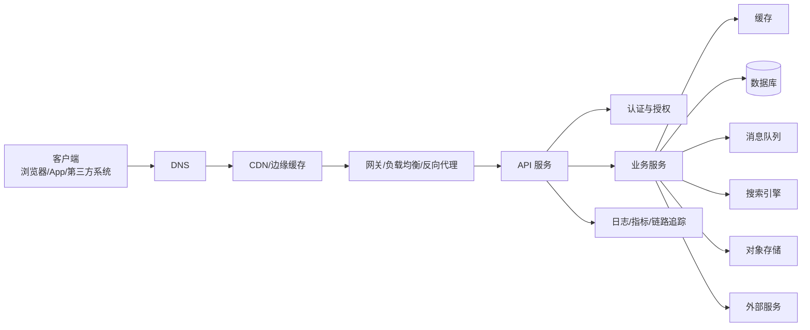

# 后端开发完整学习笔记

> Last researched: 2026-06-16  
> Audience level: 后端入门到进阶、全栈转后端、系统设计学习者  
> Scope: 本文不绑定具体编程语言，不讲某个语言或框架的语法，而是整理后端开发长期都会遇到的技术概念、术语、理论、架构思想、工程实践和常见坑。内容覆盖 Web 与 HTTP、API 设计、数据库、事务、缓存、消息队列、并发、分布式、微服务、安全、可观测性、部署运维、性能、测试和学习路线。

## 1. 后端是什么

后端是一个软件系统中负责业务逻辑、数据处理、状态管理、权限控制、系统集成、稳定性保障和资源调度的部分。用户通常看不到后端界面，但每一次登录、下单、支付、评论、搜索、上传、同步、通知、推荐和数据查询，背后都需要后端系统处理。

从最简单的角度看，后端做三类事情：

- 接收请求：来自浏览器、移动 App、桌面客户端、物联网设备、第三方系统、内部服务或定时任务。
- 处理业务：校验身份、检查权限、执行规则、读写数据、调用外部系统、生成结果。
- 返回结果：返回页面数据、接口响应、文件、事件、消息或异步任务状态。

一个典型后端系统可以这样理解：



Figure: 后端请求链路示意，综合参考 HTTP RFC、Kubernetes、OpenTelemetry、SRE 和云原生架构资料。

后端工程师不仅写接口，还要理解：

- 请求如何进入系统。
- 数据如何建模、存储、查询和一致。
- 系统如何处理高并发。
- 服务之间如何通信。
- 失败、超时、重试、限流、熔断如何设计。
- 如何保证安全、可观测、可部署、可维护、可扩展。
- 如何在成本、性能、复杂度和可靠性之间做取舍。

## 2. 后端知识地图

后端知识可以分成十几个模块：

| 模块 | 学什么 | 解决什么问题 |
| --- | --- | --- |
| 网络基础 | TCP/IP、DNS、TLS、HTTP、WebSocket | 请求如何传输 |
| API 设计 | REST、RPC、GraphQL、版本、错误码、幂等 | 系统如何对外提供能力 |
| 数据库 | 关系模型、索引、事务、隔离级别、SQL/NoSQL | 数据如何可靠存储和查询 |
| 缓存 | 本地缓存、分布式缓存、HTTP 缓存、多级缓存 | 如何降低延迟和数据库压力 |
| 消息队列 | Topic、Queue、Consumer、Offset、重试、死信 | 如何异步解耦和削峰 |
| 并发与异步 | 线程、协程、事件循环、锁、连接池、背压 | 如何同时处理大量任务 |
| 分布式系统 | CAP、BASE、一致性、共识、时钟、分片、复制 | 多节点如何协作 |
| 微服务 | 服务拆分、服务发现、网关、配置中心、服务治理 | 大系统如何拆分和演进 |
| 安全 | 认证、授权、OAuth、OIDC、JWT、OWASP、加密 | 如何保护系统和数据 |
| 可观测性 | 日志、指标、链路追踪、告警、Profiling | 如何发现和定位问题 |
| 部署运维 | 容器、Kubernetes、CI/CD、灰度、回滚、配置 | 如何稳定交付 |
| 性能优化 | 延迟、吞吐、P95/P99、压测、容量规划 | 如何让系统更快更稳 |
| 测试质量 | 单测、集成测试、契约测试、压测、故障演练 | 如何降低变更风险 |
| 工程规范 | 分层、模块边界、代码评审、文档、依赖管理 | 如何长期维护系统 |

学习后端不要只堆技术名词。每个技术都要回答四个问题：

- 它解决什么问题？
- 它带来什么代价？
- 它适合什么场景？
- 它不适合什么场景？

## 3. 后端系统的核心目标

后端系统通常追求以下目标：

| 目标 | 含义 | 典型指标 |
| --- | --- | --- |
| 正确性 | 业务规则、数据状态和权限判断正确 | 订单不丢、库存不超卖、金额无误 |
| 可用性 | 用户需要时系统能提供服务 | SLA、错误率、可用时长 |
| 可靠性 | 系统在故障下仍能保持可控行为 | 重试、降级、容灾、数据恢复 |
| 性能 | 请求处理速度和系统吞吐能力 | RT、QPS、P95、P99 |
| 可扩展性 | 流量、数据、团队增长时能继续演进 | 横向扩容、分片、模块边界 |
| 安全性 | 防止越权、泄露、篡改、攻击 | 鉴权、审计、加密、风控 |
| 可维护性 | 修改和排查成本可控 | 清晰架构、测试、文档、监控 |
| 成本效率 | 用合理资源满足业务目标 | 机器成本、存储成本、云资源成本 |

这些目标经常互相冲突：

- 强一致通常会降低可用性和性能。
- 缓存能提升性能，但会引入一致性问题。
- 微服务能增强团队自治，但会增加运维和分布式复杂度。
- 加密、审计和权限校验会增加开发和运行成本，但安全系统必须付出这些成本。
- 高可用通常需要冗余，冗余会增加成本。

后端设计的本质是在约束下做取舍。

## 4. 网络基础

### 4.1 OSI 与 TCP/IP

学习网络不一定要死背七层模型，但要知道每一层大概负责什么。

| 层级 | 常见概念 | 后端关注点 |
| --- | --- | --- |
| 应用层 | HTTP、DNS、WebSocket、gRPC、MQ 协议 | 接口语义、请求响应、序列化 |
| 传输层 | TCP、UDP、QUIC | 连接、可靠传输、拥塞、端口 |
| 网络层 | IP、路由、ICMP | 跨网络寻址、路由、连通性 |
| 链路层 | Ethernet、Wi-Fi | 局域网通信、MTU |
| 物理层 | 网线、光纤、无线信号 | 一般由基础设施处理 |

后端常见网络问题：

- DNS 解析慢或解析到错误地址。
- TCP 连接建立耗时。
- TLS 握手耗时。
- 网络丢包、重传、抖动。
- 连接池耗尽。
- 端口耗尽。
- 跨地域访问延迟高。
- 防火墙、安全组、路由配置错误。

### 4.2 DNS

DNS 负责把域名解析成 IP 地址。一次请求通常先经过 DNS。

关键术语：

| 术语 | 含义 |
| --- | --- |
| A 记录 | 域名指向 IPv4 地址 |
| AAAA 记录 | 域名指向 IPv6 地址 |
| CNAME | 域名别名 |
| MX | 邮件服务器记录 |
| TTL | DNS 记录缓存时间 |
| 权威 DNS | 真正管理某个域名记录的服务器 |
| 递归 DNS | 代客户端查询的 DNS 服务器 |

工程注意：

- DNS TTL 太长，故障切换慢。
- DNS TTL 太短，会增加解析压力。
- 客户端、系统、运行时和代理都可能缓存 DNS。
- 容器环境中 DNS 配置错误会导致服务偶发不可达。

### 4.3 TCP

TCP 是面向连接的可靠传输协议。它负责：

- 建立连接。
- 按序传输。
- 丢包重传。
- 流量控制。
- 拥塞控制。

后端需要关注：

- 三次握手：建立连接需要网络往返。
- 四次挥手：关闭连接也占资源。
- 长连接：减少频繁建连成本。
- Keep-Alive：复用连接，提高性能。
- TIME_WAIT：大量短连接可能导致端口资源问题。
- Nagle 算法、延迟确认、拥塞窗口等会影响延迟。

### 4.4 TLS/HTTPS

HTTPS = HTTP over TLS。TLS 提供：

- 机密性：防止明文被窃听。
- 完整性：防止传输内容被篡改。
- 身份认证：通过证书验证服务端身份。

常见术语：

| 术语 | 含义 |
| --- | --- |
| CA | 证书颁发机构 |
| 证书链 | 从服务端证书到根证书的信任链 |
| 公钥/私钥 | 非对称加密中的密钥对 |
| 会话恢复 | 减少重复握手成本 |
| TLS termination | 在负载均衡或网关处终止 TLS |

工程注意：

- 证书过期会导致全站不可访问。
- 内部服务也可能需要 TLS，尤其是跨网络或零信任环境。
- TLS 终止点决定了后续链路是否明文。
- 证书、私钥和密钥材料必须进入密钥管理系统，不能写进代码仓库。

## 5. HTTP 与 Web 基础

HTTP 是后端 API 最常见的协议基础。RFC 9110 将 HTTP 定义为无状态应用层协议。无状态不代表系统没有状态，而是每个请求本身不依赖服务端自动记住上一次请求；状态通常通过 Cookie、Token、Session、数据库或缓存管理。

### 5.1 HTTP 请求结构

HTTP 请求通常包含：

- 请求方法：GET、POST、PUT、PATCH、DELETE 等。
- URL：协议、域名、路径、查询参数。
- Header：元数据，如 Content-Type、Authorization、Cookie、Cache-Control。
- Body：请求体，如 JSON、表单、文件。

示意：

```text
METHOD /path?query=value HTTP/version
Header-Name: value

body
```

后端处理请求时通常要做：

- 解析路径和参数。
- 校验请求头。
- 鉴权。
- 解析请求体。
- 参数校验。
- 执行业务逻辑。
- 返回状态码、响应头和响应体。

### 5.2 HTTP 方法

| 方法 | 语义 | 是否安全 | 是否幂等 | 常见用途 |
| --- | --- | --- | --- | --- |
| GET | 获取资源 | 是 | 是 | 查询详情、列表 |
| HEAD | 获取响应头 | 是 | 是 | 检查资源元数据 |
| POST | 提交处理 | 否 | 通常否 | 创建、提交动作 |
| PUT | 整体替换资源 | 否 | 是 | 更新完整资源 |
| PATCH | 局部更新资源 | 否 | 不一定 | 修改部分字段 |
| DELETE | 删除资源 | 否 | 是 | 删除资源 |
| OPTIONS | 查询支持能力 | 是 | 是 | CORS 预检 |

安全方法指理论上不改变服务端资源。幂等指同一个请求执行一次和执行多次的效果相同。

工程注意：

- GET 不应该用于有副作用的操作。
- POST 创建订单、支付等操作要做业务幂等。
- DELETE 幂等不代表每次响应都一样，第一次可能 200，后续可能 404，但资源最终状态一致。
- PATCH 需要明确合并语义，否则容易产生并发覆盖。

### 5.3 HTTP 状态码

| 范围 | 含义 | 示例 |
| --- | --- | --- |
| 1xx | 信息响应 | 100 Continue |
| 2xx | 成功 | 200 OK、201 Created、204 No Content |
| 3xx | 重定向 | 301、302、304 |
| 4xx | 客户端错误 | 400、401、403、404、409、422、429 |
| 5xx | 服务端错误 | 500、502、503、504 |

常用状态码：

| 状态码 | 含义 | 后端使用建议 |
| --- | --- | --- |
| 200 | 成功 | 普通查询和操作成功 |
| 201 | 已创建 | 创建资源成功 |
| 204 | 成功但无响应体 | 删除成功或无需返回内容 |
| 400 | 请求格式错误 | 参数格式、JSON 格式错误 |
| 401 | 未认证 | 未登录、Token 无效 |
| 403 | 无权限 | 已认证但无访问权限 |
| 404 | 资源不存在 | 路径或业务资源不存在 |
| 409 | 冲突 | 版本冲突、重复提交 |
| 422 | 语义校验失败 | 字段合法但业务规则不通过 |
| 429 | 请求过多 | 限流 |
| 500 | 服务内部错误 | 未预期异常 |
| 502 | 网关收到错误响应 | 上游异常 |
| 503 | 服务不可用 | 过载、维护、熔断 |
| 504 | 网关超时 | 上游超时 |

### 5.4 Header

常见请求头和响应头：

| Header | 用途 |
| --- | --- |
| Content-Type | 请求或响应体格式 |
| Accept | 客户端希望接收的格式 |
| Authorization | 认证凭证 |
| Cookie | 浏览器携带的状态信息 |
| Set-Cookie | 服务端设置 Cookie |
| Cache-Control | 缓存策略 |
| ETag | 资源版本标识 |
| If-None-Match | 协商缓存 |
| Location | 重定向或新资源地址 |
| X-Request-ID / Traceparent | 请求追踪 |
| User-Agent | 客户端信息 |
| X-Forwarded-For | 代理链路中的原始 IP |

工程注意：

- 不要完全信任 `X-Forwarded-For`，它可能被客户端伪造，除非来自可信代理。
- 敏感信息不要放在 URL 查询参数中，因为 URL 可能进入日志、浏览器历史和代理。
- `Content-Type` 和实际 body 格式要一致。
- 返回错误时也应有统一响应结构，方便客户端处理。

### 5.5 Cookie、Session、Token

| 机制 | 状态存在哪里 | 优点 | 缺点 |
| --- | --- | --- | --- |
| Cookie | 浏览器 | 自动携带，适合 Web | 需要防 CSRF、大小有限 |
| Session | 服务端，客户端只存 Session ID | 服务端可控，可主动失效 | 需要共享存储或粘性会话 |
| Token | 客户端携带，服务端验证 | 适合多端和 API | 泄露风险、撤销复杂 |

常见设计：

- Web 管理后台：Cookie + Session，配合 CSRF 防护。
- 移动 App：Access Token + Refresh Token。
- 第三方授权：OAuth 2.0。
- 身份认证层：OpenID Connect。

## 6. API 设计

API 是后端对外或对内暴露能力的契约。好的 API 应该稳定、清晰、可演进、可观测、可测试、可安全控制。

### 6.1 REST

REST 强调资源、表示、统一接口和无状态。实际工程中常见 RESTful 风格：

```text
GET    /users
GET    /users/{id}
POST   /users
PUT    /users/{id}
PATCH  /users/{id}
DELETE /users/{id}
```

REST 设计原则：

- URL 表示资源，不要把所有动作都写成动词。
- 使用 HTTP 方法表达操作意图。
- 使用状态码表达通用结果。
- 使用响应体表达业务数据和业务错误。
- 分页、排序、过滤要有统一规则。
- 对破坏性操作考虑幂等和审计。

不好的例子：

```text
GET /deleteUser?id=1
POST /getUserInfo
```

更好的例子：

```text
DELETE /users/1
GET /users/1
```

### 6.2 RPC

RPC 强调像调用本地函数一样调用远程服务。常见形式：

```text
UserService.GetUser
OrderService.CreateOrder
PaymentService.Refund
```

RPC 适合：

- 内部服务间通信。
- 强接口契约。
- 高性能二进制协议。
- 需要代码生成客户端和服务端桩。

RPC 风险：

- 远程调用不是本地调用，会失败、超时、重试、网络分区。
- 接口强耦合，版本管理要严格。
- 跨团队依赖容易复杂。

### 6.3 GraphQL

GraphQL 允许客户端声明需要哪些字段。适合：

- 前端页面组合复杂。
- 多端需要不同字段。
- 聚合多个后端资源。

风险：

- 查询复杂度难控制。
- N+1 查询问题。
- 缓存比 REST 更复杂。
- 权限要做到字段级和对象级。

### 6.4 WebSocket、SSE、Webhook

| 技术 | 方向 | 适合场景 |
| --- | --- | --- |
| WebSocket | 双向长连接 | 聊天、协作、实时游戏、实时通知 |
| SSE | 服务端到客户端单向推送 | 实时日志、通知、进度 |
| Webhook | 服务端调用另一个服务端 | 支付回调、代码仓库事件、第三方通知 |

Webhook 设计要点：

- 签名校验，防伪造。
- 幂等处理，防重复通知。
- 重试机制，防临时失败。
- 事件 ID 和时间戳。
- 回调失败可查询补偿。

### 6.5 API 版本

常见版本策略：

| 方式 | 示例 | 优点 | 缺点 |
| --- | --- | --- | --- |
| URL 版本 | `/v1/users` | 直观 | URL 被版本污染 |
| Header 版本 | `Accept: application/vnd.xxx.v1+json` | 更符合内容协商 | 客户端调试稍复杂 |
| 参数版本 | `?version=1` | 简单 | 容易混乱 |
| 兼容演进 | 新增字段，不破坏旧字段 | 用户无感 | 需要严格兼容规则 |

API 演进规则：

- 新增字段通常兼容。
- 删除字段通常不兼容。
- 改字段类型通常不兼容。
- 改枚举含义可能不兼容。
- 错误码语义改变可能不兼容。

### 6.6 幂等

幂等是后端核心概念。它解决“同一个请求可能被提交多次”的问题。

常见重复来源：

- 用户重复点击。
- 客户端超时重试。
- 网关重试。
- 消息队列重复投递。
- 第三方回调重复发送。
- 服务宕机后任务重新执行。

常见方案：

| 方案 | 适合 |
| --- | --- |
| 唯一业务号 | 订单号、支付流水号、请求 ID |
| 幂等表 | 记录请求 ID 和处理结果 |
| 数据库唯一约束 | 防重复创建 |
| 状态机 | 只允许合法状态流转 |
| 乐观锁版本号 | 防并发覆盖 |
| 分布式锁 | 控制短时间重复执行，但不能单独作为最终保证 |

幂等原则：

- 关键业务必须有业务级唯一标识。
- 幂等结果最好可重复返回。
- 幂等记录要有过期或归档策略。
- 锁只能减少并发冲突，最终仍需唯一约束或状态机兜底。

## 7. 业务建模与分层

### 7.1 为什么需要分层

后端系统如果没有分层，很容易出现：

- 接口层直接写数据库。
- 权限校验散落各处。
- 业务规则重复实现。
- 数据库表结构泄露到 API。
- 修改一个字段牵动大量代码。
- 测试困难。

常见分层：

| 层 | 职责 |
| --- | --- |
| 接入层 | HTTP/RPC 协议、参数解析、基础校验 |
| 应用层 | 用例编排、事务边界、调用领域服务 |
| 领域层 | 核心业务规则、实体、值对象、领域服务 |
| 基础设施层 | 数据库、缓存、消息、外部 API |
| 展示/响应层 | DTO、响应结构、错误映射 |

分层不是为了形式，而是为了边界清晰：

- 协议变化不应该影响核心业务。
- 数据库变化不应该直接污染 API。
- 外部服务变化应该被适配层隔离。
- 核心规则应该能被测试。

### 7.2 领域模型

领域模型是业务概念在系统中的表达。

常见术语：

| 术语 | 含义 |
| --- | --- |
| Entity 实体 | 有唯一身份，生命周期中属性会变化 |
| Value Object 值对象 | 没有独立身份，以值相等判断 |
| Aggregate 聚合 | 一组强一致业务对象的边界 |
| Aggregate Root 聚合根 | 聚合对外操作入口 |
| Domain Service 领域服务 | 不自然属于某个实体的业务规则 |
| Repository 仓储 | 持久化抽象 |
| Domain Event 领域事件 | 领域内已经发生的事实 |

例子：

- 订单是实体，因为有订单 ID。
- 金额可以是值对象，因为金额由数值和币种组成。
- 订单和订单明细可以组成聚合。
- “订单已支付”可以是领域事件。

### 7.3 DTO、VO、DO、PO

不同团队命名不完全一致，但核心是区分边界：

| 名称 | 常见含义 |
| --- | --- |
| DTO | 数据传输对象，用于接口输入输出 |
| VO | 展示对象或值对象，语境不同要明确 |
| DO | 领域对象或数据对象，团队约定不同 |
| PO | 持久化对象，通常对应数据库表 |
| Entity | 领域实体或 ORM 实体，语境要明确 |

建议：

- 不要让数据库对象直接作为 API 响应。
- 不要让外部请求对象直接进入领域核心。
- 转换代码虽然麻烦，但能隔离变化。

## 8. 数据库基础

数据库是后端系统的核心。它不只是“存数据”，还承担一致性、查询、事务、约束和恢复能力。

### 8.1 关系型数据库

关系型数据库基于表、行、列和关系模型。常见能力：

- SQL 查询。
- 事务。
- 主键、外键、唯一约束。
- 索引。
- 视图。
- 存储过程。
- 复制和备份。

适合：

- 结构化数据。
- 强一致业务。
- 复杂查询。
- 事务要求高。

不适合：

- 超大规模非结构化文件存储。
- 极高写入吞吐且关系很弱的数据。
- 灵活字段频繁变化且查询模式不稳定的场景。

### 8.2 NoSQL

NoSQL 是非关系型数据库的泛称，不是一种单一技术。

| 类型 | 典型特点 | 适合场景 |
| --- | --- | --- |
| Key-Value | 按 key 访问 value | 缓存、会话、计数 |
| Document | 文档结构，字段灵活 | 内容、配置、用户画像 |
| Wide Column | 宽列、分布式、高吞吐 | 时序、大规模日志 |
| Graph | 节点和边 | 社交关系、知识图谱、路径查询 |
| Search Engine | 倒排索引、全文检索 | 搜索、日志检索 |
| Time Series | 时间序列优化 | 监控指标、IoT 数据 |

选择 NoSQL 时要问：

- 查询模式是什么？
- 是否需要事务？
- 是否需要复杂关联？
- 数据是否会快速增长？
- 分片和扩容如何做？
- 一致性模型是什么？
- 运维复杂度是否可接受？

### 8.3 数据建模

数据建模要从业务问题出发，而不是从表开始。

步骤：

1. 找核心对象：用户、订单、商品、支付、库存、账户。
2. 找对象关系：一对一、一对多、多对多。
3. 找生命周期：创建、变更、取消、完成、归档。
4. 找不变量：金额不能为负、订单不能重复支付、库存不能超卖。
5. 找查询场景：详情、列表、筛选、统计、搜索。
6. 找一致性边界：哪些数据必须同事务更新。
7. 找增长模式：哪些表会快速变大。

### 8.4 索引

索引是数据库查询性能的关键。它通过额外的数据结构加速查找，但会增加写入和存储成本。

常见索引：

| 类型 | 说明 |
| --- | --- |
| 主键索引 | 唯一标识行 |
| 唯一索引 | 保证字段唯一 |
| 普通索引 | 加速查询 |
| 联合索引 | 多列组合索引 |
| 全文索引 | 文本搜索 |
| 空间索引 | 地理空间数据 |

索引设计原则：

- 为高频查询条件建索引。
- 联合索引顺序要匹配查询模式。
- 不要给低选择性字段盲目建索引。
- 不要索引太多，写入会变慢。
- 索引要覆盖排序和分页需求。
- 定期检查慢查询和执行计划。

常见慢查询原因：

- 没有索引。
- 索引失效。
- 查询返回行太多。
- 深分页。
- N+1 查询。
- 大事务锁等待。
- 统计信息不准确。
- 数据量增长后原查询不再适合。

### 8.5 事务与 ACID

事务是一组操作的逻辑单元。ACID：

| 特性 | 含义 |
| --- | --- |
| Atomicity 原子性 | 要么全部成功，要么全部失败 |
| Consistency 一致性 | 事务前后满足约束和业务规则 |
| Isolation 隔离性 | 并发事务之间互不干扰到一定程度 |
| Durability 持久性 | 提交后数据不会因普通故障丢失 |

事务不是越大越好。大事务会：

- 持有锁更久。
- 增加回滚成本。
- 增加复制延迟。
- 阻塞其他请求。
- 占用更多日志和内存。

事务边界建议：

- 只包住必须强一致的操作。
- 不要在事务里调用慢外部服务。
- 不要在事务里等待用户输入。
- 不要把批量大任务放进一个超大事务。

### 8.6 隔离级别

常见隔离级别：

| 隔离级别 | 可能问题 | 特点 |
| --- | --- | --- |
| Read Uncommitted | 脏读、不可重复读、幻读 | 很少用于严肃业务 |
| Read Committed | 不可重复读、幻读 | 很多数据库默认或常用 |
| Repeatable Read | 幻读或特定实现下避免幻读 | 同事务多次读一致性更强 |
| Serializable | 最强隔离 | 并发性能最低，可能重试 |

并发异常：

| 异常 | 含义 |
| --- | --- |
| 脏读 | 读到未提交数据 |
| 不可重复读 | 同事务两次读同一行结果不同 |
| 幻读 | 同事务两次范围查询行数不同 |
| 丢失更新 | 两个事务覆盖彼此更新 |
| 写偏斜 | 两个事务分别更新不同记录，合起来破坏约束 |

MVCC 多版本并发控制通过保存数据版本，让读写并发更高。不同数据库对隔离级别的实现不同，学习时要以具体数据库官方文档为准。

### 8.7 分库分表

当单库单表承载不了数据量或写入压力时，可能需要分库分表。

常见方式：

| 方式 | 含义 |
| --- | --- |
| 垂直分库 | 按业务模块拆库 |
| 垂直分表 | 把大表按字段拆成多表 |
| 水平分库 | 按用户 ID、订单 ID 等分到多个库 |
| 水平分表 | 一张逻辑表拆成多张物理表 |

分片键选择非常关键：

- 要高频出现在查询条件中。
- 分布要均匀。
- 尽量避免跨分片事务。
- 尽量避免热点分片。

分库分表代价：

- 跨分片查询复杂。
- 全局唯一 ID 复杂。
- 分布式事务复杂。
- 扩容迁移复杂。
- 运维和排障复杂。

不要过早分库分表。很多系统先通过索引、缓存、读写分离、归档、冷热分离就能支撑很久。

## 9. 缓存

缓存是后端性能优化中最常用也最容易出问题的技术。

### 9.1 缓存解决什么

缓存通过保存计算结果或查询结果来减少重复访问慢资源。

适合：

- 读多写少。
- 访问热点明显。
- 可以接受短暂旧数据。
- 回源成本高。
- 结果可由 key 唯一确定。

不适合：

- 强一致核心状态。
- 写多读少。
- 命中率低。
- value 很大。
- key 数量不可控。

### 9.2 缓存层级

```text
浏览器缓存 -> CDN -> 网关缓存 -> 应用本地缓存 -> 分布式缓存 -> 数据库
```

| 层级 | 优点 | 风险 |
| --- | --- | --- |
| 浏览器缓存 | 最近，减少网络请求 | 失效不可完全控制 |
| CDN | 抗大流量，适合静态和公开内容 | 个性化数据不能乱缓存 |
| 网关缓存 | 降低应用入口压力 | 配置复杂 |
| 本地缓存 | 延迟极低 | 多实例一致性弱 |
| 分布式缓存 | 多实例共享 | 网络开销、热点、大 key |
| 数据库 | 权威数据源 | 慢、贵、连接有限 |

### 9.3 缓存模式

| 模式 | 读流程 | 写流程 | 适合 |
| --- | --- | --- | --- |
| Cache-Aside | 应用先读缓存，未命中读 DB 再写缓存 | 写 DB 后删除缓存 | 最常见 |
| Read-Through | 缓存层负责加载数据 | 应用不直接感知加载 | 本地缓存框架 |
| Write-Through | 写缓存时同步写 DB | 缓存和 DB 同步写 | 简单对象 |
| Write-Behind | 先写缓存/队列，异步写 DB | 延迟落库 | 统计、日志 |
| Refresh-Ahead | 快过期前异步刷新 | 后台刷新 | 热点数据 |

### 9.4 缓存穿透、击穿、雪崩

| 问题 | 含义 | 解决 |
| --- | --- | --- |
| 穿透 | 查询不存在数据，每次都打 DB | 参数校验、空值缓存、布隆过滤器、限流 |
| 击穿 | 热点 key 过期，大量请求回源 | 互斥回源、单飞、逻辑过期、预热 |
| 雪崩 | 大量 key 同时失效或缓存集群故障 | TTL 抖动、多级缓存、限流、降级、高可用 |

### 9.5 缓存一致性

缓存一致性要先区分业务要求：

- 强一致：不能读旧值，缓存不能作为最终判断依据。
- 最终一致：短时间旧值可接受。
- 弱一致：允许较长时间旧值，如榜单和统计。

常见方案：

- 先更新数据库，再删除缓存。
- 删除失败进入重试队列。
- 通过消息队列或 CDC 订阅变更后失效缓存。
- 使用短 TTL 自然收敛。
- 热点数据使用逻辑过期。
- value 带版本号，避免旧值覆盖新值。

重要原则：

- 数据库是权威数据源。
- 缓存删除失败要可重试。
- 不要依赖缓存做强一致决策。
- 不要只考虑正常流程，要考虑超时、重试、并发读写和消息乱序。

## 10. 消息队列与事件驱动

消息队列用于异步解耦、削峰填谷、事件通知和可靠任务处理。

### 10.1 基本概念

| 术语 | 含义 |
| --- | --- |
| Producer | 消息生产者 |
| Consumer | 消息消费者 |
| Topic | 主题，按业务分类消息 |
| Queue | 队列，保存待消费消息 |
| Partition | 分区，用于并行和扩展 |
| Offset | 消费位置 |
| Consumer Group | 消费者组，同组内分摊消息 |
| Ack | 消费确认 |
| Retry | 消费失败后重试 |
| DLQ | 死信队列，保存多次失败消息 |

### 10.2 为什么用消息队列

| 目的 | 示例 |
| --- | --- |
| 异步 | 下单后异步发短信、加积分 |
| 解耦 | 订单系统不直接依赖通知系统 |
| 削峰 | 秒杀请求先进入队列慢慢处理 |
| 广播 | 用户注册事件被多个系统订阅 |
| 重试 | 第三方接口失败后延迟重试 |
| 顺序 | 同一订单事件按顺序处理 |

### 10.3 消息投递语义

| 语义 | 含义 | 工程解释 |
| --- | --- | --- |
| At most once | 最多一次 | 可能丢，不重复 |
| At least once | 至少一次 | 不丢，但可能重复 |
| Exactly once | 恰好一次 | 条件苛刻，通常限定在特定系统边界内 |

现实中最常见是 At least once + 幂等消费。

消费者必须考虑：

- 重复消息。
- 消息乱序。
- 消息延迟。
- 消费失败。
- 消息积压。
- 消费者扩缩容。
- 下游系统不可用。

### 10.4 幂等消费

常见幂等方法：

- 用消息 ID 去重。
- 用业务唯一键去重。
- 数据库唯一约束。
- 状态机只允许合法转移。
- 先查状态再执行。
- 记录消费日志。

### 10.5 事务消息与最终一致

典型问题：数据库写成功了，但消息发送失败怎么办？

常见方案：

| 方案 | 思路 |
| --- | --- |
| 本地消息表 | 在同一个数据库事务中写业务数据和消息表，后台投递 |
| Outbox Pattern | 把待发布事件写入 outbox，再由发布器发送 |
| 事务消息 | 中间件提供半消息和提交确认机制 |
| CDC | 订阅数据库日志，把变更转换成事件 |

最终一致不是“不一致”，而是系统在短时间内允许中间状态，最终通过重试、补偿和对账收敛。

## 11. 并发与异步

后端系统需要同时处理大量请求。并发设计要解决资源利用、互斥、排队、超时和失败传播问题。

### 11.1 并发、并行、异步

| 概念 | 含义 |
| --- | --- |
| 并发 | 同一时间段处理多个任务 |
| 并行 | 同一时刻真正同时执行多个任务 |
| 同步 | 调用方等待结果 |
| 异步 | 调用方不立即等待最终结果 |
| 阻塞 | 执行单元等待资源 |
| 非阻塞 | 没结果也能继续做其他事 |

### 11.2 线程池与连接池

池化的目的：

- 复用昂贵资源。
- 限制并发上限。
- 减少创建销毁成本。
- 提供排队和拒绝策略。

线程池关注：

- 核心线程数。
- 最大线程数。
- 队列大小。
- 拒绝策略。
- 任务执行耗时。
- 队列等待时间。

连接池关注：

- 最大连接数。
- 空闲连接数。
- 获取连接超时。
- 连接泄漏。
- 下游最大承载能力。

常见坑：

- 无界队列导致内存爆。
- 所有任务共用一个线程池。
- 慢任务拖垮快任务。
- 连接池开太大压垮数据库。
- 没有超时，导致资源长期占用。

### 11.3 锁与竞争

锁用于保护共享资源，但锁会引入等待。

优化思路：

- 减少共享状态。
- 缩小锁范围。
- 避免锁内调用外部服务。
- 拆分热点锁。
- 使用乐观锁。
- 使用无锁或分段数据结构。

常见锁概念：

| 术语 | 含义 |
| --- | --- |
| 互斥锁 | 同一时间只允许一个执行者进入临界区 |
| 读写锁 | 多读并发、写互斥 |
| 乐观锁 | 假设冲突少，通过版本号检测 |
| 悲观锁 | 假设冲突多，先加锁 |
| 分布式锁 | 跨进程或跨节点协调互斥 |

分布式锁注意：

- 必须有过期时间，防死锁。
- 解锁要校验持有者身份。
- 锁过期不代表业务已经完成。
- 分布式锁不能替代数据库唯一约束和状态机。

### 11.4 背压

背压是当下游处理不过来时，上游主动减速或拒绝，避免无限堆积。

没有背压会出现：

- 队列越来越长。
- 延迟越来越高。
- 内存耗尽。
- 超时重试放大流量。
- 整体雪崩。

背压方式：

- 有界队列。
- 限流。
- 拒绝策略。
- 暂停消费。
- 降低生产速率。
- 返回 429/503。

## 12. 分布式系统理论

分布式系统是多个节点通过网络协作完成任务的系统。它的难点来自网络不可靠、节点会失败、时间不一致、状态分散。

### 12.1 CAP

CAP 讨论分布式系统在网络分区时的一致性和可用性取舍。

| 字母 | 含义 |
| --- | --- |
| C Consistency | 所有客户端看到一致结果 |
| A Availability | 每个请求都能得到非错误响应 |
| P Partition Tolerance | 网络分区时系统仍能继续运行 |

重要理解：

- 分布式系统必须面对网络分区。
- CAP 不是平时“三选二”，而是分区发生时在 C 和 A 之间取舍。
- 很多系统在正常情况下尽量同时提供一致性和可用性，在异常情况下采取降级策略。

### 12.2 BASE

BASE 是对高可用分布式系统的一种思想：

| 概念 | 含义 |
| --- | --- |
| Basically Available | 基本可用 |
| Soft State | 允许中间状态 |
| Eventually Consistent | 最终一致 |

BASE 常见于互联网业务，如订单状态同步、积分到账、搜索索引更新、推荐特征更新。

### 12.3 一致性模型

| 模型 | 含义 |
| --- | --- |
| 强一致 | 写入后任何读都能看到最新值 |
| 线性一致 | 操作看起来像按全局实时顺序发生 |
| 顺序一致 | 所有节点看到同一顺序，但不一定符合真实时间 |
| 因果一致 | 有因果关系的操作顺序一致 |
| 最终一致 | 如果没有新写入，最终所有副本收敛 |
| 读己之写 | 用户能读到自己刚写的数据 |

业务上常常不需要全局强一致，但需要局部一致：

- 用户修改头像后自己立即可见。
- 订单支付成功后订单状态不能回退。
- 库存扣减不能超卖。
- 搜索结果可以延迟几秒更新。

### 12.4 复制与分片

复制解决可用性和读扩展：

- 主从复制。
- 多主复制。
- 仲裁复制。
- 同步复制。
- 异步复制。

分片解决容量和写扩展：

- 按用户 ID 分片。
- 按租户分片。
- 按时间分片。
- 按地理区域分片。

复制的问题：

- 主从延迟。
- 脑裂。
- 故障切换。
- 读到旧数据。

分片的问题：

- 跨分片查询。
- 热点分片。
- 扩容迁移。
- 全局唯一 ID。

### 12.5 共识

共识算法用于让多个节点在故障情况下对某个值或日志顺序达成一致。

常见术语：

| 术语 | 含义 |
| --- | --- |
| Leader | 领导节点 |
| Follower | 跟随节点 |
| Quorum | 多数派 |
| Term/Epoch | 任期 |
| Log Replication | 日志复制 |
| Election | 选举 |

工程应用：

- 配置中心。
- 分布式协调。
- 元数据管理。
- 分布式数据库。

学习重点不是手写算法，而是理解：

- 为什么需要多数派。
- 为什么网络分区会导致可用性下降。
- 为什么脑裂危险。
- 为什么时钟不能随便用来判断全局顺序。

## 13. 微服务与服务治理

### 13.1 单体与微服务

| 架构 | 优点 | 缺点 |
| --- | --- | --- |
| 单体 | 简单、部署容易、本地事务直接 | 大团队协作难、模块边界容易腐化 |
| 模块化单体 | 保持单部署，内部模块清晰 | 需要强纪律维护边界 |
| 微服务 | 独立部署、按业务拆分、团队自治 | 分布式复杂度、运维成本、数据一致性难 |

不要为了“高级”而过早微服务。很多系统先做好模块化单体更合理。

### 13.2 服务拆分

拆分依据：

- 业务能力。
- 团队边界。
- 数据所有权。
- 变更频率。
- 性能和扩展需求。
- 合规和安全边界。

错误拆分方式：

- 按技术层拆：用户 Controller 服务、用户 DAO 服务。
- 过细拆分：每张表一个服务。
- 共享数据库：多个服务直接读写同一批表。
- 没有明确 owner：谁都能改，谁都不负责。

### 13.3 服务发现与注册

服务发现解决“服务实例在哪里”的问题。

模式：

- 客户端发现：客户端查询注册中心后直连服务实例。
- 服务端发现：客户端请求负载均衡，负载均衡查找后端实例。

服务注册信息通常包括：

- 服务名。
- 实例地址。
- 端口。
- 健康状态。
- 元数据。
- 版本。

### 13.4 API 网关

API 网关是入口层，常见职责：

- 路由。
- 认证。
- 限流。
- 熔断。
- 协议转换。
- 请求聚合。
- 灰度发布。
- 日志和追踪。
- 跨域处理。

风险：

- 网关过度承载业务逻辑会变成新的大单体。
- 网关是关键入口，必须高可用。
- 网关配置错误影响面很大。

### 13.5 配置中心

配置中心管理运行时配置：

- 数据库地址。
- 开关。
- 阈值。
- 限流规则。
- 灰度规则。
- 第三方服务配置。

配置原则：

- 配置和代码分离。
- 敏感配置加密或走密钥系统。
- 配置变更可审计。
- 配置发布支持灰度和回滚。
- 配置读取失败要有默认策略。

### 13.6 分布式事务与 Saga

微服务中每个服务拥有自己的数据，跨服务强事务很难。

常见方案：

| 方案 | 特点 |
| --- | --- |
| 2PC | 强协调，阻塞和可用性问题明显 |
| Saga | 一系列本地事务 + 补偿事务 |
| TCC | Try、Confirm、Cancel 三阶段 |
| 事务消息 | 通过消息中间件协调 |
| 最终一致 + 对账 | 允许短暂不一致，后台修复 |

Saga 适合长流程，如下单、支付、库存、物流。关键是每一步都要设计补偿操作。

## 14. 安全

后端安全是必修内容。安全不是最后加一个鉴权中间件，而是贯穿设计、开发、测试、部署和运维。

### 14.1 认证与授权

| 概念 | 含义 |
| --- | --- |
| Authentication 认证 | 证明你是谁 |
| Authorization 授权 | 判断你能做什么 |
| Principal | 当前身份主体 |
| Role | 角色 |
| Permission | 权限 |
| Policy | 策略 |
| RBAC | 基于角色的访问控制 |
| ABAC | 基于属性的访问控制 |

常见错误：

- 只在前端控制按钮，不在后端鉴权。
- 只判断是否登录，不判断资源归属。
- 管理员接口没有二次确认或审计。
- 权限缓存更新不及时。

### 14.2 OAuth 2.0 与 OpenID Connect

OAuth 2.0 是授权框架，解决第三方应用如何获得有限访问权限。OpenID Connect 在 OAuth 2.0 上提供身份认证层。

常见角色：

| 角色 | 含义 |
| --- | --- |
| Resource Owner | 资源拥有者，通常是用户 |
| Client | 第三方客户端 |
| Authorization Server | 授权服务器 |
| Resource Server | 资源服务器 |

常见 Token：

| Token | 用途 |
| --- | --- |
| Access Token | 访问资源 API |
| Refresh Token | 获取新的 Access Token |
| ID Token | OIDC 中表达用户身份 |

工程注意：

- OAuth 不是登录协议，OIDC 才是身份认证层。
- Access Token 泄露风险高，要短有效期。
- Refresh Token 要安全保存并可撤销。
- 回调地址必须严格校验。
- 移动端和浏览器端要使用适合公共客户端的授权流程。

### 14.3 JWT

JWT 是一种自包含 Token 格式。

优点：

- 服务端可无状态验证。
- 适合跨服务传递身份声明。
- 易于扩展 claims。

缺点：

- 签发后撤销困难。
- 内容只是编码，不是加密，不能放敏感信息。
- Token 过大增加网络开销。
- 算法和密钥管理错误会造成严重漏洞。

JWT 使用建议：

- 使用短有效期。
- 使用 HTTPS。
- 校验签名、issuer、audience、过期时间。
- 不接受 `none` 算法。
- 密钥定期轮换。
- 不把密码、身份证、银行卡等敏感数据放入 payload。

### 14.4 OWASP API 安全风险

OWASP API Security Top 10 2023 中常见风险包括：

- 对象级授权失效。
- 认证失效。
- 对象属性级授权失效。
- 不受限制的资源消耗。
- 功能级授权失效。
- 敏感业务流无限制访问。
- 服务端请求伪造。
- 安全配置错误。
- 不当资产管理。
- 不安全的 API 消费。

后端安全检查：

- 每个接口是否鉴权？
- 是否校验用户对资源的所有权？
- 是否有速率限制？
- 是否有输入校验？
- 是否防 SQL 注入、命令注入、模板注入？
- 是否避免敏感信息进入日志？
- 是否有审计日志？
- 是否有密钥轮换？

### 14.5 常见攻击与防护

| 攻击 | 含义 | 防护 |
| --- | --- | --- |
| SQL 注入 | 拼接输入导致 SQL 被篡改 | 参数化查询、ORM 安全 API |
| XSS | 注入脚本 | 输出编码、CSP、富文本过滤 |
| CSRF | 借用户身份发请求 | CSRF Token、SameSite Cookie |
| SSRF | 诱导服务端请求内网地址 | URL 白名单、内网隔离 |
| 重放攻击 | 重复使用请求 | 时间戳、Nonce、签名、幂等 |
| 暴力破解 | 枚举密码或验证码 | 限流、锁定、验证码、风控 |
| 越权 | 访问不属于自己的资源 | 对象级授权 |

## 15. 可观测性

可观测性是系统通过外部输出理解内部状态的能力。OpenTelemetry 将遥测数据分为 traces、metrics、logs 等信号。

### 15.1 日志

日志用于记录发生了什么。

日志级别：

| 级别 | 用途 |
| --- | --- |
| DEBUG | 调试细节，生产慎用 |
| INFO | 关键业务事件 |
| WARN | 可恢复异常或异常趋势 |
| ERROR | 请求失败或需要关注的问题 |
| FATAL | 进程级严重错误 |

日志建议：

- 记录 request_id/trace_id。
- 记录业务关键字段，如订单号，但避免敏感信息。
- 结构化日志便于检索。
- 错误日志包含错误类型和上下文。
- 不要把密码、Token、身份证、银行卡写入日志。

### 15.2 指标

指标用于观察趋势。

常见指标类型：

| 类型 | 含义 |
| --- | --- |
| Counter | 只增计数，如请求数 |
| Gauge | 当前值，如队列长度 |
| Histogram | 分布，如请求延迟 |
| Summary | 摘要统计 |

服务级指标：

- QPS。
- 错误率。
- P50/P95/P99。
- 并发数。
- 队列长度。
- 线程池活跃数。
- 连接池等待时间。
- 缓存命中率。
- 消息积压。

### 15.3 链路追踪

链路追踪用于查看一次请求跨服务经过了哪里、每段耗时多少。

术语：

| 术语 | 含义 |
| --- | --- |
| Trace | 一次完整请求链路 |
| Span | 链路中的一个操作片段 |
| Trace ID | 链路 ID |
| Span ID | 片段 ID |
| Parent Span | 父片段 |

追踪适合定位：

- 哪个服务慢。
- 哪个数据库查询慢。
- 哪个外部调用超时。
- 是否发生重试。
- 请求是否经过异常路径。

### 15.4 SRE 四大黄金信号

| 信号 | 含义 |
| --- | --- |
| Latency | 请求延迟 |
| Traffic | 流量 |
| Errors | 错误 |
| Saturation | 饱和度 |

告警建议：

- 告警要基于用户影响，而不是所有噪声。
- 使用多窗口多燃烧率告警监控 SLO。
- 告警要能行动，不能只告诉“有问题”。
- 告警信息要包含服务、接口、区域、版本、可能原因和排查链接。

## 16. 性能与容量

### 16.1 性能指标

| 指标 | 含义 |
| --- | --- |
| Latency | 单次请求耗时 |
| Throughput | 单位时间处理能力 |
| QPS | 每秒请求数 |
| TPS | 每秒事务数 |
| P95/P99 | 尾延迟指标 |
| Error Rate | 错误率 |
| Saturation | 资源饱和度 |

不要只看平均值。平均值可能掩盖尾延迟。用户体验常常由 P95/P99 决定。

### 16.2 性能优化步骤

```text
明确目标 -> 建立基线 -> 找瓶颈 -> 小步修改 -> 压测验证 -> 灰度上线 -> 持续观察
```

常见瓶颈：

- 数据库慢查询。
- 缓存命中率低。
- 下游接口慢。
- 线程池耗尽。
- 连接池耗尽。
- 锁竞争。
- GC 或内存压力。
- 网络延迟。
- 大对象序列化。
- 日志过多。

### 16.3 压测

压测前要定义：

- 目标 QPS。
- 目标 P95/P99。
- 数据规模。
- 请求比例。
- 用户行为模型。
- 是否包含登录、写入、缓存、第三方依赖。
- 可接受错误率。

压测类型：

| 类型 | 目的 |
| --- | --- |
| 基准测试 | 测单组件能力 |
| 负载测试 | 验证目标流量 |
| 压力测试 | 找系统极限 |
| 稳定性测试 | 长时间运行 |
| 峰值测试 | 模拟突发 |
| 故障演练 | 验证异常下行为 |

### 16.4 容量规划

容量规划要估算：

- 日活、峰值在线、峰值 QPS。
- 平均请求大小和响应大小。
- 数据增长速度。
- 存储保留时间。
- 缓存容量。
- 消息积压能力。
- 数据库连接数。
- 单实例能力。
- 故障时剩余节点能否承载流量。

常见容量问题：

- 平时 30% 使用率，故障少一半节点后直接过载。
- 缓存容量只按当前数据估算，没有考虑增长。
- 日志保留策略不清晰，磁盘被打满。
- 消息队列积压后恢复速度不足。

## 17. 高可用与可靠性

### 17.1 可用性

可用性通常用百分比表示：

| 可用性 | 年不可用时间大约 |
| --- | --- |
| 99% | 3.65 天 |
| 99.9% | 8.76 小时 |
| 99.99% | 52.6 分钟 |
| 99.999% | 5.26 分钟 |

高可用不是口号，需要：

- 冗余。
- 健康检查。
- 自动故障转移。
- 限流和降级。
- 数据备份。
- 容灾演练。
- 监控告警。
- 发布回滚。

### 17.2 超时、重试、熔断

每个远程调用都要有超时。没有超时的调用会无限占用资源。

重试注意：

- 只对可重试错误重试。
- 设置最大次数。
- 使用指数退避和抖动。
- 请求必须幂等。
- 不要在系统过载时盲目重试。

熔断：

- 下游持续失败时快速失败。
- 半开状态少量探测。
- 恢复后逐步放量。

### 17.3 限流与降级

限流保护系统不被超过能力的流量打垮。

常见限流维度：

- 用户。
- IP。
- 接口。
- 租户。
- 应用。
- 资源 ID。

降级策略：

- 返回缓存旧值。
- 隐藏非核心模块。
- 返回默认值。
- 降低推荐质量。
- 延迟处理。

### 17.4 备份与容灾

备份关注能否恢复数据。容灾关注故障时业务能否继续。

术语：

| 术语 | 含义 |
| --- | --- |
| RPO | 最多能接受丢多少数据 |
| RTO | 最长能接受恢复多久 |
| 冷备 | 备份资源不运行，恢复慢 |
| 热备 | 备份资源随时可接管 |
| 多活 | 多个区域同时提供服务 |

备份必须定期恢复演练。没有恢复验证的备份不可靠。

## 18. 部署、运维与云原生

### 18.1 12-Factor

12-Factor App 是云原生应用的重要方法论，强调：

- 代码库统一。
- 依赖显式声明。
- 配置和代码分离。
- 后端服务作为附加资源。
- 构建、发布、运行分离。
- 无状态进程。
- 端口绑定。
- 水平扩展。
- 快速启动和优雅关闭。
- 开发、预发、生产尽量一致。
- 日志作为事件流。
- 管理任务一次性运行。

### 18.2 容器

容器把应用和运行依赖打包，提供一致运行环境。

容器关注：

- 镜像大小。
- 基础镜像安全。
- 环境变量。
- 文件系统。
- 健康检查。
- 资源限制。
- 日志输出。
- 优雅退出。

容器不是虚拟机。容器共享宿主机内核，隔离程度和安全策略需要额外配置。

### 18.3 Kubernetes

Kubernetes 是容器编排平台，用于管理容器化工作负载和服务。

核心概念：

| 概念 | 含义 |
| --- | --- |
| Pod | 最小调度单元，一个或多个容器 |
| Deployment | 管理无状态应用副本 |
| StatefulSet | 管理有状态应用 |
| Service | 为 Pod 提供稳定访问入口 |
| Ingress | 管理 HTTP/HTTPS 外部访问 |
| ConfigMap | 非敏感配置 |
| Secret | 敏感配置 |
| Namespace | 逻辑隔离 |
| HPA | 自动水平扩缩容 |

后端要理解：

- Pod 会重启，不能依赖本地状态。
- 服务发现通过 Service。
- 配置通过环境变量或挂载文件注入。
- 健康检查影响流量切换。
- 资源限制影响性能和稳定性。
- 日志应输出到标准输出，由平台收集。

### 18.4 CI/CD

CI/CD 目标是让变更稳定、可重复、可回滚地交付。

流程：

```text
提交代码 -> 静态检查 -> 自动测试 -> 构建镜像/产物 -> 安全扫描 -> 部署测试环境 -> 灰度 -> 全量 -> 监控 -> 回滚
```

发布策略：

| 策略 | 含义 |
| --- | --- |
| 滚动发布 | 分批替换实例 |
| 蓝绿发布 | 新旧两套环境切换 |
| 金丝雀发布 | 小流量验证后扩大 |
| 灰度发布 | 按用户、区域、比例放量 |
| 特性开关 | 功能发布和代码发布解耦 |

## 19. 测试与质量保障

### 19.1 测试类型

| 测试 | 目的 |
| --- | --- |
| 单元测试 | 验证最小逻辑单元 |
| 集成测试 | 验证模块和外部依赖协作 |
| 契约测试 | 验证服务间 API 契约 |
| 端到端测试 | 验证完整业务流程 |
| 回归测试 | 防止旧功能被破坏 |
| 性能测试 | 验证吞吐和延迟 |
| 安全测试 | 检查漏洞和配置风险 |
| 混沌测试 | 验证故障下系统韧性 |

### 19.2 测试金字塔

理想情况下：

- 单元测试多，运行快。
- 集成测试适中。
- 端到端测试少但覆盖关键链路。

端到端测试很有价值，但慢、脆弱、维护成本高，不适合覆盖所有细节。

### 19.3 测试数据

测试数据要关注：

- 正常数据。
- 边界数据。
- 空值。
- 重复数据。
- 大数据量。
- 权限差异。
- 并发冲突。
- 失败和超时。

## 20. 常见后端组件

### 20.1 反向代理与负载均衡

反向代理代表服务端接收请求，再转发给后端服务。

职责：

- TLS 终止。
- 静态资源。
- 路由。
- 负载均衡。
- 压缩。
- 限流。
- 请求头处理。
- 健康检查。

负载均衡算法：

| 算法 | 特点 |
| --- | --- |
| 轮询 | 简单均匀 |
| 加权轮询 | 实例能力不同 |
| 最少连接 | 适合长连接 |
| 一致性哈希 | 会话或缓存亲和 |
| 随机 | 简单且效果常常不错 |

### 20.2 搜索引擎

搜索引擎用于全文检索、复杂过滤、排序、聚合。

核心概念：

- 倒排索引。
- 分词。
- 相关性评分。
- 索引刷新。
- 文档。
- 分片和副本。

适合：

- 搜商品。
- 搜文章。
- 搜日志。
- 多字段过滤。
- 关键词高亮。

风险：

- 搜索索引通常不是权威数据源。
- 更新有延迟。
- 复杂查询可能很贵。
- 权限过滤容易漏。

### 20.3 对象存储

对象存储用于保存图片、视频、文档、备份等非结构化文件。

概念：

- Bucket。
- Object。
- Key。
- Presigned URL。
- 生命周期规则。
- 访问控制。

后端常见模式：

- 客户端向后端申请上传凭证。
- 客户端直传对象存储。
- 后端保存文件元数据。
- 下载时生成临时访问 URL。

### 20.4 定时任务

定时任务用于周期性执行：

- 数据同步。
- 报表生成。
- 订单超时关闭。
- 清理过期数据。
- 重试补偿。

注意：

- 多实例部署时防止重复执行。
- 任务要可重入和幂等。
- 任务失败要告警。
- 长任务要分片。
- 要有执行记录。

## 21. 后端工程规范

### 21.1 错误处理

错误要分层：

| 类型 | 示例 |
| --- | --- |
| 参数错误 | 字段缺失、格式错误 |
| 业务错误 | 库存不足、余额不足 |
| 权限错误 | 无权访问 |
| 依赖错误 | 数据库超时、第三方失败 |
| 系统错误 | 未预期异常 |

统一错误响应应包含：

- 错误码。
- 用户可理解消息。
- 请求 ID。
- 可选详细信息。

不要把内部堆栈、SQL、密钥、服务器路径返回给用户。

### 21.2 配置管理

配置分类：

- 环境配置：域名、数据库地址。
- 业务配置：开关、阈值。
- 安全配置：密钥、证书。
- 运维配置：日志级别、限流规则。

配置原则：

- 配置和代码分离。
- 敏感配置加密。
- 配置变更可审计。
- 重要配置支持回滚。
- 配置要有默认值和校验。

### 21.3 文档

后端文档包括：

- API 文档。
- 数据模型文档。
- 架构图。
- 部署文档。
- 故障处理手册。
- 变更记录。
- 运维手册。

文档不是越多越好，关键是能帮助交付和排障。

### 21.4 代码评审

代码评审关注：

- 业务逻辑是否正确。
- 权限是否完整。
- 幂等是否处理。
- 事务边界是否合理。
- 缓存一致性是否考虑。
- 超时重试是否合理。
- 日志和指标是否足够。
- 是否引入安全风险。
- 是否有测试。

## 22. 后端常见术语表

| 术语 | 解释 |
| --- | --- |
| API | 应用程序接口，系统对外暴露能力 |
| Endpoint | 一个具体接口地址 |
| Middleware | 中间处理逻辑，如鉴权、日志 |
| ORM | 对象和关系表映射 |
| DTO | 数据传输对象 |
| Idempotency | 幂等 |
| Rate Limit | 限流 |
| Circuit Breaker | 熔断 |
| Fallback | 降级兜底 |
| Backpressure | 背压 |
| Sharding | 分片 |
| Replication | 复制 |
| Failover | 故障转移 |
| Leader Election | 主节点选举 |
| Quorum | 多数派 |
| SLA | 服务等级协议 |
| SLO | 服务等级目标 |
| SLI | 服务等级指标 |
| RPO | 恢复点目标 |
| RTO | 恢复时间目标 |
| Blue-Green | 蓝绿发布 |
| Canary | 金丝雀发布 |
| Rollback | 回滚 |
| Hot Key | 热点 key |
| Big Key | 大 key |
| Dead Letter Queue | 死信队列 |
| CDC | 变更数据捕获 |
| Outbox | 本地消息箱模式 |
| Saga | 分布式事务补偿模式 |
| BFF | Backend for Frontend，为特定前端提供聚合 API |

## 23. 学习路线

### 23.1 第一阶段：Web 和数据库基础

目标：能理解一个普通后端接口如何工作。

学习内容：

- HTTP 请求响应。
- REST API。
- 状态码。
- Cookie、Session、Token。
- 关系型数据库。
- SQL 基础。
- 索引。
- 事务。
- 基础鉴权。

要能回答：

- 一个请求从浏览器到后端经历了什么？
- GET 和 POST 的区别是什么？
- 401 和 403 的区别是什么？
- 为什么需要索引？
- 什么是事务？

### 23.2 第二阶段：工程化和中间件

目标：能开发可维护的业务系统。

学习内容：

- 分层架构。
- 参数校验。
- 统一错误处理。
- 日志。
- 配置管理。
- 缓存。
- 消息队列。
- 定时任务。
- 文件上传。
- API 文档。

要能回答：

- 为什么不能直接把数据库对象返回给前端？
- 缓存和数据库如何保持一致？
- 消息队列为什么会重复消费？
- 定时任务在多实例下如何避免重复执行？

### 23.3 第三阶段：高并发和分布式

目标：能理解系统在高流量和多服务下的问题。

学习内容：

- 线程池和连接池。
- 限流、熔断、降级。
- 分布式锁。
- 分布式事务。
- CAP、BASE、最终一致。
- 服务发现。
- API 网关。
- 多级缓存。
- 分库分表。

要能回答：

- 什么是缓存穿透、击穿、雪崩？
- 为什么远程调用必须有超时？
- 为什么重试可能放大故障？
- Saga 和 2PC 的区别是什么？

### 23.4 第四阶段：稳定性、可观测性和架构能力

目标：能设计、上线、监控和排障复杂系统。

学习内容：

- SRE 四大黄金信号。
- 日志、指标、链路追踪。
- 压测和容量规划。
- 灰度发布和回滚。
- 容器和 Kubernetes。
- 安全体系。
- 备份和容灾。
- 成本优化。

要能回答：

- 如何定位接口变慢？
- 如何设计一个高可用服务？
- 如何做一次安全发布？
- 如何判断系统容量是否足够？

## 24. 常见误区

| 误区 | 更合理的理解 |
| --- | --- |
| 会框架就是会后端 | 框架只是工具，后端核心是协议、数据、稳定性和工程设计 |
| 微服务一定比单体高级 | 微服务解决组织和扩展问题，也引入分布式复杂度 |
| 加缓存一定变快 | 命中率低或一致性差会制造新问题 |
| MQ 能解决所有慢问题 | MQ 带来最终一致、重复消费和积压问题 |
| 分库分表越早越好 | 过早拆分会增加大量复杂度 |
| 重试能提高可靠性 | 不受控重试会放大故障 |
| 平均延迟好就够了 | 尾延迟更影响用户体验 |
| 有日志就能排障 | 没有 trace_id、结构化和关键上下文的日志价值有限 |
| Token 放客户端就安全 | Token 泄露就是身份泄露，需要短期、撤销和安全存储 |
| 测试环境通过就能上线 | 生产数据规模、流量、网络和依赖都可能不同 |

## 25. 后端设计思考模板

设计一个后端功能时，可以按下面模板思考：

1. 用户和业务目标是什么？
2. 核心实体和状态有哪些？
3. API 如何设计？
4. 权限如何校验？
5. 数据库如何建模？
6. 事务边界在哪里？
7. 是否需要缓存？缓存 key、TTL、一致性如何处理？
8. 是否需要异步？消息如何保证幂等？
9. 是否有并发冲突？如何防重复、防超卖、防覆盖？
10. 失败怎么办？超时、重试、补偿、降级如何设计？
11. 如何观测？日志、指标、链路追踪记录什么？
12. 如何测试？正常、异常、边界、并发如何覆盖？
13. 如何发布？灰度、回滚、兼容如何处理？
14. 数据如何备份、归档、删除？
15. 成本和容量是否可接受？

## 26. References and further reading

- Standard: RFC 9110 - HTTP Semantics  
  https://www.rfc-editor.org/rfc/rfc9110.html
- Standard: RFC 9111 - HTTP Caching  
  https://datatracker.ietf.org/doc/rfc9111/
- Reference: MDN HTTP response status codes  
  https://developer.mozilla.org/en-US/docs/Web/HTTP/Reference/Status
- Reference: MDN Cache-Control Header  
  https://developer.mozilla.org/en-US/docs/Web/HTTP/Reference/Headers/Cache-Control
- Standard: RFC 6749 - The OAuth 2.0 Authorization Framework  
  https://datatracker.ietf.org/doc/html/rfc6749
- Standard: OpenID Connect Core 1.0  
  https://openid.net/specs/openid-connect-core-1_0.html
- Security: OWASP API Security Top 10 2023  
  https://owasp.org/API-Security/editions/2023/en/0x11-t10/
- Official: PostgreSQL Transaction Isolation  
  https://www.postgresql.org/docs/current/transaction-iso.html
- Official: Redis Docs  
  https://redis.io/docs/latest/
- Official: Redis Persistence  
  https://redis.io/docs/latest/operate/oss_and_stack/management/persistence/
- Official: Apache Kafka Documentation  
  https://kafka.apache.org/documentation/
- Vendor docs: Confluent Kafka Message Delivery Guarantees  
  https://docs.confluent.io/kafka/design/delivery-semantics.html
- Official: Kubernetes Overview  
  https://kubernetes.io/docs/concepts/overview/
- Official: Kubernetes Ingress  
  https://kubernetes.io/docs/concepts/services-networking/ingress/
- Methodology: The Twelve-Factor App  
  https://12factor.net/
- SRE: Google SRE Workbook - Monitoring  
  https://sre.google/workbook/monitoring/
- Official: OpenTelemetry Documentation  
  https://opentelemetry.io/docs/
- Official: OpenTelemetry Signals  
  https://opentelemetry.io/docs/concepts/signals/
- Vendor framework: AWS Well-Architected Framework - Reliability Pillar  
  https://docs.aws.amazon.com/wellarchitected/latest/reliability-pillar/welcome.html
- Architecture: Martin Fowler - Microservices  
  https://martinfowler.com/articles/microservices.html
- Architecture: Martin Fowler - Microservices Guide  
  https://martinfowler.com/microservices/
- Distributed systems: Gilbert and Lynch - Perspectives on the CAP Theorem  
  https://groups.csail.mit.edu/tds/papers/Gilbert/Brewer2.pdf
- Pattern: Microservices.io - Saga Pattern  
  https://microservices.io/patterns/data/saga.html
- Community: 掘金 - 十分钟学后端技术：怎么才能学好分布式系统和相关技术？  
  https://juejin.cn/post/6965401688408752142
- Community: 掘金 - 2025 后端开发核心技术栈：从入门到进阶，一站式学习指南  
  https://juejin.cn/post/7598818096753246259
- Community: 博客园 - 后端技术学习路线图总结  
  https://www.cnblogs.com/xiaofuge/p/15245615.html
- Community: CSDN - 后端开发的发展过程及主要技术点  
  https://blog.csdn.net/weixin_42730271/article/details/135349813
- Community: 腾讯云开发者社区 - 微服务 + 多级缓存，性能起飞  
  https://cloud.tencent.com/developer/article/2419652
- Community: 阿里云 - 高并发云上架构解决方案  
  https://enterprise.aliyun.com/activity/high-concurrency
- Community: 博客园 - 高并发环境下构建缓存服务需要注意哪些问题  
  https://www.cnblogs.com/binghe001/p/13388418.html

<!-- research-notes: enhanced-v1 -->

## 研究笔记增强

> Last reviewed: 2026-06-17。此节用于把《后端开发完整学习笔记》从阅读笔记推进到可复习、可实践、可验证的研究笔记；具体版本、参数和环境仍需结合官方资料、项目约束和实测结果校准。

### 知识定位

围绕业务建模、接口契约、数据一致性、并发控制、可观测性和运维发布建立整体视角。

### 重点补充
- 为接口定义幂等性、鉴权、限流、超时、重试、错误码和审计日志。
- 理解事务边界、索引选择、缓存一致性和异步消息失败补偿。
- 通过日志、指标、追踪和告警定位线上问题。
- 明确适用场景、限制条件、替代方案和迁移成本。

### 实践清单
- 为本章整理一张概念关系图、流程图或最小系统图。
- 写一个最小可运行示例，并保留运行命令、输入、输出和环境版本。
- 列出常见错误、排查命令、关键日志和修复动作。
- 补充安全、性能、兼容性、可维护性和上线运维注意事项。
- 用一次真实问题或练习项目复盘验证笔记是否可用。

### 常见误区
- 只摘抄定义或命令，没有记录上下文、前提条件和边界。
- 只记录成功路径，不记录失败样本、异常现象和排查过程。
- 没有版本、环境和数据样本，导致后续无法复现。
- 把教程默认值直接用于真实项目，没有结合约束重新评估。

### 复盘问题
- 学完《后端开发完整学习笔记》后，能否用自己的话说明它解决什么问题、不解决什么问题？
- 如果要在真实项目中使用，需要哪些前置条件、依赖版本、输入数据和验证手段？
- 失败时最先检查哪三类证据：日志、指标、抓包、堆栈、配置、样本还是硬件测量？
- 有没有形成可重复的最小实验、测试用例或排查命令？

### 延伸方向
- 官方文档和版本变更记录。
- 同类技术、框架或方案对比。
- 面向真实项目的最小实践。
- 故障排查清单和复盘案例库。

### 复盘记录模板

```text
主题：后端开发完整学习笔记
日期：
目标：本次要验证或掌握的具体问题
环境：系统 / 语言 / 框架 / 工具 / 设备 / 版本
步骤：最小可复现流程
现象：成功输出、失败输出、日志、指标或测量数据
分析：为什么会出现该现象，和哪些概念相关
结论：可复用的规则、命令、配置或设计取舍
风险：边界条件、性能、安全、兼容性或维护成本
下一步：继续实验、补充资料或应用到项目
```
