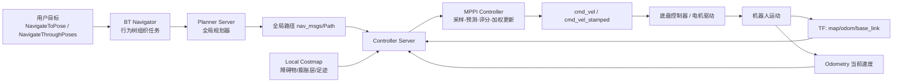
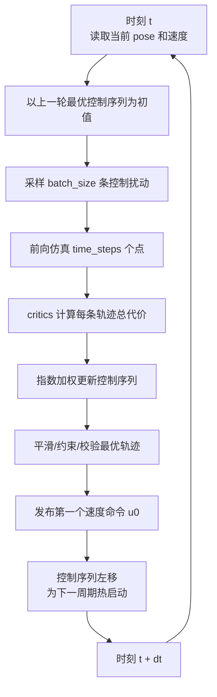
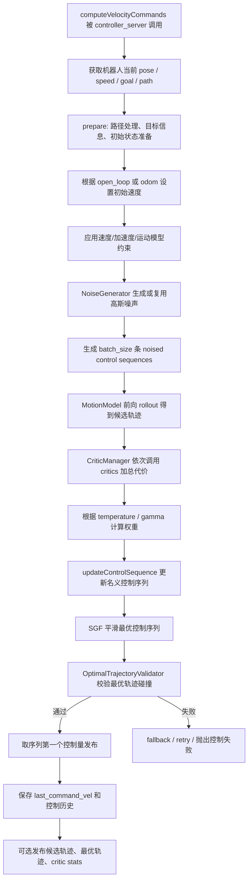
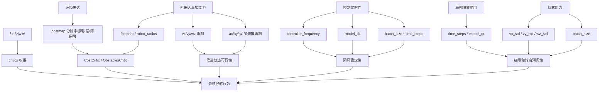
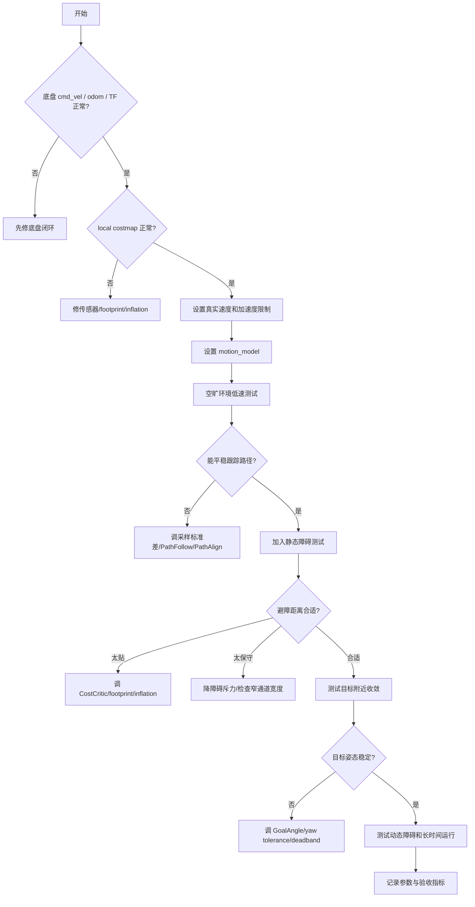

# Nav2 MPPI 控制器算法万字详解

> 适合对象：已经了解 ROS 2、Nav2、全局路径规划、局部控制器、costmap 和 `cmd_vel` 基础概念，希望真正理解 Nav2 中 `nav2_mppi_controller::MPPIController` 为什么能工作、如何调参、如何排查问题的学习者。
>
> 说明：Nav2 发展很快，本文以 Nav2 官方文档中最新 MPPI 配置说明和 `navigation2` 主分支实现思路为基础整理。不同 ROS 2 发行版中参数名、默认值和功能可能存在差异，工程落地时应以你安装版本的官方文档、源码和运行时参数为准。

## 1. 先用一句话理解 MPPI

MPPI，Model Predictive Path Integral，本质上是一个采样型模型预测控制器。它不会只沿着全局路径找一个局部跟踪点，也不会像传统优化 MPC 那样显式求解一个带约束的非线性规划，而是在当前最优控制序列附近随机采样大量候选速度序列，把这些速度序列通过机器人运动模型向前仿真成候选轨迹，再用一组可插拔的评价函数给轨迹打分，最后用指数加权的方式把低代价轨迹的信息融合回控制序列，取第一个控制量发给底盘。

放在 Nav2 中说，MPPI 是 `controller_server` 里的局部控制器插件。全局规划器给出一条从当前区域通向目标的全局路径，局部 costmap 表示机器人附近的障碍物和代价分布，MPPI 每个控制周期读取机器人当前位姿、速度、局部路径和代价地图，然后输出一个 `TwistStamped` 速度命令。它的核心目标不是“找到几何上最短的一条曲线”，而是在有限预测时域内找到一段综合代价较低、满足运动学约束、避障、跟随路径并逐步靠近目标的速度序列。

## 2. MPPI 在 Nav2 导航闭环中的位置

Nav2 的导航链路可以拆成任务层、规划层、控制层和执行层。MPPI 位于控制层，它连接的是“上游路径”和“下游底盘速度”。



这个位置决定了 MPPI 的输入输出非常明确：

- 输入 1：机器人当前位姿，通常来自 TF 中的 `odom -> base_link` 或经 Nav2 控制器处理后的当前 pose。
- 输入 2：机器人当前速度，通常来自 odometry；开启 `open_loop` 时也可以更多依赖上一条命令速度作为初始状态估计。
- 输入 3：全局路径，被裁剪、变换到控制器需要的局部坐标或局部范围内。
- 输入 4：局部 costmap，包含障碍物、膨胀代价、未知区域、禁行区等局部环境信息。
- 输入 5：目标位姿和 goal checker，用于判断是否接近目标、是否需要考虑目标朝向。
- 输出：当前周期的速度命令，以及可选的最优预测轨迹、候选轨迹可视化、critic 统计信息。

MPPI 的难点在于它同时做了几件事：跟踪全局路径、避开局部障碍、满足速度和加速度限制、处理目标附近姿态、处理机器人运动模型差异，还要在几十赫兹频率下实时运行。理解它时不能只盯着“采样算法”，还要把 motion model、critics、costmap、路径处理、控制频率和底盘响应一起看。

## 3. 为什么 Nav2 需要 MPPI

Nav2 里常见控制器包括 DWB、Regulated Pure Pursuit、Graceful Controller、MPPI 等。不同控制器对应不同工程取舍。

DWB 可以看作经典 Dynamic Window Approach 系列思想的 Nav2 实现，它在速度空间中采样候选速度，短时仿真轨迹，再用 critics 评分。它结构清晰、可解释性强，但候选控制形式相对简单，对复杂动态行为、长预测时域和多约束组合的表达能力有限。

Regulated Pure Pursuit 更像路径跟踪器。它根据前视点产生角速度，并用曲率、障碍物距离、目标接近等启发式规则调节速度。它非常高效、稳定、易调，是很多差速机器人和服务机器人很实用的默认选择。但它的控制决策主要围绕“跟踪路径上的点”，不是在高维控制序列空间中搜索未来一段时间的行为。

TEB，Timed Elastic Band，在 ROS 1 时代很常用。它把局部轨迹看成带时间参数的弹性带，通过图优化同时考虑障碍物、速度、加速度、时间最优等项。它能处理不错的局部轨迹优化问题，但参数较多、实时性和稳定性对场景较敏感，ROS 2/Nav2 中也不再是主推方向。

MPPI 的优势在于：

- 它保留了 MPC 的预测思想：评估的是未来一段时间的控制序列，而不是只看当前瞬时速度。
- 它使用采样而不是复杂非线性规划求解器：对非凸代价、复杂障碍物、插件式 critics 更友好。
- 它天然适合并行和向量化：大量候选轨迹可以用 Eigen 等方式批量计算。
- 它可以通过 critics 表达不同导航偏好：贴近路径、远离障碍、偏好前进、抑制原地乱转、目标附近对齐姿态等。
- 它支持差速、全向、Ackermann 等不同运动模型。
- 它能把上一周期的最优控制序列作为下一周期初值，形成滚动优化，行为连续性较好。

MPPI 的代价是计算量更大、参数之间耦合更强、调试时需要理解采样方差、温度、代价权重、预测时域、控制频率和底盘响应之间的关系。如果只是低速、空旷、路径简单的差速机器人，RPP 可能已经足够；如果机器人行为复杂、障碍物密集、需要更强的局部轨迹优化能力，MPPI 更有价值。

## 4. MPPI 的数学问题建模

为了理解算法，先把局部控制问题写成一个有限时域优化问题。

设机器人状态为：

```text
x_t = [p_x, p_y, theta, v_x, v_y, omega]^T
```

对于差速机器人，`v_y` 不可控，通常为 0；对于全向机器人，`v_y` 可以作为横向速度；对于 Ackermann 车，控制受最小转弯半径等约束影响。

控制量可以写成：

```text
u_t = [v_x, v_y, omega]^T
```

在 Nav2 MPPI 中，控制量直接对应速度命令维度，而不是直接输出轮速或转角。底层硬件控制器需要负责把 `cmd_vel` 转成电机命令。

预测时域长度为 `T`，离散时间步长为 `dt`，控制序列为：

```text
U = {u_0, u_1, ..., u_{T-1}}
```

运动模型为：

```text
x_{t+1} = f(x_t, u_t, dt)
```

局部控制的优化目标可以概括为：

```text
min_U J(U)
```

其中总代价 `J(U)` 来自多个评价项：

```text
J(U) = J_path_follow + J_path_align + J_goal + J_goal_angle
     + J_obstacle + J_constraint + J_prefer_forward
     + J_twirling + J_deadband + ...
```

这不是一个简单的二次代价函数。障碍物代价来自 costmap，具有离散栅格、膨胀层、碰撞阈值等非光滑特性；路径代价来自全局路径离散点；目标角度存在角度环绕；差速、全向、Ackermann 的约束也不一样。因此，用传统梯度优化求解并不总是方便。MPPI 选择了采样近似。

## 5. Path Integral 思想：用采样估计更优控制

MPPI 的关键做法是：不直接对 `U` 求梯度，而是在当前控制序列附近采样扰动。

设上一轮或当前名义控制序列为：

```text
U = {u_0, u_1, ..., u_{T-1}}
```

对第 `k` 条候选轨迹，给每个时间步采样一个高斯噪声：

```text
epsilon_{k,t} ~ N(0, Sigma)
```

生成带噪控制序列：

```text
U_k = U + E_k
```

其中：

```text
E_k = {epsilon_{k,0}, epsilon_{k,1}, ..., epsilon_{k,T-1}}
```

然后对每个 `U_k` 做前向仿真，得到候选轨迹：

```text
X_k = {x_{k,0}, x_{k,1}, ..., x_{k,T}}
```

再计算每条轨迹的总代价：

```text
S_k = cost(X_k, U_k)
```

MPPI 不只是选代价最低的一条轨迹，也不是简单平均所有轨迹，而是给低代价轨迹更高权重。常见的权重形式为：

```text
beta = min_k S_k
w_k = exp(-(S_k - beta) / lambda)
eta = sum_k w_k
omega_k = w_k / eta
```

其中 `lambda` 在 Nav2 参数中对应 `temperature` 的作用：温度越低，算法越偏向最低代价轨迹；温度越高，更多轨迹会参与平均，控制会更保守、更平滑，但也可能不够果断。

控制序列更新为：

```text
U_new = U + sum_k omega_k * E_k
```

直觉上看，这等于问：在当前控制序列附近随机试了很多种未来动作，哪些动作方向带来低代价，就把当前控制序列往那些方向推一点。这个过程每个控制周期都重复，并且只执行 `U_new` 的第一个控制量。下一周期机器人状态改变后，再重新采样、预测、评分、更新。

## 6. MPPI 的滚动时域控制

MPPI 属于模型预测控制，因此它不会一次性把整段预测轨迹都发给底盘执行。它每次只发第一个速度命令，然后进入下一控制周期重新估计。



滚动时域有几个好处：

- 可以持续吸收最新 odometry、TF 和 costmap 信息。
- 遇到动态障碍物时，不需要完全相信上一轮规划。
- 即使预测时域较长，实际执行也只执行当前最可信的一小步。
- 上一轮控制序列作为下一轮初值，避免每次从零开始，提升连续性和收敛速度。

也正因为这样，MPPI 对控制频率、`model_dt` 和底盘延迟比较敏感。如果控制周期比模型步长慢很多，上一轮预测和实际执行之间会错位；如果底盘执行命令有明显延迟，但模型认为命令立即生效，预测轨迹就会比真实运动更理想，容易出现过冲或贴障。

## 7. Nav2 MPPI 的单周期算法流程

Nav2 实现中，一个控制周期大致可以拆成准备、采样、仿真、评分、更新、校验和输出几个阶段。



这张图非常重要，因为多数调参问题都可以映射到其中某个阶段：

- 机器人不动：可能是路径处理、goal checker、critics 权重、deadband、速度限制或校验失败。
- 机器人抖动：可能是采样方差过大、温度过低、控制频率不匹配、底盘延迟、costmap 噪声或 critic 冲突。
- 机器人贴障：可能是 CostCritic/ObstaclesCritic 权重、footprint、inflation layer、collision margin、局部 costmap 分辨率问题。
- 机器人不贴路径：可能是 PathFollowCritic、PathAlignCritic、全局路径质量、路径点密度、`offset_from_furthest` 或路径被障碍占据。
- 目标附近乱转：可能是 GoalAngleCritic、PathAngleCritic、PreferForwardCritic、yaw tolerance、目标姿态约束或底盘最小速度死区。

## 8. 运动模型：MPPI 如何从速度预测轨迹

MPPI 的采样对象是速度序列，最终要通过运动模型变成位姿轨迹。Nav2 MPPI 当前使用插件式 motion model，常见内置模型包括：

- `mppi::DiffDriveMotionModel`：差速/非完整约束机器人。
- `mppi::OmniMotionModel`：全向机器人，可以有横向速度 `vy`。
- `mppi::AckermannMotionModel`：Ackermann 转向车辆，受最小转弯半径约束。

### 8.1 差速模型

差速机器人通常控制 `vx` 和 `wz`，不允许横向平移。简化离散模型为：

```text
x_{t+1} = x_t + vx_t * cos(theta_t) * dt
y_{t+1} = y_t + vx_t * sin(theta_t) * dt
theta_{t+1} = theta_t + wz_t * dt
```

如果 `vx` 为正，机器人前进；`vx` 为负，机器人倒车；`wz` 控制角速度。差速模型下 `vy` 即使设置了采样标准差，也不应该作为有效横向速度参与运动。

差速机器人调 MPPI 时要特别关注：

- `vx_min` 是否允许倒车。若不希望倒车，应设为 0 或接近 0，并配合 PreferForwardCritic。
- `wz_max` 是否符合底盘真实角速度能力。
- `ax_max`、`ax_min`、`az_max` 是否符合真实加速度能力。
- `PathAngleCritic` 和 `GoalAngleCritic` 是否让机器人在路径方向和目标朝向之间产生冲突。

### 8.2 全向模型

全向机器人可以控制 `vx`、`vy`、`wz`。预测时会把机器人坐标系下的速度转换到世界坐标系：

```text
x_dot = vx * cos(theta) - vy * sin(theta)
y_dot = vx * sin(theta) + vy * cos(theta)
theta_dot = wz
```

全向机器人更灵活，但也更容易出现“边走边横移边转”的行为。如果这种行为不符合业务需要，需要通过 TwirlingCritic、PathAlignCritic、PathAngleCritic、速度和加速度限制抑制。

### 8.3 Ackermann 模型

Ackermann 车辆不能像差速车一样原地旋转，也不能任意给很大的角速度。它的轨迹曲率受最小转弯半径约束。简化上可以认为：

```text
|omega| <= |vx| / min_turning_r
```

当速度很低时，可行角速度也会受限制。Ackermann 平台上调 MPPI 时，`min_turning_r`、`vx_min`、`wz_max`、路径曲率、全局规划器是否考虑非完整约束，都非常关键。若全局路径包含原地转向式的尖角，局部控制器很难优雅执行。

## 9. 采样噪声与 batch_size

MPPI 的搜索能力来自噪声采样。Nav2 中常见参数：

- `batch_size`：每轮采样候选轨迹数量。
- `time_steps`：每条轨迹的离散点数。
- `model_dt`：轨迹点之间的时间间隔。
- `vx_std`、`vy_std`、`wz_std`：各控制轴的采样标准差。
- `regenerate_noises`：是否每轮重新生成噪声。

预测时域为：

```text
horizon = time_steps * model_dt
```

例如 `time_steps=56`、`model_dt=0.05`，预测时域就是 2.8 秒。预测时域太短，机器人看不到足够远的局部未来，遇到狭窄通道或转弯可能决策短视；预测时域太长，计算量变大，而且远期预测受模型误差和动态障碍影响更大。

`batch_size` 决定每轮探索多少条候选轨迹。batch 太小，低代价轨迹可能采不到，输出容易不稳定；batch 大，搜索更充分，但 CPU 压力更大。官方示例常见 1000 到 2000 量级，实际要根据控制频率和硬件能力验证。

采样标准差控制探索范围：

- `vx_std` 太小：前后速度探索不足，机器人可能加速慢、绕障不积极。
- `vx_std` 太大：候选轨迹速度差异过大，输出可能抖动或频繁选择激进轨迹。
- `wz_std` 太小：转向探索不足，遇到弯道或避障反应迟钝。
- `wz_std` 太大：角速度扰动过强，机器人可能左右摆动。
- 全向机器人 `vy_std` 太大：容易横向漂移或产生不符合预期的斜行。

一个实用调参方法是：先保证机器人在空旷环境能平稳跟踪路径，再逐步增加障碍物复杂度。不要一开始就在窄门、动态障碍、目标贴墙等困难场景里调所有参数，否则很难判断问题来源。

## 10. 代价函数与 critics 机制

Nav2 MPPI 的一个核心工程设计是插件式 critics。每个 critic 负责给候选轨迹增加某一类代价。所有 critic 的代价最终汇总为每条轨迹的总代价。


每个 critic 通常有：

- `enabled`：是否启用。
- `cost_weight`：权重。
- `cost_power`：代价幂次，常见为 1。
- `threshold_to_consider`：距离目标多近时启用或停用该项。
- critic 自己的特定参数，比如 `offset_from_furthest`、`trajectory_point_step`、`consider_footprint`。

理解 critics 的关键不是背默认值，而是理解每个 critic 在“拉”机器人往哪个方向走。MPPI 输出行为是多股力量竞争的结果：路径项希望贴着路径走，障碍项希望远离障碍，目标项希望靠近目标，前进偏好项不希望倒车，角度项希望对齐路径或目标方向，约束项不希望超过运动限制。某个权重过大，就可能压制其他目标。

## 11. ConstraintCritic：运动约束惩罚

ConstraintCritic 惩罚违反动态或运动学约束的候选轨迹。虽然运动模型和控制序列约束已经会裁剪一部分速度，但 critic 层仍可以对不理想的控制分量施加代价，让优化更倾向于物理可执行的序列。

相关参数通常包括：

- `vx_max`：最大前进速度。
- `vx_min`：最大倒车速度，通常是负数。
- `vy_max`：全向机器人横向速度限制。
- `wz_max`：最大角速度。
- `ax_max`：最大前向加速度。
- `ax_min`：最大减速度，通常是负数。
- `ay_max`、`ay_min`：全向横向加速度限制。
- `az_max`：最大角加速度。
- ConstraintCritic 的 `cost_weight`。

工程注意点：

- 加速度限制要接近真实底盘能力。设置过大，预测中机器人可以“瞬间变速”，真实底盘跟不上；设置过小，控制器会显得迟钝。
- `ax_min` 应为负值。若写成正值，很多版本会做符号修正或警告，但最好从配置上就保持语义正确。
- 控制器输出之后如果还有 velocity smoother，也要保证 smoother 的限幅和 MPPI 内部约束一致，否则 MPPI 以为自己发出的速度能被执行，实际被 smoother 改掉，预测闭环会失真。

## 12. CostCritic 与 ObstaclesCritic：避障代价

避障是 MPPI 的关键能力。Nav2 MPPI 中常见两类与障碍物有关的 critic：CostCritic 和 ObstaclesCritic。不同版本或配置中可能默认使用 CostCritic，也可能保留 ObstaclesCritic 作为可选配置。二者都服务于“远离障碍和避免碰撞”，但侧重点不同。

CostCritic 直接基于 costmap 栅格代价值评价轨迹点。它会检查候选轨迹上的点或足迹是否落在高代价区域，碰撞时给极高代价，接近障碍时给较高代价。

重要参数：

- `consider_footprint`：是否使用完整 SE2 footprint 检查。圆形或算力紧张时可以用中心点检查；非圆形机器人或狭窄环境建议考虑 footprint。
- `collision_cost`：真实碰撞时的代价，通常很大。
- `near_collision_cost` 或 `critical_cost`：接近碰撞区域的惩罚阈值或惩罚值。
- `near_goal_distance`：目标附近停止施加某些偏好性障碍代价，避免目标贴近障碍时无法收敛。
- `trajectory_point_step`：隔多少个轨迹点评估一次，降低计算量。
- `inflation_layer_name`：多膨胀层时指定使用哪一层。

ObstaclesCritic 更强调通过障碍距离和膨胀信息产生斥力，典型参数包括：

- `repulsion_weight`：一般性远离障碍的权重。
- `critical_weight`：接近碰撞边界时的强惩罚权重。
- `collision_margin_distance`：距离碰撞多近时施加严重惩罚。
- `inflation_radius`、`cost_scaling_factor`：需要与 costmap inflation layer 匹配。

避障调参的常见误区：

1. 只调 MPPI，不检查 costmap。若 footprint 偏小、膨胀半径过小、障碍物层延迟大，再强的 critic 也很难安全。
2. 障碍权重过大导致不走窄门。机器人需要穿过窄通道时，过大的 `collision_margin_distance` 或 repulsion 权重会把可行空间“虚拟封死”。
3. 障碍权重过小导致贴墙。此时应先确认 costmap 中墙体和膨胀层显示正常，再提高 CostCritic 或 ObstaclesCritic 权重。
4. 目标贴墙时无法到达。需要利用 `near_goal_distance`、goal checker 容差、目标点选择和 footprint 配置共同处理。

## 13. PathFollowCritic：推动机器人沿路径前进

PathFollowCritic 的作用是鼓励轨迹沿全局路径取得进展。它不是简单让机器人贴路径，而是让候选轨迹在预测时域内到达路径上更靠前的位置。

重要参数：

- `cost_weight`：沿路径前进的权重。
- `threshold_to_consider`：距离目标多近时停止考虑路径前进，让目标 critic 接管。
- `offset_from_furthest`：以候选轨迹能达到的最远路径点为基准，再向后或向前取参考点来评价进展。

如果机器人“犹豫不前”或在路径上慢慢蹭，PathFollowCritic 权重可能太低，或者采样速度范围太小，或者障碍/路径对齐项压制了前进项。如果机器人为了向前进展而切弯太多，可能需要提高 PathAlignCritic、CostCritic，或改善全局路径。

## 14. PathAlignCritic：鼓励轨迹贴合全局路径

PathAlignCritic 鼓励候选轨迹与全局路径保持对齐。官方文档中明确提到它不等同于 path following；它更像“别离路径太远”的约束，而不是“向路径前方推进”的驱动力。

重要参数：

- `cost_weight`：路径对齐权重。
- `threshold_to_consider`：目标附近停用，避免与目标收敛冲突。
- `offset_from_furthest`：只在轨迹已经沿路径有一定进展时再评价对齐，避免起步时为了对齐产生奇怪动作。
- `max_path_occupancy_ratio`：路径被障碍占据比例较高时，可能降低或跳过路径对齐评价，避免强行贴一条已经不可通行的路径。
- `trajectory_point_step`：采样轨迹点评价，节省计算量。
- `use_path_orientations`：是否利用路径朝向。

PathAlignCritic 太强时，机器人可能宁愿停住或贴着被障碍阻挡的全局路径，也不愿做局部绕行；太弱时，机器人可能走出明显切角路线，看起来不像在跟踪全局规划。

## 15. PathAngleCritic：路径方向一致性

PathAngleCritic 评价机器人预测轨迹的朝向与路径方向之间的关系。它对差速和 Ackermann 平台尤其重要，因为这些平台不能随意横向移动，朝向是否合理直接影响下一段路径是否可执行。

常见参数：

- `cost_weight`：路径角度权重。
- `threshold_to_consider`：目标附近停用或改变关注点。
- `offset_from_furthest`：参考路径上的前方点。
- `max_angle_to_furthest`：与参考方向夹角超过某阈值时的处理。
- `mode`：不同版本中用于控制方向性处理策略，例如偏向前进、允许倒车或根据路径方向判断。

如果机器人在路径起点附近大幅摆头，可能是 PathAngleCritic、PathAlignCritic 和 PreferForwardCritic 的组合过强。如果机器人进入弯道时朝向滞后，可能需要提高角速度采样、提高路径角度项，或让全局路径更平滑。

## 16. GoalCritic 与 GoalAngleCritic：目标附近收敛

路径跟踪项不能一直主导控制器。接近目标时，机器人需要从“沿路径前进”切换到“准确到达目标位姿”。这就是 GoalCritic 和 GoalAngleCritic 的作用。

GoalCritic 鼓励空间位置靠近目标。重要参数：

- `cost_weight`：目标位置权重。
- `threshold_to_consider`：在距离目标多少范围内开始或停止考虑该项。官方建议这个阈值可以和预测时域对应的距离量级配合，使 PathFollowCritic 与 GoalCritic 平滑交接。

GoalAngleCritic 鼓励达到目标朝向。重要参数：

- `cost_weight`：目标角度权重。
- `threshold_to_consider`：接近目标到一定距离后才考虑目标朝向。
- `symmetric_yaw_tolerance`：对于前后对称机器人，可接受目标方向或目标方向加 180 度，减少不必要掉头。

目标附近常见问题：

- 到点后反复旋转：目标角度权重过强、yaw tolerance 太小、底盘角速度死区、定位噪声或控制频率不稳定。
- 接近目标后不愿贴近：障碍 critic 在目标附近过强，或目标点放在障碍膨胀区内。
- 机器人先对齐角度再前进导致路径怪异：GoalAngleCritic 触发距离过大，应减小 `threshold_to_consider`。

## 17. PreferForwardCritic：偏好前进

PreferForwardCritic 惩罚倒车，鼓励机器人使用正向速度。对于传感器主要朝前、业务上不希望倒车的服务机器人，这个 critic 很实用。

但它不是越大越好。如果全局路径或局部场景确实需要倒车，PreferForwardCritic 过强会让控制器陷入犹豫。对于 Ackermann 车辆，倒车能力和最小转弯半径结合更复杂，要结合全局规划和行为树恢复策略设计。

配置建议：

- 普通差速服务机器人：若不希望倒车，可把 `vx_min` 设为 0 或接近 0，再保留 PreferForwardCritic。
- 前后对称机器人：可以降低 PreferForwardCritic，甚至结合 `symmetric_yaw_tolerance` 允许前后等价。
- 狭窄空间倒车脱困：如果业务允许，保留一定负 `vx_min`，但不要让倒车成为常态。

## 18. TwirlingCritic：抑制全向机器人乱转

TwirlingCritic 主要用于全向机器人。全向底盘自由度高，可能出现一边横移一边持续旋转的低总代价轨迹，但这种行为对用户观感、安全和传感器稳定性可能不好。TwirlingCritic 惩罚不必要的旋转，使机器人朝向更稳定。

如果全向机器人表现得“很灵活但不自然”，可以检查 TwirlingCritic。如果机器人需要在狭窄空间快速调整朝向，TwirlingCritic 过强又可能限制必要动作。

## 19. VelocityDeadbandCritic：处理底盘速度死区

真实底盘常有速度死区：命令速度低于某个阈值时，电机不动或运动不稳定。MPPI 如果输出一串很小的速度，预测中机器人动了，但真实底盘没动，就会导致闭环误差累积。

VelocityDeadbandCritic 用于惩罚落在死区附近的速度，推动控制器输出足以克服硬件死区的命令。常见参数：

- `deadband_velocities`：`[vx, vy, wz]` 的死区阈值。
- `cost_weight`：惩罚权重。

使用这个 critic 前应先实测底盘：

```text
vx 从 0.01 m/s 逐步加到 0.10 m/s，观察实际是否移动；
wz 从 0.02 rad/s 逐步加到 0.30 rad/s，观察是否稳定旋转。
```

不要用猜测值。死区配置过大，会导致机器人在目标附近难以细腻收敛；配置过小，又起不到作用。

## 20. 控制序列更新与温度参数

MPPI 的更新不是“选最优轨迹的第一个速度”这么简单。它通过所有候选轨迹的代价计算权重，再对噪声扰动做加权平均。

```mermaid
flowchart TD
    A[每条候选轨迹代价 S_k] --> B[求 beta = min S_k]
    B --> C[计算 exp(-(S_k - beta) / temperature)]
    C --> D[归一化得到 omega_k]
    D --> E[对噪声 epsilon_k 做加权平均]
    E --> F[U_new = U_old + 加权噪声]
    F --> G[约束裁剪和平滑]
```

`temperature` 的直觉：

- 越小：越相信低代价轨迹，选择性更强，行为更果断，但更容易受采样偶然性和 costmap 噪声影响。
- 越大：更多候选轨迹参与平均，行为更平滑保守，但可能不够主动，甚至趋向平均动作。

`gamma` 常用于控制平滑性与控制能量之间的权衡。多数情况下不建议初学者频繁修改它。优先调 `batch_size`、采样标准差、速度/加速度限制、critic 权重和 costmap。

## 21. SGF 平滑与控制连续性

Nav2 MPPI 支持用 Savitzky-Golay filter 对最优控制序列进行平滑，相关参数是 `sgf_order`。二阶通常能在平滑和通过狭窄空间之间取得较好平衡；一阶可能更平滑，但也可能过度平滑，导致紧凑空间中难以贴合可行轨迹。

控制连续性来自多层机制：

- 上一周期最优控制序列作为下一周期初值。
- 控制序列按控制周期左移。
- 速度和加速度限制约束变化率。
- SGF 对控制序列做平滑。
- 底层 velocity smoother 可进一步限幅，但要避免和 MPPI 预测冲突。

如果输出速度剧烈跳变，优先检查：

1. `controller_frequency` 与 `model_dt` 是否匹配。
2. `vx_std`、`wz_std` 是否过大。
3. `temperature` 是否过低。
4. costmap 是否有障碍物闪烁。
5. odometry 是否延迟或速度估计噪声大。
6. 是否重复叠加了过强的外部速度平滑，导致预测与实际执行不一致。

## 22. 延迟补偿与 open_loop

真实底盘从接收速度命令到实际运动存在延迟。Nav2 MPPI 新版本提供按轴延迟建模参数，如 `model_delay_vx`、`model_delay_vy`、`model_delay_wz`。其思想是：rollout 时把控制序列按 `round(model_delay / model_dt)` 移动，并在延迟窗口内重放最近发布的命令，使预测更接近真实执行。

这对以下场景有用：

- 底盘通信链路有稳定延迟。
- 电机控制器响应慢。
- 上层控制频率高，但底层执行有滤波或缓启动。
- 机器人总是在转弯时滞后或过冲。

`open_loop` 则影响初始状态速度估计。关闭时，MPPI 更依赖 odometry 当前速度；开启时，会更多使用上一条命令速度作为初始估计。若 wheel odometry 延迟明显，或者低加速度情况下 odom 反馈滞后导致控制器误判，`open_loop` 可能改善行为。但 open loop 不是万能的：如果底盘打滑、被外力推、地面摩擦变化大，只看命令速度会掩盖真实状态。

## 23. 最优轨迹校验器与 fallback

MPPI 在采样批次中可能找到一条代价较低的轨迹，但仍需要最终校验。Nav2 MPPI 支持 `TrajectoryValidator` 插件，默认常见为 `mppi::DefaultOptimalTrajectoryValidator`。它会检查最终最优轨迹在一定前视时间内是否碰撞。

关键参数：

- `TrajectoryValidator.plugin`：校验器插件类型。
- `collision_lookahead_time`：碰撞校验前视时间。
- `consider_footprint`：校验时是否考虑完整 footprint。
- `retry_attempt_limit`：失败后软重试次数。

这个设计很重要，因为 critics 是优化偏好，validator 是安全兜底。某些情况下，总代价最低轨迹仍可能在远期碰撞、穿越未知区或被局部代价异常误导。validator 可以在输出前挡住明显不可执行的结果。

如果日志中经常出现 MPPI 找不到有效轨迹，应检查：

- 局部 costmap 是否把机器人自身或目标附近标成障碍。
- footprint 是否过大或坐标错误。
- inflation radius 是否把通道封死。
- `collision_lookahead_time` 是否过长，导致远期尚可重新规划的问题被提前判死。
- 采样范围是否太小，根本采不到可行绕障轨迹。
- 全局路径是否穿过不可通行区域。

## 24. 参数总体关系图

MPPI 参数不是孤立的。下面这张图有助于建立调参时的因果关系。



几个必须同时满足的关系：

- `controller_frequency` 的周期不应大于 `model_dt`。很多实现要求控制周期小于或等于模型步长；若控制周期比模型步长长，控制序列移位逻辑会不成立。
- `time_steps * model_dt` 应覆盖局部反应需要的时间。高速机器人要更长预测时域或更高频规划。
- `batch_size * time_steps` 决定主要计算量。增加二者前要先确认 CPU 余量。
- costmap 的 `inflation_radius`、footprint 和 obstacle layer 必须可信，否则 MPPI 的障碍 critic 只是建立在错误地图上。
- MPPI 内部速度/加速度限制应与底盘控制器、velocity smoother、硬件固件限幅一致。

## 25. 一个典型 YAML 配置示例

下面配置用于理解结构，不应直接盲复制到真机。实际参数要根据底盘尺寸、速度能力、传感器、costmap 和业务需求调整。

```yaml
controller_server:
  ros__parameters:
    controller_frequency: 30.0

    FollowPath:
      plugin: "nav2_mppi_controller::MPPIController"

      # 预测时域：56 * 0.05 = 2.8 s
      time_steps: 56
      model_dt: 0.05
      batch_size: 2000
      iteration_count: 1

      # 采样标准差
      vx_std: 0.2
      vy_std: 0.0
      wz_std: 0.4

      # 速度限制
      vx_max: 0.5
      vx_min: -0.2
      vy_max: 0.0
      wz_max: 1.5

      # 加速度限制
      ax_max: 1.5
      ax_min: -1.5
      ay_max: 0.0
      ay_min: 0.0
      az_max: 2.5

      # MPPI 加权参数
      temperature: 0.3
      gamma: 0.015

      # 运动模型插件
      motion_model: "diff_drive"
      diff_drive:
        plugin: "mppi::DiffDriveMotionModel"

      # 调试开关，真机常规运行不要长期打开 visualize
      visualize: false
      publish_optimal_trajectory: false
      publish_critics_stats: false
      regenerate_noises: false
      sgf_order: 2
      open_loop: false

      TrajectoryValidator:
        plugin: "mppi::DefaultOptimalTrajectoryValidator"
        collision_lookahead_time: 2.0
        consider_footprint: true

      critics:
        - "ConstraintCritic"
        - "CostCritic"
        - "GoalCritic"
        - "GoalAngleCritic"
        - "PathAlignCritic"
        - "PathFollowCritic"
        - "PathAngleCritic"
        - "PreferForwardCritic"

      ConstraintCritic:
        enabled: true
        cost_power: 1
        cost_weight: 4.0

      CostCritic:
        enabled: true
        cost_power: 1
        cost_weight: 3.81
        critical_cost: 300.0
        consider_footprint: true
        collision_cost: 1000000.0
        near_goal_distance: 0.5
        trajectory_point_step: 2

      GoalCritic:
        enabled: true
        cost_power: 1
        cost_weight: 5.0
        threshold_to_consider: 1.4

      GoalAngleCritic:
        enabled: true
        cost_power: 1
        cost_weight: 3.0
        threshold_to_consider: 0.5

      PathAlignCritic:
        enabled: true
        cost_power: 1
        cost_weight: 10.0
        threshold_to_consider: 0.5
        offset_from_furthest: 20
        max_path_occupancy_ratio: 0.05
        trajectory_point_step: 4

      PathFollowCritic:
        enabled: true
        cost_power: 1
        cost_weight: 5.0
        threshold_to_consider: 1.4
        offset_from_furthest: 5

      PathAngleCritic:
        enabled: true
        cost_power: 1
        cost_weight: 2.0
        threshold_to_consider: 0.5
        offset_from_furthest: 4
        max_angle_to_furthest: 1.0
        mode: 0

      PreferForwardCritic:
        enabled: true
        cost_power: 1
        cost_weight: 5.0
        threshold_to_consider: 0.5
```

这份配置要结合以下内容一起检查：

- `controller_server` 是否真的加载了 `nav2_mppi_controller::MPPIController`。
- `critics` 列表中的名字是否与各 critic 配置段一致。
- motion model 子命名空间是否与 `motion_model` 对应。
- 全向机器人不要把 `vy_std`、`vy_max` 设置为 0；差速机器人不要误启全向模型。
- 真机上 `consider_footprint` 更安全，但计算量更高。
- `visualize`、`publish_critics_stats` 用于调试，不适合长期高频开启。

## 26. 从零调参的推荐顺序

MPPI 调参最怕随机改权重。推荐按以下顺序推进。

### 26.1 先验证机器人基础闭环

在不启动 Nav2 的情况下验证底盘：

- `cmd_vel` 正向速度是否正确。
- `cmd_vel` 角速度方向是否符合 REP 103。
- odometry 速度和位姿是否与真实运动一致。
- TF 中 `odom -> base_link` 是否稳定连续。
- footprint 是否在 RViz 中和机器人真实外形一致。
- 急停、限速、底层 watchdog 是否会改写速度命令。

如果这里不对，MPPI 调得再好也没意义。

### 26.2 再验证 costmap

检查局部 costmap：

- 激光或深度数据是否进入 obstacle layer。
- 静态障碍、动态障碍是否及时更新和清除。
- inflation layer 是否有合适半径和代价梯度。
- 机器人 footprint 是否没有把自己误标成障碍。
- 局部 costmap 尺寸是否覆盖预测时域内的运动范围。

MPPI 是基于 costmap 做避障决策的。costmap 错，MPPI 就会理直气壮地做错。

### 26.3 然后设置物理限制

按真实能力设置：

- `vx_max`：不要超过稳定可控速度。
- `vx_min`：是否允许倒车。
- `wz_max`：不要超过底盘稳定角速度。
- `ax_max`、`ax_min`、`az_max`：实测加减速能力。
- 全向机器人设置 `vy_max`、`ay_max`、`ay_min`。
- Ackermann 设置 `min_turning_r`。

这些参数是优化问题的边界。边界错了，采样会大量落在不真实或过窄的空间里。

### 26.4 再设置预测规模

从中等规模开始：

- 低速室内机器人：预测时域 2 到 3 秒通常够用。
- 控制频率：20 到 50 Hz 常见，需根据 CPU 和底盘响应决定。
- `model_dt`：通常应与控制周期匹配或不小于控制周期。
- `batch_size`：先 1000，再根据行为和 CPU 提到 2000。

观察 CPU 占用和控制周期是否稳定。如果控制器不能按频率运行，增大 batch 只会让行为更差。

### 26.5 最后调 critics

建议从默认或官方示例开始，只做小幅修改：

- 不贴路径：提高 PathAlignCritic 或 PathFollowCritic，但先看全局路径是否合理。
- 不前进：提高 PathFollowCritic，检查速度采样和障碍权重。
- 贴障：提高 CostCritic/ObstaclesCritic，检查 footprint 和 inflation。
- 不过窄门：降低障碍斥力、collision margin 或检查通道是否确实可通过。
- 目标附近乱转：降低 GoalAngleCritic，增大 yaw tolerance，检查角速度死区。
- 倒车过多：提高 PreferForwardCritic 或限制 `vx_min`。
- 全向乱扭：提高 TwirlingCritic 或降低 `wz_std`。

## 27. 常见现象与排查表

| 现象 | 可能原因 | 优先检查 |
| --- | --- | --- |
| 控制器加载失败 | 插件名错误、包未安装、参数命名错误 | `ros2 param get /controller_server FollowPath.plugin`、启动日志 |
| 机器人完全不动 | goal 已满足、速度被限幅、所有轨迹碰撞、deadband、路径无效 | goal checker、costmap、MPPI 日志、`cmd_vel` |
| 发布速度但底盘不动 | 底盘死区、底层控制器未接收、话题类型不匹配 | `ros2 topic echo /cmd_vel`、底盘驱动日志 |
| 左右摆动 | `wz_std` 大、temperature 低、路径角度项冲突、定位噪声 | 候选轨迹可视化、odom、PathAngleCritic |
| 贴墙走 | 障碍权重低、footprint 小、inflation 弱 | RViz costmap、CostCritic 权重 |
| 窄门进不去 | footprint 过大、膨胀半径大、collision margin 大、路径居中差 | costmap 尺寸、inflation、全局路径 |
| 目标附近反复转 | yaw tolerance 小、GoalAngleCritic 强、角速度死区 | goal checker、GoalAngleCritic、Deadband |
| 弯道切角严重 | PathAlignCritic 弱、全局路径太稀、速度过高 | 路径点密度、PathAlignCritic、vx_max |
| CPU 占用过高 | batch/time_steps 过大、visualize 开启、footprint 检查重 | 降低 batch、关闭可视化、调 trajectory step |
| 动态障碍反应慢 | costmap 更新慢、预测时域短、采样不足、障碍权重低 | obstacle layer、batch、CostCritic |

## 28. 调试工具与观测信号

调 MPPI 时不要只看机器人运动，要同时看内部信号。

常用命令：

```bash
ros2 param list /controller_server
ros2 param get /controller_server FollowPath.plugin
ros2 topic echo /cmd_vel
ros2 topic echo /odom
ros2 topic hz /cmd_vel
ros2 topic hz /local_costmap/costmap
ros2 run tf2_ros tf2_echo odom base_link
```

RViz 中建议显示：

- 全局路径。
- 局部 costmap。
- robot footprint。
- TF。
- MPPI 候选轨迹可视化。
- MPPI 最优轨迹。
- 当前速度命令。

调试参数：

- `visualize: true`：发布候选轨迹可视化，但会显著增加计算负担。
- `critic_index_to_visualize`：选择看总代价或某个 critic 的代价分布。
- `publish_optimal_trajectory: true`：发布最优预测轨迹。
- `publish_critics_stats: true`：发布每个 critic 的统计信息，适合短时间分析权重影响。

一个有效的调试流程：

1. 空旷直线目标：看能否平稳前进。
2. 空旷转弯目标：看角速度和路径角度是否自然。
3. 静态障碍绕行：看 CostCritic 是否主导避障。
4. 窄通道：检查 footprint、inflation 和 collision margin。
5. 目标贴墙：检查 near_goal_distance 和 goal checker。
6. 动态障碍：检查 costmap 更新和控制频率。

## 29. MPPI 与全局规划器的关系

MPPI 是局部控制器，不是全局规划器。它可以在局部范围内偏离全局路径绕障，但它不应该承担全局拓扑决策。比如地图中存在左右两条走廊，全局规划器选择左边，MPPI 不应该自己远距离切到右边；局部障碍临时挡住路径时，MPPI 可以局部绕一下，但如果全局路径整体不可通行，应由 planner 重新规划。

因此要注意：

- 全局路径要可执行。差速或 Ackermann 平台最好使用考虑非完整约束或平滑后的路径。
- 路径点密度要合适。过稀会影响 PathAlign/PathFollow 评价；过密增加处理开销但通常问题较小。
- planner 的 footprint 和 controller 的 footprint 要一致。
- planner costmap 和 controller costmap 的 inflation 逻辑要协调。
- 行为树中的 replanning 频率要合理。重规划过慢，局部控制器会被迫处理全局路径失效；重规划过快，路径抖动会传导到 MPPI。

## 30. MPPI 与 velocity smoother 的关系

Nav2 中常常在 controller 后面接 velocity smoother。它可以限制速度变化、平滑底盘命令、处理硬件安全约束。但对 MPPI 来说，外部 smoother 会改变它输出的命令。如果改变幅度很大，MPPI 下一轮预测的控制序列与真实执行不一致。

建议原则：

- MPPI 内部速度/加速度限制应尽量贴近真实硬件，velocity smoother 不要再大幅改写。
- 如果必须用 smoother，确保 smoother 的最大速度、加速度限制与 MPPI 一致或略保守。
- 若出现明显滞后和过冲，检查 smoother 是否造成额外延迟。
- 使用 `model_delay_*` 补偿可预测的稳定延迟，但不要用它掩盖随机通信卡顿。

## 31. 真机落地注意事项

仿真中 MPPI 很容易表现漂亮，真机上问题更多。主要差异包括：

- odometry 有延迟、噪声和打滑。
- 激光雷达有盲区、玻璃反射、动态障碍噪声。
- costmap 更新频率不稳定。
- 底盘速度响应有死区和加速度限制。
- 机器人 footprint 与真实外形不完全一致。
- 网络、DDS、CPU 抢占导致控制周期抖动。

真机建议：

1. 先低速运行，把 `vx_max` 和 `wz_max` 限到保守值。
2. 关闭复杂调试可视化，只在短时间分析时打开。
3. 记录 rosbag，包含 `/tf`、`/odom`、`/cmd_vel`、scan、costmap、plan。
4. 每次只改一类参数，并记录现象。
5. 用固定测试路线复现实验，避免凭感觉调参。
6. 对目标贴墙、窄门、人穿行、急停恢复等场景单独测试。

## 32. 一个可执行的 MPPI 调参路线



验收指标可以包括：

- 平均路径跟踪误差。
- 最小障碍物距离。
- 到达目标耗时。
- 到达成功率。
- 最大角速度和加速度是否超过硬件限制。
- 控制周期是否稳定达到设定频率。
- 目标附近是否无明显抖动。
- CPU 占用是否有足够余量。

## 33. 与 DWB、RPP 的选择建议

不要因为 MPPI 更高级就默认使用它。控制器选择应服从场景。

优先考虑 RPP 的场景：

- 差速机器人，低速室内导航。
- 全局路径质量高，局部障碍不复杂。
- 算力有限。
- 希望参数少、行为稳定、易解释。

优先考虑 DWB 的场景：

- 需要经典速度空间采样和 critic 可解释性。
- 已有成熟 DWB 参数经验。
- 平台和场景较简单。

优先考虑 MPPI 的场景：

- 需要更强的预测控制能力。
- 局部避障和路径跟踪需要更细腻权衡。
- 机器人运动模型更复杂，比如全向或 Ackermann。
- 希望利用插件 critics 定制行为。
- CPU 有足够余量支持大 batch 实时计算。

工程上可以保留多个 controller plugin，通过 RViz 或行为树选择不同控制器，在不同任务阶段使用不同控制策略。

## 34. MPPI 的局限性

MPPI 很强，但不是万能。

第一，它依赖运动模型。模型与真实机器人差异越大，预测越不可靠。轮胎打滑、地面坡度、载重变化、底盘控制器内部滤波都会影响真实执行。

第二，它依赖 costmap。传感器盲区、障碍物延迟清除、膨胀层设置错误都会直接影响代价。

第三，它是局部方法。局部最优、死胡同、全局路径错误，不能指望 MPPI 单独解决。

第四，它是采样方法。采样数量有限时，可能采不到关键可行轨迹；采样过大又带来计算压力。

第五，critic 之间可能冲突。比如路径对齐强烈要求贴路径，障碍 critic 强烈要求远离路径附近的障碍，目标角度又要求转向，最终可能表现为犹豫、停顿或抖动。

第六，它需要实时性。控制周期抖动会让滚动优化效果下降，尤其在高速平台上更明显。

## 35. 读源码时应该抓住哪些类

如果深入看 Nav2 MPPI 源码，可以按职责理解：

- `MPPIController`：实现 Nav2 `nav2_core::Controller` 接口，接收路径、速度、位姿，调用 optimizer，发布可视化和最优轨迹。
- `Optimizer`：核心算法，负责准备状态、生成候选控制、rollout、调用 critics、更新控制序列、输出速度。
- `NoiseGenerator`：生成或复用高斯噪声。
- `MotionModel` 及其插件：差速、全向、Ackermann 的状态推进和约束处理。
- `CriticManager`：加载、初始化、调用多个 critic，并维护代价数组。
- 各种 critic 插件：每个实现一种代价项。
- `OptimalTrajectoryValidator`：对最终轨迹做安全校验。
- `models::State`、`models::Trajectories`、`models::ControlSequence`：批量状态、轨迹、控制序列的数据结构，通常基于 Eigen 做向量化计算。

源码阅读时不要从所有 critic 细节开始。建议先读主流程：

```text
computeVelocityCommands
  -> optimizer.evalControl
  -> prepare
  -> optimize
  -> generateNoisedTrajectories
  -> integrateStateVelocities
  -> critic_manager.score
  -> updateControlSequence
  -> validator
  -> getControlFromSequenceAsTwist
```

掌握这条链路后，再按现象读对应 critic。比如贴障就读 CostCritic，目标附近乱转就读 GoalAngleCritic，路径不跟随就读 PathFollowCritic 和 PathAlignCritic。

## 36. 用一个例子串起来

假设一个差速服务机器人正在沿走廊行驶，前方全局路径从走廊中间通过，右侧突然出现一个障碍物。

一个 MPPI 周期中会发生：

1. 控制器读取当前位姿和速度。
2. 局部 costmap 中右侧障碍物被标记并膨胀。
3. MPPI 以上一轮控制序列为基础，例如未来 2.8 秒大致保持前进。
4. 采样产生 2000 条速度序列，有些稍微左转，有些继续直行，有些右偏，有些减速。
5. 运动模型把这些速度序列 rollout 成 2000 条未来轨迹。
6. CostCritic 给靠近右侧障碍的轨迹较高代价，碰撞轨迹给极高代价。
7. PathFollowCritic 仍鼓励沿路径向前推进。
8. PathAlignCritic 不希望偏离路径太远。
9. 低代价轨迹通常会是“略微左偏、保持进展、不过分远离路径”的轨迹。
10. 指数权重把这些低代价轨迹的控制扰动融合进最优控制序列。
11. 控制器发布第一个速度，机器人开始略微左绕。
12. 下一周期 costmap 和机器人位置更新，MPPI 重新预测。如果障碍物移动或消失，控制会自然调整。

这个例子说明 MPPI 的行为不是单个规则决定的，而是多个 critic 在预测轨迹集合上共同筛选出来的。

## 37. 学习 MPPI 时最重要的心智模型

可以把 MPPI 想成一个“高速试走未来”的控制器：

- 它每 20 到 50 毫秒在脑子里试走上千种未来。
- 每种未来都必须符合机器人运动模型。
- 每种未来都会被路径、障碍、目标、朝向、速度限制等规则打分。
- 它不是死选最低分，而是让低分未来共同投票。
- 它只迈出第一步，然后马上重新观察世界。

这个心智模型比“MPPI 是某个复杂公式”更有用。公式解释权重，源码实现流程，调参处理工程偏差。三者结合，才能真正用好它。

## 38. 总结

Nav2 MPPI 控制器是一个工程化很强的采样型模型预测控制器。它把 MPPI 的理论框架和 Nav2 的插件系统结合起来，通过 motion model 表达机器人运动约束，通过 critics 表达导航行为偏好，通过 costmap 表达局部环境，通过 rolling horizon 实现持续闭环控制。

理解 MPPI 要抓住五条主线：

1. **预测时域**：`time_steps * model_dt` 决定它看多远。
2. **采样搜索**：`batch_size` 和 `vx/vy/wz_std` 决定它试多少、试多广。
3. **代价评价**：critics 决定什么叫好轨迹。
4. **物理约束**：速度、加速度、motion model 决定什么轨迹可执行。
5. **闭环一致性**：odom、TF、costmap、底盘响应、控制频率决定预测是否贴近现实。

调 MPPI 的正确方式不是盲目改权重，而是先保证机器人基础闭环和 costmap 正确，再设置真实物理限制，然后调整预测规模，最后通过可视化和 critic 统计有针对性地调行为偏好。只要这个顺序正确，MPPI 的复杂参数会变成可解释的工程旋钮，而不是一堆玄学数字。

## 参考资料

- Nav2 官方 MPPI 配置文档：<https://docs.nav2.org/configuration/packages/configuring-mppic.html>
- Nav2 官方文档首页：<https://docs.nav2.org/>
- Nav2 Navigation2 源码仓库：<https://github.com/ros-navigation/navigation2>
- Nav2 MPPI Controller README：<https://github.com/ros-navigation/navigation2/tree/main/nav2_mppi_controller>
- MPPI 原始算法相关论文入口：<https://ieeexplore.ieee.org/document/7487277>
- ROSCon 2023：On Use of Nav2 MPPI Controller：<https://vimeo.com/879001391>

<!-- AUTO_EXPANDED_TO_REFERENCE_LENGTH_2026_06_23 -->

## 万字精讲扩展：Nav2-MPPI控制器算法万字详解

> 本节为按参考笔记篇幅补充的系统化扩展内容，目标是把原有笔记从“知识点记录”扩展为“概念、原理、流程、工程实践、常见误区和复盘清单”完整学习材料。

### 精讲扩展 1：Nav2-MPPI控制器算法万字详解 的坐标系、运动学 与工程化理解

学习 $topic 时，不能只把它当成一个孤立知识点来背诵，而要把它放到 $category 的完整问题链条里理解。一个知识点通常同时包含概念定义、适用边界、输入输出、运行过程、常见异常和工程取舍。真正掌握它，意味着看到一个具体场景时，能够判断它解决什么问题、依赖哪些前提、失败时会出现什么现象，以及应该用什么手段验证自己的判断。

从 $a 的角度看，最重要的是先建立清晰的对象模型。也就是明确系统里有哪些参与者、它们之间如何连接、数据或控制信号如何流动、哪些环节是同步的、哪些环节是异步的、哪些状态是临时状态、哪些状态需要长期保存。很多初学问题并不是公式不会、API 不熟，而是对象边界不清：把配置当成状态，把结果当成过程，把局部现象当成全局规律。写笔记时建议始终追问：这个概念的主体是谁，输入是什么，输出是什么，中间约束是什么，错误会在哪里暴露。

从 $b 的角度看，流程比单点知识更关键。一个成熟方案通常不是单个技巧，而是一组步骤：先确定目标，再拆分约束，然后选择工具，最后通过测试和复盘确认效果。比如在实际项目中，不能只问“怎么实现”，还要问“为什么要这样实现”“有没有更简单的替代方案”“边界条件是什么”“数据量、并发量、实时性、可靠性变化后还能不能工作”。这种流程意识能够避免把学习停留在教程层面，也能让后续排错有明确路线。

$topic 的 $c 往往决定它在真实项目中的稳定性。理论上可行的方案，到了工程环境中会受到数据质量、硬件条件、依赖版本、网络环境、团队协作、部署方式和维护成本影响。写代码或做设计时，应该把正常路径和异常路径同时考虑：正常情况下如何运行，输入为空怎么办，超时怎么办，重复执行怎么办，部分成功怎么办，版本升级后兼容性怎么办，日志和指标如何证明系统确实按预期工作。

进一步看 $d，它通常对应性能、可靠性或可维护性的核心矛盾。很多技术选择并没有绝对正确答案，只有是否适合当前约束。例如追求极致性能可能牺牲可读性，追求高度抽象可能增加调试成本，追求快速交付可能留下技术债，追求完全通用可能让简单场景变复杂。高质量笔记应该把这些取舍写出来，而不是只给一个“推荐方案”。推荐方案背后的条件越清楚，迁移到新场景时越不容易误用。

最后从 $e 的角度进行复盘，可以把知识从“看懂”推进到“会用”。建议为 $topic 建立三个层次的检查：第一层是概念检查，确认术语、流程和边界没有混淆；第二层是实践检查，确认能够独立完成一个最小案例；第三层是工程检查，确认这个案例在异常、规模、性能和维护方面经得起追问。每次学习完一个章节，都可以用这三层检查反向补齐笔记。

#### 典型场景拆解

在真实场景中，$topic 通常会经历“需求出现、方案选择、实现落地、问题暴露、持续优化”几个阶段。需求出现时，要先判断这个需求属于基础能力、性能优化、体验改进、可靠性建设还是长期架构演进。不同类型的需求对方案的评价标准不同：基础能力看正确性，性能优化看指标，体验改进看路径是否顺滑，可靠性建设看故障时能否降级和恢复，架构演进看未来变化是否容易吸收。

方案选择阶段，最容易犯的错误是直接套用熟悉工具。更稳妥的方式是列出约束：数据规模、时延要求、资源预算、团队熟悉度、运维能力、安全要求、可测试性和长期维护成本。只有把约束列清楚，才能解释为什么选择当前方案。否则方案看似高级，实际可能只是增加了复杂度。

实现落地阶段，要把 $a 和 $b 拆成可验证的小步骤。每一步都应该有明确的输入、输出和检查方式。对学习笔记而言，这意味着不能只有大段概念，还应该补充流程图式的文字描述、伪代码、命令示例、参数解释、错误现象和排查路径。这样以后复习时，笔记不仅能帮助理解，也能直接指导实践。

问题暴露阶段，要优先区分“理解错误、实现错误、环境错误、数据错误、依赖错误、边界条件错误”。很多复杂问题之所以难排，是因为一开始就把问题归因到错误层级。例如把配置问题当成算法问题，把权限问题当成代码问题，把数据分布变化当成模型失效，把硬件噪声当成软件逻辑错误。好的排查顺序应该从可观测事实开始，而不是从猜测开始。

持续优化阶段，不应只追求把当前问题压下去，还要沉淀成规则。比如记录触发条件、影响范围、定位方法、最终修复、预防措施和可监控指标。这样下一次出现类似问题时，团队可以复用经验，而不是重新从零排查。

#### 常见误区与纠偏

第一个误区是只记结论，不记前提。$topic 中很多结论都是有条件的：适用于小规模，不一定适用于大规模；适用于离线处理，不一定适用于实时系统；适用于单机环境，不一定适用于分布式环境；适用于教学案例，不一定适用于生产项目。纠偏方法是在每个重要结论后面补一句“适用条件”和“不适用情况”。

第二个误区是只关注工具，不关注模型。工具会变化，模型更稳定。无论工具名称如何变化，底层仍然要解决输入建模、状态管理、资源调度、错误恢复、性能约束和质量验证这些问题。学习 $topic 时，应该把工具用法和底层模型分开记录：工具命令解决“怎么做”，底层模型解释“为什么这样做”。

第三个误区是没有验证意识。很多笔记写得很完整，但没有说明如何确认自己做对了。对于 $category 相关主题，验证至少应包含最小样例、边界样例、异常样例和性能样例。最小样例证明流程跑通，边界样例证明理解完整，异常样例证明系统可恢复，性能样例证明方案在目标规模下仍然可用。

第四个误区是忽略可维护性。短期学习时，能跑通就容易产生掌握的错觉；长期使用时，命名、分层、注释、测试、日志、版本管理和文档才会决定知识能否转化为稳定能力。扩充 $topic 笔记时，应把“如何写得清楚、如何排查、如何交接、如何复盘”也纳入内容。

#### 学习与实践建议

建议围绕 $topic 做一个小型闭环练习：先用自己的话解释概念，再画出流程，再实现一个最小案例，然后主动制造一个错误并排查，最后写下复盘。这个过程看起来比直接读资料慢，但能显著提高迁移能力。很多人学完后不会用，根本原因是缺少“从概念到问题再到验证”的闭环。

复习时可以使用四个问题：它解决什么问题；它依赖什么条件；它失败时有什么表现；它如何被验证。只要这四个问题能回答清楚，说明对 $topic 的理解已经从表层进入工程层。如果回答不清楚，就回到对应章节补充例子、边界和排错方法。
## 扩展复盘清单

- 能否用一句话说明本主题解决的问题。
- 能否列出本主题最重要的输入、输出、约束和失败模式。
- 能否独立完成一个最小实践案例，并解释每一步为什么需要。
- 能否设计边界测试、异常测试和性能测试。
- 能否把本主题和所在技术体系中的其他主题连接起来理解。
