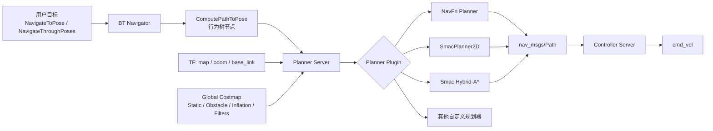
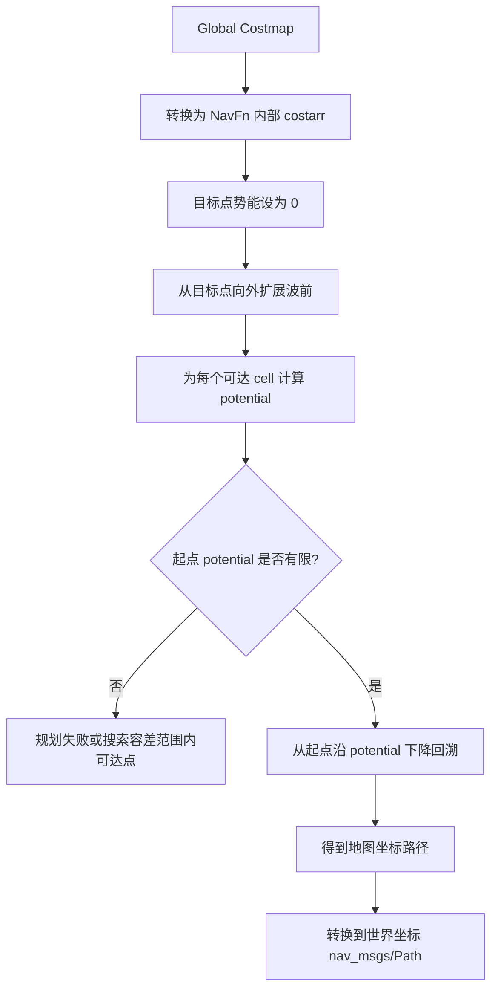
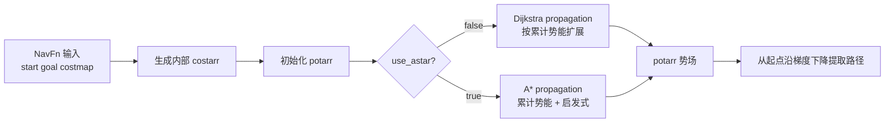
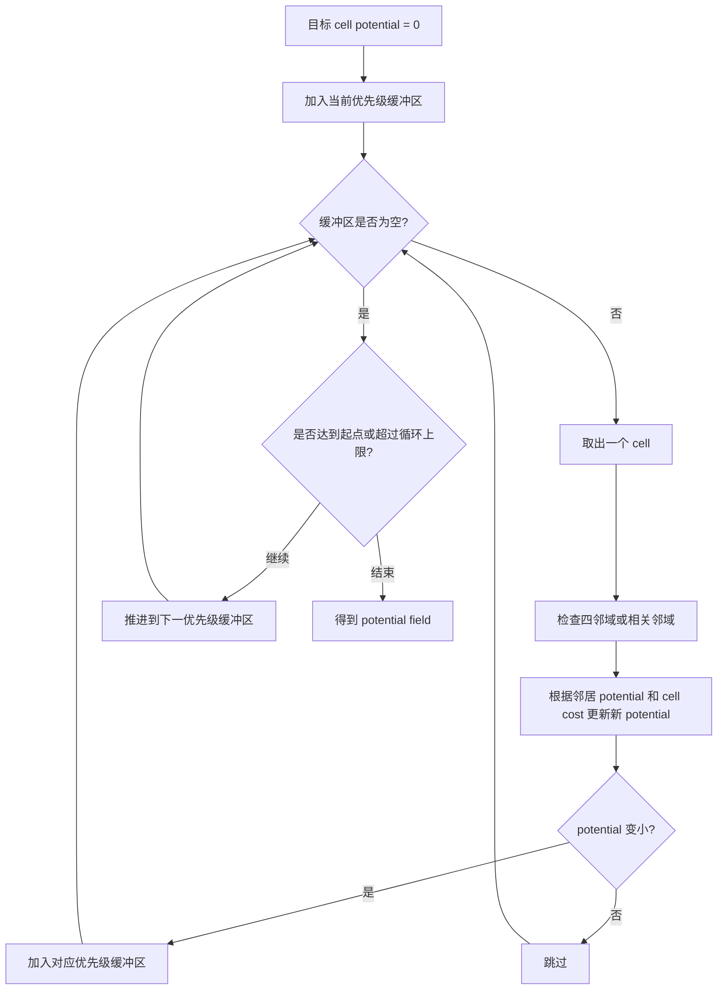
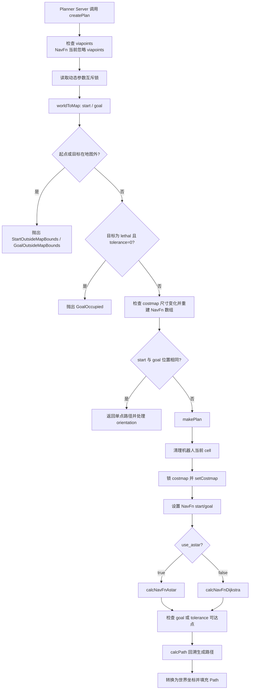
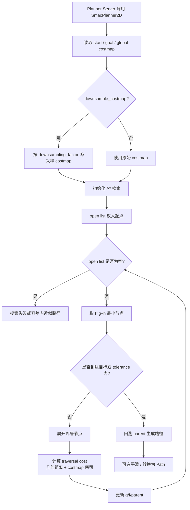
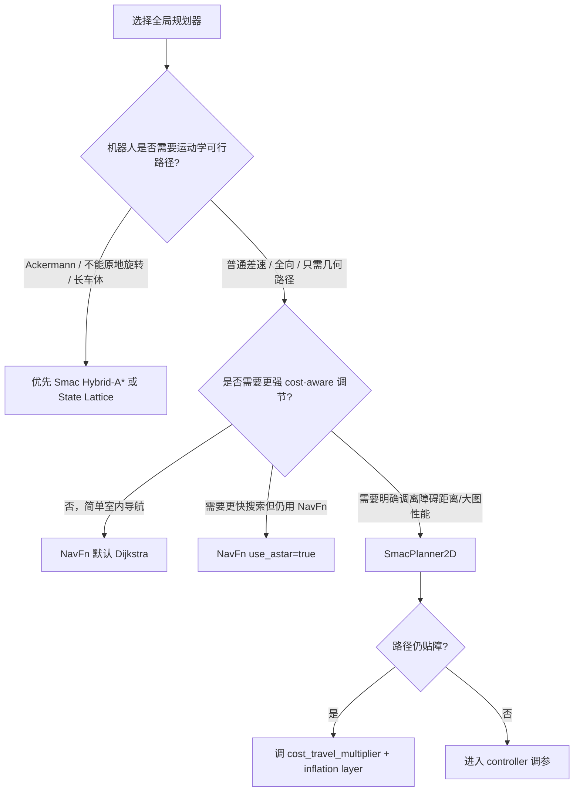
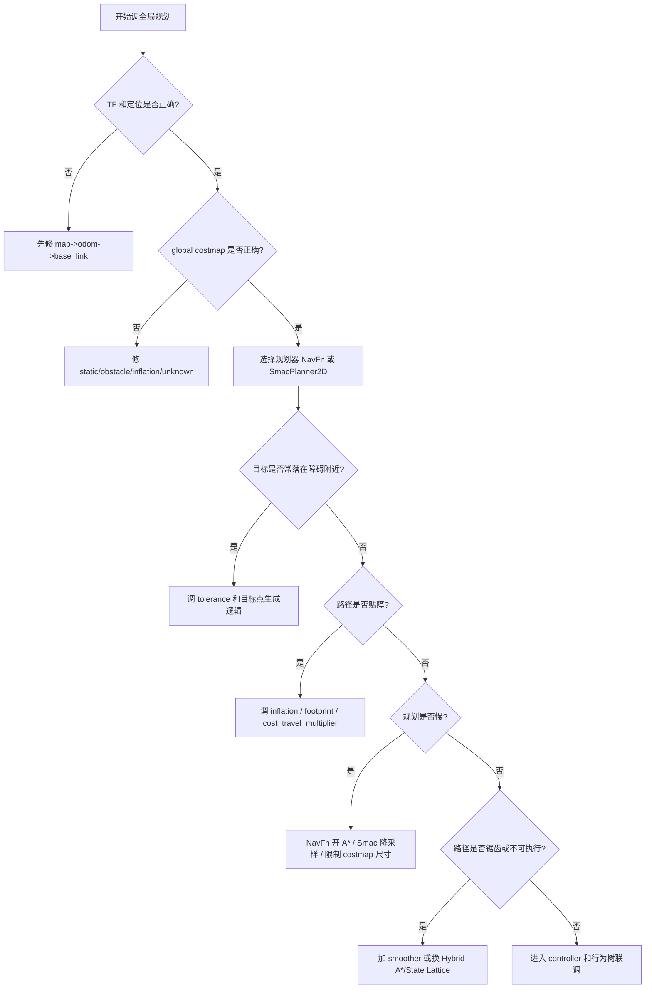

# Nav2 NavFn 路径规划器与 A* 规划器算法万字详解

> 适合对象：已经了解 ROS 2、Nav2、地图、全局代价地图、局部控制器和 `NavigateToPose` 基本流程，希望系统理解 Nav2 中 NavFn 路径规划器、Dijkstra、A*、SmacPlanner2D 之间关系，并能在工程中正确选型、配置、调参和排查问题的学习者。
>
> 说明：本文以 Nav2 官方文档和 `navigation2` 当前源码设计为基础整理。Nav2 版本变化较快，不同 ROS 2 发行版中插件名、默认参数、部分实现细节可能不同，工程落地时应以当前安装版本的官方文档、源码和运行日志为准。Iron 及更早版本中插件类型名曾使用 `/` 分隔，新版本通常使用 `::`。

## 1. 先把概念说清楚

Nav2 中“路径规划器”通常指 Planner Server 加载的全局规划插件。它的输入是起点、目标点和全局 costmap，输出是一条 `nav_msgs/Path`。这条路径不是直接控制机器人运动的速度命令，而是给 Controller Server 中的局部控制器作为参考，例如 Regulated Pure Pursuit、DWB、MPPI 等会沿着全局路径产生 `cmd_vel`。

NavFn 是 Nav2 中的经典全局路径规划插件，插件类型通常为：

```yaml
plugin: "nav2_navfn_planner::NavfnPlanner"
```

它继承自 ROS 1 Navigation 时代的 NavFn 思路，使用 navigation function，也就是在栅格地图上从目标点向外传播势场，然后从起点沿势场下降方向回溯得到路径。Nav2 官方文档把它描述为一个 wavefront Dijkstra 或 A* expanded holonomic planner。这里有两个关键词：

- **wavefront**：像波前一样从目标向外扩展代价或势能。
- **Dijkstra or A\***：可以用 Dijkstra 全图式传播，也可以用 A* 的启发式扩展减少搜索量。

A* 在 Nav2 中有两层含义。第一层是 NavFn 内部可选的 `use_astar: true` 模式，它仍然使用 NavFn 的势场与路径回溯框架，只是扩展顺序引入启发式。第二层是 Smac Planner 系列，尤其是 `nav2_smac_planner::SmacPlanner2D`，它是 Nav2 中更现代的 cost-aware holonomic A* 全局规划器。Smac Planner 还包含 Hybrid-A* 和 State Lattice Planner，用于考虑运动学约束的车辆或复杂平台。

因此本文会分三条主线讲：

1. NavFn 在 Nav2 全局规划链路中的位置。
2. NavFn 的 navigation function、Dijkstra 扩展、A* 扩展和路径回溯。
3. Nav2 中更现代的 A* 规划器 SmacPlanner2D，以及它与 NavFn 的差异和选型。

## 2. Planner Server 在 Nav2 中的位置

Nav2 不是单个算法，而是一套任务导航系统。全局路径规划发生在 Planner Server 中。行为树节点 `ComputePathToPose` 或 `ComputePathThroughPoses` 会请求 Planner Server 计算路径，Planner Server 再按请求中的 planner id 调用某个插件。



Planner Server 本身不关心 NavFn、A* 或其他算法内部如何搜索。它主要负责：

- 管理多个 planner plugin。
- 持有和更新 global costmap。
- 接收路径规划请求。
- 选择指定 planner id。
- 调用插件的 `createPlan`。
- 处理取消、超时、异常和部分路径等任务级逻辑。

这意味着路径规划问题至少有三层：

- **任务层**：目标点、路径重规划频率、是否允许部分路径、行为树恢复策略。
- **地图层**：global costmap 的分辨率、尺寸、静态层、障碍层、膨胀层、未知区域。
- **算法层**：NavFn、Dijkstra、A*、SmacPlanner2D、Hybrid-A* 等具体搜索方法。

很多路径问题看起来像“规划器不好”，实际来源可能是地图层。例如 footprint 太大、inflation 过大、未知区域策略不对、全局 costmap 没更新，都会让任何规划器给出不理想路径或直接失败。

## 3. 栅格路径规划的基础建模

Nav2 的经典全局规划器通常运行在二维栅格 costmap 上。地图被离散为 `width * height` 个 cell，每个 cell 有一个代价值。

常见 costmap 语义：

- `FREE_SPACE`：可通行。
- `INSCRIBED_INFLATED_OBSTACLE`：机器人足迹内切圆会碰撞或非常接近障碍。
- `LETHAL_OBSTACLE`：致命障碍，不可通行。
- `NO_INFORMATION`：未知区域，是否可通行由参数决定。
- 0 到 252 之间的普通代价：通常由 inflation layer 产生，越靠近障碍代价越高。

路径规划器要做的是在这张带权图上，从起点 cell 找到目标 cell。图节点就是栅格，边就是相邻栅格之间的移动。常见邻接方式：

- 4 邻接：上、下、左、右。
- 8 邻接：上、下、左、右、左上、右上、左下、右下。

实际规划代价可以写成：

```text
edge_cost(n, m) = movement_cost(n, m) + costmap_penalty(m)
```

其中 `movement_cost` 代表几何移动距离，水平/垂直移动通常为 1，斜向移动约为 `sqrt(2)`；`costmap_penalty` 代表栅格自身代价，靠近障碍时更高。

一个非常重要的工程事实是：全局规划器不是直接在“真实世界连续空间”中规划，而是在 costmap 离散网格上规划。地图分辨率、膨胀层和足迹处理会直接改变搜索空间。

## 4. NavFn 的核心思想：Navigation Function

NavFn 的名字来自 navigation function。它先在地图上计算一个势场 `potential`，再从起点沿势场下降方向走到目标。

可以把目标点看成一个低势能点，周围栅格的势能随着离目标距离和穿越代价增加而增大。规划时不是从起点盲目找路径，而是先建立“到目标的代价地形”。只要起点所在位置有有限势能，就可以沿着势能逐步下降，最终到达目标附近。



NavFn 与普通“从起点到目标”的搜索叙述有一个容易混淆的点：实现上常常把目标设为 propagation 的起点，把机器人起点设为最终回溯位置。这样做的好处是可以得到从任意位置到目标的势场，回溯时沿梯度下降即可。

NavFn 的流程可概括为：

1. 接收起点和目标。
2. 把起点、目标从世界坐标转换为 costmap 栅格坐标。
3. 检查起点和目标是否在地图内。
4. 清理机器人当前所在 cell，避免机器人自身障碍导致失败。
5. 读取 global costmap，转换成 NavFn 内部代价数组。
6. 设置 propagation 的 goal 和 start。
7. 根据 `use_astar` 选择 Dijkstra 或 A* 扩展。
8. 检查目标 pose 或容差范围内是否存在可达点。
9. 回溯势场生成路径点。
10. 设置路径点朝向，输出 `nav_msgs/Path`。

## 5. Dijkstra 算法回顾

Dijkstra 用于在非负边权图中求最短路径。它的核心思想是：维护一个从源点到各节点的当前最小代价 `g(n)`，每次从未确定节点中取出 `g` 最小的节点进行扩展。由于所有边权非负，一旦某个节点被取出，它的最短距离就确定了。

伪代码：

```text
for each node n:
    g[n] = infinity
g[start] = 0
open = priority_queue ordered by g
open.push(start)

while open not empty:
    current = open.pop_min()
    if current == goal:
        break
    for each neighbor in neighbors(current):
        new_g = g[current] + edge_cost(current, neighbor)
        if new_g < g[neighbor]:
            g[neighbor] = new_g
            parent[neighbor] = current
            open.push_or_update(neighbor, new_g)
```

在栅格地图中，Dijkstra 的特点是：

- 不需要启发函数。
- 只要边权非负，就能找到最优路径。
- 会向所有方向均匀扩展，直到到达目标或扩展完可达区域。
- 在大地图中搜索范围可能很大。

NavFn 的 Dijkstra 模式从目标向起点传播势场，本质仍是 Dijkstra。它计算的是每个 cell 到目标的代价。起点可达后，再沿势场下降得到路径。

## 6. A* 算法回顾

A* 可以看作带启发式的 Dijkstra。它维护：

```text
g(n): 从起点到当前节点 n 的已知代价
h(n): 从 n 到目标的启发式估计代价
f(n): g(n) + h(n)
```

每次优先扩展 `f(n)` 最小的节点。

伪代码：

```text
g[start] = 0
f[start] = h(start)
open = priority_queue ordered by f
open.push(start)

while open not empty:
    current = open.pop_min()
    if current == goal:
        return reconstruct_path()
    for neighbor in neighbors(current):
        tentative_g = g[current] + edge_cost(current, neighbor)
        if tentative_g < g[neighbor]:
            parent[neighbor] = current
            g[neighbor] = tentative_g
            f[neighbor] = g[neighbor] + h(neighbor)
            open.push_or_update(neighbor, f[neighbor])
```

常用启发函数：

- Manhattan distance：适合 4 邻接。
- Euclidean distance：适合任意方向距离估计。
- Octile distance：适合 8 邻接栅格。

如果启发函数满足不高估真实代价，A* 仍能保证最优性。若启发函数过强、带权或不一致，搜索速度可能更快，但最优性可能减弱。

在机器人导航中，A* 的优势是减少无关区域扩展。Dijkstra 像水波一样扩散，A* 会被目标方向吸引，更集中地搜索可能通向目标的区域。

## 7. NavFn 中的 Dijkstra 与 A* 有什么区别

NavFn 提供参数：

```yaml
use_astar: false
```

当 `use_astar: false` 时，NavFn 使用 Dijkstra 扩展；当 `use_astar: true` 时，使用 A* 扩展。二者共享很多后处理逻辑：costmap 转换、potential 数组、目标容差、路径回溯、坐标转换等。

区别主要在扩展顺序：

- Dijkstra 只看累计代价，波前扩展更均匀。
- A* 加入与起点/目标相关的启发式，更倾向朝需要到达的位置扩展。



工程上如何选择：

- 地图不大、希望行为稳定朴素：Dijkstra 默认可用。
- 地图较大、希望减少扩展时间：可以启用 A*。
- 如果路径质量差异不明显，优先考虑 costmap、inflation 和 controller，而不是纠结 Dijkstra/A*。
- 若需要更现代的 cost-aware A* 行为，应考虑 SmacPlanner2D。

## 8. NavFn 的 costmap 转换

NavFn 不直接把 Nav2 costmap 的原始值原样用于搜索，而会转换到内部代价表示。源码注释中可以看到转换意图：

- lethal obstacle 仍然转换为 obstacle。
- inscribed inflated obstacle 通常也视作不可穿越或近似障碍。
- 0 到 252 的普通代价值会映射到从中性代价到障碍代价附近的范围。
- 未知区域根据 `allow_unknown` 决定是否允许规划穿过。

这一步非常重要，因为它把 costmap 的几何环境转换成搜索图的权重。如果 inflation layer 只有障碍边界附近很窄的一圈高代价，那么规划器可能贴障；如果 inflation radius 很大且 cost scaling factor 让代价衰减慢，规划器会强烈避开障碍，甚至窄通道可能被高代价区域挤压到不可用。

可以把全局规划代价理解为：

```text
total_path_cost =
    几何长度代价
  + 经过高 costmap 区域的惩罚
  + 碰撞或未知区域的硬约束
```

因此“路径离墙太近”常常不是规划器算法错，而是 costmap 中离墙 30 cm 和离墙 80 cm 的代价差异不足。对于 NavFn，这种代价地形直接影响势场形状。

## 9. NavFn 的势场传播

NavFn 的 propagation 会维护几个内部数组：

- `costarr`：每个 cell 的穿越代价。
- `potarr`：每个 cell 的势能值。
- `pending`：是否等待扩展。
- priority buffers：用于波前扩展的优先队列或桶式队列。
- `gradx`、`grady`：用于路径回溯时的梯度计算。

势场传播从目标开始。目标 cell 的势能为 0，周围 cell 的势能根据邻居势能和自身代价逐步更新。直观上：

```text
pot[n] = min_over_neighbors(pot[neighbor] + traversal_cost(n))
```

实际实现中会包含近似插值、优先级缓冲、阈值等工程优化，不是教科书里的最简单 Dijkstra 代码。但理解上可以把它看成“在带权栅格上计算到目标的最小代价场”。



NavFn 的 Dijkstra 模式可能会扩展比最终路径更多的区域，但势场更完整。A* 模式通过启发式减少扩展范围，通常更快。

## 10. NavFn 的路径回溯

势场计算完成后，NavFn 不一定保存每个 cell 的 parent 指针，而是可以从起点出发沿着势场下降方向走。每一步都选择让 potential 下降最快的方向，直到到达目标附近。

可以理解为：

```text
current = start
while current not near goal:
    gradient = negative_gradient(potential, current)
    current = current + step_along(gradient)
    path.append(current)
```

这种方式有一个特点：路径可能不是严格只沿 cell 中心走，而是通过梯度产生更连续的点列。它比单纯 parent 回溯更平滑一些，但仍然受栅格分辨率、势场质量和障碍代价影响。

回溯时可能遇到：

- 周围 potential 都是高值，表示不可达或势场断裂。
- 起点附近被障碍物污染，需要清理机器人当前 cell。
- 局部平坦区域导致梯度不明显。
- 目标落在障碍或未知区，需用 tolerance 找邻近可达点。

## 11. `tolerance` 参数：目标不可达时怎么办

NavFn 的 `tolerance` 表示请求目标 pose 和路径终点之间允许的距离。官方默认值通常为 0.5 米。若目标 cell 本身不可达，例如目标点落在障碍物、未知区或代价地图边界附近，NavFn 会在目标周围一定容差范围内寻找一个可达点作为替代终点。

这在工程中非常实用。用户在 RViz 点目标时，常常会点到墙边、桌腿旁、障碍膨胀层里，或者地图定位误差导致目标 cell 不可通行。如果 `tolerance` 为 0，目标 cell 被占用时可能直接失败；如果容差适当，规划器能找到目标附近最近的可达点。

但 `tolerance` 不能乱设太大。过大的容差会导致机器人停在离目标很远的位置，看起来像“提前完成任务”。合适范围要结合：

- 机器人尺寸。
- 目标点精度需求。
- goal checker 的 XY tolerance。
- 控制器目标接近行为。
- 业务上是否允许停在目标附近。

建议让 planner 的 `tolerance` 和 controller/goal checker 的容差语义协调。不要 planner 允许 1 米偏差，而 goal checker 只允许 5 厘米，否则路径终点与行为树目标之间可能产生逻辑冲突。

## 12. `allow_unknown` 参数：未知区域是否可走

`allow_unknown` 控制是否允许规划穿过未知空间。官方默认通常为 `true`，但是否合适取决于任务。

```yaml
allow_unknown: true
```

含义：

- `true`：未知区域可以作为可通行空间参与规划。
- `false`：未知区域视为不可通行。

典型选择：

- 已知静态地图导航：如果地图已完整，未知区域多数代表地图外或未观测区域，通常可以设为 `false`。
- 探索建图：机器人需要进入未知区域，通常设为 `true`。
- 室内服务机器人：如果传感器盲区多，`true` 可能让机器人规划穿过未确认区域；`false` 可能过度保守。
- 仓储或工厂：若地图质量高且安全要求高，倾向 `false`，并通过代价地图更新处理动态障碍。

需要注意：Planner 的 `allow_unknown` 与 costmap layer 对 unknown 的配置共同生效。只改 planner 参数，不看 global costmap 是否保留 unknown 信息，可能没有预期效果。

## 13. `use_final_approach_orientation`

NavFn 输出的 `nav_msgs/Path` 包含每个 path pose 的 orientation。传统全局规划器主要规划二维位置，路径点朝向往往由相邻点方向推导，或者终点朝向直接设为目标朝向。

`use_final_approach_orientation` 的作用是控制最后一个路径点的朝向：

- `false`：最后路径点使用请求 goal 的 orientation。
- `true`：最后路径点使用最终接近方向，也就是最后两点连线方向。

这个参数会影响局部控制器目标附近行为。若使用 RPP 等路径跟踪控制器，最终路径方向可能让机器人更自然地沿路径收尾；若任务要求机器人停下时朝向严格对齐某个方向，例如对接、取货、面向货架，保留 goal orientation 更重要。

不要只在 planner 层解决目标姿态问题。最终是否满足目标方向，还取决于：

- goal checker 是否检查 yaw。
- controller 是否使用路径终点姿态。
- 是否使用 Rotation Shim Controller。
- 机器人底盘是否能原地旋转。
- 目标点附近是否有足够空间。

## 14. NavFn 插件调用流程

从源码结构上看，NavFnPlanner 实现了 Nav2 planner plugin 接口。核心入口是 `createPlan`。



这个流程说明了几个常见报错来源：

- 起点在地图外：通常是 TF、global frame、map origin 或定位问题。
- 目标在地图外：RViz 点到了地图外，或者地图坐标系不对。
- 目标占用：目标 cell 是 lethal，且 tolerance 为 0。
- 无有效路径：costmap 中障碍或未知区域阻断，或者起点/目标附近不可达。
- 单点路径：起点和目标位置相同，只需要处理姿态。

## 15. NavFn 的优点

NavFn 是经典规划器，优点很明确：

- **成熟稳定**：来自 ROS Navigation 长期工程实践。
- **参数少**：主要参数只有 `tolerance`、`use_astar`、`allow_unknown`、`use_final_approach_orientation`。
- **容易理解**：栅格势场 + Dijkstra/A*。
- **对圆形机器人友好**：官方说明中它假设机器人可近似为圆形，在加权 costmap 上规划。
- **计算开销可控**：中小规模室内地图表现通常足够好。
- **适合入门和默认配置**：很多 Nav2 示例使用 NavFn 作为 GridBased planner。

如果你的机器人是普通差速底盘、尺寸较小、环境主要是室内二维平面、全局路径只需要给局部控制器一个大致走廊，NavFn 经常足够。

## 16. NavFn 的局限性

NavFn 的局限同样明显：

- 它是 holonomic 规划器，不考虑差速、Ackermann 等非完整运动约束。
- 它假设机器人能近似为圆形，不适合长条形、拖挂式或复杂 footprint 平台。
- 路径受栅格分辨率影响，可能贴边、锯齿或切角。
- 对高代价区域的偏好主要通过 costmap 势场体现，可调自由度有限。
- 不支持真正的运动原语，不会生成曲率连续路径。
- 目标附近姿态处理较弱，需要 controller 或 behavior 补充。
- 在大型地图中，Dijkstra 模式可能扩展较多区域。

对于 Ackermann 车、叉车、长机器人、不能原地旋转的平台，NavFn 规划出来的几何路径可能在拓扑上可达，但运动学上不可执行。局部控制器会很难跟踪，表现为转弯失败、倒车、卡墙、绕不过尖角。这时应考虑 Smac Hybrid-A* 或 State Lattice，而不是继续强调 NavFn 参数。

## 17. SmacPlanner2D：Nav2 中更现代的 2D A*

Nav2 官方 Smac Planner 文档说明：Smac Planner 包含三类 A* based planning algorithms，即 2D A*、Hybrid-A* 和 State Lattice。SmacPlanner2D 是其中的 cost-aware holonomic A*。

插件类型通常为：

```yaml
plugin: "nav2_smac_planner::SmacPlanner2D"
```

SmacPlanner2D 与 NavFn 的共同点：

- 都运行在二维 costmap 上。
- 都可用于全向意义上的几何路径规划。
- 都输出 `nav_msgs/Path`。
- 都受 costmap、inflation、unknown 配置影响。

不同点：

- SmacPlanner2D 是更直接的 A* 框架。
- 它有 `cost_travel_multiplier` 等参数显式调节远离高代价区域的程度。
- 它支持 costmap downsampling，用更粗分辨率加速搜索。
- 它与 Smac Hybrid-A*、State Lattice 共享优化过的模板化 A* 框架。
- 它通常比传统 NavFn 更适合想调节“路径离障碍多远”的场景。

## 18. SmacPlanner2D 的核心流程

SmacPlanner2D 的思路仍然是 A*，但工程实现更现代。它会把 costmap 转换为搜索节点，使用开放列表按总代价排序，加入 cost-aware 的穿越代价，必要时对 costmap 降采样，加快大地图搜索。



SmacPlanner2D 的关键不是“A* 这个名字”，而是它如何把 costmap 代价融入搜索。`cost_travel_multiplier` 越大，经过高代价区域越贵，路径越倾向走廊中间；值越小，路径越接近普通二值地图最短路。

官方文档中对 `cost_travel_multiplier` 的描述很直接：较大值会更精确地把路径放在通道中心，但计算稍慢；`1.0` 更偏速度；`2.0` 是合理折中；`0.0` 基本禁用远离障碍的代价引导，表现接近朴素二值 A*。

## 19. NavFn A* 与 SmacPlanner2D A* 的区别

很多人看到 `NavFn use_astar: true`，就以为它等同于 SmacPlanner2D。其实不一样。

| 维度 | NavFn `use_astar` | SmacPlanner2D |
| --- | --- | --- |
| 插件包 | `nav2_navfn_planner` | `nav2_smac_planner` |
| 算法框架 | NavFn navigation function 中的 A* 扩展 | Smac 框架中的 cost-aware 2D A* |
| 路径提取 | 势场梯度回溯 | A* parent 回溯和框架后处理 |
| 参数复杂度 | 很少 | 中等 |
| cost-aware 调节 | 主要依赖 costmap 转换和 inflation | 额外有 `cost_travel_multiplier` |
| 降采样 | 无典型用户参数 | 支持 `downsample_costmap` |
| 适用定位 | 经典默认规划器 | 更现代、可调、性能优化 A* |
| 运动学约束 | 不考虑 | 2D 版本不考虑，Hybrid/State Lattice 才考虑 |

如果你只是想让 NavFn 搜索更快，可以开启 `use_astar`。如果你想使用 Nav2 中更现代的 A* 规划器，尤其想调路径远离障碍的程度，应考虑 SmacPlanner2D。

## 20. A* 的最优性与代价地图

教科书中的 A* 常讲“启发式不高估则最优”。但在 Nav2 工程里，“最优”要先定义清楚。路径代价不是单纯几何距离，而是几何距离加上 costmap 代价。若 costmap 的 inflation layer 让靠近障碍的 cell 有高代价，那么“最优路径”可能比几何最短路径更长，但更安全。

举例：

```text
路径 A：长度 10 m，贴墙，经过大量高代价 cell
路径 B：长度 11 m，走走廊中间，经过低代价 cell
```

如果代价地图惩罚足够，路径 B 的总代价更低，规划器会选 B。若 inflation 太弱或 `cost_travel_multiplier` 太低，路径 A 可能被认为更优。

因此“为什么 A* 不走中间”通常不是 A* 理论问题，而是代价函数问题。全局路径规划在工程中本质是：用 costmap 把安全偏好编码成数值代价，再让搜索算法找总代价最小的路线。

## 21. 常用配置：NavFn

典型 NavFn 配置：

```yaml
planner_server:
  ros__parameters:
    expected_planner_frequency: 20.0
    planner_plugins: ["GridBased"]

    GridBased:
      plugin: "nav2_navfn_planner::NavfnPlanner"
      use_astar: false
      allow_unknown: true
      tolerance: 0.5
      use_final_approach_orientation: false
```

想启用 NavFn 的 A* 扩展：

```yaml
planner_server:
  ros__parameters:
    planner_plugins: ["GridBased"]

    GridBased:
      plugin: "nav2_navfn_planner::NavfnPlanner"
      use_astar: true
      allow_unknown: true
      tolerance: 0.5
      use_final_approach_orientation: false
```

参数解释：

- `use_astar`：`false` 使用 Dijkstra 扩展，`true` 使用 A* 扩展。
- `allow_unknown`：是否允许穿越未知区域。
- `tolerance`：目标不可达时允许在目标附近多大范围内寻找可达终点。
- `use_final_approach_orientation`：是否用最后接近方向作为路径末端方向。

## 22. 常用配置：SmacPlanner2D

典型 SmacPlanner2D 配置：

```yaml
planner_server:
  ros__parameters:
    expected_planner_frequency: 20.0
    planner_plugins: ["GridBased"]

    GridBased:
      plugin: "nav2_smac_planner::SmacPlanner2D"
      tolerance: 0.125
      downsample_costmap: false
      downsampling_factor: 1
      allow_unknown: true
      max_iterations: 1000000
      max_on_approach_iterations: 1000
      max_planning_time: 2.0
      cost_travel_multiplier: 2.0
      use_final_approach_orientation: false
```

核心参数：

- `tolerance`：目标附近可接受距离。
- `downsample_costmap`：是否降采样 costmap 加速搜索。
- `downsampling_factor`：降采样倍数，例如 5cm costmap 配 2 后变成 10cm 搜索分辨率。
- `allow_unknown`：是否允许穿越未知区域。
- `max_iterations`：最大搜索迭代次数，防止不可达目标导致无限搜索。
- `max_on_approach_iterations`：进入目标容差后继续尝试靠近精确目标的最大迭代次数。
- `max_planning_time`：最大规划时间。
- `cost_travel_multiplier`：穿越高 cost 区域的代价倍率。
- `use_final_approach_orientation`：路径末端方向处理。

## 23. NavFn 与 SmacPlanner2D 如何选型

可以用下面的决策树：



建议：

- 初学 Nav2：先用 NavFn，理解 costmap 和 planner server。
- 普通服务机器人：NavFn 或 SmacPlanner2D 都可以。
- 需要路径更居中：优先试 SmacPlanner2D 的 `cost_travel_multiplier`，同时调 inflation。
- 地图很大：SmacPlanner2D 可考虑降采样。
- 车辆型机器人：不要用 NavFn 期待它生成可转弯路径，优先 Hybrid-A*。
- 长方形机器人：注意 footprint 与全局规划器假设，必要时使用 Smac 系列并充分测试。

## 24. 路径贴障问题的根因

路径贴障是最常见的抱怨。原因通常不是单一参数。

可能原因：

- global costmap inflation radius 太小。
- cost scaling factor 让代价下降太快，离墙稍远就接近 free。
- NavFn 的代价转换对你的安全距离偏好不够强。
- SmacPlanner2D 的 `cost_travel_multiplier` 太低。
- 地图分辨率太粗，通道中心和墙边差异不明显。
- robot footprint 或 robot radius 偏小。
- 全局路径只是参考，局部控制器又切角贴墙。

排查顺序：

1. 在 RViz 里显示 global costmap，不要只看 occupancy grid。
2. 看障碍周围是否有足够宽、足够平滑的膨胀代价梯度。
3. 检查 footprint 是否真实。
4. 用 SmacPlanner2D 提高 `cost_travel_multiplier` 观察路径是否向中间移动。
5. 对 NavFn，优先调 costmap inflation，而不是只切换 Dijkstra/A*。
6. 检查 controller 是否在跟踪时切角。

## 25. 目标点规划失败问题

常见报错包括 start outside map、goal outside map、goal occupied、no valid path。

### 25.1 起点在地图外

可能原因：

- localization 输出错误。
- map frame 和 global_frame 不一致。
- TF 延迟或断裂。
- global costmap origin、尺寸配置不覆盖机器人位置。

检查：

```bash
ros2 run tf2_ros tf2_echo map base_link
ros2 topic echo /amcl_pose
ros2 topic echo /global_costmap/costmap
```

### 25.2 目标在地图外

可能原因：

- RViz 点到地图外。
- 地图没有覆盖目标区域。
- 使用 GPS 或多地图时坐标转换错误。

### 25.3 目标被占用

可能原因：

- 目标点点在墙上或障碍物上。
- inflation layer 把目标附近标成高代价或致命。
- 静态地图障碍膨胀过大。
- 未知区域被视为不可通行。

处理：

- 增大 `tolerance`，允许停在附近可达点。
- 修正目标点。
- 调整 inflation 和 footprint。
- 选择合适的 `allow_unknown`。

### 25.4 无有效路径

可能原因：

- 全局 costmap 中通道被障碍阻断。
- unknown 策略导致大片区域不可通行。
- 起点或目标附近被自身 footprint、传感器噪声污染。
- 地图分辨率过粗，窄通道离散后消失。
- costmap filter，例如 keepout zone，把路径区域禁用。

## 26. 路径锯齿与平滑

栅格 A* 和 Dijkstra 都容易产生锯齿路径。原因是地图离散化和邻接方向有限。NavFn 的梯度回溯会比纯 cell parent 路径更平滑一些，但不能完全消除栅格痕迹。

处理方式：

- 提高地图分辨率，但会增加搜索量。
- 使用 smoother server 对全局路径平滑。
- 使用 SmacPlanner2D 或 Smac 系列自带的更现代后处理。
- 调整 controller，让局部控制器不要机械跟踪每个锯齿点。
- 对非完整机器人使用 Hybrid-A* 或 State Lattice，从规划层生成更可执行的曲线。

注意：平滑不能穿越障碍。任何 smoother 都必须尊重 costmap 或碰撞检查，否则会把原本安全的路径拉进障碍。

## 27. 全局路径与局部控制器的关系

全局规划器只给出一条参考路线。实际机器人怎么走，还要看局部控制器。

典型关系：

- NavFn/SmacPlanner2D：解决“从全局地图看应该往哪边走”。
- Controller：解决“当前几秒怎么输出速度避障跟踪”。
- Smoother：解决“路径几何是否更平滑”。
- Behavior Tree：解决“失败后是否清图、重规划、旋转、后退”。

如果全局路径贴墙，局部控制器可能仍能远离墙；如果全局路径居中，局部控制器也可能因为动态障碍或参数问题切角。不要把所有行为都归因于 planner。

例如：

- RPP 会根据路径曲率、障碍距离和前视距离调速度。
- DWB 会在速度空间采样并用 critics 评价。
- MPPI 会采样未来控制序列并用 critics 评价轨迹。

全局路径质量会影响控制器，但控制器参数也会反过来决定实际轨迹是否贴合路径。

## 28. Global Costmap 对规划器的决定性影响

规划器输入的是 global costmap，不是原始地图。global costmap 可能包含：

- Static Layer：静态地图。
- Obstacle Layer / Voxel Layer：传感器观测到的障碍。
- Inflation Layer：障碍物周围膨胀代价。
- Keepout Filter：禁行区。
- Speed Filter：速度限制区域，通常更多影响控制层。
- 自定义语义层：电梯、坡道、门、危险区域等。

影响路径规划的关键 costmap 参数：

- `resolution`：分辨率。
- `width`、`height`：global costmap 覆盖范围。
- `robot_radius` 或 `footprint`：机器人几何外形。
- `inflation_radius`：膨胀半径。
- `cost_scaling_factor`：膨胀代价衰减速度。
- `track_unknown_space`：是否追踪未知区域。
- obstacle layer 的 marking/clearing 配置。

一个简单判断：如果 RViz 中 global costmap 看起来就不合理，先修 costmap，不要急着换规划器。

## 29. A* 为什么不一定比 Dijkstra 路径好

A* 的主要优势是搜索效率，不是天然路径质量更好。在同一个代价函数和同一个邻接模型下，如果启发式满足最优性条件，A* 和 Dijkstra 找到的最优路径代价应一致或非常接近。差异主要是扩展节点数量和搜索方向。

所以：

- `use_astar: true` 可能更快。
- 它不一定让路径更远离障碍。
- 它不一定让路径更平滑。
- 它不解决 footprint、inflation、unknown 和局部控制器问题。

想改变路径形状，应该调代价函数、costmap、smoother 或换更合适的规划器，而不是只把 Dijkstra 改成 A*。

## 30. 复杂度分析

设地图有 `N = width * height` 个 cell。

Dijkstra：

- 使用优先队列时复杂度约为 `O(E log V)`。
- 栅格图中 `E` 与 `V` 同阶，8 邻接约 `E <= 8N`。
- 可粗略看成 `O(N log N)`。
- 实际 NavFn 使用优先级缓冲等工程优化，性能表现不完全等同教科书优先队列。

A*：

- 最坏情况仍可能接近 Dijkstra，尤其目标不可达或启发式弱。
- 典型情况下扩展节点更少。
- 启发式越有效，搜索越集中。

SmacPlanner2D：

- 仍是 A* 搜索框架。
- 降采样可把节点数量近似减少为 `1 / factor^2`。
- 但降采样会牺牲路径精度和窄通道表达能力。

工程中比大 O 更重要的是：

- costmap 尺寸是否过大。
- 分辨率是否过细。
- 是否频繁全局重规划。
- 是否目标不可达导致搜索到上限。
- 是否启用复杂过滤层。
- CPU 是否还要同时跑感知、定位、控制和可视化。

## 31. 调参路线

推荐顺序：



具体步骤：

1. 确认 RViz 中 robot model、TF、map、global costmap 对齐。
2. 用 NavFn 默认 Dijkstra 跑通简单点到点。
3. 测试目标在空旷区域、墙边、窄门另一侧、未知区域边界。
4. 若大地图规划慢，尝试 `use_astar: true` 或 SmacPlanner2D。
5. 若路径贴障，调 global costmap inflation，再调 Smac `cost_travel_multiplier`。
6. 若路径几何不适合底盘，考虑 smoother 或 Smac Hybrid-A*。
7. 最后再调 controller，不要用 controller 掩盖全局路径明显错误。

## 32. 典型故障排查表

| 现象 | 可能原因 | 优先检查 |
| --- | --- | --- |
| Planner Server 启动失败 | 插件名错误、包未安装、旧版本分隔符不同 | 启动日志、`planner_plugins`、plugin 类型 |
| 起点在地图外 | 定位错误、TF 错、global costmap 不覆盖 | `tf2_echo map base_link`、RViz |
| 目标在地图外 | RViz 点错、地图尺寸不够、坐标系错 | map 显示、目标 pose frame |
| 目标被占用 | 点到障碍/膨胀区、tolerance 为 0 | global costmap、`tolerance` |
| 有路但规划失败 | unknown 策略、costmap filter、窄通道被膨胀封死 | `allow_unknown`、inflation、keepout |
| 路径贴墙 | inflation 弱、footprint 小、cost 代价不足 | global costmap、`cost_travel_multiplier` |
| 路径绕远 | inflation 过强、keepout、unknown 不可通行 | costmap layers |
| 路径锯齿 | 栅格分辨率、8 邻接限制、无平滑 | smoother、Smac、分辨率 |
| 规划耗时高 | 地图大、分辨率细、目标不可达 | A*、降采样、max iterations |
| 全局路径合理但机器人撞墙 | controller 或 local costmap 问题 | local costmap、controller 参数 |

## 33. 实战案例：走廊中间规划

假设机器人在一条 2 米宽走廊中规划。机器人半径 0.25 米，期望路径尽量走中间。

如果使用 NavFn：

- 确保 `robot_radius` 或 footprint 正确。
- global costmap 的 `inflation_radius` 至少覆盖期望安全距离，例如 0.6 到 0.8 米。
- `cost_scaling_factor` 不要太大，否则代价很快衰减到接近 0，走廊中间和墙边差异不明显。
- `use_astar` 主要影响速度，不主要影响居中。

如果使用 SmacPlanner2D：

- 保持合理 inflation。
- 设置 `cost_travel_multiplier: 2.0` 作为起点。
- 如果仍贴边，逐步提高到 3、4、5 观察路径。
- 如果窄通道不通过或过度绕远，降低该值或重新检查 inflation。

核心判断：在 RViz 中看 global costmap，如果走廊中心明显低代价、墙边高代价，规划器才有数值理由走中间。

## 34. 实战案例：探索未知区域

探索建图时，目标可能在未知区域边界或未知区域内部。此时：

- global costmap 应保留 unknown 信息。
- planner 的 `allow_unknown` 往往需要 `true`。
- frontier exploration 生成的目标应尽量落在已知 free 与 unknown 交界附近，而不是未知深处。
- local costmap 和传感器仍需负责实时避障。

如果 `allow_unknown: false`，规划器会把未知区域当墙，探索目标可能不可达。若 `allow_unknown: true`，规划器可能穿过未知区域，实际执行时依赖局部感知发现障碍并重规划。

探索任务中更重要的是全局行为策略，而不是单个 A* 参数。需要结合 frontier selection、replanning、costmap clearing 和 recovery behaviors。

## 35. 实战案例：Ackermann 小车

Ackermann 小车不能原地旋转，转弯半径有限。如果使用 NavFn 或 SmacPlanner2D，规划出来的路径可能包含直角转弯、原地调头式几何形状。局部控制器跟踪时会出现：

- 转不过弯。
- 倒车频繁。
- 路径点可达但车身扫过障碍。
- 目标附近姿态无法满足。

这种场景应该优先考虑：

- `nav2_smac_planner::SmacPlannerHybrid`
- 合理设置 `minimum_turning_radius`
- 选择 Dubins 或 Reeds-Shepp 类型运动模型
- 全局路径后处理和平滑
- 与 Ackermann 兼容的 controller

NavFn 和 SmacPlanner2D 是 holonomic 几何规划器，不应承担车辆运动学可行性。

## 36. 读源码时的主线

NavFn 源码可以按这条线读：

```text
NavfnPlanner::configure
  -> 读取参数，持有 costmap，创建 NavFn 数组

NavfnPlanner::createPlan
  -> worldToMap 检查起点目标
  -> 特殊情况处理
  -> makePlan

NavfnPlanner::makePlan
  -> clearRobotCell
  -> planner_->setCostmap
  -> planner_->setStart / setGoal
  -> calcNavFnAstar 或 calcNavFnDijkstra
  -> getPointPotential
  -> calcPath
  -> world coordinate path

NavFn::setCostmap
  -> 把 ROS costmap 转换为内部 costarr

NavFn::setupNavFn
  -> 初始化 potential / pending / priority buffers

NavFn::propNavFnDijkstra / propNavFnAstar
  -> 势场传播

NavFn::calcPath
  -> 沿 potential 梯度回溯路径
```

SmacPlanner2D 源码则建议按：

```text
SmacPlanner2D::configure
  -> 参数、collision checker、A* 对象、costmap downsampler

SmacPlanner2D::createPlan
  -> 起点目标转换
  -> costmap downsample
  -> AStarAlgorithm<Node2D>::createPath
  -> path 后处理和坐标转换

AStarAlgorithm
  -> open set / graph / heuristic / traversal cost

Node2D
  -> 2D 栅格节点、邻居生成、代价计算
```

源码阅读时先抓主流程，不要一开始陷入模板细节。先搞清楚起点目标如何转换、costmap 如何进入搜索、何时返回失败、路径如何输出，再看具体优化。

## 37. 常见误区

### 37.1 “A* 一定比 Dijkstra 好”

不准确。A* 通常更快，但在同一代价模型下不一定路径更好。路径质量由代价函数、costmap 和后处理共同决定。

### 37.2 “全局路径安全，机器人就一定安全”

不准确。全局路径只是参考。真实安全还取决于 local costmap、controller、速度限制、传感器延迟和底盘执行。

### 37.3 “路径贴墙就是 planner 错”

多数情况下是 costmap 膨胀和代价梯度不合理，或 controller 跟踪时切角。

### 37.4 “把 tolerance 调大就能解决目标不可达”

只能缓解目标点落在障碍附近的问题。调太大会导致任务提前结束或停得太远。

### 37.5 “NavFn 能用于所有机器人”

NavFn 适合圆形或近似圆形机器人做二维几何规划。车辆型、长车体、复杂 footprint 平台应考虑 Smac Hybrid-A* 或 State Lattice。

## 38. 最小验证实验

建议用同一张地图做四组实验：

1. NavFn Dijkstra：

```yaml
plugin: "nav2_navfn_planner::NavfnPlanner"
use_astar: false
```

2. NavFn A*：

```yaml
plugin: "nav2_navfn_planner::NavfnPlanner"
use_astar: true
```

3. SmacPlanner2D 普通 cost：

```yaml
plugin: "nav2_smac_planner::SmacPlanner2D"
cost_travel_multiplier: 1.0
```

4. SmacPlanner2D 更强避障偏好：

```yaml
plugin: "nav2_smac_planner::SmacPlanner2D"
cost_travel_multiplier: 3.0
```

观察指标：

- 规划耗时。
- 扩展失败率。
- 路径长度。
- 路径离障碍最小距离。
- 是否穿越未知区。
- controller 实际跟踪轨迹与全局路径偏差。
- 目标附近是否自然收敛。

不要只看路径线漂亮不漂亮。对机器人来说，更重要的是能否被控制器稳定、安全、低振荡地执行。

## 39. 总结

NavFn 是 Nav2 中经典、稳定、参数少的全局路径规划器。它通过 navigation function 在全局 costmap 上构造势场，再从起点沿势场下降方向回溯路径。默认 Dijkstra 扩展稳健易懂，启用 `use_astar` 后可用启发式减少搜索范围。它适合普通二维几何路径规划，尤其适合圆形或近似圆形机器人。

A* 是一种启发式最短路径搜索。Nav2 中既有 NavFn 内部的 A* 扩展，也有更现代的 SmacPlanner2D。SmacPlanner2D 是 cost-aware holonomic A*，提供 `cost_travel_multiplier`、降采样、迭代和时间限制等更丰富配置，适合需要更明确控制路径远离障碍程度或更现代 A* 框架的场景。

真正用好 NavFn 和 A*，关键不是背算法名，而是把它们放回 Nav2 工程闭环中理解：

1. Planner Server 负责加载规划插件并持有 global costmap。
2. Costmap 决定搜索空间和安全偏好。
3. Dijkstra/A* 决定搜索扩展方式。
4. NavFn 的势场回溯决定路径生成方式。
5. SmacPlanner2D 的 cost-aware A* 提供更强可调性。
6. Smoother 和 Controller 决定路径最终是否可执行。
7. 真机表现还受定位、TF、传感器、底盘和行为树恢复策略影响。

调参顺序应始终是：先修 TF 和定位，再修 global costmap，再选规划器，然后调规划器参数，最后联调 smoother、controller 和行为树。按这个顺序，NavFn 和 A* 就不是黑箱，而是可解释、可验证、可落地的导航组件。

## 参考资料

- Nav2 官方 NavFn Planner 配置文档：<https://docs.nav2.org/configuration/packages/configuring-navfn.html>
- Nav2 官方 Smac Planner 总览：<https://docs.nav2.org/configuration/packages/configuring-smac-planner.html>
- Nav2 官方 Smac 2D Planner 配置文档：<https://docs.nav2.org/configuration/packages/smac/configuring-smac-2d.html>
- Nav2 官方 Planner Server 配置文档：<https://docs.nav2.org/configuration/packages/configuring-planner-server.html>
- Nav2 `navigation2` 源码仓库：<https://github.com/ros-navigation/navigation2>
- NavFn Planner 包说明：<https://index.ros.org/p/nav2_navfn_planner/>
- Smac Planner 论文：<https://arxiv.org/abs/2401.13078>

<!-- AUTO_EXPANDED_TO_REFERENCE_LENGTH_2026_06_23 -->

## 万字精讲扩展：Nav2-NavFn路径规划器与A星规划器算法万字详解

> 本节为按参考笔记篇幅补充的系统化扩展内容，目标是把原有笔记从“知识点记录”扩展为“概念、原理、流程、工程实践、常见误区和复盘清单”完整学习材料。

### 精讲扩展 1：Nav2-NavFn路径规划器与A星规划器算法万字详解 的坐标系、运动学 与工程化理解

学习 $topic 时，不能只把它当成一个孤立知识点来背诵，而要把它放到 $category 的完整问题链条里理解。一个知识点通常同时包含概念定义、适用边界、输入输出、运行过程、常见异常和工程取舍。真正掌握它，意味着看到一个具体场景时，能够判断它解决什么问题、依赖哪些前提、失败时会出现什么现象，以及应该用什么手段验证自己的判断。

从 $a 的角度看，最重要的是先建立清晰的对象模型。也就是明确系统里有哪些参与者、它们之间如何连接、数据或控制信号如何流动、哪些环节是同步的、哪些环节是异步的、哪些状态是临时状态、哪些状态需要长期保存。很多初学问题并不是公式不会、API 不熟，而是对象边界不清：把配置当成状态，把结果当成过程，把局部现象当成全局规律。写笔记时建议始终追问：这个概念的主体是谁，输入是什么，输出是什么，中间约束是什么，错误会在哪里暴露。

从 $b 的角度看，流程比单点知识更关键。一个成熟方案通常不是单个技巧，而是一组步骤：先确定目标，再拆分约束，然后选择工具，最后通过测试和复盘确认效果。比如在实际项目中，不能只问“怎么实现”，还要问“为什么要这样实现”“有没有更简单的替代方案”“边界条件是什么”“数据量、并发量、实时性、可靠性变化后还能不能工作”。这种流程意识能够避免把学习停留在教程层面，也能让后续排错有明确路线。

$topic 的 $c 往往决定它在真实项目中的稳定性。理论上可行的方案，到了工程环境中会受到数据质量、硬件条件、依赖版本、网络环境、团队协作、部署方式和维护成本影响。写代码或做设计时，应该把正常路径和异常路径同时考虑：正常情况下如何运行，输入为空怎么办，超时怎么办，重复执行怎么办，部分成功怎么办，版本升级后兼容性怎么办，日志和指标如何证明系统确实按预期工作。

进一步看 $d，它通常对应性能、可靠性或可维护性的核心矛盾。很多技术选择并没有绝对正确答案，只有是否适合当前约束。例如追求极致性能可能牺牲可读性，追求高度抽象可能增加调试成本，追求快速交付可能留下技术债，追求完全通用可能让简单场景变复杂。高质量笔记应该把这些取舍写出来，而不是只给一个“推荐方案”。推荐方案背后的条件越清楚，迁移到新场景时越不容易误用。

最后从 $e 的角度进行复盘，可以把知识从“看懂”推进到“会用”。建议为 $topic 建立三个层次的检查：第一层是概念检查，确认术语、流程和边界没有混淆；第二层是实践检查，确认能够独立完成一个最小案例；第三层是工程检查，确认这个案例在异常、规模、性能和维护方面经得起追问。每次学习完一个章节，都可以用这三层检查反向补齐笔记。

#### 典型场景拆解

在真实场景中，$topic 通常会经历“需求出现、方案选择、实现落地、问题暴露、持续优化”几个阶段。需求出现时，要先判断这个需求属于基础能力、性能优化、体验改进、可靠性建设还是长期架构演进。不同类型的需求对方案的评价标准不同：基础能力看正确性，性能优化看指标，体验改进看路径是否顺滑，可靠性建设看故障时能否降级和恢复，架构演进看未来变化是否容易吸收。

方案选择阶段，最容易犯的错误是直接套用熟悉工具。更稳妥的方式是列出约束：数据规模、时延要求、资源预算、团队熟悉度、运维能力、安全要求、可测试性和长期维护成本。只有把约束列清楚，才能解释为什么选择当前方案。否则方案看似高级，实际可能只是增加了复杂度。

实现落地阶段，要把 $a 和 $b 拆成可验证的小步骤。每一步都应该有明确的输入、输出和检查方式。对学习笔记而言，这意味着不能只有大段概念，还应该补充流程图式的文字描述、伪代码、命令示例、参数解释、错误现象和排查路径。这样以后复习时，笔记不仅能帮助理解，也能直接指导实践。

问题暴露阶段，要优先区分“理解错误、实现错误、环境错误、数据错误、依赖错误、边界条件错误”。很多复杂问题之所以难排，是因为一开始就把问题归因到错误层级。例如把配置问题当成算法问题，把权限问题当成代码问题，把数据分布变化当成模型失效，把硬件噪声当成软件逻辑错误。好的排查顺序应该从可观测事实开始，而不是从猜测开始。

持续优化阶段，不应只追求把当前问题压下去，还要沉淀成规则。比如记录触发条件、影响范围、定位方法、最终修复、预防措施和可监控指标。这样下一次出现类似问题时，团队可以复用经验，而不是重新从零排查。

#### 常见误区与纠偏

第一个误区是只记结论，不记前提。$topic 中很多结论都是有条件的：适用于小规模，不一定适用于大规模；适用于离线处理，不一定适用于实时系统；适用于单机环境，不一定适用于分布式环境；适用于教学案例，不一定适用于生产项目。纠偏方法是在每个重要结论后面补一句“适用条件”和“不适用情况”。

第二个误区是只关注工具，不关注模型。工具会变化，模型更稳定。无论工具名称如何变化，底层仍然要解决输入建模、状态管理、资源调度、错误恢复、性能约束和质量验证这些问题。学习 $topic 时，应该把工具用法和底层模型分开记录：工具命令解决“怎么做”，底层模型解释“为什么这样做”。

第三个误区是没有验证意识。很多笔记写得很完整，但没有说明如何确认自己做对了。对于 $category 相关主题，验证至少应包含最小样例、边界样例、异常样例和性能样例。最小样例证明流程跑通，边界样例证明理解完整，异常样例证明系统可恢复，性能样例证明方案在目标规模下仍然可用。

第四个误区是忽略可维护性。短期学习时，能跑通就容易产生掌握的错觉；长期使用时，命名、分层、注释、测试、日志、版本管理和文档才会决定知识能否转化为稳定能力。扩充 $topic 笔记时，应把“如何写得清楚、如何排查、如何交接、如何复盘”也纳入内容。

#### 学习与实践建议

建议围绕 $topic 做一个小型闭环练习：先用自己的话解释概念，再画出流程，再实现一个最小案例，然后主动制造一个错误并排查，最后写下复盘。这个过程看起来比直接读资料慢，但能显著提高迁移能力。很多人学完后不会用，根本原因是缺少“从概念到问题再到验证”的闭环。

复习时可以使用四个问题：它解决什么问题；它依赖什么条件；它失败时有什么表现；它如何被验证。只要这四个问题能回答清楚，说明对 $topic 的理解已经从表层进入工程层。如果回答不清楚，就回到对应章节补充例子、边界和排错方法。
### 精讲扩展 2：Nav2-NavFn路径规划器与A星规划器算法万字详解 的运动学、动力学 与工程化理解

学习 $topic 时，不能只把它当成一个孤立知识点来背诵，而要把它放到 $category 的完整问题链条里理解。一个知识点通常同时包含概念定义、适用边界、输入输出、运行过程、常见异常和工程取舍。真正掌握它，意味着看到一个具体场景时，能够判断它解决什么问题、依赖哪些前提、失败时会出现什么现象，以及应该用什么手段验证自己的判断。

从 $a 的角度看，最重要的是先建立清晰的对象模型。也就是明确系统里有哪些参与者、它们之间如何连接、数据或控制信号如何流动、哪些环节是同步的、哪些环节是异步的、哪些状态是临时状态、哪些状态需要长期保存。很多初学问题并不是公式不会、API 不熟，而是对象边界不清：把配置当成状态，把结果当成过程，把局部现象当成全局规律。写笔记时建议始终追问：这个概念的主体是谁，输入是什么，输出是什么，中间约束是什么，错误会在哪里暴露。

从 $b 的角度看，流程比单点知识更关键。一个成熟方案通常不是单个技巧，而是一组步骤：先确定目标，再拆分约束，然后选择工具，最后通过测试和复盘确认效果。比如在实际项目中，不能只问“怎么实现”，还要问“为什么要这样实现”“有没有更简单的替代方案”“边界条件是什么”“数据量、并发量、实时性、可靠性变化后还能不能工作”。这种流程意识能够避免把学习停留在教程层面，也能让后续排错有明确路线。

$topic 的 $c 往往决定它在真实项目中的稳定性。理论上可行的方案，到了工程环境中会受到数据质量、硬件条件、依赖版本、网络环境、团队协作、部署方式和维护成本影响。写代码或做设计时，应该把正常路径和异常路径同时考虑：正常情况下如何运行，输入为空怎么办，超时怎么办，重复执行怎么办，部分成功怎么办，版本升级后兼容性怎么办，日志和指标如何证明系统确实按预期工作。

进一步看 $d，它通常对应性能、可靠性或可维护性的核心矛盾。很多技术选择并没有绝对正确答案，只有是否适合当前约束。例如追求极致性能可能牺牲可读性，追求高度抽象可能增加调试成本，追求快速交付可能留下技术债，追求完全通用可能让简单场景变复杂。高质量笔记应该把这些取舍写出来，而不是只给一个“推荐方案”。推荐方案背后的条件越清楚，迁移到新场景时越不容易误用。

最后从 $e 的角度进行复盘，可以把知识从“看懂”推进到“会用”。建议为 $topic 建立三个层次的检查：第一层是概念检查，确认术语、流程和边界没有混淆；第二层是实践检查，确认能够独立完成一个最小案例；第三层是工程检查，确认这个案例在异常、规模、性能和维护方面经得起追问。每次学习完一个章节，都可以用这三层检查反向补齐笔记。

#### 典型场景拆解

在真实场景中，$topic 通常会经历“需求出现、方案选择、实现落地、问题暴露、持续优化”几个阶段。需求出现时，要先判断这个需求属于基础能力、性能优化、体验改进、可靠性建设还是长期架构演进。不同类型的需求对方案的评价标准不同：基础能力看正确性，性能优化看指标，体验改进看路径是否顺滑，可靠性建设看故障时能否降级和恢复，架构演进看未来变化是否容易吸收。

方案选择阶段，最容易犯的错误是直接套用熟悉工具。更稳妥的方式是列出约束：数据规模、时延要求、资源预算、团队熟悉度、运维能力、安全要求、可测试性和长期维护成本。只有把约束列清楚，才能解释为什么选择当前方案。否则方案看似高级，实际可能只是增加了复杂度。

实现落地阶段，要把 $a 和 $b 拆成可验证的小步骤。每一步都应该有明确的输入、输出和检查方式。对学习笔记而言，这意味着不能只有大段概念，还应该补充流程图式的文字描述、伪代码、命令示例、参数解释、错误现象和排查路径。这样以后复习时，笔记不仅能帮助理解，也能直接指导实践。

问题暴露阶段，要优先区分“理解错误、实现错误、环境错误、数据错误、依赖错误、边界条件错误”。很多复杂问题之所以难排，是因为一开始就把问题归因到错误层级。例如把配置问题当成算法问题，把权限问题当成代码问题，把数据分布变化当成模型失效，把硬件噪声当成软件逻辑错误。好的排查顺序应该从可观测事实开始，而不是从猜测开始。

持续优化阶段，不应只追求把当前问题压下去，还要沉淀成规则。比如记录触发条件、影响范围、定位方法、最终修复、预防措施和可监控指标。这样下一次出现类似问题时，团队可以复用经验，而不是重新从零排查。

#### 常见误区与纠偏

第一个误区是只记结论，不记前提。$topic 中很多结论都是有条件的：适用于小规模，不一定适用于大规模；适用于离线处理，不一定适用于实时系统；适用于单机环境，不一定适用于分布式环境；适用于教学案例，不一定适用于生产项目。纠偏方法是在每个重要结论后面补一句“适用条件”和“不适用情况”。

第二个误区是只关注工具，不关注模型。工具会变化，模型更稳定。无论工具名称如何变化，底层仍然要解决输入建模、状态管理、资源调度、错误恢复、性能约束和质量验证这些问题。学习 $topic 时，应该把工具用法和底层模型分开记录：工具命令解决“怎么做”，底层模型解释“为什么这样做”。

第三个误区是没有验证意识。很多笔记写得很完整，但没有说明如何确认自己做对了。对于 $category 相关主题，验证至少应包含最小样例、边界样例、异常样例和性能样例。最小样例证明流程跑通，边界样例证明理解完整，异常样例证明系统可恢复，性能样例证明方案在目标规模下仍然可用。

第四个误区是忽略可维护性。短期学习时，能跑通就容易产生掌握的错觉；长期使用时，命名、分层、注释、测试、日志、版本管理和文档才会决定知识能否转化为稳定能力。扩充 $topic 笔记时，应把“如何写得清楚、如何排查、如何交接、如何复盘”也纳入内容。

#### 学习与实践建议

建议围绕 $topic 做一个小型闭环练习：先用自己的话解释概念，再画出流程，再实现一个最小案例，然后主动制造一个错误并排查，最后写下复盘。这个过程看起来比直接读资料慢，但能显著提高迁移能力。很多人学完后不会用，根本原因是缺少“从概念到问题再到验证”的闭环。

复习时可以使用四个问题：它解决什么问题；它依赖什么条件；它失败时有什么表现；它如何被验证。只要这四个问题能回答清楚，说明对 $topic 的理解已经从表层进入工程层。如果回答不清楚，就回到对应章节补充例子、边界和排错方法。
## 扩展复盘清单

- 能否用一句话说明本主题解决的问题。
- 能否列出本主题最重要的输入、输出、约束和失败模式。
- 能否独立完成一个最小实践案例，并解释每一步为什么需要。
- 能否设计边界测试、异常测试和性能测试。
- 能否把本主题和所在技术体系中的其他主题连接起来理解。
