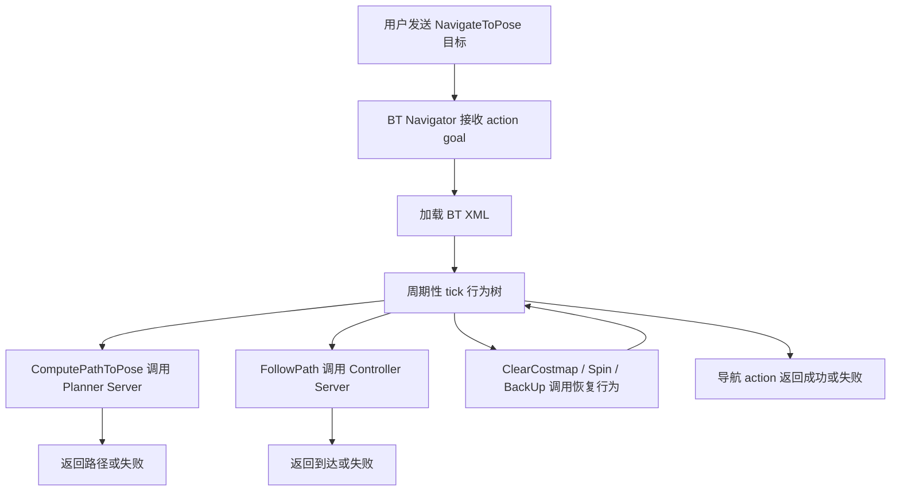
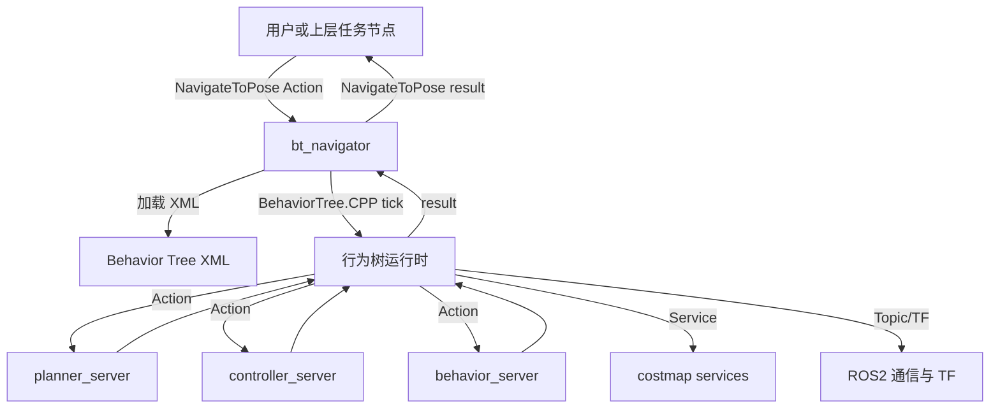

# ROS2 行为树学习笔记：从 BehaviorTree.CPP 到 Nav2 工程实践

> 适用范围：ROS 2、Nav2、BehaviorTree.CPP、移动机器人导航、任务编排、恢复行为、行为树 XML、行为树插件开发。  
> 写作目标：不只知道“行为树是 Sequence 和 Fallback”，而是能看懂 Nav2 默认行为树，能修改导航行为，能设计自己的恢复策略，能写自定义 BT 插件，并能用 ROS 2 工具定位行为树执行问题。  
> Last researched: 2026-06-19

## 目录

1. 行为树是什么
2. 为什么 ROS2 和 Nav2 大量使用行为树
3. 行为树、状态机、有限状态机和任务规划的区别
4. BehaviorTree.CPP 核心概念
5. Tick、节点状态和执行语义
6. 四类节点：Action、Condition、Control、Decorator
7. Sequence、Fallback、ReactiveSequence、ReactiveFallback 精讲
8. Blackboard 和 Port 数据流
9. 行为树 XML 格式
10. ROS2 中行为树如何连接 Action、Service、Topic 和参数
11. Nav2 行为树架构
12. BT Navigator 精讲
13. Nav2 默认 NavigateToPose 行为树拆解
14. Recovery 行为和导航失败恢复
15. 常用 Nav2 BT 节点速查
16. 编写自己的行为树 XML
17. 编写自定义 BT 插件
18. 行为树调试方法
19. Groot 和可视化
20. 行为树设计模式
21. 常见错误和排查清单
22. 学习路线和练习项目
23. 参考资料

## 1. 行为树是什么

行为树，Behavior Tree，简称 BT，是一种用于组织智能体行为的树状控制结构。它最早在游戏 AI 中广泛使用，后来在机器人领域也变得很常见。行为树的目标不是替代底层控制算法，而是把复杂任务拆成一组可组合、可复用、可观察的小行为，然后用树结构决定什么时候执行哪个行为、失败后怎么恢复、条件变化后如何重新决策。

在机器人中，一个任务很少只是“执行一个动作”。例如移动机器人执行“去 A 点”时，背后可能包括：

- 检查是否收到目标点。
- 检查定位系统是否可用。
- 计算全局路径。
- 跟踪局部路径。
- 周期性重新规划。
- 遇到障碍物时清理代价地图。
- 控制器失败后后退、旋转或等待。
- 目标变化时取消旧任务并切换新任务。
- 超时后返回失败。

如果用一大段 `if-else` 或一个巨大状态机硬写，代码会迅速膨胀。行为树的思路是把这些逻辑拆成节点。每个节点只做一件事，节点之间通过父子关系组合。

行为树是一棵有根树。根节点被周期性 tick。tick 可以理解为“这一次调度循环询问节点当前能不能继续执行”。节点被 tick 后会返回一个状态。常见状态是：

- `SUCCESS`：节点完成并成功。
- `FAILURE`：节点完成但失败。
- `RUNNING`：节点还在执行，下一轮 tick 还要继续。
- `IDLE`：节点当前没有被执行，常用于内部状态。

BehaviorTree.CPP 新版本中还存在一些内部或高级状态，例如 `SKIPPED`，但工程学习的核心仍然是 `SUCCESS`、`FAILURE`、`RUNNING`。

行为树最重要的思想是：父节点根据子节点的返回状态决定下一步。比如 Sequence 节点会从左到右执行子节点，只要有一个失败就失败，所有都成功才成功。Fallback 节点会从左到右尝试子节点，只要有一个成功就成功，所有都失败才失败。

一个简单行为树：

```xml
<root BTCPP_format="4" main_tree_to_execute="MainTree">
  <BehaviorTree ID="MainTree">
    <Sequence name="GoToKitchen">
      <IsBatteryOK/>
      <ComputePathToPose goal="{goal}" path="{path}"/>
      <FollowPath path="{path}"/>
    </Sequence>
  </BehaviorTree>
</root>
```

这个树表达的逻辑是：先检查电量，然后规划路径，再跟踪路径。任意一步失败，整个 Sequence 失败。

行为树的强项不是“让机器人更聪明”，而是让行为组织更清晰、更可复用、更容易调试。真正的规划、控制、感知仍然由对应算法完成，行为树负责把它们编排起来。

## 2. 为什么 ROS2 和 Nav2 大量使用行为树

ROS2 的系统天然是分布式的。一个机器人通常由许多节点组成：定位、地图、规划、控制、传感器驱动、恢复行为、任务服务器、生命周期管理器等。行为树很适合在这些模块之上做任务编排。

Nav2 是 ROS2 中最典型的行为树使用案例。Nav2 不是把导航写成一个巨大的单体节点，而是拆成多个服务器：

- Planner Server：负责计算路径。
- Controller Server：负责跟踪路径并输出速度。
- Smoother Server：负责平滑路径。
- Behavior Server：负责 Spin、BackUp、Wait 等恢复行为。
- Map Server：负责地图。
- Costmap：负责局部和全局代价地图。
- BT Navigator：负责执行行为树并调用这些服务器。

Nav2 官方文档说明，BT Navigator 实现了 `NavigateToPose`、`NavigateThroughPoses` 等任务接口，是基于行为树的导航实现，用来灵活指定复杂机器人行为和恢复行为。也就是说，Nav2 中的行为树不是“附属功能”，而是导航任务的顶层执行逻辑。

Nav2 中一次导航大致可以理解为：



这种架构的好处：

- 行为逻辑可以通过 XML 修改，不一定要重新写核心导航代码。
- 规划器、控制器、恢复行为可以插件化替换。
- 失败恢复逻辑可以清楚表达。
- 可以用 Groot 或日志观察行为树执行过程。
- 可以为不同任务加载不同 BT，例如单点导航、多点导航、巡检、覆盖、对接。
- 复杂任务可以通过子树复用。

行为树特别适合机器人，因为机器人运行环境变化大。路径可能被堵，定位可能暂时丢失，控制器可能失败，代价地图可能过时，目标可能更新，用户可能取消任务。相比一次性流程，行为树可以周期性检查条件，并根据运行状态重新决策。

## 3. 行为树、状态机、有限状态机和任务规划的区别

行为树和状态机都能表达流程，但心智模型不同。

有限状态机，Finite State Machine，强调“当前处于哪个状态，以及事件触发后跳到哪个状态”。例如机器人有 `IDLE`、`PLANNING`、`CONTROLLING`、`RECOVERING`、`SUCCEEDED`、`FAILED` 这些状态。状态机适合状态数量少、转移关系清楚的场景。

行为树强调“每次 tick 时，从根节点开始根据条件和返回值决定执行路径”。行为树更像一套分层决策规则。节点本身可以有内部状态，但外部看起来是父节点调度子节点。

对比：

| 维度 | 状态机 | 行为树 |
| --- | --- | --- |
| 核心单位 | 状态和转移 | 节点和返回状态 |
| 执行方式 | 事件驱动或循环更新当前状态 | 根节点周期性 tick |
| 组合方式 | 状态之间显式连线 | 父子树结构组合 |
| 扩展性 | 状态多时转移爆炸 | 子树可复用，层级更清晰 |
| 响应条件变化 | 需要显式转移 | Reactive 节点可周期性重检 |
| 可视化 | 状态图 | 树图 |
| 典型用途 | 生命周期、模式切换 | 任务编排、恢复策略 |

行为树不是万能的。它适合任务执行层，不适合替代连续控制器、路径规划器、SLAM、感知模型。比如“FollowPath”在行为树中是一个 Action 节点，但真正的路径跟踪由 Controller Server 完成。行为树只关心它是成功、失败还是正在运行。

行为树也不是完整的符号任务规划器。PDDL、PlanSys2 这类规划系统会根据初始状态、目标和动作前后置条件自动生成计划。行为树通常由人设计结构，虽然可以配合任务规划器使用，但本身更偏执行框架。

可以把机器人软件分层理解：

```text
任务目标层：我要巡检 A、B、C 三个点
任务规划层：决定先去 A 再去 B 再去 C
行为树层：执行每个目标，失败后恢复或重试
导航算法层：规划路径、跟踪路径、避障
控制硬件层：电机、编码器、底盘驱动、安全停机
```

行为树位于任务执行和算法调用之间。

## 4. BehaviorTree.CPP 核心概念

BehaviorTree.CPP 是 ROS2 和 Nav2 常用的 C++ 行为树库。Nav2 的行为树执行底层使用 BehaviorTree.CPP。理解 Nav2 行为树，必须先理解 BehaviorTree.CPP 的几个基本概念。

核心对象：

- `TreeNode`：所有节点的基类。
- `ActionNode`：执行动作的叶子节点。
- `ConditionNode`：检查条件的叶子节点。
- `ControlNode`：控制多个子节点执行顺序的节点。
- `DecoratorNode`：修饰一个子节点行为的节点。
- `BehaviorTreeFactory`：注册节点类型并从 XML 创建树。
- `Blackboard`：树中共享的键值数据存储。
- `Ports`：节点输入输出接口。
- `NodeStatus`：节点状态。

一个行为树的创建过程通常是：

1. 编写 C++ 节点类。
2. 给节点声明输入输出 ports。
3. 用工厂注册节点类型。
4. 编写 XML 描述树结构。
5. 工厂加载 XML 并创建 Tree。
6. 周期性 tick 根节点。
7. 根据返回状态决定任务是否成功、失败或继续。

在 Nav2 中，许多节点已经预注册，例如 `ComputePathToPose`、`FollowPath`、`ClearEntireCostmap`、`Spin`、`BackUp`、`Wait`、`GoalReached` 等。开发者可以直接在 XML 中使用，也可以写自己的插件节点。

BehaviorTree.CPP 的一个重要原则是：长时间任务不应该在 `tick()` 中阻塞太久。异步动作应该快速返回 `RUNNING`，让树继续被周期性 tick，同时在后台等待 ROS2 action 或 service 返回。否则整个行为树执行线程会被卡住，条件重检、取消、超时和恢复都可能不及时。

## 5. Tick、节点状态和执行语义

tick 是行为树的核心。每次 tick 从根节点开始，父节点根据自己的逻辑 tick 子节点。子节点返回 `SUCCESS`、`FAILURE` 或 `RUNNING`，父节点再决定返回什么。

三个主要状态：

| 状态 | 含义 | 示例 |
| --- | --- | --- |
| `SUCCESS` | 节点完成且成功 | 路径规划成功，条件满足 |
| `FAILURE` | 节点完成但失败 | 规划失败，条件不满足 |
| `RUNNING` | 节点还没完成 | 控制器正在跟踪路径 |

行为树不是一次性从上到下执行完。它通常以固定频率运行。例如 Nav2 的 BT Navigator 周期性 tick 行为树，某些节点可能多次返回 `RUNNING`。当最终返回 `SUCCESS` 或 `FAILURE`，整个导航 action 才结束。

举例：

```xml
<Sequence>
  <ComputePathToPose goal="{goal}" path="{path}"/>
  <FollowPath path="{path}"/>
</Sequence>
```

执行过程可能是：

1. 根 tick Sequence。
2. Sequence tick `ComputePathToPose`。
3. `ComputePathToPose` 发送规划 action，返回 `RUNNING`。
4. 下一轮 tick 继续等待规划结果。
5. 规划成功后返回 `SUCCESS`，并把路径写入 `{path}`。
6. Sequence tick `FollowPath`。
7. `FollowPath` 发送控制 action，返回 `RUNNING`。
8. 多轮 tick 后机器人到达目标，`FollowPath` 返回 `SUCCESS`。
9. Sequence 所有子节点成功，返回 `SUCCESS`。

如果规划失败：

1. `ComputePathToPose` 返回 `FAILURE`。
2. Sequence 立即返回 `FAILURE`。
3. 后面的 `FollowPath` 不会执行。

tick 语义带来的重要工程要求：

- Action 节点要支持取消和 halt。
- 长时间任务要返回 `RUNNING`，不要阻塞。
- Condition 节点要快速完成。
- Blackboard 数据要在节点 tick 时保持一致。
- 父节点选择是否重新 tick 已成功的子节点，会影响响应性。

## 6. 四类节点：Action、Condition、Control、Decorator

行为树常见节点分为四类。

### 6.1 Action 节点

Action 节点执行实际动作，通常是叶子节点。它可能调用 ROS2 action server、service、topic 或本地函数。

Nav2 中常见 Action 节点：

- `ComputePathToPose`：调用 Planner Server 计算到目标点的路径。
- `FollowPath`：调用 Controller Server 跟踪路径。
- `BackUp`：调用 Behavior Server 后退。
- `Spin`：原地旋转。
- `Wait`：等待一段时间。
- `ClearEntireCostmap`：清理代价地图。
- `NavigateToPose`：作为子导航行为使用。

Action 节点可能返回：

- 动作成功时返回 `SUCCESS`。
- action server 报错或超时时返回 `FAILURE`。
- 动作尚未完成时返回 `RUNNING`。

### 6.2 Condition 节点

Condition 节点检查条件，通常快速返回成功或失败，不应该长时间运行。

示例：

- 电量是否低。
- 目标是否更新。
- 是否到达目标。
- 路径是否有效。
- TF 是否可用。
- 是否收到初始位姿。

Condition 节点的语义通常是：

- 条件满足，返回 `SUCCESS`。
- 条件不满足，返回 `FAILURE`。

不要把耗时操作塞进 Condition。Condition 应该像一个判断题，而不是一个任务。

### 6.3 Control 节点

Control 节点负责调度多个子节点。例如 Sequence、Fallback、Parallel、RoundRobin、RecoveryNode、PipelineSequence 等。

Control 节点决定：

- 子节点按什么顺序执行。
- 子节点成功时继续还是结束。
- 子节点失败时继续还是结束。
- 遇到 `RUNNING` 是否记住位置。
- 下一轮 tick 是否从头开始。

Control 节点是行为树逻辑的骨架。

### 6.4 Decorator 节点

Decorator 节点只有一个子节点，用来改变子节点行为。例如：

- 限制执行频率。
- 超时。
- 重试。
- 取反结果。
- 强制成功。
- 强制失败。
- 延迟执行。
- 只执行一次。

Nav2 中常用 Decorator：

- `RateController`：限制子节点 tick 频率。
- `DistanceController`：机器人移动一定距离后才 tick 子节点。
- `SpeedController`：根据速度控制 tick。
- `GoalUpdater`：更新目标。
- `SingleTrigger`：只触发一次。

Decorator 是行为树中非常实用的工程工具。例如全局路径不需要 100 Hz 重新规划，可以用 `RateController hz="1.0"` 控制为 1 Hz。

## 7. Sequence、Fallback、ReactiveSequence、ReactiveFallback 精讲

### 7.1 Sequence

Sequence 是最常见的控制节点。它从左到右 tick 子节点：

- 如果某个子节点返回 `FAILURE`，Sequence 立即返回 `FAILURE`。
- 如果某个子节点返回 `RUNNING`，Sequence 返回 `RUNNING`。
- 如果所有子节点都返回 `SUCCESS`，Sequence 返回 `SUCCESS`。

适合表达“必须依次完成”的流程。

```xml
<Sequence>
  <CheckLocalization/>
  <ComputePathToPose goal="{goal}" path="{path}"/>
  <FollowPath path="{path}"/>
</Sequence>
```

含义：定位可用，才能规划；规划成功，才能跟踪路径。

### 7.2 SequenceWithMemory

SequenceWithMemory 会记住上次运行到哪个子节点。前面已经成功的子节点，在下一轮 tick 时不一定重新执行。

适合表达“前置步骤成功后不需要反复检查”的流程。但它的响应性较弱，如果前置条件之后变坏，可能不会立刻发现。

例如：

```xml
<SequenceWithMemory>
  <OpenDoor/>
  <EnterRoom/>
  <CloseDoor/>
</SequenceWithMemory>
```

如果 `OpenDoor` 成功后 `EnterRoom` 还在运行，下一轮可能直接继续 `EnterRoom`，而不是重新打开门。

### 7.3 ReactiveSequence

ReactiveSequence 更强调响应性。它通常每轮 tick 都会从第一个子节点重新检查。这样可以把条件节点放在前面，持续监控。

```xml
<ReactiveSequence>
  <IsBatteryOK/>
  <FollowPath path="{path}"/>
</ReactiveSequence>
```

含义：跟踪路径过程中，每轮 tick 都重新检查电量。如果电量变低，`IsBatteryOK` 返回 `FAILURE`，整个 ReactiveSequence 失败，后续可以触发回充或停机。

ReactiveSequence 适合“条件必须持续成立”的场景。但也要避免把昂贵计算放在前面，否则每轮 tick 都执行会浪费资源。

### 7.4 Fallback

Fallback 也叫 Selector。它从左到右 tick 子节点：

- 如果某个子节点返回 `SUCCESS`，Fallback 立即返回 `SUCCESS`。
- 如果某个子节点返回 `RUNNING`，Fallback 返回 `RUNNING`。
- 如果所有子节点都返回 `FAILURE`，Fallback 返回 `FAILURE`。

适合表达“尝试方案 A，不行就方案 B”。

```xml
<Fallback>
  <FollowPath path="{path}"/>
  <BackUp backup_dist="0.3"/>
  <Wait wait_duration="2"/>
</Fallback>
```

这个例子比较粗糙，含义是先尝试跟踪路径，如果失败则后退，如果后退也失败则等待。真实恢复逻辑通常还会套 Retry、RecoveryNode 或 RoundRobin。

### 7.5 ReactiveFallback

ReactiveFallback 会反复从第一个子节点检查，常用于“如果条件已经满足就不用执行动作，否则执行动作”。

```xml
<ReactiveFallback>
  <GoalReached/>
  <FollowPath path="{path}"/>
</ReactiveFallback>
```

含义：如果已经到达目标，则成功；否则继续跟踪路径。每轮 tick 都重新检查是否到达目标。

### 7.6 Parallel

Parallel 节点同时或近似同时 tick 多个子节点，根据成功阈值和失败阈值决定结果。它适合需要并行监控的场景，但在 ROS2 行为树中使用要谨慎，因为真正的并行、线程安全、取消语义和资源竞争都要考虑。

### 7.7 RoundRobin

RoundRobin 会轮流尝试子节点，常用于恢复行为。例如第一次清理全局 costmap，第二次清理局部 costmap，第三次原地旋转，第四次等待。这样可以避免每次失败都只执行同一个恢复动作。

## 8. Blackboard 和 Port 数据流

BehaviorTree.CPP 使用 Blackboard 实现节点之间的数据共享。Blackboard 是一个键值存储。节点通过 input port 从黑板读取数据，通过 output port 写入数据。

例子：

```xml
<ComputePathToPose goal="{goal}" path="{path}"/>
<FollowPath path="{path}"/>
```

这里：

- `{goal}` 表示从黑板读取键 `goal`。
- `ComputePathToPose` 把输出路径写到黑板键 `path`。
- `FollowPath` 从黑板键 `path` 读取路径。

如果没有大括号，通常表示静态字符串或字面值：

```xml
<Wait wait_duration="5"/>
```

这里 `5` 是直接传给节点的静态输入，不是黑板变量。

Blackboard 的作用：

- 在节点之间传递目标点、路径、控制器 ID、规划器 ID。
- 保存恢复次数。
- 保存错误码。
- 保存当前目标是否更新。
- 在子树之间传递输入输出。

Port 的类型：

- InputPort：节点读取输入。
- OutputPort：节点写输出。
- BidirectionalPort：既读又写。

自定义节点时必须声明 ports。这样 XML 中的属性才能被解析，也能让 Groot 等工具知道节点接口。

C++ 示例：

```cpp
static BT::PortsList providedPorts()
{
  return {
    BT::InputPort<std::string>("message"),
    BT::OutputPort<bool>("done")
  };
}
```

常见错误：

- XML 中使用了节点未声明的 port。
- 黑板键拼写错误。
- 输入类型不匹配，例如需要 int 却传入非数字字符串。
- 输出节点没有成功写入黑板，后续节点读取失败。
- 子树 remap 时忘记映射输入输出。

工程建议：

- 黑板键命名要稳定，例如 `goal`、`path`、`selected_controller`。
- 不要用过于随意的键名，例如 `x`、`tmp`。
- 大型树中对关键黑板键写注释。
- 子树输入输出要明确声明，避免隐式依赖外部黑板。

## 9. 行为树 XML 格式

BehaviorTree.CPP 的行为树通常用 XML 描述。Nav2 默认行为树也是 XML。

基本格式：

```xml
<root BTCPP_format="4" main_tree_to_execute="MainTree">
  <BehaviorTree ID="MainTree">
    <Sequence name="MainSequence">
      <AlwaysSuccess/>
    </Sequence>
  </BehaviorTree>
</root>
```

重要标签：

- `root`：根标签。
- `BTCPP_format="4"`：表示 BehaviorTree.CPP v4 XML 格式。
- `main_tree_to_execute`：指定要执行的行为树 ID。
- `BehaviorTree ID="..."`：定义一棵树。
- 控制节点、装饰节点、动作节点、条件节点都作为 XML 标签出现。

节点属性：

```xml
<RateController hz="1.0">
  <ComputePathToPose goal="{goal}" path="{path}" planner_id="{selected_planner}"/>
</RateController>
```

这里 `hz` 是静态参数，`goal`、`path`、`planner_id` 使用黑板数据。

子树：

```xml
<root BTCPP_format="4" main_tree_to_execute="MainTree">
  <BehaviorTree ID="MainTree">
    <Sequence>
      <SubTree ID="NavigationSubtree" goal="{goal}"/>
      <SubTree ID="ReportSubtree"/>
    </Sequence>
  </BehaviorTree>

  <BehaviorTree ID="NavigationSubtree">
    <Sequence>
      <ComputePathToPose goal="{goal}" path="{path}"/>
      <FollowPath path="{path}"/>
    </Sequence>
  </BehaviorTree>

  <BehaviorTree ID="ReportSubtree">
    <AlwaysSuccess/>
  </BehaviorTree>
</root>
```

外部 include：

```xml
<root BTCPP_format="4" main_tree_to_execute="MainTree">
  <include path="navigation_subtree.xml"/>
  <BehaviorTree ID="MainTree">
    <SubTree ID="NavigationSubtree"/>
  </BehaviorTree>
</root>
```

XML 编写建议：

- 顶层树只表达大流程。
- 复杂恢复逻辑拆成子树。
- 给关键 Control 节点加 `name`，方便日志和可视化。
- 不要把所有逻辑都堆在一个巨大 XML 文件中。
- 静态参数和黑板变量要区分清楚。
- 修改 Nav2 默认树时要保留必要端口，例如 `goal`、`path`、`server_timeout` 等。

## 10. ROS2 中行为树如何连接 Action、Service、Topic 和参数

行为树本身只是执行框架。ROS2 中真正的工作通常由 Action、Service、Topic 和参数完成。

### 10.1 ROS2 Action

ROS2 Action 适合长时间任务，例如导航到目标点、跟踪路径、旋转、后退、等待。Action 有 goal、feedback、result，并支持取消。

Nav2 的大多数动作型 BT 节点都通过 ROS2 Action 调用服务器。例如：

- `ComputePathToPose` 调用规划相关 action。
- `FollowPath` 调用控制相关 action。
- `Spin`、`BackUp`、`Wait` 调用行为服务器 action。

Action 节点常见生命周期：

1. 第一次 tick 时读取输入 port。
2. 构造 ROS2 action goal。
3. 发送 goal。
4. 返回 `RUNNING`。
5. 后续 tick 检查 action 是否完成。
6. result 成功则返回 `SUCCESS`。
7. result abort 或超时则返回 `FAILURE`。
8. 如果节点被 halt，取消 action goal。

这就是为什么 BT Action 节点必须支持取消。机器人任务中经常会发生目标更新、用户取消、条件变坏、恢复切换等情况。

### 10.2 ROS2 Service

Service 适合较短请求，例如清理 costmap、查询状态、切换模式。行为树节点可以调用 service，并根据响应返回成功或失败。

Service 节点不适合很长时间阻塞。如果服务处理很慢，行为树 tick 会被拖住。

### 10.3 Topic

Topic 常用于订阅条件或发布简单命令。例如条件节点可以订阅电池话题判断电量是否低；动作节点可以发布一个简单控制命令。但在需要确认结果的任务中，Action 通常比 Topic 更适合，因为 Action 有完成结果、取消和反馈。

### 10.4 参数

行为树 XML 中有些节点参数是静态配置，例如等待时间、规划频率、重试次数。ROS2 节点参数则配置 BT Navigator、插件库、服务器超时等。

Nav2 中行为树相关参数包括：

- `default_nav_to_pose_bt_xml`：默认 NavigateToPose 行为树 XML 路径。
- `default_nav_through_poses_bt_xml`：默认 NavigateThroughPoses 行为树 XML 路径。
- `always_reload_bt_xml`：是否每次都重新加载请求指定的 BT XML。
- `plugin_lib_names`：BT 插件库名称列表。
- `bt_loop_duration`：行为树循环周期相关参数，不同版本需查文档。
- `server_timeout`：等待服务器相关超时，不同节点也有自己的输入端口。

Nav2 参数会随版本演进。比如旧版本中某些参数名和新版本不同，工程中必须以当前发行版文档为准。

## 11. Nav2 行为树架构

Nav2 行为树涉及几个关键包：

- `nav2_bt_navigator`：BT Navigator 节点，执行行为树，提供 `NavigateToPose`、`NavigateThroughPoses` 等 action server。
- `nav2_behavior_tree`：Nav2 行为树节点插件集合，提供导航相关 Action、Condition、Control、Decorator 节点。
- `behaviortree_cpp`：底层行为树 C++ 库。
- `nav2_msgs`：定义导航相关 action、service、message。
- `nav2_core`：定义插件接口。

架构图：



Nav2 的行为树不是直接计算路径或控制速度，而是调用服务器。这样 Planner Server 和 Controller Server 可以独立替换插件，而行为树只负责逻辑编排。

例如 `ComputePathToPose` 节点本身不是 A* 或 Smac Planner，它只是把目标点发送给 Planner Server，由 Planner Server 内部选定的 planner plugin 计算路径。`FollowPath` 也不是 DWB 或 MPPI 控制器本体，它只是调用 Controller Server。

理解这个边界非常重要。调试时，如果 `ComputePathToPose` 失败，不应该马上改行为树，而应该看 Planner Server、costmap、TF、目标点合法性。如果 `FollowPath` 失败，不应该马上改 Fallback，而应该看 Controller Server、局部 costmap、机器人速度限制、路径是否可跟踪。

## 12. BT Navigator 精讲

BT Navigator 是 Nav2 的行为树执行节点。它对外提供导航任务 action server，对内加载并执行行为树。

主要职责：

- 接收 `NavigateToPose` 或 `NavigateThroughPoses` action goal。
- 根据参数或 goal 中指定的 BT XML 加载行为树。
- 初始化黑板，例如目标点、路径、恢复次数等。
- 周期性 tick 行为树。
- 处理取消、抢占、超时、错误码。
- 将行为树最终状态映射为 action result。
- 发布行为树日志或状态信息。

BT Navigator 的输入输出：

| 类型 | 内容 |
| --- | --- |
| 输入 action | `NavigateToPose`、`NavigateThroughPoses` 等 |
| 输入参数 | BT XML 路径、插件库、循环周期、超时 |
| 输入 TF | 导航相关坐标变换 |
| 输出 action result | 导航成功、失败、取消、错误码 |
| 内部调用 | Planner、Controller、Behavior、Costmap 等服务器 |
| 调试输出 | 行为树日志、节点状态变化 |

典型配置片段：

```yaml
bt_navigator:
  ros__parameters:
    use_sim_time: true
    default_nav_to_pose_bt_xml: "$(find-pkg-share my_robot_bringup)/behavior_trees/navigate_to_pose.xml"
    default_nav_through_poses_bt_xml: "$(find-pkg-share my_robot_bringup)/behavior_trees/navigate_through_poses.xml"
    always_reload_bt_xml: false
    plugin_lib_names:
      - nav2_compute_path_to_pose_action_bt_node
      - nav2_follow_path_action_bt_node
      - nav2_back_up_action_bt_node
      - nav2_spin_action_bt_node
      - nav2_wait_action_bt_node
      - nav2_clear_costmap_service_bt_node
```

注意：不同 ROS2/Nav2 版本中默认插件列表、参数名和是否需要显式配置会变化。实际项目要看当前发行版的配置文档和默认 `nav2_params.yaml`。

BT Navigator 不是生命周期管理器本身，但它通常作为 Nav2 lifecycle node 被 lifecycle manager 管理。也就是说，导航前要确认 Nav2 相关节点已经 configure 并 activate。行为树再正确，如果 Planner Server 或 Controller Server 没激活，也无法工作。

常用检查：

```bash
ros2 node list
ros2 lifecycle get /bt_navigator
ros2 action list
ros2 action info /navigate_to_pose
ros2 topic echo /behavior_tree_log
```

## 13. Nav2 默认 NavigateToPose 行为树拆解

Nav2 默认主行为树通常叫类似 `navigate_to_pose_w_replanning_and_recovery.xml`。官方详细 walkthrough 提到，它会周期性重新规划全局路径，并包含恢复动作。不同版本 XML 细节会变化，但核心结构相似。

一个简化版本：

```xml
<root BTCPP_format="4" main_tree_to_execute="NavigateToPose">
  <BehaviorTree ID="NavigateToPose">
    <RecoveryNode number_of_retries="6" name="NavigateRecovery">
      <PipelineSequence name="NavigateWithReplanning">
        <RateController hz="1.0">
          <ComputePathToPose goal="{goal}" path="{path}" planner_id="{selected_planner}"/>
        </RateController>
        <FollowPath path="{path}" controller_id="{selected_controller}"/>
      </PipelineSequence>

      <ReactiveFallback name="RecoveryFallback">
        <GoalUpdated/>
        <RoundRobin name="RecoveryActions">
          <ClearEntireCostmap name="ClearGlobalCostmap" service_name="global_costmap/clear_entirely_global_costmap"/>
          <ClearEntireCostmap name="ClearLocalCostmap" service_name="local_costmap/clear_entirely_local_costmap"/>
          <Spin spin_dist="1.57"/>
          <Wait wait_duration="5"/>
          <BackUp backup_dist="0.3" backup_speed="0.05"/>
        </RoundRobin>
      </ReactiveFallback>
    </RecoveryNode>
  </BehaviorTree>
</root>
```

这个树表达的核心逻辑：

1. 用 `RecoveryNode` 包住主导航流程和恢复流程。
2. 主导航流程由 `PipelineSequence` 组织。
3. `RateController hz="1.0"` 限制全局重规划频率为 1 Hz。
4. `ComputePathToPose` 计算路径并写入 `{path}`。
5. `FollowPath` 跟踪 `{path}`。
6. 如果主流程失败，进入恢复流程。
7. 如果目标更新，恢复可能中断或重新处理。
8. `RoundRobin` 轮流执行清理 costmap、旋转、等待、后退等恢复动作。
9. 恢复后重试主流程。
10. 超过重试次数则导航失败。

### 13.1 PipelineSequence

Nav2 的 `PipelineSequence` 是导航中很重要的控制节点。它允许前面的子节点在后面的子节点运行时继续被 tick，从而形成“规划和控制流水线”。这意味着机器人跟踪路径时，规划器可以周期性重新规划，更新路径给控制器。

如果只用普通 Sequence，规划成功后进入 FollowPath，规划节点可能不会持续重新 tick。对于动态环境，周期性重规划非常重要。

### 13.2 RateController

规划器不应该每个 BT tick 都被调用。假设行为树 100 ms tick 一次，每秒会调用 10 次规划器，可能浪费计算资源。`RateController hz="1.0"` 让规划子树大约 1 秒执行一次。

### 13.3 RecoveryNode

`RecoveryNode` 通常有两个子节点：主任务和恢复任务。主任务失败后执行恢复任务，恢复成功后再重试主任务。`number_of_retries` 控制重试次数。

这个模式非常适合导航，因为失败不一定意味着任务不可完成。可能只是 costmap 需要清理、障碍物临时挡住、控制器局部失败。

### 13.4 RoundRobin

如果每次失败都只清理 costmap，可能永远无法脱困。RoundRobin 让恢复动作轮流尝试：

- 第一次失败清理局部 costmap。
- 第二次失败清理全局 costmap。
- 第三次失败旋转。
- 第四次失败等待。
- 第五次失败后退。

实际顺序要根据机器人类型和场景设计。

## 14. Recovery 行为和导航失败恢复

恢复行为是 Nav2 行为树最有价值的部分之一。机器人导航失败很常见，恢复逻辑决定系统是“卡住就失败”，还是“能尝试自救”。

常见导航失败原因：

- 全局规划失败。
- 局部控制器无法找到有效速度。
- costmap 中障碍物过多。
- 机器人被动态障碍物挡住。
- 定位漂移。
- TF 暂时不可用。
- 目标点在障碍物内。
- 路径穿过不可通行区域。
- 机器人半径或 footprint 配置错误。

恢复行为要针对失败原因设计。常见恢复动作：

- 清理局部代价地图。
- 清理全局代价地图。
- 原地旋转，重新观察环境。
- 等待动态障碍物离开。
- 后退一小段。
- 重新初始化全局定位。
- 重新规划。
- 切换控制器或规划器。

恢复行为设计原则：

- 从低风险动作开始，例如清理 costmap。
- 再尝试轻微运动，例如旋转、后退。
- 对真实机器人要考虑安全边界，后退和旋转可能碰撞。
- 限制恢复次数，避免无限循环。
- 记录恢复次数和原因，便于调试。
- 目标更新时要及时退出旧恢复逻辑。
- 真实机器人中恢复动作要受急停、安全雷达、速度限制约束。

一个恢复子树示例：

```xml
<ReactiveFallback name="RecoveryFallback">
  <GoalUpdated/>
  <RoundRobin name="RecoveryActions">
    <ClearEntireCostmap name="ClearLocalCostmap" service_name="local_costmap/clear_entirely_local_costmap"/>
    <ClearEntireCostmap name="ClearGlobalCostmap" service_name="global_costmap/clear_entirely_global_costmap"/>
    <Wait wait_duration="2"/>
    <BackUp backup_dist="0.2" backup_speed="0.05"/>
    <Spin spin_dist="1.57"/>
  </RoundRobin>
</ReactiveFallback>
```

`GoalUpdated` 放在 ReactiveFallback 里，是为了在用户发送新目标时打断当前恢复逻辑。否则机器人可能还在为旧目标执行恢复。

## 15. 常用 Nav2 BT 节点速查

Nav2 的 `nav2_behavior_tree` 提供了许多导航相关节点。官方 Behavior Tree XML Nodes 文档列出这些节点。不同版本节点集合会变化，下面按类别整理常见节点。

### 15.1 Action 节点

| 节点 | 作用 |
| --- | --- |
| `ComputePathToPose` | 计算从当前位姿到单个目标点的路径 |
| `ComputePathThroughPoses` | 计算经过多个目标点的路径 |
| `FollowPath` | 跟踪路径 |
| `NavigateToPose` | 子树中调用单点导航 |
| `NavigateThroughPoses` | 子树中调用多点导航 |
| `Spin` | 原地旋转 |
| `BackUp` | 后退 |
| `DriveOnHeading` | 按指定方向行驶 |
| `Wait` | 等待 |
| `AssistedTeleop` | 辅助遥操作 |
| `ClearEntireCostmap` | 清理整个 costmap |
| `ClearCostmapExceptRegion` | 清理除某区域外的 costmap |
| `ClearCostmapAroundRobot` | 清理机器人周围 costmap |
| `TruncatePath` | 截断路径 |
| `PlannerSelector` | 选择规划器 |
| `ControllerSelector` | 选择控制器 |
| `SmootherSelector` | 选择平滑器 |

### 15.2 Condition 节点

| 节点 | 作用 |
| --- | --- |
| `GoalReached` | 检查是否到达目标 |
| `GoalUpdated` | 检查目标是否更新 |
| `GloballyUpdatedGoal` | 检查全局目标更新 |
| `IsPathValid` | 检查路径是否仍然有效 |
| `TransformAvailable` | 检查 TF 是否可用 |
| `InitialPoseReceived` | 检查是否收到初始位姿 |
| `IsBatteryLow` | 检查电量是否低 |
| `TimeExpiredCondition` | 检查时间是否超时 |
| `DistanceTraveled` | 检查是否行驶指定距离 |

### 15.3 Control 节点

| 节点 | 作用 |
| --- | --- |
| `PipelineSequence` | 支持规划和控制流水线 |
| `RecoveryNode` | 主任务失败后执行恢复并重试 |
| `RoundRobin` | 轮流执行恢复动作 |
| `NonblockingSequence` | 非阻塞序列，不同版本支持情况需查文档 |
| `PersistentSequence` | 持久序列，不同版本支持情况需查文档 |

### 15.4 Decorator 节点

| 节点 | 作用 |
| --- | --- |
| `RateController` | 限制子节点执行频率 |
| `DistanceController` | 机器人移动指定距离后 tick 子节点 |
| `SpeedController` | 根据速度控制 tick |
| `GoalUpdater` | 更新目标 |
| `SingleTrigger` | 只触发一次 |
| `PathLongerOnApproach` | 接近目标时检测路径变长等情况 |

使用这些节点时要查对应节点文档，因为每个节点支持的 XML port 不同。例如 `ComputePathToPose` 需要 `goal`、`path`，还可能有 `planner_id`、`server_timeout`、错误码输出等。

## 16. 编写自己的行为树 XML

改 Nav2 行为树时，不建议一上来就重写整个默认树。更稳妥的方式是小步修改。

### 16.1 最小单点导航树

```xml
<root BTCPP_format="4" main_tree_to_execute="NavigateSimple">
  <BehaviorTree ID="NavigateSimple">
    <Sequence name="NavigateSimpleSequence">
      <ComputePathToPose goal="{goal}" path="{path}" planner_id="{selected_planner}"/>
      <FollowPath path="{path}" controller_id="{selected_controller}"/>
    </Sequence>
  </BehaviorTree>
</root>
```

这个树非常简单，没有恢复，没有重规划。适合学习，不适合真实复杂环境。

### 16.2 加入周期性重规划

```xml
<root BTCPP_format="4" main_tree_to_execute="NavigateReplanning">
  <BehaviorTree ID="NavigateReplanning">
    <PipelineSequence name="NavigateWithReplanning">
      <RateController hz="1.0">
        <ComputePathToPose goal="{goal}" path="{path}" planner_id="{selected_planner}"/>
      </RateController>
      <FollowPath path="{path}" controller_id="{selected_controller}"/>
    </PipelineSequence>
  </BehaviorTree>
</root>
```

适合动态环境。规划器每秒更新一次路径，控制器持续跟踪最新路径。

### 16.3 加入恢复

```xml
<root BTCPP_format="4" main_tree_to_execute="NavigateRecovery">
  <BehaviorTree ID="NavigateRecovery">
    <RecoveryNode number_of_retries="3" name="NavigateRecoveryNode">
      <PipelineSequence name="NavigateWithReplanning">
        <RateController hz="1.0">
          <ComputePathToPose goal="{goal}" path="{path}" planner_id="{selected_planner}"/>
        </RateController>
        <FollowPath path="{path}" controller_id="{selected_controller}"/>
      </PipelineSequence>

      <RoundRobin name="RecoveryActions">
        <ClearEntireCostmap service_name="local_costmap/clear_entirely_local_costmap"/>
        <ClearEntireCostmap service_name="global_costmap/clear_entirely_global_costmap"/>
        <Wait wait_duration="2"/>
      </RoundRobin>
    </RecoveryNode>
  </BehaviorTree>
</root>
```

这个版本更接近真实使用，但仍然要根据机器人安全性选择恢复动作。

### 16.4 添加电量条件

```xml
<root BTCPP_format="4" main_tree_to_execute="NavigateWithBatteryCheck">
  <BehaviorTree ID="NavigateWithBatteryCheck">
    <ReactiveSequence name="BatterySafeNavigation">
      <IsBatteryLow battery_topic="/battery_status" min_battery="0.15"/>
      <PipelineSequence name="NavigateWithReplanning">
        <RateController hz="1.0">
          <ComputePathToPose goal="{goal}" path="{path}"/>
        </RateController>
        <FollowPath path="{path}"/>
      </PipelineSequence>
    </ReactiveSequence>
  </BehaviorTree>
</root>
```

这个例子只是说明模式。实际 `IsBatteryLow` 的返回语义和端口要查 Nav2 文档。有些节点可能是电量低返回 `SUCCESS`，这时就需要用 Inverter 或调整树结构。不要凭名字猜节点语义。

### 16.5 配置 BT XML 路径

在 Nav2 参数中指定：

```yaml
bt_navigator:
  ros__parameters:
    default_nav_to_pose_bt_xml: "$(find-pkg-share my_robot_bringup)/behavior_trees/my_nav_to_pose.xml"
```

也可以在发送导航 goal 时指定行为树路径，具体取决于 action 接口和客户端工具。实际项目中建议先通过参数设置默认树，稳定后再做按任务动态选择。

## 17. 编写自定义 BT 插件

当现有 Nav2 节点不够用时，可以写自定义 BT 插件。例如：

- 检查工厂门禁是否打开。
- 控制机械臂执行取放。
- 调用电梯接口。
- 判断货架是否可用。
- 上报任务状态到调度系统。
- 根据业务规则选择恢复策略。

Nav2 官方插件教程说明，自定义 BT 插件会作为 XML 中的节点被 BT Navigator 加载。插件可以是 action、condition、decorator 或 control 类型。对于调用 ROS2 Action 的节点，Nav2 提供了 `nav2_behavior_tree::BtActionNode` 这类封装。

### 17.1 自定义 Condition 节点示例

伪代码：

```cpp
#include <behaviortree_cpp/condition_node.h>

class IsDoorOpenCondition : public BT::ConditionNode
{
public:
  IsDoorOpenCondition(const std::string & name, const BT::NodeConfiguration & config)
  : BT::ConditionNode(name, config)
  {
  }

  static BT::PortsList providedPorts()
  {
    return {
      BT::InputPort<std::string>("door_id")
    };
  }

  BT::NodeStatus tick() override
  {
    std::string door_id;
    if (!getInput("door_id", door_id)) {
      return BT::NodeStatus::FAILURE;
    }

    bool open = queryDoorState(door_id);
    return open ? BT::NodeStatus::SUCCESS : BT::NodeStatus::FAILURE;
  }

private:
  bool queryDoorState(const std::string & door_id)
  {
    return true;
  }
};
```

注册：

```cpp
#include <behaviortree_cpp/bt_factory.h>

BT_REGISTER_NODES(factory)
{
  factory.registerNodeType<IsDoorOpenCondition>("IsDoorOpen");
}
```

XML 使用：

```xml
<IsDoorOpen door_id="A区南门"/>
```

### 17.2 自定义 Action 节点注意事项

Action 节点可能运行很久，因此不要在 `tick()` 中直接阻塞等待。应该发送 ROS2 action goal，然后返回 `RUNNING`，后续 tick 中检查结果。如果节点被 halt，要取消 goal。

需要处理：

- action server 不存在。
- goal 被拒绝。
- action 执行中。
- action 成功。
- action abort。
- action cancel。
- timeout。
- halt 时取消任务。

Nav2 的 `BtActionNode` 封装了很多模式。官方教程中以 `Wait` 节点为例，说明构造函数、`providedPorts()`、`on_tick()`、`on_success()`、`on_aborted()`、`on_cancelled()` 等方法的使用。

### 17.3 插件导出和配置

自定义插件必须让 BT Navigator 能找到。通常需要：

1. CMake 中构建 shared library。
2. 使用 pluginlib 或 BT 注册宏导出。
3. 在 package.xml 中声明依赖。
4. 在 Nav2 参数 `plugin_lib_names` 中加入插件库名。
5. 在 XML 中使用注册的节点 ID。

如果 XML 报“找不到节点类型”，优先检查：

- 插件库是否编译成功。
- 库是否安装到正确目录。
- `plugin_lib_names` 是否包含库名。
- 注册名称是否和 XML 标签一致。
- 是否 source 了正确 workspace。
- 是否有 ABI 或版本不匹配。

## 18. 行为树调试方法

行为树调试要按层来，不要一看到导航失败就改 XML。

### 18.1 先确认 Nav2 基础状态

```bash
ros2 node list
ros2 lifecycle get /bt_navigator
ros2 lifecycle get /planner_server
ros2 lifecycle get /controller_server
ros2 lifecycle get /behavior_server
```

所有关键 server 应该处于 active。否则行为树调用 action 时会失败。

### 18.2 检查 action server

```bash
ros2 action list
ros2 action info /navigate_to_pose
ros2 action info /compute_path_to_pose
ros2 action info /follow_path
```

如果 `ComputePathToPose` 节点失败，先看 planner action server 是否存在。如果 `FollowPath` 失败，先看 controller action server 是否存在。

### 18.3 检查 BT XML 是否加载

常见问题：

- XML 路径错误。
- XML 使用了未注册节点。
- XML port 名称错误。
- XML 格式版本不匹配。
- include 文件找不到。

Nav2 启动日志通常会提示加载行为树 XML 和插件失败原因。

### 18.4 查看行为树日志

Nav2 可发布行为树日志到 `/behavior_tree_log`。可以检查哪些节点被 tick，状态如何变化。

```bash
ros2 topic echo /behavior_tree_log
```

日志过多时，可以调整相关参数，例如是否记录 idle transition，具体参数以当前 Nav2 文档为准。

### 18.5 检查 TF

导航行为树依赖 TF。很多看起来像行为树失败的问题，其实是 TF 断裂。

```bash
ros2 run tf2_tools view_frames
ros2 run tf2_ros tf2_echo map base_link
ros2 run tf2_ros tf2_echo odom base_link
```

常见问题：

- `map -> odom` 缺失。
- `odom -> base_link` 缺失。
- `base_link -> laser_link` 缺失。
- 时间戳不一致。
- `use_sim_time` 不一致。

### 18.6 检查 costmap

规划失败和控制失败经常来自 costmap。

检查：

- 全局 costmap 是否有地图。
- 局部 costmap 是否更新。
- footprint 是否正确。
- 障碍物层是否接收传感器数据。
- 目标点是否落在障碍物或未知区域。

### 18.7 分离 Planner 和 Controller

如果导航失败，拆开看：

- 单独调用规划 action，看能否得到 path。
- 单独给 controller 一个简单 path，看能否跟踪。
- 手动发布 `/cmd_vel`，看底盘是否执行。

不要把所有问题都归因于行为树。行为树只是上层编排。

## 19. Groot 和可视化

Groot 是 BehaviorTree.CPP 生态中的行为树可视化和编辑工具。Nav2 文档中也提供了 Groot 相关教程。Groot 可以显示行为树结构，帮助理解 XML，某些情况下还可以查看运行状态。

使用 Groot 的价值：

- 可视化 XML 树结构。
- 查看节点类型和端口。
- 编辑行为树。
- 观察运行时状态变化。
- 给团队沟通行为逻辑。

需要注意：

- Groot 默认不一定知道 Nav2 自定义节点，需要加载节点模型或 palette。
- Groot 版本和 BehaviorTree.CPP 版本要匹配。
- 运行时监控可能需要 ZeroMQ 或对应支持。
- 可视化能帮助理解，但不能替代 ROS2 日志、TF、action 和 costmap 调试。

行为树可视化建议：

- 先用 Groot 打开默认 Nav2 行为树。
- 对照 XML 看每个节点层级。
- 找到主导航子树和恢复子树。
- 修改前保存原始版本。
- 修改后用 Groot 查看结构是否符合预期。

## 20. 行为树设计模式

### 20.1 条件加动作

```xml
<ReactiveSequence>
  <ConditionA/>
  <ActionB/>
</ReactiveSequence>
```

适合要求条件持续成立的任务。例如电量正常时才继续导航。

### 20.2 条件满足则跳过动作

```xml
<ReactiveFallback>
  <GoalReached/>
  <FollowPath path="{path}"/>
</ReactiveFallback>
```

如果目标已经达成，则成功；否则执行动作。

### 20.3 主任务加恢复

```xml
<RecoveryNode number_of_retries="3">
  <MainTask/>
  <RecoveryTask/>
</RecoveryNode>
```

适合导航、抓取、对接等容易短暂失败的任务。

### 20.4 限频重规划

```xml
<PipelineSequence>
  <RateController hz="1.0">
    <ComputePathToPose goal="{goal}" path="{path}"/>
  </RateController>
  <FollowPath path="{path}"/>
</PipelineSequence>
```

适合动态环境中边走边更新路径。

### 20.5 多恢复动作轮询

```xml
<RoundRobin>
  <ClearLocalCostmap/>
  <ClearGlobalCostmap/>
  <Wait/>
  <BackUp/>
  <Spin/>
</RoundRobin>
```

适合避免单一恢复动作反复失败。

### 20.6 超时保护

```xml
<Timeout msec="5000">
  <SomeLongRunningAction/>
</Timeout>
```

适合对外部系统调用、电梯、门禁、机械臂动作等加保护。具体 Timeout 节点名称和属性以 BehaviorTree.CPP 或 Nav2 当前版本为准。

### 20.7 子树封装

```xml
<SubTree ID="NavigateWithRecovery" goal="{goal}"/>
```

适合复用复杂流程，避免主树过大。

## 21. 常见错误和排查清单

### 21.1 XML 加载失败

可能原因：

- 文件路径错误。
- XML 标签未闭合。
- `BTCPP_format` 不匹配。
- 使用了未注册节点。
- port 名称写错。
- include 文件缺失。

排查：

- 查看 Nav2 启动日志。
- 用 Groot 打开 XML。
- 简化 XML 到最小树。
- 确认插件库已加载。

### 21.2 节点一直 RUNNING

可能原因：

- ROS2 action server 没有返回 result。
- action goal 没完成。
- 节点没有处理 timeout。
- 条件永远不满足。
- halt/cancel 没实现好。

排查：

- `ros2 action info` 查看 action 连接。
- 查看服务器日志。
- 检查 action feedback。
- 给节点加 timeout。

### 21.3 行为树立刻 FAILURE

可能原因：

- 前置 Condition 失败。
- Planner 无法规划。
- TF 不可用。
- 目标点非法。
- 黑板数据缺失。
- 输入 port 类型错误。

排查：

- 看 `/behavior_tree_log` 中第一个失败节点。
- 单独测试失败节点对应服务器。
- 检查黑板键和 XML port。

### 21.4 恢复动作无限循环

可能原因：

- `number_of_retries` 设置过大或逻辑嵌套错误。
- 恢复动作总是 SUCCESS，但主问题没有解决。
- 目标点本身不可达。
- costmap 或 footprint 配置错误。

排查：

- 限制恢复次数。
- 记录恢复计数。
- 单独验证目标点可达性。
- 检查 costmap 和 footprint。

### 21.5 目标更新不生效

可能原因：

- 行为树没有 `GoalUpdated` 或对应处理。
- BT Navigator 没有重新加载 XML。
- 客户端没有正确发送新 goal。
- 当前 action 节点没有支持 preemption。

排查：

- 查看 `/navigate_to_pose` action 状态。
- 检查行为树是否包含目标更新逻辑。
- 检查目标是否写入黑板。

### 21.6 自定义插件找不到

可能原因：

- `plugin_lib_names` 没配置。
- 注册名称和 XML 标签不一致。
- 库没有安装。
- workspace 没 source。
- 依赖缺失。

排查：

- 查看启动日志中的 plugin load 错误。
- `ros2 pkg prefix` 检查包路径。
- 确认 install 目录中有插件库。
- 从最简单节点开始注册测试。

### 21.7 行为树正常但机器人不动

可能原因：

- Controller Server 没 active。
- `/cmd_vel` 没发布。
- 底盘驱动没订阅正确 topic。
- 速度被限幅为 0。
- TF 或 odom 不正确。
- collision 或 footprint 导致局部规划失败。

排查：

```bash
ros2 topic echo /cmd_vel
ros2 topic echo /odom
ros2 action info /follow_path
ros2 lifecycle get /controller_server
```

行为树成功进入 `FollowPath` 不代表底盘一定会动。还要看控制器、底盘驱动和硬件。

## 22. 学习路线和练习项目

### 第一阶段：理解基本概念

目标：

- 能解释 tick、SUCCESS、FAILURE、RUNNING。
- 能说清 Sequence 和 Fallback 的区别。
- 能看懂最小 XML。

练习：

1. 画一个“开门、进门、关门”的 Sequence。
2. 画一个“如果门开则进门，否则开门”的 Fallback。
3. 写出每个节点可能返回的状态。

### 第二阶段：学习 BehaviorTree.CPP

目标：

- 能写简单 ActionNode 和 ConditionNode。
- 理解 Blackboard 和 Port。
- 能从 XML 创建树。

练习：

1. 写一个 `SaySomething` Action。
2. 写一个 `IsNumberPositive` Condition。
3. 用黑板传递 `{message}`。
4. 写一个子树并 include。

### 第三阶段：看懂 Nav2 默认行为树

目标：

- 能找到 Nav2 默认 BT XML。
- 能解释 `RecoveryNode`、`PipelineSequence`、`RateController`。
- 能说清主导航和恢复子树。

练习：

1. 打开 `navigate_to_pose_w_replanning_and_recovery.xml`。
2. 标注每个 Action 节点调用哪个 Nav2 server。
3. 删除恢复动作，观察导航失败行为。
4. 修改重规划频率，观察 CPU 和路径变化。

### 第四阶段：自定义导航行为

目标：

- 能修改 BT XML。
- 能添加 Wait、BackUp、ClearCostmap 等恢复策略。
- 能通过参数加载自定义 XML。

练习：

1. 创建 `my_nav_to_pose.xml`。
2. 加入 `RecoveryNode number_of_retries="3"`。
3. 修改恢复动作顺序。
4. 在仿真中制造障碍物测试恢复。

### 第五阶段：自定义 BT 插件

目标：

- 能写 Condition 插件。
- 能写调用 ROS2 Action 的 Action 插件。
- 能注册并加载插件。

练习：

1. 写 `IsDockAvailable` 条件节点。
2. 写 `ReportTaskState` 动作节点。
3. 加入 `plugin_lib_names`。
4. 在 XML 中使用自定义节点。

### 第六阶段：工程化调试

目标：

- 能用 `/behavior_tree_log` 定位失败节点。
- 能用 `ros2 action info` 检查 action server。
- 能区分 BT 问题、TF 问题、costmap 问题、controller 问题。

练习：

1. 故意写错一个 XML port，观察报错。
2. 故意关闭 planner_server，观察 BT 失败。
3. 故意让目标点落在障碍物中，观察恢复行为。
4. 记录 rosbag，离线分析 `/tf`、`/cmd_vel`、`/behavior_tree_log`。

## 23. 参考资料

官方资料优先级最高。Nav2 和 BehaviorTree.CPP 版本演进较快，配置参数、插件名和默认行为树可能变化，实际项目请以当前 ROS2 发行版文档为准。

- Nav2 官方文档：https://docs.nav2.org/
- Nav2 Behavior Trees：https://docs.nav2.org/behavior_trees/index.html
- Nav2 BT Navigator 配置：https://docs.nav2.org/configuration/packages/configuring-bt-navigator.html
- Nav2 Behavior Tree XML Nodes：https://docs.nav2.org/configuration/packages/configuring-bt-xml.html
- Nav2 默认行为树详细 walkthrough：https://docs.nav2.org/behavior_trees/overview/detailed_behavior_tree_walkthrough.html
- Nav2 自定义 BT 插件教程：https://docs.nav2.org/plugin_tutorials/docs/writing_new_bt_plugin.html
- Nav2 Groot 教程：https://docs.nav2.org/tutorials/docs/groot.html
- BehaviorTree.CPP 官网：https://www.behaviortree.dev/
- BehaviorTree.CPP 基础概念：https://www.behaviortree.dev/docs/learn-the-basics/BT_basics/
- BehaviorTree.CPP Blackboard 和 Ports：https://www.behaviortree.dev/docs/tutorial-basics/tutorial_02_basic_ports/
- BehaviorTree.CPP XML 格式：https://www.behaviortree.dev/docs/learn-the-basics/xml_format/
- BehaviorTree.CPP Reactive 和 Async 行为：https://www.behaviortree.dev/docs/tutorial-basics/tutorial_04_sequence/
- ROS2 Actions 设计文档：https://design.ros2.org/articles/actions.html
- ROS2 Planning System 行为树动作教程：https://plansys2.github.io/tutorials/docs/bt_actions.html

## 结语

ROS2 行为树的学习重点不是背节点名字，而是掌握“树如何调度、节点如何返回状态、数据如何通过黑板流动、ROS2 action/service 如何被封装、失败如何恢复、日志如何定位问题”。在 Nav2 中，行为树是导航任务的执行大脑，但不是规划器、控制器或感知算法本身。

真正掌握行为树，应该能做到五件事：第一，看懂默认 Nav2 行为树；第二，能根据业务需求修改 XML；第三，能解释每个 Control 和 Decorator 为什么放在这里；第四，能写自定义 BT 插件接入 ROS2 系统；第五，导航失败时能从行为树日志一路追到 TF、costmap、planner、controller 和底盘驱动，而不是只凭直觉改参数。

行为树写得好，机器人任务逻辑会清晰、可复用、可恢复；行为树写得乱，系统会出现看似智能实则难以调试的隐性复杂度。工程上应从最小树开始，一次只增加一个机制，每次都用日志和实验验证行为是否符合预期。

<!-- AUTO_EXPANDED_TO_REFERENCE_LENGTH_2026_06_23 -->

## 万字精讲扩展：ROS2行为树学习笔记

> 本节为按参考笔记篇幅补充的系统化扩展内容，目标是把原有笔记从“知识点记录”扩展为“概念、原理、流程、工程实践、常见误区和复盘清单”完整学习材料。

### 精讲扩展 1：ROS2行为树学习笔记 的坐标系、运动学 与工程化理解

学习 $topic 时，不能只把它当成一个孤立知识点来背诵，而要把它放到 $category 的完整问题链条里理解。一个知识点通常同时包含概念定义、适用边界、输入输出、运行过程、常见异常和工程取舍。真正掌握它，意味着看到一个具体场景时，能够判断它解决什么问题、依赖哪些前提、失败时会出现什么现象，以及应该用什么手段验证自己的判断。

从 $a 的角度看，最重要的是先建立清晰的对象模型。也就是明确系统里有哪些参与者、它们之间如何连接、数据或控制信号如何流动、哪些环节是同步的、哪些环节是异步的、哪些状态是临时状态、哪些状态需要长期保存。很多初学问题并不是公式不会、API 不熟，而是对象边界不清：把配置当成状态，把结果当成过程，把局部现象当成全局规律。写笔记时建议始终追问：这个概念的主体是谁，输入是什么，输出是什么，中间约束是什么，错误会在哪里暴露。

从 $b 的角度看，流程比单点知识更关键。一个成熟方案通常不是单个技巧，而是一组步骤：先确定目标，再拆分约束，然后选择工具，最后通过测试和复盘确认效果。比如在实际项目中，不能只问“怎么实现”，还要问“为什么要这样实现”“有没有更简单的替代方案”“边界条件是什么”“数据量、并发量、实时性、可靠性变化后还能不能工作”。这种流程意识能够避免把学习停留在教程层面，也能让后续排错有明确路线。

$topic 的 $c 往往决定它在真实项目中的稳定性。理论上可行的方案，到了工程环境中会受到数据质量、硬件条件、依赖版本、网络环境、团队协作、部署方式和维护成本影响。写代码或做设计时，应该把正常路径和异常路径同时考虑：正常情况下如何运行，输入为空怎么办，超时怎么办，重复执行怎么办，部分成功怎么办，版本升级后兼容性怎么办，日志和指标如何证明系统确实按预期工作。

进一步看 $d，它通常对应性能、可靠性或可维护性的核心矛盾。很多技术选择并没有绝对正确答案，只有是否适合当前约束。例如追求极致性能可能牺牲可读性，追求高度抽象可能增加调试成本，追求快速交付可能留下技术债，追求完全通用可能让简单场景变复杂。高质量笔记应该把这些取舍写出来，而不是只给一个“推荐方案”。推荐方案背后的条件越清楚，迁移到新场景时越不容易误用。

最后从 $e 的角度进行复盘，可以把知识从“看懂”推进到“会用”。建议为 $topic 建立三个层次的检查：第一层是概念检查，确认术语、流程和边界没有混淆；第二层是实践检查，确认能够独立完成一个最小案例；第三层是工程检查，确认这个案例在异常、规模、性能和维护方面经得起追问。每次学习完一个章节，都可以用这三层检查反向补齐笔记。

#### 典型场景拆解

在真实场景中，$topic 通常会经历“需求出现、方案选择、实现落地、问题暴露、持续优化”几个阶段。需求出现时，要先判断这个需求属于基础能力、性能优化、体验改进、可靠性建设还是长期架构演进。不同类型的需求对方案的评价标准不同：基础能力看正确性，性能优化看指标，体验改进看路径是否顺滑，可靠性建设看故障时能否降级和恢复，架构演进看未来变化是否容易吸收。

方案选择阶段，最容易犯的错误是直接套用熟悉工具。更稳妥的方式是列出约束：数据规模、时延要求、资源预算、团队熟悉度、运维能力、安全要求、可测试性和长期维护成本。只有把约束列清楚，才能解释为什么选择当前方案。否则方案看似高级，实际可能只是增加了复杂度。

实现落地阶段，要把 $a 和 $b 拆成可验证的小步骤。每一步都应该有明确的输入、输出和检查方式。对学习笔记而言，这意味着不能只有大段概念，还应该补充流程图式的文字描述、伪代码、命令示例、参数解释、错误现象和排查路径。这样以后复习时，笔记不仅能帮助理解，也能直接指导实践。

问题暴露阶段，要优先区分“理解错误、实现错误、环境错误、数据错误、依赖错误、边界条件错误”。很多复杂问题之所以难排，是因为一开始就把问题归因到错误层级。例如把配置问题当成算法问题，把权限问题当成代码问题，把数据分布变化当成模型失效，把硬件噪声当成软件逻辑错误。好的排查顺序应该从可观测事实开始，而不是从猜测开始。

持续优化阶段，不应只追求把当前问题压下去，还要沉淀成规则。比如记录触发条件、影响范围、定位方法、最终修复、预防措施和可监控指标。这样下一次出现类似问题时，团队可以复用经验，而不是重新从零排查。

#### 常见误区与纠偏

第一个误区是只记结论，不记前提。$topic 中很多结论都是有条件的：适用于小规模，不一定适用于大规模；适用于离线处理，不一定适用于实时系统；适用于单机环境，不一定适用于分布式环境；适用于教学案例，不一定适用于生产项目。纠偏方法是在每个重要结论后面补一句“适用条件”和“不适用情况”。

第二个误区是只关注工具，不关注模型。工具会变化，模型更稳定。无论工具名称如何变化，底层仍然要解决输入建模、状态管理、资源调度、错误恢复、性能约束和质量验证这些问题。学习 $topic 时，应该把工具用法和底层模型分开记录：工具命令解决“怎么做”，底层模型解释“为什么这样做”。

第三个误区是没有验证意识。很多笔记写得很完整，但没有说明如何确认自己做对了。对于 $category 相关主题，验证至少应包含最小样例、边界样例、异常样例和性能样例。最小样例证明流程跑通，边界样例证明理解完整，异常样例证明系统可恢复，性能样例证明方案在目标规模下仍然可用。

第四个误区是忽略可维护性。短期学习时，能跑通就容易产生掌握的错觉；长期使用时，命名、分层、注释、测试、日志、版本管理和文档才会决定知识能否转化为稳定能力。扩充 $topic 笔记时，应把“如何写得清楚、如何排查、如何交接、如何复盘”也纳入内容。

#### 学习与实践建议

建议围绕 $topic 做一个小型闭环练习：先用自己的话解释概念，再画出流程，再实现一个最小案例，然后主动制造一个错误并排查，最后写下复盘。这个过程看起来比直接读资料慢，但能显著提高迁移能力。很多人学完后不会用，根本原因是缺少“从概念到问题再到验证”的闭环。

复习时可以使用四个问题：它解决什么问题；它依赖什么条件；它失败时有什么表现；它如何被验证。只要这四个问题能回答清楚，说明对 $topic 的理解已经从表层进入工程层。如果回答不清楚，就回到对应章节补充例子、边界和排错方法。
## 扩展复盘清单

- 能否用一句话说明本主题解决的问题。
- 能否列出本主题最重要的输入、输出、约束和失败模式。
- 能否独立完成一个最小实践案例，并解释每一步为什么需要。
- 能否设计边界测试、异常测试和性能测试。
- 能否把本主题和所在技术体系中的其他主题连接起来理解。
