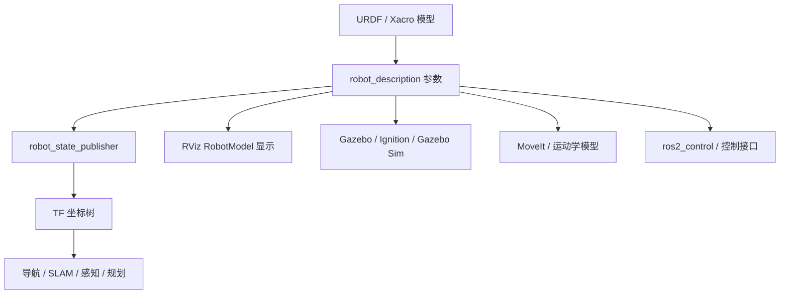

# URDF 学习笔记：机器人模型从入门到工程实践

> 适用范围：ROS 1、ROS 2、RViz、Gazebo、MoveIt、Nav2、ros2_control 相关机器人建模学习。  
> 写作目标：不只会复制示例，而是能理解 URDF 描述了什么、不能描述什么、为什么模型会在仿真中抖动、为什么 TF 会断、为什么 RViz 正常但 Gazebo 不正常，以及如何把一个机器人模型逐步做成可维护的工程资产。  
> Last researched: 2026-06-19

## 目录

1. URDF 是什么
2. URDF 在机器人系统中的位置
3. URDF、Xacro、SDF、SRDF 的区别
4. XML 基础与最小 URDF
5. link：机器人刚体建模
6. visual：显示模型
7. collision：碰撞模型
8. inertial：质量和惯性
9. joint：连杆之间的约束
10. origin、坐标系和 rpy
11. material、mesh 和资源路径
12. robot_state_publisher 与 TF
13. 移动机器人常用 frame 约定
14. 完整差速小车 URDF 示例
15. Xacro：让 URDF 可维护
16. Gazebo 与仿真扩展
17. ros2_control 和 transmission
18. 传感器建模
19. MoveIt 与 SRDF
20. 调试、检查清单与常见错误
21. 学习路线和练习项目
22. 参考资料

## 1. URDF 是什么

URDF 全称是 Unified Robot Description Format，中文通常叫“统一机器人描述格式”。它本质上是一种 XML 文件格式，用来描述机器人由哪些刚体组成，这些刚体之间通过哪些关节连接，每个刚体长什么样、怎么碰撞、质量是多少、惯性矩是多少。ROS 文档把 URDF 定义为描述机器人几何和组织结构的文件格式，它不是程序，也不是仿真器，而是机器人系统中最基础的“结构说明书”。

可以把 URDF 想成机器人的工程图纸。真实机器人有底盘、轮子、机械臂、相机、雷达、夹爪、电机、支架和外壳；URDF 则把这些实体抽象成 `link` 和 `joint`。`link` 表示一个刚体，也就是在理想情况下内部不会变形的一块部件；`joint` 表示两个刚体之间的连接关系，例如固定连接、旋转关节、滑动关节或连续旋转关节。

URDF 的核心价值不是“画一个好看的机器人”，而是让 ROS 系统知道机器人身体结构是什么。RViz 需要它显示机器人模型；`robot_state_publisher` 需要它根据关节状态发布 TF；MoveIt 需要它知道机械臂的运动学链；Gazebo 需要它生成仿真模型；控制系统需要它理解有哪些关节和执行器；传感器算法需要它知道雷达、相机、IMU 相对底盘的位置。

URDF 能描述的内容包括：

- 机器人名称。
- 刚体 link。
- link 的可视化几何 visual。
- link 的碰撞几何 collision。
- link 的质量、质心和惯性矩 inertial。
- 关节 joint。
- 关节类型、父子 link、关节原点、关节轴。
- 关节限位、速度限制、力或力矩限制。
- 颜色和材质。
- mesh 模型资源路径。
- Gazebo、ros2_control 等工具需要的部分扩展标签。

URDF 不擅长描述的内容包括：

- 完整仿真世界，例如地面、灯光、天空、障碍物、多个机器人和物理求解器参数。
- 闭链机构，例如并联机器人、四连杆闭环结构。URDF 的 link 和 joint 必须形成树结构。
- 复杂接触模型和高级物理材质。
- 任务逻辑、导航地图、行为树、控制算法。
- 机械臂语义规划组和自碰撞矩阵，这些通常由 SRDF 补充。
- 大规模可复用参数化模型，这通常由 Xacro 补充。

因此，学习 URDF 时要先建立边界感。URDF 负责回答“机器人身体结构是什么”；SDF 或 Gazebo world 负责回答“机器人在什么世界里仿真”；Xacro 负责回答“如何更方便地生成 URDF”；SRDF 负责回答“机器人规划语义是什么”；控制器配置负责回答“怎么驱动关节”；算法节点负责回答“机器人如何感知、定位、规划和执行任务”。

## 2. URDF 在机器人系统中的位置

一个机器人系统通常包含模型层、坐标层、感知层、控制层、规划层和任务层。URDF 位于模型层，但它会影响后面几乎所有层。



URDF 写错后，错误往往不会只停留在模型显示层。例如雷达安装位置错了 10 cm，RViz 中可能看起来问题不大，但 SLAM 生成的地图会出现墙体重影；轮子关节轴写反了，小车收到 `/cmd_vel` 后可能原地乱转；`base_link` 坐标方向不符合 ROS 约定，导航路径看起来正确但底盘执行方向异常；惯性矩乱填 0，Gazebo 里模型可能抖动、飞起或穿模。

从工程角度看，URDF 至少要被以下组件消费：

| 组件 | 使用 URDF 的方式 | 常见问题 |
| --- | --- | --- |
| RViz | 显示 RobotModel 和 TF | 看得见不代表物理正确 |
| robot_state_publisher | 读取 joint 状态并发布 TF | joint 名称不匹配会导致 TF 缺失 |
| joint_state_publisher | 手动或 GUI 发布关节状态 | 只适合调试，不是实际控制 |
| Gazebo | 转换成仿真实体 | collision 和 inertial 错误会导致物理异常 |
| MoveIt | 建立运动学链和规划模型 | 缺少 SRDF 或关节限制不合理会影响规划 |
| ros2_control | 识别关节和硬件接口 | joint 名称、interface 名称必须一致 |
| Nav2 / SLAM | 依赖 TF 和传感器外参 | frame_id、时间戳、外参错误会造成定位问题 |

学习 URDF 不要只停留在“能打开 RViz 看到模型”。一个模型至少要通过三层验收：第一层是 XML 能解析；第二层是 TF 结构正确；第三层是物理、控制和传感器行为符合预期。

## 3. URDF、Xacro、SDF、SRDF 的区别

初学者经常把 URDF、Xacro、SDF、SRDF 混在一起。它们都和机器人描述有关，但职责不同。

| 名称 | 主要用途 | 文件常见后缀 | 重点 |
| --- | --- | --- | --- |
| URDF | 描述机器人结构 | `.urdf` | link、joint、visual、collision、inertial |
| Xacro | 生成 URDF 的宏语言 | `.urdf.xacro`、`.xacro` | 变量、宏、include、条件 |
| SDF | 描述仿真世界和模型 | `.sdf`、`.world` | world、model、physics、sensor、plugin |
| SRDF | MoveIt 语义描述 | `.srdf` | planning group、end effector、disabled collision |

URDF 是结果文件。Xacro 是模板文件。实际工程中通常不直接维护大型纯 URDF，而是维护 Xacro，然后在启动时或构建时生成 URDF。这样可以避免重复代码。例如左右轮、多个机械臂关节、多个相同相机、惯性矩公式，都可以用 Xacro 宏生成。

SDF 更偏仿真。Gazebo 原生使用 SDF 描述仿真世界，SDF 可以描述地面、灯光、物理引擎、模型、传感器插件、碰撞接触参数等。URDF 可以被 Gazebo 转换使用，但如果仿真需求很复杂，最终往往需要 SDF 或 Gazebo 专用扩展。

SRDF 是 MoveIt 常用的语义补充。URDF 只知道机器人有哪些 link 和 joint，但不知道“机械臂规划组是哪几个关节”“哪个 link 是末端执行器”“哪些相邻 link 的自碰撞可以忽略”。这些信息通常放在 SRDF 中。

一句话总结：

- URDF 是机器人结构模型。
- Xacro 是写 URDF 的工程化模板。
- SDF 是仿真世界和仿真模型描述。
- SRDF 是运动规划语义描述。

## 4. XML 基础与最小 URDF

URDF 使用 XML 格式。XML 是一种标签结构，标签必须正确闭合，属性必须写在标签里，大小写敏感。

最小 URDF 如下：

```xml
<?xml version="1.0"?>
<robot name="simple_robot">
  <link name="base_link"/>
</robot>
```

这个模型只有一个 link，叫 `base_link`。它能被解析，但没有任何几何体，所以在 RViz 中可能看不到实体，只能看到 frame。`robot` 是根标签，`name` 是机器人名称。所有 link 和 joint 都必须放在 `robot` 标签内部。

一个稍微可见的 URDF：

```xml
<?xml version="1.0"?>
<robot name="box_robot">
  <link name="base_link">
    <visual>
      <geometry>
        <box size="0.4 0.3 0.1"/>
      </geometry>
    </visual>
  </link>
</robot>
```

这表示机器人有一个长方体底盘，尺寸为 x 方向 0.4 m，y 方向 0.3 m，z 方向 0.1 m。URDF 默认使用米、千克、秒、弧度等 SI 单位。按照 ROS REP 103，常用坐标约定是右手系，移动机器人通常 x 向前、y 向左、z 向上。

XML 常见错误包括：

- 标签没有闭合。
- 属性缺少引号。
- `link` 或 `joint` 名称重复。
- `parent` 或 `child` 写了不存在的 link。
- 文件编码不对。
- 注释中包含非法字符。
- Xacro 标签写进纯 URDF 后没有先展开。

建议每次写完模型后先运行检查工具：

```bash
check_urdf robot.urdf
urdf_to_graphiz robot.urdf
```

`check_urdf` 用于解析和基础校验，`urdf_to_graphiz` 可以生成 link-joint 树图，帮助确认父子关系是否符合预期。

## 5. link：机器人刚体建模

`link` 表示机器人中的一个刚体。它不是“连杆”这个词的狭义机械含义，而是任意一个在模型中被当作刚体处理的部件。底盘可以是 link，轮子可以是 link，雷达外壳可以是 link，相机可以是 link，机械臂每一节也可以是 link。

一个 link 内部可以包含三类信息：

```text
visual    给人和可视化工具看的外观
collision 给碰撞检测和物理引擎用的形状
inertial  给动力学仿真用的质量、质心和惯性
```

这三者可以相同，也可以不同。工程上经常故意让它们不同。例如一个真实底盘外壳可能有复杂曲面，如果 visual 使用精细 mesh，模型看起来会很真实；但 collision 如果也使用高精度 mesh，物理引擎会变慢并且接触不稳定；inertial 如果按复杂外壳精确计算也很麻烦，所以通常用等效长方体近似。

link 的基本结构如下：

```xml
<link name="base_link">
  <visual>
    <origin xyz="0 0 0" rpy="0 0 0"/>
    <geometry>
      <box size="0.4 0.3 0.1"/>
    </geometry>
  </visual>

  <collision>
    <origin xyz="0 0 0" rpy="0 0 0"/>
    <geometry>
      <box size="0.4 0.3 0.1"/>
    </geometry>
  </collision>

  <inertial>
    <origin xyz="0 0 0" rpy="0 0 0"/>
    <mass value="2.0"/>
    <inertia ixx="0.0167" ixy="0" ixz="0"
             iyy="0.0283" iyz="0"
             izz="0.0417"/>
  </inertial>
</link>
```

需要注意：link 本身有一个坐标系，`visual`、`collision`、`inertial` 里的 `origin` 都是相对于这个 link 坐标系的。很多初学者以为 visual 的 origin 是世界坐标，这是错误的。

link 命名建议：

- 使用小写字母、数字和下划线。
- 名称体现部件含义，例如 `base_link`、`left_wheel_link`、`camera_link`。
- 不要用空格。
- 不要频繁改名，因为 joint、控制器、MoveIt、传感器 frame 都会依赖这些名字。
- 移动机器人底盘主坐标系通常叫 `base_link`。

## 6. visual：显示模型

`visual` 只负责显示，不参与碰撞检测和物理计算。它影响 RViz 和 Gazebo 中“看起来”的样子，但不决定机器人是否会撞墙、是否会打滑、是否会飞走。

常见几何体：

```xml
<box size="x y z"/>
<cylinder radius="r" length="l"/>
<sphere radius="r"/>
<mesh filename="package://my_robot_description/meshes/base.dae" scale="1 1 1"/>
```

基础几何体适合学习和早期建模。mesh 适合展示真实外观。mesh 常见格式包括 STL、DAE、OBJ。RViz 和 Gazebo 对材质支持细节可能不同，DAE 通常更适合带颜色和材质的显示，STL 常用于简单几何外壳。

visual 示例：

```xml
<visual>
  <origin xyz="0 0 0.05" rpy="0 0 0"/>
  <geometry>
    <box size="0.4 0.3 0.1"/>
  </geometry>
  <material name="blue">
    <color rgba="0.1 0.2 0.8 1.0"/>
  </material>
</visual>
```

这里的长方体中心相对 link 原点向 z 方向上移了 0.05 m。如果 link 原点在底盘底部中心，而长方体高度为 0.1 m，那么 visual 中心放在 z=0.05 是合理的；如果 link 原点在几何中心，则不需要这个偏移。

visual 常见错误：

- mesh 单位不是米。例如 CAD 导出时使用毫米，导入后模型巨大。
- mesh 原点不在期望位置，导致模型偏移。
- mesh 坐标轴方向和 ROS 坐标约定不一致。
- scale 写错，例如 `scale="0.001 0.001 0.001"` 漏写。
- visual 正常但 collision 没写，导致 Gazebo 中没有碰撞。
- visual 过于复杂，影响加载速度。

建议初学阶段先用 box、cylinder、sphere 建模。等模型结构、关节、TF 和仿真稳定后，再替换 visual mesh。这样调试成本低得多。

## 7. collision：碰撞模型

`collision` 用于碰撞检测和物理接触。它决定模型在 Gazebo 中是否会与地面、墙体、障碍物、其他 link 发生碰撞。它也可能被运动规划系统用于自碰撞或环境碰撞检查。

collision 可以和 visual 一样，也可以更简单。工程上强烈建议 collision 比 visual 简单。复杂 mesh 做碰撞可能导致仿真慢、接触点不稳定、模型抖动、轮子打滑、卡在地面缝隙里等问题。

collision 示例：

```xml
<collision>
  <origin xyz="0 0 0" rpy="0 0 0"/>
  <geometry>
    <box size="0.4 0.3 0.1"/>
  </geometry>
</collision>
```

常见策略：

| 部件 | visual 推荐 | collision 推荐 |
| --- | --- | --- |
| 底盘外壳 | 精细 mesh 或 box | 一个或多个 box |
| 轮子 | cylinder 或 mesh | cylinder |
| 雷达 | mesh 或 cylinder | cylinder 或 box |
| 相机 | mesh 或 box | box |
| 机械臂连杆 | mesh | 简化 mesh、box、cylinder 组合 |
| 装饰件 | mesh | 通常不加 collision |

collision 设计的目标不是“形状完全真实”，而是“足够保守、稳定、计算快”。例如底盘外壳有圆角和凹槽，碰撞模型可以用一个略大的 box 近似。这样导航避障更保守，仿真也更稳定。

collision 常见错误：

- 忘记写 collision，模型在 Gazebo 中穿过地面。
- collision 和 visual 偏移不一致，看起来没碰到但物理上已经碰到。
- collision 和相邻 link 重叠，导致模型一启动就抖动。
- 用高精度 mesh 直接做轮子碰撞，导致轮地接触不稳定。
- 轮子 collision 方向错，圆柱轴没有和关节轴一致。
- 机器人底盘 collision 压住轮子，导致轮子无法接触地面。

排查时可以在 Gazebo 中打开 collision 显示，或者临时把 visual 和 collision 用不同颜色和尺寸区分。

## 8. inertial：质量和惯性

`inertial` 是 URDF 中最容易被忽视但对仿真最关键的部分。RViz 不需要惯性也能显示模型，但 Gazebo 这类物理仿真需要质量和惯性矩。没有合理惯性，模型可能抖动、爆炸、飞走、关节振荡、控制器难以调参。

inertial 基本结构：

```xml
<inertial>
  <origin xyz="0 0 0" rpy="0 0 0"/>
  <mass value="2.0"/>
  <inertia
    ixx="0.0167" ixy="0" ixz="0"
    iyy="0.0283" iyz="0"
    izz="0.0417"/>
</inertial>
```

含义：

- `origin`：质心相对于 link 坐标系的位置和姿态。
- `mass`：质量，单位 kg。
- `inertia`：惯性矩阵，单位 kg*m^2。
- `ixx`、`iyy`、`izz`：绕 x、y、z 轴的转动惯量。
- `ixy`、`ixz`、`iyz`：惯性积。对称且坐标轴对齐的简单几何体通常可以设为 0。

常用惯性公式：

长方体，尺寸为 `x, y, z`，质量为 `m`：

```text
Ixx = m / 12 * (y^2 + z^2)
Iyy = m / 12 * (x^2 + z^2)
Izz = m / 12 * (x^2 + y^2)
```

实心圆柱，半径为 `r`，长度为 `l`，圆柱轴沿 z，质量为 `m`：

```text
Ixx = m / 12 * (3r^2 + l^2)
Iyy = m / 12 * (3r^2 + l^2)
Izz = 1 / 2 * m * r^2
```

实心球，半径为 `r`，质量为 `m`：

```text
Ixx = Iyy = Izz = 2 / 5 * m * r^2
```

注意圆柱的惯性公式和圆柱轴方向有关。URDF 中 cylinder 默认沿 z 轴。如果你在 visual 里通过 `rpy="1.5708 0 0"` 把轮子显示转到 y 轴方向，但 inertial 没有同步处理，物理上就可能不一致。更稳妥的方式是为轮子 link 设计清晰的局部坐标系，让关节轴、圆柱轴和惯性定义保持一致。

惯性设置经验：

- 不要把质量设为 0。
- 不要把 `ixx`、`iyy`、`izz` 都设为 0。
- 不要随手填很小的惯性值。
- 不要让子部件质量比父部件大得离谱，除非真实机器人确实如此。
- 质心位置要合理。底盘质心通常靠近几何中心或略低。
- 传感器小部件可以质量较小，但不要完全没有质量。

对于只用于 RViz 显示的模型，inertial 可以暂时省略。但只要要进入 Gazebo 或动力学仿真，就应该认真处理。

## 9. joint：连杆之间的约束

`joint` 连接 parent link 和 child link。URDF 的机器人结构必须是一棵树。除了根 link 外，每个 link 应该只有一个父 joint。不能出现闭环，也不能出现一个 child 被多个 joint 连接。

joint 基本结构：

```xml
<joint name="laser_joint" type="fixed">
  <parent link="base_link"/>
  <child link="laser_link"/>
  <origin xyz="0.2 0 0.15" rpy="0 0 0"/>
</joint>
```

这表示 `laser_link` 固定在 `base_link` 前方 0.2 m、高 0.15 m 的位置。

常见 joint 类型：

| 类型 | 含义 | 常见场景 |
| --- | --- | --- |
| `fixed` | 固定连接，无自由度 | 传感器、外壳、支架 |
| `revolute` | 有上下限的旋转关节 | 机械臂关节、舵机 |
| `continuous` | 无角度上下限的连续旋转 | 轮子、旋转平台 |
| `prismatic` | 直线滑动关节 | 滑台、升降机构 |
| `floating` | 6 自由度浮动 | 很少直接用于普通 URDF |
| `planar` | 平面运动 | 很少使用 |

revolute 示例：

```xml
<joint name="shoulder_joint" type="revolute">
  <parent link="base_link"/>
  <child link="upper_arm_link"/>
  <origin xyz="0 0 0.2" rpy="0 0 0"/>
  <axis xyz="0 0 1"/>
  <limit lower="-1.57" upper="1.57" effort="20" velocity="1.0"/>
  <dynamics damping="0.1" friction="0.0"/>
</joint>
```

continuous 示例：

```xml
<joint name="left_wheel_joint" type="continuous">
  <parent link="base_link"/>
  <child link="left_wheel_link"/>
  <origin xyz="0 0.18 -0.03" rpy="0 0 0"/>
  <axis xyz="0 1 0"/>
</joint>
```

prismatic 示例：

```xml
<joint name="slider_joint" type="prismatic">
  <parent link="base_link"/>
  <child link="slider_link"/>
  <origin xyz="0 0 0.1" rpy="0 0 0"/>
  <axis xyz="1 0 0"/>
  <limit lower="0.0" upper="0.2" effort="50" velocity="0.1"/>
</joint>
```

`axis` 表示关节运动轴，通常应为单位向量。`axis` 是在 joint 坐标系下表达的，而 joint 坐标系由 `origin` 相对 parent link 定义。这一点非常关键。轴写错会导致轮子绕错误方向转、机械臂关节方向反、控制器表现异常。

`limit` 含义：

- `lower`：最小位置。revolute 用弧度，prismatic 用米。
- `upper`：最大位置。
- `effort`：最大力或力矩。
- `velocity`：最大速度。

`dynamics` 含义：

- `damping`：速度相关阻尼。
- `friction`：近似库仑摩擦。

不要把 damping 一开始就调得非常大，否则控制器会像拖着刹车工作。也不要完全不考虑 damping，因为真实机械结构并非理想无阻尼。

## 10. origin、坐标系和 rpy

URDF 中最难的不是标签，而是坐标。很多模型问题都来自 origin 理解错误。

需要区分三类 origin：

1. link 坐标系：link 自己的参考坐标。
2. visual/collision/inertial origin：几何体、碰撞体、质心相对 link 坐标系的位置。
3. joint origin：child link 坐标系相对 parent link 坐标系的位置。

joint origin 不是“移动 child 的 visual”，而是定义 child link 坐标系在 parent link 坐标系中的位姿。child link 内部的 visual、collision、inertial 又相对 child link 自己定义。

示例：

```xml
<link name="base_link">
  <visual>
    <origin xyz="0 0 0.05" rpy="0 0 0"/>
    <geometry>
      <box size="0.4 0.3 0.1"/>
    </geometry>
  </visual>
</link>

<link name="laser_link">
  <visual>
    <origin xyz="0 0 0" rpy="0 0 0"/>
    <geometry>
      <cylinder radius="0.04" length="0.06"/>
    </geometry>
  </visual>
</link>

<joint name="laser_joint" type="fixed">
  <parent link="base_link"/>
  <child link="laser_link"/>
  <origin xyz="0.18 0 0.14" rpy="0 0 0"/>
</joint>
```

这里：

- `base_link` 的 visual 中心在 `base_link` 上方 0.05 m。
- `laser_link` 的 visual 中心就在 `laser_link` 原点。
- `laser_joint` 决定整个 `laser_link` 坐标系放在 `base_link` 前方 0.18 m、高 0.14 m。

`rpy` 表示 roll、pitch、yaw，单位是弧度，不是角度。通常理解为绕 x、y、z 轴的旋转。常用值：

```text
90 度  = 1.5708 rad
180 度 = 3.14159 rad
-90 度 = -1.5708 rad
```

ROS 坐标约定中，常见移动机器人坐标：

- x 向前。
- y 向左。
- z 向上。
- yaw 绕 z 轴。
- pitch 绕 y 轴。
- roll 绕 x 轴。

排查坐标问题时，不要只看模型外观。应当在 RViz 中打开 TF 坐标轴显示，确认 x、y、z 方向是否符合预期。

## 11. material、mesh 和资源路径

URDF 支持给 visual 设置颜色和材质。

顶层定义材质：

```xml
<material name="blue">
  <color rgba="0.1 0.2 0.8 1.0"/>
</material>
```

link 中引用：

```xml
<visual>
  <geometry>
    <box size="0.4 0.3 0.1"/>
  </geometry>
  <material name="blue"/>
</visual>
```

`rgba` 分别表示红、绿、蓝、透明度，取值通常为 0 到 1。透明度为 1 表示不透明。

mesh 路径推荐使用 `package://`：

```xml
<mesh filename="package://my_robot_description/meshes/base.dae" scale="1 1 1"/>
```

不要在可移植模型里写绝对路径，例如 `C:\Users\...` 或 `/home/user/...`。绝对路径只在你的机器上有效，换一个工作空间就会失败。

mesh 使用注意：

- 确认单位。CAD 常用 mm，ROS 常用 m。
- 确认原点。最好在 CAD 或 Blender 中把 mesh 原点放到合理位置。
- 确认轴向。导出工具的坐标系可能和 ROS 不一致。
- visual mesh 可以精细，collision mesh 应简化。
- mesh 文件要安装到包的 share 目录，确保运行时能找到。

典型包结构：

```text
my_robot_description/
  package.xml
  CMakeLists.txt
  urdf/
    robot.urdf.xacro
  meshes/
    base.dae
    wheel.stl
  launch/
    display.launch.py
  rviz/
    display.rviz
```

## 12. robot_state_publisher 与 TF

URDF 本身只是文件。ROS 系统要使用它，通常会把它加载为参数 `robot_description`，然后由 `robot_state_publisher` 读取。`robot_state_publisher` 根据 URDF 中的 joint 结构和 `/joint_states` 中的关节位置，发布机器人各 link 之间的 TF。

典型流程：

```mermaid
flowchart LR
  A[URDF/Xacro] --> B[robot_description]
  C[/joint_states] --> D[robot_state_publisher]
  B --> D
  D --> E[/tf 和 /tf_static]
  E --> F[RViz / Nav2 / MoveIt / 感知节点]
```

固定关节通常发布到 `/tf_static`，动态关节发布到 `/tf`。如果模型中只有 fixed joint，不需要持续发布 joint state 也能有静态 TF。如果有 revolute、continuous、prismatic joint，就需要 `/joint_states` 提供关节位置。

`/joint_states` 消息里的关节名称必须和 URDF 中 joint 名称一致。只要名称不一致，`robot_state_publisher` 就无法更新对应关节的 TF。

ROS 2 中常见 launch 写法：

```python
from launch import LaunchDescription
from launch.substitutions import Command, PathJoinSubstitution
from launch_ros.actions import Node
from launch_ros.substitutions import FindPackageShare

def generate_launch_description():
    robot_description = Command([
        "xacro ",
        PathJoinSubstitution([
            FindPackageShare("my_robot_description"),
            "urdf",
            "robot.urdf.xacro",
        ])
    ])

    return LaunchDescription([
        Node(
            package="robot_state_publisher",
            executable="robot_state_publisher",
            parameters=[{"robot_description": robot_description}],
        )
    ])
```

常用检查命令：

```bash
ros2 param get /robot_state_publisher robot_description
ros2 topic echo /joint_states
ros2 run tf2_tools view_frames
ros2 run tf2_ros tf2_echo base_link laser_link
```

如果 RViz 中 RobotModel 显示不完整，优先检查：

- `robot_description` 是否加载成功。
- URDF 是否能解析。
- `/joint_states` 是否存在。
- joint 名称是否匹配。
- TF 树是否断裂。
- RViz Fixed Frame 是否选对。

## 13. 移动机器人常用 frame 约定

移动机器人常见 frame 包括 `map`、`odom`、`base_link`、`base_footprint`、`laser_link`、`camera_link`、`imu_link`。REP 105 给出了移动平台坐标 frame 的语义约定。

常见结构：

```text
map
 └── odom
      └── base_footprint
           └── base_link
                ├── laser_link
                ├── camera_link
                └── imu_link
```

各 frame 含义：

- `map`：全局地图坐标系，通常由定位系统、SLAM 或地图服务器相关节点维护。它相对世界较稳定，但机器人在其中的位置可能会因重定位而跳变。
- `odom`：里程计坐标系，短时间连续平滑，但长期会漂移。
- `base_link`：机器人主体坐标系，通常固定在底盘中心或主要结构上。
- `base_footprint`：机器人投影到地面的二维参考 frame，常用于移动机器人导航。
- `laser_link`：激光雷达坐标系。
- `camera_link`、`camera_optical_frame`：相机相关坐标系。相机光学坐标经常有特殊轴向约定，需要查对应驱动文档。
- `imu_link`：IMU 坐标系。

一般来说，URDF 描述的是 `base_link` 到传感器、轮子、外壳等机器人内部 frame 的静态或关节动态关系。`odom -> base_link` 通常由里程计或状态估计节点发布。`map -> odom` 通常由定位或 SLAM 节点发布。不要在 URDF 里随意写 `map` 和 `odom` 的固定关系，否则可能和定位系统冲突。

典型 TF 职责：

| TF | 发布者 | 是否写在 URDF |
| --- | --- | --- |
| `base_link -> laser_link` | robot_state_publisher | 是 |
| `base_link -> camera_link` | robot_state_publisher | 是 |
| `base_link -> left_wheel_link` | robot_state_publisher | 是，动态关节需要 joint state |
| `odom -> base_link` | 里程计或状态估计 | 否 |
| `map -> odom` | SLAM、AMCL、定位系统 | 否 |
| `world -> map` | 多地图或仿真系统 | 视项目而定 |

## 14. 完整差速小车 URDF 示例

下面给出一个较完整的差速小车 URDF 示例。它包含底盘、左右轮、万向支撑球和激光雷达。这个示例偏教学，真实项目中建议改成 Xacro。

```xml
<?xml version="1.0"?>
<robot name="mini_diff_bot">
  <material name="blue">
    <color rgba="0.1 0.2 0.8 1.0"/>
  </material>
  <material name="black">
    <color rgba="0.02 0.02 0.02 1.0"/>
  </material>
  <material name="gray">
    <color rgba="0.5 0.5 0.5 1.0"/>
  </material>

  <link name="base_link">
    <visual>
      <origin xyz="0 0 0.05" rpy="0 0 0"/>
      <geometry>
        <box size="0.45 0.32 0.10"/>
      </geometry>
      <material name="blue"/>
    </visual>
    <collision>
      <origin xyz="0 0 0.05" rpy="0 0 0"/>
      <geometry>
        <box size="0.45 0.32 0.10"/>
      </geometry>
    </collision>
    <inertial>
      <origin xyz="0 0 0.05" rpy="0 0 0"/>
      <mass value="4.0"/>
      <inertia ixx="0.0375" ixy="0" ixz="0"
               iyy="0.0717" iyz="0"
               izz="0.1083"/>
    </inertial>
  </link>

  <link name="left_wheel_link">
    <visual>
      <origin xyz="0 0 0" rpy="1.5708 0 0"/>
      <geometry>
        <cylinder radius="0.06" length="0.035"/>
      </geometry>
      <material name="black"/>
    </visual>
    <collision>
      <origin xyz="0 0 0" rpy="1.5708 0 0"/>
      <geometry>
        <cylinder radius="0.06" length="0.035"/>
      </geometry>
    </collision>
    <inertial>
      <mass value="0.35"/>
      <inertia ixx="0.00037" ixy="0" ixz="0"
               iyy="0.00037" iyz="0"
               izz="0.00063"/>
    </inertial>
  </link>

  <joint name="left_wheel_joint" type="continuous">
    <parent link="base_link"/>
    <child link="left_wheel_link"/>
    <origin xyz="0 0.18 0.06" rpy="0 0 0"/>
    <axis xyz="0 1 0"/>
    <dynamics damping="0.02" friction="0.0"/>
  </joint>

  <link name="right_wheel_link">
    <visual>
      <origin xyz="0 0 0" rpy="1.5708 0 0"/>
      <geometry>
        <cylinder radius="0.06" length="0.035"/>
      </geometry>
      <material name="black"/>
    </visual>
    <collision>
      <origin xyz="0 0 0" rpy="1.5708 0 0"/>
      <geometry>
        <cylinder radius="0.06" length="0.035"/>
      </geometry>
    </collision>
    <inertial>
      <mass value="0.35"/>
      <inertia ixx="0.00037" ixy="0" ixz="0"
               iyy="0.00037" iyz="0"
               izz="0.00063"/>
    </inertial>
  </link>

  <joint name="right_wheel_joint" type="continuous">
    <parent link="base_link"/>
    <child link="right_wheel_link"/>
    <origin xyz="0 -0.18 0.06" rpy="0 0 0"/>
    <axis xyz="0 1 0"/>
    <dynamics damping="0.02" friction="0.0"/>
  </joint>

  <link name="caster_link">
    <visual>
      <origin xyz="0 0 0" rpy="0 0 0"/>
      <geometry>
        <sphere radius="0.025"/>
      </geometry>
      <material name="gray"/>
    </visual>
    <collision>
      <geometry>
        <sphere radius="0.025"/>
      </geometry>
    </collision>
    <inertial>
      <mass value="0.1"/>
      <inertia ixx="0.000025" ixy="0" ixz="0"
               iyy="0.000025" iyz="0"
               izz="0.000025"/>
    </inertial>
  </link>

  <joint name="caster_joint" type="fixed">
    <parent link="base_link"/>
    <child link="caster_link"/>
    <origin xyz="-0.16 0 0.025" rpy="0 0 0"/>
  </joint>

  <link name="laser_link">
    <visual>
      <origin xyz="0 0 0.025" rpy="0 0 0"/>
      <geometry>
        <cylinder radius="0.045" length="0.05"/>
      </geometry>
      <material name="gray"/>
    </visual>
    <collision>
      <origin xyz="0 0 0.025" rpy="0 0 0"/>
      <geometry>
        <cylinder radius="0.045" length="0.05"/>
      </geometry>
    </collision>
    <inertial>
      <mass value="0.2"/>
      <inertia ixx="0.00012" ixy="0" ixz="0"
               iyy="0.00012" iyz="0"
               izz="0.00020"/>
    </inertial>
  </link>

  <joint name="laser_joint" type="fixed">
    <parent link="base_link"/>
    <child link="laser_link"/>
    <origin xyz="0.12 0 0.13" rpy="0 0 0"/>
  </joint>
</robot>
```

这个模型有几个值得注意的点：

- `base_link` 原点放在底盘底面中心附近，visual 的中心上移。
- 左右轮位置在 y 方向对称。
- 轮子圆柱默认轴沿 z，所以 visual 和 collision 通过 `rpy="1.5708 0 0"` 旋转，使圆柱轴沿 y。
- 两个轮子的 joint axis 都写为 `0 1 0`，是否需要一正一反取决于控制器约定。实际要通过发送正速度命令验证。
- 雷达通过 fixed joint 安装在底盘上方。
- 每个参与仿真的 link 都提供了 collision 和 inertial。

## 15. Xacro：让 URDF 可维护

纯 URDF 很快会变得冗长。左右轮几乎一样，只是 y 坐标符号不同；多个相机结构类似，只是安装位置不同；惯性公式重复；材质定义重复。Xacro 就是为了解决这些问题。

Xacro 是 XML Macros 的缩写，可以定义变量、宏、条件和 include。它的输出仍然是 URDF。

处理链路：

```text
robot.urdf.xacro -> xacro 展开 -> robot.urdf -> robot_description -> ROS 工具使用
```

Xacro 文件开头：

```xml
<?xml version="1.0"?>
<robot xmlns:xacro="http://www.ros.org/wiki/xacro" name="mini_bot">
  ...
</robot>
```

变量示例：

```xml
<xacro:property name="base_length" value="0.45"/>
<xacro:property name="base_width" value="0.32"/>
<xacro:property name="base_height" value="0.10"/>
<xacro:property name="wheel_radius" value="0.06"/>
<xacro:property name="wheel_width" value="0.035"/>

<box size="${base_length} ${base_width} ${base_height}"/>
```

惯性宏示例：

```xml
<xacro:macro name="box_inertial" params="mass x y z *origin">
  <inertial>
    <xacro:insert_block name="origin"/>
    <mass value="${mass}"/>
    <inertia
      ixx="${mass / 12.0 * (y*y + z*z)}"
      ixy="0" ixz="0"
      iyy="${mass / 12.0 * (x*x + z*z)}"
      iyz="0"
      izz="${mass / 12.0 * (x*x + y*y)}"/>
  </inertial>
</xacro:macro>
```

轮子宏示例：

```xml
<xacro:macro name="wheel" params="prefix y">
  <link name="${prefix}_wheel_link">
    <visual>
      <origin xyz="0 0 0" rpy="1.5708 0 0"/>
      <geometry>
        <cylinder radius="${wheel_radius}" length="${wheel_width}"/>
      </geometry>
      <material name="black"/>
    </visual>
    <collision>
      <origin xyz="0 0 0" rpy="1.5708 0 0"/>
      <geometry>
        <cylinder radius="${wheel_radius}" length="${wheel_width}"/>
      </geometry>
    </collision>
  </link>

  <joint name="${prefix}_wheel_joint" type="continuous">
    <parent link="base_link"/>
    <child link="${prefix}_wheel_link"/>
    <origin xyz="0 ${y} ${wheel_radius}" rpy="0 0 0"/>
    <axis xyz="0 1 0"/>
  </joint>
</xacro:macro>

<xacro:wheel prefix="left" y="${base_width / 2 + wheel_width / 2}"/>
<xacro:wheel prefix="right" y="${-(base_width / 2 + wheel_width / 2)}"/>
```

include 示例：

```xml
<xacro:include filename="$(find my_robot_description)/urdf/materials.xacro"/>
<xacro:include filename="$(find my_robot_description)/urdf/inertial_macros.xacro"/>
<xacro:include filename="$(find my_robot_description)/urdf/sensors.xacro"/>
```

建议拆分结构：

```text
urdf/
  robot.urdf.xacro
  materials.xacro
  inertial_macros.xacro
  base.xacro
  wheels.xacro
  sensors.xacro
  ros2_control.xacro
  gazebo.xacro
```

Xacro 风格建议：

- 尺寸、质量、颜色等参数集中在顶部或专门文件中。
- 宏只做一类事情，不要让一个宏隐式生成太多 link 和 joint。
- 生成后的 URDF 要经常检查，而不是只看 Xacro 源文件。
- 变量命名要体现物理意义，例如 `wheel_radius`，不要叫 `a`、`b`。
- include 层级不要过深。
- 不要为了“抽象”牺牲可读性。

生成和检查：

```bash
ros2 run xacro xacro robot.urdf.xacro > /tmp/robot.urdf
check_urdf /tmp/robot.urdf
urdf_to_graphiz /tmp/robot.urdf
```

如果 Xacro 报错，优先检查：

- 是否声明 `xmlns:xacro`。
- 宏参数是否缺失。
- 变量名是否拼错。
- include 路径是否正确。
- 表达式中是否把字符串当数字。
- XML 标签是否闭合。

## 16. Gazebo 与仿真扩展

URDF 能被 Gazebo 使用，但 Gazebo 仿真需要的信息通常比 URDF 多。例如摩擦系数、接触参数、传感器插件、控制插件、仿真材质等。这些信息可以通过 Gazebo 扩展标签或 SDF 提供。

Gazebo 扩展示例：

```xml
<gazebo reference="left_wheel_link">
  <mu1>1.0</mu1>
  <mu2>1.0</mu2>
  <material>Gazebo/Black</material>
</gazebo>
```

不同 Gazebo 版本和 ROS 版本的插件写法可能不同。Gazebo Classic、Ignition Gazebo、Gazebo Sim 的命名和接口有演进，实际项目应以当前使用版本的官方文档为准。

仿真稳定性检查：

- 每个动态 link 是否有合理 mass。
- 每个动态 link 是否有合理 inertia。
- collision 是否简单。
- collision 是否重叠。
- 轮子是否真正接触地面。
- 轮子与地面摩擦是否足够。
- 控制器输出是否过大。
- 仿真步长和控制频率是否合理。
- 模型初始位置是否插入地面。

现象和可能原因：

| 现象 | 可能原因 |
| --- | --- |
| 模型掉穿地面 | collision 缺失、地面 collision 问题、初始速度过大 |
| 模型飞走 | 惯性矩不合理、collision 重叠、关节约束冲突 |
| 模型持续抖动 | 接触参数不稳、质量比例极端、关节阻尼缺失 |
| 小车不动 | 轮子没接触地面、摩擦太小、控制器没激活 |
| 小车方向反 | joint axis 错、左右轮命令符号错、控制器参数错 |
| RViz 正常 Gazebo 异常 | visual 正常但 collision/inertial 错 |

一个重要原则：先让简单几何模型稳定，再引入真实 mesh；先让无传感器模型稳定，再加传感器；先让手动速度命令稳定，再接导航。

## 17. ros2_control 和 transmission

控制系统需要知道哪些 joint 可以被控制、每个 joint 有什么 command interface 和 state interface。ROS 1 中常见 `transmission` 标签，ROS 2 中常见 `ros2_control` 标签。不同控制栈、插件和版本写法不同，必须查对应版本文档。

一个简化的 ROS 2 控制片段可能类似：

```xml
<ros2_control name="GazeboSystem" type="system">
  <hardware>
    <plugin>gz_ros2_control/GazeboSimSystem</plugin>
  </hardware>
  <joint name="left_wheel_joint">
    <command_interface name="velocity"/>
    <state_interface name="position"/>
    <state_interface name="velocity"/>
  </joint>
  <joint name="right_wheel_joint">
    <command_interface name="velocity"/>
    <state_interface name="position"/>
    <state_interface name="velocity"/>
  </joint>
</ros2_control>
```

控制器 YAML 中 joint 名称必须和 URDF 完全一致：

```yaml
diff_drive_controller:
  ros__parameters:
    left_wheel_names: ["left_wheel_joint"]
    right_wheel_names: ["right_wheel_joint"]
    wheel_separation: 0.36
    wheel_radius: 0.06
```

常用检查命令：

```bash
ros2 control list_hardware_interfaces
ros2 control list_controllers
ros2 control list_hardware_components
ros2 topic echo /cmd_vel
ros2 topic echo /joint_states
```

排查顺序：

1. URDF 中 joint 名称是否正确。
2. ros2_control 中 joint 名称是否正确。
3. controller YAML 中 joint 名称是否正确。
4. command interface 是否匹配，例如 velocity、position、effort。
5. controller 是否 loaded。
6. controller 是否 active。
7. `/cmd_vel` 或轨迹命令是否真的发出。
8. `/joint_states` 是否更新。
9. Gazebo 中轮子是否转动。

控制器 active 不代表机器人一定会动。轮地摩擦、joint axis、轮半径、轮距、质量、碰撞、限速都会影响结果。

## 18. 传感器建模

URDF 中传感器通常表现为一个 link 加一个 fixed joint。例如激光雷达：

```xml
<link name="laser_link">
  <visual>
    <geometry>
      <cylinder radius="0.04" length="0.05"/>
    </geometry>
  </visual>
</link>

<joint name="laser_joint" type="fixed">
  <parent link="base_link"/>
  <child link="laser_link"/>
  <origin xyz="0.18 0 0.16" rpy="0 0 0"/>
</joint>
```

真正的数据发布通常由仿真插件或硬件驱动负责。URDF 只定义雷达坐标系相对机器人在哪里。传感器建模最重要的是外参，也就是传感器 frame 相对 `base_link` 的位姿。

常见传感器 frame：

- `laser_link`
- `camera_link`
- `camera_optical_frame`
- `imu_link`
- `gps_link`

激光雷达常见问题：

- `frame_id` 和 URDF 中的 frame 名称不一致。
- 雷达装反，扫描方向和预期相反。
- 雷达高度错误，扫描打到机器人自身。
- 雷达外参偏移，SLAM 地图重影。
- QoS 不匹配，Nav2 或 RViz 收不到 `/scan`。

相机常见问题：

- `camera_link` 和 `camera_optical_frame` 轴向混淆。
- 图像 topic 有数据，但 CameraInfo frame 错。
- RGB 和 depth 外参不一致。
- 仿真中图像延迟或频率低。

IMU 常见问题：

- IMU 坐标轴方向不符合驱动输出。
- 角速度符号反。
- 加速度包含或不包含重力的约定混淆。
- IMU frame 和 base_link 的静态 TF 缺失。

传感器调试不要只看 topic 是否存在，还要看：

```bash
ros2 topic info -v /scan
ros2 topic hz /scan
ros2 topic echo /scan --once
ros2 run tf2_ros tf2_echo base_link laser_link
```

## 19. MoveIt 与 SRDF

机械臂建模时，URDF 负责机械结构，MoveIt 还需要 SRDF。URDF 中定义了 link、joint、关节限制和几何；SRDF 中定义规划组、末端执行器、默认姿态、自碰撞禁用矩阵等。

典型机械臂 URDF 关注：

- 每个关节轴是否正确。
- 每个关节 limit 是否符合真实硬件。
- 连杆 collision 是否适合规划。
- 末端工具 frame 是否清晰。
- base frame 是否符合机器人安装方式。
- inertial 对规划不是最关键，但对仿真很关键。

MoveIt 常见问题：

- 规划组缺关节。
- end effector 绑定错误。
- collision mesh 太复杂，规划慢。
- 相邻 link 自碰撞没有禁用，导致规划总失败。
- joint limit 与真实控制器不一致。
- TCP frame 没建模，导致末端位姿偏移。

建议机械臂模型分层：

```text
URDF: 物理结构
SRDF: 规划语义
controllers.yaml: 控制器映射
kinematics.yaml: 逆解插件配置
joint_limits.yaml: 规划侧关节限制补充
```

如果机械臂用于真实执行，URDF、控制器、驱动、MoveIt 配置必须一致。规划成功但执行失败，常常不是规划算法问题，而是关节名、控制器接口、轨迹时间、限位或坐标 frame 不一致。

## 20. 调试、检查清单与常见错误

URDF 调试建议按层进行，不要凭直觉乱改参数。

第一层：文件解析

```bash
ros2 run xacro xacro robot.urdf.xacro > /tmp/robot.urdf
check_urdf /tmp/robot.urdf
urdf_to_graphiz /tmp/robot.urdf
```

检查：

- XML 是否合法。
- Xacro 是否展开成功。
- link 名称是否唯一。
- joint 名称是否唯一。
- parent 和 child 是否存在。
- 是否只有一个根 link。
- 是否形成树结构。

第二层：显示和 TF

```bash
ros2 launch my_robot_description display.launch.py
ros2 run tf2_tools view_frames
ros2 run tf2_ros tf2_echo base_link laser_link
```

检查：

- RViz Fixed Frame 是否正确。
- RobotModel 是否完整。
- TF 树是否断裂。
- 坐标轴方向是否符合 x 前、y 左、z 上。
- 传感器 frame 是否在正确位置。

第三层：关节状态

```bash
ros2 topic echo /joint_states
```

检查：

- joint 名称是否和 URDF 一致。
- 关节位置是否变化。
- continuous joint 是否能连续变化。
- revolute/prismatic 是否受限位约束。

第四层：仿真物理

检查：

- 模型是否稳定落地。
- 是否穿模。
- 是否抖动。
- 轮子是否接触地面。
- collision 是否显示正确。
- inertial 是否合理。

第五层：控制闭环

检查：

- 控制器是否 active。
- 命令 topic 是否有数据。
- joint state 是否反馈。
- odom 是否发布。
- cmd_vel 正方向是否对应机器人前进。
- 原地旋转方向是否正确。

常见错误速查：

| 错误现象 | 优先检查 |
| --- | --- |
| 模型不可见 | visual 是否存在，RViz Fixed Frame 是否正确 |
| 模型只有坐标轴 | link 没有 visual 或材质透明 |
| TF 断裂 | joint parent/child 错、joint_state 缺失 |
| Gazebo 中穿地 | collision 缺失或初始高度错误 |
| Gazebo 中飞走 | inertial 不合理、collision 重叠 |
| 小车前进变后退 | wheel axis 或控制器左右轮符号 |
| 原地旋转不对 | 左右轮名称、轮距、轮半径、轴方向 |
| SLAM 地图重影 | 雷达外参、odom、时间戳、frame_id |
| Nav2 不动 | lifecycle、TF、costmap、cmd_vel、控制器 |
| MoveIt 规划失败 | SRDF、自碰撞、joint limit、规划组 |

URDF 质量检查清单：

- 是否遵守 SI 单位。
- 是否遵守 ROS 坐标约定。
- `base_link` 位置是否清晰。
- link 和 joint 命名是否稳定。
- visual、collision、inertial 是否分工明确。
- collision 是否足够简单。
- 动态 link 是否有非零质量和惯性。
- revolute/prismatic 是否有 limit。
- joint axis 是否为单位向量。
- mesh 是否使用 `package://` 路径。
- 传感器 frame 是否和驱动消息 `frame_id` 一致。
- Xacro 展开后的 URDF 是否定期检查。
- Gazebo 扩展是否和当前 Gazebo 版本匹配。
- 控制器配置里的 joint 名称是否和 URDF 一致。

## 21. 学习路线和练习项目

建议按以下路线学习：

第一阶段：纯显示模型

1. 写一个只有 `base_link` 的 URDF。
2. 给 `base_link` 加 box visual。
3. 增加颜色 material。
4. 在 RViz 中显示。
5. 查看 TF 坐标轴。

目标：理解 robot、link、visual、geometry、material。

第二阶段：多 link 和 fixed joint

1. 添加 `laser_link`。
2. 用 fixed joint 连接 `base_link` 和 `laser_link`。
3. 改变 joint origin，观察位置变化。
4. 用 `tf2_echo` 查看 transform。

目标：理解 parent、child、joint origin、link origin 的区别。

第三阶段：活动关节

1. 添加左右轮 link。
2. 用 continuous joint 连接轮子。
3. 启动 joint_state_publisher_gui。
4. 手动转动轮子。

目标：理解 axis、joint type、joint state。

第四阶段：物理仿真

1. 给所有 link 添加 collision。
2. 给所有动态 link 添加 inertial。
3. 放入 Gazebo。
4. 观察稳定性。
5. 故意删除惯性或修改质量，观察异常。

目标：理解 visual 正常不代表物理正确。

第五阶段：Xacro 改造

1. 把尺寸改成 property。
2. 把惯性公式改成 macro。
3. 把左右轮改成 wheel macro。
4. 拆分 materials、wheels、sensors。
5. 展开后用 `check_urdf` 检查。

目标：理解可维护模型的写法。

第六阶段：控制闭环

1. 添加 ros2_control 片段。
2. 配置差速控制器。
3. 激活 controller。
4. 发布 `/cmd_vel`。
5. 检查 `/joint_states` 和 `/odom`。

目标：理解 URDF 和控制器之间的接口关系。

第七阶段：传感器和导航

1. 添加 2D LiDAR link。
2. 在 Gazebo 中添加雷达插件。
3. 桥接或发布 `/scan`。
4. 在 RViz 中显示 LaserScan。
5. 接入 SLAM 或 Nav2。

目标：理解模型、TF、传感器、算法之间的闭环关系。

推荐练习项目：

- 从零写一个两轮差速小车。
- 给小车添加雷达、相机、IMU。
- 把纯 URDF 改成 Xacro。
- 故意制造 10 个错误并记录现象，例如轴反、质量为 0、collision 缺失、mesh scale 错。
- 用 rosbag 记录 `/tf`、`/joint_states`、`/scan`、`/odom`、`/cmd_vel`，练习离线排查。
- 做一个简单机械臂，包含 3 个 revolute joint 和一个夹爪。
- 用 MoveIt Setup Assistant 生成 SRDF，观察 URDF 和 SRDF 的分工。

## 22. 参考资料

官方资料和标准优先级最高，社区教程适合入门和排坑，但包名、插件名、参数名可能随 ROS 2 和 Gazebo 版本变化。

- ROS 2 URDF 文档：https://docs.ros.org/en/jazzy/Tutorials/Intermediate/URDF/URDF-Main.html
- ROS 2 URDF 教程索引：https://docs.ros.org/en/rolling/p/urdf_tutorial/
- Building a visual robot model from scratch：https://docs.ros.org/en/rolling/Tutorials/Intermediate/URDF/Building-a-Visual-Robot-Model-with-URDF-from-Scratch.html
- Building a movable robot model：https://docs.ros.org/en/foxy/Tutorials/Intermediate/URDF/Building-a-Movable-Robot-Model-with-URDF.html
- Adding physical and collision properties：https://docs.ros.org/en/foxy/Tutorials/Intermediate/URDF/Adding-Physical-and-Collision-Properties-to-a-URDF-Model.html
- Using Xacro to clean up URDF：https://docs.ros.org/en/foxy/Tutorials/Intermediate/URDF/Using-Xacro-to-Clean-Up-a-URDF-File.html
- Using URDF with robot_state_publisher：https://docs.ros.org/en/foxy/Tutorials/Intermediate/URDF/Using-URDF-with-Robot-State-Publisher.html
- Using a URDF in Gazebo：https://docs.ros.org/en/humble/Tutorials/Intermediate/URDF/Using-a-URDF-in-Gazebo.html
- REP 103 标准单位和坐标约定：https://www.ros.org/reps/rep-0103.html
- REP 105 移动平台坐标 frame：https://www.ros.org/reps/rep-0105.html
- ros2_control 文档：https://control.ros.org/
- Gazebo Sim 文档：https://gazebosim.org/docs/
- SDFormat 文档：https://sdformat.org/

## 结语

URDF 是机器人学习中非常基础但也非常容易被低估的一环。很多看似是导航、SLAM、控制器或仿真器的问题，最后都会回到模型：坐标是否正确、关节轴是否正确、传感器外参是否正确、碰撞是否合理、惯性是否合理、控制器 joint 名称是否一致。

真正掌握 URDF 的标准不是“能写出一个模型文件”，而是能够解释模型中每个 link 和 joint 的物理意义，能够从现象反推可能的建模错误，能够用工具验证 TF、collision、inertial、joint state 和控制闭环。把 URDF 当作机器人系统的基础工程资产来维护，后续仿真、控制、导航和规划都会稳定很多。
