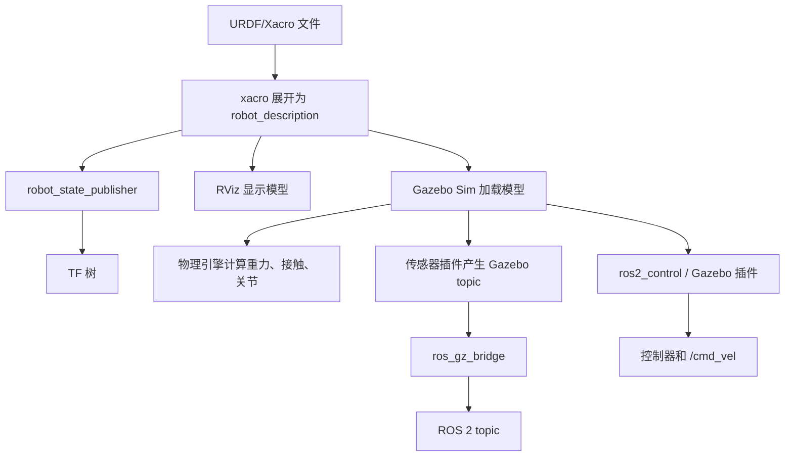

# 00 学习路线与知识地图

机器人仿真学习容易走弯路，因为它同时涉及机械结构、数学、ROS 通信、模型描述、物理引擎、控制器和传感器。新手最常见的问题是直接下载一个复杂机器人模型，然后在 Gazebo 里报错，却不知道错误来自 URDF、TF、惯性、碰撞、插件、控制器还是环境版本。

更稳的学习方式是：先理解一个最小机器人从文件到仿真的完整链路，再逐步增加复杂度。

## 本篇学习目标

学完本篇后，你应该能回答：

- 一个机器人模型从 URDF/Xacro 到 Gazebo 运行，中间经历哪些步骤；
- RViz、Gazebo Sim、robot_state_publisher、ros2_control 各自负责什么；
- 为什么学习顺序应该先模型和 TF，再物理，再控制，再传感器；
- 遇到问题时应该按什么层次排查。

## 一条完整链路

一个机器人从建模到仿真的链路通常是：

1. 设计机器人结构：有哪些刚体，哪些关节，哪些传感器。
2. 编写 URDF/Xacro：描述 link、joint、visual、collision、inertial。
3. 发布 robot_description：通常由 launch 文件调用 Xacro 生成 URDF 字符串。
4. 启动 robot_state_publisher：根据 joint state 发布 TF。
5. 在 RViz 检查模型：主要检查坐标系、外观和关节方向。
6. 放入 Gazebo Sim：通过 SDF 或 URDF spawn 到仿真世界。
7. 配置物理参数：重力、摩擦、惯性、接触、阻尼、仿真步长。
8. 配置控制接口：ros2_control、Gazebo 插件或桥接话题。
9. 配置传感器：雷达、IMU、相机、深度相机、接触传感器。
10. 验证算法：导航、SLAM、定位、路径规划、机械臂运动规划等。

对应到工具链可以这样理解：



这张图的关键点是：RViz 只帮助你看模型和 TF；Gazebo 才负责物理；ROS 2 算法通常只看 ROS topic 和 TF，不直接理解 Gazebo 内部状态。

## 建议学习阶段

### 阶段 1：只看懂坐标系

目标：

- 知道 `base_link`、`base_footprint`、`odom`、`map` 的区别。
- 知道坐标轴方向：ROS 常用右手坐标系，x 向前，y 向左，z 向上。
- 会用 `tf2_tools` 或 RViz 查看 TF 树。
- 知道 `origin xyz rpy` 的含义。

练习：

- 创建一个 `base_link` 和一个 `laser_link`。
- 用 fixed joint 把雷达放在底盘前上方。
- 在 RViz 中确认雷达坐标系位置正确。

### 阶段 2：写出最小 URDF

目标：

- 会写 `<robot>`、`<link>`、`<joint>`。
- 会给 link 添加 `<visual>`。
- 会给 joint 设置 parent、child、origin、axis。
- 会区分 fixed、continuous、revolute、prismatic。

练习：

- 写一个底盘 link。
- 加两个轮子 link。
- 用 continuous joint 连接轮子。
- 在 RViz 用 joint_state_publisher_gui 拖动关节。

### 阶段 3：补全物理模型

目标：

- 知道 visual 只负责显示。
- 知道 collision 负责碰撞检测。
- 知道 inertial 负责质量和惯性矩。
- 知道没有合理 inertial 的模型在物理仿真中可能抖动、飞走或穿模。

练习：

- 给底盘和轮子添加 collision。
- 给每个动态 link 添加 inertial。
- 尝试把质量设置得极端大或极端小，观察 Gazebo 中的异常。

### 阶段 4：改用 Xacro

目标：

- 用 property 管理尺寸和质量。
- 用 macro 复用轮子、传感器、惯性块。
- 用 include 拆分模型文件。
- 会用命令把 xacro 展开为 urdf。

练习：

- 把重复的左右轮 link/joint 改成一个 `wheel` 宏。
- 把尺寸和颜色抽到顶部 property。
- 生成 URDF 后检查 XML 是否符合预期。

### 阶段 5：进入 Gazebo Sim

目标：

- 知道 Gazebo Sim 主要使用 SDF 描述 world 和 model。
- 知道 URDF 可以被加载，但复杂仿真参数经常需要 SDF/Gazebo 扩展。
- 会启动空世界、加载模型、观察 topic。
- 知道 Gazebo Classic 和 Gazebo Sim 的区别。

练习：

- 启动 Gazebo Harmonic 空世界。
- spawn 一个小车 URDF。
- 调整地面摩擦和质量，看模型运动变化。

### 阶段 6：控制和传感器

目标：

- 知道 ros2_control 的 hardware interface、controller manager、controller。
- 知道差速底盘一般需要左右轮速度控制。
- 知道传感器数据在 Gazebo 内部话题和 ROS 2 话题之间可能需要 `ros_gz_bridge`。
- 知道仿真时间 `/clock` 和 `use_sim_time` 的意义。

练习：

- 用命令发布速度，让小车移动。
- 加一个 2D LiDAR，在 RViz 中看到 LaserScan。
- 加一个 IMU，观察角速度和线加速度。

## 新手常见误区

### 误区 1：把 RViz 当成仿真器

RViz 是可视化工具，不是物理仿真器。RViz 可以显示机器人模型、TF、点云、激光、地图和规划结果，但它不会计算真实碰撞、重力和动力学。

Gazebo Sim 才是仿真器。它会计算重力、接触、摩擦、关节运动、传感器数据和插件逻辑。

### 误区 2：只写 visual，不写 collision 和 inertial

只写 visual 的模型可以在 RViz 里显示，但放进 Gazebo 后通常不适合做物理仿真。Gazebo 需要 collision 判断接触，需要 inertial 计算动力学。

### 误区 3：把复杂 mesh 直接当 collision

视觉 mesh 可以很精细，但碰撞 mesh 应尽量简单。复杂碰撞网格会降低仿真速度，还可能导致接触计算不稳定。常见做法是视觉用 `.dae`、`.stl` 或 `.obj`，碰撞用 box、cylinder、sphere 或简化 mesh。

### 误区 4：不检查单位

ROS、URDF、Gazebo 通常使用 SI 单位：

- 长度：米 m
- 质量：千克 kg
- 时间：秒 s
- 角度：弧度 rad
- 力：牛 N
- 扭矩：N*m

如果把毫米当米，机器人会放大 1000 倍；如果把角度当弧度，关节方向和范围会完全错。

### 误区 5：混用过期教程

网络上大量教程基于 ROS 1 + Gazebo Classic。它们仍有参考价值，但命令、包名、插件名称、launch 写法、桥接方式可能已经不同。新项目建议以 ROS 2 + Gazebo Sim 为主线。

## 最小学习项目

建议你创建一个 `my_robot_description` 包，最后形成如下结构：

```text
my_robot_description/
  package.xml
  CMakeLists.txt
  urdf/
    my_robot.urdf.xacro
    materials.xacro
    inertial_macros.xacro
  meshes/
  rviz/
    display.rviz
  launch/
    display.launch.py
    gazebo.launch.py
```

做到下面这些就算打通基础：

- `colcon build` 无错误；
- `ros2 launch my_robot_description display.launch.py` 能在 RViz 看见模型；
- TF 树无断裂；
- Xacro 可以正常展开；
- 每个动态 link 有合理质量和惯性；
- Gazebo 中模型不会飞走、抖动或陷进地面；
- 轮子能被控制器驱动；
- 传感器数据能被 ROS 2 节点读取。

## 阶段验收表

| 阶段 | 最小产物 | 验收命令或现象 | 常见失败原因 |
| --- | --- | --- | --- |
| 坐标系 | `base_link`、`laser_link` | `ros2 run tf2_tools view_frames` 能看到连通 TF | parent/child 拼错、fixed frame 选错 |
| URDF | 一个可显示小车 | `check_urdf /tmp/robot.urdf` 通过 | XML 标签、mesh 路径、joint limit |
| Xacro | 参数化模型 | `ros2 run xacro xacro ...` 能展开 | property 未定义、宏参数缺失 |
| 物理 | collision + inertial | Gazebo 中不飞、不抖、不穿地 | 惯性为 0、质量极端、碰撞重叠 |
| 控制 | 轮子可响应速度 | `/cmd_vel` 后小车按预期移动 | 控制器未 active、joint 名称不匹配 |
| 传感器 | `/scan`、`/imu` 等话题 | `ros2 topic hz /scan` 有频率 | bridge 未配、frame 不连通、Gazebo 暂停 |

## 复习问题

1. 为什么一个模型在 RViz 正常显示，不代表它能在 Gazebo 稳定仿真？
2. `robot_state_publisher` 根据什么发布 TF？
3. `visual`、`collision`、`inertial` 分别服务于谁？
4. 为什么传感器数据从 Gazebo 到 ROS 2 往往需要桥接？
5. 如果小车不动，你会按什么顺序检查？
## 2026-06 深化精讲补充：机器人仿真学习路线

Last researched: 2026-06-16

### 本篇在仿真体系中的位置

学习路线的价值在于建立排查顺序：先证明模型和坐标正确，再证明物理稳定，再证明控制闭环，再接入传感器和导航。 本篇关注的重点是：从模型、TF、物理、控制、传感器到上层算法的递进路线。机器人仿真不是单纯运行一个窗口，而是一条从模型文件到 ROS 2 接口、从物理引擎到上层算法的闭环链路。任何一层没有验证，后续问题都会以更隐蔽的形式出现。


Figure: 本图为面向机器人学习笔记的通用工程闭环，综合 ROS 2、REP 103/105、Nav2、Gazebo Sim 与 ros2_control 官方资料重新整理。


### 分层理解

| 层级 | 主要对象 | 应确认的问题 | 常用工具 |
| --- | --- | --- | --- |
| 模型层 | URDF、Xacro、SDF、mesh | link/joint 是否正确，单位是否为 SI，惯性和碰撞是否合理 | `xacro`、`check_urdf`、RViz |
| TF 层 | `map`、`odom`、`base_link`、传感器 frame | 坐标树是否连通，parent/child 是否正确，时间戳是否可查询 | `view_frames`、`tf2_echo` |
| 物理层 | 质量、惯量、摩擦、接触、重力 | 是否抖动、飞走、穿模，仿真步长是否稳定 | Gazebo GUI、日志 |
| 控制层 | ros2_control、controller manager、控制器 | 控制器是否 loaded/active，joint 名称和接口是否匹配 | `ros2 control`、`ros2 topic echo /cmd_vel` |
| 传感器层 | LaserScan、IMU、Image、PointCloud2 | frame、频率、QoS、噪声和桥接是否正确 | `ros2 topic hz/info -v`、RViz |
| 算法层 | SLAM、Nav2、MoveIt 2、任务节点 | 输入是否完整，生命周期是否 active，恢复策略是否有效 | Nav2 日志、rosbag2 |

### 工程流程精讲

第一步是固定版本。ROS 2、Gazebo Sim、ros_gz、ros2_control 和 Nav2 的版本组合必须以官方文档为准。Jazzy 与 Humble 的包名、默认中间件、Gazebo 推荐版本和教程细节可能不同。跟教程学习时不要混用 ROS 1、Gazebo Classic、Ignition 旧命名和 Gazebo Sim 新命名。

第二步是建立最小模型。最小模型只需要一个 `base_link`、简单几何体、必要的 `collision` 和 `inertial`。先让它在 RViz 中显示，再让它在 Gazebo 中稳定落地。这个阶段不要急着加 Nav2、SLAM 或复杂 mesh，因为它们会掩盖模型错误。

第三步是补齐控制闭环。移动机器人通常需要把 `/cmd_vel` 变成轮子关节速度，机械臂需要把轨迹控制器和关节状态接通。ros2_control 的价值是统一仿真和实机接口，但它要求硬件接口、控制器配置、joint 名称、command/state interface 严格一致。

第四步是接入传感器。Gazebo 内部 topic 和 ROS 2 topic 不是同一个系统，Gazebo Sim 常通过 `ros_gz_bridge` 进行消息桥接。桥接前要确认消息类型受支持，桥接方向正确，frame_id 和仿真时间正确传递。

第五步才是上层算法。Nav2、SLAM、定位和任务逻辑都假设底层模型、TF、控制和传感器基本可信。若底层未验证就直接调 Nav2 参数，常见结果是参数越改越乱。

### 最小验证项目

建议把本篇内容落实到一个 `my_robot_description` + `my_robot_bringup` 工作空间中：

```text
robot_ws/src/
  my_robot_description/
    urdf/
    meshes/
    rviz/
    launch/
  my_robot_bringup/
    launch/
    config/
  my_robot_control/
    config/
  my_robot_navigation/
    maps/
    params/
```

验收标准不是“能启动 Gazebo”，而是以下每一项都能独立证明：`robot_description` 能生成，TF 树连通，模型在 RViz 中方向正确，Gazebo 中不抖动，控制器 active，`/cmd_vel` 后轮子和底盘运动方向正确，传感器话题有稳定频率，`use_sim_time` 在所有相关节点一致。

### 常见实践坑

- `visual` 正常不代表 `collision` 和 `inertial` 正常。RViz 只看显示和 TF，Gazebo 还要计算物理。
- 复杂 mesh 不适合直接做碰撞。碰撞体应尽量用 box、cylinder、sphere 或简化网格。
- 动态 link 没有合理惯性时，仿真容易抖动、飞走或在接触时爆炸。
- `base_link`、`base_footprint`、`odom`、`map` 的语义要遵循 REP 105，不要为了“看起来能跑”随意改 frame 名。
- Gazebo world 坐标和 ROS `map` 坐标不是天然同一个概念。需要明确谁发布哪条 TF。
- `ros_gz_bridge` 只桥接配置过且支持的消息类型。看到 Gazebo 有 topic 不代表 ROS 2 一定能收到。
- QoS 不匹配会导致 topic 存在但订阅不到，尤其是传感器数据和地图数据。
- 仿真时间 `/clock` 必须被所有算法节点一致使用，否则 TF 查询和 rosbag 回放会出现时间错位。
- 控制器 loaded 不等于 active，active 不等于 joint interface 名称正确。
- Nav2 失败时先查 TF、里程计、传感器和 costmap，再讨论 planner/controller 参数。

### 调试顺序

1. `ros2 doctor` 和环境变量：确认 ROS 发行版、Domain ID、RMW 和 source 顺序。
2. `ros2 pkg list` / `ros2 launch`：确认包能被找到，launch 文件能被安装。
3. `ros2 param get /robot_state_publisher robot_description`：确认模型实际传入。
4. `ros2 run tf2_tools view_frames`：确认 TF 树没有断裂和重复发布。
5. Gazebo 中暂停/单步观察模型：确认物理稳定。
6. `ros2 control list_controllers`：确认控制器状态。
7. `ros2 topic info -v`：检查关键 topic 的类型、QoS、发布者和订阅者。
8. RViz 同时显示 TF、RobotModel、LaserScan、Odometry、Map 和 Path。
9. 录制 rosbag2，离线复现问题，避免每次重新跑完整仿真。

### 从仿真迁移到实机

仿真到实机的关键不是“代码完全不变”，而是接口和假设可控。URDF 可以复用，但质量、摩擦、传感器噪声、延迟和控制饱和需要实测校准。ros2_control 能让控制器层更容易复用，但硬件接口必须处理通信超时、编码器异常、电机使能、急停和安全限速。Nav2 参数也要根据真实机器人最大速度、加速度、制动距离、定位误差和传感器盲区重新调整。

### 推荐练习

- 从零写一个只有底盘和两个轮子的 URDF/Xacro，并在 RViz 中验证 TF。
- 给模型添加 collision 和 inertial，观察缺失或错误参数对 Gazebo 稳定性的影响。
- 用 ros2_control 接入差速控制器，发布 `/cmd_vel` 验证正转、倒车和原地旋转。
- 添加 2D LiDAR，用 `ros_gz_bridge` 桥接到 ROS 2，并在 RViz 中显示 `/scan`。
- 录制 `/tf`、`/odom`、`/scan`、`/cmd_vel` 和 `/clock`，用 rosbag2 回放排查。

## References and further reading

- [Official] [ROS 2 Documentation](https://docs.ros.org/)
- [Official] [ROS 2 Jazzy Documentation](https://docs.ros.org/en/jazzy/)
- [Standard] [REP 103: Standard Units of Measure and Coordinate Conventions](https://www.ros.org/reps/rep-0103.html)
- [Standard] [REP 105: Coordinate Frames for Mobile Platforms](https://www.ros.org/reps/rep-0105.html)
- [Book / Course] [Modern Robotics](https://modernrobotics.northwestern.edu/)
- [Book] [Probabilistic Robotics](https://mitpress.mit.edu/9780262303804/probabilistic-robotics/)
- [Book] [State Estimation for Robotics](https://www.cambridge.org/core/books/state-estimation-for-robotics/00E53274A2F1E6CC1A55CA5C3D1C9718)
- [Course] [MIT Underactuated Robotics](https://underactuated.mit.edu/)
- [Official] [Nav2 Documentation](https://docs.nav2.org/)
- [Official] [Gazebo Sim Documentation](https://gazebosim.org/docs/latest/)
- [Official] [SDFormat Documentation](https://sdformat.org/)
- [Official] [ros2_control Documentation](https://control.ros.org/)
- [Community] [ROS2 Control分析讲解 - CSDN](https://blog.csdn.net/Bing_Lee/article/details/135003678)
- [Community] [在机器人仿真中使用 ros2_control - CSDN](https://blog.csdn.net/apingna/article/details/148333455)
- [Community] [ROS2 SLAM 建图导航 - 掘金](https://juejin.cn/post/7101201729122730020)
- [Community] [机器人导航仿真 - 博客园](https://www.cnblogs.com/zjh1170/p/16133766.html)
- [Official] [Use ROS 2 to interact with Gazebo](https://gazebosim.org/docs/latest/ros2_integration/)
- [Official] [Installing Gazebo with ROS](https://gazebosim.org/docs/latest/ros_installation/)
- [Official] [ros_gz_bridge package documentation](https://docs.ros.org/en/jazzy/p/ros_gz_bridge/)
- [Official] [SDFormat model kinematics](https://sdformat.org/tutorials/specification/spec_model_kinematics/)

## 2026-06 万字精讲补充：从知识点到可交付能力

Last researched: 2026-06-16

### 1. 这一主题最终要解决什么问题

00 学习路线与知识地图 的学习不应停留在名词解释。它最终要解决的是：当机器人系统出现不符合预期的运动、观测、规划或任务行为时，开发者能把现象拆成可验证的问题，并能用数据证明修复是否有效。围绕本主题，核心关注点是：围绕 ROS 2、URDF/Xacro、Gazebo Sim、SDF、ros2_control、传感器桥接和 Nav2 验证建立可复现仿真闭环。

一篇合格的机器人笔记，需要同时回答四类问题。第一，概念是什么，它和相邻概念的边界在哪里；第二，工程中它以什么文件、话题、参数、坐标系或控制器形式出现；第三，常见错误会产生什么现象；第四，怎样设计一个最小实验验证理解。只记录命令而不记录判断标准，后续换发行版、换机器人、换传感器时会很快失效。

### 2. 输入、输出和边界

学习任何机器人模块，都要先写清楚输入、输出和边界。输入可能是传感器观测、控制目标、地图、机械结构参数、机器人当前状态或任务上下文；输出可能是速度命令、关节轨迹、位姿估计、地图、路径、行为结果或安全状态。边界则说明这个模块不负责什么。边界越清晰，系统越容易测试。

以移动机器人为例，定位模块可以输出 `map -> odom` 或机器人在地图中的位姿估计，但它不应该直接决定电机电流；局部控制器可以输出 `/cmd_vel`，但它不应该随意修改全局地图；底层驱动可以执行速度命令并反馈编码器，但它不应该理解行为树任务。清晰边界能避免一个节点变成所有问题的堆积点。

在笔记中建议为每个主题补充一张“接口表”：

| 项目 | 应记录内容 |
| --- | --- |
| 输入 | topic、service、action、文件、参数、坐标系、单位、频率 |
| 输出 | 数据类型、坐标系、单位、更新条件、失败状态 |
| 依赖 | TF、时间、QoS、外参、模型文件、控制器、硬件状态 |
| 非目标 | 本模块明确不负责的事情 |
| 验收 | 可以自动化或手动复现的检查方式 |

### 3. 从最小例子开始，而不是从完整系统开始

机器人系统的复杂性来自耦合。一个完整导航系统同时依赖地图、定位、里程计、激光雷达、TF、代价地图、规划器、控制器、行为树、生命周期节点和底盘控制。如果一开始就运行完整系统，任何一个错误都会表现为“机器人不动”或“导航失败”，很难定位。更稳的方式是从最小例子开始。

最小例子不是玩具，而是工程验证的基准。对于 00 学习路线与知识地图，可以按以下顺序构造：

1. 纸面或脚本验证：用固定数值验证公式、坐标、参数或状态转移。
2. ROS 2 接口验证：把输入输出接成最小节点，检查消息类型、Header、frame_id、时间戳和 QoS。
3. 可视化验证：在 RViz 或日志中观察结果是否符合直觉。
4. 仿真验证：在 Gazebo Sim 或简单模拟器中加入物理、传感器、控制和时间因素。
5. 数据回放验证：用 rosbag2 固定输入，确保改动前后差异可比较。
6. 实机验证：加入真实噪声、延迟、饱和、外参误差和安全边界。

每一步都应有明确的通过标准。例如“能显示”不是充分标准；应该进一步确认坐标轴方向、单位、频率、时间戳、误差范围和异常情况下的行为。

### 4. 坐标系和时间是贯穿所有主题的基础约束

机器人问题经常不是算法本身错，而是坐标和时间错。ROS 生态通常遵循 REP 103 的坐标约定：移动机器人常用右手坐标系，`x` 向前、`y` 向左、`z` 向上；REP 105 给出了移动平台常见 frame 的语义，尤其是 `map`、`odom`、`base_link` 和 `earth` 等坐标系之间的职责。即使某个算法不直接讨论 TF，它的输入数据仍然隐含坐标系。

时间同样关键。传感器消息、TF、rosbag2 回放、Gazebo 仿真、状态估计和 Nav2 都依赖一致时间语义。仿真中应统一使用 `/clock` 和 `use_sim_time`；实机中要关注多计算机时钟同步；离线回放时要确认 TF 缓存和消息时间戳是否匹配。一个常见错误是只看 topic 是否存在，却不检查消息时间是否落在 TF 可查询范围内。

### 5. 参数不是魔法，要能解释每个参数影响

机器人调参容易陷入“复制别人 YAML”的误区。正确方式是把参数和物理含义对应起来。速度上限来自底盘能力和安全要求；加速度上限来自电机、摩擦和制动距离；footprint 来自真实外形和定位误差；控制周期来自硬件采样和计算资源；协方差来自传感器误差而不是随意填写；惯性参数来自几何和质量分布。

如果一个参数改动后系统表现变化很大，笔记里应记录三件事：改动前后的数值、现象变化、推测机制。这样下次遇到类似问题时，可以从机制出发而不是从记忆出发。对于版本相关参数，还应记录 ROS 2 发行版、Nav2 或 ros2_control 版本，因为参数名、默认值和插件行为可能随版本变化。

### 6. 调试要按层次，不要按直觉乱改

建议把调试顺序固定下来：

1. 环境层：确认 ROS 发行版、工作空间 source 顺序、依赖包、`ROS_DOMAIN_ID`、`RMW_IMPLEMENTATION`。
2. 构建层：确认 `colcon build` 成功，包和可执行文件能被 `ros2 pkg`、`ros2 run` 找到。
3. 接口层：确认 topic/service/action 存在，类型一致，QoS 兼容，发布订阅数量符合预期。
4. 坐标层：确认 TF 树连通，静态和动态变换没有重复发布，frame_id 拼写一致。
5. 时间层：确认仿真时间、系统时间、rosbag 回放时间和消息时间戳一致。
6. 模型层：确认 URDF/SDF 的 link、joint、collision、inertial、传感器外参和控制接口。
7. 算法层：最后再调规划器、控制器、滤波器、SLAM 或任务策略参数。

这种顺序的好处是每一层都有可观测证据。比如 Nav2 不动时，先看 lifecycle 是否 active，再看 costmap 是否有数据，再看 TF 和 `/odom`，再看 `/cmd_vel` 是否发布，最后才看底盘是否执行。若直接改 planner 参数，可能只是掩盖了 TF 或控制器问题。

### 7. 典型故障案例

案例一：RViz 中模型正常，Gazebo 中模型飞走。常见原因是动态 link 缺少合理 inertial、质量比例极端、collision 重叠、关节轴写错或物理步长不稳定。排查时应先把模型简化成 box/cylinder，再逐步恢复 mesh 和插件。

案例二：topic 存在但订阅者收不到消息。常见原因是 QoS 不兼容、命名空间或 remap 不一致、`ROS_DOMAIN_ID` 不一致、消息类型不同或节点其实在另一个工作空间版本中运行。应使用 `ros2 topic info -v` 查看发布者和订阅者详情。

案例三：导航路径看起来正确但机器人原地转圈。可能是 `base_link` 方向错误、里程计角速度符号反了、局部控制器参数不匹配、footprint 与真实尺寸差异过大，或代价地图把机器人自身传感器误识别为障碍。

案例四：SLAM 地图逐渐扭曲。可能是轮速里程计尺度错误、IMU 坐标轴方向错误、激光外参偏差、环境退化、动态物体过多、回环检测过松或时间同步问题。不能只通过“地图好不好看”判断，应结合轨迹、回环约束和重定位表现分析。

案例五：机械臂规划成功但执行失败。可能是 SRDF 规划组错误、控制器未 active、joint 名称和硬件接口不一致、轨迹时间参数不合理、末端 TCP 未建模或真实夹具与碰撞模型不一致。

### 8. 如何把本主题写进项目文档

项目文档应避免只写“使用了某某算法”。更有价值的写法是：

- 问题定义：这个模块解决什么具体问题。
- 输入输出：使用哪些 ROS 2 接口，数据单位和坐标系是什么。
- 核心假设：依赖哪些硬件、模型、时间同步、环境条件或运动约束。
- 失败模式：已知会在哪些情况下失败，系统如何检测和恢复。
- 验证方法：使用哪些 rosbag、仿真场景、实机测试或指标证明有效。
- 版本信息：ROS 2、Gazebo、Nav2、ros2_control、驱动和硬件固件版本。

这种文档结构能让后续维护者快速理解模块边界，也能让学习笔记从“知识收藏”变成“工程资产”。

### 9. 深入学习建议

如果你已经能跑通基础示例，下一步不要盲目扩大项目规模，而应提高验证质量。为每个关键模块建立一个可重复实验：固定输入、固定环境、固定参数、固定评价指标。比如定位模块可以记录一段 rosbag，反复比较轨迹平滑性、漂移和重定位能力；控制模块可以记录阶跃响应和超调；仿真模块可以记录 real-time factor、碰撞稳定性和传感器频率；任务模块可以记录失败恢复路径和超时处理。

同时，要主动阅读官方文档和标准。社区教程适合快速入门和排坑，但规范性事实应以官方文档、标准、源代码或论文为准。尤其是 ROS 2、Gazebo Sim、Nav2 和 ros2_control 这类仍在快速演进的生态，旧教程中的包名、插件名、参数名和启动方式可能已经变化。

### 10. 本篇复盘清单

- 能否用一句话说明 00 学习路线与知识地图 解决的问题。
- 能否画出输入、输出、依赖和非目标。
- 能否指出至少三个常见失败模式及其排查命令。
- 能否把本主题连接到 ROS 2 的 topic、service、action、parameter、TF 或 launch。
- 能否设计一个最小仿真或 rosbag 实验验证理解。
- 能否解释仿真结果和实机结果可能不同的原因。
- 能否在笔记末尾保留官方资料、标准资料和实践资料链接，方便未来更新。

## References and further reading

- [Official] [ROS 2 Documentation](https://docs.ros.org/)
- [Official] [ROS 2 Jazzy Documentation](https://docs.ros.org/en/jazzy/)
- [Official] [Nav2 Documentation](https://docs.nav2.org/)
- [Official] [Gazebo Sim Documentation](https://gazebosim.org/docs/latest/)
- [Official] [Gazebo ROS 2 integration](https://gazebosim.org/docs/latest/ros2_integration/)
- [Official] [SDFormat Documentation](https://sdformat.org/)
- [Official] [ros2_control Documentation](https://control.ros.org/)
- [Standard] [REP 103: Standard Units of Measure and Coordinate Conventions](https://www.ros.org/reps/rep-0103.html)
- [Standard] [REP 105: Coordinate Frames for Mobile Platforms](https://www.ros.org/reps/rep-0105.html)
- [Book / Course] [Modern Robotics](https://modernrobotics.northwestern.edu/)
- [Book] [Probabilistic Robotics](https://mitpress.mit.edu/9780262303804/probabilistic-robotics/)
- [Book] [State Estimation for Robotics](https://www.cambridge.org/core/books/state-estimation-for-robotics/00E53274A2F1E6CC1A55CA5C3D1C9718)
- [Course] [MIT Underactuated Robotics](https://underactuated.mit.edu/)
- [Source] [ros2_control_demos](https://github.com/ros-controls/ros2_control_demos)
- [Community] [ROS2 Control分析讲解 - CSDN](https://blog.csdn.net/Bing_Lee/article/details/135003678)
- [Community] [在机器人仿真中使用 ros2_control - CSDN](https://blog.csdn.net/apingna/article/details/148333455)
- [Community] [ROS2 SLAM 建图导航 - 掘金](https://juejin.cn/post/7101201729122730020)
- [Community] [机器人导航仿真 - 博客园](https://www.cnblogs.com/zjh1170/p/16133766.html)

<!-- research-notes: enhanced-v1 -->

## 研究笔记增强

> Last reviewed: 2026-06-17。此节用于把《00 学习路线与知识地图》从阅读笔记推进到可复习、可实践、可验证的研究笔记；具体版本、参数和环境仍需结合官方资料、项目约束和实测结果校准。

### 知识定位

把机械、电气、感知、定位、规划、控制、仿真和安全连成闭环，关注坐标、时间、状态和故障处理。

### 重点补充
- 明确坐标系、TF 树、时间戳、传感器外参和控制频率。
- 区分仿真模型、真实硬件、驱动接口和上层算法的误差来源。
- 用 rosbag、日志、rviz、仿真和实测数据复盘问题。
- 明确适用场景、限制条件、替代方案和迁移成本。

### 实践清单
- 为本章整理一张概念关系图、流程图或最小系统图。
- 写一个最小可运行示例，并保留运行命令、输入、输出和环境版本。
- 列出常见错误、排查命令、关键日志和修复动作。
- 补充安全、性能、兼容性、可维护性和上线运维注意事项。
- 用一次真实问题或练习项目复盘验证笔记是否可用。

### 常见误区
- 只摘抄定义或命令，没有记录上下文、前提条件和边界。
- 只记录成功路径，不记录失败样本、异常现象和排查过程。
- 没有版本、环境和数据样本，导致后续无法复现。
- 把教程默认值直接用于真实项目，没有结合约束重新评估。

### 复盘问题
- 学完《00 学习路线与知识地图》后，能否用自己的话说明它解决什么问题、不解决什么问题？
- 如果要在真实项目中使用，需要哪些前置条件、依赖版本、输入数据和验证手段？
- 失败时最先检查哪三类证据：日志、指标、抓包、堆栈、配置、样本还是硬件测量？
- 有没有形成可重复的最小实验、测试用例或排查命令？

### 延伸方向
- 官方文档和版本变更记录。
- 同类技术、框架或方案对比。
- 面向真实项目的最小实践。
- 故障排查清单和复盘案例库。

### 复盘记录模板

```text
主题：00 学习路线与知识地图
日期：
目标：本次要验证或掌握的具体问题
环境：系统 / 语言 / 框架 / 工具 / 设备 / 版本
步骤：最小可复现流程
现象：成功输出、失败输出、日志、指标或测量数据
分析：为什么会出现该现象，和哪些概念相关
结论：可复用的规则、命令、配置或设计取舍
风险：边界条件、性能、安全、兼容性或维护成本
下一步：继续实验、补充资料或应用到项目
```
