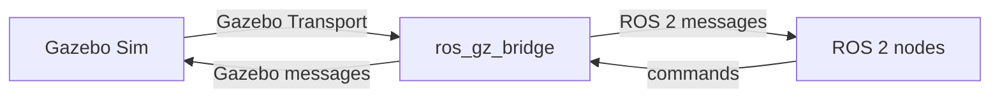

# 01 环境、工作空间和常用命令

本篇说明 ROS 2 + Gazebo Sim 学习环境该怎么理解。具体安装命令会随发行版变化，正式安装前应以官方文档为准。

## 本篇学习目标

学完本篇后，你应该能：

- 说清楚 ROS 2、Gazebo Sim、`ros_gz` 分别解决什么问题；
- 创建并构建一个 ROS 2 工作空间；
- 区分 `*_description`、`*_bringup`、`*_control` 包的职责；
- 用命令检查节点、话题、服务、参数、TF 和仿真时间；
- 判断自己看的教程是否属于 Gazebo Classic 旧路线。

## 推荐版本

截至 2026-06-08，新手建议使用：

- Ubuntu 24.04
- ROS 2 Jazzy Jalisco
- Gazebo Harmonic
- `ros-jazzy-ros-gz`

Gazebo Harmonic 是 LTS，官方页面显示支持周期为 2023-09 到 2028-09。ROS 2 Jazzy 与 Gazebo Harmonic 是官方推荐组合之一。Gazebo Classic 已到生命周期末期，不建议作为新学习路线的主线。

版本选择速查：

| 目标 | 推荐选择 | 原因 |
| --- | --- | --- |
| 新手从零学习 | Ubuntu 24.04 + ROS 2 Jazzy + Gazebo Harmonic | LTS 组合，资料稳定 |
| 跟随最新功能 | ROS 2 Rolling + 最新 Gazebo | API 变化更快，不适合第一条主线 |
| 复现旧课程 | 按课程指定版本 | 避免命令、插件、包名不一致 |
| 新项目 | Gazebo Sim，而不是 Gazebo Classic | Classic 已是旧路线 |

安装前优先看两个官方入口：

- ROS 2 Jazzy 安装文档：https://docs.ros.org/en/jazzy/Installation.html
- Gazebo Harmonic 与 ROS 安装建议：https://gazebosim.org/docs/harmonic/ros_installation/

## 基本概念

### ROS 2

ROS 2 是机器人软件框架，主要解决：

- 节点如何通信；
- 传感器数据如何发布；
- 控制命令如何订阅；
- TF 坐标变换如何维护；
- 参数、服务、动作、日志、launch 如何组织；
- 多个包如何构建和复用。

### Gazebo Sim

Gazebo Sim 是仿真器，主要解决：

- 物理世界；
- 重力和接触；
- 机器人和环境模型；
- 传感器模拟；
- 物理引擎和渲染；
- 仿真时间；
- 插件扩展。

### ros_gz

`ros_gz` 是 ROS 2 和 Gazebo Sim 之间的集成组件，常见用途：

- 从 ROS 2 launch 启动 Gazebo；
- 把模型 spawn 到 Gazebo；
- 桥接 Gazebo topic 和 ROS 2 topic；
- 桥接 `/clock`，让 ROS 节点使用仿真时间。

简化理解：



如果 Gazebo 里能看到传感器数据，但 `ros2 topic list` 看不到，优先怀疑 bridge 配置。

## ROS 2 工作空间

典型工作空间：

```text
ros2_ws/
  src/
    my_robot_description/
    my_robot_bringup/
    my_robot_control/
  build/
  install/
  log/
```

约定：

- `src/` 放源码包。
- `build/` 是构建中间产物。
- `install/` 是构建后的可执行文件、资源、配置。
- `log/` 是构建日志。

常用命令：

```bash
mkdir -p ~/ros2_ws/src
cd ~/ros2_ws
colcon build
source install/setup.bash
```

如果只构建某个包：

```bash
colcon build --packages-select my_robot_description
source install/setup.bash
```

## description 包

机器人模型通常放在 `*_description` 包中：

```text
my_robot_description/
  CMakeLists.txt
  package.xml
  urdf/
  meshes/
  materials/
  rviz/
  launch/
```

职责：

- 存放 URDF/Xacro；
- 存放 mesh；
- 存放 RViz 配置；
- 提供显示模型的 launch 文件；
- 不放复杂业务逻辑。

`description` 包的目标是“描述机器人是什么”，不是“启动整个系统”。它应该尽量可复用：真实机器人、RViz、Gazebo、MoveIt 或导航都可以引用同一套模型。

## bringup 包

`*_bringup` 包通常负责启动完整系统：

```text
my_robot_bringup/
  launch/
    sim.launch.py
    robot.launch.py
  config/
    controllers.yaml
    bridge.yaml
```

职责：

- 统一启动 robot_state_publisher；
- 统一启动 Gazebo；
- 加载控制器；
- 加载桥接配置；
- 设置 `use_sim_time`；
- 启动导航、定位、SLAM 等上层模块。

`bringup` 包的目标是“把系统拉起来”。当 launch 文件开始同时启动 Gazebo、bridge、controller、RViz、导航时，通常就应该放到 bringup 包，而不是继续塞进 description 包。

## 常用命令速查

查看节点：

```bash
ros2 node list
ros2 node info /robot_state_publisher
```

查看话题：

```bash
ros2 topic list
ros2 topic info /joint_states
ros2 topic echo /clock
ros2 topic hz /scan
```

查看服务：

```bash
ros2 service list
ros2 service type /spawn_entity
```

查看参数：

```bash
ros2 param list
ros2 param get /robot_state_publisher robot_description
```

查看 TF：

```bash
ros2 run tf2_tools view_frames
ros2 run tf2_ros tf2_echo base_link laser_link
```

检查 ROS 环境：

```bash
ros2 doctor
printenv | grep ROS
```

Xacro 展开：

```bash
ros2 run xacro xacro path/to/robot.urdf.xacro > /tmp/robot.urdf
```

URDF 检查：

```bash
check_urdf /tmp/robot.urdf
urdf_to_graphiz /tmp/robot.urdf
```

Gazebo 常用命令会随版本略有差异，Gazebo Sim 常见命令前缀是 `gz`：

```bash
gz sim
gz topic -l
gz topic -i -t /clock
gz model --list
```

如果命令不确定，优先查当前环境帮助：

```bash
gz --help
gz sim --help
ros2 run ros_gz_sim create --help
ros2 control --help
```

## 仿真时间

Gazebo 会发布仿真时间。ROS 2 节点如果要使用仿真时间，需要设置：

```yaml
use_sim_time: true
```

常见现象：

- 没设置 `use_sim_time`：某些节点用系统时间，某些节点用仿真时间，消息时间戳对不上。
- Gazebo 暂停：仿真时间停止，依赖时间推进的节点也可能不更新。
- `/clock` 没桥接：ROS 2 节点看不到仿真时间。

检查：

```bash
ros2 topic echo /clock
ros2 param get /your_node use_sim_time
```

## 新手建议

先不要一次安装很多版本。ROS、Gazebo、Ubuntu 之间有推荐组合，混装容易出现依赖冲突。优先使用官方推荐的发行版组合，除非你必须复现实验室或课程环境。

## 复习问题

1. 为什么 `description` 包里不建议放导航或业务逻辑？
2. `/clock` 不桥接会导致哪些现象？
3. `gz topic -l` 和 `ros2 topic list` 分别看到什么？
4. 你如何判断一个教程是 Gazebo Classic 还是 Gazebo Sim？

## 参考资料

- ROS 2 Jazzy 文档：[https://docs.ros.org/en/jazzy/](https://docs.ros.org/en/jazzy/)
- Gazebo Harmonic 文档：[https://gazebosim.org/docs/harmonic/](https://gazebosim.org/docs/harmonic/)
- Gazebo 与 ROS 安装建议：[https://gazebosim.org/docs/harmonic/ros_installation/](https://gazebosim.org/docs/harmonic/ros_installation/)
- ros_gz 文档入口：[https://gazebosim.org/docs/harmonic/ros2_overview/](https://gazebosim.org/docs/harmonic/ros2_overview/)

