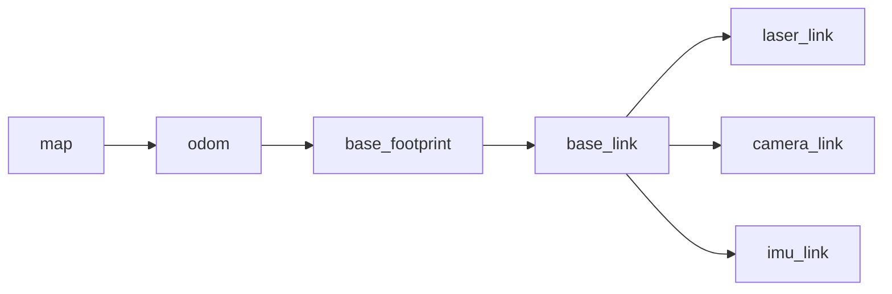

# 02 机器人学基础

机器人仿真不是单纯画模型。模型要能运动、能受力、能碰撞、能被控制，就必须理解一些机器人学基础。

## 本篇学习目标

学完本篇后，你应该能：

- 用 `base_link`、`odom`、`map` 解释移动机器人的常见 TF 结构；
- 看懂 URDF 中 `origin xyz rpy` 的含义；
- 区分正运动学、逆运动学、动力学和差速运动学；
- 根据小车运动异常反查轮子半径、轮距、关节轴和左右轮符号。

## 坐标系

坐标系是机器人系统中最重要的基础之一。所有传感器数据、机器人位姿、关节位置、地图、速度命令，最终都依赖坐标系表达。

ROS 中移动机器人常见约定：

- `base_link`：机器人主体坐标系，通常在底盘中心附近。
- `base_footprint`：机器人在地面的投影坐标系，通常 z=0，不包含 roll/pitch。
- `odom`：里程计坐标系，局部连续但可能漂移。
- `map`：地图坐标系，全局较稳定，但可能因定位修正发生跳变。
- `laser_link`：激光雷达坐标系。
- `camera_link`：相机主体坐标系。
- `imu_link`：IMU 坐标系。

常见方向：

- x：向前；
- y：向左；
- z：向上。

这是右手坐标系。判断方法：右手四指从 x 轴转向 y 轴，大拇指指向 z 轴。

移动机器人常见 TF 链路：



理解这个链路时要注意：`map -> odom` 常由定位或 SLAM 修正，`odom -> base_*` 常由里程计或底盘控制器发布，传感器 frame 通常由 URDF 中的 fixed joint 发布。

## 位姿

位姿包含位置和姿态：

- 位置：`x, y, z`
- 姿态：`roll, pitch, yaw` 或四元数

URDF 中常见写法：

```xml
<origin xyz="0.2 0 0.1" rpy="0 0 1.5708"/>
```

含义：

- 子坐标系相对父坐标系平移 x=0.2m、y=0m、z=0.1m；
- 再按 roll、pitch、yaw 描述姿态；
- 角度单位是弧度，不是度。

常用角度换算：

```text
90 deg  = 1.5708 rad
180 deg = 3.1416 rad
360 deg = 6.2832 rad
```

常见坑：

| 问题 | 现象 | 检查点 |
| --- | --- | --- |
| 把角度当弧度 | 关节范围或模型姿态完全不对 | URDF/SDF 中角度一般用 rad |
| 坐标轴方向错 | 小车前进、转弯方向异常 | x 前、y 左、z 上 |
| link 原点和 joint 原点混淆 | visual 看似对了，TF 位置不对 | joint origin 放 child link 坐标系 |
| frame 名称不一致 | RViz 报 No transform | topic 的 `frame_id` 是否在 TF 树里 |

## 齐次变换矩阵

机器人学中常用 4x4 齐次矩阵表示坐标变换：

```text
T = [ R  p ]
    [ 0  1 ]
```

其中：

- `R` 是 3x3 旋转矩阵；
- `p` 是 3x1 平移向量；
- `T` 可以把一个点从子坐标系变换到父坐标系。

如果点 `P_child` 在子坐标系下表达，那么：

```text
P_parent = T_parent_child * P_child
```

TF 树本质上就是很多坐标系之间的变换关系。

## 关节类型

URDF 常见关节：

- `fixed`：固定关节，不运动。
- `revolute`：有限角度旋转关节，需要设置上下限。
- `continuous`：无限旋转关节，常用于轮子。
- `prismatic`：直线滑动关节，需要设置上下限。
- `floating`：六自由度关节，较少用于普通 URDF。
- `planar`：平面运动关节，较少使用。

机械臂常用 revolute。轮式机器人轮子常用 continuous。传感器安装通常用 fixed。

## 关节轴

关节轴由 `<axis xyz="..."/>` 定义，表达在 joint 坐标系下。

例子：

```xml
<joint name="left_wheel_joint" type="continuous">
  <parent link="base_link"/>
  <child link="left_wheel_link"/>
  <origin xyz="0 0.18 0" rpy="0 0 0"/>
  <axis xyz="0 1 0"/>
</joint>
```

如果轮子的圆柱轴沿 y 方向，轮子绕 y 轴转，就使用 `0 1 0`。如果模型动起来后发现轮子转向不对，优先检查：

- wheel visual/collision 的圆柱默认方向；
- joint origin 的 rpy；
- joint axis 的方向；
- 左右轮命令符号。

## 正运动学

正运动学解决的问题：

给定每个关节的位置，计算末端执行器位姿。

例如机械臂：

```text
theta1, theta2, theta3 -> end_effector_pose
```

在 ROS 中，robot_state_publisher 根据 URDF 和 `/joint_states` 计算各 link 的 TF。对移动机器人而言，底盘位置通常由里程计或定位节点发布，不只由 URDF 决定。

## 逆运动学

逆运动学解决的问题：

给定末端执行器目标位姿，计算关节角。

```text
target_pose -> theta1, theta2, theta3
```

逆运动学通常比正运动学难，因为：

- 可能无解；
- 可能有多个解；
- 可能接近奇异位形；
- 需要考虑关节上下限；
- 需要避障和碰撞约束。

机械臂仿真中，MoveIt 常用于运动规划和逆运动学。

## 速度和雅可比

雅可比矩阵描述关节速度和末端速度的关系：

```text
v = J(q) * q_dot
```

其中：

- `q` 是关节位置；
- `q_dot` 是关节速度；
- `v` 是末端线速度和角速度；
- `J(q)` 是雅可比矩阵。

理解雅可比有助于学习：

- 机械臂速度控制；
- 力控制；
- 奇异点；
- 冗余机械臂；
- 笛卡尔空间控制。

## 动力学

动力学研究力、力矩和运动之间的关系。简化形式：

```text
M(q) q_ddot + C(q, q_dot) q_dot + g(q) = tau
```

含义：

- `M(q)`：质量矩阵；
- `C(q, q_dot)`：科氏力、离心力相关项；
- `g(q)`：重力项；
- `tau`：关节力矩；
- `q_ddot`：关节加速度。

Gazebo 物理引擎会近似计算这些动力学效果，所以 URDF/SDF 中的质量、惯性、碰撞、摩擦、阻尼会直接影响仿真表现。

## 移动机器人基础

差速小车有两个主动轮。常用运动学关系：

```text
v = r / 2 * (wr + wl)
w = r / L * (wr - wl)
```

其中：

- `v`：机器人前进线速度；
- `w`：机器人绕 z 轴角速度；
- `r`：轮子半径；
- `L`：左右轮间距；
- `wr`：右轮角速度；
- `wl`：左轮角速度。

从底盘速度反推轮速：

```text
wr = (v + w * L / 2) / r
wl = (v - w * L / 2) / r
```

如果仿真小车转弯方向反了，重点检查：

- 左右轮 joint 是否命名反了；
- wheel separation 是否正确；
- wheel radius 是否正确；
- 左右轮 joint axis 是否一致；
- 控制器对左右轮符号的约定。

差速底盘调试时先用小速度，不要一开始发布很大的 `/cmd_vel`。推荐先测：

```bash
ros2 topic pub /cmd_vel geometry_msgs/msg/Twist "{linear: {x: 0.1}, angular: {z: 0.0}}" --once
ros2 topic pub /cmd_vel geometry_msgs/msg/Twist "{linear: {x: 0.0}, angular: {z: 0.2}}" --once
```

第一条验证前进方向，第二条验证旋转方向。

## 仿真和真实机器人的差距

仿真不是现实。常见差距：

- 地面摩擦和真实不同；
- 轮子打滑被简化；
- 电机响应没有真实延迟；
- 传感器噪声过于理想；
- 碰撞模型比真实外形简单；
- 控制频率和真实硬件不同；
- 线缆、结构弹性、齿隙、温度等因素通常被忽略。

因此仿真适合：

- 快速验证算法；
- 检查坐标系；
- 回归测试；
- 危险场景测试；
- 生成传感器数据；
- 调试上层逻辑。

仿真不能完全替代真实测试。越接近真实机器人，越要认真建模质量、惯性、摩擦、延迟和噪声。

## 复习问题

1. `map` 和 `odom` 最大的区别是什么？
2. 为什么 `base_footprint` 常常不包含 roll/pitch？
3. `origin xyz rpy` 是移动 visual，还是定义子坐标系相对父坐标系？
4. 差速小车原地旋转方向反了，至少列出 3 个可能原因。
5. 为什么仿真里的传感器噪声不能设置得过于理想？

## 参考资料

- [ROS 2 Jazzy TF2 教程](https://docs.ros.org/en/jazzy/Tutorials/Intermediate/Tf2/Tf2-Main.html)
- [ROS REP 103 坐标系和单位约定](https://www.ros.org/reps/rep-0103.html)
- [ROS REP 105 移动平台坐标系约定](https://www.ros.org/reps/rep-0105.html)
- [Modern Robotics 在线教材](https://modernrobotics.northwestern.edu/nu-gm-book-resource/)
- [ROS 2 控制器文档](https://control.ros.org/jazzy/)

