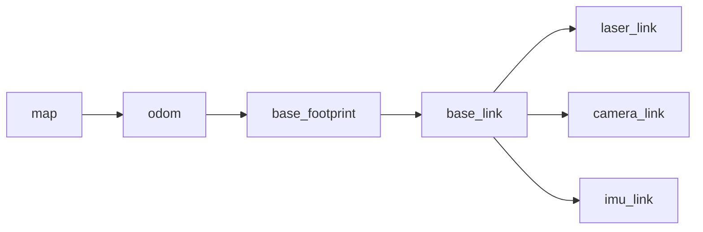

# 02 机器人学基础

机器人仿真不是单纯画模型。模型要能运动、能受力、能碰撞、能被控制，就必须理解一些机器人学基础。

## 本篇学习目标

学完本篇后，你应该能：

- 用 `base_link`、`odom`、`map` 解释移动机器人的常见 TF 结构；
- 看懂 URDF 中 `origin xyz rpy` 的含义；
- 区分正运动学、逆运动学、动力学和差速运动学；
- 根据小车运动异常反查轮子半径、轮距、关节轴和左右轮符号。

## 坐标系

坐标系是机器人系统中最重要的基础之一。所有传感器数据、机器人位姿、关节位置、地图、速度命令，最终都依赖坐标系表达。

ROS 中移动机器人常见约定：

- `base_link`：机器人主体坐标系，通常在底盘中心附近。
- `base_footprint`：机器人在地面的投影坐标系，通常 z=0，不包含 roll/pitch。
- `odom`：里程计坐标系，局部连续但可能漂移。
- `map`：地图坐标系，全局较稳定，但可能因定位修正发生跳变。
- `laser_link`：激光雷达坐标系。
- `camera_link`：相机主体坐标系。
- `imu_link`：IMU 坐标系。

常见方向：

- x：向前；
- y：向左；
- z：向上。

这是右手坐标系。判断方法：右手四指从 x 轴转向 y 轴，大拇指指向 z 轴。

移动机器人常见 TF 链路：



理解这个链路时要注意：`map -> odom` 常由定位或 SLAM 修正，`odom -> base_*` 常由里程计或底盘控制器发布，传感器 frame 通常由 URDF 中的 fixed joint 发布。

## 位姿

位姿包含位置和姿态：

- 位置：`x, y, z`
- 姿态：`roll, pitch, yaw` 或四元数

URDF 中常见写法：

```xml
<origin xyz="0.2 0 0.1" rpy="0 0 1.5708"/>
```

含义：

- 子坐标系相对父坐标系平移 x=0.2m、y=0m、z=0.1m；
- 再按 roll、pitch、yaw 描述姿态；
- 角度单位是弧度，不是度。

常用角度换算：

```text
90 deg  = 1.5708 rad
180 deg = 3.1416 rad
360 deg = 6.2832 rad
```

常见坑：

| 问题 | 现象 | 检查点 |
| --- | --- | --- |
| 把角度当弧度 | 关节范围或模型姿态完全不对 | URDF/SDF 中角度一般用 rad |
| 坐标轴方向错 | 小车前进、转弯方向异常 | x 前、y 左、z 上 |
| link 原点和 joint 原点混淆 | visual 看似对了，TF 位置不对 | joint origin 放 child link 坐标系 |
| frame 名称不一致 | RViz 报 No transform | topic 的 `frame_id` 是否在 TF 树里 |

## 齐次变换矩阵

机器人学中常用 4x4 齐次矩阵表示坐标变换：

```text
T = [ R  p ]
    [ 0  1 ]
```

其中：

- `R` 是 3x3 旋转矩阵；
- `p` 是 3x1 平移向量；
- `T` 可以把一个点从子坐标系变换到父坐标系。

如果点 `P_child` 在子坐标系下表达，那么：

```text
P_parent = T_parent_child * P_child
```

TF 树本质上就是很多坐标系之间的变换关系。

## 关节类型

URDF 常见关节：

- `fixed`：固定关节，不运动。
- `revolute`：有限角度旋转关节，需要设置上下限。
- `continuous`：无限旋转关节，常用于轮子。
- `prismatic`：直线滑动关节，需要设置上下限。
- `floating`：六自由度关节，较少用于普通 URDF。
- `planar`：平面运动关节，较少使用。

机械臂常用 revolute。轮式机器人轮子常用 continuous。传感器安装通常用 fixed。

## 关节轴

关节轴由 `<axis xyz="..."/>` 定义，表达在 joint 坐标系下。

例子：

```xml
<joint name="left_wheel_joint" type="continuous">
  <parent link="base_link"/>
  <child link="left_wheel_link"/>
  <origin xyz="0 0.18 0" rpy="0 0 0"/>
  <axis xyz="0 1 0"/>
</joint>
```

如果轮子的圆柱轴沿 y 方向，轮子绕 y 轴转，就使用 `0 1 0`。如果模型动起来后发现轮子转向不对，优先检查：

- wheel visual/collision 的圆柱默认方向；
- joint origin 的 rpy；
- joint axis 的方向；
- 左右轮命令符号。

## 正运动学

正运动学解决的问题：

给定每个关节的位置，计算末端执行器位姿。

例如机械臂：

```text
theta1, theta2, theta3 -> end_effector_pose
```

在 ROS 中，robot_state_publisher 根据 URDF 和 `/joint_states` 计算各 link 的 TF。对移动机器人而言，底盘位置通常由里程计或定位节点发布，不只由 URDF 决定。

## 逆运动学

逆运动学解决的问题：

给定末端执行器目标位姿，计算关节角。

```text
target_pose -> theta1, theta2, theta3
```

逆运动学通常比正运动学难，因为：

- 可能无解；
- 可能有多个解；
- 可能接近奇异位形；
- 需要考虑关节上下限；
- 需要避障和碰撞约束。

机械臂仿真中，MoveIt 常用于运动规划和逆运动学。

## 速度和雅可比

雅可比矩阵描述关节速度和末端速度的关系：

```text
v = J(q) * q_dot
```

其中：

- `q` 是关节位置；
- `q_dot` 是关节速度；
- `v` 是末端线速度和角速度；
- `J(q)` 是雅可比矩阵。

理解雅可比有助于学习：

- 机械臂速度控制；
- 力控制；
- 奇异点；
- 冗余机械臂；
- 笛卡尔空间控制。

## 动力学

动力学研究力、力矩和运动之间的关系。简化形式：

```text
M(q) q_ddot + C(q, q_dot) q_dot + g(q) = tau
```

含义：

- `M(q)`：质量矩阵；
- `C(q, q_dot)`：科氏力、离心力相关项；
- `g(q)`：重力项；
- `tau`：关节力矩；
- `q_ddot`：关节加速度。

Gazebo 物理引擎会近似计算这些动力学效果，所以 URDF/SDF 中的质量、惯性、碰撞、摩擦、阻尼会直接影响仿真表现。

## 移动机器人基础

差速小车有两个主动轮。常用运动学关系：

```text
v = r / 2 * (wr + wl)
w = r / L * (wr - wl)
```

其中：

- `v`：机器人前进线速度；
- `w`：机器人绕 z 轴角速度；
- `r`：轮子半径；
- `L`：左右轮间距；
- `wr`：右轮角速度；
- `wl`：左轮角速度。

从底盘速度反推轮速：

```text
wr = (v + w * L / 2) / r
wl = (v - w * L / 2) / r
```

如果仿真小车转弯方向反了，重点检查：

- 左右轮 joint 是否命名反了；
- wheel separation 是否正确；
- wheel radius 是否正确；
- 左右轮 joint axis 是否一致；
- 控制器对左右轮符号的约定。

差速底盘调试时先用小速度，不要一开始发布很大的 `/cmd_vel`。推荐先测：

```bash
ros2 topic pub /cmd_vel geometry_msgs/msg/Twist "{linear: {x: 0.1}, angular: {z: 0.0}}" --once
ros2 topic pub /cmd_vel geometry_msgs/msg/Twist "{linear: {x: 0.0}, angular: {z: 0.2}}" --once
```

第一条验证前进方向，第二条验证旋转方向。

## 仿真和真实机器人的差距

仿真不是现实。常见差距：

- 地面摩擦和真实不同；
- 轮子打滑被简化；
- 电机响应没有真实延迟；
- 传感器噪声过于理想；
- 碰撞模型比真实外形简单；
- 控制频率和真实硬件不同；
- 线缆、结构弹性、齿隙、温度等因素通常被忽略。

因此仿真适合：

- 快速验证算法；
- 检查坐标系；
- 回归测试；
- 危险场景测试；
- 生成传感器数据；
- 调试上层逻辑。

仿真不能完全替代真实测试。越接近真实机器人，越要认真建模质量、惯性、摩擦、延迟和噪声。

## 复习问题

1. `map` 和 `odom` 最大的区别是什么？
2. 为什么 `base_footprint` 常常不包含 roll/pitch？
3. `origin xyz rpy` 是移动 visual，还是定义子坐标系相对父坐标系？
4. 差速小车原地旋转方向反了，至少列出 3 个可能原因。
5. 为什么仿真里的传感器噪声不能设置得过于理想？

## 参考资料

- [ROS 2 Jazzy TF2 教程](https://docs.ros.org/en/jazzy/Tutorials/Intermediate/Tf2/Tf2-Main.html)
- [ROS REP 103 坐标系和单位约定](https://www.ros.org/reps/rep-0103.html)
- [ROS REP 105 移动平台坐标系约定](https://www.ros.org/reps/rep-0105.html)
- [Modern Robotics 在线教材](https://modernrobotics.northwestern.edu/nu-gm-book-resource/)
- [ROS 2 控制器文档](https://control.ros.org/jazzy/)
## 2026-06 深化精讲补充：仿真所需机器人学基础

Last researched: 2026-06-16

### 本篇在仿真体系中的位置

仿真中的每个模型错误最终都会表现为 TF 错、控制错或物理错，因此基础概念必须能落到 URDF/SDF 文件上。 本篇关注的重点是：坐标系、位姿、关节、正运动学、速度和传感器 frame。机器人仿真不是单纯运行一个窗口，而是一条从模型文件到 ROS 2 接口、从物理引擎到上层算法的闭环链路。任何一层没有验证，后续问题都会以更隐蔽的形式出现。


Figure: 本图为面向机器人学习笔记的通用工程闭环，综合 ROS 2、REP 103/105、Nav2、Gazebo Sim 与 ros2_control 官方资料重新整理。


### 分层理解

| 层级 | 主要对象 | 应确认的问题 | 常用工具 |
| --- | --- | --- | --- |
| 模型层 | URDF、Xacro、SDF、mesh | link/joint 是否正确，单位是否为 SI，惯性和碰撞是否合理 | `xacro`、`check_urdf`、RViz |
| TF 层 | `map`、`odom`、`base_link`、传感器 frame | 坐标树是否连通，parent/child 是否正确，时间戳是否可查询 | `view_frames`、`tf2_echo` |
| 物理层 | 质量、惯量、摩擦、接触、重力 | 是否抖动、飞走、穿模，仿真步长是否稳定 | Gazebo GUI、日志 |
| 控制层 | ros2_control、controller manager、控制器 | 控制器是否 loaded/active，joint 名称和接口是否匹配 | `ros2 control`、`ros2 topic echo /cmd_vel` |
| 传感器层 | LaserScan、IMU、Image、PointCloud2 | frame、频率、QoS、噪声和桥接是否正确 | `ros2 topic hz/info -v`、RViz |
| 算法层 | SLAM、Nav2、MoveIt 2、任务节点 | 输入是否完整，生命周期是否 active，恢复策略是否有效 | Nav2 日志、rosbag2 |

### 工程流程精讲

第一步是固定版本。ROS 2、Gazebo Sim、ros_gz、ros2_control 和 Nav2 的版本组合必须以官方文档为准。Jazzy 与 Humble 的包名、默认中间件、Gazebo 推荐版本和教程细节可能不同。跟教程学习时不要混用 ROS 1、Gazebo Classic、Ignition 旧命名和 Gazebo Sim 新命名。

第二步是建立最小模型。最小模型只需要一个 `base_link`、简单几何体、必要的 `collision` 和 `inertial`。先让它在 RViz 中显示，再让它在 Gazebo 中稳定落地。这个阶段不要急着加 Nav2、SLAM 或复杂 mesh，因为它们会掩盖模型错误。

第三步是补齐控制闭环。移动机器人通常需要把 `/cmd_vel` 变成轮子关节速度，机械臂需要把轨迹控制器和关节状态接通。ros2_control 的价值是统一仿真和实机接口，但它要求硬件接口、控制器配置、joint 名称、command/state interface 严格一致。

第四步是接入传感器。Gazebo 内部 topic 和 ROS 2 topic 不是同一个系统，Gazebo Sim 常通过 `ros_gz_bridge` 进行消息桥接。桥接前要确认消息类型受支持，桥接方向正确，frame_id 和仿真时间正确传递。

第五步才是上层算法。Nav2、SLAM、定位和任务逻辑都假设底层模型、TF、控制和传感器基本可信。若底层未验证就直接调 Nav2 参数，常见结果是参数越改越乱。

### 最小验证项目

建议把本篇内容落实到一个 `my_robot_description` + `my_robot_bringup` 工作空间中：

```text
robot_ws/src/
  my_robot_description/
    urdf/
    meshes/
    rviz/
    launch/
  my_robot_bringup/
    launch/
    config/
  my_robot_control/
    config/
  my_robot_navigation/
    maps/
    params/
```

验收标准不是“能启动 Gazebo”，而是以下每一项都能独立证明：`robot_description` 能生成，TF 树连通，模型在 RViz 中方向正确，Gazebo 中不抖动，控制器 active，`/cmd_vel` 后轮子和底盘运动方向正确，传感器话题有稳定频率，`use_sim_time` 在所有相关节点一致。

### 常见实践坑

- `visual` 正常不代表 `collision` 和 `inertial` 正常。RViz 只看显示和 TF，Gazebo 还要计算物理。
- 复杂 mesh 不适合直接做碰撞。碰撞体应尽量用 box、cylinder、sphere 或简化网格。
- 动态 link 没有合理惯性时，仿真容易抖动、飞走或在接触时爆炸。
- `base_link`、`base_footprint`、`odom`、`map` 的语义要遵循 REP 105，不要为了“看起来能跑”随意改 frame 名。
- Gazebo world 坐标和 ROS `map` 坐标不是天然同一个概念。需要明确谁发布哪条 TF。
- `ros_gz_bridge` 只桥接配置过且支持的消息类型。看到 Gazebo 有 topic 不代表 ROS 2 一定能收到。
- QoS 不匹配会导致 topic 存在但订阅不到，尤其是传感器数据和地图数据。
- 仿真时间 `/clock` 必须被所有算法节点一致使用，否则 TF 查询和 rosbag 回放会出现时间错位。
- 控制器 loaded 不等于 active，active 不等于 joint interface 名称正确。
- Nav2 失败时先查 TF、里程计、传感器和 costmap，再讨论 planner/controller 参数。

### 调试顺序

1. `ros2 doctor` 和环境变量：确认 ROS 发行版、Domain ID、RMW 和 source 顺序。
2. `ros2 pkg list` / `ros2 launch`：确认包能被找到，launch 文件能被安装。
3. `ros2 param get /robot_state_publisher robot_description`：确认模型实际传入。
4. `ros2 run tf2_tools view_frames`：确认 TF 树没有断裂和重复发布。
5. Gazebo 中暂停/单步观察模型：确认物理稳定。
6. `ros2 control list_controllers`：确认控制器状态。
7. `ros2 topic info -v`：检查关键 topic 的类型、QoS、发布者和订阅者。
8. RViz 同时显示 TF、RobotModel、LaserScan、Odometry、Map 和 Path。
9. 录制 rosbag2，离线复现问题，避免每次重新跑完整仿真。

### 从仿真迁移到实机

仿真到实机的关键不是“代码完全不变”，而是接口和假设可控。URDF 可以复用，但质量、摩擦、传感器噪声、延迟和控制饱和需要实测校准。ros2_control 能让控制器层更容易复用，但硬件接口必须处理通信超时、编码器异常、电机使能、急停和安全限速。Nav2 参数也要根据真实机器人最大速度、加速度、制动距离、定位误差和传感器盲区重新调整。

### 推荐练习

- 从零写一个只有底盘和两个轮子的 URDF/Xacro，并在 RViz 中验证 TF。
- 给模型添加 collision 和 inertial，观察缺失或错误参数对 Gazebo 稳定性的影响。
- 用 ros2_control 接入差速控制器，发布 `/cmd_vel` 验证正转、倒车和原地旋转。
- 添加 2D LiDAR，用 `ros_gz_bridge` 桥接到 ROS 2，并在 RViz 中显示 `/scan`。
- 录制 `/tf`、`/odom`、`/scan`、`/cmd_vel` 和 `/clock`，用 rosbag2 回放排查。

## References and further reading

- [Official] [ROS 2 Documentation](https://docs.ros.org/)
- [Official] [ROS 2 Jazzy Documentation](https://docs.ros.org/en/jazzy/)
- [Standard] [REP 103: Standard Units of Measure and Coordinate Conventions](https://www.ros.org/reps/rep-0103.html)
- [Standard] [REP 105: Coordinate Frames for Mobile Platforms](https://www.ros.org/reps/rep-0105.html)
- [Book / Course] [Modern Robotics](https://modernrobotics.northwestern.edu/)
- [Book] [Probabilistic Robotics](https://mitpress.mit.edu/9780262303804/probabilistic-robotics/)
- [Book] [State Estimation for Robotics](https://www.cambridge.org/core/books/state-estimation-for-robotics/00E53274A2F1E6CC1A55CA5C3D1C9718)
- [Course] [MIT Underactuated Robotics](https://underactuated.mit.edu/)
- [Official] [Nav2 Documentation](https://docs.nav2.org/)
- [Official] [Gazebo Sim Documentation](https://gazebosim.org/docs/latest/)
- [Official] [SDFormat Documentation](https://sdformat.org/)
- [Official] [ros2_control Documentation](https://control.ros.org/)
- [Community] [ROS2 Control分析讲解 - CSDN](https://blog.csdn.net/Bing_Lee/article/details/135003678)
- [Community] [在机器人仿真中使用 ros2_control - CSDN](https://blog.csdn.net/apingna/article/details/148333455)
- [Community] [ROS2 SLAM 建图导航 - 掘金](https://juejin.cn/post/7101201729122730020)
- [Community] [机器人导航仿真 - 博客园](https://www.cnblogs.com/zjh1170/p/16133766.html)
- [Official] [Use ROS 2 to interact with Gazebo](https://gazebosim.org/docs/latest/ros2_integration/)
- [Official] [Installing Gazebo with ROS](https://gazebosim.org/docs/latest/ros_installation/)
- [Official] [ros_gz_bridge package documentation](https://docs.ros.org/en/jazzy/p/ros_gz_bridge/)
- [Official] [SDFormat model kinematics](https://sdformat.org/tutorials/specification/spec_model_kinematics/)

## 2026-06 万字精讲补充：从知识点到可交付能力

Last researched: 2026-06-16

### 1. 这一主题最终要解决什么问题

02 机器人学基础 的学习不应停留在名词解释。它最终要解决的是：当机器人系统出现不符合预期的运动、观测、规划或任务行为时，开发者能把现象拆成可验证的问题，并能用数据证明修复是否有效。围绕本主题，核心关注点是：围绕 ROS 2、URDF/Xacro、Gazebo Sim、SDF、ros2_control、传感器桥接和 Nav2 验证建立可复现仿真闭环。

一篇合格的机器人笔记，需要同时回答四类问题。第一，概念是什么，它和相邻概念的边界在哪里；第二，工程中它以什么文件、话题、参数、坐标系或控制器形式出现；第三，常见错误会产生什么现象；第四，怎样设计一个最小实验验证理解。只记录命令而不记录判断标准，后续换发行版、换机器人、换传感器时会很快失效。

### 2. 输入、输出和边界

学习任何机器人模块，都要先写清楚输入、输出和边界。输入可能是传感器观测、控制目标、地图、机械结构参数、机器人当前状态或任务上下文；输出可能是速度命令、关节轨迹、位姿估计、地图、路径、行为结果或安全状态。边界则说明这个模块不负责什么。边界越清晰，系统越容易测试。

以移动机器人为例，定位模块可以输出 `map -> odom` 或机器人在地图中的位姿估计，但它不应该直接决定电机电流；局部控制器可以输出 `/cmd_vel`，但它不应该随意修改全局地图；底层驱动可以执行速度命令并反馈编码器，但它不应该理解行为树任务。清晰边界能避免一个节点变成所有问题的堆积点。

在笔记中建议为每个主题补充一张“接口表”：

| 项目 | 应记录内容 |
| --- | --- |
| 输入 | topic、service、action、文件、参数、坐标系、单位、频率 |
| 输出 | 数据类型、坐标系、单位、更新条件、失败状态 |
| 依赖 | TF、时间、QoS、外参、模型文件、控制器、硬件状态 |
| 非目标 | 本模块明确不负责的事情 |
| 验收 | 可以自动化或手动复现的检查方式 |

### 3. 从最小例子开始，而不是从完整系统开始

机器人系统的复杂性来自耦合。一个完整导航系统同时依赖地图、定位、里程计、激光雷达、TF、代价地图、规划器、控制器、行为树、生命周期节点和底盘控制。如果一开始就运行完整系统，任何一个错误都会表现为“机器人不动”或“导航失败”，很难定位。更稳的方式是从最小例子开始。

最小例子不是玩具，而是工程验证的基准。对于 02 机器人学基础，可以按以下顺序构造：

1. 纸面或脚本验证：用固定数值验证公式、坐标、参数或状态转移。
2. ROS 2 接口验证：把输入输出接成最小节点，检查消息类型、Header、frame_id、时间戳和 QoS。
3. 可视化验证：在 RViz 或日志中观察结果是否符合直觉。
4. 仿真验证：在 Gazebo Sim 或简单模拟器中加入物理、传感器、控制和时间因素。
5. 数据回放验证：用 rosbag2 固定输入，确保改动前后差异可比较。
6. 实机验证：加入真实噪声、延迟、饱和、外参误差和安全边界。

每一步都应有明确的通过标准。例如“能显示”不是充分标准；应该进一步确认坐标轴方向、单位、频率、时间戳、误差范围和异常情况下的行为。

### 4. 坐标系和时间是贯穿所有主题的基础约束

机器人问题经常不是算法本身错，而是坐标和时间错。ROS 生态通常遵循 REP 103 的坐标约定：移动机器人常用右手坐标系，`x` 向前、`y` 向左、`z` 向上；REP 105 给出了移动平台常见 frame 的语义，尤其是 `map`、`odom`、`base_link` 和 `earth` 等坐标系之间的职责。即使某个算法不直接讨论 TF，它的输入数据仍然隐含坐标系。

时间同样关键。传感器消息、TF、rosbag2 回放、Gazebo 仿真、状态估计和 Nav2 都依赖一致时间语义。仿真中应统一使用 `/clock` 和 `use_sim_time`；实机中要关注多计算机时钟同步；离线回放时要确认 TF 缓存和消息时间戳是否匹配。一个常见错误是只看 topic 是否存在，却不检查消息时间是否落在 TF 可查询范围内。

### 5. 参数不是魔法，要能解释每个参数影响

机器人调参容易陷入“复制别人 YAML”的误区。正确方式是把参数和物理含义对应起来。速度上限来自底盘能力和安全要求；加速度上限来自电机、摩擦和制动距离；footprint 来自真实外形和定位误差；控制周期来自硬件采样和计算资源；协方差来自传感器误差而不是随意填写；惯性参数来自几何和质量分布。

如果一个参数改动后系统表现变化很大，笔记里应记录三件事：改动前后的数值、现象变化、推测机制。这样下次遇到类似问题时，可以从机制出发而不是从记忆出发。对于版本相关参数，还应记录 ROS 2 发行版、Nav2 或 ros2_control 版本，因为参数名、默认值和插件行为可能随版本变化。

### 6. 调试要按层次，不要按直觉乱改

建议把调试顺序固定下来：

1. 环境层：确认 ROS 发行版、工作空间 source 顺序、依赖包、`ROS_DOMAIN_ID`、`RMW_IMPLEMENTATION`。
2. 构建层：确认 `colcon build` 成功，包和可执行文件能被 `ros2 pkg`、`ros2 run` 找到。
3. 接口层：确认 topic/service/action 存在，类型一致，QoS 兼容，发布订阅数量符合预期。
4. 坐标层：确认 TF 树连通，静态和动态变换没有重复发布，frame_id 拼写一致。
5. 时间层：确认仿真时间、系统时间、rosbag 回放时间和消息时间戳一致。
6. 模型层：确认 URDF/SDF 的 link、joint、collision、inertial、传感器外参和控制接口。
7. 算法层：最后再调规划器、控制器、滤波器、SLAM 或任务策略参数。

这种顺序的好处是每一层都有可观测证据。比如 Nav2 不动时，先看 lifecycle 是否 active，再看 costmap 是否有数据，再看 TF 和 `/odom`，再看 `/cmd_vel` 是否发布，最后才看底盘是否执行。若直接改 planner 参数，可能只是掩盖了 TF 或控制器问题。

### 7. 典型故障案例

案例一：RViz 中模型正常，Gazebo 中模型飞走。常见原因是动态 link 缺少合理 inertial、质量比例极端、collision 重叠、关节轴写错或物理步长不稳定。排查时应先把模型简化成 box/cylinder，再逐步恢复 mesh 和插件。

案例二：topic 存在但订阅者收不到消息。常见原因是 QoS 不兼容、命名空间或 remap 不一致、`ROS_DOMAIN_ID` 不一致、消息类型不同或节点其实在另一个工作空间版本中运行。应使用 `ros2 topic info -v` 查看发布者和订阅者详情。

案例三：导航路径看起来正确但机器人原地转圈。可能是 `base_link` 方向错误、里程计角速度符号反了、局部控制器参数不匹配、footprint 与真实尺寸差异过大，或代价地图把机器人自身传感器误识别为障碍。

案例四：SLAM 地图逐渐扭曲。可能是轮速里程计尺度错误、IMU 坐标轴方向错误、激光外参偏差、环境退化、动态物体过多、回环检测过松或时间同步问题。不能只通过“地图好不好看”判断，应结合轨迹、回环约束和重定位表现分析。

案例五：机械臂规划成功但执行失败。可能是 SRDF 规划组错误、控制器未 active、joint 名称和硬件接口不一致、轨迹时间参数不合理、末端 TCP 未建模或真实夹具与碰撞模型不一致。

### 8. 如何把本主题写进项目文档

项目文档应避免只写“使用了某某算法”。更有价值的写法是：

- 问题定义：这个模块解决什么具体问题。
- 输入输出：使用哪些 ROS 2 接口，数据单位和坐标系是什么。
- 核心假设：依赖哪些硬件、模型、时间同步、环境条件或运动约束。
- 失败模式：已知会在哪些情况下失败，系统如何检测和恢复。
- 验证方法：使用哪些 rosbag、仿真场景、实机测试或指标证明有效。
- 版本信息：ROS 2、Gazebo、Nav2、ros2_control、驱动和硬件固件版本。

这种文档结构能让后续维护者快速理解模块边界，也能让学习笔记从“知识收藏”变成“工程资产”。

### 9. 深入学习建议

如果你已经能跑通基础示例，下一步不要盲目扩大项目规模，而应提高验证质量。为每个关键模块建立一个可重复实验：固定输入、固定环境、固定参数、固定评价指标。比如定位模块可以记录一段 rosbag，反复比较轨迹平滑性、漂移和重定位能力；控制模块可以记录阶跃响应和超调；仿真模块可以记录 real-time factor、碰撞稳定性和传感器频率；任务模块可以记录失败恢复路径和超时处理。

同时，要主动阅读官方文档和标准。社区教程适合快速入门和排坑，但规范性事实应以官方文档、标准、源代码或论文为准。尤其是 ROS 2、Gazebo Sim、Nav2 和 ros2_control 这类仍在快速演进的生态，旧教程中的包名、插件名、参数名和启动方式可能已经变化。

### 10. 本篇复盘清单

- 能否用一句话说明 02 机器人学基础 解决的问题。
- 能否画出输入、输出、依赖和非目标。
- 能否指出至少三个常见失败模式及其排查命令。
- 能否把本主题连接到 ROS 2 的 topic、service、action、parameter、TF 或 launch。
- 能否设计一个最小仿真或 rosbag 实验验证理解。
- 能否解释仿真结果和实机结果可能不同的原因。
- 能否在笔记末尾保留官方资料、标准资料和实践资料链接，方便未来更新。

## References and further reading

- [Official] [ROS 2 Documentation](https://docs.ros.org/)
- [Official] [ROS 2 Jazzy Documentation](https://docs.ros.org/en/jazzy/)
- [Official] [Nav2 Documentation](https://docs.nav2.org/)
- [Official] [Gazebo Sim Documentation](https://gazebosim.org/docs/latest/)
- [Official] [Gazebo ROS 2 integration](https://gazebosim.org/docs/latest/ros2_integration/)
- [Official] [SDFormat Documentation](https://sdformat.org/)
- [Official] [ros2_control Documentation](https://control.ros.org/)
- [Standard] [REP 103: Standard Units of Measure and Coordinate Conventions](https://www.ros.org/reps/rep-0103.html)
- [Standard] [REP 105: Coordinate Frames for Mobile Platforms](https://www.ros.org/reps/rep-0105.html)
- [Book / Course] [Modern Robotics](https://modernrobotics.northwestern.edu/)
- [Book] [Probabilistic Robotics](https://mitpress.mit.edu/9780262303804/probabilistic-robotics/)
- [Book] [State Estimation for Robotics](https://www.cambridge.org/core/books/state-estimation-for-robotics/00E53274A2F1E6CC1A55CA5C3D1C9718)
- [Course] [MIT Underactuated Robotics](https://underactuated.mit.edu/)
- [Source] [ros2_control_demos](https://github.com/ros-controls/ros2_control_demos)
- [Community] [ROS2 Control分析讲解 - CSDN](https://blog.csdn.net/Bing_Lee/article/details/135003678)
- [Community] [在机器人仿真中使用 ros2_control - CSDN](https://blog.csdn.net/apingna/article/details/148333455)
- [Community] [ROS2 SLAM 建图导航 - 掘金](https://juejin.cn/post/7101201729122730020)
- [Community] [机器人导航仿真 - 博客园](https://www.cnblogs.com/zjh1170/p/16133766.html)

<!-- research-notes: enhanced-v1 -->

## 研究笔记增强

> Last reviewed: 2026-06-17。此节用于把《02 机器人学基础》从阅读笔记推进到可复习、可实践、可验证的研究笔记；具体版本、参数和环境仍需结合官方资料、项目约束和实测结果校准。

### 知识定位

把机械、电气、感知、定位、规划、控制、仿真和安全连成闭环，关注坐标、时间、状态和故障处理。

### 重点补充
- 明确坐标系、TF 树、时间戳、传感器外参和控制频率。
- 区分仿真模型、真实硬件、驱动接口和上层算法的误差来源。
- 用 rosbag、日志、rviz、仿真和实测数据复盘问题。
- 明确适用场景、限制条件、替代方案和迁移成本。

### 实践清单
- 为本章整理一张概念关系图、流程图或最小系统图。
- 写一个最小可运行示例，并保留运行命令、输入、输出和环境版本。
- 列出常见错误、排查命令、关键日志和修复动作。
- 补充安全、性能、兼容性、可维护性和上线运维注意事项。
- 用一次真实问题或练习项目复盘验证笔记是否可用。

### 常见误区
- 只摘抄定义或命令，没有记录上下文、前提条件和边界。
- 只记录成功路径，不记录失败样本、异常现象和排查过程。
- 没有版本、环境和数据样本，导致后续无法复现。
- 把教程默认值直接用于真实项目，没有结合约束重新评估。

### 复盘问题
- 学完《02 机器人学基础》后，能否用自己的话说明它解决什么问题、不解决什么问题？
- 如果要在真实项目中使用，需要哪些前置条件、依赖版本、输入数据和验证手段？
- 失败时最先检查哪三类证据：日志、指标、抓包、堆栈、配置、样本还是硬件测量？
- 有没有形成可重复的最小实验、测试用例或排查命令？

### 延伸方向
- 官方文档和版本变更记录。
- 同类技术、框架或方案对比。
- 面向真实项目的最小实践。
- 故障排查清单和复盘案例库。

### 复盘记录模板

```text
主题：02 机器人学基础
日期：
目标：本次要验证或掌握的具体问题
环境：系统 / 语言 / 框架 / 工具 / 设备 / 版本
步骤：最小可复现流程
现象：成功输出、失败输出、日志、指标或测量数据
分析：为什么会出现该现象，和哪些概念相关
结论：可复用的规则、命令、配置或设计取舍
风险：边界条件、性能、安全、兼容性或维护成本
下一步：继续实验、补充资料或应用到项目
```

<!-- lecture-notes:start -->

## 讲义级补充：如何真正学懂《02 机器人学基础》

> 适用位置：机器人\机器人仿真笔记\02_机器人学基础.md  
> 说明：本补充用于把原始提纲扩展成课堂讲义式学习材料。阅读时建议先看原文，再用本节建立知识框架、例子、实践和自测闭环。

### 1. 这一讲要解决什么问题

机器人系统把数学模型、传感器、控制器、软件中间件和真实物理世界连接起来。学习时要特别注意坐标系、时间戳、噪声、延迟和安全边界，因为真实设备不会像仿真环境那样宽容。

学习本讲时，可以用三个问题检查自己是否真的理解：

1. 它解决的真实问题是什么？
2. 如果没有它，系统会出现什么具体麻烦？
3. 在真实项目中，应该用什么现象或指标判断它做得好不好？

### 2. 核心知识拆解

可以把本讲拆成几块来学：

- 模型：坐标系、运动学、动力学和环境假设。
- 感知：传感器数据如何采集、滤波、融合和解释。
- 决策：定位、建图、规划、控制和任务状态如何衔接。
- 安全：限位、急停、碰撞检测、降级和人工接管。

拆解的好处是防止“整章都懂一点，但哪块都说不清”。复习时可以逐块追问：它的输入是什么、输出是什么、依赖什么、失败时有什么表现。

### 3. 通俗类比

可以把机器人类比成“有身体的软件”：普通程序输出错了可以重试，机器人输出错了可能撞墙、夹坏物体或伤人。因此每个算法都要考虑坐标、速度、加速度、传感器可信度和急停策略。

类比不是严格定义，但能帮助初学者先建立直觉。真正使用时，还要回到术语、公式、接口、数据结构、时序图或工程规范上，把“感觉理解”变成“可验证理解”。

### 4. 具体例子

学习《02 机器人学基础》时，可以选一个最小机器人场景：给定起点、目标点和传感器输入，画出坐标变换、状态估计、规划路径和控制输出。每一步都标注单位和时间戳，很多问题会立刻暴露。

讲义级学习不能只停留在“概念解释”。至少要有一个能跑、能算、能画或能检查的例子。例子越小，越容易看清关键机制；等机制清楚后，再逐步扩展到复杂项目。

### 5. 学习路径

- 先统一坐标系、单位、时间戳和消息流，这是调试机器人问题的地基。
- 再理解感知、定位、规划、控制之间的数据依赖。
- 最后在仿真和真实设备之间对照验证，特别关注噪声、延迟和安全停止。

建议每学完一小节都做一次“复述练习”：不用看笔记，用自己的话讲清楚概念、输入、输出、关键步骤和常见错误。如果讲不清，通常说明还没有真正掌握。

### 6. 课堂讲解框架

可以按下面顺序讲解或复习本主题：

1. 背景：先讲这个知识为什么出现，它试图降低什么成本、解决什么风险或提升什么能力。
2. 基本概念：给出核心名词的准确定义，说明它们之间的关系。
3. 工作流程：按时间顺序描述一次完整过程，必要时画出流程图、状态机或数据流图。
4. 关键细节：解释最容易误解的机制，例如边界条件、异常处理、性能限制、资源生命周期或安全约束。
5. 实战例子：用一个足够小但完整的例子，把概念落到命令、代码、图纸、配置、数据或操作步骤上。
6. 反例与排错：展示错误做法会导致什么现象，再说明如何定位和修复。
7. 总结迁移：最后说明它和相邻知识点的区别、联系以及后续该学什么。

### 7. 最小实践任务

为了避免“看懂了但不会用”，建议为本讲配一个最小实践：

- 选一个可以在 30 到 90 分钟内完成的小任务。
- 明确输入、预期输出和验收标准。
- 记录遇到的第一个错误、定位过程和最终修复方法。
- 完成后写 5 行复盘：我原来以为是什么，实际是什么，下次会如何更快处理。

如果本主题偏理论，实践可以是手算一个小例子、画一张流程图、推导一个简化公式或解释一段真实日志；如果偏工程，实践应该尽量落到可运行命令、可测试代码、可检查配置或可测量硬件现象上。

### 8. 常见误区

- 坐标系命名混乱，导致算法看似正确但运动方向错误。
- 只在仿真中验证，不考虑传感器噪声、摩擦、负载和延迟。
- 没有安全边界和急停策略。

遇到这些问题时，不要急着背更多资料。更有效的办法是回到一个最小例子，把输入、状态变化、输出和验证方式重新走一遍。

### 9. 自测题

1. 用一句话说明本讲主题解决的核心问题。
2. 列出本讲最重要的 3 个概念，并说明它们的关系。
3. 举一个生活类比，再指出这个类比在哪些地方不严谨。
4. 写出一个最小实践任务的验收标准。
5. 如果结果不符合预期，你会优先检查哪 3 个环节？为什么？
6. 本讲和相邻章节的知识边界是什么？哪些问题应该交给其他章节解决？

### 10. 复习口诀

先问场景，再看输入；先拆结构，再走流程；先做小例，再谈优化；先会排错，再做规模化。

<!-- lecture-notes:end -->
