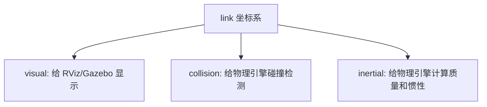

# 03 URDF 基础

<!-- lecture-notes:integrated-v2 -->

## 讲义导读：把机器人当成可验证的闭环系统

这一章讲的是 **03 URDF 基础**。阅读时不要只记命令、参数或算法名，而要把它放进机器人闭环：模型是否描述真实机器人，坐标系和时间是否一致，传感器数据是否可信，状态估计是否稳定，规划结果是否可执行，控制命令是否安全，仿真和真机差异是否被验证。机器人学习的关键不是让 demo 偶然跑通，而是能解释每个模块为什么工作、怎样失败、如何调试。

### 一句话先懂

机器人仿真不是画一个模型好看，而是让几何、惯性、碰撞、传感器、控制接口和物理环境足够接近真实系统。

### 通俗类比

可以把机器人想成一个会移动、会感知、会决策的闭环系统：传感器像眼睛和耳朵，TF 和状态估计像方向感，地图像环境记忆，规划器像路线顾问，控制器像肌肉和反射，仿真像训练场，安全机制像刹车和护栏。任何一环的单位、方向、时间或边界错了，整机表现都会变差。

类比只能帮助建立直觉。回到工程上，要把每个模块写成输入、输出、坐标系、时间戳、参数、频率、误差来源和验收指标。只有这些信息清楚，才知道问题是来自硬件、驱动、模型、通信、算法、控制还是环境。

### 本章学习主线

1. **模型和坐标**：先确认 URDF/SDF、TF、外参、单位和 REP 103/105 约定是否正确。
2. **数据和时间**：检查 Topic、QoS、Header、frame_id、timestamp、use_sim_time 和 rosbag 回放是否一致。
3. **算法和接口**：弄清输入数据是什么，输出命令或估计是什么，中间参数控制什么物理或数学含义。
4. **闭环和反馈**：观察命令是否被执行，执行结果是否反馈到 odom、TF、状态估计或任务层。
5. **失败和安全**：记录不动、乱动、漂移、震荡、穿墙、丢图、延迟、碰撞和失联时的排查顺序。
6. **仿真到真机**：把仿真中默认理想化的部分逐项换成真实约束，例如摩擦、延迟、噪声、限幅和电源。

### 概念怎么学才不容易忘

遇到机器人概念时，建议按 白话作用 -> ROS 2 接口 -> 坐标时间 -> 最小实验 -> 典型故障 -> 调试命令 六步学习。比如学习 TF，不只背 map、odom、base_link，还要知道谁发布、频率多少、时间戳是否能查到；学习控制器，不只看 cmd_vel 是否发布，还要看底盘是否执行、odom 是否反馈、限速和急停是否生效。

### 最小实践任务

建立一个两轮差速小车 URDF/Xacro，接入 ros2_control 和 Gazebo Sim，检查 TF、joint、collision、inertial、传感器数据和 cmd_vel 到 odom 的闭环。

实践时要保留失败记录：TF 断裂、QoS 不匹配、use_sim_time 忘开、frame_id 写错、惯性参数不合理、footprint 偏小、传感器外参偏差、控制频率不足。机器人系统的经验很大一部分来自这些可复现的错误。

### 读完本章应该能做到

- 用自己的话解释本章主题在机器人闭环中的位置。
- 画出最小数据流，标明 Topic、Service、Action、TF、参数和启动文件。
- 说出至少三个常见失败现象，并给出对应的检查命令或观测信号。
- 解释关键参数的物理意义，而不是只复制默认 YAML。
- 能说明 URDF、Xacro、SDF、Gazebo Sim、ros2_control、传感器插件和仿真时间之间的关系，并知道仿真到真机差异来自哪里。

> 本节是讲义化阅读入口，后续正文中的 ROS 2 接口、坐标系、算法、仿真、控制和调试内容都应围绕这条机器人闭环来理解。
URDF 全称 Unified Robot Description Format，是 ROS 中描述机器人结构的 XML 格式。它主要描述机器人由哪些 link 组成、link 之间通过哪些 joint 连接，以及每个 link 的视觉、碰撞和惯性属性。

## 本篇学习目标

学完本篇后，你应该能：

- 写出一个至少包含 `base_link`、两个轮子和一个传感器的 URDF；
- 解释 `link`、`joint`、`visual`、`collision`、`inertial` 的职责；
- 判断一个 URDF 是否适合进入 Gazebo 做物理仿真；
- 用 `check_urdf` 和 `urdf_to_graphiz` 做基础检查。

## URDF 能描述什么

URDF 适合描述：

- 机器人刚体结构；
- 连杆之间的树状连接关系；
- 关节类型、轴向、上下限；
- 视觉模型；
- 碰撞模型；
- 惯性参数；
- 传感器和控制插件相关扩展。

URDF 不擅长描述：

- 闭链机构；
- 复杂仿真世界；
- 地形、光照、物理世界参数；
- 多机器人场景；
- 很复杂的接触参数。

这些内容通常由 SDF 或 Gazebo 扩展补充。

URDF 的核心限制是：它描述的是机器人结构树，不是完整仿真世界。把“机器人是什么”放在 URDF，把“世界里有什么、物理怎么跑”放在 SDF，会更容易维护。

## 最小 URDF 结构

一个最小 URDF：

```xml
<?xml version="1.0"?>
<robot name="simple_robot">
  <link name="base_link"/>
</robot>
```

这表示一个只有一个 link 的机器人。它能被解析，但看不见，因为没有 visual。

## link

`link` 表示刚体。一个 link 可以包含：

- `visual`：显示用几何；
- `collision`：碰撞检测用几何；
- `inertial`：质量和惯性。

例子：

```xml
<link name="base_link">
  <visual>
    <origin xyz="0 0 0" rpy="0 0 0"/>
    <geometry>
      <box size="0.4 0.3 0.1"/>
    </geometry>
    <material name="blue">
      <color rgba="0.1 0.3 0.9 1.0"/>
    </material>
  </visual>
</link>
```

`box size="0.4 0.3 0.1"` 表示 x 方向 0.4m，y 方向 0.3m，z 方向 0.1m。

一个 link 的三套模型可以这样记：



`visual` 对“看起来对不对”负责，`collision` 和 `inertial` 对“物理上稳不稳”负责。

## visual

`visual` 只负责显示，不参与碰撞和动力学。

常见几何：

```xml
<box size="x y z"/>
<cylinder radius="r" length="l"/>
<sphere radius="r"/>
<mesh filename="package://my_robot_description/meshes/base.dae" scale="1 1 1"/>
```

建议：

- 初学先用 box、cylinder、sphere；
- mesh 单位要确认；
- mesh 的坐标原点要确认；
- mesh 不要直接拿来当高精度碰撞模型。

## collision

`collision` 用于碰撞检测。它可以和 visual 不同。

例子：

```xml
<collision>
  <origin xyz="0 0 0" rpy="0 0 0"/>
  <geometry>
    <box size="0.4 0.3 0.1"/>
  </geometry>
</collision>
```

建议：

- collision 尽量简单；
- 底盘用 box；
- 轮子用 cylinder；
- 球形部件用 sphere；
- 复杂外壳用多个简单几何组合近似；
- 只有必要时才用简化 mesh。

## inertial

`inertial` 用于动力学计算。

例子：

```xml
<inertial>
  <origin xyz="0 0 0" rpy="0 0 0"/>
  <mass value="2.0"/>
  <inertia
    ixx="0.02" ixy="0.0" ixz="0.0"
    iyy="0.03" iyz="0.0"
    izz="0.04"/>
</inertial>
```

质量单位是 kg。惯性矩单位是 kg*m^2。

如果一个 link 会参与物理仿真，尤其是非 fixed 关节连接的 link，应该提供合理 inertial。惯性矩不合理会导致：

- 模型抖动；
- 模型飞走；
- 关节震荡；
- 接触不稳定；
- 控制器难以调参。

## joint

`joint` 连接 parent link 和 child link。

例子：

```xml
<joint name="laser_joint" type="fixed">
  <parent link="base_link"/>
  <child link="laser_link"/>
  <origin xyz="0.15 0 0.12" rpy="0 0 0"/>
</joint>
```

这表示 `laser_link` 固定安装在 `base_link` 前方 0.15m、高 0.12m 的位置。

parent/child 心智模型：


`joint origin` 不是只移动某个几何体，而是定义 child link 坐标系相对 parent link 坐标系的位置和姿态。

## revolute joint

有限角度旋转：

```xml
<joint name="arm_joint" type="revolute">
  <parent link="base_link"/>
  <child link="arm_link"/>
  <origin xyz="0 0 0.1" rpy="0 0 0"/>
  <axis xyz="0 0 1"/>
  <limit lower="-1.57" upper="1.57" effort="10" velocity="1"/>
</joint>
```

注意：

- `lower`、`upper` 是弧度；
- `effort` 是最大力矩或力；
- `velocity` 是最大速度；
- axis 在 joint 坐标系下表达。

## continuous joint

无限旋转，常用于轮子：

```xml
<joint name="wheel_joint" type="continuous">
  <parent link="base_link"/>
  <child link="wheel_link"/>
  <origin xyz="0 0.18 0" rpy="0 0 0"/>
  <axis xyz="0 1 0"/>
</joint>
```

continuous joint 不设置上下限，但仍可设置动力学参数：

```xml
<dynamics damping="0.1" friction="0.0"/>
```

## prismatic joint

直线滑动：

```xml
<joint name="slider_joint" type="prismatic">
  <parent link="base_link"/>
  <child link="slider_link"/>
  <origin xyz="0 0 0" rpy="0 0 0"/>
  <axis xyz="1 0 0"/>
  <limit lower="0.0" upper="0.2" effort="20" velocity="0.1"/>
</joint>
```

## mimic joint

`mimic` 可以让一个关节跟随另一个关节，常用于夹爪：

```xml
<joint name="right_finger_joint" type="prismatic">
  <parent link="gripper_base"/>
  <child link="right_finger"/>
  <origin xyz="0 -0.03 0" rpy="0 0 0"/>
  <axis xyz="0 -1 0"/>
  <limit lower="0" upper="0.04" effort="20" velocity="0.2"/>
  <mimic joint="left_finger_joint" multiplier="1.0" offset="0.0"/>
</joint>
```

## material

可以在 link 中直接写 material：

```xml
<material name="gray">
  <color rgba="0.5 0.5 0.5 1.0"/>
</material>
```

也可以在文件顶部定义材料，再复用：

```xml
<material name="gray">
  <color rgba="0.5 0.5 0.5 1.0"/>
</material>

<link name="base_link">
  <visual>
    <geometry>
      <box size="0.4 0.3 0.1"/>
    </geometry>
    <material name="gray"/>
  </visual>
</link>
```

## 一个完整小车片段

```xml
<?xml version="1.0"?>
<robot name="mini_bot">
  <material name="body_blue">
    <color rgba="0.1 0.2 0.8 1"/>
  </material>

  <link name="base_link">
    <visual>
      <geometry>
        <box size="0.4 0.3 0.1"/>
      </geometry>
      <material name="body_blue"/>
    </visual>
    <collision>
      <geometry>
        <box size="0.4 0.3 0.1"/>
      </geometry>
    </collision>
    <inertial>
      <mass value="2.0"/>
      <inertia ixx="0.0167" ixy="0" ixz="0" iyy="0.0283" iyz="0" izz="0.0417"/>
    </inertial>
  </link>

  <link name="left_wheel_link">
    <visual>
      <origin rpy="1.5708 0 0"/>
      <geometry>
        <cylinder radius="0.05" length="0.03"/>
      </geometry>
    </visual>
    <collision>
      <origin rpy="1.5708 0 0"/>
      <geometry>
        <cylinder radius="0.05" length="0.03"/>
      </geometry>
    </collision>
    <inertial>
      <mass value="0.2"/>
      <inertia ixx="0.000145" ixy="0" ixz="0" iyy="0.000145" iyz="0" izz="0.00025"/>
    </inertial>
  </link>

  <joint name="left_wheel_joint" type="continuous">
    <parent link="base_link"/>
    <child link="left_wheel_link"/>
    <origin xyz="0 0.165 -0.025"/>
    <axis xyz="0 1 0"/>
  </joint>
</robot>
```

## URDF 检查清单

写完 URDF 后逐项检查：

- XML 是否闭合；
- link 名称是否唯一；
- joint 名称是否唯一；
- parent 和 child 是否拼写正确；
- 是否形成树结构；
- 是否只有一个根 link；
- revolute/prismatic 是否有 limit；
- axis 是否单位向量；
- origin 的单位是否是米和弧度；
- mesh 路径是否使用 `package://`；
- 每个参与物理仿真的 link 是否有 inertial；
- visual 和 collision 是否相对 link 原点放置正确。

## 最小验证流程

```bash
ros2 run xacro xacro robot.urdf.xacro > /tmp/robot.urdf
check_urdf /tmp/robot.urdf
urdf_to_graphiz /tmp/robot.urdf
ros2 launch my_robot_description display.launch.py
ros2 run tf2_tools view_frames
```

先保证这些步骤通过，再考虑 Gazebo、控制器和传感器。

## 复习问题

1. 为什么 URDF 要求 link/joint 构成树结构？
2. `visual` 和 `collision` 为什么经常不应该共用复杂 mesh？
3. `continuous` joint 和 `revolute` joint 的主要区别是什么？
4. 为什么参与物理仿真的 link 不能缺少合理 `inertial`？
5. `axis xyz="0 1 0"` 的坐标系参考是谁？

## 2026 机器人资料与版本核对补充

机器人生态版本变化很快，尤其是 ROS 2 发行版、Gazebo Sim、Nav2、ros2_control、MoveIt 2、SLAM Toolbox 和各类驱动包。复现实验前应记录 ROS 2 发行版、Ubuntu 版本、RMW 实现、工作空间 source 顺序、Gazebo 版本、机器人模型文件、参数 YAML、传感器驱动版本、固件版本和仿真或真机环境。

排错时优先核对官方文档、REP 标准和当前发行版文档。社区教程很适合入门和排坑，但包名、插件名、参数名、launch 文件和命令可能随发行版变化。尤其是 Nav2、Gazebo Sim 和 ros2_control，建议按当前项目使用的发行版页面核对，而不是混用 Humble、Iron、Jazzy、Kilted 或 Rolling 的教程。

### 资料入口

- ROS 2 Documentation: https://docs.ros.org/
- ROS 2 Jazzy Documentation: https://docs.ros.org/en/jazzy/
- Nav2 Documentation: https://docs.nav2.org/
- Gazebo Sim Documentation: https://gazebosim.org/docs/
- Gazebo ROS 2 integration: https://gazebosim.org/docs/latest/ros2_integration/
- ros2_control Documentation: https://control.ros.org/
- MoveIt 2 Documentation: https://moveit.picknik.ai/main/index.html
- REP 103 Standard Units and Coordinate Conventions: https://www.ros.org/reps/rep-0103.html
- REP 105 Coordinate Frames for Mobile Platforms: https://www.ros.org/reps/rep-0105.html
- SLAM Toolbox: https://github.com/SteveMacenski/slam_toolbox

仿真章节要特别核对 collision、inertial、joint limit、transmission、controller、sensor plugin 和 sim time。模型看起来正确不代表物理正确，惯性和碰撞错误会直接导致控制震荡或仿真穿模。

## 参考资料

- [ROS 2 Jazzy URDF 教程](https://docs.ros.org/en/jazzy/Tutorials/Intermediate/URDF/URDF-Main.html)
- [URDF XML 文档索引](https://wiki.ros.org/urdf/XML)
## 2026-06 深化精讲补充：URDF 基础

Last researched: 2026-06-16

### 本篇在仿真体系中的位置

URDF 是 ROS 运行时理解机器人结构的核心描述，尤其负责 TF 和模型显示。 本篇关注的重点是：link、joint、visual、collision、inertial、robot_description 和 robot_state_publisher。机器人仿真不是单纯运行一个窗口，而是一条从模型文件到 ROS 2 接口、从物理引擎到上层算法的闭环链路。任何一层没有验证，后续问题都会以更隐蔽的形式出现。


Figure: 本图为面向机器人学习笔记的通用工程闭环，综合 ROS 2、REP 103/105、Nav2、Gazebo Sim 与 ros2_control 官方资料重新整理。


### 分层理解

| 层级 | 主要对象 | 应确认的问题 | 常用工具 |
| --- | --- | --- | --- |
| 模型层 | URDF、Xacro、SDF、mesh | link/joint 是否正确，单位是否为 SI，惯性和碰撞是否合理 | `xacro`、`check_urdf`、RViz |
| TF 层 | `map`、`odom`、`base_link`、传感器 frame | 坐标树是否连通，parent/child 是否正确，时间戳是否可查询 | `view_frames`、`tf2_echo` |
| 物理层 | 质量、惯量、摩擦、接触、重力 | 是否抖动、飞走、穿模，仿真步长是否稳定 | Gazebo GUI、日志 |
| 控制层 | ros2_control、controller manager、控制器 | 控制器是否 loaded/active，joint 名称和接口是否匹配 | `ros2 control`、`ros2 topic echo /cmd_vel` |
| 传感器层 | LaserScan、IMU、Image、PointCloud2 | frame、频率、QoS、噪声和桥接是否正确 | `ros2 topic hz/info -v`、RViz |
| 算法层 | SLAM、Nav2、MoveIt 2、任务节点 | 输入是否完整，生命周期是否 active，恢复策略是否有效 | Nav2 日志、rosbag2 |

### 工程流程精讲

第一步是固定版本。ROS 2、Gazebo Sim、ros_gz、ros2_control 和 Nav2 的版本组合必须以官方文档为准。Jazzy 与 Humble 的包名、默认中间件、Gazebo 推荐版本和教程细节可能不同。跟教程学习时不要混用 ROS 1、Gazebo Classic、Ignition 旧命名和 Gazebo Sim 新命名。

第二步是建立最小模型。最小模型只需要一个 `base_link`、简单几何体、必要的 `collision` 和 `inertial`。先让它在 RViz 中显示，再让它在 Gazebo 中稳定落地。这个阶段不要急着加 Nav2、SLAM 或复杂 mesh，因为它们会掩盖模型错误。

第三步是补齐控制闭环。移动机器人通常需要把 `/cmd_vel` 变成轮子关节速度，机械臂需要把轨迹控制器和关节状态接通。ros2_control 的价值是统一仿真和实机接口，但它要求硬件接口、控制器配置、joint 名称、command/state interface 严格一致。

第四步是接入传感器。Gazebo 内部 topic 和 ROS 2 topic 不是同一个系统，Gazebo Sim 常通过 `ros_gz_bridge` 进行消息桥接。桥接前要确认消息类型受支持，桥接方向正确，frame_id 和仿真时间正确传递。

第五步才是上层算法。Nav2、SLAM、定位和任务逻辑都假设底层模型、TF、控制和传感器基本可信。若底层未验证就直接调 Nav2 参数，常见结果是参数越改越乱。

### 最小验证项目

建议把本篇内容落实到一个 `my_robot_description` + `my_robot_bringup` 工作空间中：

```text
robot_ws/src/
  my_robot_description/
    urdf/
    meshes/
    rviz/
    launch/
  my_robot_bringup/
    launch/
    config/
  my_robot_control/
    config/
  my_robot_navigation/
    maps/
    params/
```

验收标准不是“能启动 Gazebo”，而是以下每一项都能独立证明：`robot_description` 能生成，TF 树连通，模型在 RViz 中方向正确，Gazebo 中不抖动，控制器 active，`/cmd_vel` 后轮子和底盘运动方向正确，传感器话题有稳定频率，`use_sim_time` 在所有相关节点一致。

### 常见实践坑

- `visual` 正常不代表 `collision` 和 `inertial` 正常。RViz 只看显示和 TF，Gazebo 还要计算物理。
- 复杂 mesh 不适合直接做碰撞。碰撞体应尽量用 box、cylinder、sphere 或简化网格。
- 动态 link 没有合理惯性时，仿真容易抖动、飞走或在接触时爆炸。
- `base_link`、`base_footprint`、`odom`、`map` 的语义要遵循 REP 105，不要为了“看起来能跑”随意改 frame 名。
- Gazebo world 坐标和 ROS `map` 坐标不是天然同一个概念。需要明确谁发布哪条 TF。
- `ros_gz_bridge` 只桥接配置过且支持的消息类型。看到 Gazebo 有 topic 不代表 ROS 2 一定能收到。
- QoS 不匹配会导致 topic 存在但订阅不到，尤其是传感器数据和地图数据。
- 仿真时间 `/clock` 必须被所有算法节点一致使用，否则 TF 查询和 rosbag 回放会出现时间错位。
- 控制器 loaded 不等于 active，active 不等于 joint interface 名称正确。
- Nav2 失败时先查 TF、里程计、传感器和 costmap，再讨论 planner/controller 参数。

### 调试顺序

1. `ros2 doctor` 和环境变量：确认 ROS 发行版、Domain ID、RMW 和 source 顺序。
2. `ros2 pkg list` / `ros2 launch`：确认包能被找到，launch 文件能被安装。
3. `ros2 param get /robot_state_publisher robot_description`：确认模型实际传入。
4. `ros2 run tf2_tools view_frames`：确认 TF 树没有断裂和重复发布。
5. Gazebo 中暂停/单步观察模型：确认物理稳定。
6. `ros2 control list_controllers`：确认控制器状态。
7. `ros2 topic info -v`：检查关键 topic 的类型、QoS、发布者和订阅者。
8. RViz 同时显示 TF、RobotModel、LaserScan、Odometry、Map 和 Path。
9. 录制 rosbag2，离线复现问题，避免每次重新跑完整仿真。

### 从仿真迁移到实机

仿真到实机的关键不是“代码完全不变”，而是接口和假设可控。URDF 可以复用，但质量、摩擦、传感器噪声、延迟和控制饱和需要实测校准。ros2_control 能让控制器层更容易复用，但硬件接口必须处理通信超时、编码器异常、电机使能、急停和安全限速。Nav2 参数也要根据真实机器人最大速度、加速度、制动距离、定位误差和传感器盲区重新调整。

### 推荐练习

- 从零写一个只有底盘和两个轮子的 URDF/Xacro，并在 RViz 中验证 TF。
- 给模型添加 collision 和 inertial，观察缺失或错误参数对 Gazebo 稳定性的影响。
- 用 ros2_control 接入差速控制器，发布 `/cmd_vel` 验证正转、倒车和原地旋转。
- 添加 2D LiDAR，用 `ros_gz_bridge` 桥接到 ROS 2，并在 RViz 中显示 `/scan`。
- 录制 `/tf`、`/odom`、`/scan`、`/cmd_vel` 和 `/clock`，用 rosbag2 回放排查。

## References and further reading

- [Official] [ROS 2 Documentation](https://docs.ros.org/)
- [Official] [ROS 2 Jazzy Documentation](https://docs.ros.org/en/jazzy/)
- [Standard] [REP 103: Standard Units of Measure and Coordinate Conventions](https://www.ros.org/reps/rep-0103.html)
- [Standard] [REP 105: Coordinate Frames for Mobile Platforms](https://www.ros.org/reps/rep-0105.html)
- [Book / Course] [Modern Robotics](https://modernrobotics.northwestern.edu/)
- [Book] [Probabilistic Robotics](https://mitpress.mit.edu/9780262303804/probabilistic-robotics/)
- [Book] [State Estimation for Robotics](https://www.cambridge.org/core/books/state-estimation-for-robotics/00E53274A2F1E6CC1A55CA5C3D1C9718)
- [Course] [MIT Underactuated Robotics](https://underactuated.mit.edu/)
- [Official] [Nav2 Documentation](https://docs.nav2.org/)
- [Official] [Gazebo Sim Documentation](https://gazebosim.org/docs/latest/)
- [Official] [SDFormat Documentation](https://sdformat.org/)
- [Official] [ros2_control Documentation](https://control.ros.org/)
- [Community] [ROS2 Control分析讲解 - CSDN](https://blog.csdn.net/Bing_Lee/article/details/135003678)
- [Community] [在机器人仿真中使用 ros2_control - CSDN](https://blog.csdn.net/apingna/article/details/148333455)
- [Community] [ROS2 SLAM 建图导航 - 掘金](https://juejin.cn/post/7101201729122730020)
- [Community] [机器人导航仿真 - 博客园](https://www.cnblogs.com/zjh1170/p/16133766.html)
- [Official] [Use ROS 2 to interact with Gazebo](https://gazebosim.org/docs/latest/ros2_integration/)
- [Official] [Installing Gazebo with ROS](https://gazebosim.org/docs/latest/ros_installation/)
- [Official] [ros_gz_bridge package documentation](https://docs.ros.org/en/jazzy/p/ros_gz_bridge/)
- [Official] [SDFormat model kinematics](https://sdformat.org/tutorials/specification/spec_model_kinematics/)

## References and further reading

- [Official] [ROS 2 Documentation](https://docs.ros.org/)
- [Official] [ROS 2 Jazzy Documentation](https://docs.ros.org/en/jazzy/)
- [Official] [Nav2 Documentation](https://docs.nav2.org/)
- [Official] [Gazebo Sim Documentation](https://gazebosim.org/docs/latest/)
- [Official] [Gazebo ROS 2 integration](https://gazebosim.org/docs/latest/ros2_integration/)
- [Official] [SDFormat Documentation](https://sdformat.org/)
- [Official] [ros2_control Documentation](https://control.ros.org/)
- [Standard] [REP 103: Standard Units of Measure and Coordinate Conventions](https://www.ros.org/reps/rep-0103.html)
- [Standard] [REP 105: Coordinate Frames for Mobile Platforms](https://www.ros.org/reps/rep-0105.html)
- [Book / Course] [Modern Robotics](https://modernrobotics.northwestern.edu/)
- [Book] [Probabilistic Robotics](https://mitpress.mit.edu/9780262303804/probabilistic-robotics/)
- [Book] [State Estimation for Robotics](https://www.cambridge.org/core/books/state-estimation-for-robotics/00E53274A2F1E6CC1A55CA5C3D1C9718)
- [Course] [MIT Underactuated Robotics](https://underactuated.mit.edu/)
- [Source] [ros2_control_demos](https://github.com/ros-controls/ros2_control_demos)
- [Community] [ROS2 Control分析讲解 - CSDN](https://blog.csdn.net/Bing_Lee/article/details/135003678)
- [Community] [在机器人仿真中使用 ros2_control - CSDN](https://blog.csdn.net/apingna/article/details/148333455)
- [Community] [ROS2 SLAM 建图导航 - 掘金](https://juejin.cn/post/7101201729122730020)
- [Community] [机器人导航仿真 - 博客园](https://www.cnblogs.com/zjh1170/p/16133766.html)
