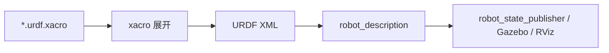

# 04 Xacro 实战

<!-- lecture-notes:integrated-v2 -->

## 讲义导读：把机器人当成可验证的闭环系统

这一章讲的是 **04 Xacro 实战**。阅读时不要只记命令、参数或算法名，而要把它放进机器人闭环：模型是否描述真实机器人，坐标系和时间是否一致，传感器数据是否可信，状态估计是否稳定，规划结果是否可执行，控制命令是否安全，仿真和真机差异是否被验证。机器人学习的关键不是让 demo 偶然跑通，而是能解释每个模块为什么工作、怎样失败、如何调试。

### 一句话先懂

机器人仿真不是画一个模型好看，而是让几何、惯性、碰撞、传感器、控制接口和物理环境足够接近真实系统。

### 通俗类比

可以把机器人想成一个会移动、会感知、会决策的闭环系统：传感器像眼睛和耳朵，TF 和状态估计像方向感，地图像环境记忆，规划器像路线顾问，控制器像肌肉和反射，仿真像训练场，安全机制像刹车和护栏。任何一环的单位、方向、时间或边界错了，整机表现都会变差。

类比只能帮助建立直觉。回到工程上，要把每个模块写成输入、输出、坐标系、时间戳、参数、频率、误差来源和验收指标。只有这些信息清楚，才知道问题是来自硬件、驱动、模型、通信、算法、控制还是环境。

### 本章学习主线

1. **模型和坐标**：先确认 URDF/SDF、TF、外参、单位和 REP 103/105 约定是否正确。
2. **数据和时间**：检查 Topic、QoS、Header、frame_id、timestamp、use_sim_time 和 rosbag 回放是否一致。
3. **算法和接口**：弄清输入数据是什么，输出命令或估计是什么，中间参数控制什么物理或数学含义。
4. **闭环和反馈**：观察命令是否被执行，执行结果是否反馈到 odom、TF、状态估计或任务层。
5. **失败和安全**：记录不动、乱动、漂移、震荡、穿墙、丢图、延迟、碰撞和失联时的排查顺序。
6. **仿真到真机**：把仿真中默认理想化的部分逐项换成真实约束，例如摩擦、延迟、噪声、限幅和电源。

### 概念怎么学才不容易忘

遇到机器人概念时，建议按 白话作用 -> ROS 2 接口 -> 坐标时间 -> 最小实验 -> 典型故障 -> 调试命令 六步学习。比如学习 TF，不只背 map、odom、base_link，还要知道谁发布、频率多少、时间戳是否能查到；学习控制器，不只看 cmd_vel 是否发布，还要看底盘是否执行、odom 是否反馈、限速和急停是否生效。

### 最小实践任务

建立一个两轮差速小车 URDF/Xacro，接入 ros2_control 和 Gazebo Sim，检查 TF、joint、collision、inertial、传感器数据和 cmd_vel 到 odom 的闭环。

实践时要保留失败记录：TF 断裂、QoS 不匹配、use_sim_time 忘开、frame_id 写错、惯性参数不合理、footprint 偏小、传感器外参偏差、控制频率不足。机器人系统的经验很大一部分来自这些可复现的错误。

### 读完本章应该能做到

- 用自己的话解释本章主题在机器人闭环中的位置。
- 画出最小数据流，标明 Topic、Service、Action、TF、参数和启动文件。
- 说出至少三个常见失败现象，并给出对应的检查命令或观测信号。
- 解释关键参数的物理意义，而不是只复制默认 YAML。
- 能说明 URDF、Xacro、SDF、Gazebo Sim、ros2_control、传感器插件和仿真时间之间的关系，并知道仿真到真机差异来自哪里。

> 本节是讲义化阅读入口，后续正文中的 ROS 2 接口、坐标系、算法、仿真、控制和调试内容都应围绕这条机器人闭环来理解。
Xacro 是 XML Macros 的缩写，用来生成 URDF。URDF 本身是 XML，重复内容很多；Xacro 可以定义变量、宏、表达式和文件包含，让机器人模型更容易维护。

## 本篇学习目标

学完本篇后，你应该能：

- 把重复 URDF 片段抽成 Xacro macro；
- 用 property 管理尺寸、质量、颜色和开关；
- 用 include 拆分材料、惯性、传感器和控制配置；
- 生成 URDF 并用检查工具验证结果，而不是只看 Xacro 源文件。

## 为什么要用 Xacro

假设一个小车有左右两个轮子。纯 URDF 需要重复写两份 link、visual、collision、inertial、joint。以后轮子半径改了，你要改多个位置，容易漏。

Xacro 可以：

- 把尺寸定义成变量；
- 把重复结构写成宏；
- 把材料、惯性、传感器拆成多个文件；
- 用表达式计算位置；
- 根据参数启用或禁用模块。

Xacro 的处理链路：



调试时要记住：真正被下游工具消费的是展开后的 URDF，不是你写的 Xacro 源文件。

## 文件开头

典型 Xacro 文件：

```xml
<?xml version="1.0"?>
<robot xmlns:xacro="http://www.ros.org/wiki/xacro" name="mini_bot">
  ...
</robot>
```

必须声明 `xmlns:xacro`，否则 Xacro 标签无法识别。

## property

定义变量：

```xml
<xacro:property name="base_length" value="0.4"/>
<xacro:property name="base_width" value="0.3"/>
<xacro:property name="base_height" value="0.1"/>
<xacro:property name="wheel_radius" value="0.05"/>
```

使用变量：

```xml
<box size="${base_length} ${base_width} ${base_height}"/>
```

表达式：

```xml
<origin xyz="0 ${base_width / 2 + wheel_width / 2} ${-base_height / 2 + wheel_radius}"/>
```

建议：

- 尺寸、质量、颜色都放顶部；
- 变量名明确，不要用 `a`、`b`；
- 表达式不要过度复杂；
- 复杂公式可以拆成多个 property。

## macro

定义宏：

```xml
<xacro:macro name="box_inertial" params="mass x y z">
  <inertial>
    <mass value="${mass}"/>
    <inertia
      ixx="${mass / 12.0 * (y*y + z*z)}"
      ixy="0" ixz="0"
      iyy="${mass / 12.0 * (x*x + z*z)}"
      iyz="0"
      izz="${mass / 12.0 * (x*x + y*y)}"/>
  </inertial>
</xacro:macro>
```

调用宏：

```xml
<xacro:box_inertial mass="2.0" x="${base_length}" y="${base_width}" z="${base_height}"/>
```

宏常用于：

- 惯性公式；
- 左右轮；
- 相机；
- 雷达；
- 材料；
- 传动接口；
- Gazebo 插件配置。

## 条件

可以用参数控制是否启用某些部件：

```xml
<xacro:arg name="use_lidar" default="true"/>

<xacro:if value="$(arg use_lidar)">
  <link name="laser_link"/>
  <joint name="laser_joint" type="fixed">
    <parent link="base_link"/>
    <child link="laser_link"/>
  </joint>
</xacro:if>
```

也可以用 `unless`：

```xml
<xacro:unless value="$(arg use_camera)">
  <!-- 不使用相机时的替代内容 -->
</xacro:unless>
```

## include

拆分文件：

```xml
<xacro:include filename="$(find my_robot_description)/urdf/materials.xacro"/>
<xacro:include filename="$(find my_robot_description)/urdf/inertial_macros.xacro"/>
<xacro:include filename="$(find my_robot_description)/urdf/sensors.xacro"/>
```

常见拆分：

```text
urdf/
  robot.urdf.xacro
  materials.xacro
  inertial_macros.xacro
  wheels.xacro
  sensors.xacro
  ros2_control.xacro
```

主文件只保留结构，细节交给子文件。

拆分建议：

| 文件 | 建议内容 | 不建议放 |
| --- | --- | --- |
| `robot.urdf.xacro` | 主结构、include、顶层参数 | 大量重复 link 细节 |
| `materials.xacro` | 颜色和材质 | 关节或传感器逻辑 |
| `inertial_macros.xacro` | 常用惯性公式 | 具体机器人结构 |
| `sensors.xacro` | LiDAR、IMU、camera 宏 | 底盘控制器参数 |
| `ros2_control.xacro` | control interface 片段 | visual/collision 几何 |

## 轮子宏示例

```xml
<xacro:macro name="wheel" params="prefix y_sign">
  <link name="${prefix}_wheel_link">
    <visual>
      <origin rpy="1.5708 0 0"/>
      <geometry>
        <cylinder radius="${wheel_radius}" length="${wheel_width}"/>
      </geometry>
      <material name="dark_gray"/>
    </visual>
    <collision>
      <origin rpy="1.5708 0 0"/>
      <geometry>
        <cylinder radius="${wheel_radius}" length="${wheel_width}"/>
      </geometry>
    </collision>
    <xacro:cylinder_inertial mass="${wheel_mass}" radius="${wheel_radius}" length="${wheel_width}"/>
  </link>

  <joint name="${prefix}_wheel_joint" type="continuous">
    <parent link="base_link"/>
    <child link="${prefix}_wheel_link"/>
    <origin xyz="0 ${y_sign * wheel_y} ${wheel_z}" rpy="0 0 0"/>
    <axis xyz="0 1 0"/>
  </joint>
</xacro:macro>

<xacro:wheel prefix="left" y_sign="1"/>
<xacro:wheel prefix="right" y_sign="-1"/>
```

注意：如果右轮转向和预期相反，有些模型会把右轮 axis 写成 `0 -1 0`，有些控制器则要求左右轮 joint axis 一致。不要靠猜，应该启动后发布速度命令并观察正方向。

## 生成 URDF

命令：

```bash
ros2 run xacro xacro robot.urdf.xacro > robot.urdf
```

带参数：

```bash
ros2 run xacro xacro robot.urdf.xacro use_lidar:=true use_camera:=false > robot.urdf
```

检查：

```bash
check_urdf robot.urdf
```

如果报错，优先看：

- XML 标签是否闭合；
- 宏参数是否缺失；
- 变量名是否拼错；
- include 路径是否正确；
- 数学表达式是否能计算；
- 是否把字符串当数字参与计算。

建议把展开后的 URDF 保存到 `/tmp` 或 `build` 目录，不要把生成物长期提交成源文件，除非你明确需要给不支持 Xacro 的工具使用。

## Launch 中使用 Xacro

ROS 2 launch 常见写法是运行 Xacro 并把结果作为 `robot_description` 参数传给 `robot_state_publisher`：

```python
from launch import LaunchDescription
from launch_ros.actions import Node
from launch.substitutions import Command, PathJoinSubstitution
from launch_ros.substitutions import FindPackageShare

def generate_launch_description():
    robot_description_content = Command([
        "xacro ",
        PathJoinSubstitution([
            FindPackageShare("my_robot_description"),
            "urdf",
            "robot.urdf.xacro",
        ]),
    ])

    return LaunchDescription([
        Node(
            package="robot_state_publisher",
            executable="robot_state_publisher",
            parameters=[{"robot_description": robot_description_content}],
        )
    ])
```

## Xacro 风格建议

推荐：

- 文件名使用 `.urdf.xacro`；
- 顶部集中放 property；
- 宏名使用明确名词，如 `wheel`、`lidar_sensor`、`box_inertial`；
- 坐标和尺寸尽量通过变量计算；
- 每个宏只做一类事情；
- 宏参数不要太多，超过 8 个就考虑拆分或用更清晰的结构；
- 生成的 URDF 要定期检查，不要只看 Xacro 源文件。

不推荐：

- 在宏里隐藏太多 link 和 joint，导致 TF 树难以阅读；
- 到处硬编码尺寸；
- include 层级太深；
- 同名 property 到处覆盖；
- 把 Gazebo、ros2_control、传感器、外观全部塞在一个巨大的文件里。

## 学习练习

1. 把一个纯 URDF 小车改成 Xacro。
2. 抽取底盘尺寸、轮子半径、轮距、质量。
3. 写 `box_inertial` 和 `cylinder_inertial` 两个宏。
4. 写 `wheel` 宏生成左右轮。
5. 添加 `use_lidar` 参数控制是否生成雷达。
6. 生成 URDF，用 `check_urdf` 验证。
7. 在 RViz 中确认模型和 TF。

## 复习问题

1. 为什么 Xacro 能降低维护成本，但也可能增加调试难度？
2. property、arg、macro 分别适合解决什么问题？
3. 为什么要经常检查展开后的 URDF？
4. 一个宏参数太多时，说明设计上可能有什么问题？
5. 如果 include 路径找不到，应该检查哪些环境和包构建步骤？

## 2026 机器人资料与版本核对补充

机器人生态版本变化很快，尤其是 ROS 2 发行版、Gazebo Sim、Nav2、ros2_control、MoveIt 2、SLAM Toolbox 和各类驱动包。复现实验前应记录 ROS 2 发行版、Ubuntu 版本、RMW 实现、工作空间 source 顺序、Gazebo 版本、机器人模型文件、参数 YAML、传感器驱动版本、固件版本和仿真或真机环境。

排错时优先核对官方文档、REP 标准和当前发行版文档。社区教程很适合入门和排坑，但包名、插件名、参数名、launch 文件和命令可能随发行版变化。尤其是 Nav2、Gazebo Sim 和 ros2_control，建议按当前项目使用的发行版页面核对，而不是混用 Humble、Iron、Jazzy、Kilted 或 Rolling 的教程。

### 资料入口

- ROS 2 Documentation: https://docs.ros.org/
- ROS 2 Jazzy Documentation: https://docs.ros.org/en/jazzy/
- Nav2 Documentation: https://docs.nav2.org/
- Gazebo Sim Documentation: https://gazebosim.org/docs/
- Gazebo ROS 2 integration: https://gazebosim.org/docs/latest/ros2_integration/
- ros2_control Documentation: https://control.ros.org/
- MoveIt 2 Documentation: https://moveit.picknik.ai/main/index.html
- REP 103 Standard Units and Coordinate Conventions: https://www.ros.org/reps/rep-0103.html
- REP 105 Coordinate Frames for Mobile Platforms: https://www.ros.org/reps/rep-0105.html
- SLAM Toolbox: https://github.com/SteveMacenski/slam_toolbox

仿真章节要特别核对 collision、inertial、joint limit、transmission、controller、sensor plugin 和 sim time。模型看起来正确不代表物理正确，惯性和碰撞错误会直接导致控制震荡或仿真穿模。

## 参考资料

- [ROS 2 Xacro 教程](https://docs.ros.org/en/rolling/Tutorials/Intermediate/URDF/Using-Xacro-to-Clean-Up-a-URDF-File.html)
- [xacro 包文档](https://docs.ros.org/en/rolling/p/xacro/)
## 2026-06 深化精讲补充：Xacro 实战

Last researched: 2026-06-16

### 本篇在仿真体系中的位置

Xacro 的目的不是炫技，而是让尺寸、质量、颜色、传感器安装和重复结构有单一可信来源。 本篇关注的重点是：property、macro、include、参数化建模、可复用惯性和传感器宏。机器人仿真不是单纯运行一个窗口，而是一条从模型文件到 ROS 2 接口、从物理引擎到上层算法的闭环链路。任何一层没有验证，后续问题都会以更隐蔽的形式出现。


Figure: 本图为面向机器人学习笔记的通用工程闭环，综合 ROS 2、REP 103/105、Nav2、Gazebo Sim 与 ros2_control 官方资料重新整理。


### 分层理解

| 层级 | 主要对象 | 应确认的问题 | 常用工具 |
| --- | --- | --- | --- |
| 模型层 | URDF、Xacro、SDF、mesh | link/joint 是否正确，单位是否为 SI，惯性和碰撞是否合理 | `xacro`、`check_urdf`、RViz |
| TF 层 | `map`、`odom`、`base_link`、传感器 frame | 坐标树是否连通，parent/child 是否正确，时间戳是否可查询 | `view_frames`、`tf2_echo` |
| 物理层 | 质量、惯量、摩擦、接触、重力 | 是否抖动、飞走、穿模，仿真步长是否稳定 | Gazebo GUI、日志 |
| 控制层 | ros2_control、controller manager、控制器 | 控制器是否 loaded/active，joint 名称和接口是否匹配 | `ros2 control`、`ros2 topic echo /cmd_vel` |
| 传感器层 | LaserScan、IMU、Image、PointCloud2 | frame、频率、QoS、噪声和桥接是否正确 | `ros2 topic hz/info -v`、RViz |
| 算法层 | SLAM、Nav2、MoveIt 2、任务节点 | 输入是否完整，生命周期是否 active，恢复策略是否有效 | Nav2 日志、rosbag2 |

### 工程流程精讲

第一步是固定版本。ROS 2、Gazebo Sim、ros_gz、ros2_control 和 Nav2 的版本组合必须以官方文档为准。Jazzy 与 Humble 的包名、默认中间件、Gazebo 推荐版本和教程细节可能不同。跟教程学习时不要混用 ROS 1、Gazebo Classic、Ignition 旧命名和 Gazebo Sim 新命名。

第二步是建立最小模型。最小模型只需要一个 `base_link`、简单几何体、必要的 `collision` 和 `inertial`。先让它在 RViz 中显示，再让它在 Gazebo 中稳定落地。这个阶段不要急着加 Nav2、SLAM 或复杂 mesh，因为它们会掩盖模型错误。

第三步是补齐控制闭环。移动机器人通常需要把 `/cmd_vel` 变成轮子关节速度，机械臂需要把轨迹控制器和关节状态接通。ros2_control 的价值是统一仿真和实机接口，但它要求硬件接口、控制器配置、joint 名称、command/state interface 严格一致。

第四步是接入传感器。Gazebo 内部 topic 和 ROS 2 topic 不是同一个系统，Gazebo Sim 常通过 `ros_gz_bridge` 进行消息桥接。桥接前要确认消息类型受支持，桥接方向正确，frame_id 和仿真时间正确传递。

第五步才是上层算法。Nav2、SLAM、定位和任务逻辑都假设底层模型、TF、控制和传感器基本可信。若底层未验证就直接调 Nav2 参数，常见结果是参数越改越乱。

### 最小验证项目

建议把本篇内容落实到一个 `my_robot_description` + `my_robot_bringup` 工作空间中：

```text
robot_ws/src/
  my_robot_description/
    urdf/
    meshes/
    rviz/
    launch/
  my_robot_bringup/
    launch/
    config/
  my_robot_control/
    config/
  my_robot_navigation/
    maps/
    params/
```

验收标准不是“能启动 Gazebo”，而是以下每一项都能独立证明：`robot_description` 能生成，TF 树连通，模型在 RViz 中方向正确，Gazebo 中不抖动，控制器 active，`/cmd_vel` 后轮子和底盘运动方向正确，传感器话题有稳定频率，`use_sim_time` 在所有相关节点一致。

### 常见实践坑

- `visual` 正常不代表 `collision` 和 `inertial` 正常。RViz 只看显示和 TF，Gazebo 还要计算物理。
- 复杂 mesh 不适合直接做碰撞。碰撞体应尽量用 box、cylinder、sphere 或简化网格。
- 动态 link 没有合理惯性时，仿真容易抖动、飞走或在接触时爆炸。
- `base_link`、`base_footprint`、`odom`、`map` 的语义要遵循 REP 105，不要为了“看起来能跑”随意改 frame 名。
- Gazebo world 坐标和 ROS `map` 坐标不是天然同一个概念。需要明确谁发布哪条 TF。
- `ros_gz_bridge` 只桥接配置过且支持的消息类型。看到 Gazebo 有 topic 不代表 ROS 2 一定能收到。
- QoS 不匹配会导致 topic 存在但订阅不到，尤其是传感器数据和地图数据。
- 仿真时间 `/clock` 必须被所有算法节点一致使用，否则 TF 查询和 rosbag 回放会出现时间错位。
- 控制器 loaded 不等于 active，active 不等于 joint interface 名称正确。
- Nav2 失败时先查 TF、里程计、传感器和 costmap，再讨论 planner/controller 参数。

### 调试顺序

1. `ros2 doctor` 和环境变量：确认 ROS 发行版、Domain ID、RMW 和 source 顺序。
2. `ros2 pkg list` / `ros2 launch`：确认包能被找到，launch 文件能被安装。
3. `ros2 param get /robot_state_publisher robot_description`：确认模型实际传入。
4. `ros2 run tf2_tools view_frames`：确认 TF 树没有断裂和重复发布。
5. Gazebo 中暂停/单步观察模型：确认物理稳定。
6. `ros2 control list_controllers`：确认控制器状态。
7. `ros2 topic info -v`：检查关键 topic 的类型、QoS、发布者和订阅者。
8. RViz 同时显示 TF、RobotModel、LaserScan、Odometry、Map 和 Path。
9. 录制 rosbag2，离线复现问题，避免每次重新跑完整仿真。

### 从仿真迁移到实机

仿真到实机的关键不是“代码完全不变”，而是接口和假设可控。URDF 可以复用，但质量、摩擦、传感器噪声、延迟和控制饱和需要实测校准。ros2_control 能让控制器层更容易复用，但硬件接口必须处理通信超时、编码器异常、电机使能、急停和安全限速。Nav2 参数也要根据真实机器人最大速度、加速度、制动距离、定位误差和传感器盲区重新调整。

### 推荐练习

- 从零写一个只有底盘和两个轮子的 URDF/Xacro，并在 RViz 中验证 TF。
- 给模型添加 collision 和 inertial，观察缺失或错误参数对 Gazebo 稳定性的影响。
- 用 ros2_control 接入差速控制器，发布 `/cmd_vel` 验证正转、倒车和原地旋转。
- 添加 2D LiDAR，用 `ros_gz_bridge` 桥接到 ROS 2，并在 RViz 中显示 `/scan`。
- 录制 `/tf`、`/odom`、`/scan`、`/cmd_vel` 和 `/clock`，用 rosbag2 回放排查。

## References and further reading

- [Official] [ROS 2 Documentation](https://docs.ros.org/)
- [Official] [ROS 2 Jazzy Documentation](https://docs.ros.org/en/jazzy/)
- [Standard] [REP 103: Standard Units of Measure and Coordinate Conventions](https://www.ros.org/reps/rep-0103.html)
- [Standard] [REP 105: Coordinate Frames for Mobile Platforms](https://www.ros.org/reps/rep-0105.html)
- [Book / Course] [Modern Robotics](https://modernrobotics.northwestern.edu/)
- [Book] [Probabilistic Robotics](https://mitpress.mit.edu/9780262303804/probabilistic-robotics/)
- [Book] [State Estimation for Robotics](https://www.cambridge.org/core/books/state-estimation-for-robotics/00E53274A2F1E6CC1A55CA5C3D1C9718)
- [Course] [MIT Underactuated Robotics](https://underactuated.mit.edu/)
- [Official] [Nav2 Documentation](https://docs.nav2.org/)
- [Official] [Gazebo Sim Documentation](https://gazebosim.org/docs/latest/)
- [Official] [SDFormat Documentation](https://sdformat.org/)
- [Official] [ros2_control Documentation](https://control.ros.org/)
- [Community] [ROS2 Control分析讲解 - CSDN](https://blog.csdn.net/Bing_Lee/article/details/135003678)
- [Community] [在机器人仿真中使用 ros2_control - CSDN](https://blog.csdn.net/apingna/article/details/148333455)
- [Community] [ROS2 SLAM 建图导航 - 掘金](https://juejin.cn/post/7101201729122730020)
- [Community] [机器人导航仿真 - 博客园](https://www.cnblogs.com/zjh1170/p/16133766.html)
- [Official] [Use ROS 2 to interact with Gazebo](https://gazebosim.org/docs/latest/ros2_integration/)
- [Official] [Installing Gazebo with ROS](https://gazebosim.org/docs/latest/ros_installation/)
- [Official] [ros_gz_bridge package documentation](https://docs.ros.org/en/jazzy/p/ros_gz_bridge/)
- [Official] [SDFormat model kinematics](https://sdformat.org/tutorials/specification/spec_model_kinematics/)

## References and further reading

- [Official] [ROS 2 Documentation](https://docs.ros.org/)
- [Official] [ROS 2 Jazzy Documentation](https://docs.ros.org/en/jazzy/)
- [Official] [Nav2 Documentation](https://docs.nav2.org/)
- [Official] [Gazebo Sim Documentation](https://gazebosim.org/docs/latest/)
- [Official] [Gazebo ROS 2 integration](https://gazebosim.org/docs/latest/ros2_integration/)
- [Official] [SDFormat Documentation](https://sdformat.org/)
- [Official] [ros2_control Documentation](https://control.ros.org/)
- [Standard] [REP 103: Standard Units of Measure and Coordinate Conventions](https://www.ros.org/reps/rep-0103.html)
- [Standard] [REP 105: Coordinate Frames for Mobile Platforms](https://www.ros.org/reps/rep-0105.html)
- [Book / Course] [Modern Robotics](https://modernrobotics.northwestern.edu/)
- [Book] [Probabilistic Robotics](https://mitpress.mit.edu/9780262303804/probabilistic-robotics/)
- [Book] [State Estimation for Robotics](https://www.cambridge.org/core/books/state-estimation-for-robotics/00E53274A2F1E6CC1A55CA5C3D1C9718)
- [Course] [MIT Underactuated Robotics](https://underactuated.mit.edu/)
- [Source] [ros2_control_demos](https://github.com/ros-controls/ros2_control_demos)
- [Community] [ROS2 Control分析讲解 - CSDN](https://blog.csdn.net/Bing_Lee/article/details/135003678)
- [Community] [在机器人仿真中使用 ros2_control - CSDN](https://blog.csdn.net/apingna/article/details/148333455)
- [Community] [ROS2 SLAM 建图导航 - 掘金](https://juejin.cn/post/7101201729122730020)
- [Community] [机器人导航仿真 - 博客园](https://www.cnblogs.com/zjh1170/p/16133766.html)

<!-- AUTO_EXPANDED_TO_REFERENCE_LENGTH_2026_06_23 -->

## 万字精讲扩展：Xacro 实战

> 本节为按参考笔记篇幅补充的系统化扩展内容，目标是把原有笔记从“知识点记录”扩展为“概念、原理、流程、工程实践、常见误区和复盘清单”完整学习材料。

### 精讲扩展 1：Xacro 实战 的坐标系、运动学 与工程化理解

学习 $topic 时，不能只把它当成一个孤立知识点来背诵，而要把它放到 $category 的完整问题链条里理解。一个知识点通常同时包含概念定义、适用边界、输入输出、运行过程、常见异常和工程取舍。真正掌握它，意味着看到一个具体场景时，能够判断它解决什么问题、依赖哪些前提、失败时会出现什么现象，以及应该用什么手段验证自己的判断。

从 $a 的角度看，最重要的是先建立清晰的对象模型。也就是明确系统里有哪些参与者、它们之间如何连接、数据或控制信号如何流动、哪些环节是同步的、哪些环节是异步的、哪些状态是临时状态、哪些状态需要长期保存。很多初学问题并不是公式不会、API 不熟，而是对象边界不清：把配置当成状态，把结果当成过程，把局部现象当成全局规律。写笔记时建议始终追问：这个概念的主体是谁，输入是什么，输出是什么，中间约束是什么，错误会在哪里暴露。

从 $b 的角度看，流程比单点知识更关键。一个成熟方案通常不是单个技巧，而是一组步骤：先确定目标，再拆分约束，然后选择工具，最后通过测试和复盘确认效果。比如在实际项目中，不能只问“怎么实现”，还要问“为什么要这样实现”“有没有更简单的替代方案”“边界条件是什么”“数据量、并发量、实时性、可靠性变化后还能不能工作”。这种流程意识能够避免把学习停留在教程层面，也能让后续排错有明确路线。

$topic 的 $c 往往决定它在真实项目中的稳定性。理论上可行的方案，到了工程环境中会受到数据质量、硬件条件、依赖版本、网络环境、团队协作、部署方式和维护成本影响。写代码或做设计时，应该把正常路径和异常路径同时考虑：正常情况下如何运行，输入为空怎么办，超时怎么办，重复执行怎么办，部分成功怎么办，版本升级后兼容性怎么办，日志和指标如何证明系统确实按预期工作。

进一步看 $d，它通常对应性能、可靠性或可维护性的核心矛盾。很多技术选择并没有绝对正确答案，只有是否适合当前约束。例如追求极致性能可能牺牲可读性，追求高度抽象可能增加调试成本，追求快速交付可能留下技术债，追求完全通用可能让简单场景变复杂。高质量笔记应该把这些取舍写出来，而不是只给一个“推荐方案”。推荐方案背后的条件越清楚，迁移到新场景时越不容易误用。

最后从 $e 的角度进行复盘，可以把知识从“看懂”推进到“会用”。建议为 $topic 建立三个层次的检查：第一层是概念检查，确认术语、流程和边界没有混淆；第二层是实践检查，确认能够独立完成一个最小案例；第三层是工程检查，确认这个案例在异常、规模、性能和维护方面经得起追问。每次学习完一个章节，都可以用这三层检查反向补齐笔记。

#### 典型场景拆解

在真实场景中，$topic 通常会经历“需求出现、方案选择、实现落地、问题暴露、持续优化”几个阶段。需求出现时，要先判断这个需求属于基础能力、性能优化、体验改进、可靠性建设还是长期架构演进。不同类型的需求对方案的评价标准不同：基础能力看正确性，性能优化看指标，体验改进看路径是否顺滑，可靠性建设看故障时能否降级和恢复，架构演进看未来变化是否容易吸收。

方案选择阶段，最容易犯的错误是直接套用熟悉工具。更稳妥的方式是列出约束：数据规模、时延要求、资源预算、团队熟悉度、运维能力、安全要求、可测试性和长期维护成本。只有把约束列清楚，才能解释为什么选择当前方案。否则方案看似高级，实际可能只是增加了复杂度。

实现落地阶段，要把 $a 和 $b 拆成可验证的小步骤。每一步都应该有明确的输入、输出和检查方式。对学习笔记而言，这意味着不能只有大段概念，还应该补充流程图式的文字描述、伪代码、命令示例、参数解释、错误现象和排查路径。这样以后复习时，笔记不仅能帮助理解，也能直接指导实践。

问题暴露阶段，要优先区分“理解错误、实现错误、环境错误、数据错误、依赖错误、边界条件错误”。很多复杂问题之所以难排，是因为一开始就把问题归因到错误层级。例如把配置问题当成算法问题，把权限问题当成代码问题，把数据分布变化当成模型失效，把硬件噪声当成软件逻辑错误。好的排查顺序应该从可观测事实开始，而不是从猜测开始。

持续优化阶段，不应只追求把当前问题压下去，还要沉淀成规则。比如记录触发条件、影响范围、定位方法、最终修复、预防措施和可监控指标。这样下一次出现类似问题时，团队可以复用经验，而不是重新从零排查。

#### 常见误区与纠偏

第一个误区是只记结论，不记前提。$topic 中很多结论都是有条件的：适用于小规模，不一定适用于大规模；适用于离线处理，不一定适用于实时系统；适用于单机环境，不一定适用于分布式环境；适用于教学案例，不一定适用于生产项目。纠偏方法是在每个重要结论后面补一句“适用条件”和“不适用情况”。

第二个误区是只关注工具，不关注模型。工具会变化，模型更稳定。无论工具名称如何变化，底层仍然要解决输入建模、状态管理、资源调度、错误恢复、性能约束和质量验证这些问题。学习 $topic 时，应该把工具用法和底层模型分开记录：工具命令解决“怎么做”，底层模型解释“为什么这样做”。

第三个误区是没有验证意识。很多笔记写得很完整，但没有说明如何确认自己做对了。对于 $category 相关主题，验证至少应包含最小样例、边界样例、异常样例和性能样例。最小样例证明流程跑通，边界样例证明理解完整，异常样例证明系统可恢复，性能样例证明方案在目标规模下仍然可用。

第四个误区是忽略可维护性。短期学习时，能跑通就容易产生掌握的错觉；长期使用时，命名、分层、注释、测试、日志、版本管理和文档才会决定知识能否转化为稳定能力。扩充 $topic 笔记时，应把“如何写得清楚、如何排查、如何交接、如何复盘”也纳入内容。

#### 学习与实践建议

建议围绕 $topic 做一个小型闭环练习：先用自己的话解释概念，再画出流程，再实现一个最小案例，然后主动制造一个错误并排查，最后写下复盘。这个过程看起来比直接读资料慢，但能显著提高迁移能力。很多人学完后不会用，根本原因是缺少“从概念到问题再到验证”的闭环。

复习时可以使用四个问题：它解决什么问题；它依赖什么条件；它失败时有什么表现；它如何被验证。只要这四个问题能回答清楚，说明对 $topic 的理解已经从表层进入工程层。如果回答不清楚，就回到对应章节补充例子、边界和排错方法。
### 精讲扩展 2：Xacro 实战 的运动学、动力学 与工程化理解

学习 $topic 时，不能只把它当成一个孤立知识点来背诵，而要把它放到 $category 的完整问题链条里理解。一个知识点通常同时包含概念定义、适用边界、输入输出、运行过程、常见异常和工程取舍。真正掌握它，意味着看到一个具体场景时，能够判断它解决什么问题、依赖哪些前提、失败时会出现什么现象，以及应该用什么手段验证自己的判断。

从 $a 的角度看，最重要的是先建立清晰的对象模型。也就是明确系统里有哪些参与者、它们之间如何连接、数据或控制信号如何流动、哪些环节是同步的、哪些环节是异步的、哪些状态是临时状态、哪些状态需要长期保存。很多初学问题并不是公式不会、API 不熟，而是对象边界不清：把配置当成状态，把结果当成过程，把局部现象当成全局规律。写笔记时建议始终追问：这个概念的主体是谁，输入是什么，输出是什么，中间约束是什么，错误会在哪里暴露。

从 $b 的角度看，流程比单点知识更关键。一个成熟方案通常不是单个技巧，而是一组步骤：先确定目标，再拆分约束，然后选择工具，最后通过测试和复盘确认效果。比如在实际项目中，不能只问“怎么实现”，还要问“为什么要这样实现”“有没有更简单的替代方案”“边界条件是什么”“数据量、并发量、实时性、可靠性变化后还能不能工作”。这种流程意识能够避免把学习停留在教程层面，也能让后续排错有明确路线。

$topic 的 $c 往往决定它在真实项目中的稳定性。理论上可行的方案，到了工程环境中会受到数据质量、硬件条件、依赖版本、网络环境、团队协作、部署方式和维护成本影响。写代码或做设计时，应该把正常路径和异常路径同时考虑：正常情况下如何运行，输入为空怎么办，超时怎么办，重复执行怎么办，部分成功怎么办，版本升级后兼容性怎么办，日志和指标如何证明系统确实按预期工作。

进一步看 $d，它通常对应性能、可靠性或可维护性的核心矛盾。很多技术选择并没有绝对正确答案，只有是否适合当前约束。例如追求极致性能可能牺牲可读性，追求高度抽象可能增加调试成本，追求快速交付可能留下技术债，追求完全通用可能让简单场景变复杂。高质量笔记应该把这些取舍写出来，而不是只给一个“推荐方案”。推荐方案背后的条件越清楚，迁移到新场景时越不容易误用。

最后从 $e 的角度进行复盘，可以把知识从“看懂”推进到“会用”。建议为 $topic 建立三个层次的检查：第一层是概念检查，确认术语、流程和边界没有混淆；第二层是实践检查，确认能够独立完成一个最小案例；第三层是工程检查，确认这个案例在异常、规模、性能和维护方面经得起追问。每次学习完一个章节，都可以用这三层检查反向补齐笔记。

#### 典型场景拆解

在真实场景中，$topic 通常会经历“需求出现、方案选择、实现落地、问题暴露、持续优化”几个阶段。需求出现时，要先判断这个需求属于基础能力、性能优化、体验改进、可靠性建设还是长期架构演进。不同类型的需求对方案的评价标准不同：基础能力看正确性，性能优化看指标，体验改进看路径是否顺滑，可靠性建设看故障时能否降级和恢复，架构演进看未来变化是否容易吸收。

方案选择阶段，最容易犯的错误是直接套用熟悉工具。更稳妥的方式是列出约束：数据规模、时延要求、资源预算、团队熟悉度、运维能力、安全要求、可测试性和长期维护成本。只有把约束列清楚，才能解释为什么选择当前方案。否则方案看似高级，实际可能只是增加了复杂度。

实现落地阶段，要把 $a 和 $b 拆成可验证的小步骤。每一步都应该有明确的输入、输出和检查方式。对学习笔记而言，这意味着不能只有大段概念，还应该补充流程图式的文字描述、伪代码、命令示例、参数解释、错误现象和排查路径。这样以后复习时，笔记不仅能帮助理解，也能直接指导实践。

问题暴露阶段，要优先区分“理解错误、实现错误、环境错误、数据错误、依赖错误、边界条件错误”。很多复杂问题之所以难排，是因为一开始就把问题归因到错误层级。例如把配置问题当成算法问题，把权限问题当成代码问题，把数据分布变化当成模型失效，把硬件噪声当成软件逻辑错误。好的排查顺序应该从可观测事实开始，而不是从猜测开始。

持续优化阶段，不应只追求把当前问题压下去，还要沉淀成规则。比如记录触发条件、影响范围、定位方法、最终修复、预防措施和可监控指标。这样下一次出现类似问题时，团队可以复用经验，而不是重新从零排查。

#### 常见误区与纠偏

第一个误区是只记结论，不记前提。$topic 中很多结论都是有条件的：适用于小规模，不一定适用于大规模；适用于离线处理，不一定适用于实时系统；适用于单机环境，不一定适用于分布式环境；适用于教学案例，不一定适用于生产项目。纠偏方法是在每个重要结论后面补一句“适用条件”和“不适用情况”。

第二个误区是只关注工具，不关注模型。工具会变化，模型更稳定。无论工具名称如何变化，底层仍然要解决输入建模、状态管理、资源调度、错误恢复、性能约束和质量验证这些问题。学习 $topic 时，应该把工具用法和底层模型分开记录：工具命令解决“怎么做”，底层模型解释“为什么这样做”。

第三个误区是没有验证意识。很多笔记写得很完整，但没有说明如何确认自己做对了。对于 $category 相关主题，验证至少应包含最小样例、边界样例、异常样例和性能样例。最小样例证明流程跑通，边界样例证明理解完整，异常样例证明系统可恢复，性能样例证明方案在目标规模下仍然可用。

第四个误区是忽略可维护性。短期学习时，能跑通就容易产生掌握的错觉；长期使用时，命名、分层、注释、测试、日志、版本管理和文档才会决定知识能否转化为稳定能力。扩充 $topic 笔记时，应把“如何写得清楚、如何排查、如何交接、如何复盘”也纳入内容。

#### 学习与实践建议

建议围绕 $topic 做一个小型闭环练习：先用自己的话解释概念，再画出流程，再实现一个最小案例，然后主动制造一个错误并排查，最后写下复盘。这个过程看起来比直接读资料慢，但能显著提高迁移能力。很多人学完后不会用，根本原因是缺少“从概念到问题再到验证”的闭环。

复习时可以使用四个问题：它解决什么问题；它依赖什么条件；它失败时有什么表现；它如何被验证。只要这四个问题能回答清楚，说明对 $topic 的理解已经从表层进入工程层。如果回答不清楚，就回到对应章节补充例子、边界和排错方法。
### 精讲扩展 3：Xacro 实战 的动力学、传感器 与工程化理解

学习 $topic 时，不能只把它当成一个孤立知识点来背诵，而要把它放到 $category 的完整问题链条里理解。一个知识点通常同时包含概念定义、适用边界、输入输出、运行过程、常见异常和工程取舍。真正掌握它，意味着看到一个具体场景时，能够判断它解决什么问题、依赖哪些前提、失败时会出现什么现象，以及应该用什么手段验证自己的判断。

从 $a 的角度看，最重要的是先建立清晰的对象模型。也就是明确系统里有哪些参与者、它们之间如何连接、数据或控制信号如何流动、哪些环节是同步的、哪些环节是异步的、哪些状态是临时状态、哪些状态需要长期保存。很多初学问题并不是公式不会、API 不熟，而是对象边界不清：把配置当成状态，把结果当成过程，把局部现象当成全局规律。写笔记时建议始终追问：这个概念的主体是谁，输入是什么，输出是什么，中间约束是什么，错误会在哪里暴露。

从 $b 的角度看，流程比单点知识更关键。一个成熟方案通常不是单个技巧，而是一组步骤：先确定目标，再拆分约束，然后选择工具，最后通过测试和复盘确认效果。比如在实际项目中，不能只问“怎么实现”，还要问“为什么要这样实现”“有没有更简单的替代方案”“边界条件是什么”“数据量、并发量、实时性、可靠性变化后还能不能工作”。这种流程意识能够避免把学习停留在教程层面，也能让后续排错有明确路线。

$topic 的 $c 往往决定它在真实项目中的稳定性。理论上可行的方案，到了工程环境中会受到数据质量、硬件条件、依赖版本、网络环境、团队协作、部署方式和维护成本影响。写代码或做设计时，应该把正常路径和异常路径同时考虑：正常情况下如何运行，输入为空怎么办，超时怎么办，重复执行怎么办，部分成功怎么办，版本升级后兼容性怎么办，日志和指标如何证明系统确实按预期工作。

进一步看 $d，它通常对应性能、可靠性或可维护性的核心矛盾。很多技术选择并没有绝对正确答案，只有是否适合当前约束。例如追求极致性能可能牺牲可读性，追求高度抽象可能增加调试成本，追求快速交付可能留下技术债，追求完全通用可能让简单场景变复杂。高质量笔记应该把这些取舍写出来，而不是只给一个“推荐方案”。推荐方案背后的条件越清楚，迁移到新场景时越不容易误用。

最后从 $e 的角度进行复盘，可以把知识从“看懂”推进到“会用”。建议为 $topic 建立三个层次的检查：第一层是概念检查，确认术语、流程和边界没有混淆；第二层是实践检查，确认能够独立完成一个最小案例；第三层是工程检查，确认这个案例在异常、规模、性能和维护方面经得起追问。每次学习完一个章节，都可以用这三层检查反向补齐笔记。

#### 典型场景拆解

在真实场景中，$topic 通常会经历“需求出现、方案选择、实现落地、问题暴露、持续优化”几个阶段。需求出现时，要先判断这个需求属于基础能力、性能优化、体验改进、可靠性建设还是长期架构演进。不同类型的需求对方案的评价标准不同：基础能力看正确性，性能优化看指标，体验改进看路径是否顺滑，可靠性建设看故障时能否降级和恢复，架构演进看未来变化是否容易吸收。

方案选择阶段，最容易犯的错误是直接套用熟悉工具。更稳妥的方式是列出约束：数据规模、时延要求、资源预算、团队熟悉度、运维能力、安全要求、可测试性和长期维护成本。只有把约束列清楚，才能解释为什么选择当前方案。否则方案看似高级，实际可能只是增加了复杂度。

实现落地阶段，要把 $a 和 $b 拆成可验证的小步骤。每一步都应该有明确的输入、输出和检查方式。对学习笔记而言，这意味着不能只有大段概念，还应该补充流程图式的文字描述、伪代码、命令示例、参数解释、错误现象和排查路径。这样以后复习时，笔记不仅能帮助理解，也能直接指导实践。

问题暴露阶段，要优先区分“理解错误、实现错误、环境错误、数据错误、依赖错误、边界条件错误”。很多复杂问题之所以难排，是因为一开始就把问题归因到错误层级。例如把配置问题当成算法问题，把权限问题当成代码问题，把数据分布变化当成模型失效，把硬件噪声当成软件逻辑错误。好的排查顺序应该从可观测事实开始，而不是从猜测开始。

持续优化阶段，不应只追求把当前问题压下去，还要沉淀成规则。比如记录触发条件、影响范围、定位方法、最终修复、预防措施和可监控指标。这样下一次出现类似问题时，团队可以复用经验，而不是重新从零排查。

#### 常见误区与纠偏

第一个误区是只记结论，不记前提。$topic 中很多结论都是有条件的：适用于小规模，不一定适用于大规模；适用于离线处理，不一定适用于实时系统；适用于单机环境，不一定适用于分布式环境；适用于教学案例，不一定适用于生产项目。纠偏方法是在每个重要结论后面补一句“适用条件”和“不适用情况”。

第二个误区是只关注工具，不关注模型。工具会变化，模型更稳定。无论工具名称如何变化，底层仍然要解决输入建模、状态管理、资源调度、错误恢复、性能约束和质量验证这些问题。学习 $topic 时，应该把工具用法和底层模型分开记录：工具命令解决“怎么做”，底层模型解释“为什么这样做”。

第三个误区是没有验证意识。很多笔记写得很完整，但没有说明如何确认自己做对了。对于 $category 相关主题，验证至少应包含最小样例、边界样例、异常样例和性能样例。最小样例证明流程跑通，边界样例证明理解完整，异常样例证明系统可恢复，性能样例证明方案在目标规模下仍然可用。

第四个误区是忽略可维护性。短期学习时，能跑通就容易产生掌握的错觉；长期使用时，命名、分层、注释、测试、日志、版本管理和文档才会决定知识能否转化为稳定能力。扩充 $topic 笔记时，应把“如何写得清楚、如何排查、如何交接、如何复盘”也纳入内容。

#### 学习与实践建议

建议围绕 $topic 做一个小型闭环练习：先用自己的话解释概念，再画出流程，再实现一个最小案例，然后主动制造一个错误并排查，最后写下复盘。这个过程看起来比直接读资料慢，但能显著提高迁移能力。很多人学完后不会用，根本原因是缺少“从概念到问题再到验证”的闭环。

复习时可以使用四个问题：它解决什么问题；它依赖什么条件；它失败时有什么表现；它如何被验证。只要这四个问题能回答清楚，说明对 $topic 的理解已经从表层进入工程层。如果回答不清楚，就回到对应章节补充例子、边界和排错方法。
### 精讲扩展 4：Xacro 实战 的传感器、控制闭环 与工程化理解

学习 $topic 时，不能只把它当成一个孤立知识点来背诵，而要把它放到 $category 的完整问题链条里理解。一个知识点通常同时包含概念定义、适用边界、输入输出、运行过程、常见异常和工程取舍。真正掌握它，意味着看到一个具体场景时，能够判断它解决什么问题、依赖哪些前提、失败时会出现什么现象，以及应该用什么手段验证自己的判断。

从 $a 的角度看，最重要的是先建立清晰的对象模型。也就是明确系统里有哪些参与者、它们之间如何连接、数据或控制信号如何流动、哪些环节是同步的、哪些环节是异步的、哪些状态是临时状态、哪些状态需要长期保存。很多初学问题并不是公式不会、API 不熟，而是对象边界不清：把配置当成状态，把结果当成过程，把局部现象当成全局规律。写笔记时建议始终追问：这个概念的主体是谁，输入是什么，输出是什么，中间约束是什么，错误会在哪里暴露。

从 $b 的角度看，流程比单点知识更关键。一个成熟方案通常不是单个技巧，而是一组步骤：先确定目标，再拆分约束，然后选择工具，最后通过测试和复盘确认效果。比如在实际项目中，不能只问“怎么实现”，还要问“为什么要这样实现”“有没有更简单的替代方案”“边界条件是什么”“数据量、并发量、实时性、可靠性变化后还能不能工作”。这种流程意识能够避免把学习停留在教程层面，也能让后续排错有明确路线。

$topic 的 $c 往往决定它在真实项目中的稳定性。理论上可行的方案，到了工程环境中会受到数据质量、硬件条件、依赖版本、网络环境、团队协作、部署方式和维护成本影响。写代码或做设计时，应该把正常路径和异常路径同时考虑：正常情况下如何运行，输入为空怎么办，超时怎么办，重复执行怎么办，部分成功怎么办，版本升级后兼容性怎么办，日志和指标如何证明系统确实按预期工作。

进一步看 $d，它通常对应性能、可靠性或可维护性的核心矛盾。很多技术选择并没有绝对正确答案，只有是否适合当前约束。例如追求极致性能可能牺牲可读性，追求高度抽象可能增加调试成本，追求快速交付可能留下技术债，追求完全通用可能让简单场景变复杂。高质量笔记应该把这些取舍写出来，而不是只给一个“推荐方案”。推荐方案背后的条件越清楚，迁移到新场景时越不容易误用。

最后从 $e 的角度进行复盘，可以把知识从“看懂”推进到“会用”。建议为 $topic 建立三个层次的检查：第一层是概念检查，确认术语、流程和边界没有混淆；第二层是实践检查，确认能够独立完成一个最小案例；第三层是工程检查，确认这个案例在异常、规模、性能和维护方面经得起追问。每次学习完一个章节，都可以用这三层检查反向补齐笔记。

#### 典型场景拆解

在真实场景中，$topic 通常会经历“需求出现、方案选择、实现落地、问题暴露、持续优化”几个阶段。需求出现时，要先判断这个需求属于基础能力、性能优化、体验改进、可靠性建设还是长期架构演进。不同类型的需求对方案的评价标准不同：基础能力看正确性，性能优化看指标，体验改进看路径是否顺滑，可靠性建设看故障时能否降级和恢复，架构演进看未来变化是否容易吸收。

方案选择阶段，最容易犯的错误是直接套用熟悉工具。更稳妥的方式是列出约束：数据规模、时延要求、资源预算、团队熟悉度、运维能力、安全要求、可测试性和长期维护成本。只有把约束列清楚，才能解释为什么选择当前方案。否则方案看似高级，实际可能只是增加了复杂度。

实现落地阶段，要把 $a 和 $b 拆成可验证的小步骤。每一步都应该有明确的输入、输出和检查方式。对学习笔记而言，这意味着不能只有大段概念，还应该补充流程图式的文字描述、伪代码、命令示例、参数解释、错误现象和排查路径。这样以后复习时，笔记不仅能帮助理解，也能直接指导实践。

问题暴露阶段，要优先区分“理解错误、实现错误、环境错误、数据错误、依赖错误、边界条件错误”。很多复杂问题之所以难排，是因为一开始就把问题归因到错误层级。例如把配置问题当成算法问题，把权限问题当成代码问题，把数据分布变化当成模型失效，把硬件噪声当成软件逻辑错误。好的排查顺序应该从可观测事实开始，而不是从猜测开始。

持续优化阶段，不应只追求把当前问题压下去，还要沉淀成规则。比如记录触发条件、影响范围、定位方法、最终修复、预防措施和可监控指标。这样下一次出现类似问题时，团队可以复用经验，而不是重新从零排查。

#### 常见误区与纠偏

第一个误区是只记结论，不记前提。$topic 中很多结论都是有条件的：适用于小规模，不一定适用于大规模；适用于离线处理，不一定适用于实时系统；适用于单机环境，不一定适用于分布式环境；适用于教学案例，不一定适用于生产项目。纠偏方法是在每个重要结论后面补一句“适用条件”和“不适用情况”。

第二个误区是只关注工具，不关注模型。工具会变化，模型更稳定。无论工具名称如何变化，底层仍然要解决输入建模、状态管理、资源调度、错误恢复、性能约束和质量验证这些问题。学习 $topic 时，应该把工具用法和底层模型分开记录：工具命令解决“怎么做”，底层模型解释“为什么这样做”。

第三个误区是没有验证意识。很多笔记写得很完整，但没有说明如何确认自己做对了。对于 $category 相关主题，验证至少应包含最小样例、边界样例、异常样例和性能样例。最小样例证明流程跑通，边界样例证明理解完整，异常样例证明系统可恢复，性能样例证明方案在目标规模下仍然可用。

第四个误区是忽略可维护性。短期学习时，能跑通就容易产生掌握的错觉；长期使用时，命名、分层、注释、测试、日志、版本管理和文档才会决定知识能否转化为稳定能力。扩充 $topic 笔记时，应把“如何写得清楚、如何排查、如何交接、如何复盘”也纳入内容。

#### 学习与实践建议

建议围绕 $topic 做一个小型闭环练习：先用自己的话解释概念，再画出流程，再实现一个最小案例，然后主动制造一个错误并排查，最后写下复盘。这个过程看起来比直接读资料慢，但能显著提高迁移能力。很多人学完后不会用，根本原因是缺少“从概念到问题再到验证”的闭环。

复习时可以使用四个问题：它解决什么问题；它依赖什么条件；它失败时有什么表现；它如何被验证。只要这四个问题能回答清楚，说明对 $topic 的理解已经从表层进入工程层。如果回答不清楚，就回到对应章节补充例子、边界和排错方法。
### 精讲扩展 5：Xacro 实战 的控制闭环、路径规划 与工程化理解

学习 $topic 时，不能只把它当成一个孤立知识点来背诵，而要把它放到 $category 的完整问题链条里理解。一个知识点通常同时包含概念定义、适用边界、输入输出、运行过程、常见异常和工程取舍。真正掌握它，意味着看到一个具体场景时，能够判断它解决什么问题、依赖哪些前提、失败时会出现什么现象，以及应该用什么手段验证自己的判断。

从 $a 的角度看，最重要的是先建立清晰的对象模型。也就是明确系统里有哪些参与者、它们之间如何连接、数据或控制信号如何流动、哪些环节是同步的、哪些环节是异步的、哪些状态是临时状态、哪些状态需要长期保存。很多初学问题并不是公式不会、API 不熟，而是对象边界不清：把配置当成状态，把结果当成过程，把局部现象当成全局规律。写笔记时建议始终追问：这个概念的主体是谁，输入是什么，输出是什么，中间约束是什么，错误会在哪里暴露。

从 $b 的角度看，流程比单点知识更关键。一个成熟方案通常不是单个技巧，而是一组步骤：先确定目标，再拆分约束，然后选择工具，最后通过测试和复盘确认效果。比如在实际项目中，不能只问“怎么实现”，还要问“为什么要这样实现”“有没有更简单的替代方案”“边界条件是什么”“数据量、并发量、实时性、可靠性变化后还能不能工作”。这种流程意识能够避免把学习停留在教程层面，也能让后续排错有明确路线。

$topic 的 $c 往往决定它在真实项目中的稳定性。理论上可行的方案，到了工程环境中会受到数据质量、硬件条件、依赖版本、网络环境、团队协作、部署方式和维护成本影响。写代码或做设计时，应该把正常路径和异常路径同时考虑：正常情况下如何运行，输入为空怎么办，超时怎么办，重复执行怎么办，部分成功怎么办，版本升级后兼容性怎么办，日志和指标如何证明系统确实按预期工作。

进一步看 $d，它通常对应性能、可靠性或可维护性的核心矛盾。很多技术选择并没有绝对正确答案，只有是否适合当前约束。例如追求极致性能可能牺牲可读性，追求高度抽象可能增加调试成本，追求快速交付可能留下技术债，追求完全通用可能让简单场景变复杂。高质量笔记应该把这些取舍写出来，而不是只给一个“推荐方案”。推荐方案背后的条件越清楚，迁移到新场景时越不容易误用。

最后从 $e 的角度进行复盘，可以把知识从“看懂”推进到“会用”。建议为 $topic 建立三个层次的检查：第一层是概念检查，确认术语、流程和边界没有混淆；第二层是实践检查，确认能够独立完成一个最小案例；第三层是工程检查，确认这个案例在异常、规模、性能和维护方面经得起追问。每次学习完一个章节，都可以用这三层检查反向补齐笔记。

#### 典型场景拆解

在真实场景中，$topic 通常会经历“需求出现、方案选择、实现落地、问题暴露、持续优化”几个阶段。需求出现时，要先判断这个需求属于基础能力、性能优化、体验改进、可靠性建设还是长期架构演进。不同类型的需求对方案的评价标准不同：基础能力看正确性，性能优化看指标，体验改进看路径是否顺滑，可靠性建设看故障时能否降级和恢复，架构演进看未来变化是否容易吸收。

方案选择阶段，最容易犯的错误是直接套用熟悉工具。更稳妥的方式是列出约束：数据规模、时延要求、资源预算、团队熟悉度、运维能力、安全要求、可测试性和长期维护成本。只有把约束列清楚，才能解释为什么选择当前方案。否则方案看似高级，实际可能只是增加了复杂度。

实现落地阶段，要把 $a 和 $b 拆成可验证的小步骤。每一步都应该有明确的输入、输出和检查方式。对学习笔记而言，这意味着不能只有大段概念，还应该补充流程图式的文字描述、伪代码、命令示例、参数解释、错误现象和排查路径。这样以后复习时，笔记不仅能帮助理解，也能直接指导实践。

问题暴露阶段，要优先区分“理解错误、实现错误、环境错误、数据错误、依赖错误、边界条件错误”。很多复杂问题之所以难排，是因为一开始就把问题归因到错误层级。例如把配置问题当成算法问题，把权限问题当成代码问题，把数据分布变化当成模型失效，把硬件噪声当成软件逻辑错误。好的排查顺序应该从可观测事实开始，而不是从猜测开始。

持续优化阶段，不应只追求把当前问题压下去，还要沉淀成规则。比如记录触发条件、影响范围、定位方法、最终修复、预防措施和可监控指标。这样下一次出现类似问题时，团队可以复用经验，而不是重新从零排查。

#### 常见误区与纠偏

第一个误区是只记结论，不记前提。$topic 中很多结论都是有条件的：适用于小规模，不一定适用于大规模；适用于离线处理，不一定适用于实时系统；适用于单机环境，不一定适用于分布式环境；适用于教学案例，不一定适用于生产项目。纠偏方法是在每个重要结论后面补一句“适用条件”和“不适用情况”。

第二个误区是只关注工具，不关注模型。工具会变化，模型更稳定。无论工具名称如何变化，底层仍然要解决输入建模、状态管理、资源调度、错误恢复、性能约束和质量验证这些问题。学习 $topic 时，应该把工具用法和底层模型分开记录：工具命令解决“怎么做”，底层模型解释“为什么这样做”。

第三个误区是没有验证意识。很多笔记写得很完整，但没有说明如何确认自己做对了。对于 $category 相关主题，验证至少应包含最小样例、边界样例、异常样例和性能样例。最小样例证明流程跑通，边界样例证明理解完整，异常样例证明系统可恢复，性能样例证明方案在目标规模下仍然可用。

第四个误区是忽略可维护性。短期学习时，能跑通就容易产生掌握的错觉；长期使用时，命名、分层、注释、测试、日志、版本管理和文档才会决定知识能否转化为稳定能力。扩充 $topic 笔记时，应把“如何写得清楚、如何排查、如何交接、如何复盘”也纳入内容。

#### 学习与实践建议

建议围绕 $topic 做一个小型闭环练习：先用自己的话解释概念，再画出流程，再实现一个最小案例，然后主动制造一个错误并排查，最后写下复盘。这个过程看起来比直接读资料慢，但能显著提高迁移能力。很多人学完后不会用，根本原因是缺少“从概念到问题再到验证”的闭环。

复习时可以使用四个问题：它解决什么问题；它依赖什么条件；它失败时有什么表现；它如何被验证。只要这四个问题能回答清楚，说明对 $topic 的理解已经从表层进入工程层。如果回答不清楚，就回到对应章节补充例子、边界和排错方法。
## 扩展复盘清单

- 能否用一句话说明本主题解决的问题。
- 能否列出本主题最重要的输入、输出、约束和失败模式。
- 能否独立完成一个最小实践案例，并解释每一步为什么需要。
- 能否设计边界测试、异常测试和性能测试。
- 能否把本主题和所在技术体系中的其他主题连接起来理解。
