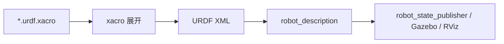

# 04 Xacro 实战

Xacro 是 XML Macros 的缩写，用来生成 URDF。URDF 本身是 XML，重复内容很多；Xacro 可以定义变量、宏、表达式和文件包含，让机器人模型更容易维护。

## 本篇学习目标

学完本篇后，你应该能：

- 把重复 URDF 片段抽成 Xacro macro；
- 用 property 管理尺寸、质量、颜色和开关；
- 用 include 拆分材料、惯性、传感器和控制配置；
- 生成 URDF 并用检查工具验证结果，而不是只看 Xacro 源文件。

## 为什么要用 Xacro

假设一个小车有左右两个轮子。纯 URDF 需要重复写两份 link、visual、collision、inertial、joint。以后轮子半径改了，你要改多个位置，容易漏。

Xacro 可以：

- 把尺寸定义成变量；
- 把重复结构写成宏；
- 把材料、惯性、传感器拆成多个文件；
- 用表达式计算位置；
- 根据参数启用或禁用模块。

Xacro 的处理链路：



调试时要记住：真正被下游工具消费的是展开后的 URDF，不是你写的 Xacro 源文件。

## 文件开头

典型 Xacro 文件：

```xml
<?xml version="1.0"?>
<robot xmlns:xacro="http://www.ros.org/wiki/xacro" name="mini_bot">
  ...
</robot>
```

必须声明 `xmlns:xacro`，否则 Xacro 标签无法识别。

## property

定义变量：

```xml
<xacro:property name="base_length" value="0.4"/>
<xacro:property name="base_width" value="0.3"/>
<xacro:property name="base_height" value="0.1"/>
<xacro:property name="wheel_radius" value="0.05"/>
```

使用变量：

```xml
<box size="${base_length} ${base_width} ${base_height}"/>
```

表达式：

```xml
<origin xyz="0 ${base_width / 2 + wheel_width / 2} ${-base_height / 2 + wheel_radius}"/>
```

建议：

- 尺寸、质量、颜色都放顶部；
- 变量名明确，不要用 `a`、`b`；
- 表达式不要过度复杂；
- 复杂公式可以拆成多个 property。

## macro

定义宏：

```xml
<xacro:macro name="box_inertial" params="mass x y z">
  <inertial>
    <mass value="${mass}"/>
    <inertia
      ixx="${mass / 12.0 * (y*y + z*z)}"
      ixy="0" ixz="0"
      iyy="${mass / 12.0 * (x*x + z*z)}"
      iyz="0"
      izz="${mass / 12.0 * (x*x + y*y)}"/>
  </inertial>
</xacro:macro>
```

调用宏：

```xml
<xacro:box_inertial mass="2.0" x="${base_length}" y="${base_width}" z="${base_height}"/>
```

宏常用于：

- 惯性公式；
- 左右轮；
- 相机；
- 雷达；
- 材料；
- 传动接口；
- Gazebo 插件配置。

## 条件

可以用参数控制是否启用某些部件：

```xml
<xacro:arg name="use_lidar" default="true"/>

<xacro:if value="$(arg use_lidar)">
  <link name="laser_link"/>
  <joint name="laser_joint" type="fixed">
    <parent link="base_link"/>
    <child link="laser_link"/>
  </joint>
</xacro:if>
```

也可以用 `unless`：

```xml
<xacro:unless value="$(arg use_camera)">
  <!-- 不使用相机时的替代内容 -->
</xacro:unless>
```

## include

拆分文件：

```xml
<xacro:include filename="$(find my_robot_description)/urdf/materials.xacro"/>
<xacro:include filename="$(find my_robot_description)/urdf/inertial_macros.xacro"/>
<xacro:include filename="$(find my_robot_description)/urdf/sensors.xacro"/>
```

常见拆分：

```text
urdf/
  robot.urdf.xacro
  materials.xacro
  inertial_macros.xacro
  wheels.xacro
  sensors.xacro
  ros2_control.xacro
```

主文件只保留结构，细节交给子文件。

拆分建议：

| 文件 | 建议内容 | 不建议放 |
| --- | --- | --- |
| `robot.urdf.xacro` | 主结构、include、顶层参数 | 大量重复 link 细节 |
| `materials.xacro` | 颜色和材质 | 关节或传感器逻辑 |
| `inertial_macros.xacro` | 常用惯性公式 | 具体机器人结构 |
| `sensors.xacro` | LiDAR、IMU、camera 宏 | 底盘控制器参数 |
| `ros2_control.xacro` | control interface 片段 | visual/collision 几何 |

## 轮子宏示例

```xml
<xacro:macro name="wheel" params="prefix y_sign">
  <link name="${prefix}_wheel_link">
    <visual>
      <origin rpy="1.5708 0 0"/>
      <geometry>
        <cylinder radius="${wheel_radius}" length="${wheel_width}"/>
      </geometry>
      <material name="dark_gray"/>
    </visual>
    <collision>
      <origin rpy="1.5708 0 0"/>
      <geometry>
        <cylinder radius="${wheel_radius}" length="${wheel_width}"/>
      </geometry>
    </collision>
    <xacro:cylinder_inertial mass="${wheel_mass}" radius="${wheel_radius}" length="${wheel_width}"/>
  </link>

  <joint name="${prefix}_wheel_joint" type="continuous">
    <parent link="base_link"/>
    <child link="${prefix}_wheel_link"/>
    <origin xyz="0 ${y_sign * wheel_y} ${wheel_z}" rpy="0 0 0"/>
    <axis xyz="0 1 0"/>
  </joint>
</xacro:macro>

<xacro:wheel prefix="left" y_sign="1"/>
<xacro:wheel prefix="right" y_sign="-1"/>
```

注意：如果右轮转向和预期相反，有些模型会把右轮 axis 写成 `0 -1 0`，有些控制器则要求左右轮 joint axis 一致。不要靠猜，应该启动后发布速度命令并观察正方向。

## 生成 URDF

命令：

```bash
ros2 run xacro xacro robot.urdf.xacro > robot.urdf
```

带参数：

```bash
ros2 run xacro xacro robot.urdf.xacro use_lidar:=true use_camera:=false > robot.urdf
```

检查：

```bash
check_urdf robot.urdf
```

如果报错，优先看：

- XML 标签是否闭合；
- 宏参数是否缺失；
- 变量名是否拼错；
- include 路径是否正确；
- 数学表达式是否能计算；
- 是否把字符串当数字参与计算。

建议把展开后的 URDF 保存到 `/tmp` 或 `build` 目录，不要把生成物长期提交成源文件，除非你明确需要给不支持 Xacro 的工具使用。

## Launch 中使用 Xacro

ROS 2 launch 常见写法是运行 Xacro 并把结果作为 `robot_description` 参数传给 `robot_state_publisher`：

```python
from launch import LaunchDescription
from launch_ros.actions import Node
from launch.substitutions import Command, PathJoinSubstitution
from launch_ros.substitutions import FindPackageShare

def generate_launch_description():
    robot_description_content = Command([
        "xacro ",
        PathJoinSubstitution([
            FindPackageShare("my_robot_description"),
            "urdf",
            "robot.urdf.xacro",
        ]),
    ])

    return LaunchDescription([
        Node(
            package="robot_state_publisher",
            executable="robot_state_publisher",
            parameters=[{"robot_description": robot_description_content}],
        )
    ])
```

## Xacro 风格建议

推荐：

- 文件名使用 `.urdf.xacro`；
- 顶部集中放 property；
- 宏名使用明确名词，如 `wheel`、`lidar_sensor`、`box_inertial`；
- 坐标和尺寸尽量通过变量计算；
- 每个宏只做一类事情；
- 宏参数不要太多，超过 8 个就考虑拆分或用更清晰的结构；
- 生成的 URDF 要定期检查，不要只看 Xacro 源文件。

不推荐：

- 在宏里隐藏太多 link 和 joint，导致 TF 树难以阅读；
- 到处硬编码尺寸；
- include 层级太深；
- 同名 property 到处覆盖；
- 把 Gazebo、ros2_control、传感器、外观全部塞在一个巨大的文件里。

## 学习练习

1. 把一个纯 URDF 小车改成 Xacro。
2. 抽取底盘尺寸、轮子半径、轮距、质量。
3. 写 `box_inertial` 和 `cylinder_inertial` 两个宏。
4. 写 `wheel` 宏生成左右轮。
5. 添加 `use_lidar` 参数控制是否生成雷达。
6. 生成 URDF，用 `check_urdf` 验证。
7. 在 RViz 中确认模型和 TF。

## 复习问题

1. 为什么 Xacro 能降低维护成本，但也可能增加调试难度？
2. property、arg、macro 分别适合解决什么问题？
3. 为什么要经常检查展开后的 URDF？
4. 一个宏参数太多时，说明设计上可能有什么问题？
5. 如果 include 路径找不到，应该检查哪些环境和包构建步骤？

## 参考资料

- ROS 2 Xacro 教程：[https://docs.ros.org/en/rolling/Tutorials/Intermediate/URDF/Using-Xacro-to-Clean-Up-a-URDF-File.html](https://docs.ros.org/en/rolling/Tutorials/Intermediate/URDF/Using-Xacro-to-Clean-Up-a-URDF-File.html)
- xacro 包文档：[https://docs.ros.org/en/rolling/p/xacro/](https://docs.ros.org/en/rolling/p/xacro/)

