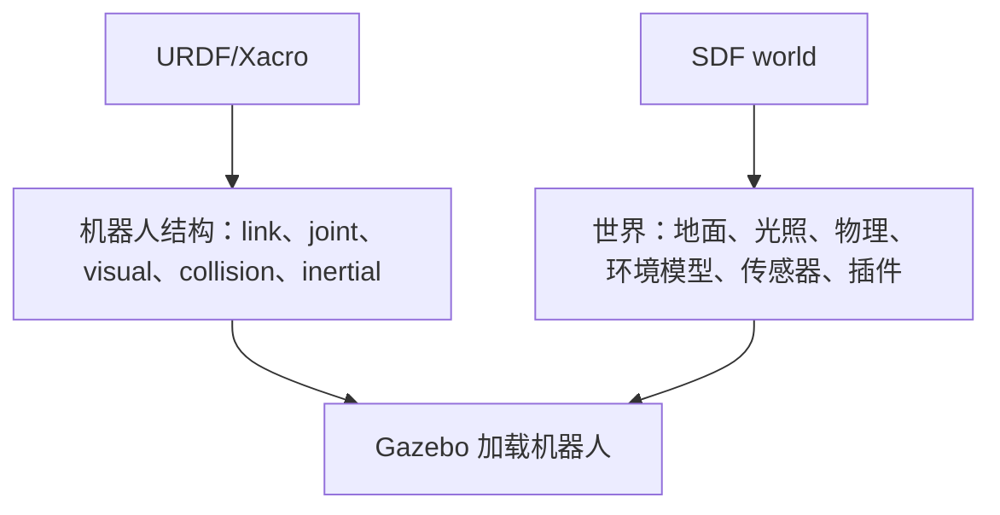
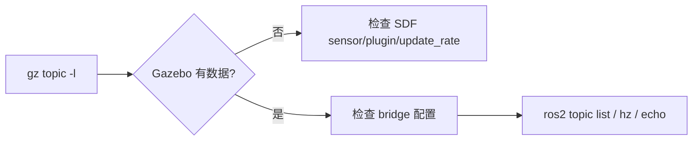

# 06 Gazebo Sim、SDF 和仿真世界

Gazebo Sim 是当前 Gazebo 的主线。它与 Gazebo Classic 不同，命令、插件、包名和 ROS 集成方式都有变化。新项目建议优先学习 Gazebo Sim。

## 本篇学习目标

学完本篇后，你应该能：

- 区分 Gazebo Sim、Gazebo Classic、SDF、URDF 的职责；
- 写出一个最小 SDF world；
- 把机器人模型加载到 Gazebo Sim；
- 判断一个话题是在 Gazebo transport 里，还是在 ROS 2 里；
- 解释为什么传感器和 `/clock` 经常需要 `ros_gz_bridge`。

## Gazebo Sim 与 Gazebo Classic

Gazebo Classic 是旧版，曾经常和 ROS 1、ROS 2 早期教程一起出现。它的很多教程仍然能帮助理解概念，但新项目不建议以它为主线。

Gazebo Sim 是新版 Gazebo，历史上曾叫 Ignition Gazebo。现在文档和命令多使用 `gz` 前缀。

学习时要特别注意教程中的关键词：

- `gazebo`、`gazebo_ros_pkgs`、Gazebo 11：多半是 Classic 路线；
- `gz sim`、`ros_gz`、Harmonic/Ionic/Jetty：多半是 Gazebo Sim 路线。

## SDF 是什么

SDF 即 Simulation Description Format，也叫 SDFormat。它是 Gazebo 主要使用的仿真描述格式。

SDF 可以描述：

- world；
- model；
- link；
- joint；
- collision；
- visual；
- sensor；
- light；
- physics；
- plugin；
- scene；
- actor。

URDF 更偏机器人结构，SDF 更偏完整仿真世界。

URDF/SDF 分工：



初学时的默认策略：机器人主体用 URDF/Xacro 维护，world 用 SDF 维护，Gazebo 特有参数再按需要补充。

## 最小 world

一个最小 SDF world：

```xml
<?xml version="1.0"?>
<sdf version="1.12">
  <world name="default">
    <gravity>0 0 -9.81</gravity>

    <light name="sun" type="directional">
      <pose>0 0 10 0 0 0</pose>
      <diffuse>0.8 0.8 0.8 1</diffuse>
      <specular>0.2 0.2 0.2 1</specular>
      <direction>-0.5 0.1 -0.9</direction>
    </light>

    <model name="ground_plane">
      <static>true</static>
      <link name="link">
        <collision name="collision">
          <geometry>
            <plane>
              <normal>0 0 1</normal>
              <size>100 100</size>
            </plane>
          </geometry>
        </collision>
        <visual name="visual">
          <geometry>
            <plane>
              <normal>0 0 1</normal>
              <size>100 100</size>
            </plane>
          </geometry>
        </visual>
      </link>
    </model>
  </world>
</sdf>
```

启动：

```bash
gz sim my_world.sdf
```

## world、model、link、joint

层级关系：

```text
sdf
  world
    model
      link
      joint
      plugin
    light
    physics
```

一个 world 可以包含多个 model。一个 model 可以包含多个 link 和 joint。静态环境通常用 `static=true`。

## URDF 和 SDF 的关系

URDF 可以被 Gazebo 加载，但 Gazebo 内部更接近 SDF。常见策略：

- 机器人结构用 URDF/Xacro 维护；
- 仿真世界用 SDF 维护；
- 特定 Gazebo 参数通过 URDF 中的 `<gazebo>` 扩展或 SDF 补充；
- 复杂模型可以直接写 SDF。

初学建议：机器人用 URDF/Xacro，world 用 SDF。

选择建议：

| 场景 | 优先格式 | 原因 |
| --- | --- | --- |
| ROS 2 中发布 TF 和 robot_description | URDF/Xacro | ROS 工具链支持好 |
| 复用参数和宏 | Xacro | 减少重复 |
| 定义仿真世界 | SDF | 支持 world、light、physics、scene |
| 多机器人和复杂环境 | SDF + ROS launch | 更清晰地管理 world 和 spawn |
| 复杂接触、传感器、插件 | SDF 或 Gazebo 扩展 | URDF 表达能力有限 |

## 加载机器人模型

常见方式：

1. Gazebo GUI 插入模型；
2. 命令行 spawn；
3. ROS 2 launch 中调用 `ros_gz_sim create` 或相关节点；
4. world 文件中直接 `<include>` 模型。

概念上，你需要把模型描述传给 Gazebo，并给它一个初始位姿。

示例思路：

```bash
ros2 run ros_gz_sim create -name mini_bot -file /tmp/mini_bot.urdf -x 0 -y 0 -z 0.1
```

实际命令参数以当前版本帮助为准：

```bash
ros2 run ros_gz_sim create --help
```

## Gazebo topic 和 ROS topic

Gazebo 有自己的 transport topic，ROS 2 有 ROS topic。它们不是同一套通信系统。

查看 Gazebo topic：

```bash
gz topic -l
gz topic -i -t /clock
```

查看 ROS 2 topic：

```bash
ros2 topic list
ros2 topic info /clock
```

如果 Gazebo 中有数据，ROS 2 看不到，通常需要桥接。

话题检查路径：



## ros_gz_bridge

桥接可以把 Gazebo 消息转换成 ROS 2 消息。

典型场景：

- `/clock`：仿真时间；
- `/scan`：激光雷达；
- `/imu`：IMU；
- `/camera/image`：相机；
- `/cmd_vel`：速度命令；
- `/model/.../odometry`：里程计。

桥接方向：

- Gazebo -> ROS 2：传感器数据、clock、状态；
- ROS 2 -> Gazebo：控制命令；
- 双向：某些控制或状态话题。

## 物理参数

world 中可以配置 physics：

```xml
<physics name="default_physics" type="ode">
  <max_step_size>0.001</max_step_size>
  <real_time_factor>1.0</real_time_factor>
</physics>
```

概念：

- `max_step_size`：每个物理步的仿真时间；
- `real_time_factor`：仿真时间相对真实时间的比例；
- 更新频率约等于 `1 / max_step_size`。

如果控制器频率是 100Hz，物理步长 0.001s 通常足够。如果物理步长太大，接触和控制可能不稳定。

## 传感器模拟

SDF 中可以给 link 添加 sensor：

```xml
<sensor name="lidar" type="gpu_lidar">
  <topic>scan</topic>
  <update_rate>10</update_rate>
  <lidar>
    <scan>
      <horizontal>
        <samples>360</samples>
        <min_angle>-3.14159</min_angle>
        <max_angle>3.14159</max_angle>
      </horizontal>
    </scan>
    <range>
      <min>0.1</min>
      <max>10.0</max>
    </range>
  </lidar>
</sensor>
```

传感器要关注：

- topic；
- update_rate；
- frame；
- 噪声；
- 量程；
- 分辨率；
- 是否需要桥接到 ROS 2。

## Fuel 模型库

Gazebo Fuel 是在线模型库，可以下载环境和模型。学习时可以用它快速搭世界，但不要把它当作理解 URDF/SDF 的替代品。

使用外部模型时检查：

- 许可证；
- 单位；
- 模型尺寸；
- collision 是否合理；
- 是否包含过时插件；
- 是否适配当前 Gazebo 版本。

## 学习练习

1. 写一个只有地面和太阳光的 world。
2. 加入一个静态 box 当障碍物。
3. 把自己的 URDF 小车 spawn 进去。
4. 查看 Gazebo topic。
5. 桥接 `/clock` 到 ROS 2。
6. 让 RViz 使用仿真时间。
7. 加激光雷达并在 RViz 中显示 scan。
8. 调整地面摩擦，观察小车运动变化。

## 复习问题

1. 为什么 world 更适合用 SDF，而不是 URDF？
2. `gz topic -l` 能看到 `/scan`，但 `ros2 topic list` 看不到，最可能缺什么？
3. `max_step_size=0.001` 大致对应多少 Hz 的物理更新？
4. Fuel 模型下载后为什么还要检查 license、尺寸和 collision？
5. Gazebo Classic 教程迁移到 Gazebo Sim 时，最容易不一致的地方有哪些？

## 参考资料

- [Gazebo Harmonic 文档](https://gazebosim.org/docs/harmonic/)
- [Gazebo ROS 2 集成概览](https://gazebosim.org/docs/harmonic/ros2_overview/)
- [SDFormat 规范](https://sdformat.org/spec/)
- [Gazebo Fuel](https://app.gazebosim.org/)

