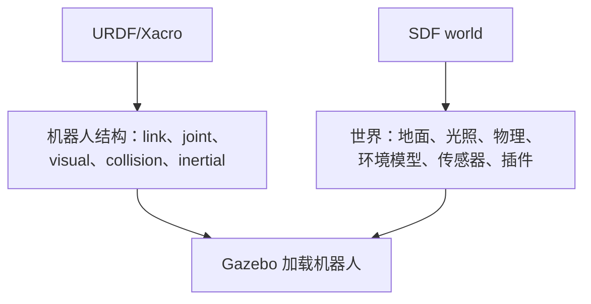
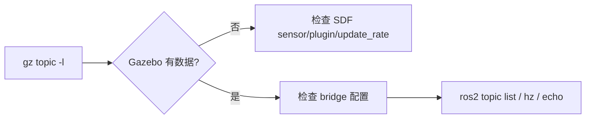
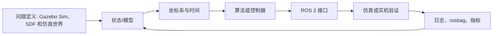

# 06 Gazebo Sim、SDF 和仿真世界

<!-- lecture-notes:integrated-v2 -->

## 讲义导读：把机器人当成可验证的闭环系统

这一章讲的是 **06 Gazebo Sim、SDF 和仿真世界**。阅读时不要只记命令、参数或算法名，而要把它放进机器人闭环：模型是否描述真实机器人，坐标系和时间是否一致，传感器数据是否可信，状态估计是否稳定，规划结果是否可执行，控制命令是否安全，仿真和真机差异是否被验证。机器人学习的关键不是让 demo 偶然跑通，而是能解释每个模块为什么工作、怎样失败、如何调试。

### 一句话先懂

机器人仿真不是画一个模型好看，而是让几何、惯性、碰撞、传感器、控制接口和物理环境足够接近真实系统。

### 通俗类比

可以把机器人想成一个会移动、会感知、会决策的闭环系统：传感器像眼睛和耳朵，TF 和状态估计像方向感，地图像环境记忆，规划器像路线顾问，控制器像肌肉和反射，仿真像训练场，安全机制像刹车和护栏。任何一环的单位、方向、时间或边界错了，整机表现都会变差。

类比只能帮助建立直觉。回到工程上，要把每个模块写成输入、输出、坐标系、时间戳、参数、频率、误差来源和验收指标。只有这些信息清楚，才知道问题是来自硬件、驱动、模型、通信、算法、控制还是环境。

### 本章学习主线

1. **模型和坐标**：先确认 URDF/SDF、TF、外参、单位和 REP 103/105 约定是否正确。
2. **数据和时间**：检查 Topic、QoS、Header、frame_id、timestamp、use_sim_time 和 rosbag 回放是否一致。
3. **算法和接口**：弄清输入数据是什么，输出命令或估计是什么，中间参数控制什么物理或数学含义。
4. **闭环和反馈**：观察命令是否被执行，执行结果是否反馈到 odom、TF、状态估计或任务层。
5. **失败和安全**：记录不动、乱动、漂移、震荡、穿墙、丢图、延迟、碰撞和失联时的排查顺序。
6. **仿真到真机**：把仿真中默认理想化的部分逐项换成真实约束，例如摩擦、延迟、噪声、限幅和电源。

### 概念怎么学才不容易忘

遇到机器人概念时，建议按 白话作用 -> ROS 2 接口 -> 坐标时间 -> 最小实验 -> 典型故障 -> 调试命令 六步学习。比如学习 TF，不只背 map、odom、base_link，还要知道谁发布、频率多少、时间戳是否能查到；学习控制器，不只看 cmd_vel 是否发布，还要看底盘是否执行、odom 是否反馈、限速和急停是否生效。

### 最小实践任务

建立一个两轮差速小车 URDF/Xacro，接入 ros2_control 和 Gazebo Sim，检查 TF、joint、collision、inertial、传感器数据和 cmd_vel 到 odom 的闭环。

实践时要保留失败记录：TF 断裂、QoS 不匹配、use_sim_time 忘开、frame_id 写错、惯性参数不合理、footprint 偏小、传感器外参偏差、控制频率不足。机器人系统的经验很大一部分来自这些可复现的错误。

### 读完本章应该能做到

- 用自己的话解释本章主题在机器人闭环中的位置。
- 画出最小数据流，标明 Topic、Service、Action、TF、参数和启动文件。
- 说出至少三个常见失败现象，并给出对应的检查命令或观测信号。
- 解释关键参数的物理意义，而不是只复制默认 YAML。
- 能说明 URDF、Xacro、SDF、Gazebo Sim、ros2_control、传感器插件和仿真时间之间的关系，并知道仿真到真机差异来自哪里。

> 本节是讲义化阅读入口，后续正文中的 ROS 2 接口、坐标系、算法、仿真、控制和调试内容都应围绕这条机器人闭环来理解。
Gazebo Sim 是当前 Gazebo 的主线。它与 Gazebo Classic 不同，命令、插件、包名和 ROS 集成方式都有变化。新项目建议优先学习 Gazebo Sim。

## 本篇学习目标

学完本篇后，你应该能：

- 区分 Gazebo Sim、Gazebo Classic、SDF、URDF 的职责；
- 写出一个最小 SDF world；
- 把机器人模型加载到 Gazebo Sim；
- 判断一个话题是在 Gazebo transport 里，还是在 ROS 2 里；
- 解释为什么传感器和 `/clock` 经常需要 `ros_gz_bridge`。

## Gazebo Sim 与 Gazebo Classic

Gazebo Classic 是旧版，曾经常和 ROS 1、ROS 2 早期教程一起出现。它的很多教程仍然能帮助理解概念，但新项目不建议以它为主线。

Gazebo Sim 是新版 Gazebo，历史上曾叫 Ignition Gazebo。现在文档和命令多使用 `gz` 前缀。

学习时要特别注意教程中的关键词：

- `gazebo`、`gazebo_ros_pkgs`、Gazebo 11：多半是 Classic 路线；
- `gz sim`、`ros_gz`、Harmonic/Ionic/Jetty：多半是 Gazebo Sim 路线。

## SDF 是什么

SDF 即 Simulation Description Format，也叫 SDFormat。它是 Gazebo 主要使用的仿真描述格式。

SDF 可以描述：

- world；
- model；
- link；
- joint；
- collision；
- visual；
- sensor；
- light；
- physics；
- plugin；
- scene；
- actor。

URDF 更偏机器人结构，SDF 更偏完整仿真世界。

URDF/SDF 分工：



初学时的默认策略：机器人主体用 URDF/Xacro 维护，world 用 SDF 维护，Gazebo 特有参数再按需要补充。

## 最小 world

一个最小 SDF world：

```xml
<?xml version="1.0"?>
<sdf version="1.12">
  <world name="default">
    <gravity>0 0 -9.81</gravity>

    <light name="sun" type="directional">
      <pose>0 0 10 0 0 0</pose>
      <diffuse>0.8 0.8 0.8 1</diffuse>
      <specular>0.2 0.2 0.2 1</specular>
      <direction>-0.5 0.1 -0.9</direction>
    </light>

    <model name="ground_plane">
      <static>true</static>
      <link name="link">
        <collision name="collision">
          <geometry>
            <plane>
              <normal>0 0 1</normal>
              <size>100 100</size>
            </plane>
          </geometry>
        </collision>
        <visual name="visual">
          <geometry>
            <plane>
              <normal>0 0 1</normal>
              <size>100 100</size>
            </plane>
          </geometry>
        </visual>
      </link>
    </model>
  </world>
</sdf>
```

启动：

```bash
gz sim my_world.sdf
```

## world、model、link、joint

层级关系：

```text
sdf
  world
    model
      link
      joint
      plugin
    light
    physics
```

一个 world 可以包含多个 model。一个 model 可以包含多个 link 和 joint。静态环境通常用 `static=true`。

## URDF 和 SDF 的关系

URDF 可以被 Gazebo 加载，但 Gazebo 内部更接近 SDF。常见策略：

- 机器人结构用 URDF/Xacro 维护；
- 仿真世界用 SDF 维护；
- 特定 Gazebo 参数通过 URDF 中的 `<gazebo>` 扩展或 SDF 补充；
- 复杂模型可以直接写 SDF。

初学建议：机器人用 URDF/Xacro，world 用 SDF。

选择建议：

| 场景 | 优先格式 | 原因 |
| --- | --- | --- |
| ROS 2 中发布 TF 和 robot_description | URDF/Xacro | ROS 工具链支持好 |
| 复用参数和宏 | Xacro | 减少重复 |
| 定义仿真世界 | SDF | 支持 world、light、physics、scene |
| 多机器人和复杂环境 | SDF + ROS launch | 更清晰地管理 world 和 spawn |
| 复杂接触、传感器、插件 | SDF 或 Gazebo 扩展 | URDF 表达能力有限 |

## 加载机器人模型

常见方式：

1. Gazebo GUI 插入模型；
2. 命令行 spawn；
3. ROS 2 launch 中调用 `ros_gz_sim create` 或相关节点；
4. world 文件中直接 `<include>` 模型。

概念上，你需要把模型描述传给 Gazebo，并给它一个初始位姿。

示例思路：

```bash
ros2 run ros_gz_sim create -name mini_bot -file /tmp/mini_bot.urdf -x 0 -y 0 -z 0.1
```

实际命令参数以当前版本帮助为准：

```bash
ros2 run ros_gz_sim create --help
```

## Gazebo topic 和 ROS topic

Gazebo 有自己的 transport topic，ROS 2 有 ROS topic。它们不是同一套通信系统。

查看 Gazebo topic：

```bash
gz topic -l
gz topic -i -t /clock
```

查看 ROS 2 topic：

```bash
ros2 topic list
ros2 topic info /clock
```

如果 Gazebo 中有数据，ROS 2 看不到，通常需要桥接。

话题检查路径：



## ros_gz_bridge

桥接可以把 Gazebo 消息转换成 ROS 2 消息。

典型场景：

- `/clock`：仿真时间；
- `/scan`：激光雷达；
- `/imu`：IMU；
- `/camera/image`：相机；
- `/cmd_vel`：速度命令；
- `/model/.../odometry`：里程计。

桥接方向：

- Gazebo -> ROS 2：传感器数据、clock、状态；
- ROS 2 -> Gazebo：控制命令；
- 双向：某些控制或状态话题。

## 物理参数

world 中可以配置 physics：

```xml
<physics name="default_physics" type="ode">
  <max_step_size>0.001</max_step_size>
  <real_time_factor>1.0</real_time_factor>
</physics>
```

概念：

- `max_step_size`：每个物理步的仿真时间；
- `real_time_factor`：仿真时间相对真实时间的比例；
- 更新频率约等于 `1 / max_step_size`。

如果控制器频率是 100Hz，物理步长 0.001s 通常足够。如果物理步长太大，接触和控制可能不稳定。

## 传感器模拟

SDF 中可以给 link 添加 sensor：

```xml
<sensor name="lidar" type="gpu_lidar">
  <topic>scan</topic>
  <update_rate>10</update_rate>
  <lidar>
    <scan>
      <horizontal>
        <samples>360</samples>
        <min_angle>-3.14159</min_angle>
        <max_angle>3.14159</max_angle>
      </horizontal>
    </scan>
    <range>
      <min>0.1</min>
      <max>10.0</max>
    </range>
  </lidar>
</sensor>
```

传感器要关注：

- topic；
- update_rate；
- frame；
- 噪声；
- 量程；
- 分辨率；
- 是否需要桥接到 ROS 2。

## Fuel 模型库

Gazebo Fuel 是在线模型库，可以下载环境和模型。学习时可以用它快速搭世界，但不要把它当作理解 URDF/SDF 的替代品。

使用外部模型时检查：

- 许可证；
- 单位；
- 模型尺寸；
- collision 是否合理；
- 是否包含过时插件；
- 是否适配当前 Gazebo 版本。

## 学习练习

1. 写一个只有地面和太阳光的 world。
2. 加入一个静态 box 当障碍物。
3. 把自己的 URDF 小车 spawn 进去。
4. 查看 Gazebo topic。
5. 桥接 `/clock` 到 ROS 2。
6. 让 RViz 使用仿真时间。
7. 加激光雷达并在 RViz 中显示 scan。
8. 调整地面摩擦，观察小车运动变化。

## 复习问题

1. 为什么 world 更适合用 SDF，而不是 URDF？
2. `gz topic -l` 能看到 `/scan`，但 `ros2 topic list` 看不到，最可能缺什么？
3. `max_step_size=0.001` 大致对应多少 Hz 的物理更新？
4. Fuel 模型下载后为什么还要检查 license、尺寸和 collision？
5. Gazebo Classic 教程迁移到 Gazebo Sim 时，最容易不一致的地方有哪些？

## 2026 机器人资料与版本核对补充

机器人生态版本变化很快，尤其是 ROS 2 发行版、Gazebo Sim、Nav2、ros2_control、MoveIt 2、SLAM Toolbox 和各类驱动包。复现实验前应记录 ROS 2 发行版、Ubuntu 版本、RMW 实现、工作空间 source 顺序、Gazebo 版本、机器人模型文件、参数 YAML、传感器驱动版本、固件版本和仿真或真机环境。

排错时优先核对官方文档、REP 标准和当前发行版文档。社区教程很适合入门和排坑，但包名、插件名、参数名、launch 文件和命令可能随发行版变化。尤其是 Nav2、Gazebo Sim 和 ros2_control，建议按当前项目使用的发行版页面核对，而不是混用 Humble、Iron、Jazzy、Kilted 或 Rolling 的教程。

### 资料入口

- ROS 2 Documentation: https://docs.ros.org/
- ROS 2 Jazzy Documentation: https://docs.ros.org/en/jazzy/
- Nav2 Documentation: https://docs.nav2.org/
- Gazebo Sim Documentation: https://gazebosim.org/docs/
- Gazebo ROS 2 integration: https://gazebosim.org/docs/latest/ros2_integration/
- ros2_control Documentation: https://control.ros.org/
- MoveIt 2 Documentation: https://moveit.picknik.ai/main/index.html
- REP 103 Standard Units and Coordinate Conventions: https://www.ros.org/reps/rep-0103.html
- REP 105 Coordinate Frames for Mobile Platforms: https://www.ros.org/reps/rep-0105.html
- SLAM Toolbox: https://github.com/SteveMacenski/slam_toolbox

仿真章节要特别核对 collision、inertial、joint limit、transmission、controller、sensor plugin 和 sim time。模型看起来正确不代表物理正确，惯性和碰撞错误会直接导致控制震荡或仿真穿模。

## 参考资料

- [Gazebo Harmonic 文档](https://gazebosim.org/docs/harmonic/)
- [Gazebo ROS 2 集成概览](https://gazebosim.org/docs/harmonic/ros2_overview/)
- [SDFormat 规范](https://sdformat.org/spec/)
- [Gazebo Fuel](https://app.gazebosim.org/)
## 2026-06 深化精讲补充：Gazebo Sim、SDF 和仿真世界

Last researched: 2026-06-16

### 本篇在仿真体系中的位置

Gazebo Sim 更强调现代 Gazebo 生态，SDF 负责描述仿真环境和插件细节。 本篇关注的重点是：Gazebo Sim、SDF、world、model、plugin、传感器和 ROS 2 集成。机器人仿真不是单纯运行一个窗口，而是一条从模型文件到 ROS 2 接口、从物理引擎到上层算法的闭环链路。任何一层没有验证，后续问题都会以更隐蔽的形式出现。



Figure: 本图为面向机器人学习笔记的通用工程闭环，综合 ROS 2、REP 103/105、Nav2、Gazebo Sim 与 ros2_control 官方资料重新整理。


### 分层理解

| 层级 | 主要对象 | 应确认的问题 | 常用工具 |
| --- | --- | --- | --- |
| 模型层 | URDF、Xacro、SDF、mesh | link/joint 是否正确，单位是否为 SI，惯性和碰撞是否合理 | `xacro`、`check_urdf`、RViz |
| TF 层 | `map`、`odom`、`base_link`、传感器 frame | 坐标树是否连通，parent/child 是否正确，时间戳是否可查询 | `view_frames`、`tf2_echo` |
| 物理层 | 质量、惯量、摩擦、接触、重力 | 是否抖动、飞走、穿模，仿真步长是否稳定 | Gazebo GUI、日志 |
| 控制层 | ros2_control、controller manager、控制器 | 控制器是否 loaded/active，joint 名称和接口是否匹配 | `ros2 control`、`ros2 topic echo /cmd_vel` |
| 传感器层 | LaserScan、IMU、Image、PointCloud2 | frame、频率、QoS、噪声和桥接是否正确 | `ros2 topic hz/info -v`、RViz |
| 算法层 | SLAM、Nav2、MoveIt 2、任务节点 | 输入是否完整，生命周期是否 active，恢复策略是否有效 | Nav2 日志、rosbag2 |

### 工程流程精讲

第一步是固定版本。ROS 2、Gazebo Sim、ros_gz、ros2_control 和 Nav2 的版本组合必须以官方文档为准。Jazzy 与 Humble 的包名、默认中间件、Gazebo 推荐版本和教程细节可能不同。跟教程学习时不要混用 ROS 1、Gazebo Classic、Ignition 旧命名和 Gazebo Sim 新命名。

第二步是建立最小模型。最小模型只需要一个 `base_link`、简单几何体、必要的 `collision` 和 `inertial`。先让它在 RViz 中显示，再让它在 Gazebo 中稳定落地。这个阶段不要急着加 Nav2、SLAM 或复杂 mesh，因为它们会掩盖模型错误。

第三步是补齐控制闭环。移动机器人通常需要把 `/cmd_vel` 变成轮子关节速度，机械臂需要把轨迹控制器和关节状态接通。ros2_control 的价值是统一仿真和实机接口，但它要求硬件接口、控制器配置、joint 名称、command/state interface 严格一致。

第四步是接入传感器。Gazebo 内部 topic 和 ROS 2 topic 不是同一个系统，Gazebo Sim 常通过 `ros_gz_bridge` 进行消息桥接。桥接前要确认消息类型受支持，桥接方向正确，frame_id 和仿真时间正确传递。

第五步才是上层算法。Nav2、SLAM、定位和任务逻辑都假设底层模型、TF、控制和传感器基本可信。若底层未验证就直接调 Nav2 参数，常见结果是参数越改越乱。

### 最小验证项目

建议把本篇内容落实到一个 `my_robot_description` + `my_robot_bringup` 工作空间中：

```text
robot_ws/src/
  my_robot_description/
    urdf/
    meshes/
    rviz/
    launch/
  my_robot_bringup/
    launch/
    config/
  my_robot_control/
    config/
  my_robot_navigation/
    maps/
    params/
```

验收标准不是“能启动 Gazebo”，而是以下每一项都能独立证明：`robot_description` 能生成，TF 树连通，模型在 RViz 中方向正确，Gazebo 中不抖动，控制器 active，`/cmd_vel` 后轮子和底盘运动方向正确，传感器话题有稳定频率，`use_sim_time` 在所有相关节点一致。

### 常见实践坑

- `visual` 正常不代表 `collision` 和 `inertial` 正常。RViz 只看显示和 TF，Gazebo 还要计算物理。
- 复杂 mesh 不适合直接做碰撞。碰撞体应尽量用 box、cylinder、sphere 或简化网格。
- 动态 link 没有合理惯性时，仿真容易抖动、飞走或在接触时爆炸。
- `base_link`、`base_footprint`、`odom`、`map` 的语义要遵循 REP 105，不要为了“看起来能跑”随意改 frame 名。
- Gazebo world 坐标和 ROS `map` 坐标不是天然同一个概念。需要明确谁发布哪条 TF。
- `ros_gz_bridge` 只桥接配置过且支持的消息类型。看到 Gazebo 有 topic 不代表 ROS 2 一定能收到。
- QoS 不匹配会导致 topic 存在但订阅不到，尤其是传感器数据和地图数据。
- 仿真时间 `/clock` 必须被所有算法节点一致使用，否则 TF 查询和 rosbag 回放会出现时间错位。
- 控制器 loaded 不等于 active，active 不等于 joint interface 名称正确。
- Nav2 失败时先查 TF、里程计、传感器和 costmap，再讨论 planner/controller 参数。

### 调试顺序

1. `ros2 doctor` 和环境变量：确认 ROS 发行版、Domain ID、RMW 和 source 顺序。
2. `ros2 pkg list` / `ros2 launch`：确认包能被找到，launch 文件能被安装。
3. `ros2 param get /robot_state_publisher robot_description`：确认模型实际传入。
4. `ros2 run tf2_tools view_frames`：确认 TF 树没有断裂和重复发布。
5. Gazebo 中暂停/单步观察模型：确认物理稳定。
6. `ros2 control list_controllers`：确认控制器状态。
7. `ros2 topic info -v`：检查关键 topic 的类型、QoS、发布者和订阅者。
8. RViz 同时显示 TF、RobotModel、LaserScan、Odometry、Map 和 Path。
9. 录制 rosbag2，离线复现问题，避免每次重新跑完整仿真。

### 从仿真迁移到实机

仿真到实机的关键不是“代码完全不变”，而是接口和假设可控。URDF 可以复用，但质量、摩擦、传感器噪声、延迟和控制饱和需要实测校准。ros2_control 能让控制器层更容易复用，但硬件接口必须处理通信超时、编码器异常、电机使能、急停和安全限速。Nav2 参数也要根据真实机器人最大速度、加速度、制动距离、定位误差和传感器盲区重新调整。

### 推荐练习

- 从零写一个只有底盘和两个轮子的 URDF/Xacro，并在 RViz 中验证 TF。
- 给模型添加 collision 和 inertial，观察缺失或错误参数对 Gazebo 稳定性的影响。
- 用 ros2_control 接入差速控制器，发布 `/cmd_vel` 验证正转、倒车和原地旋转。
- 添加 2D LiDAR，用 `ros_gz_bridge` 桥接到 ROS 2，并在 RViz 中显示 `/scan`。
- 录制 `/tf`、`/odom`、`/scan`、`/cmd_vel` 和 `/clock`，用 rosbag2 回放排查。

## References and further reading

- [Official] [ROS 2 Documentation](https://docs.ros.org/)
- [Official] [ROS 2 Jazzy Documentation](https://docs.ros.org/en/jazzy/)
- [Standard] [REP 103: Standard Units of Measure and Coordinate Conventions](https://www.ros.org/reps/rep-0103.html)
- [Standard] [REP 105: Coordinate Frames for Mobile Platforms](https://www.ros.org/reps/rep-0105.html)
- [Book / Course] [Modern Robotics](https://modernrobotics.northwestern.edu/)
- [Book] [Probabilistic Robotics](https://mitpress.mit.edu/9780262303804/probabilistic-robotics/)
- [Book] [State Estimation for Robotics](https://www.cambridge.org/core/books/state-estimation-for-robotics/00E53274A2F1E6CC1A55CA5C3D1C9718)
- [Course] [MIT Underactuated Robotics](https://underactuated.mit.edu/)
- [Official] [Nav2 Documentation](https://docs.nav2.org/)
- [Official] [Gazebo Sim Documentation](https://gazebosim.org/docs/latest/)
- [Official] [SDFormat Documentation](https://sdformat.org/)
- [Official] [ros2_control Documentation](https://control.ros.org/)
- [Community] [ROS2 Control分析讲解 - CSDN](https://blog.csdn.net/Bing_Lee/article/details/135003678)
- [Community] [在机器人仿真中使用 ros2_control - CSDN](https://blog.csdn.net/apingna/article/details/148333455)
- [Community] [ROS2 SLAM 建图导航 - 掘金](https://juejin.cn/post/7101201729122730020)
- [Community] [机器人导航仿真 - 博客园](https://www.cnblogs.com/zjh1170/p/16133766.html)
- [Official] [Use ROS 2 to interact with Gazebo](https://gazebosim.org/docs/latest/ros2_integration/)
- [Official] [Installing Gazebo with ROS](https://gazebosim.org/docs/latest/ros_installation/)
- [Official] [ros_gz_bridge package documentation](https://docs.ros.org/en/jazzy/p/ros_gz_bridge/)
- [Official] [SDFormat model kinematics](https://sdformat.org/tutorials/specification/spec_model_kinematics/)

## References and further reading

- [Official] [ROS 2 Documentation](https://docs.ros.org/)
- [Official] [ROS 2 Jazzy Documentation](https://docs.ros.org/en/jazzy/)
- [Official] [Nav2 Documentation](https://docs.nav2.org/)
- [Official] [Gazebo Sim Documentation](https://gazebosim.org/docs/latest/)
- [Official] [Gazebo ROS 2 integration](https://gazebosim.org/docs/latest/ros2_integration/)
- [Official] [SDFormat Documentation](https://sdformat.org/)
- [Official] [ros2_control Documentation](https://control.ros.org/)
- [Standard] [REP 103: Standard Units of Measure and Coordinate Conventions](https://www.ros.org/reps/rep-0103.html)
- [Standard] [REP 105: Coordinate Frames for Mobile Platforms](https://www.ros.org/reps/rep-0105.html)
- [Book / Course] [Modern Robotics](https://modernrobotics.northwestern.edu/)
- [Book] [Probabilistic Robotics](https://mitpress.mit.edu/9780262303804/probabilistic-robotics/)
- [Book] [State Estimation for Robotics](https://www.cambridge.org/core/books/state-estimation-for-robotics/00E53274A2F1E6CC1A55CA5C3D1C9718)
- [Course] [MIT Underactuated Robotics](https://underactuated.mit.edu/)
- [Source] [ros2_control_demos](https://github.com/ros-controls/ros2_control_demos)
- [Community] [ROS2 Control分析讲解 - CSDN](https://blog.csdn.net/Bing_Lee/article/details/135003678)
- [Community] [在机器人仿真中使用 ros2_control - CSDN](https://blog.csdn.net/apingna/article/details/148333455)
- [Community] [ROS2 SLAM 建图导航 - 掘金](https://juejin.cn/post/7101201729122730020)
- [Community] [机器人导航仿真 - 博客园](https://www.cnblogs.com/zjh1170/p/16133766.html)
