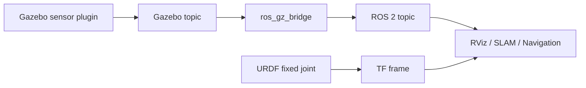

# 07 控制、ros2_control 和传感器

机器人仿真不仅要把模型放进世界，还要让它能被控制，并产生接近真实机器人的传感器数据。

## 本篇学习目标

学完本篇后，你应该能：

- 解释 `/cmd_vel` 到轮子关节再到里程计的控制链路；
- 区分 controller、controller manager、hardware interface、command/state interface；
- 写出差速控制器 YAML 的关键参数；
- 按层次排查小车不动、传感器没数据、TF 冲突和仿真时间问题。

## 控制链路

典型移动机器人控制链路：

```text
/cmd_vel
  -> diff_drive_controller
  -> left_wheel_joint / right_wheel_joint
  -> Gazebo physics
  -> odometry / joint_states / TF
```

更完整的仿真控制架构：

```mermaid
flowchart LR
  A[/cmd_vel] --> B[diff_drive_controller]
  B --> C[command interface: wheel velocity]
  C --> D[Gazebo Sim hardware/plugin layer]
  D --> E[left/right wheel joints]
  E --> F[Gazebo physics]
  F --> G[joint_states / odom]
  G --> H[robot_state_publisher / TF]
```

如果小车不动，按这条链路从左到右查；如果 TF 或 odom 不对，按这条链路从右往左查。

典型机械臂控制链路：

```text
trajectory command
  -> joint_trajectory_controller
  -> arm joints
  -> Gazebo physics
  -> joint_states / TF
```

## ros2_control 概念

`ros2_control` 把机器人控制抽象成：

- hardware interface：硬件或仿真硬件接口；
- controller manager：控制器管理器；
- controller：具体控制器；
- command interface：命令接口，如 position、velocity、effort；
- state interface：状态接口，如 position、velocity、effort。

真实机器人和仿真机器人可以尽量共用上层控制器，只替换 hardware interface。

## URDF 中的 ros2_control 片段

示例：

```xml
<ros2_control name="GazeboSystem" type="system">
  <hardware>
    <plugin>gz_ros2_control/GazeboSimSystem</plugin>
  </hardware>

  <joint name="left_wheel_joint">
    <command_interface name="velocity"/>
    <state_interface name="position"/>
    <state_interface name="velocity"/>
  </joint>

  <joint name="right_wheel_joint">
    <command_interface name="velocity"/>
    <state_interface name="position"/>
    <state_interface name="velocity"/>
  </joint>
</ros2_control>
```

具体插件名称会随 Gazebo/ROS 版本和安装包变化，写项目时要以对应发行版文档为准。

注意两类配置不要混淆：

| 配置 | 位置 | 作用 |
| --- | --- | --- |
| `<ros2_control>` | URDF/Xacro | 声明 joint 暴露哪些 command/state interface |
| Gazebo/`gz_ros2_control` 插件 | URDF/SDF/Gazebo 配置 | 把 Gazebo 仿真系统接入 ros2_control |
| `controllers.yaml` | config | 配置具体控制器，例如差速、关节轨迹、joint state broadcaster |

不同发行版的插件类名、库名和安装包可能变化。Jazzy + Gazebo Harmonic 项目应优先查 `gz_ros2_control` Jazzy 文档，而不是照搬 Gazebo Classic 的 `gazebo_ros2_control` 示例。

## controllers.yaml

差速控制器示例结构：

```yaml
controller_manager:
  ros__parameters:
    update_rate: 100

    joint_state_broadcaster:
      type: joint_state_broadcaster/JointStateBroadcaster

    diff_drive_controller:
      type: diff_drive_controller/DiffDriveController

diff_drive_controller:
  ros__parameters:
    left_wheel_names: ["left_wheel_joint"]
    right_wheel_names: ["right_wheel_joint"]
    wheel_separation: 0.33
    wheel_radius: 0.05
    cmd_vel_timeout: 0.5
    publish_rate: 50.0
    base_frame_id: base_link
    odom_frame_id: odom
    enable_odom_tf: true
```

关键参数：

- `left_wheel_names`、`right_wheel_names`：必须和 URDF joint 名称一致；
- `wheel_separation`：左右轮接触中心距离；
- `wheel_radius`：轮子半径；
- `base_frame_id`：底盘坐标系；
- `odom_frame_id`：里程计坐标系；
- `enable_odom_tf`：是否由控制器发布 odom 到 base 的 TF。

差速底盘最容易错的是三个参数：`left_wheel_names`、`right_wheel_names`、`wheel_separation`。它们必须和模型真实结构一致，否则小车可能不动、转向反、里程计尺度错误。

## 控制器加载

常见命令：

```bash
ros2 control list_controllers
ros2 control list_joints
ros2 control list_hardware_interfaces
```

加载控制器：

```bash
ros2 control load_controller --set-state active joint_state_broadcaster
ros2 control load_controller --set-state active diff_drive_controller
```

如果控制器 inactive 或 failed，检查：

- controller type 是否安装；
- YAML 缩进是否正确；
- joint 名称是否正确；
- command/state interface 是否匹配；
- hardware plugin 是否加载成功；
- Gazebo 插件是否启动。

## 发布速度命令

差速小车常用 `/cmd_vel`：

```bash
ros2 topic pub /cmd_vel geometry_msgs/msg/Twist "{linear: {x: 0.2}, angular: {z: 0.0}}"
```

原地旋转：

```bash
ros2 topic pub /cmd_vel geometry_msgs/msg/Twist "{linear: {x: 0.0}, angular: {z: 0.5}}"
```

如果小车不动：

- `/cmd_vel` 话题名是否正确；
- 控制器是否 active；
- joint interface 是否 velocity；
- 轮子 joint 是否 continuous；
- 轮子 collision 是否接触地面；
- 是否使用了 namespace；
- Gazebo 是否暂停。

## joint_states

`/joint_states` 包含关节位置、速度和力矩：

```bash
ros2 topic echo /joint_states
```

robot_state_publisher 根据 `/joint_states` 和 URDF 发布动态 TF。

注意：

- fixed joint 不出现在 `/joint_states` 中；
- continuous joint 的 position 可能不断增大；
- 如果 `/joint_states` 没有某个关节，TF 中对应 child link 可能不会按预期运动。

## 传感器建模原则

传感器不是只要有话题就行，还要关注：

- 安装位置；
- 坐标系方向；
- 更新频率；
- 延迟；
- 噪声；
- 分辨率；
- 量程；
- 是否和真实硬件一致。

传感器数据链路：



一个传感器能被算法使用，至少要同时满足：有数据、有正确 frame、有时间戳、有合理频率和噪声。

## 激光雷达

2D LiDAR 常用于 SLAM 和导航。

关键参数：

- 水平扫描角度；
- 样本数；
- 最小距离；
- 最大距离；
- 更新频率；
- 噪声。

ROS 2 中常见消息：

```text
sensor_msgs/msg/LaserScan
```

检查：

```bash
ros2 topic echo /scan
ros2 topic hz /scan
```

RViz 中添加 LaserScan 显示，fixed frame 通常设为 `base_link`、`odom` 或 `map`。

## IMU

IMU 常输出：

- orientation；
- angular_velocity；
- linear_acceleration。

ROS 2 中常见消息：

```text
sensor_msgs/msg/Imu
```

检查：

```bash
ros2 topic echo /imu
ros2 topic hz /imu
```

注意：

- IMU 坐标系方向要和真实安装一致；
- 加速度包含或不包含重力要看驱动/插件定义；
- 噪声太理想会让算法在仿真中过度乐观。

## 相机

相机常见话题：

```text
/camera/image
/camera/camera_info
/camera/depth/image
/camera/points
```

常见消息：

- `sensor_msgs/msg/Image`
- `sensor_msgs/msg/CameraInfo`
- `sensor_msgs/msg/PointCloud2`

关键参数：

- 分辨率；
- 水平视场角；
- 帧率；
- 畸变；
- 深度范围；
- 噪声；
- 光照和材质。

## 里程计

里程计常见消息：

```text
nav_msgs/msg/Odometry
```

里程计通常包含：

- pose；
- twist；
- frame_id；
- child_frame_id；
- 协方差。

移动机器人常见 TF：

```text
map -> odom -> base_footprint -> base_link
```

不要让多个节点同时发布同一段 TF，比如两个节点都发布 `odom -> base_link`，会造成 TF 冲突。

## 控制和传感器调试顺序

建议顺序：

1. 只启动 robot_state_publisher，检查 TF。
2. 启动 Gazebo，确认模型稳定。
3. 启动 joint_state_broadcaster，确认 `/joint_states`。
4. 启动底盘或关节控制器，确认 controller active。
5. 发送小速度命令，观察运动方向。
6. 加传感器，确认 Gazebo topic。
7. 加 bridge，确认 ROS 2 topic。
8. RViz 显示传感器数据。
9. 再接入导航、SLAM 或运动规划。

## 复习问题

1. controller active 但小车不动，至少列出 5 个可能原因。
2. `command_interface` 和 `state_interface` 分别表示什么？
3. 为什么不要让两个节点同时发布同一段 `odom -> base_link` TF？
4. Gazebo 能看到传感器 topic，但 ROS 2 看不到，应该先查什么？
5. 为什么 IMU 和相机的 frame 方向比“有话题”更重要？

## 参考资料

- [ros2_control Jazzy 文档](https://control.ros.org/jazzy/)
- [gz_ros2_control Jazzy 文档](https://control.ros.org/jazzy/doc/gz_ros2_control/doc/index.html)
- [diff_drive_controller 文档](https://control.ros.org/jazzy/doc/ros2_controllers/diff_drive_controller/doc/userdoc.html)
- [ros_gz 文档入口](https://gazebosim.org/docs/harmonic/ros2_overview/)

