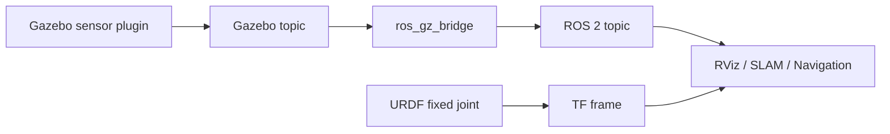
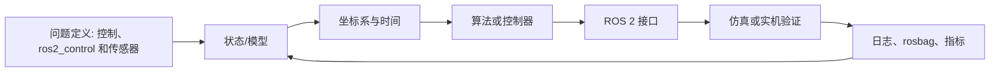

# 07 控制、ros2_control 和传感器

机器人仿真不仅要把模型放进世界，还要让它能被控制，并产生接近真实机器人的传感器数据。

## 本篇学习目标

学完本篇后，你应该能：

- 解释 `/cmd_vel` 到轮子关节再到里程计的控制链路；
- 区分 controller、controller manager、hardware interface、command/state interface；
- 写出差速控制器 YAML 的关键参数；
- 按层次排查小车不动、传感器没数据、TF 冲突和仿真时间问题。

## 控制链路

典型移动机器人控制链路：

```text
/cmd_vel
  -> diff_drive_controller
  -> left_wheel_joint / right_wheel_joint
  -> Gazebo physics
  -> odometry / joint_states / TF
```

更完整的仿真控制架构：

```mermaid
flowchart LR
  A[/cmd_vel] --> B[diff_drive_controller]
  B --> C[command interface: wheel velocity]
  C --> D[Gazebo Sim hardware/plugin layer]
  D --> E[left/right wheel joints]
  E --> F[Gazebo physics]
  F --> G[joint_states / odom]
  G --> H[robot_state_publisher / TF]
```

如果小车不动，按这条链路从左到右查；如果 TF 或 odom 不对，按这条链路从右往左查。

典型机械臂控制链路：

```text
trajectory command
  -> joint_trajectory_controller
  -> arm joints
  -> Gazebo physics
  -> joint_states / TF
```

## ros2_control 概念

`ros2_control` 把机器人控制抽象成：

- hardware interface：硬件或仿真硬件接口；
- controller manager：控制器管理器；
- controller：具体控制器；
- command interface：命令接口，如 position、velocity、effort；
- state interface：状态接口，如 position、velocity、effort。

真实机器人和仿真机器人可以尽量共用上层控制器，只替换 hardware interface。

## URDF 中的 ros2_control 片段

示例：

```xml
<ros2_control name="GazeboSystem" type="system">
  <hardware>
    <plugin>gz_ros2_control/GazeboSimSystem</plugin>
  </hardware>

  <joint name="left_wheel_joint">
    <command_interface name="velocity"/>
    <state_interface name="position"/>
    <state_interface name="velocity"/>
  </joint>

  <joint name="right_wheel_joint">
    <command_interface name="velocity"/>
    <state_interface name="position"/>
    <state_interface name="velocity"/>
  </joint>
</ros2_control>
```

具体插件名称会随 Gazebo/ROS 版本和安装包变化，写项目时要以对应发行版文档为准。

注意两类配置不要混淆：

| 配置 | 位置 | 作用 |
| --- | --- | --- |
| `<ros2_control>` | URDF/Xacro | 声明 joint 暴露哪些 command/state interface |
| Gazebo/`gz_ros2_control` 插件 | URDF/SDF/Gazebo 配置 | 把 Gazebo 仿真系统接入 ros2_control |
| `controllers.yaml` | config | 配置具体控制器，例如差速、关节轨迹、joint state broadcaster |

不同发行版的插件类名、库名和安装包可能变化。Jazzy + Gazebo Harmonic 项目应优先查 `gz_ros2_control` Jazzy 文档，而不是照搬 Gazebo Classic 的 `gazebo_ros2_control` 示例。

## controllers.yaml

差速控制器示例结构：

```yaml
controller_manager:
  ros__parameters:
    update_rate: 100

    joint_state_broadcaster:
      type: joint_state_broadcaster/JointStateBroadcaster

    diff_drive_controller:
      type: diff_drive_controller/DiffDriveController

diff_drive_controller:
  ros__parameters:
    left_wheel_names: ["left_wheel_joint"]
    right_wheel_names: ["right_wheel_joint"]
    wheel_separation: 0.33
    wheel_radius: 0.05
    cmd_vel_timeout: 0.5
    publish_rate: 50.0
    base_frame_id: base_link
    odom_frame_id: odom
    enable_odom_tf: true
```

关键参数：

- `left_wheel_names`、`right_wheel_names`：必须和 URDF joint 名称一致；
- `wheel_separation`：左右轮接触中心距离；
- `wheel_radius`：轮子半径；
- `base_frame_id`：底盘坐标系；
- `odom_frame_id`：里程计坐标系；
- `enable_odom_tf`：是否由控制器发布 odom 到 base 的 TF。

差速底盘最容易错的是三个参数：`left_wheel_names`、`right_wheel_names`、`wheel_separation`。它们必须和模型真实结构一致，否则小车可能不动、转向反、里程计尺度错误。

## 控制器加载

常见命令：

```bash
ros2 control list_controllers
ros2 control list_joints
ros2 control list_hardware_interfaces
```

加载控制器：

```bash
ros2 control load_controller --set-state active joint_state_broadcaster
ros2 control load_controller --set-state active diff_drive_controller
```

如果控制器 inactive 或 failed，检查：

- controller type 是否安装；
- YAML 缩进是否正确；
- joint 名称是否正确；
- command/state interface 是否匹配；
- hardware plugin 是否加载成功；
- Gazebo 插件是否启动。

## 发布速度命令

差速小车常用 `/cmd_vel`：

```bash
ros2 topic pub /cmd_vel geometry_msgs/msg/Twist "{linear: {x: 0.2}, angular: {z: 0.0}}"
```

原地旋转：

```bash
ros2 topic pub /cmd_vel geometry_msgs/msg/Twist "{linear: {x: 0.0}, angular: {z: 0.5}}"
```

如果小车不动：

- `/cmd_vel` 话题名是否正确；
- 控制器是否 active；
- joint interface 是否 velocity；
- 轮子 joint 是否 continuous；
- 轮子 collision 是否接触地面；
- 是否使用了 namespace；
- Gazebo 是否暂停。

## joint_states

`/joint_states` 包含关节位置、速度和力矩：

```bash
ros2 topic echo /joint_states
```

robot_state_publisher 根据 `/joint_states` 和 URDF 发布动态 TF。

注意：

- fixed joint 不出现在 `/joint_states` 中；
- continuous joint 的 position 可能不断增大；
- 如果 `/joint_states` 没有某个关节，TF 中对应 child link 可能不会按预期运动。

## 传感器建模原则

传感器不是只要有话题就行，还要关注：

- 安装位置；
- 坐标系方向；
- 更新频率；
- 延迟；
- 噪声；
- 分辨率；
- 量程；
- 是否和真实硬件一致。

传感器数据链路：



一个传感器能被算法使用，至少要同时满足：有数据、有正确 frame、有时间戳、有合理频率和噪声。

## 激光雷达

2D LiDAR 常用于 SLAM 和导航。

关键参数：

- 水平扫描角度；
- 样本数；
- 最小距离；
- 最大距离；
- 更新频率；
- 噪声。

ROS 2 中常见消息：

```text
sensor_msgs/msg/LaserScan
```

检查：

```bash
ros2 topic echo /scan
ros2 topic hz /scan
```

RViz 中添加 LaserScan 显示，fixed frame 通常设为 `base_link`、`odom` 或 `map`。

## IMU

IMU 常输出：

- orientation；
- angular_velocity；
- linear_acceleration。

ROS 2 中常见消息：

```text
sensor_msgs/msg/Imu
```

检查：

```bash
ros2 topic echo /imu
ros2 topic hz /imu
```

注意：

- IMU 坐标系方向要和真实安装一致；
- 加速度包含或不包含重力要看驱动/插件定义；
- 噪声太理想会让算法在仿真中过度乐观。

## 相机

相机常见话题：

```text
/camera/image
/camera/camera_info
/camera/depth/image
/camera/points
```

常见消息：

- `sensor_msgs/msg/Image`
- `sensor_msgs/msg/CameraInfo`
- `sensor_msgs/msg/PointCloud2`

关键参数：

- 分辨率；
- 水平视场角；
- 帧率；
- 畸变；
- 深度范围；
- 噪声；
- 光照和材质。

## 里程计

里程计常见消息：

```text
nav_msgs/msg/Odometry
```

里程计通常包含：

- pose；
- twist；
- frame_id；
- child_frame_id；
- 协方差。

移动机器人常见 TF：

```text
map -> odom -> base_footprint -> base_link
```

不要让多个节点同时发布同一段 TF，比如两个节点都发布 `odom -> base_link`，会造成 TF 冲突。

## 控制和传感器调试顺序

建议顺序：

1. 只启动 robot_state_publisher，检查 TF。
2. 启动 Gazebo，确认模型稳定。
3. 启动 joint_state_broadcaster，确认 `/joint_states`。
4. 启动底盘或关节控制器，确认 controller active。
5. 发送小速度命令，观察运动方向。
6. 加传感器，确认 Gazebo topic。
7. 加 bridge，确认 ROS 2 topic。
8. RViz 显示传感器数据。
9. 再接入导航、SLAM 或运动规划。

## 复习问题

1. controller active 但小车不动，至少列出 5 个可能原因。
2. `command_interface` 和 `state_interface` 分别表示什么？
3. 为什么不要让两个节点同时发布同一段 `odom -> base_link` TF？
4. Gazebo 能看到传感器 topic，但 ROS 2 看不到，应该先查什么？
5. 为什么 IMU 和相机的 frame 方向比“有话题”更重要？

## 参考资料

- [ros2_control Jazzy 文档](https://control.ros.org/jazzy/)
- [gz_ros2_control Jazzy 文档](https://control.ros.org/jazzy/doc/gz_ros2_control/doc/index.html)
- [diff_drive_controller 文档](https://control.ros.org/jazzy/doc/ros2_controllers/diff_drive_controller/doc/userdoc.html)
- [ros_gz 文档入口](https://gazebosim.org/docs/harmonic/ros2_overview/)
## 2026-06 深化精讲补充：控制、ros2_control 和传感器

Last researched: 2026-06-16

### 本篇在仿真体系中的位置

控制链路要把上层速度命令、控制器接口、仿真硬件和 ROS 话题连成闭环。 本篇关注的重点是：hardware interface、controller manager、diff_drive_controller、ros_gz_bridge 和传感器话题。机器人仿真不是单纯运行一个窗口，而是一条从模型文件到 ROS 2 接口、从物理引擎到上层算法的闭环链路。任何一层没有验证，后续问题都会以更隐蔽的形式出现。



Figure: 本图为面向机器人学习笔记的通用工程闭环，综合 ROS 2、REP 103/105、Nav2、Gazebo Sim 与 ros2_control 官方资料重新整理。


### 分层理解

| 层级 | 主要对象 | 应确认的问题 | 常用工具 |
| --- | --- | --- | --- |
| 模型层 | URDF、Xacro、SDF、mesh | link/joint 是否正确，单位是否为 SI，惯性和碰撞是否合理 | `xacro`、`check_urdf`、RViz |
| TF 层 | `map`、`odom`、`base_link`、传感器 frame | 坐标树是否连通，parent/child 是否正确，时间戳是否可查询 | `view_frames`、`tf2_echo` |
| 物理层 | 质量、惯量、摩擦、接触、重力 | 是否抖动、飞走、穿模，仿真步长是否稳定 | Gazebo GUI、日志 |
| 控制层 | ros2_control、controller manager、控制器 | 控制器是否 loaded/active，joint 名称和接口是否匹配 | `ros2 control`、`ros2 topic echo /cmd_vel` |
| 传感器层 | LaserScan、IMU、Image、PointCloud2 | frame、频率、QoS、噪声和桥接是否正确 | `ros2 topic hz/info -v`、RViz |
| 算法层 | SLAM、Nav2、MoveIt 2、任务节点 | 输入是否完整，生命周期是否 active，恢复策略是否有效 | Nav2 日志、rosbag2 |

### 工程流程精讲

第一步是固定版本。ROS 2、Gazebo Sim、ros_gz、ros2_control 和 Nav2 的版本组合必须以官方文档为准。Jazzy 与 Humble 的包名、默认中间件、Gazebo 推荐版本和教程细节可能不同。跟教程学习时不要混用 ROS 1、Gazebo Classic、Ignition 旧命名和 Gazebo Sim 新命名。

第二步是建立最小模型。最小模型只需要一个 `base_link`、简单几何体、必要的 `collision` 和 `inertial`。先让它在 RViz 中显示，再让它在 Gazebo 中稳定落地。这个阶段不要急着加 Nav2、SLAM 或复杂 mesh，因为它们会掩盖模型错误。

第三步是补齐控制闭环。移动机器人通常需要把 `/cmd_vel` 变成轮子关节速度，机械臂需要把轨迹控制器和关节状态接通。ros2_control 的价值是统一仿真和实机接口，但它要求硬件接口、控制器配置、joint 名称、command/state interface 严格一致。

第四步是接入传感器。Gazebo 内部 topic 和 ROS 2 topic 不是同一个系统，Gazebo Sim 常通过 `ros_gz_bridge` 进行消息桥接。桥接前要确认消息类型受支持，桥接方向正确，frame_id 和仿真时间正确传递。

第五步才是上层算法。Nav2、SLAM、定位和任务逻辑都假设底层模型、TF、控制和传感器基本可信。若底层未验证就直接调 Nav2 参数，常见结果是参数越改越乱。

### 最小验证项目

建议把本篇内容落实到一个 `my_robot_description` + `my_robot_bringup` 工作空间中：

```text
robot_ws/src/
  my_robot_description/
    urdf/
    meshes/
    rviz/
    launch/
  my_robot_bringup/
    launch/
    config/
  my_robot_control/
    config/
  my_robot_navigation/
    maps/
    params/
```

验收标准不是“能启动 Gazebo”，而是以下每一项都能独立证明：`robot_description` 能生成，TF 树连通，模型在 RViz 中方向正确，Gazebo 中不抖动，控制器 active，`/cmd_vel` 后轮子和底盘运动方向正确，传感器话题有稳定频率，`use_sim_time` 在所有相关节点一致。

### 常见实践坑

- `visual` 正常不代表 `collision` 和 `inertial` 正常。RViz 只看显示和 TF，Gazebo 还要计算物理。
- 复杂 mesh 不适合直接做碰撞。碰撞体应尽量用 box、cylinder、sphere 或简化网格。
- 动态 link 没有合理惯性时，仿真容易抖动、飞走或在接触时爆炸。
- `base_link`、`base_footprint`、`odom`、`map` 的语义要遵循 REP 105，不要为了“看起来能跑”随意改 frame 名。
- Gazebo world 坐标和 ROS `map` 坐标不是天然同一个概念。需要明确谁发布哪条 TF。
- `ros_gz_bridge` 只桥接配置过且支持的消息类型。看到 Gazebo 有 topic 不代表 ROS 2 一定能收到。
- QoS 不匹配会导致 topic 存在但订阅不到，尤其是传感器数据和地图数据。
- 仿真时间 `/clock` 必须被所有算法节点一致使用，否则 TF 查询和 rosbag 回放会出现时间错位。
- 控制器 loaded 不等于 active，active 不等于 joint interface 名称正确。
- Nav2 失败时先查 TF、里程计、传感器和 costmap，再讨论 planner/controller 参数。

### 调试顺序

1. `ros2 doctor` 和环境变量：确认 ROS 发行版、Domain ID、RMW 和 source 顺序。
2. `ros2 pkg list` / `ros2 launch`：确认包能被找到，launch 文件能被安装。
3. `ros2 param get /robot_state_publisher robot_description`：确认模型实际传入。
4. `ros2 run tf2_tools view_frames`：确认 TF 树没有断裂和重复发布。
5. Gazebo 中暂停/单步观察模型：确认物理稳定。
6. `ros2 control list_controllers`：确认控制器状态。
7. `ros2 topic info -v`：检查关键 topic 的类型、QoS、发布者和订阅者。
8. RViz 同时显示 TF、RobotModel、LaserScan、Odometry、Map 和 Path。
9. 录制 rosbag2，离线复现问题，避免每次重新跑完整仿真。

### 从仿真迁移到实机

仿真到实机的关键不是“代码完全不变”，而是接口和假设可控。URDF 可以复用，但质量、摩擦、传感器噪声、延迟和控制饱和需要实测校准。ros2_control 能让控制器层更容易复用，但硬件接口必须处理通信超时、编码器异常、电机使能、急停和安全限速。Nav2 参数也要根据真实机器人最大速度、加速度、制动距离、定位误差和传感器盲区重新调整。

### 推荐练习

- 从零写一个只有底盘和两个轮子的 URDF/Xacro，并在 RViz 中验证 TF。
- 给模型添加 collision 和 inertial，观察缺失或错误参数对 Gazebo 稳定性的影响。
- 用 ros2_control 接入差速控制器，发布 `/cmd_vel` 验证正转、倒车和原地旋转。
- 添加 2D LiDAR，用 `ros_gz_bridge` 桥接到 ROS 2，并在 RViz 中显示 `/scan`。
- 录制 `/tf`、`/odom`、`/scan`、`/cmd_vel` 和 `/clock`，用 rosbag2 回放排查。

## References and further reading

- [Official] [ROS 2 Documentation](https://docs.ros.org/)
- [Official] [ROS 2 Jazzy Documentation](https://docs.ros.org/en/jazzy/)
- [Standard] [REP 103: Standard Units of Measure and Coordinate Conventions](https://www.ros.org/reps/rep-0103.html)
- [Standard] [REP 105: Coordinate Frames for Mobile Platforms](https://www.ros.org/reps/rep-0105.html)
- [Book / Course] [Modern Robotics](https://modernrobotics.northwestern.edu/)
- [Book] [Probabilistic Robotics](https://mitpress.mit.edu/9780262303804/probabilistic-robotics/)
- [Book] [State Estimation for Robotics](https://www.cambridge.org/core/books/state-estimation-for-robotics/00E53274A2F1E6CC1A55CA5C3D1C9718)
- [Course] [MIT Underactuated Robotics](https://underactuated.mit.edu/)
- [Official] [Nav2 Documentation](https://docs.nav2.org/)
- [Official] [Gazebo Sim Documentation](https://gazebosim.org/docs/latest/)
- [Official] [SDFormat Documentation](https://sdformat.org/)
- [Official] [ros2_control Documentation](https://control.ros.org/)
- [Community] [ROS2 Control分析讲解 - CSDN](https://blog.csdn.net/Bing_Lee/article/details/135003678)
- [Community] [在机器人仿真中使用 ros2_control - CSDN](https://blog.csdn.net/apingna/article/details/148333455)
- [Community] [ROS2 SLAM 建图导航 - 掘金](https://juejin.cn/post/7101201729122730020)
- [Community] [机器人导航仿真 - 博客园](https://www.cnblogs.com/zjh1170/p/16133766.html)
- [Official] [ros2_control hardware interface types](https://control.ros.org/master/doc/ros2_control/hardware_interface/doc/hardware_interface_types_userdoc.html)
- [Official] [ros2_control CLI](https://control.ros.org/master/doc/ros2_control/ros2controlcli/doc/userdoc.html)
- [Source] [ros2_control_demos](https://github.com/ros-controls/ros2_control_demos)

<!-- research-notes: enhanced-v1 -->

## 研究笔记增强

> Last reviewed: 2026-06-17。此节用于把《07 控制、ros2_control 和传感器》从阅读笔记推进到可复习、可实践、可验证的研究笔记；具体版本、参数和环境仍需结合官方资料、项目约束和实测结果校准。

### 知识定位

把机械、电气、感知、定位、规划、控制、仿真和安全连成闭环，关注坐标、时间、状态和故障处理。

### 重点补充
- 明确坐标系、TF 树、时间戳、传感器外参和控制频率。
- 区分仿真模型、真实硬件、驱动接口和上层算法的误差来源。
- 用 rosbag、日志、rviz、仿真和实测数据复盘问题。
- 明确适用场景、限制条件、替代方案和迁移成本。

### 实践清单
- 为本章整理一张概念关系图、流程图或最小系统图。
- 写一个最小可运行示例，并保留运行命令、输入、输出和环境版本。
- 列出常见错误、排查命令、关键日志和修复动作。
- 补充安全、性能、兼容性、可维护性和上线运维注意事项。
- 用一次真实问题或练习项目复盘验证笔记是否可用。

### 常见误区
- 只摘抄定义或命令，没有记录上下文、前提条件和边界。
- 只记录成功路径，不记录失败样本、异常现象和排查过程。
- 没有版本、环境和数据样本，导致后续无法复现。
- 把教程默认值直接用于真实项目，没有结合约束重新评估。

### 复盘问题
- 学完《07 控制、ros2_control 和传感器》后，能否用自己的话说明它解决什么问题、不解决什么问题？
- 如果要在真实项目中使用，需要哪些前置条件、依赖版本、输入数据和验证手段？
- 失败时最先检查哪三类证据：日志、指标、抓包、堆栈、配置、样本还是硬件测量？
- 有没有形成可重复的最小实验、测试用例或排查命令？

### 延伸方向
- 官方文档和版本变更记录。
- 同类技术、框架或方案对比。
- 面向真实项目的最小实践。
- 故障排查清单和复盘案例库。

### 复盘记录模板

```text
主题：07 控制、ros2_control 和传感器
日期：
目标：本次要验证或掌握的具体问题
环境：系统 / 语言 / 框架 / 工具 / 设备 / 版本
步骤：最小可复现流程
现象：成功输出、失败输出、日志、指标或测量数据
分析：为什么会出现该现象，和哪些概念相关
结论：可复用的规则、命令、配置或设计取舍
风险：边界条件、性能、安全、兼容性或维护成本
下一步：继续实验、补充资料或应用到项目
```

<!-- lecture-notes:start -->

## 讲义级补充：如何真正学懂《07 控制、ros2_control 和传感器》

> 适用位置：机器人\机器人仿真笔记\07_控制、ros2_control 和传感器.md  
> 说明：本补充用于把原始提纲扩展成课堂讲义式学习材料。阅读时建议先看原文，再用本节建立知识框架、例子、实践和自测闭环。

### 1. 这一讲要解决什么问题

机器人系统把数学模型、传感器、控制器、软件中间件和真实物理世界连接起来。学习时要特别注意坐标系、时间戳、噪声、延迟和安全边界，因为真实设备不会像仿真环境那样宽容。

学习本讲时，可以用三个问题检查自己是否真的理解：

1. 它解决的真实问题是什么？
2. 如果没有它，系统会出现什么具体麻烦？
3. 在真实项目中，应该用什么现象或指标判断它做得好不好？

### 2. 核心知识拆解

可以把本讲拆成几块来学：

- 模型：坐标系、运动学、动力学和环境假设。
- 感知：传感器数据如何采集、滤波、融合和解释。
- 决策：定位、建图、规划、控制和任务状态如何衔接。
- 安全：限位、急停、碰撞检测、降级和人工接管。

拆解的好处是防止“整章都懂一点，但哪块都说不清”。复习时可以逐块追问：它的输入是什么、输出是什么、依赖什么、失败时有什么表现。

### 3. 通俗类比

可以把机器人类比成“有身体的软件”：普通程序输出错了可以重试，机器人输出错了可能撞墙、夹坏物体或伤人。因此每个算法都要考虑坐标、速度、加速度、传感器可信度和急停策略。

类比不是严格定义，但能帮助初学者先建立直觉。真正使用时，还要回到术语、公式、接口、数据结构、时序图或工程规范上，把“感觉理解”变成“可验证理解”。

### 4. 具体例子

学习《07 控制、ros2_control 和传感器》时，可以选一个最小机器人场景：给定起点、目标点和传感器输入，画出坐标变换、状态估计、规划路径和控制输出。每一步都标注单位和时间戳，很多问题会立刻暴露。

讲义级学习不能只停留在“概念解释”。至少要有一个能跑、能算、能画或能检查的例子。例子越小，越容易看清关键机制；等机制清楚后，再逐步扩展到复杂项目。

### 5. 学习路径

- 先统一坐标系、单位、时间戳和消息流，这是调试机器人问题的地基。
- 再理解感知、定位、规划、控制之间的数据依赖。
- 最后在仿真和真实设备之间对照验证，特别关注噪声、延迟和安全停止。

建议每学完一小节都做一次“复述练习”：不用看笔记，用自己的话讲清楚概念、输入、输出、关键步骤和常见错误。如果讲不清，通常说明还没有真正掌握。

### 6. 课堂讲解框架

可以按下面顺序讲解或复习本主题：

1. 背景：先讲这个知识为什么出现，它试图降低什么成本、解决什么风险或提升什么能力。
2. 基本概念：给出核心名词的准确定义，说明它们之间的关系。
3. 工作流程：按时间顺序描述一次完整过程，必要时画出流程图、状态机或数据流图。
4. 关键细节：解释最容易误解的机制，例如边界条件、异常处理、性能限制、资源生命周期或安全约束。
5. 实战例子：用一个足够小但完整的例子，把概念落到命令、代码、图纸、配置、数据或操作步骤上。
6. 反例与排错：展示错误做法会导致什么现象，再说明如何定位和修复。
7. 总结迁移：最后说明它和相邻知识点的区别、联系以及后续该学什么。

### 7. 最小实践任务

为了避免“看懂了但不会用”，建议为本讲配一个最小实践：

- 选一个可以在 30 到 90 分钟内完成的小任务。
- 明确输入、预期输出和验收标准。
- 记录遇到的第一个错误、定位过程和最终修复方法。
- 完成后写 5 行复盘：我原来以为是什么，实际是什么，下次会如何更快处理。

如果本主题偏理论，实践可以是手算一个小例子、画一张流程图、推导一个简化公式或解释一段真实日志；如果偏工程，实践应该尽量落到可运行命令、可测试代码、可检查配置或可测量硬件现象上。

### 8. 常见误区

- 坐标系命名混乱，导致算法看似正确但运动方向错误。
- 只在仿真中验证，不考虑传感器噪声、摩擦、负载和延迟。
- 没有安全边界和急停策略。

遇到这些问题时，不要急着背更多资料。更有效的办法是回到一个最小例子，把输入、状态变化、输出和验证方式重新走一遍。

### 9. 自测题

1. 用一句话说明本讲主题解决的核心问题。
2. 列出本讲最重要的 3 个概念，并说明它们的关系。
3. 举一个生活类比，再指出这个类比在哪些地方不严谨。
4. 写出一个最小实践任务的验收标准。
5. 如果结果不符合预期，你会优先检查哪 3 个环节？为什么？
6. 本讲和相邻章节的知识边界是什么？哪些问题应该交给其他章节解决？

### 10. 复习口诀

先问场景，再看输入；先拆结构，再走流程；先做小例，再谈优化；先会排错，再做规模化。

<!-- lecture-notes:end -->
